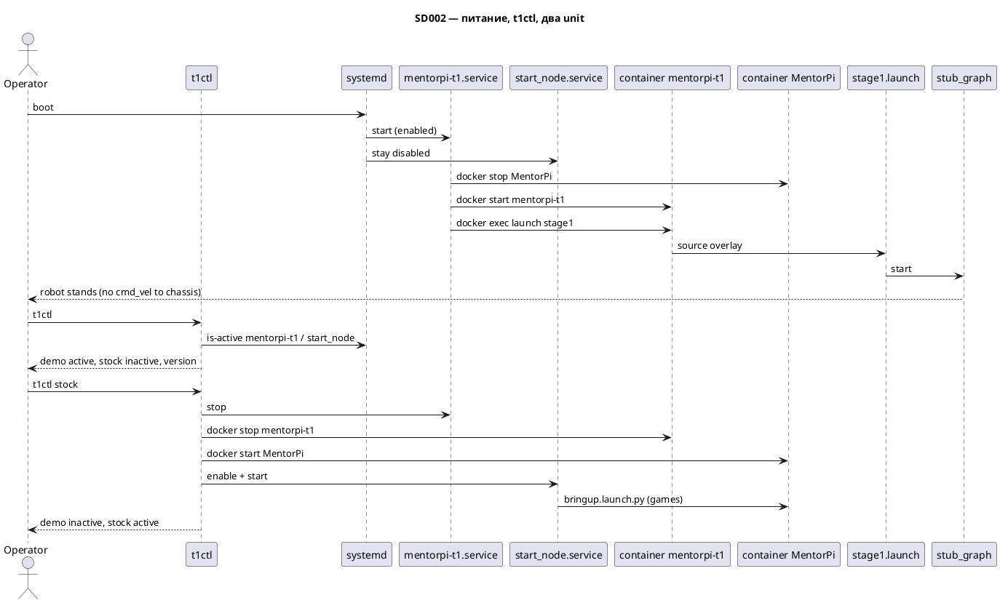

# SD002. Технический дизайн

## Системный дизайн
1. В репозитории появляется colcon overlay (`src/`): сообщения контракта этапа 1, одна C++ stub-нода, launch без Nav2/MQTT/голоса и без штатных драйверов Hiwonder (F02–F05). Штатный контейнер `MentorPi` не переписываем. База нашего образа — `Dockerfile` `FROM` image контейнера `MentorPi` (не `ros:humble` с Docker Hub); overlay — слой `COPY` → тег `mentorpi-t1`. Новый контейнер `mentorpi-t1` (host network, privileged/`/dev` как у MentorPi). `docker commit` не используем.
2. На хосте Pi (Debian 12) в PATH ставится `t1ctl` (C++, Clap, без ROS): обёртка над systemd/docker. Два system unit: `mentorpi-t1.service` (наш launch в `mentorpi-t1`) и штатный `start_node.service` (не меняем скрипт, он по-прежнему exec в `MentorPi`). Одновременно active только один unit **и** running только один контейнер. После boot включён наш unit, `start_node` disabled, `MentorPi` остановлен. Падение нашего unit не включает Hiwonder.
3. Сборка overlay не на роботе: на Mac `docker build --platform linux/arm64` — ROS overlay в `ros:humble` и `t1ctl` в `debian:12`; `install/` и бинарь копируются на Pi. Образ контура на Pi: `docker build` `FROM` image `MentorPi` + слой overlay, контейнер `mentorpi-t1`; не пересборка Hiwonder с нуля и не снимок RW штатного контейнера.
4. Не меняется: прошивка RRC/STM32, пакеты `driver/controller` в образе Hiwonder, калибровка IMU, Nav2, MQTT, голос, F24 (джойстик). В F01 нет публикации в `/controller/cmd_vel` — робот стоит, потому что игр нет и адаптера шасси ещё нет. Синий LED/драйвер шасси — не этот SD (F02/F04), сознательное сужение относительно фразы BA про индикацию платформы.

## Программные интерфейсы

### ROS 2 (контракт SD001, в F01 только заглушки)
1. `/control/state` — `mentorpi_msgs/msg/ControlState`: `state` enum `FORBIDDEN=0`, `MANUAL=1`, `AUTO_FOLLOW=2`. Stub: `AUTO_FOLLOW`.
2. `/perception/persons` — `mentorpi_msgs/msg/PersonArray`: список `PersonHypothesis` (`track_id`, `x`, `y`, `range`, `confidence`). Stub: пустой массив.
3. `/perception/nearest_person` — `mentorpi_msgs/msg/NearestPerson`: `valid` bool + `PersonHypothesis`. Stub: `valid=false`.
4. `/pnc/desired_twist` — `geometry_msgs/msg/Twist`. Stub: нули.
5. `/control/motion_restriction` — `mentorpi_msgs/msg/MotionRestriction`: `stop_request` bool, `reason` string. Stub: `stop_request=false`.
6. `/vehicle/cmd_vel` — `geometry_msgs/msg/Twist`. Stub: нули. Не публикуем `/controller/cmd_vel` и не трогаем `/cmd_vel`.

### Host CLI `t1ctl` (макеты `design/`)
1. Команды: `t1ctl` / `status`, `start`, `restart`, `stock`, `-h`/`--help`, `-V`/`--version`. English; ключи и systemd-значения lowercase; сетка 80 колонок. Линейки `=---` нет.
2. Статус: `demo` = active | inactive | failed (`mentorpi-t1.service`); `stock` = inactive | active (`start_node.service`); `version` = `0.1.0`. Строки chassis нет (`t1ctl` шасси не измеряет).
3. `start`/`restart`: stop+disable `start_node`, `docker stop MentorPi`, enable+start `mentorpi-t1`. `stock`: stop+disable наш, `docker stop mentorpi-t1`, `docker start MentorPi`, enable+start `start_node`. Успех: строка `Started.` / `Restarted.` / `Restored stock autostart.` и kv. Ошибка старта: stderr `error: demo start failed`, exit 1.
4. Нет `--plain`/JSON. `NO_COLOR` / не-TTY: тот же текст без ANSI.

### systemd / Docker / sudo
1. Unit `mentorpi-t1.service`: `After=docker.service`, `Restart=no` (как у `start_node`: нет автоотката на Hiwonder). `ExecStartPre`: `docker stop MentorPi` (уже остановлен — не ошибка), затем `docker start mentorpi-t1`. Exec: `docker exec` пользователя `ubuntu` в `mentorpi-t1` → `ros2 launch mentorpi_bringup stage1.launch.py`.
2. В каждом режиме running только один контейнер. `mentorpi-t1` с `--restart no` (не копировать `always` у `MentorPi`). Штатный `MentorPi` не `docker rm`.
3. sudoers.d: пользователь `pi` без пароля на `systemctl start|stop|restart|enable|disable` только этих двух unit.

### Storage
1. Overlay в контейнере: `/home/ubuntu/mentorpi_t1_ws/`. Конфиг `config/common`, `config/platform/t1` — каталоги-заготовки, без ролей флота.
2. Хост: `/usr/local/bin/t1ctl`, `/etc/systemd/system/mentorpi-t1.service`, `/etc/sudoers.d/t1ctl`.

## Изменения в приложениях

Репозиторий сейчас без `src/`. На образе Hiwonder не меняем логику драйверов; меняем только автозапуск (наш unit vs `start_node`).

| Компонент | Суть изменения |
|-----------|----------------|
| `mentorpi_msgs` | msg контракта этапа 1 |
| `mentorpi_stubs` | одна нода `stub_graph`, живые топики |
| `mentorpi_bringup` | `stage1.launch.py` |
| `t1ctl` | host CLI (не ament) |
| `scripts/` | Mac arm64 build + copy на Pi; Pi: `FROM` image `MentorPi` + контейнер |
| `docker/mentorpi-t1` | Dockerfile overlay-слоя |
| `mentorpi-t1.service` + sudoers | автозапуск нашего контура |
| Hiwonder `start_node.service` / `bringup.launch.py` | не редактируем; только enable/disable |

### mentorpi_msgs
1. Добавить msg из списка интерфейсов.
2. Не тащить Nav2/mqtt/voice типы.

### mentorpi_stubs
1. Публиковать контракт на низкой частоте (например 10 Hz). AutoFollow, пустые люди, нулевые Twist.
2. Не подписываться на лидар/камеру. Не писать `/controller/cmd_vel`.

### mentorpi_bringup
1. Launch только stub-ноды. Комментарий-якорь под будущие F02–F14.
2. Не include `start_app`, `lidar_controller`, `joystick_control`, rosbridge, web_video_server.

### t1ctl
1. Реализовать кадры help/status/start/restart/error/stock. Цвет — ANSI-роли из `design/AGENTS.md`; без зависимостей ROS.
2. Не ходить в ROS graph для статуса (источник истины — systemd).

### scripts
1. `build-arm64.sh` / `deploy-pi.sh`: сборка overlay и `t1ctl` на Mac, копирование на Pi. Если контейнер `mentorpi-t1` уже есть — `docker cp` overlay (без пересборки image).
2. `provision-pi.sh`: на Pi `docker build -t mentorpi-t1` (`FROM` image `MentorPi`, `COPY` overlay), контейнер `mentorpi-t1` с `--restart no`. Короткий `docs/SD002/ops.md`: FROM, create, один running контейнер на режим. `FORCE_REBUILD=1` пересобирает image.
3. `docker/mentorpi-t1/Dockerfile`: только `FROM ${BASE_IMAGE}` и `COPY` overlay. Не colcon, не `FROM ros:humble` с Docker Hub.

### host systemd / Docker
1. Новый unit и контейнер `mentorpi-t1`. Штатный `MentorPi` + `start_node.sh` без правок.
2. Не `docker rm` MentorPi. Не калибровать IMU, не шить STM32.

## ToDo
Порядок: контракт и заглушки собираются на Mac, затем CLI и взаимное исключение unit, затем вынос образа/контейнера на Pi.

- [x] T1. Пакет `mentorpi_msgs` в `src/mentorpi_msgs`
  - **Делает:** типы ControlState, PersonHypothesis, PersonArray, NearestPerson, MotionRestriction
  - **Файлы:** `src/mentorpi_msgs/`
  - **Готово когда:** пакет собирается в linux/arm64 humble
  - **Проверка:** `ros2 interface show mentorpi_msgs/msg/ControlState`

- [x] T2. Нода `stub_graph` в `src/mentorpi_stubs`
  - **Делает:** живой контракт топиков, нули/пусто/AutoFollow
  - **Файлы:** `src/mentorpi_stubs/`
  - **Готово когда:** шесть топиков публикуются, `/controller/cmd_vel` нет
  - **Проверка:** `ros2 topic list` / `echo` на каждом контрактном топике

- [x] T3. Launch этапа 1 в `src/mentorpi_bringup`
  - **Делает:** `stage1.launch.py` только stubs; без app Hiwonder и без SIT-драйверов
  - **Файлы:** `src/mentorpi_bringup/launch/stage1.launch.py`
  - **Готово когда:** `ros2 launch mentorpi_bringup stage1.launch.py` поднимает только stub_graph
  - **Проверка:** `ros2 node list` — нет `lidar_app` / `start_app`

- [x] T4. Host CLI `t1ctl` по макетам
  - **Делает:** help, status, start, restart, stock, version; English; `demo`/`stock` systemd; version 0.1.0
  - **Файлы:** `host/t1ctl/`
  - **Готово когда:** вывод совпадает с кадрами `docs/SD002/design/Вывод — *.html` (без chrome)
  - **Проверка:** `--help`, `--version`, status при inactive unit (`demo inactive`)

- [x] T5. systemd `mentorpi-t1.service`, sudoers, взаимное исключение с `start_node`
  - **Делает:** после boot наш unit; `t1ctl stock` возвращает Hiwonder; нет автоотката при падении
  - **Файлы:** `host/systemd/mentorpi-t1.service`, `host/sudoers.d/t1ctl`
  - **Готово когда:** два unit не active одновременно; Restart=no
  - **Проверка:** `t1ctl start` / `t1ctl stock` / `systemctl is-active` обоих

- [x] T6. Сборка на Mac и вынос на Pi
  - **Делает:** arm64 overlay + t1ctl; rsync install в `mentorpi-t1`; t1ctl в `/usr/local/bin`
  - **Файлы:** `scripts/build-arm64.sh`, `scripts/deploy-pi.sh`
  - **Готово когда:** с Mac без colcon на роботе появляется рабочий overlay и бинарь
  - **Проверка:** скрипт отрабатывает; на Pi `t1ctl --version` → 0.1.0

- [x] T7. Контейнер-образ от MentorPi
  - **Делает:** `Dockerfile` `FROM` image `MentorPi` → тег `mentorpi-t1`; контейнер `mentorpi-t1`; documented конфликт с app Hiwonder
  - **Файлы:** `docker/mentorpi-t1/Dockerfile`, `scripts/provision-pi.sh`, `docs/SD002/ops.md` (коротко: FROM, create, не два launch сразу)
  - **Готово когда:** штатный `MentorPi` не изменён; наш контейнер стартует launch overlay
  - **Проверка:** `docker ps` — running только контейнер активного режима; ROS-граф игр только при stock
