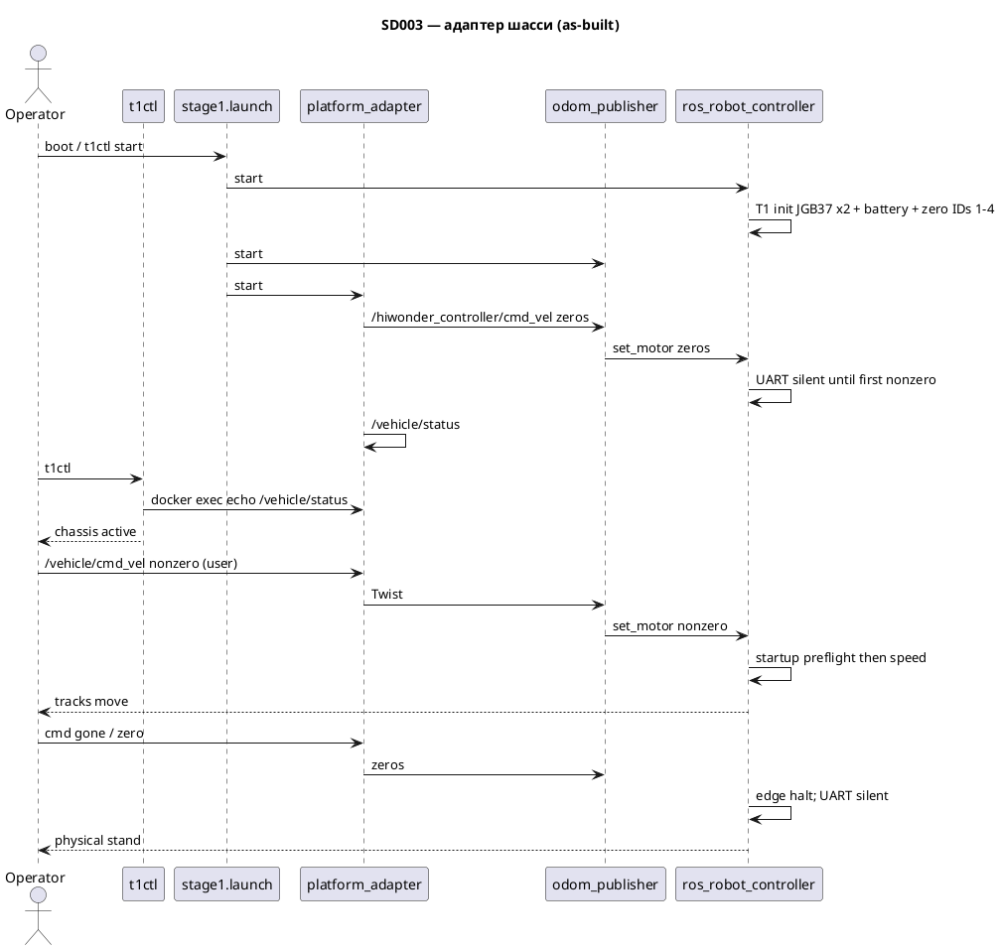

# SD003. Технический дизайн

## Системный дизайн
1. C++ нода `platform_adapter` (пакет `mentorpi_platform`): подписка `/vehicle/cmd_vel` и `/control/state`, публикация на `/hiwonder_controller/cmd_vel` (`geometry_msgs/Twist`) и `/vehicle/status`. Каталожный литерал SD001 `/controller/cmd_vel` на этом стенде шасси не слушает. Overlay **не** публикует `/cmd_vel`. Единственный Twist-owner шасси — `platform_adapter`.
2. В `stage1.launch.py` поднимаются overlay-пакеты (не `bringup.launch.py`, не игры, не IMU/EKF/servo): `ros_robot_controller` и `odom_publisher` из overlay `hiwonder_controller`, плюс `platform_adapter`. `odom_publisher` слушает **только** `/hiwonder_controller/cmd_vel` (подписки на `/cmd_vel` нет) и пишет `MotorsState` в `ros_robot_controller/set_motor`. Overlay `setup.bash` последним перекрывает одноимённые пакеты образа. `MACHINE_TYPE=MentorPi_Tank` (unit и launch); `.hiwonderrc` образа ставит JetRover_Mecanum — overlay это переопределяет, JetRover_Mecanum не канон стенда. `odom_raw` появляется побочно — F04 этим SD не закрываем. URDF не include — F07.
3. Unit `mentorpi-t1.service` запускает launch в **bash**: `/home/ubuntu/ros2_ws/.hiwonderrc`, затем `export MACHINE_TYPE=MentorPi_Tank`, затем overlay `setup.bash`, `exec ros2 launch mentorpi_bringup stage1.launch.py`. `setup.bash` overlay в zsh ломается (`BASH_SOURCE`) — unit не zsh.
4. Watchdog и Forbidden — программный гейт адаптера, не SLA. Нет `/vehicle/cmd_vel` дольше `cmd_timeout_ms` (параметр, по умолчанию 100) → на выход адаптера нулевой Twist. `ControlState.state == FORBIDDEN` → нули независимо от Twist. Нет `/control/state` — не Forbidden, команду пропускаем. MANUAL и AUTO_FOLLOW адаптер не реализует (enum в msg — заготовка). Публикация шасси: event сразу по входу; таймер — keepalive, только если с последней отправки прошёл период `1/rate_hz` (параметр `rate_hz`, по умолчанию 20). Нет event+timer дубликата. ROS-нули на выходе адаптера **не** равны физическому стопу: STM32 держит последний RPS, пока RRC не сделает T1 UART halt.
5. `stub_graph` не публикует `/vehicle/cmd_vel`. Остальные пять топиков контракта SD002 — как есть. По умолчанию входа нет → watchdog → ROS-нули; после constructor-init UART молчит (повторные zero на провод не идут). Если ранее был ненулевой RPS — один runtime halt, затем снова тишина (п. 10).
6. `t1ctl` без ROS: контейнер `mentorpi-t1` running (не бит systemd Active) → один `docker exec` bash-probe. Chassis: `timeout 2 ros2 topic echo --once /vehicle/status`; успех → `chassis active`, иначе `inactive`. Поля msg не разбираются. Весь exec повторяется до `kRosProbeAttempts` (2), чтобы холодный DDS/daemon не давал ложный `inactive`. Это устойчивость probe, не SLA. Дизайн-макеты не делаем: то же kv, что SD002; ширину колонки ключа задаёт SD004 (18).
7. Единственный владелец UART `/dev/rrc` — процесс overlay `ros_robot_controller`. Второй Board/RRC/halt-скрипт на том же serial **запрещён**, пока RRC жив. На каждом старте RRC, до любой скорости: `enable_reception`, затем T1 motor init: `set_motor_type(0x01 JGB37)` дважды, `set_battery_level(0x1af4)`, полный `set_motor_speed` zero IDs 1–4. Constructor-init — стоянка после open serial; STM32/USB-CDC к этому моменту может ещё не принять type, поэтому первый ненулевой кадр процесса идёт через startup preflight (п. 10).
8. Критерий стоянки — **физический**: гусеницы не вращаются, моторы не шумят в покое. `ros2 topic echo` нулей (`Twist` или `MotorsState`) **не** доказательство стопа и не доказательство тишины UART. Снятое решение: пакет `motor_rps_canon` и «signed-zero гарантирует остановку» — ложная гарантия; IEEE `-0.0` в mapping по-прежнему нормализуется в `+0.0` как гигиена, но стоп даёт только T1 UART init.
9. Не меняется: прошивка STM32, публикация follow напрямую на шасси, Nav2/MQTT/голос. Пульт — SD004; этот SD не пишет Twist с джойстика. Движение на стенде — только пользователь; агент ненулевой Twist не публикует.
10. Runtime halt — тот же UART, тот же единственный владелец `/dev/rrc`. Решает `T1MotorGate` (не 20/50 Гц spam). Состояния: после старта процесса `startup_preflight=True`, `had_nonzero=False`. Полный zero IDs 1–4 при `had_nonzero=True` → один T1 init (type×2, battery, full zero), `send_speed=False`; дальше UART **молчит** до следующего реально ненулевого RPS (`halt=False`, `send_speed=False`). Прямой реверс знака всех четырёх моторов без промежуточного нуля: halt, затем новый speed-frame, в одном serial lock, без искусственной паузы. **Startup preflight:** первый ненулевой motor-кадр процесса в том же lock — T1 halt/init, drain, затем **исходный** speed без смены знаков. После runtime halt следующий nonzero — только speed (preflight израсходован). Новый процесс / новый `T1MotorGate` снова вооружает preflight. Длинный idle после halt preflight не реактивирует (`idle_preflight_s` по умолчанию 0 — нет init-storm). Drain — `serial.flush` уже записанных байт, не sleep. Shutdown RRC: `dispatch_motors(halt=True)`. Teardown: `t1-stop` убивает launch/ноды (включая leftover RRC), затем `t1-uart-halt` на свободном `/dev/rrc` (тот же init, `zero_repeats=3`). Параллельно с живым RRC halt-скрипт не запускают.
11. Tank mapping — один слой `hiwonder_controller.tank_kinematics` / `MecanumChassis.set_velocity`: stock MentorPi_Tank инвертирует моторы 1/2 (`[-m1,-m2,m3,m4]` на `+Twist.linear.x`). Extra-инверсия `linear.x` снята. `angular.z` / pivot без изменений. `pad_teleop` стик-вперёд → `+Twist.linear.x` повторно не инвертируем. Per-side gain / min-RPS с ненулевым дефолтом в mapping нет. Порог трогания — командный слой SD004.

## Программные интерфейсы

### ROS 2, наш контур
1. `/vehicle/cmd_vel` — `geometry_msgs/msg/Twist`. Вход адаптера. Stub не публикует. Нет сообщений дольше `cmd_timeout_ms` (по умолчанию 100) → выход адаптера — нулевой Twist (далее hardware halt в RRC, если ранее был ненулевой RPS).
2. `/control/state` — `mentorpi_msgs/msg/ControlState`. Реализуется только `FORBIDDEN=0` → нули на выходе адаптера. `MANUAL=1`, `AUTO_FOLLOW=2` без особой логики адаптера. Нет сообщений — не Forbidden.
3. `/vehicle/status` — `mentorpi_msgs/msg/ChassisStatus`: `bool command_timeout`, `bool forbidden`. Публикация с event/keepalive, чтобы echo --once не висел. Контракт для t1ctl — топик жив / не жив, не разбор полей.
4. `/hiwonder_controller/cmd_vel` — `geometry_msgs/msg/Twist`. Единственный выход адаптера на шасси. Не `/controller/cmd_vel`, не `/cmd_vel`.

### ROS 2, overlay драйвер
1. `odom_publisher` подписывается только на `/hiwonder_controller/cmd_vel`. `/cmd_vel` не слушает и не является входом контура. Пишет `ros_robot_controller/set_motor` (`MotorsState`, IDs 1–4).
2. `ros_robot_controller` принимает `~/set_motor`. IMU raw / battery не статус t1ctl. Joy RRC — запасной вход пульта SD004; на этом стенде приёмник в USB Pi, этот топик молчит.
3. UART `/dev/rrc`: кадры T1 init `set_motor_type(0x01)` ×2, `set_battery_level(0x1af4)`, полный zero IDs 1–4. Runtime speed — только при `send_speed=True`.

### Host CLI `t1ctl`
1. Ключ `chassis`: `active` | `inactive`.
2. `active` — контейнер `mentorpi-t1` running и unified probe увидел успешный echo `/vehicle/status` (до 2 попыток). Иначе `inactive` (stock, demo down, нет ноды, исчерпан timeout echo).
3. Help STATUS: строка `chassis` в том же формате, что остальные ключи. Команды CLI не меняются.

### systemd
1. `ExecStart` docker exec **bash**: `source /home/ubuntu/ros2_ws/.hiwonderrc`; `export MACHINE_TYPE=MentorPi_Tank`; `source /home/ubuntu/mentorpi_t1_ws/install/setup.bash`; `exec ros2 launch mentorpi_bringup stage1.launch.py`.
2. `ExecStop` — `docker exec` абсолютного пути `t1-stop` в overlay.

### Параметры адаптера
1. `cmd_timeout_ms` default `100`. `rate_hz` default `20`. Выходной таймер — keepalive с периодом `1/rate_hz`, если event уже отправил кадр в этом периоде; не SLA.
2. `T1MotorGate.idle_preflight_s` default `0`.

### Тесты
1. `src/mentorpi_platform/test/test_adapter_gate.cpp` — watchdog / Forbidden / нет команды → нулевой Twist; timer keepalive без дубля.
2. `src/hiwonder_controller/test/test_tank_mapping.py` — MentorPi_Tank знаки 1/2, реверс всех четырёх, yaw без extra invert, stop без IEEE `-0.0`.
3. `src/ros_robot_controller/test/test_t1_init_packets.py` — байты type / battery `0x1af4` / full zero IDs 1–4.
4. `src/ros_robot_controller/test/test_t1_runtime.py` — preflight, edge halt, suppress zero UART, прямой реверс, shutdown halt, lock.
5. `host/t1ctl/tests/test_status.cpp` — chassis probe, retry, контейнер vs systemd.

## Изменения в приложениях

| Компонент | Суть изменения |
|-----------|----------------|
| `mentorpi_msgs` | msg `ChassisStatus` |
| `mentorpi_platform` | нода `platform_adapter`: gate + event/keepalive |
| `mentorpi_stubs` | нет publisher `/vehicle/cmd_vel` |
| `mentorpi_bringup` | SIT: overlay RRC + odom + adapter; teardown `t1-stop` / `t1-uart-halt` |
| `ros_robot_controller` | overlay: T1 init, startup preflight, runtime edge-halt, suppress zero UART, shutdown halt |
| `hiwonder_controller` | overlay: MentorPi_Tank mapping, без подписки `/cmd_vel` |
| `mentorpi-t1.service` | bash source vendor + `MACHINE_TYPE=MentorPi_Tank`; ExecStop → `t1-stop` |
| `t1ctl` | поле `chassis`; unified probe с retry |
| `README.md`, `docs/SD002/ops.md`, `AGENTS.md` | топик шасси, запрет агенту двигать робота |

### mentorpi_msgs
1. `ChassisStatus.msg`.
2. Enum `ControlState` не трогать (FORBIDDEN/MANUAL/AUTO_FOLLOW).

### mentorpi_platform
1. Нода: sub `/vehicle/cmd_vel`, `/control/state`; pub `/hiwonder_controller/cmd_vel`, `/vehicle/status`.
2. Не лидар, не `/cmd_vel`, не второй publisher из follow.

### mentorpi_stubs
1. Нет публикации `/vehicle/cmd_vel`.
2. Остальной контракт SD002 без изменений.

### mentorpi_bringup
1. Node overlay `ros_robot_controller` + `odom_publisher` + `platform_adapter`.
2. Не include `hiwonder_controller.launch.py` целиком. Не `bringup.launch.py`, не joystick, не lidar_controller.
3. `t1-stop`: SIGTERM launch, ожидание, SIGKILL leftover `--ros-args` и `ros_robot_controller`, затем `t1-uart-halt` если RRC мёртв.

### ros_robot_controller
1. Overlay-пакет тех же имён, что образ. Constructor T1 init. `T1MotorGate` + `Board.dispatch_motors`.
2. Не второй процесс на `/dev/rrc`.

### hiwonder_controller
1. Overlay `odom_publisher`: `MACHINE_TYPE=MentorPi_Tank`, mapping через `tank_kinematics`, только `/hiwonder_controller/cmd_vel`.
2. Не JetRover_Mecanum invert 3/4. Не extra flip `linear.x`.

### t1ctl
1. `units::Status` + `chassis`; query через docker exec echo, без rclcpp.
2. Не менять семантику demo/stock и взаимное исключение контейнеров.

### host systemd
1. Source vendor через bash `.hiwonderrc` перед overlay `setup.bash`.
2. `ExecStop` — одна строка `docker exec …/t1-stop`. Не перечислять имена нод.
3. Не править `start_node.sh` / `.hiwonderrc`.

### scripts / docs
1. README/ops: SIT в нашем launch, `chassis` в t1ctl, робот по умолчанию стоит. Операторский probe на `/vehicle/cmd_vel` снят.
2. AGENTS: overlay пишет на шасси только из `platform_adapter`; ненулевой Twist — только пользователь.

## ToDo
Порядок: контракт статуса → адаптер → чтобы не дрались stub и вход адаптера → SIT в launch и source vendor → t1ctl → доки.

- [x] T1. Msg `ChassisStatus`
  - **Делает:** тип `/vehicle/status`
  - **Файлы:** `src/mentorpi_msgs/`
  - **Готово когда:** `ros2 interface show mentorpi_msgs/msg/ChassisStatus`
  - **Проверка:** поля `command_timeout`, `forbidden`

- [x] T2. Нода `platform_adapter`
  - **Делает:** Twist→`/hiwonder_controller/cmd_vel`, Forbidden и watchdog `cmd_timeout_ms`, публикация статуса
  - **Файлы:** `src/mentorpi_platform/`
  - **Готово когда:** без входа на выход адаптера нули; FORBIDDEN нули; после паузы >`cmd_timeout_ms` нули (физический стоп — RRC halt, не echo)
  - **Проверка:** echo cmd_vel и status на столе/bag без движения (нули)

- [x] T3. `stub_graph` без `/vehicle/cmd_vel`
  - **Делает:** вход адаптера свободен
  - **Файлы:** `src/mentorpi_stubs/src/stub_graph.cpp`
  - **Готово когда:** `ros2 topic list` — нет publisher stub на `/vehicle/cmd_vel`
  - **Проверка:** `ros2 topic info /vehicle/cmd_vel`

- [x] T4. Launch SIT: overlay RRC + odom + adapter
  - **Делает:** реальное управление шасси в нашем графе без игр
  - **Файлы:** `src/mentorpi_bringup/launch/stage1.launch.py`, `package.xml`
  - **Готово когда:** в графе `ros_robot_controller`, `odom_publisher`, `platform_adapter`; нет start_app / joystick
  - **Проверка:** `ros2 node list` после launch

- [x] T5. Source vendor workspace в unit
  - **Делает:** пакеты образа видны из bash launch; overlay setup последним
  - **Файлы:** `host/systemd/mentorpi-t1.service`
  - **Готово когда:** `ros2 pkg prefix hiwonder_controller` в том же docker exec, что unit — overlay path
  - **Проверка:** prefix не «Package not found»

- [x] T6. `chassis` в `t1ctl`
  - **Делает:** статус шасси из топика
  - **Файлы:** `host/t1ctl/`
  - **Готово когда:** при живом `/vehicle/status` — `chassis active`; контейнер down — `inactive`; запрос сразу после старта не показывает ложный `inactive`
  - **Проверка:** `t1ctl` и `t1ctl --help` (строка chassis); `test_status`

- [x] T7. Скрипт проверки для пользователя (снят)
  - **Делает:** был probe на `/vehicle/cmd_vel`; исполняемый снят
  - **Файлы:** —
  - **Готово когда:** в пакете `mentorpi_bringup` нет probe; движение — только оператор
  - **Проверка:** агент ненулевой Twist не публикует

- [x] T8. README, ops, AGENTS
  - **Делает:** топик шасси, `chassis`, запрет агенту двигать робота; только adapter, нули по умолчанию
  - **Файлы:** `README.md`, `docs/SD002/ops.md`, `AGENTS.md`
  - **Готово когда:** операторские доки не противоречат F02
  - **Проверка:** чтение трёх файлов
