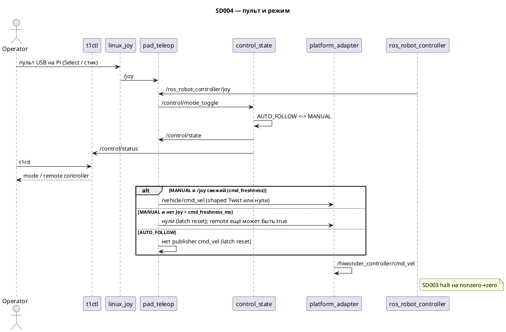

# SD004. Технический дизайн

## Системный дизайн
1. В overlay три C++ ноды пакета `mentorpi_control`. `control_state` — хозяин `/control/state` (`FORBIDDEN` не публикуем): после старта `AUTO_FOLLOW`, по фронту кнопки пульта — `AUTO_FOLLOW` ↔ `MANUAL`. На этом стенде штатный 2.4G-приёмник в USB **Raspberry Pi** (ShanWan `2563:0575`, Linux `USB WirelessGamepad`, `/dev/input/by-id/usb-2563_USB_WirelessGamepad-joystick`, обычно `js0`). `linux_joy` открывает Linux-джойстик (сначала by-id с подстрокой `WirelessGamepad`, иначе первый читаемый `js*`; файла при старте нет — ретрай, launch не блокируется) и публикует `/joy`. `pad_teleop` читает `/joy` и запасной `/ros_robot_controller/joy` (приёмник в USB-host RRC). Связь, фронт Select → переключение, в `MANUAL` стик → Twist на `/vehicle/cmd_vel`. В `AUTO_FOLLOW` паблишера `/vehicle/cmd_vel` нет (publisher сбрасывается, latch shaping сбрасывается). Штатный pygame `joystick_control` и ROS 2 SDL `joy_node` не используем: `joy_node` игнорирует `dev`, в Docker без дисплея панель не видит; stock едет, потому что pygame сам ждёт `js0`.
2. Единственный выход на гусеницы — `platform_adapter`: `/vehicle/cmd_vel` → `/hiwonder_controller/cmd_vel`. Пульт не пишет `/cmd_vel`. В Manual адаптер не видит Forbidden — команда проходит; F13 ещё нет, обход охраны — тем, что стоп-гейта нет. Когда F13 появится, она обязана пропускать Manual (это SD фиксирует, код гейта не пишем).
3. Связь разделена на два окна, оба по **времени приёма** `/joy` (`steady_clock` в callback), не `Joy.header.stamp` (keepalive `linux_joy` переписывает stamp без HID-события). **Команда:** нет свежего `/joy` дольше `cmd_freshness_ms` (параметр, default 100 = `2 * (1000 / rate_hz)` при 20 Гц, то же число, что `cmd_timeout_ms` адаптера) → в Manual нулевой Twist, latch сброшен. **Пульт на связи (`remote`):** нет `/joy` дольше `joy_timeout_ms` (default 1000) → `remote_controller` false. Режим остаётся `MANUAL`. Удержание стика: joydev не шлёт события без изменения оси; keepalive на открытом fd продолжает `/joy`, команда жива. Обрыв USB/js fd (ENODEV/HUP) останавливает `/joy` → нули за `cmd_freshness_ms`. RF 2.4G при живом USB-донге через JS API неотличим от удержания стика — idle не считаем disconnect.
4. Кнопка режима — **Select**: индекс 10 на разборе `get_gamepad` RRC (`mode_button`); на Linux ShanWan — индекс 8 (`mode_button_linux`). Один восходящий фронт — одно `/control/mode_toggle`. `stub_graph` не публикует `/control/state`.
5. `t1ctl` без ROS: если контейнер `mentorpi-t1` **running** (systemd Active может отставать), один `docker exec` зондирует оба топика. Chassis: `timeout 2 ros2 topic echo --once /vehicle/status`. Control: `timeout 2 ros2 topic echo --once --qos-durability transient_local --qos-reliability reliable /control/status` (`control_state` публикует `/control/status` reliable + transient_local). YAML: `state` → `mode follow|manual`, `remote_controller` true/false → `remote controller active|inactive`. Разобранный `false` — валидный статус, не timeout и не повтор probe. Весь exec — до `kRosProbeAttempts` (2) на холодный промах daemon/DDS. Контейнер down — probe нет: `mode follow`, `remote controller inactive`, `chassis inactive`. Ключ в CLI — **`remote controller`** (не `remote`); макеты SD004 с `remote` не трогаем. Колонка ключа kv/help — 18 символов.
6. Не меняется: прошивка STM32, адаптер Forbidden/watchdog (`cmd_timeout_ms` default 100 — параметр), команды `t1ctl` start/restart/stock, вендорский bringup. Overlay RRC / tank — SD003. Агент ненулевой Twist не публикует.
7. Joy→Twist (до tank mapping), оси независимо. Знаки как stock `val_map(v, 1, -1, -max, max)` = `-max * shape(v)`: linux-ось вперёд отрицательная → `+Twist.linear.x`; yaw-ось отрицательная → `+Twist.angular.z`. `linear_axis=1`, `angular_axis=2`. Clamp сырой оси в `[-1, 1]`. Schmitt: |axis| ≤ `enter` и latch выкл → 0; пересечение `enter` → latch вкл, сразу ±min, далее линейно до max; |axis| ≤ `release` → 0 и latch сброс. Anti-deadzone: после renormalize остатка диапазона над `enter` величина `|u|` масштабируется на `[min_out, max_out]`. Нет smoothing, low-pass, ramp. Latch сбрасывается на физический центр, stale command, disconnect, Follow и не-MANUAL (Forbidden). Параметры стенда (не SLA): `max_linear=0.5`, `max_angular=2.0`, `enter=0.10`, `release=0.06`, `linear_min=0.10` m/s, `angular_min=0.40` rad/s. Старый одиночный `deadzone` снят.
8. Stop-on-release на software path сразу даёт zero Twist (`pad_teleop` → `platform_adapter` → `/hiwonder_controller/cmd_vel`). **Физический стоп делегирован SD003:** RRC edge-halt на nonzero→zero, UART молчит до следующего nonzero; ROS zero ≠ UART zero spam. Прямой реверс и startup preflight — SD003; знаки/shaping/cadence пульта их не подменяют. Extra linear invert в `tank_kinematics` снят. Cadence пульта: event сразу по Joy; таймер keepalive только если прошёл период `1/rate_hz` — без дубля event+timer, не SLA. Keepalive нужен, чтобы watchdog адаптера не принял стоянку/удержание за пропажу команды.
9. Критерий стоянки — физический и операторский (гусеницы не крутятся, моторы не шумят). Нули в `ros2 topic echo` недостаточны.

## Программные интерфейсы

### ROS 2, наш контур
1. `/control/state` — `mentorpi_msgs/msg/ControlState`. Хозяин — `control_state`. QoS: reliable, transient_local, depth 1. Значения: `AUTO_FOLLOW=2` (дефолт), `MANUAL=1`. Нет `/control/state` для адаптера — не Forbidden (SD003).
2. `/control/mode_toggle` — `std_msgs/msg/Empty`. Паблишер — `pad_teleop` на восходящем фронте `mode_button` / `mode_button_linux`. Один кадр — одно переключение, удержание не повторяет.
3. `/control/remote_controller` — `std_msgs/msg/Bool`. `true`, пока последний Joy (время приёма) не старше `joy_timeout_ms`. Публикация с таймера `pad_teleop`. Это **присутствие пульта**, не свежесть команды.
4. `/control/status` — `mentorpi_msgs/msg/ControlStatus`: `uint8 state`, `bool remote_controller`. Хозяин — `control_state` (копия state + watchdog `remote_timeout_ms` на Bool). QoS: reliable, transient_local, depth 1 (late t1ctl). Контракт t1ctl: топик жив и поля разобраны; `remote_controller: false` валиден.
5. `/vehicle/cmd_vel` — `geometry_msgs/msg/Twist`. В Manual `pad_teleop` публикует сразу по свежему Joy. Таймер — keepalive по `1/rate_hz`, без дубля. Нет `/joy` дольше `cmd_freshness_ms` → нули, даже если `remote_controller` ещё true. В AutoFollow паблишера пульта нет.
6. `/joy` — `sensor_msgs/msg/Joy`. Хозяин на этом стенде — `linux_joy`. Не SDL `joy_node`.
7. `/ros_robot_controller/joy` — запасной вход. Оси RRC: `[lx, ly, rx, ry, …]`; линейная = `axes[1]`, угловая = `axes[2]`.

### Joy→Twist (функции модуля)
1. `shape_axis(raw, AxisShapeParams, AxisLatch)` → единица в `[-1, 1]`, точный 0 на нейтрали/release.
2. `joy_axes_to_twist`: `linear.x = -max_linear * shape(axis1)`, `angular.z = -max_angular * shape(axis2)`.
3. `decide_pad`: не Manual или не `command_fresh` → `state.reset()`, нулевой Twist; `remote` живёт отдельным флагом `remote_fresh`.

### Host CLI `t1ctl`
1. Ключи: `mode` (`follow` | `manual`) и `remote controller` (`active` | `inactive`). Порядок: `demo`, `stock`, `chassis`, `mode`, `remote controller`, `version`.
2. `mode follow` / `manual` — fg; `remote controller active` — ok (олива), `inactive` — fg. Имя ключа в коде длиннее макета `remote`.
3. Help STATUS: pad ключа 18, value 15; пустые строки между USAGE/COMMANDS/STATUS/FLAGS как в макете help SD004.
4. Команд CLI на смену режима нет.
5. Критерии: контейнер down → defaults follow/inactive; холодный промах → повтор unified probe (2); разобранный `remote_controller: false` не считается ошибкой probe.

### Параметры
1. `pad_teleop`: `mode_button` default `10`; `mode_button_linux` `8`; `linear_axis` `1`; `angular_axis` `2`; `max_linear` `0.5`; `max_angular` `2.0`; `linear_enter` `0.10`; `linear_release` `0.06`; `linear_min` `0.10`; `angular_enter` `0.10`; `angular_release` `0.06`; `angular_min` `0.40`; `joy_timeout_ms` `1000`; `cmd_freshness_ms` `100` (должен быть < `joy_timeout_ms`); `rate_hz` `20`. Enter/release/min/max — стендовая калибровка, не SLA.
2. `linux_joy`: `device` default пусто (авто: by-id `*WirelessGamepad*-joystick`, иначе `/dev/input/js*`); `name_substr` `WirelessGamepad`; `rate_hz` `20` (keepalive; HID-события сразу); `retry_ms` `200`.
3. `control_state`: `remote_timeout_ms` `1000`; `rate_hz` `10`.

### Тесты
1. `src/mentorpi_control/test/test_joy_control.cpp` — знаки осей, clamp, Schmitt, anti-deadzone, monotonic до max, reset latch (center/Follow/stale/disconnect), freshness vs remote, cadence без дубля, JS idle ≠ RF lost.
2. `host/t1ctl/tests/test_status.cpp` — YAML/banner, remote false не timeout, cold retry, контейнер vs systemd, defaults при demo down.

## Изменения в приложениях

| Компонент | Суть изменения |
|-----------|----------------|
| `mentorpi_msgs` | msg `ControlStatus` |
| `mentorpi_control` | ноды `control_state`, `pad_teleop`, `linux_joy`; shaping Joy→Twist |
| `mentorpi_stubs` | нет publisher `/control/state` |
| `mentorpi_bringup` | три ноды control в `stage1.launch.py`; не `joystick_control`, не `joy_node` |
| `t1ctl` | поля `mode` и `remote controller`; unified probe + QoS + retry |
| `README.md`, `docs/SD002/ops.md` | Select, ключи статуса |

### mentorpi_msgs
1. `ControlStatus.msg` (`state`, `remote_controller`).
2. Enum в `ControlState.msg` не менять.

### mentorpi_control
1. `control_state`: sub toggle + remote Bool; pub `/control/state` и `/control/status` (status — transient_local).
2. `pad_teleop`: sub Joy (`/joy` и `/ros_robot_controller/joy`) + ControlState; pub toggle, Bool, Twist только в Manual. Не серво, не зуммер, не `/cmd_vel`.
3. `linux_joy`: Linux joystick API → `/joy`; ретрай, если устройства нет; не pygame.

### mentorpi_stubs
1. Нет публикации `/control/state`.
2. Persons / nearest / desired_twist / restriction — без изменений.

### mentorpi_bringup
1. Node `control_state` + Node `pad_teleop` + Node `linux_joy` в stage1 с параметрами shaping.
2. Не вендорский joystick, не pygame, не ROS 2 SDL `joy_node`.

### t1ctl
1. `units::Status` + разбор YAML echo `/control/status` в том же docker exec, что chassis. Неуспех echo при живом demo после retry → `mode follow`, `remote controller inactive`.
2. kv/help: ключ `remote controller`, ширина ключа 18.
3. Не менять семантику demo/stock/chassis.

### platform_adapter
1. Не трогаем логику Manual: уже не Forbidden. Hardware halt — SD003.

## ToDo
Порядок: контракт статуса → хозяин режима → чтобы stub не дрался → пульт → launch → t1ctl → доки → поток Joy → shaping.

- [x] T1. Msg `ControlStatus`
  - **Делает:** тип `/control/status` для t1ctl
  - **Файлы:** `src/mentorpi_msgs/`
  - **Готово когда:** `ros2 interface show mentorpi_msgs/msg/ControlStatus`
  - **Проверка:** поля `state`, `remote_controller`

- [x] T2. Нода `control_state`
  - **Делает:** дефолт AutoFollow, Select-toggle через `/control/mode_toggle`, агрегат `/control/status`, не Forbidden
  - **Файлы:** `src/mentorpi_control/`
  - **Готово когда:** без toggle state=AUTO_FOLLOW; каждый Empty переключает MANUAL/AUTO_FOLLOW; нет Bool >`remote_timeout_ms` → `remote_controller` false, state не сбрасывается
  - **Проверка:** echo `/control/state` и `/control/status` на столе без пульта

- [x] T3. `stub_graph` без `/control/state`
  - **Делает:** один хозяин режима
  - **Файлы:** `src/mentorpi_stubs/src/stub_graph.cpp`
  - **Готово когда:** `ros2 topic info /control/state` — publisher только `control_state`
  - **Проверка:** topic info после launch

- [x] T4. Нода `pad_teleop`
  - **Делает:** Joy→связь `joy_timeout_ms`, фронт Select→toggle, Manual→Twist на `/vehicle/cmd_vel`, Follow молчит
  - **Файлы:** `src/mentorpi_control/`
  - **Готово когда:** без Joy `remote_controller` false; в Follow нет паблишера cmd_vel; в Manual нули при отпущенном стике; оси 1/2; `mode_button` параметр
  - **Проверка:** без пульта — только нули/нет cmd_vel; с пультом — оператор (агент ненулевой Twist не публикует)

- [x] T5. Launch: `control_state` + `pad_teleop` + `linux_joy`
  - **Делает:** три ноды в графе stage1
  - **Файлы:** `src/mentorpi_bringup/launch/stage1.launch.py`, `package.xml`
  - **Готово когда:** в `ros2 node list` все три; нет `joystick_control` и нет SDL `joy_node`
  - **Проверка:** `ros2 node list` после launch

- [x] T6. `mode` и `remote controller` в `t1ctl`
  - **Делает:** статус и help по `/control/status`
  - **Файлы:** `host/t1ctl/`
  - **Готово когда:** при живом status — `mode follow|manual`, `remote controller active|inactive`; demo down — `follow` / `inactive`; запрос сразу после старта устойчив
  - **Проверка:** `t1ctl` и `t1ctl --help` (строка `remote controller`, не `remote`); `test_status`

- [x] T7. README / ops
  - **Делает:** Select, ключи t1ctl, пульт через адаптер
  - **Файлы:** `README.md`, `docs/SD/SD002/ops.md`
  - **Готово когда:** операторские доки не зовут ключ `remote` и не предлагают вендорский joystick
  - **Проверка:** чтение двух файлов

- [x] T8. Поток Joy со штатного пульта
  - **Делает:** включённый пульт даёт кадры на вход `pad_teleop`. На стенде приёмник ShanWan `2563:0575` в USB Pi → `linux_joy` → `/joy`. RRC `/ros_robot_controller/joy` на этом железе молчит. Не pygame / не `joystick_control`. Не второй выход на шасси и не `/cmd_vel`.
  - **Файлы:** `src/mentorpi_control/src/linux_joy.cpp`, `src/mentorpi_bringup/launch/stage1.launch.py`
  - **Готово когда:** пульт включён → в `t1ctl` `remote controller active`; Select переключает `mode follow` ↔ `manual`; в Manual отпущенный стик — нули на `/vehicle/cmd_vel`. В Follow стик не едет.
  - **Проверка:** оператор с пультом. Агент ненулевой Twist не публикует. Не считать T8 закрытым, пока при включённом пульте молчит `ros2 topic echo /joy`.

- [x] T9. Game-like low-speed shaping (Joy→Twist)
  - **Делает:** enter/release hysteresis + output floor на linear/angular до tank mapping
  - **Файлы:** `src/mentorpi_control/include/mentorpi_control/joy_twist_mapping.hpp`, `pad_command.hpp`, `src/pad_teleop.cpp`, `src/mentorpi_bringup/launch/stage1.launch.py`
  - **Готово когда:** ниже enter — zero; crossing enter — min; monotonic до max; release — zero; Follow/stale/center сбрасывают latch; знаки как раньше
  - **Проверка:** `test_joy_control`; физический старт/стоп — оператор
