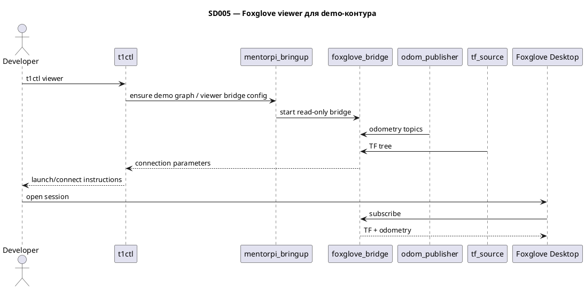

# SD005. Технический дизайн

## Системный дизайн
1. Базовое решение SD005 строится на готовом viewer `Foxglove Desktop` на ноутбуке разработчика и `foxglove_bridge` в нашем demo-контуре на роботе. `t1ctl` получает dev-only lifecycle-команду для viewer, которая умеет поднимать, проверять и выключать bridge, а также печатает параметры подключения для Mac; сам viewer работает только в режиме просмотра.
2. Поскольку текущий `stage1` поднимает `odom_publisher`, но не даёт полноценный минимальный набор для BA (`TF` + одометрия), SD005 включает минимальный bringup этих данных в нашем контуре: нормализованный odometry topic для viewer и доступный TF между `odom` и базовым кадром робота. Это делается без запуска vendor `bringup.launch.py` и без параллельного stock-контура.
3. `foxglove_bridge` добавляется отдельным узлом/launch-слоем в `mentorpi_bringup`, а не в контур управления движением. Так мы сохраняем read-only характер решения и не смешиваем отладочную визуализацию с `platform_adapter`, `control_state` и прочими узлами motion path.
4. `t1ctl` остаётся единой точкой входа, но разделяется по ролям: Pi-ops команды (`status`, `start`, `restart`, `stock`) работают как раньше, а новая команда `viewer` ориентирована на разработчика на Mac. Для подключения используются существующие сетевые допущения demo-режима: контейнер `mentorpi-t1` в `host network` и тот же `ROS_DOMAIN_ID`, что уже задан в окружении Hiwonder.
5. Что не меняется: `MentorPi` и `start_node.service` не редактируем, VNC не используем как основной путь, команды движения и публикация в шасси не добавляются, `/cmd_vel` не трогаем, product UI не проектируем.



## Программные интерфейсы

### Host CLI `t1ctl` (T3)

Подкоманда `t1ctl viewer [start|status|stop]` (без аргумента — `status`). Управляет только `foxglove_bridge` внутри контейнера `mentorpi-t1` через `docker exec`; `systemctl`, шасси и motion path не трогает.

| Команда | Действие |
| --- | --- |
| `t1ctl viewer status` | Проверяет demo-контур (контейнер), ноду `foxglove_bridge`, порт `:8765`, `ROS_DOMAIN_ID`; печатает параметры подключения для Mac |
| `t1ctl viewer start` | Поднимает bridge (`ros2 launch mentorpi_bringup foxglove_bridge.launch.py` в фоне), если ещё не активен |
| `t1ctl viewer stop` | Останавливает только `foxglove_bridge` (`pkill -x`), demo-контур продолжает работать |

Вывод включает `websocket` (`ws://<PI_HOST>:8765`), `ros domain id`, `/odom_raw`, TF `odom -> base_footprint` и подсказку для Foxglove Desktop.

Проверка (после `t1ctl start`, demo-контур):

```bash
t1ctl viewer status
t1ctl viewer stop
t1ctl viewer status
t1ctl viewer start
```

Ожидания: `status` показывает bridge active/inactive согласно состоянию; `stop`/`start` меняют только bridge; `demo`/`chassis`/`mode` в `t1ctl status` не меняются.

Реализация: `host/t1ctl/src/viewer.cpp` (lifecycle), `main.cpp` (CLI), `ui.cpp` (вывод). Pi-ops остаются в `units.cpp`.

### ROS 2 launch / bridge
1. В `src/mentorpi_bringup/launch/stage1.launch.py` появляется точка подключения bridge-слоя для viewer.
   1. Контракт: demo-контур может быть поднят с read-only bridge без включения vendor `rosbridge`/`web_video_server`.
   2. Bridge публикует ROS 2-данные для внешнего viewer, но не добавляет командный канал в шасси.
2. Для базового объёма BA вводится минимальный контракт визуализации.
   1. TF: дерево как минимум `odom -> <base frame>`.
   2. Odometry: один документированный топик, который viewer использует как основной источник позы.

### ROS 2 данные платформы
1. Источник одометрии опирается на существующий `odom_publisher` и/или его минимальную адаптацию.
   1. Базовый контракт: viewer видит одометрию платформы в стабильном topic name для demo-контура.
   2. Расширение на другие топики остаётся конфигурационным, без изменения базового сценария.
2. Источник TF документируется как часть demo bringup.
   1. Контракт: отсутствие TF считается неполным состоянием SD005.
   2. Решение может использовать минимальный TF source без полного внедрения поздних F04/F07.

### Минимальный контракт TF и одометрии (T1, demo-контур)

Единственный источник позы для viewer в `stage1.launch.py` — overlay-нода `odom_publisher` (`hiwonder_controller`).

| Элемент | Значение | Где задаётся |
| --- | --- | --- |
| Odometry topic | `/odom_raw` (`nav_msgs/msg/Odometry`) | параметр `odom_topic` в `stage1.launch.py` |
| Parent frame | `odom` | параметр `odom_frame_id` |
| Child / base frame | `base_footprint` | параметр `base_frame_id` |
| TF | `odom` → `base_footprint`, синхронно с `/odom_raw` | параметр `publish_tf:=true` в `odom_publisher` |

Проверка на стенде (после `t1ctl start`, demo-контур):

```bash
ros2 topic list | grep odom_raw
ros2 topic echo --once /odom_raw
ros2 run tf2_ros tf2_echo odom base_footprint
```

Ожидания: топик `/odom_raw` публикуется; в сообщении `header.frame_id=odom`, `child_frame_id=base_footprint`; `tf2_echo` показывает связанный transform между теми же кадрами. Топик `/odom` (EKF/образ) в demo-контуре **не** является целевым для SD005. URDF и цепочка `base_footprint`→сенсоры — вне T1 (F07 и расширения viewer).

### Foxglove bridge (T2, demo-контур)

Read-only `foxglove_bridge` поднимается отдельным launch-слоем `foxglove_bridge.launch.py`, включаемым из `stage1.launch.py` аргументом `viewer_bridge:=true` (дефолт). Не vendor `rosbridge` / `web_video_server`.

| Элемент | Значение | Где задаётся |
| --- | --- | --- |
| Launch include | `foxglove_bridge.launch.py` | `stage1.launch.py`, `viewer_bridge` |
| WebSocket endpoint | `ws://<PI_HOST>:8765` | `config/foxglove_bridge.yaml`, `port` |
| Bind address | `0.0.0.0` | `config/foxglove_bridge.yaml` |
| Read-only | без `clientPublish`, `client_topic_whitelist` и `service_whitelist` блокируют публикацию/вызовы с viewer | `config/foxglove_bridge.yaml` |

Зависимость: пакет `foxglove_bridge` (`ros-humble-foxglove-bridge` в образе контейнера `mentorpi-t1`).

Проверка на стенде (после `t1ctl start`, demo-контур):

```bash
ros2 node list | grep foxglove_bridge
ss -ltn | grep 8765
```

Ожидания: нода `foxglove_bridge` в графе; TCP `:8765` слушает на `0.0.0.0`. В Foxglove Desktop — Open connection → Foxglove WebSocket → `ws://192.168.88.56:8765` (тот же `ROS_DOMAIN_ID`, что в `.hiwonderrc`). Отключить bridge без остановки demo: `viewer_bridge:=false` при launch или `t1ctl viewer stop` (T3).

## Изменения в приложениях

- `host/t1ctl` — новая dev-only lifecycle-команда `viewer`, preflight проверки и текстовый workflow для Mac.
- `src/mentorpi_bringup` — bridge-слой визуализации и включение минимального TF/odometry bringup.
- `src/hiwonder_controller` — минимальная доработка/адаптация источника одометрии и TF, если текущего `odom_raw` недостаточно.
- `docs/SD/SD005` — фиксация SA, техдизайн (`tech.md`) и Mac workflow (`ops.md`).

### host/t1ctl
1. Добавить lifecycle-подкоманду `viewer` рядом с существующими `status/start/restart/stock`.
2. Разделить Pi-ops и Mac-viewer сценарии в help и в логике запуска.
3. Поддержать явное выключение bridge из `t1ctl`, а не только запуск и проверку.
4. Не превращать `t1ctl` в ROS-ноду и не переносить в него логику визуализации.

### mentorpi_bringup
1. Добавить bridge-узел и параметризацию viewer-сценария в наш demo launch.
2. Зафиксировать, что demo-контур остаётся единственным активным контуром и не включает stock launch параллельно.
3. Не включать vendor `bringup.launch.py`, `rosbridge`, `web_video_server` или VNC-поток как основное решение.

### hiwonder_controller
1. Обеспечить минимально пригодный для viewer источник одометрии и TF в demo-контуре.
2. Не расширять это изменение до полной локализации, EKF-пайплайна или URDF-каталога поздних этапов, если они не нужны для TF+odometry MVP.

### docs/SD/SD005
1. После утверждения плана перенести его в `tech.md` и отдельно описать developer workflow для Mac.
2. Зафиксировать границы: read-only, Foxglove Desktop, запуск через `t1ctl`, расширяемость на другие топики позже.
3. Mac workflow и сетевые требования: `docs/SD/SD005/ops.md` (T4).

## ToDo
Порядок: сначала фиксируем минимальные данные для viewer в demo-контуре, затем bridge, затем точку входа через `t1ctl`, чтобы каждая следующая задача проверялась на уже доступных TF и одометрии.

- [x] T1. Зафиксировать минимальный контракт TF и одометрии для demo-контура
  - **Делает:** определяет, какие именно frame и odometry topic обязательны для SD005 и где они появляются в нашем launch
  - **Файлы:** `docs/SD/SD005/tech.md`, `src/mentorpi_bringup/launch/stage1.launch.py`, `src/hiwonder_controller/`
  - **Готово когда:** для demo-режима однозначно задокументирован и доступен базовый набор данных `TF + odometry`
  - **Проверка:** в demo-контуре можно перечислить целевой odometry topic и увидеть связанный базовый TF

- [x] T2. Добавить read-only bridge для Foxglove в наш bringup
  - **Делает:** поднимает bridge в demo-контуре без запуска stock-графа и без влияния на контур движения
  - **Файлы:** `src/mentorpi_bringup/launch/`, `src/mentorpi_bringup/package.xml`, `src/mentorpi_bringup/CMakeLists.txt`
  - **Готово когда:** в demo-режиме доступна точка подключения Foxglove к данным робота
  - **Проверка:** bridge стартует в контейнере `mentorpi-t1`, а viewer видит endpoint подключения

- [x] T3. Расширить `t1ctl` lifecycle-командой для viewer
  - **Делает:** даёт команду `t1ctl viewer`, которая умеет включать, проверять и выключать bridge, а также печатает параметры подключения для Mac
  - **Файлы:** `host/t1ctl/src/main.cpp`, `host/t1ctl/src/ui.cpp`, `host/t1ctl/src/units.cpp` или новый модуль viewer
  - **Готово когда:** разработчик одной CLI-группой команд управляет lifecycle bridge и получает воспроизводимый read-only workflow подключения viewer
  - **Проверка:** команды viewer в demo-режиме корректно включают, показывают статус и выключают bridge, не меняя состояние шасси

- [x] T4. Задокументировать Mac workflow и сетевые требования
  - **Делает:** описывает установку/запуск Foxglove Desktop, ожидания по `ROS_DOMAIN_ID`, ограничения demo vs stock и путь расширения на другие топики
  - **Файлы:** `docs/SD/SD005/tech.md`, `docs/SD/SD005/ops.md`
  - **Готово когда:** разработчик без VNC может повторить подключение к demo-контуру по документации
  - **Проверка:** шаги документа приводят к отображению TF и одометрии в Foxglove Desktop
