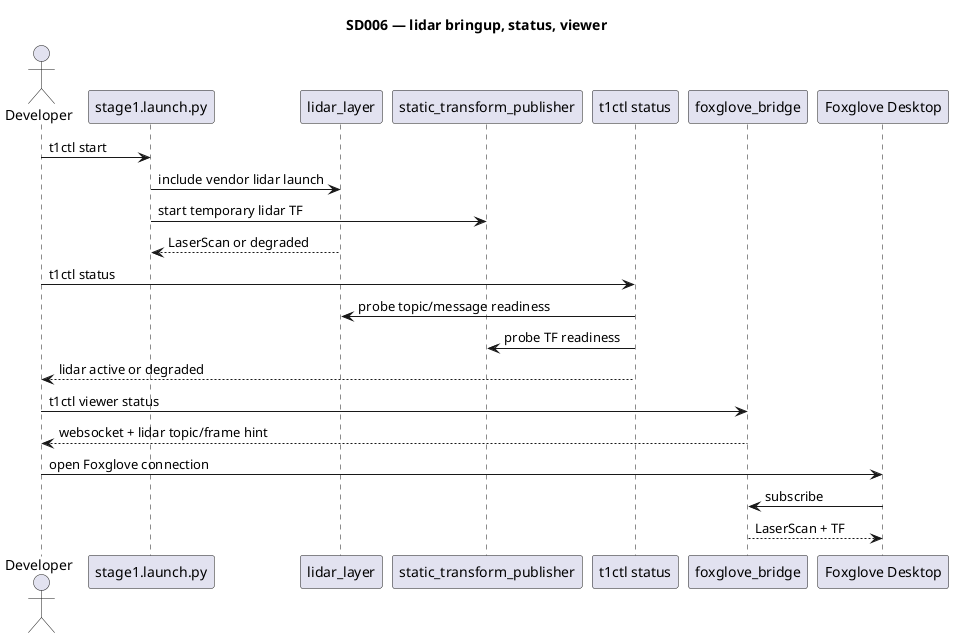

# SD006. Технический дизайн

## Системный дизайн
1. Фича F03 добавляет в наш `demo`-контур отдельный lidar-слой поверх существующего `stage1` bringup. Этот слой пытается поднять штатный vendor launch лидара MS200 или его штатный эквивалент, не включая stock `bringup.launch.py`, не поднимая vendor `lidar_controller.py` и не добавляя второй контур управления движением.
2. Минимальный контракт F03 в нашем слое: один документированный поток `sensor_msgs/msg/LaserScan` на `/scan`, доступный для следующих фич и для Foxglove; временный `TF` лидара `base_footprint -> lidar_frame` через наш `static_transform_publisher` до отдельной F07; явная диагностика degraded-состояния, если драйвер или поток данных отсутствует.
3. Bringup остаётся живым при отсутствии лидара: отсутствие пакета, launch-файла, ноды или сообщений `LaserScan` не валит весь `demo`-контур. Вместо этого состояние лидара считается degraded и отражается в `t1ctl status` и в документации проверки.
4. Общий `t1ctl status` расширен от текущего набора `demo / stock / chassis / mode / remote controller` до включения статуса лидара. Проверка строится на том же unified probe через `docker exec` в контейнер `mentorpi-t1`: probe определяет видимость `/scan`, наличие хотя бы одного сообщения `LaserScan` и готовность TF `base_footprint -> lidar_frame` (vendor-слой или наш временный static TF).
5. Viewer-контракт SD005 расширен без изменения read-only архитектуры: `foxglove_bridge` остаётся отдельным от motion path launch-слоем, а обязательный набор отладки становится `TF odom -> base_footprint`, `LaserScan` на `/scan` и `TF base_footprint -> lidar_frame`. `t1ctl viewer status` и `docs/SD/SD005/ops.md` подсказывают, какой topic и frame использовать в Foxglove.
6. Что не меняется: собственный драйвер лидара не пишем, stock-граф параллельно не запускаем, bridge не превращаем в канал управления, SLAM/локализацию/URDF-каталог F07 не реализуем в этой фиче.

## As-built контракт (стенд mentorpi-t1)

| Параметр | Значение |
| --- | --- |
| Launch-модуль | `src/mentorpi_bringup/launch/lidar_layer.launch.py` |
| Подключение | `stage1.launch.py` → `IncludeLaunchDescription(lidar_layer.launch.py)` |
| Driver `A1` | `/dev/lidar`: `lidar_a1.launch.py` (`sllidar_node` + A1 filter); `/dev/ldlidar`: `lidar_ld19.launch.py` (T1 udev, LD lidar on MS200 stand) |
| Driver `LD19` | `/dev/ldlidar`: `lidar_ld19.launch.py`; иначе vendor `lidar.launch.py` |
| Поддерживаемые `LIDAR_TYPE` | `A1`, `LD19`, `G4` (из `/home/ubuntu/ros2_ws/.hiwonderrc`) |
| LaserScan topic | `/scan` (`sensor_msgs/msg/LaserScan`) |
| Frame id | `lidar_frame` (`LaserScan.header.frame_id`) |
| Временный TF | `base_footprint -> lidar_frame` через `static_transform_publisher` (`lidar_frame_tf_fallback`) |
| Launch-аргументы | `enable_lidar` (default `true`), `enable_lidar_tf` (default `true`) |

Degraded-сценарии (launch не падает, пишет `[lidar_layer] degraded — ...` в лог):
- `LIDAR_TYPE` не задан или не из списка поддерживаемых
- `need_compile` не задан (не sourced `.hiwonderrc`)
- пакет `hiwonder_peripherals` отсутствует
- `enable_lidar:=false`

## Программные интерфейсы

### ROS 2 launch
1. В `src/mentorpi_bringup/launch/stage1.launch.py` подключён lidar-слой.
   1. Контракт: `stage1` поднимает `hiwonder_peripherals/lidar.launch.py` без запуска stock bringup и без источников `Twist`.
   2. При недоступности лидара весь `stage1` не падает; фича переходит в degraded-состояние.
2. В `lidar_layer.launch.py` зафиксирован контракт сенсора.
   1. `A1`: local launch — `sllidar` на `/dev/lidar`, `ldlidar_stl_ros2` на `/dev/ldlidar` (vendor `sllidar_a1` жёстко `/dev/lidar`; на T1 udev только `/dev/ldlidar`).
   2. `LD19`: local `lidar_ld19.launch.py` на `/dev/ldlidar`; иначе vendor launch с `lidar_frame`, `scan_topic`, `scan_raw`.
   3. `G4`: vendor launch с `lidar_frame`, `scan_topic`, `scan_raw`.
   4. Временный static TF `base_footprint -> lidar_frame` до F07.

### ROS 2 данные
1. Стабильный topic `sensor_msgs/msg/LaserScan` на `/scan` для нашего `demo`-контура.
   1. Имя topic зафиксировано в `lidar_layer.launch.py` и в константах `t1ctl` (`units.hpp`, `viewer.hpp`).
   2. Этот topic — базовый контракт для F12 и для viewer-сценария SD005.
2. Временный TF лидара относительно базы.
   1. Контракт: Foxglove должен иметь возможность отрисовать `LaserScan` в координатах робота.
   2. Источник TF: наш `static_transform_publisher` как временный fallback до F07 (vendor TF не используется).
3. Критерий readiness для статуса лидара в `t1ctl`.
   1. Topic `/scan` виден в ROS graph.
   2. Из topic приходит хотя бы одно сообщение `LaserScan` (`ros2 topic echo --once /scan`).
   3. TF `base_footprint -> lidar_frame` доступен (`ros2 run tf2_ros tf2_echo base_footprint lidar_frame`).

### Host CLI `t1ctl`
1. Общий `t1ctl status` показывает строку `lidar`.
   1. `active` (зелёный) — `/scan` echo и TF `base_footprint -> lidar_frame` готовы.
   2. `degraded` (красный) — demo поднят, но scan или TF отсутствует; печатаются подсказки (`no LaserScan on /scan`, `no TF base_footprint -> lidar_frame`) и `docker logs mentorpi-t1 2>&1 | grep lidar_layer`.
   3. `inactive` — контейнер down или probe пропущен.
2. `t1ctl viewer status` остаётся dev-only статусом bridge.
   1. Не дублирует lifecycle общего status.
   2. Дополняет viewer workflow полями `lidar scan` (`/scan`), `lidar tf` (`base_footprint -> lidar_frame`) и блоком **FOXGLOVE DESKTOP (Mac)** с шагами для LaserScan.

### Документация
1. `docs/SD/SD005/ops.md` расширен шагами просмотра лидара в Foxglove.
   1. Что должно быть видно в `t1ctl status`.
   2. Что должно быть видно в `t1ctl viewer status`.
   3. Какие панели и fixed frame использовать в Foxglove.

## Изменения в приложениях

| Компонент | Суть изменения | Статус |
|-----------|----------------|--------|
| `src/mentorpi_bringup` | Lidar-слой bringup, временный TF fallback, degraded-сценарий | T1 ✓ |
| `host/t1ctl` | Unified probe и вывод `lidar` в общем `status` | T2 ✓ |
| `host/t1ctl viewer` | Viewer-подсказки lidar topic/frame | T3 ✓ |
| `docs/SD/SD005` | Mac workflow и обязательный набор viewer-данных с лидаром | T4 ✓ |
| `docs/SD/SD006` | Техдизайн и ToDo фичи | T4 ✓ |

### `src/mentorpi_bringup` (T1)
1. Добавлен `lidar_layer.launch.py` и подключение из `stage1.launch.py`.
2. Временный `static_transform_publisher` (`lidar_frame_tf_fallback`) для `base_footprint -> lidar_frame` до F07.
3. Sensor bringup отделён от motion path и от stock bringup.
4. Не включает `lidar_controller.py`, `start_app`, `bringup.launch.py`, `rosbridge` или другие vendor-компоненты, меняющие поведение движения.

### `host/t1ctl` (T2)
1. Unified probe проверяет готовность лидара из контейнера `mentorpi-t1` (флаги `T1CTL_LIDAR`, `T1CTL_LIDAR_SCAN`, `T1CTL_LIDAR_TF`).
2. Структура статуса и UI содержат строку `lidar` с состояниями `active` / `degraded` / `inactive`.
3. При `degraded` печатаются диагностические подсказки и команда для логов lidar-слоя.

### `host/t1ctl viewer` (T3)
1. Viewer status дополнен полями `lidar scan`, `lidar tf` и Foxglove-подсказками для LaserScan.
2. Lifecycle bridge и общий lifecycle лидара не смешиваются в одну команду.

### `docs/SD/SD005` (T4)
1. Developer workflow: как понять, что лидар поднят, и как открыть его в Foxglove.
2. Базовый viewer-набор включает `TF + /odom_raw + /scan + TF lidar`.

### `docs/SD/SD006` (T4)
1. Канон зафиксирован в `tech.md` (as-built контракт, ToDo закрыт).

## ToDo
Порядок: сначала фиксируем и поднимаем базовый контракт лидара в `demo`-контуре, затем добавляем наблюдаемость через `t1ctl`, после этого расширяем viewer workflow и документацию на уже существующем сигнале.

- [x] T1. Подключить lidar-слой в demo bringup
  - **Делает:** добавляет в наш launch штатный запуск MS200 или его эквивалента, целевой `LaserScan` topic и временный static TF fallback до F07
  - **Файлы:** `src/mentorpi_bringup/launch/stage1.launch.py`, `src/mentorpi_bringup/launch/lidar_layer.launch.py`
  - **Готово когда:** demo-контур поднимается без stock-графа, а при наличии лидара появляется документированный `LaserScan` и TF лидара; при отсутствии лидара контур остаётся жив, но явно degraded
  - **Проверка:** в demo-контуре проверить список нод/топиков, одно сообщение из `LaserScan` и связанный TF до base frame
- [x] T2. Добавить статус лидара в общий `t1ctl status`
  - **Делает:** расширяет unified probe и UI так, чтобы `t1ctl status` показывал состояние лидара до открытия Foxglove
  - **Файлы:** `host/t1ctl/src/units.cpp`, `host/t1ctl/src/units.hpp`, `host/t1ctl/src/ui.cpp`, `host/t1ctl/src/main.cpp`
  - **Готово когда:** `t1ctl status` отражает готовность лидара и позволяет отличить нормальную работу от degraded-состояния
  - **Проверка:** на активном demo-контуре `t1ctl status` меняет строку лидара в зависимости от наличия потока и TF
- [x] T3. Расширить Foxglove workflow до лидара
  - **Делает:** включает lidar topic/frame в viewer-подсказки и в read-only workflow Foxglove
  - **Файлы:** `host/t1ctl/src/viewer.cpp`, `host/t1ctl/src/viewer.hpp`, `host/t1ctl/src/ui.cpp`, `src/mentorpi_bringup/config/foxglove_bridge.yaml`
  - **Готово когда:** разработчик по `t1ctl viewer status` и существующему bridge-сценарию понимает, какой lidar topic открыть и какой frame использовать в Foxglove
  - **Проверка:** viewer status печатает lidar-ориентированные подсказки, а Foxglove показывает `LaserScan` в корректной системе координат
- [x] T4. Обновить техдизайн и developer workflow
  - **Делает:** фиксирует канон F03 и расширение SD005 на lidar-сценарий
  - **Файлы:** `docs/SD/SD006/tech.md`, `docs/SD/SD005/ops.md`
  - **Готово когда:** по документации можно понять контракт лидара, degraded-поведение и шаги проверки в Foxglove без VNC
  - **Проверка:** документация покрывает bringup, `t1ctl status`, `t1ctl viewer status` и ручную проверку `LaserScan + TF`

## Финальный QA (после T1–T4)

На хосте Pi, demo-контур активен (`t1ctl start`):

1. **Bringup:** `t1ctl status` → `demo active`; в контейнере `ros2 topic echo --once /scan` возвращает `LaserScan` с `header.frame_id=lidar_frame`.
2. **TF:** в контейнере `ros2 run tf2_ros tf2_echo base_footprint lidar_frame` показывает transform (наш static TF fallback).
3. **Статус лидара:** `t1ctl status` → `lidar active` (зелёный). При отключённом лидаре или `enable_lidar:=false` → `lidar degraded` с подсказками.
4. **Viewer status:** `t1ctl viewer status` печатает `lidar scan /scan`, `lidar tf base_footprint -> lidar_frame` и блок **FOXGLOVE DESKTOP (Mac)**.
5. **Foxglove:** с Mac подключиться по WebSocket; в 3D (fixed frame `odom`) видны TF `odom -> base_footprint`, `base_footprint -> lidar_frame` и точки `LaserScan` на `/scan`.
