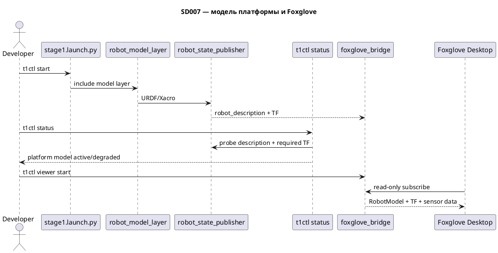

# SD007. Технический дизайн

## Системный дизайн
1. В overlay добавляется самостоятельный пакет `mentorpi_description`, адаптированный из штатной tank-модели `hiwonder_description`: vendor xacro не поддерживает `MACHINE_TYPE=MentorPi_Tank` напрямую. URDF/Xacro и необходимые mesh-ресурсы хранятся в репозитории и не зависят от выбора модели в конфигурации vendor-образа.
2. Модель публикуется отдельным `robot_model_layer.launch.py` через `robot_state_publisher` и подключается из `stage1.launch.py`. Слой не запускает stock `bringup.launch.py`, не подписывается на команды движения и при ошибке модели не останавливает demo-контур.
3. Каноническая TF-цепочка: `odom -> base_footprint -> base_link`; от `base_link` фиксированными связями подключаются `lidar_frame`, `imu_link` и кадры глубинной камеры Deptrum. `odom -> base_footprint` остаётся за существующим `odom_publisher`.
4. Положение Deptrum фиксируется по фактическому монтажу T1, а не по vendor-модели камеры на конце манипулятора. Начальные размеры и pose берутся из доступных штатных материалов и сверяются на стенде; точное воспроизведение конструктивных деталей не требуется.
5. При активной модели URDF становится единственным источником `base_footprint -> lidar_frame`; временный `lidar_frame_tf_fallback` из SD006 отключается, чтобы исключить конкурирующие TF.
6. `t1ctl status` считает модель active по наличию `/robot_description` и обязательных TF. Потоки `/scan`, IMU, depth image/PointCloud2 и одометрии остаются readiness-контрактами F03–F05 и не делают модель degraded сами по себе.
7. Foxglove использует существующий read-only bridge: fixed frame `odom`, RobotModel из `/robot_description`, TF и доступные сенсорные топики.

## Программные интерфейсы
1. ROS 2 package: `src/mentorpi_description` с Xacro/URDF и mesh-ресурсами модели T1.
2. ROS 2 launch: `src/mentorpi_bringup/launch/robot_model_layer.launch.py`; аргумент `enable_robot_model` по умолчанию `true`.
3. Robot description: `/robot_description`, публикуемый `robot_state_publisher`.
4. TF:
   1. `odom -> base_footprint` — существующий динамический TF `odom_publisher`, не меняется.
   2. `base_footprint -> base_link` — модель платформы.
   3. `base_link -> lidar_frame` — ToF-лидар MS200.
   4. `base_link -> imu_link` — IMU.
   5. `base_link -> <depth camera frame>` — глубинная камера Deptrum; точные имена optical frames сверяются со штатным драйвером до фиксации Xacro.
5. Unified probe `t1ctl`: `T1CTL_MODEL`, `T1CTL_MODEL_DESCRIPTION`, `T1CTL_MODEL_TF_BASE`, `T1CTL_MODEL_TF_LIDAR`, `T1CTL_MODEL_TF_IMU`, `T1CTL_MODEL_TF_DEPTH`.
6. CLI: строка `platform model: active | degraded | inactive` и адресные подсказки для отсутствующего description/TF.
7. Viewer: RobotModel topic `/robot_description`, fixed frame `odom`; bridge остаётся read-only.

## Изменения в приложениях
| Компонент | Суть изменения |
|-----------|----------------|
| `src/mentorpi_description` | Self-contained пакет модели T1, адаптированный из штатной tank-модели |
| `src/mentorpi_bringup` | Отказоустойчивый model layer и координация источника lidar TF |
| `host/t1ctl status` | Readiness модели, состояния и диагностические подсказки |
| `host/t1ctl viewer` | Viewer-контракт RobotModel |
| `docs/SD/SD005` | Workflow просмотра RobotModel в Foxglove |
| `docs/SD/SD007` | As-built контракт и QA-чеклист |

## ToDo
- [x] T1. Добавить пакет модели MentorPi T1
  - **Делает:** создаёт `mentorpi_description`, переносит и адаптирует штатную tank-геометрию, фиксирует `base_footprint`, `base_link`, MS200, IMU и Deptrum в фактическом фиксированном положении
  - **Файлы:** `src/mentorpi_description/**`
  - **Готово когда:** Xacro разворачивается без ошибок, ресурсы разрешаются из install space, модель не содержит vendor-ветки манипулятора
  - **Проверка:** локальная xacro/URDF-проверка и визуальная сверка состава links/joints
- [x] T2. Подключить отказоустойчивый model layer в demo bringup
  - **Делает:** добавляет `robot_model_layer.launch.py`, `robot_state_publisher` и include из `stage1`; ошибка ресурсов переводит слой в degraded без остановки остальных нод
  - **Файлы:** `src/mentorpi_bringup/launch/robot_model_layer.launch.py`, `src/mentorpi_bringup/launch/stage1.launch.py`, `src/mentorpi_bringup/package.xml`
  - **Готово когда:** доступны `/robot_description` и TF модели, а отключённая/ошибочная модель не валит demo-контур
  - **Проверка:** launch smoke с включённой моделью и негативный запуск с отключённой или недоступной моделью
- [x] T3. Устранить дублирование TF и согласовать sensor frames
  - **Делает:** передаёт lidar TF от fallback к URDF; сверяет кадры MS200, IMU и Deptrum с драйверными контрактами, не меняя `odom -> base_footprint`
  - **Файлы:** `src/mentorpi_bringup/launch/lidar_layer.launch.py`, `src/mentorpi_description/**`
  - **Готово когда:** каждый обязательный transform имеет один источник и отсутствуют duplicate-TF warnings
  - **Проверка:** `tf2_echo` для base, lidar, IMU и depth-camera цепочек
- [x] T4. Добавить состояние модели в `t1ctl status`
  - **Делает:** расширяет unified probe, parser и UI строкой `platform model`, состояниями active/degraded/inactive и адресными hints
  - **Файлы:** `host/t1ctl/src/units.hpp`, `host/t1ctl/src/units.cpp`, `host/t1ctl/src/ui.cpp`, `host/t1ctl/tests/test_status.cpp`
  - **Готово когда:** active определяется по description и всем обязательным TF; отсутствие каждого элемента даёт понятную причину degraded
  - **Проверка:** unit-тесты parser/probe и ручная смена состояний без дополнительных `docker exec`
- [x] T5. Добавить RobotModel в Foxglove workflow
  - **Делает:** расширяет `t1ctl viewer status` и developer workflow: fixed frame `odom`, RobotModel `/robot_description`, TF и сенсорные данные
  - **Файлы:** `host/t1ctl/src/viewer.hpp`, `host/t1ctl/src/viewer.cpp`, `host/t1ctl/src/ui.cpp`, `docs/SD/SD005/ops.md`
  - **Готово когда:** разработчик по подсказкам открывает корпус T1 и все sensor links в существующем read-only viewer
  - **Проверка:** Foxglove 3D показывает модель, MS200, Deptrum и IMU в общей TF-системе; одометрия связана через `odom -> base_footprint`
- [x] T6. Закрыть автоматические проверки и документацию SD007
  - **Делает:** добавляет тесты active/degraded probe, фиксирует as-built интерфейсы и QA-чеклист
  - **Файлы:** `host/t1ctl/tests/test_status.cpp`, `docs/SD/SD007/tech.md`, `docs/SD/SD007/STATUS.md`
  - **Готово когда:** тесты `t1ctl` проходят, документация совпадает с реализованными topic/frame names и не содержит непроверенных значений pose
  - **Проверка:** локальные тесты без ARM-сборки; стендовые шаги передаются пользователю отдельно

## As-built контракт

Реализованные значения (источник — текущий working tree, T1–T5):

| Область | Значение |
|---------|----------|
| ROS package | `mentorpi_description` |
| Xacro entry | `urdf/mentorpi_t1.urdf.xacro` |
| Mesh refs | `package://mentorpi_description/meshes/**` (10 файлов, self-contained) |
| Model launch | `robot_model_layer.launch.py`, arg `enable_robot_model` default `true` |
| Model node | `robot_state_publisher` |
| Robot description topic | `/robot_description` (transient_local, reliable) |
| Stage1 wiring | `stage1.launch.py` включает `robot_model_layer` и передаёт `enable_robot_model` в `lidar_layer` |
| TF `odom -> base_footprint` | `odom_publisher` (без изменений SD007) |
| TF `base_footprint -> base_link` | URDF (`base_joint`, z=0.127) |
| TF lidar | `base_footprint -> base_link -> lidar_link -> lidar_frame`; единственный источник при `enable_robot_model:=true` и launch-ready URDF |
| TF IMU | `base_footprint -> base_link -> imu_link` |
| TF Deptrum | `base_footprint -> base_link -> depth_cam_link -> depth_cam_frame` (optical joint в Xacro) |
| Lidar TF fallback | `lidar_frame_tf_fallback` (`static_transform_publisher`) только при `enable_robot_model:=false` или недоступной модели |
| LaserScan | `/scan`, `frame_id=lidar_frame` (SD006, без изменений) |
| Odometry viewer | `/odom_raw`, `odom` / `base_footprint` (SD005) |
| `t1ctl status` probe flags | `T1CTL_MODEL`, `T1CTL_MODEL_DESCRIPTION`, `T1CTL_MODEL_TF_BASE`, `T1CTL_MODEL_TF_LIDAR`, `T1CTL_MODEL_TF_IMU`, `T1CTL_MODEL_TF_DEPTH` |
| `t1ctl status` TF checks | `tf2_echo base_footprint` → `base_link`, `lidar_frame`, `imu_link`, `depth_cam_frame` |
| `t1ctl status` UI | `platform model: active \| degraded \| inactive` + hints по отсутствующему description/TF |
| Viewer fixed frame | `odom` |
| Viewer RobotModel | `/robot_description` |
| Viewer TF chain hint | `odom -> base_footprint -> base_link` |
| Viewer sensor frames hint | `lidar_frame, imu_link, depth_cam_frame` |
| Foxglove workflow doc | `docs/SD/SD005/ops.md` (read-only bridge, без `clientPublish`) |

**Deptrum mount pose (preliminary, не калибровано):** xacro-args в `mentorpi_t1.urdf.xacro` — `depth_cam_x=0.10`, `depth_cam_y=0.0`, `depth_cam_z=0.05`, `depth_cam_roll/pitch/yaw=0.0`. Pose зафиксирована для отладочной визуализации на `base_link`; требует физической сверки на стенде перед любыми claims о калибровке.

**Автотесты (подготовлены, не прогонялись в T6):** `host/t1ctl/tests/test_status.cpp` — parser/query для model active/degraded/inactive, per-flag missing TF, viewer constants и `parse_probe`. Runtime/compile verification выполняет пользователь (`cmake` + `ctest` или `t1ctl_test`).

## Финальный QA (пользователь, T1–T6)

После `./scripts/build-arm64.sh` и `./scripts/deploy-pi.sh`:

### T1 — пакет модели
1. В контейнере: `ros2 pkg prefix mentorpi_description`.
2. `xacro $(ros2 pkg prefix mentorpi_description)/share/mentorpi_description/urdf/mentorpi_t1.urdf.xacro` — без ошибок; в выводе есть `base_footprint`, `base_link`, `lidar_frame`, `imu_link`, `depth_cam_link`, `depth_cam_frame`.
3. Все mesh-refs разрешаются из install space (визуально в Foxglove после T5).

### T2 — model layer
1. `t1ctl start`; в логах: `[robot_model_layer] robot_state_publisher started`.
2. `ros2 topic echo --once --qos-durability transient_local --qos-reliability reliable /robot_description` — непустой URDF.
3. Негатив: `enable_robot_model:=false` — demo-контур жив, модель skipped (лог), `t1ctl status` → `platform model: inactive` или degraded по TF.

### T3 — единый lidar TF
1. При default launch: в логах `[lidar_layer] lidar TF from URDF model layer`; **нет** duplicate-TF warnings для `lidar_frame`.
2. `ros2 run tf2_ros tf2_echo base_footprint lidar_frame` — Translation присутствует.
3. Аналогично: `imu_link`, `depth_cam_frame`; `odom -> base_footprint` от `odom_publisher`.
4. Негатив: `enable_robot_model:=false` — активен `lidar_frame_tf_fallback`, TF всё ещё доступен.

### T4 — `t1ctl status`
1. При полной модели: `platform model: active` (зелёный).
2. Симулировать degraded (остановить `robot_state_publisher` или отключить модель): `degraded` + адресные hints (description / конкретный TF).
3. Локально: собрать и прогнать `t1ctl_test` — все checks pass.

### T5 — Foxglove viewer
1. `t1ctl viewer start` → `t1ctl viewer status` — fixed frame `odom`, robot model `/robot_description`, sensor frames в подсказках.
2. Foxglove Desktop → `ws://<pi>:8765`; 3D: Fixed frame `odom`, RobotModel `/robot_description`, TF enabled.
3. Виден корпус T1, `lidar_frame`, `imu_link`, `depth_cam_frame`; одометрия `/odom_raw` согласована с TF.
4. **Визуально сверить** preliminary pose Deptrum (`depth_cam_x=0.10`, y=0, z=0.05, rpy=0) с фактическим монтажом; при расхождении скорректировать xacro-args (не считать калиброванным).

### T6 — автопроверки и документация
1. Локально: `cmake` + `ctest` / `t1ctl_test` в `host/t1ctl` (или через общий CI).
2. Сверить этот as-built контракт с фактическим поведением на стенде.
3. Код-ревью diff SD007.
