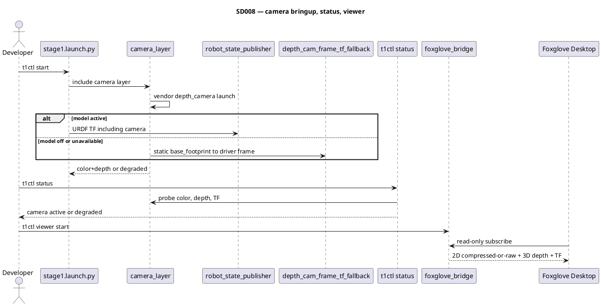

# SD008. Технический дизайн

## Системный дизайн
1. Фича F05 добавляет в demo-контур отдельный camera-слой поверх существующего `stage1`, по тому же принципу, что `lidar_layer.launch.py`. Слой поднимает штатный vendor launch камеры по `DEPTH_CAMERA_TYPE` (на стенде T1: `aurora` → `deptrum-ros-driver-aurora930`, USB Deptrum Aurora 930 `3251:1930`), не включает stock `bringup.launch.py`, не добавляет источник Twist и не пишет свой драйвер.
2. Контракт данных: все потоки штатного драйвера остаются в ROS-графе (ожидаются цвет и глубина). Имена топиков и `frame_id` не выдумываются в этом документе: фиксируются в слое и в константах `t1ctl` по штатному launch на образе при реализации T1 (как `/scan` и `lidar_frame` у лидара). Для F08 raw-потоки в графе сохраняются даже если viewer смотрит compressed.
3. TF камеры — как у лидара, один child-кадр данных / один источник:
   1. Модель активна и launch-ready → TF от `robot_state_publisher` (`robot_model_layer.launch.py`).
   2. Модель выключена или недоступна → `depth_cam_frame_tf_fallback` (`static_transform_publisher`) `base_footprint -> <driver frame_id>`.
   3. Если `frame_id` драйвера не совпадает с текущим URDF `depth_cam_frame`, в этом SD выравниваем Xacro и fallback под драйвер (как `lidar_frame`).
   4. Если драйвер сам публикует optical TF, URDF не дублирует тот же child: модель даёт только mount до корневого кадра драйвера.
   5. Если цвет и глубина имеют разные optical-кадры, оба входят в контракт; fallback покрывает каждый отсутствующий при выключенной модели.
4. Pose fallback — композиция уже известных URDF-чисел без новой калибровки: `base_footprint -> base_link` (z=0.127) + preliminary Deptrum (`depth_cam_x=0.10`, y=0, z=0.05, rpy=0) + optical joint при необходимости. Это отладочная привязка, не калибровка (F24).
5. Bringup жив при отсутствии камеры: нет пакета/launch/ноды/потоков — `stage1` не падает, слой пишет `[camera_layer] degraded — ...`.
6. `t1ctl status`: строка камеры `active | degraded | inactive` по аналогии с лидаром. `active` только если есть цвет, глубина и TF; иначе `degraded` с отдельной причиной по каждому куску. Probe — тот же unified `docker exec` в `mentorpi-t1`.
7. Viewer: `foxglove_bridge` остаётся read-only. 2D — CompressedImage, если штатный драйвер его публикует, иначе raw Image. 3D — depth/PointCloud2 в кадре камеры на платформе (fixed frame `odom`). Whitelist на bridge сейчас не вводим: в граф и на bridge идут штатные потоки; если compressed нет, пользователь по факту стенда выберет, что оставить. `t1ctl viewer status` и `docs/SD/SD005/ops.md` подсказывают топики после фиксации имён.

### As-built (T1 stand MentorPi_Tank + Aurora 930)

| Параметр | Значение |
|----------|----------|
| `DEPTH_CAMERA_TYPE` | stage1/unit force `aurora`; overlay `.typerc` may still be stale `Dabai`; MentorPi host `.typerc` is `aurora` |
| Драйвер | `deptrum-ros-driver-aurora930` / `aurora930_node` (isolated prefix copied from MentorPi RW `third_party_ros2` into overlay image; OpenCV 4.10 `.so.410` from `/usr/local/lib`) |
| Color | `/aurora/rgb/image_raw` |
| Depth image | `/aurora/depth/image_raw` |
| Depth cloud | `/aurora/points2` |
| IR | `/aurora/ir/image_raw` |
| Mount TF | `depth_cam_link` (URDF) |
| Optical TF | `depth_camera_link` (depth/cloud: URDF or fallback); `rgb_camera_link` (color: driver static TF depth→rgb) |
| Viewer 2D | `/aurora/rgb/image_raw/compressed` **если топик есть в графе**, иначе `/aurora/rgb/image_raw` (T1 подтвердил raw; compressed не as-built-гарантия) |
| Viewer 3D | `/aurora/points2` (`sensor_msgs/PointCloud2`); fallback Image `/aurora/depth/image_raw` |
| Viewer camera TF | `base_footprint -> depth_camera_link`; fixed frame Foxglove `odom` |
| `t1ctl viewer status` | cheat-sheet `camera 2d` / `camera 3d` / `camera tf`; без live echo камеры (сбор статуса — `t1ctl status`) |
| Foxglove bridge | read-only (`foxglove_bridge.yaml`: нет `clientPublish`, пустые client whitelist); **новый whitelist топиков не вводим** |
| `t1ctl` version (SD008 T3) | `1.1.1` |

#### Ограничение стенда по питанию

При текущем питании Raspberry Pi 5 от Anker A1695 одновременная работа Deptrum Aurora 930 и лидара не обеспечивается: по отдельности оба сенсора работают, но при подключённой и активной depth-камере лидар перестаёт работать. Разнесение устройств по разным USB-контроллерам Raspberry Pi 5 проблему не устранило. Рабочая гипотеза — недостаточный бюджет питания; электрическими измерениями причина пока не подтверждена. До организации раздельного или более мощного питания совместный режим камеры и лидара на стенде T1 не поддерживается.

## Программные интерфейсы

### ROS 2 launch
1. Новый `src/mentorpi_bringup/launch/camera_layer.launch.py`, include из `src/mentorpi_bringup/launch/stage1.launch.py`.
   1. Аргумент `enable_depth_camera` по умолчанию `true`.
   2. Аргумент `enable_robot_model` — тот же контракт, что у лидара: fallback только если модель выключена или не launch-ready.

### ROS 2 данные
1. Имена топиков и `frame_id` фиксируются при T1 по штатному launch на образе, не из этого раздела.
   1. Цвет: `sensor_msgs/Image` и/или `sensor_msgs/CompressedImage`.
   2. Глубина: depth `Image` и/или `sensor_msgs/PointCloud2` (и прочие штатные потоки драйвера).
   3. TF: `base_footprint -> <frame_id потоков>`; один источник на child-кадр.
2. Критерий `active` в probe:
   1. Есть сообщение цвета (compressed, если топик есть, иначе raw).
   2. Есть сообщение глубины (cloud или depth image).
   3. `tf2_echo base_footprint <driver frame>` даёт Translation.

### Host CLI `t1ctl`
1. Unified probe: флаги `T1CTL_CAMERA`, `T1CTL_CAMERA_COLOR`, `T1CTL_CAMERA_DEPTH`, `T1CTL_CAMERA_TF` в `host/t1ctl/src/units.cpp`.
2. Общий `t1ctl status` показывает строку `camera` рядом с lidar / platform model.
   1. `active` — цвет, глубина и TF готовы.
   2. `degraded` — demo поднят, но нет цвета и/или глубины и/или TF; печатаются адресные подсказки по каждому куску.
   3. `inactive` — контейнер down или probe пропущен.
3. `t1ctl viewer status` дополняет workflow полями 2D (compressed если есть, иначе raw) и 3D (depth/cloud); не дублирует lifecycle общего status.

### Документация
1. `docs/SD/SD005/ops.md` — панели Image (compressed предпочтительно) и 3D depth/cloud.
2. Фактические имена топиков и кадров — as-built в этом файле после T1/T4, без литералов «с потолка».

## Изменения в приложениях

| Компонент | Суть изменения |
|-----------|----------------|
| `src/mentorpi_bringup` | Camera-слой, include из stage1, degraded без падения контура, fallback TF согласован с моделью |
| `src/mentorpi_description` | Имя optical/mount кадра камеры = `frame_id` драйвера; без второго источника того же child |
| `host/t1ctl` | Probe, строка `camera`, hints, viewer workflow, unit-тесты |
| `docs/SD/SD005` | Шаги 2D+3D камеры в существующем read-only viewer |
| `docs/SD/SD001` | Ссылка требований F05 на SD008 после закрытия фичи |
| `docs/SD/SD008` | Канон `tech.md` и as-built после T4 |

### `src/mentorpi_bringup`
1. `camera_layer.launch.py`: include штатного camera launch; при недоступности пакета/launch — лог degraded, `stage1` жив.
2. `depth_cam_frame_tf_fallback` только когда URDF-модель не публикует тот же child.
3. Не включать `bringup.launch.py`, `web_video_server` как источник управления, `rosbridge` вместо foxglove.

### `src/mentorpi_description`
1. Выровнять кадр камеры под драйвер; mesh `depth_cam_link` можно оставить.
2. Не менять `odom -> base_footprint`.

### `host/t1ctl`
1. Unified probe и строка `camera` с адресными hints (нет цвета / нет глубины / нет TF).
2. Viewer status: топики 2D (compressed иначе raw) и 3D; не смешивать lifecycle камеры с lifecycle bridge.

### Документация
1. `ops.md`: как понять, что камера поднята, и какие панели открыть.
2. Whitelist bridge — только если после стенда пользователь явно выберет набор; в T1–T3 не предугадывать.

## ToDo
Порядок: сначала слой и TF в demo-контуре (имена с образа), затем наблюдаемость в `t1ctl`, затем viewer, затем фиксация as-built.

- [x] T1. Подключить camera-слой и TF камеры
  - **Делает:** vendor/штатный launch Deptrum в demo-контуре; fallback TF как у лидара; выравнивание URDF под `frame_id` драйвера; фиксация имён топиков/кадров с образа без вымысла
  - **Файлы:** `src/mentorpi_bringup/launch/camera_layer.launch.py`, `src/mentorpi_bringup/launch/stage1.launch.py`, `src/mentorpi_bringup/package.xml`, `src/mentorpi_description/urdf/**`
  - **Готово когда:** при живой камере в графе есть цвет и глубина и ровно один источник TF до кадра данных; при отсутствии камеры или `enable_depth_camera:=false` контур жив и слой явно degraded; при выключенной модели работает fallback без duplicate-TF
  - **Проверка:** `ros2 topic list` / echo цвета и глубины; `tf2_echo base_footprint <frame>`; негатив без драйвера и с `enable_robot_model:=false`
- [x] T2. Добавить строку камеры в `t1ctl status`
  - **Делает:** probe цвет+глубина+TF; `active` только при всех трёх; degraded с причиной по каждому куску
  - **Файлы:** `host/t1ctl/src/units.hpp`, `host/t1ctl/src/units.cpp`, `host/t1ctl/src/ui.cpp`, `host/t1ctl/tests/test_status.cpp`
  - **Готово когда:** `t1ctl status` отличает active / degraded / inactive и печатает hints без лишнего `docker exec`
  - **Проверка:** unit-тесты parser/probe; на стенде смена состояний при живой камере и при оборванном потоке/TF
- [x] T3. Расширить Foxglove workflow до камеры
  - **Делает:** подсказки `t1ctl viewer status` для 2D (compressed если есть, иначе raw) и 3D; шаги в `ops.md`; bridge по-прежнему read-only, без заранее выдуманного whitelist
  - **Файлы:** `host/t1ctl/src/viewer.hpp`, `host/t1ctl/src/viewer.cpp`, `host/t1ctl/src/ui.cpp`, `docs/SD/SD005/ops.md`
  - **Готово когда:** по viewer status и ops можно открыть цвет и глубину в кадре камеры на платформе
  - **Проверка:** Foxglove 2D + 3D; если compressed нет — в ops перечислить фактические топики, выбор whitelist оставить пользователю
- [x] T4. Закрыть as-built и каталог F05
  - **Делает:** записать фактические topic/frame names в `docs/SD/SD008/tech.md`; ссылка F05 → SD008 в `docs/SD/SD001/tech.md`; QA-чеклист
  - **Файлы:** `docs/SD/SD008/tech.md`, `docs/SD/SD008/STATUS.md`, `docs/SD/SD001/tech.md`
  - **Готово когда:** документация совпадает с реализованными именами и не содержит непроверенных topic literals «с потолка»
  - **Проверка:** сверка as-built с `ros2 topic list` / `tf2_echo` на стенде

## Финальный QA (пользователь, T1–T4)

После `./scripts/build-arm64.sh` и `./scripts/deploy-pi.sh` (агент не деплоит). Учитывать ограничение питания: камера и лидар на Anker A1695 одновременно не работают.

### T1 — camera layer
1. `t1ctl start`; в логах `[camera_layer]` без падения `stage1`.
2. В контейнере: `ros2 topic list` содержит `/aurora/rgb/image_raw`, `/aurora/depth/image_raw`, `/aurora/points2`.
3. `ros2 run tf2_ros tf2_echo base_footprint depth_camera_link` — Translation есть; нет duplicate-TF на этот child.
4. Негатив: `enable_depth_camera:=false` — контур жив, слой degraded.

### T2 — `t1ctl status`
1. При живой камере: `camera: active`.
2. Без потока/TF: `camera: degraded` (одна строка, без indented причин в текущем CLI).
3. Локально: `t1ctl_test` — parser/probe камеры зелёный.

### T3 — Foxglove
1. `t1ctl viewer status` печатает `camera 2d` (compressed or raw), `camera 3d` `/aurora/points2`, `camera tf` `base_footprint -> depth_camera_link` и блок **FOXGLOVE DESKTOP**.
2. Foxglove Desktop → `ws://<pi>:8765`; **Image**: compressed если есть в `ros2 topic list`, иначе `/aurora/rgb/image_raw`.
3. **3D**, fixed frame `odom`: PointCloud2 `/aurora/points2` в `depth_camera_link` на платформе; если облака нет — Image `/aurora/depth/image_raw`.
4. Bridge остаётся read-only; whitelist топиков не задан заранее.

### T4 — as-built и каталог
1. Этот as-built совпадает с `ros2 topic list` / `tf2_echo` на стенде (без литералов «с потолка»).
2. В `docs/SD/SD001/tech.md` F05 ссылается на SD008.
3. Локально: cmake + `t1ctl_test` → `ok`.
