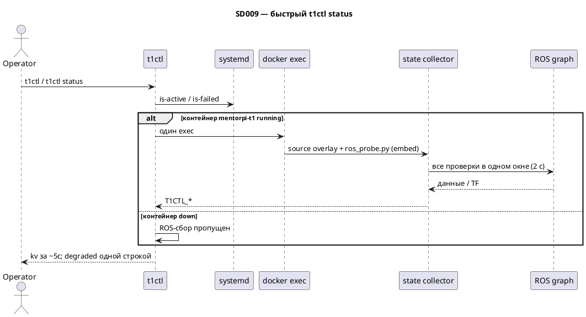

# SD009. Технический дизайн

## Системный дизайн
1. Главный медленный путь — `t1ctl` / `t1ctl status`: один `units::query()` → systemd + если контейнер running — `fill_ros`. As-built: один `docker exec` с встроенным `ros_probe.py` (`rclpy`: подписки + tf2 buffer, окно 2 с), `kRosProbeAttempts = 1`. `start` / `restart` / `stock` после действия не вызывают `query()`; viewer без live echo/TF.
2. Метод сбора (as-built): один процесс внутри `mentorpi-t1` на весь набор. `ros_probe.py` embed в бинарь (`CMakeLists.txt` → `ros_probe_embed.hpp`), запуск `python3 -c` после source `.hiwonderrc` + overlay `setup.bash`. Формат stdout `T1CTL_*` сохранён; `parse_ros_probe` в `units.cpp`.
3. Критерии active / degraded / inactive те же: lidar = `/scan` + `lidar_frame`; camera = цвет (compressed если топик есть, иначе raw) + глубина (`/aurora/points2` или `/aurora/depth/image_raw`) + `base_footprint -> depth_camera_link`; model = `/robot_description` + TF `base_link` / `lidar_frame` / `imu_link` / `depth_cam_frame`. Один lookup `lidar_frame` на lidar и model.
4. Бюджет оператора: `t1ctl status` примерно до 5 с. Повтор всего exec в C++ снят. Overlay diagnostic-топик не обязателен.
5. Печать status: `degraded` одной строкой, без indented причин и без хвоста `docker logs | grep`. После start/restart/stock — короткое подтверждение без второго `query()`.
6. Версия CLI: `project(t1ctl VERSION 1.2.0)` в `host/t1ctl/CMakeLists.txt`. Источник `T1CTL_VERSION`; `ui.cpp` использует макрос, без хардкода.
7. Не меняется: имена as-built топиков/кадров, QoS `/control/status` (transient_local + reliable), systemd demo/stock, движение, Foxglove workflow.

## Программные интерфейсы

### Host CLI — status
1. `t1ctl` и `t1ctl status` — kv: demo, stock, chassis, mode, remote controller, lidar, camera, platform model, version.
2. Поле `version` после сборки — 1.2.0.
3. `degraded` — только значение, без построчных причин.
4. Сбор ROS-состояния укладывается в бюджет ~5 с (systemd + один exec + сборщик 2 с).

### Host CLI — действия
1. `start` / `restart` / `stock` успех: `Started.` / `Restarted.` / `Restored stock autostart.` без kv и без `query()`.
2. Ошибка: `error:` + `t1ctl start` / `t1ctl stock`, без ROS-сбора.

### Host CLI — viewer
1. kv моста и константы топиков (cheat-sheet), без live echo/TF.
2. Без hint-блоков «no LaserScan…».

### Сбор состояния (as-built)
1. Вход: контейнер running, source `.hiwonderrc` + overlay `setup.bash`.
2. Выход: заполняет `units::Status` (chassis, control YAML, lidar/camera/model).
3. Сборщик: `host/t1ctl/src/ros_probe.py`, embed в бинарь (`PROBE_SEC = 2.0`).
4. Топики/кадры — константы `host/t1ctl/src/units.hpp`.
5. Нет цепочки `timeout 2 ros2 topic echo`, отдельного `timeout 2 ros2 topic list`, `ros2 daemon start`, C++ retry всего exec (`kRosProbeAttempts = 1`).

## Изменения в приложениях

| Компонент | Суть изменения |
|-----------|----------------|
| `host/t1ctl` | новый сборщик, печать, команды, версия 1.2.0, тесты |
| overlay / launch | нет |
| `docs/SD/SD009` | solution.md, STATUS.md, tech.md |

### `host/t1ctl`
1. Один in-container процесс на status (`ros_probe.py` embed, один `docker exec`).
2. `kRosProbeAttempts = 1`.
3. Degraded одной строкой; start/restart/stock без второго query.
4. Viewer без live sensor echo/TF.

### Тесты
[`host/t1ctl/tests/test_status.cpp`](../../host/t1ctl/tests/test_status.cpp) — новый метод сбора, печать без hints, viewer без echo/TF, версия 1.2.0 в `print_version` / status kv.

## ToDo
Порядок: сначала сбор для status, затем печать и действия, затем viewer, затем версия и as-built.

- [x] T1. Заменить метод сбора состояния для `t1ctl status`
  - **Делает:** один in-container процесс, одно окно; `kRosProbeAttempts = 1`; критерии active/degraded те же; as-built Aurora
  - **Файлы:** `host/t1ctl/src/units.cpp`, `host/t1ctl/src/units.hpp`, новый сборщик, CMake embed; `host/t1ctl/tests/test_status.cpp`
  - **Готово когда:** `query()` при живом контейнере — один exec; в сборщике нет последовательных CLI echo; `t1ctl_test` зелёный на эту часть
  - **Проверка:** `t1ctl_test`; на стенде `time t1ctl` / `time t1ctl status` ~5 с
- [x] T2. Печать status и start/restart/stock без повторного сбора
  - **Делает:** degraded одной строкой; успех действий без `query()`; ошибка без ROS-сбора
  - **Файлы:** `host/t1ctl/src/ui.cpp`, `host/t1ctl/src/main.cpp`, тесты вывода в `test_status.cpp`
  - **Готово когда:** в status нет indented причин; `t1ctl start` не печатает kv
  - **Проверка:** новые print-тесты; ручной start — «Started.»
- [x] T3. Viewer без live sensor-сбора
  - **Делает:** только bridge/port/domain; убрать echo/TF; обновить `test_viewer_*`
  - **Файлы:** `host/t1ctl/src/viewer.cpp`, `host/t1ctl/src/viewer.hpp`, `host/t1ctl/src/ui.cpp`, тесты
  - **Готово когда:** viewer-скрипт без `topic echo` / `tf2_echo`; тесты не ждут `T1CTL_LIDAR_SCAN` как live
  - **Проверка:** `t1ctl_test`; `time t1ctl viewer status`
- [x] T4. Версия 1.2.0, `t1ctl_test`, as-built
  - **Делает:** бамп `project(t1ctl VERSION 1.2.0)` в `host/t1ctl/CMakeLists.txt`. Полный прогон тестов; as-built метода сбора и версии в этом файле
  - **Готово когда:** `t1ctl -V` / строка `version` в status = `1.2.0`; `t1ctl_test` → `ok` без осколков старого метода
  - **Проверка:** cmake + `t1ctl_test`; `t1ctl -V`; стенд — пользователь
