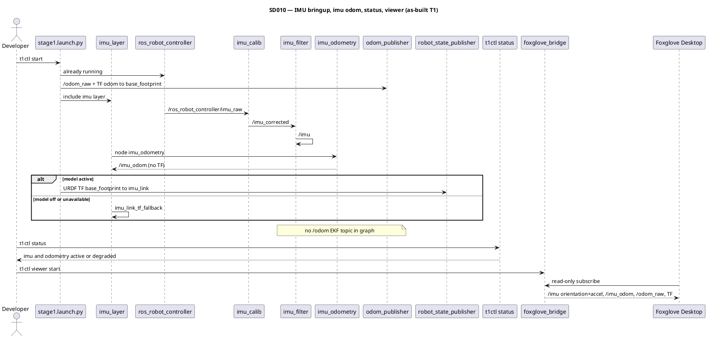

# SD010. Технический дизайн

## Системный дизайн
1. **D1.** Фича F04 добавляет в demo-контур отдельный IMU-слой поверх существующего `stage1`, по тому же принципу, что `lidar_layer.launch.py` и `camera_layer.launch.py`. Слой поднимает штатный `imu_filter` с образа (`hiwonder_peripherals/launch/imu_filter.launch.py`), подписывается на уже существующий `/ros_robot_controller/imu_raw` и даёт контракт `/imu`. Не включаем `hiwonder_controller.launch.py`, `ekf_node` / `robot_localization`, штатный `bringup.launch.py` и не добавляем источник Twist.
2. **D2.** Контракт данных для этапа 1 и заготовки F15:
   1. **D2.1.** Живой `/imu` (`sensor_msgs/Imu`) — выход штатного `imu_filter` (ориентация + ускорение + угловая скорость). Имя топика целимся в `/imu`; если launch образа публикует иное (`imu/data` и т.п.) — remap в нашем слое. Литералы с образа фиксируются as-built на T1, не выдумываются заранее.
   2. **D2.2.** IMU-одометрия `/imu_odom` (`nav_msgs/Odometry`): высокочастотный поток для F15. Поза — ориентация базы из IMU и статическая extrinsics URDF; **положение (x,y,z) не интегрируется из ускорения** (BA: без оценки bias). Twist: угловая скорость в базе, линейная — нули. Нода **не публикует TF**. Кадры: `header.frame_id=imu_odom`, `child_frame_id=base_footprint`, чтобы не спорить с `imu_link` модели и с `odom → base_footprint`.
   3. **D2.3.** Источник позы следования этапа 1 без изменений: `/odom_raw` + TF `odom → base_footprint` от существующего `odom_publisher`. Топик `/odom` (EKF) в этом SD не поднимаем.
3. **D3.** TF `imu_link` — как лидар/камера, один child / один источник:
   1. **D3.1.** Модель активна и launch-ready → TF от `robot_state_publisher`.
   2. **D3.2.** Модель выключена или недоступна → `imu_link_tf_fallback` (`static_transform_publisher`) `base_footprint → imu_link`. Композиция URDF: `base_footprint → base_link` (z=0.127) + `imu_joint` (`xyz="0.0048416 0.011168 -0.0057398"`, `rpy="π 0 -π/2"`). Это отладочная привязка, не калибровка.
   3. **D3.3.** При активной модели fallback не публикуется (нет duplicate child `imu_link`). `imu_filter` с `publish_tf` не должен вещать TF с child `imu_link` или `base_footprint`; если штатный launch это делает — в слое принудительно выключаем.
4. **D4.** Bringup жив при отсутствии IMU: нет пакета/`imu_filter`/железа/потоков — `stage1` не падает, слой пишет `[imu_layer] degraded — ...`.
5. **D5.** `t1ctl status`: две новые строки рядом с lidar/camera.
   1. **D5.1.** `imu`: `active` только если есть `/imu`, `/imu_odom` и TF `base_footprint → imu_link`; иначе `degraded` при живом demo; `inactive` если контейнер down / probe пропущен.
   2. **D5.2.** `odometry`: `active` только если есть `/odom_raw` и TF `odom → base_footprint`; иначе `degraded` / `inactive` по тем же правилам, что лидар.
6. **D6.** Viewer: `foxglove_bridge` остаётся read-only, новый whitelist топиков не вводим. `t1ctl viewer status` и `docs/SD/SD005/ops.md` подсказывают, как открыть ориентацию и ускорение `/imu` (и при желании `/imu_odom` как Odometry). Fixed frame 3D по-прежнему `odom`.
7. **D7.** Вне scope: оценка bias, GNSS, локализация на карте, EKF `/odom`, продуктовое использование IMU-одометрии в follow/motion, новый publisher на шасси.

### As-built (стенд T1)

Снято на стенде T1 после `t1ctl start` (2026-08-25). Диагностика ROS **внутри контейнера** — `source /home/ubuntu/ros2_ws/.hiwonderrc` (иначе `ROS_DOMAIN_ID` не совпадает с графом и `ros2 topic list` пуст).

| Параметр | Значение |
|----------|----------|
| Vendor launch | `hiwonder_peripherals/launch/imu_filter.launch.py` (`/home/ubuntu/ros2_ws/install/hiwonder_peripherals/share/hiwonder_peripherals/launch/imu_filter.launch.py`) |
| Ноды цепочки | `imu_calib` (`apply_calib`), `imu_filter` (`complementary_filter_node`, пакет `imu_complementary_filter`) |
| Поток IMU | `/ros_robot_controller/imu_raw` → `imu_calib` → `/imu_corrected` → `imu_filter` → `/imu` |
| `/imu` | `sensor_msgs/msg/Imu`, publisher `imu_filter`, `header.frame_id=imu_link` |
| Remap overlay | не потребовался: vendor launch уже делает `imu/data` → `/imu` |
| `publish_tf` фильтра | `false` (дефолт vendor); TF от `imu_filter` нет |
| TF `imu_link` | при активной модели — `robot_state_publisher` (`base_footprint → imu_link`); иначе `imu_link_tf_fallback` (`static_transform_publisher`, аргументы `0.0048416 0.011168 0.1212602 -1.5707963267948966 0 3.1415926535897931 base_footprint imu_link`) |
| `tf2_echo base_footprint imu_link` | Translation `[0.005, 0.011, 0.121]`; RPY (deg) `[180.000, -0.000, -90.000]` |
| `/imu_odom` | `nav_msgs/msg/Odometry`, publisher `imu_odometry` (пакет `mentorpi_localization` **0.1.0**), ~50 Hz; `header.frame_id=imu_odom`, `child_frame_id=base_footprint`; `pose.pose.position` всегда `(0,0,0)`; `twist.linear` нули; `twist.angular` — гироскоп в базе; **TF не публикуется** (кадра `imu_odom` в TF-дереве нет) |
| `/odom_raw` | `nav_msgs/msg/Odometry`, publisher `odom_publisher` (без изменений SD003/SD005) |
| TF одометрии | `odom → base_footprint` от `odom_publisher`; `tf2_echo odom base_footprint` — нулевая трансляция при стоянии |
| Нет в графе | топик `/odom` (EKF-фьюжн), нода `ekf_filter_node` |
| `t1ctl status` (живой стенд) | `imu: active`, `odometry: active` (при полном demo-контуре); `platform model: degraded` — см. STATUS.md, вне scope SD010 |
| `t1ctl viewer status` | cheat-sheet `imu` (`/imu`), `imu odom` (`/imu_odom`), `imu tf` (`base_footprint -> imu_link`); блок FOXGLOVE DESKTOP — Plot/IMU: orientation + linear_acceleration `/imu` |
| Версии overlay | `mentorpi_bringup` **0.1.3**, `mentorpi_localization` **0.1.0**, `t1ctl` **1.3.0** |

#### Исключения (D7)

- Оценка bias IMU, GNSS, локализация на карте — **не в SD010**.
- Топик `/odom` (фьюжн EKF) и продуктовое использование IMU-одометрии в контуре движения / follow — **F15** (`docs/SD/SD001/tech.md`).
- `platform_adapter`, follow этапа 1 и `odom_publisher` **не читают** `/imu_odom`; поза follow — `/odom_raw` + TF `odom → base_footprint`.

#### Пакет `imu_complementary_filter`

На vendor-образе `MentorPi` пакета **нет**. Overlay ставит штатный apt `ros-humble-imu-complementary-filter` в `docker/mentorpi-t1/Dockerfile` (бинарь Humble, не source `CCNYRoboticsLab/imu_tools` и не метапакет `ros-humble-imu-tools` — тот тянет rviz). `scripts/provision-pi.sh` пересобирает image, если в нём нет `/opt/ros/humble/lib/imu_complementary_filter/complementary_filter_node`. После смены Dockerfile: `FORCE_REBUILD=1 ./scripts/provision-pi.sh` (контейнер пересоздаётся, если image id сменился).

#### PlantUML (фактический поток)

## Программные интерфейсы

### ROS 2 launch
1. **I1.** Новый `src/mentorpi_bringup/launch/imu_layer.launch.py`, include из `src/mentorpi_bringup/launch/stage1.launch.py`.
   1. **I1.1.** Аргумент `enable_imu` по умолчанию `true`.
   2. **I1.2.** Аргумент `enable_robot_model` — тот же контракт fallback, что у лидара/камеры.

### ROS 2 данные
1. **I2.** Топики и кадры (имена фильтра — as-built T1, целимся в литералы ниже).
   1. **I2.1.** `/ros_robot_controller/imu_raw` — `sensor_msgs/msg/Imu`, `frame_id=imu_link` (без изменения RRC).
   2. **I2.2.** `/imu` — `sensor_msgs/msg/Imu`, выход `imu_filter`.
   3. **I2.3.** `/imu_odom` — `nav_msgs/msg/Odometry`; `header.frame_id=imu_odom`; `child_frame_id=base_footprint`; `pose.pose.position = (0,0,0)`; ориентация и `twist.angular` из IMU; TF не публикуется.
   4. **I2.4.** `/odom_raw` + TF `odom → base_footprint` — без изменения контракта SD005/SD003.

### Host CLI `t1ctl`
1. **I3.** Unified probe в `host/t1ctl/src/ros_probe.py`: флаги `T1CTL_IMU`, `T1CTL_IMU_MSG`, `T1CTL_IMU_ODOM`, `T1CTL_IMU_TF`, `T1CTL_ODOM`, `T1CTL_ODOM_MSG`, `T1CTL_ODOM_TF`. Строки `imu` и `odometry` в `host/t1ctl/src/ui.cpp`. Версия t1ctl: **1.2.0 → 1.2.1** (новая функциональность, patch по `AGENTS.md`).
2. **I4.** `t1ctl viewer status`: ключи `imu`, `imu odom`, `imu tf` и блок FOXGLOVE DESKTOP (Plot/IMU: ориентация и linear_acceleration `/imu`).

### Нода `imu_odometry`
1. **I5.** Пакет `mentorpi_localization` (C++17, `ament_cmake`), executable `imu_odometry`. Параметры: `imu_topic` (`/imu`), `odom_topic` (`/imu_odom`), `odom_frame_id` (`imu_odom`), `base_frame_id` (`base_footprint`), статический quaternion IMU→base из URDF. Нет сервисов, нет TF broadcaster.

## Изменения в приложениях

### `src/mentorpi_bringup`
**Пункты:** D1, D3, D4, I1, I2.1, I2.2

Сейчас `stage1` уже поднимает RRC и `odom_publisher`, IMU-фильтр в списке Remaining. Появляется IMU-слой: vendor `imu_filter`, fallback TF, include ноды `imu_odometry`, degraded без падения контура.

1. Добавить `imu_layer.launch.py` и `enable_imu` в `stage1.launch.py`; убрать F04 из Remaining.
2. Bump `mentorpi_bringup` **0.1.1 → 0.1.2**.
3. Не включать EKF, `hiwonder_controller.launch.py`, `bringup.launch.py`, servo, второй Twist.

### `src/mentorpi_localization` (новый)
**Пункты:** D2.2, I2.3, I5

Новый пакет overlay: только IMU-одометрия как поток. Follow и `platform_adapter` его не читают.

1. Нода `imu_odometry`: подписка `/imu` → публикация `/imu_odom` без TF и без интеграции ускорения в позицию.
2. Не публиковать `/odom`, не оценивать bias, не писать на шасси.

### `host/t1ctl`
**Пункты:** D5, D6, I3, I4

Тот же unified `docker exec` probe, что для lidar/camera. Две строки статуса и cheat-sheet viewer.

1. Расширить `ros_probe.py`, `units.hpp`/`units.cpp`, `ui.cpp`, тесты `test_status.cpp`.
2. Viewer: константы в `viewer.hpp`, подсказки в `ui.cpp`; whitelist bridge не трогать.
3. Bump t1ctl **1.2.0 → 1.2.1**.

### `docs/SD/SD005` и каталог
**Пункты:** D6, D7

1. `ops.md`: шаги проверки IMU в Foxglove и строк `imu`/`odometry` в `t1ctl status`.
2. После T5: as-built в этом файле; F04 → SD010 в `docs/SD/SD001/tech.md`.

## ToDo
Порядок: сначала слой и `/imu`+TF, затем поток `/imu_odom`, затем наблюдаемость CLI, затем viewer, затем as-built.

- [x] T1. Подключить IMU-слой и TF `imu_link`
  - **Реализует:** D1, D2.1, D3.1, D3.2, D3.3, D4, I1, I1.1, I1.2, I2.1, I2.2
  - **Файлы:** `src/mentorpi_bringup/launch/imu_layer.launch.py`, `src/mentorpi_bringup/launch/stage1.launch.py`, `src/mentorpi_bringup/package.xml`
  - **Что нужно сделать:** В demo-контуре появляется `imu_layer.launch.py` по образцу лидара/камеры: include штатного `hiwonder_peripherals/launch/imu_filter.launch.py` с образа, вход — уже существующий `/ros_robot_controller/imu_raw` (`frame_id=imu_link`). Выход фильтра приводится к `/imu` remap’ом слоя, если штатное имя другое; фактическое имя пишется в as-built на T5, в коде слоя после проверки на стенде. Аргумент `enable_imu` по умолчанию true; `enable_robot_model` управляет fallback. При активной модели TF `imu_link` только от URDF; иначе `imu_link_tf_fallback` с композицией `base_footprint→base_link` (z=0.127) и `imu_joint`. Duplicate child и TF от `imu_filter` на `imu_link`/`base_footprint` запрещены: `publish_tf` фильтра выключаем, если штатный launch его включает. Нет пакета, launch или железа — лог `[imu_layer] degraded`, `stage1` жив. Не поднимать EKF и `hiwonder_controller.launch.py`. Ноду `imu_odometry` в T1 не подключать (T2).
  - **Критерии приёмки:**
    1. AC1. При живом IMU в графе есть `/imu` (`sensor_msgs/Imu`) и ровно один источник TF `base_footprint → imu_link`.
    2. AC2. При отсутствии `imu_filter`/IMU или `enable_imu:=false` контур жив, слой явно degraded, вымышленных IMU нет.
    3. AC3. `enable_robot_model:=false` даёт fallback без duplicate-TF; RRC, `/odom_raw` и TF `odom → base_footprint` не сломаны; EKF/`/odom` в графе нет.
  - **Проверка:** `t1ctl start`; в контейнере `ros2 topic echo --once /imu`; `tf2_echo base_footprint imu_link`; негатив `enable_imu:=false` и `enable_robot_model:=false`; `ros2 node list` без `ekf_filter_node`.

- [x] T2. Нода IMU-одометрии `/imu_odom`
  - **Реализует:** D2.2, I2.3, I5
  - **Файлы:** `src/mentorpi_localization/**`, `src/mentorpi_bringup/launch/imu_layer.launch.py`
  - **Что нужно сделать:** Новый пакет `mentorpi_localization` (C++17) с нодой `imu_odometry`: на каждое сообщение `/imu` публикует `/imu_odom` без TF broadcaster. Ориентация `base_footprint` получается из quaternion IMU и статического поворота URDF `imu_link→base_link` (обратный `imu_joint`); позиция всегда (0,0,0) — ускорение в позицию не интегрируем. Twist.linear нули; twist.angular — гироскоп, повёрнутый в базу. Кадры: `imu_odom` / `base_footprint`. Невалидный quaternion (не finite / нулевая норма) — сообщение не публикуем, предыдущую позу не выдумываем. Слой T1 запускает ноду; при отсутствии `/imu` нода жива и молчит. Follow, `platform_adapter` и `odom_publisher` ноду не читают.
  - **Критерии приёмки:**
    1. AC1. При живом `/imu` есть `/imu_odom` с `frame_id=imu_odom`, `child_frame_id=base_footprint`, нулевой позицией и ненулевой ориентацией после прогрева фильтра.
    2. AC2. Нет TF с parent `imu_odom` и нет второго TF на child `imu_link` от этой ноды; без `/imu` топик `/imu_odom` не заполняется фейковыми данными.
    3. AC3. В графе по-прежнему нет `/odom` от EKF; `/odom_raw` остаётся источником позы follow.
  - **Проверка:** `ros2 topic echo --once /imu_odom`; `ros2 run tf2_ros tf2_echo imu_odom base_footprint` не должен показывать динамический кадр от этой ноды; `ros2 topic list` без `/odom` fusion.

- [x] T3. Строки `imu` и `odometry` в `t1ctl status`
  - **Реализует:** D2.3, D5.1, D5.2, I2.4, I3
  - **Файлы:** `host/t1ctl/src/ros_probe.py`, `host/t1ctl/src/units.hpp`, `host/t1ctl/src/units.cpp`, `host/t1ctl/src/ui.cpp`, `host/t1ctl/tests/test_status.cpp`, `host/t1ctl/CMakeLists.txt`
  - **Что нужно сделать:** Unified probe расширяется подписками `sensor_msgs/Imu` на `/imu`, `nav_msgs/Odometry` на `/imu_odom` и `/odom_raw`, TF `base_footprint→imu_link` и `odom→base_footprint`. `imu` active только при всех трёх IMU-кусках; `odometry` active только при `/odom_raw` и TF `odom→base_footprint`. Degraded — demo жив, но не все куски; inactive — контейнер down. Печать как у lidar/camera (цвет active/degraded). Unit-тесты parser. Версия t1ctl 1.2.1.
  - **Критерии приёмки:**
    1. AC1. На живом стенде `t1ctl status` показывает `imu: active` и `odometry: active`.
    2. AC2. При оборванном `/imu` или TF `imu_link` — `imu: degraded`; при оборванном `/odom_raw` или TF odom — `odometry: degraded`; контейнер down — обе `inactive`.
    3. AC3. Строки lidar/camera/platform model и parser существующих флагов не сломаны; `t1ctl_test` зелёный.
  - **Проверка:** локально `t1ctl_test`; на стенде `t1ctl status` до и после `enable_imu:=false`.

- [x] T4. Foxglove: ориентация и ускорение IMU
  - **Реализует:** D6, I4
  - **Файлы:** `host/t1ctl/src/viewer.hpp`, `host/t1ctl/src/ui.cpp`, `docs/SD/SD005/ops.md`
  - **Что нужно сделать:** `t1ctl viewer status` печатает cheat-sheet `imu` (`/imu`), `imu odom` (`/imu_odom`), `imu tf` (`base_footprint -> imu_link`) и шаги Foxglove Desktop: Plot или IMU-панель для orientation и linear_acceleration. `ops.md` — как у камеры: сначала `t1ctl status`, потом панели. Bridge read-only, whitelist не добавляем. 3D fixed frame остаётся `odom`; `/odom_raw` в наборе SD005 сохраняется.
  - **Критерии приёмки:**
    1. AC1. `t1ctl viewer status` содержит ключи IMU и блок FOXGLOVE DESKTOP с ориентацией и ускорением.
    2. AC2. По `ops.md` на Mac в Foxglove видны ориентация и ускорение `/imu` без VNC.
    3. AC3. Bridge по-прежнему read-only; cheat-sheet lidar/camera не исчез.
  - **Проверка:** `t1ctl viewer status`; Foxglove `ws://<pi>:8765`; сверка с `ros2 topic echo /imu`.

- [x] T5. As-built, каталог F04, QA-чеклист
  - **Реализует:** D7
  - **Файлы:** `docs/SD/SD010/tech.md`, `docs/SD/SD010/STATUS.md`, `docs/SD/SD001/tech.md`
  - **Что нужно сделать:** Записать фактические имена топиков/кадров/`imu_filter` с стенда в as-built. В `SD001/tech.md` F04 отметить выполненным со ссылкой на SD010. Зафиксировать исключения: нет EKF `/odom`, нет bias/GNSS/карты, follow не читает `/imu_odom`.
  - **Критерии приёмки:**
    1. AC1. As-built совпадает с `ros2 topic list` / `tf2_echo` на стенде.
    2. AC2. F04 в SD001 ссылается на SD010 и отмечен сделанным.
    3. AC3. В документации явно сказано, что `/odom` и продуктовый follow-IMU — F15.
  - **Проверка:** сверка docs с стендом; diff каталога F04.

## Покрытие

| Пункт | Задачи |
|-------|--------|
| D1 | T1 |
| D2.1 | T1 |
| D2.2 | T2 |
| D2.3 | T3 |
| D3.1 | T1 |
| D3.2 | T1 |
| D3.3 | T1 |
| D4 | T1 |
| D5.1 | T3 |
| D5.2 | T3 |
| D6 | T4 |
| D7 | T5 |
| I1 | T1 |
| I1.1 | T1 |
| I1.2 | T1 |
| I2.1 | T1 |
| I2.2 | T1 |
| I2.3 | T2 |
| I2.4 | T3 |
| I3 | T3 |
| I4 | T4 |
| I5 | T2 |

Итог: пунктов 22, задач 5. Непокрытых пунктов: нет.

## Финальный QA (пользователь, T1–T5)

Полная операторская инструкция: [`ops.md`](ops.md). После `./scripts/build-arm64.sh` и `./scripts/deploy-pi.sh`; если в образе нет `ros-humble-imu-complementary-filter` — `./scripts/provision-pi.sh`. Движение платформы не публиковать.

### T1 — IMU layer
1. `t1ctl start`; в логах `[imu_layer]` без падения `stage1`.
2. `ros2 topic echo --once /imu`; `tf2_echo base_footprint imu_link`.
3. Нет `ekf_filter_node` и нет `/odom` fusion.
4. Негатив: `enable_imu:=false` — контур жив, слой degraded.

### T2 — `/imu_odom`
1. `ros2 topic echo --once /imu_odom` — нулевая позиция, кадры `imu_odom`/`base_footprint`.
2. Нет TF от ноды на `imu_link` или `odom`.

### T3 — `t1ctl status`
1. `imu: active`, `odometry: active`.
2. Без IMU-слоя — `imu: degraded`; `t1ctl_test` локально зелёный.

### T4 — Foxglove
1. `t1ctl viewer status` — ключи IMU.
2. На Mac: ориентация и ускорение `/imu`.

### T5 — docs
1. As-built = стенд; F04 → SD010.
