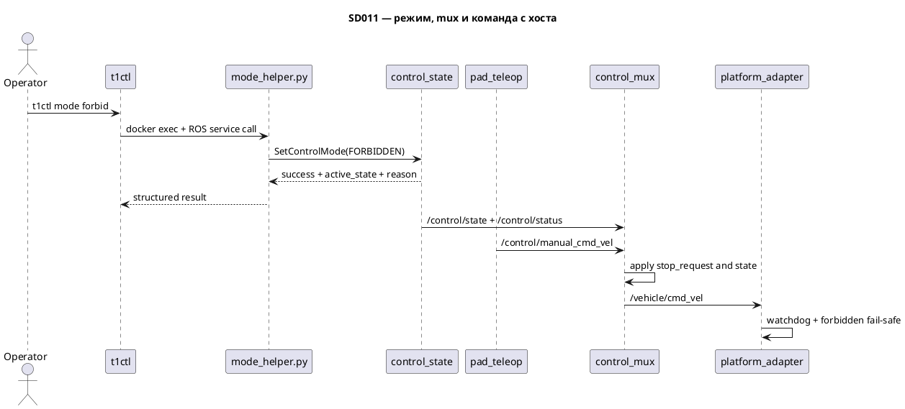

# SD011. Технический дизайн

## Системный дизайн
1. **D1.** Нода режима в [`src/mentorpi_control/src/control_state.cpp`](src/mentorpi_control/src/control_state.cpp) остаётся хозяином `/control/state` и `/control/status`, но превращается из простого toggle в конечный автомат с явным `FORBIDDEN | MANUAL | AUTO_FOLLOW`, причиной запрета и отдельным service-интерфейсом для команд с хоста. После boot состояние по умолчанию остаётся `AUTO_FOLLOW`; кнопка пульта переключает только `MANUAL <-> AUTO_FOLLOW`; из `FORBIDDEN` пульт не выводит.
   1. **D1.1.** `FORBIDDEN` в первой реализации включается только явной командой оператора. Недоступность mode-subsystem не публикует асинхронный `FORBIDDEN`; вместо этого движение не разрешается текущими watchdog/gate, а `t1ctl` честно показывает отсутствие статуса или отказ write-path.
   2. **D1.2.** `ControlStatus` становится операторским снимком состояния: текущий режим, наличие связи с пультом и причина запрета, если активен `FORBIDDEN`.
2. **D2.** Выбор источника команды уходит из `pad_teleop` в отдельный mux/gate внутри overlay, чтобы F06 реально определял, кто управляет шасси.
   1. **D2.1.** `pad_teleop` перестаёт писать прямо в `/vehicle/cmd_vel` и публикует только manual-команду во внутренний топик control-слоя.
   2. **D2.2.** Новый mux подписывается на `manual`-команду, `/pnc/desired_twist`, `/control/state` и `/control/motion_restriction`, а затем публикует единый `/vehicle/cmd_vel` для [`src/mentorpi_platform/src/platform_adapter.cpp`](src/mentorpi_platform/src/platform_adapter.cpp).
   3. **D2.3.** Пока `stop_request=true`, mux держит нули в любом режиме, включая `MANUAL`, но сам режим не меняет. После снятия stop-request он снова пропускает источник, выбранный состоянием.
3. **D3.** [`src/mentorpi_platform/src/platform_adapter.cpp`](src/mentorpi_platform/src/platform_adapter.cpp) не становится арбитром режимов: он сохраняет роль последнего гейта к `/hiwonder_controller/cmd_vel`, watchdog на `/vehicle/cmd_vel` и реакцию на `FORBIDDEN` как дополнительный fail-safe.
4. **D4.** `t1ctl` получает первый write-path в граф без ROS-кода на хосте: C++ CLI вызывает in-container Python helper через `docker exec`, helper вызывает ROS service ноды режима и возвращает структурированный результат для stdout/stderr.
   1. **D4.1.** `t1ctl status` больше не схлопывает `FORBIDDEN` в `follow`: probe читает расширенный `ControlStatus`, парсер хранит `forbidden` как отдельное значение и печатает `reason` только для этого режима.
   2. **D4.2.** Новый `t1ctl mode forbid|allow|manual` использует тот же docker-exec паттерн, что и status/viewer: при успехе печатает короткое подтверждение и переход состояния, при отказе печатает только достоверный kv и `error:` без вымышленного `follow`.

## Программные интерфейсы

### ROS 2 messages / services
1. **I1.** [`src/mentorpi_msgs`](src/mentorpi_msgs) получает service смены режима для команд с хоста.
   1. **I1.1.** `srv/SetControlMode.srv`: request `uint8 target_state`; response `bool success`, `uint8 active_state`, `string reason`.
   2. **I1.2.** `target_state` допускает только `FORBIDDEN`, `MANUAL`, `AUTO_FOLLOW`; `allow` в `t1ctl` маппится на `AUTO_FOLLOW`.
2. **I2.** Расширяется `msg/ControlStatus.msg`.
   1. **I2.1.** Сохраняются существующие поля `state` и `remote_controller` для обратной совместимости с текущим probe.
   2. **I2.2.** Добавляется `string reason`; она пустая вне `FORBIDDEN`, а в `FORBIDDEN` содержит хотя бы `operator`.
3. **I3.** Добавляется внутренний топик manual-команды в control-слое.
   1. **I3.1.** `/control/manual_cmd_vel` — `geometry_msgs/msg/Twist`, publisher: `pad_teleop`, consumer: новый mux.
   2. **I3.2.** `/vehicle/cmd_vel` остаётся единственным входом [`platform_adapter`](src/mentorpi_platform/src/platform_adapter.cpp); прямой publisher из `pad_teleop` туда больше не допускается.
4. **I4.** `t1ctl` получает второй in-container helper рядом с [`host/t1ctl/src/ros_probe.py`](host/t1ctl/src/ros_probe.py).
   1. **I4.1.** Helper возвращает machine-readable результат для `mode`: старое состояние, новое состояние, причина и detail при ошибке.
   2. **I4.2.** Ошибка helper или отсутствие service трактуются как отказ write-path; CLI не делает fallback-публикацию в `/control/state`.

## Изменения в приложениях

### `mentorpi_msgs`
**Пункты:** I1, I2

Пакет уже задаёт контракты Stage 1 и потому должен стать единственным местом, где живут и service смены режима, и расширенный операторский статус. Это удерживает `mentorpi_control`, `mentorpi_platform` и `t1ctl` на одном типобезопасном API и не заставляет host-side helper знать частный wire-format поверх YAML.

1. Добавить `srv/SetControlMode.srv` и расширить `msg/ControlStatus.msg` полем `reason`.
2. Обновить генерацию интерфейсов и зависимости downstream-пакетов на новый typesupport.
3. Не менять значения enum в `ControlState.msg` и не вводить новые режимы вне `FORBIDDEN | MANUAL | AUTO_FOLLOW`.

### `mentorpi_control`
**Пункты:** D1, D2.1, D2.2, D2.3, I3

В [`src/mentorpi_control/src/control_state.cpp`](src/mentorpi_control/src/control_state.cpp) уже живёт владелец режима, а [`src/mentorpi_control/src/pad_teleop.cpp`](src/mentorpi_control/src/pad_teleop.cpp) уже умеет читать пульт и публиковать toggle/remote. Здесь логично сосредоточить весь control-plane: конечный автомат режима, service, manual-команду и mux, который решает, какой источник движения активен до шасси.

1. Расширить `control_state` до service-обработчика с явным `FORBIDDEN`, причиной `operator` и блокировкой toggle из `FORBIDDEN`.
2. Перенаправить `pad_teleop` с `/vehicle/cmd_vel` на `/control/manual_cmd_vel`, сохранив текущие shaping, keepalive и логику `remote_controller`.
3. Добавить новый executable mux в `mentorpi_control`, который роутит manual/follow и накладывает `stop_request` из `/control/motion_restriction`.

### `mentorpi_platform`
**Пункты:** D3, I3.2

[`src/mentorpi_platform/src/platform_adapter.cpp`](src/mentorpi_platform/src/platform_adapter.cpp) уже является последней точкой перед vendor-контроллером и имеет нужный watchdog/fail-safe. Его задача в SD011 — сохранить текущие гарантии и не принять на себя ещё и арбитраж режимов.

1. Оставить подписку на `/vehicle/cmd_vel` и `FORBIDDEN`-zeroing как есть, при необходимости лишь адаптировать комментарии/тесты к тому, что upstream-источник теперь mux.
2. Проверить, что `ChassisStatus.forbidden` остаётся согласованным с новым `FORBIDDEN` от `control_state`.
3. Не подписываться на `/pnc/desired_twist`, `/control/manual_cmd_vel` и `/control/motion_restriction` напрямую.

### `host/t1ctl`
**Пункты:** D4, D4.1, D4.2, I4

[`host/t1ctl/src/main.cpp`](host/t1ctl/src/main.cpp), [`host/t1ctl/src/ui.cpp`](host/t1ctl/src/ui.cpp) и [`host/t1ctl/src/units.hpp`](host/t1ctl/src/units.hpp) уже содержат все паттерны CLI: status, lifecycle-команды, viewer и in-container probe. SD011 расширяет тот же каркас новым состоянием `forbidden`, причиной и first-class командой режима, не добавляя ROS-зависимость на хост.

1. Расширить host-side model/парсеры: `Mode` получает `Forbidden`, status хранит `reason`, help и kv-вывод соответствуют утверждённым макетам в [`docs/SD/SD011/design`](design).
2. Добавить `mode` subcommand в CLI и in-container helper-скрипт/embedded resource для service-вызова через rclpy.
3. Обновить error-path так, чтобы при отказе mode-команды CLI печатал только достоверный kv и безопасный next step, не подставляя `follow` по умолчанию.

### `mentorpi_bringup`
**Пункты:** D2.2

[`src/mentorpi_bringup/launch/stage1.launch.py`](src/mentorpi_bringup/launch/stage1.launch.py) уже собирает control/pad/platform цепочку и должен включить mux в тот же Stage 1 без нарушения существующих слоёв lidar/imu/camera. Это точка, где новый executable станет обязательной частью demo-контура.

1. Добавить mux-ноду в `stage1.launch.py` рядом с `control_state` и `pad_teleop`.
2. При необходимости прокинуть параметры cadence/timeouts только туда, где они действительно нужны; не дублировать настройки `pad_teleop` и `platform_adapter` без причины.
3. Не менять состав viewer/lidar/camera/imu слоёв и не поднимать дополнительные источники команд на шасси.

## ToDo
Порядок: сначала фиксируем общие контракты режима, затем переносим арбитраж в overlay, потом доводим host CLI и интеграцию, чтобы каждую часть можно было проверять независимо.

- [x] T1. Зафиксировать контракт режима и write-path
  - **Реализует:** D1, D1.2, I1, I2
  - **Файлы:** [`src/mentorpi_msgs/msg/ControlStatus.msg`](src/mentorpi_msgs/msg/ControlStatus.msg), [`src/mentorpi_msgs/srv/SetControlMode.srv`](src/mentorpi_msgs/srv/SetControlMode.srv), [`src/mentorpi_msgs/CMakeLists.txt`](src/mentorpi_msgs/CMakeLists.txt), [`src/mentorpi_control/src/control_state.cpp`](src/mentorpi_control/src/control_state.cpp), [`src/mentorpi_control/CMakeLists.txt`](src/mentorpi_control/CMakeLists.txt)
  - **Что нужно сделать:** Ввести service-контракт смены режима и расширенный `ControlStatus`, чтобы `control_state` стал не только publisher'ом состояния, но и публичным API для хоста. В этой же задаче нужно перевести `control_state` на явную работу с `FORBIDDEN`, причиной `operator` и блокировкой toggle из запрета, сохранив boot default `AUTO_FOLLOW` и текущую публикацию `remote_controller`.

    Внутри задачи важно не расползтись в follow/safety-логику: авто-`Forbidden` по внешним сигналам сюда не входит, а `allow` трактуется как явный переход в `AUTO_FOLLOW`. Все downstream-пакеты должны продолжить собираться через `mentorpi_msgs` typesupport без ручных локальных typedef-обходов.
  - **Критерии приёмки:**
    1. AC1. `control_state` публикует `FORBIDDEN`, `MANUAL` и `AUTO_FOLLOW`, а `ControlStatus.reason` пустой вне `FORBIDDEN` и равен `operator` после operator hold.
    2. AC2. Кнопка режима на пульте не выводит систему из `FORBIDDEN`; явный service-вызов `AUTO_FOLLOW` выводит.
    3. AC3. `remote_controller` и boot default `AUTO_FOLLOW` не ломаются относительно текущего поведения SD004.
  - **Проверка:** unit/integration-тест ноды режима; локальный ROS test helper на service-вызовы `FORBIDDEN` и `AUTO_FOLLOW`; ручная проверка публикации `/control/status` и реакции на `/control/mode_toggle`.
- [x] T2. Перенести выбор источника команды в control mux
  - **Реализует:** D2, D2.1, D2.2, D2.3, I3
  - **Файлы:** [`src/mentorpi_control/src/pad_teleop.cpp`](src/mentorpi_control/src/pad_teleop.cpp), [`src/mentorpi_control/src/control_mux.cpp`](src/mentorpi_control/src/control_mux.cpp), [`src/mentorpi_control/CMakeLists.txt`](src/mentorpi_control/CMakeLists.txt), [`src/mentorpi_platform/src/platform_adapter.cpp`](src/mentorpi_platform/src/platform_adapter.cpp), [`src/mentorpi_platform/test/test_adapter_gate.cpp`](src/mentorpi_platform/test/test_adapter_gate.cpp), [`src/mentorpi_control/test/test_joy_control.cpp`](src/mentorpi_control/test/test_joy_control.cpp)
  - **Что нужно сделать:** Убрать прямую публикацию `pad_teleop -> /vehicle/cmd_vel` и заменить её на внутренний manual-топик, после чего добавить mux, который единолично формирует `/vehicle/cmd_vel` из `MANUAL`, `AUTO_FOLLOW` и `stop_request`. Это и есть техническая реализация F06: ровно один источник движения активен одновременно, а safety-stop обнуляет команду поверх режима, не меняя сам режим.

    В этой задаче нельзя переносить арбитраж в `platform_adapter` и нельзя расширять scope до follow-алгоритма: `/pnc/desired_twist` уже существует как контракт, даже если сейчас это нулевая заглушка. После внедрения mux текущие watchdog/fail-safe платформы должны остаться последней линией защиты, а не источником бизнес-логики режима.
  - **Критерии приёмки:**
    1. AC1. В `MANUAL` на `/vehicle/cmd_vel` проходит только manual-команда с пульта, а `/pnc/desired_twist` на шасси не влияет.
    2. AC2. В `AUTO_FOLLOW` на `/vehicle/cmd_vel` проходит только `/pnc/desired_twist`, а пульт может лишь переключить режим.
    3. AC3. При `stop_request=true` mux публикует нули в обоих режимах, а после снятия stop-request возвращает выбранный режим без переключения состояния.
  - **Проверка:** unit-тест mux с комбинациями state/manual/follow/restriction; существующие тесты `pad_teleop` и `platform_adapter`; ручная проверка топиков `/control/manual_cmd_vel`, `/vehicle/cmd_vel`, `/control/motion_restriction` на стенде без подачи ненулевого Twist.
- [x] T3. Расширить `t1ctl status` до `forbidden` и `reason`
  - **Реализует:** D4.1
  - **Файлы:** [`host/t1ctl/src/units.hpp`](host/t1ctl/src/units.hpp), [`host/t1ctl/src/units.cpp`](host/t1ctl/src/units.cpp), [`host/t1ctl/src/ros_probe.py`](host/t1ctl/src/ros_probe.py), [`host/t1ctl/src/ui.cpp`](host/t1ctl/src/ui.cpp), [`host/t1ctl/tests/test_status.cpp`](host/t1ctl/tests/test_status.cpp)
  - **Что нужно сделать:** Расширить host-side модель статуса до трёх состояний режима и добавить `reason`, сохранив существующий probe-механизм через `docker exec` и rclpy. Парсер должен различать нормальный status, отсутствие `/control/status` и реальный `FORBIDDEN`, а UI должен показывать `reason` только при `mode forbidden` и не печатать ложный `follow`, если источник статуса не прочитан.

    Эта задача сознательно не добавляет write-path: она доводит только read-side, чтобы оператор сначала увидел новое состояние и причину, а уже потом получил команду смены режима. Утверждённые кадры из [`docs/SD/SD011/design`](design) должны быть использованы как канон строк help/status/error.
  - **Критерии приёмки:**
    1. AC1. `t1ctl status` печатает `mode forbidden` и `reason operator` или другую непустую причину, когда `/control/status` сообщает `FORBIDDEN`.
    2. AC2. При отсутствии `/control/status` CLI не подставляет `mode follow` по умолчанию и не выглядит как разрешённое движение.
    3. AC3. Существующие строки `demo`, `stock`, `chassis`, `lidar`, `camera`, `imu`, `odometry`, `platform model`, `version` сохраняют текущую семантику и degraded-диагностику.
  - **Проверка:** host unit-тесты парсинга YAML/probe-вывода; снапшот-проверка строк help/status against утверждённые макеты; ручной запуск `t1ctl status` в сценариях normal/forbidden/no-control-status.
- [x] T4. Добавить `t1ctl mode` через service helper
  - **Реализует:** D4, D4.2, I4
  - **Файлы:** [`host/t1ctl/src/main.cpp`](host/t1ctl/src/main.cpp), [`host/t1ctl/src/ui.cpp`](host/t1ctl/src/ui.cpp), [`host/t1ctl/src/units.cpp`](host/t1ctl/src/units.cpp), [`host/t1ctl/src/units.hpp`](host/t1ctl/src/units.hpp), [`host/t1ctl/src/ros_mode.py`](host/t1ctl/src/ros_mode.py), [`host/t1ctl/CMakeLists.txt`](host/t1ctl/CMakeLists.txt)
  - **Что нужно сделать:** Добавить subcommand `mode` с подкомандами `forbid`, `allow`, `manual`, который вызывает in-container helper для `SetControlMode` и печатает краткое подтверждение перехода либо явную ошибку. Helper должен изолировать rclpy/service-детали от C++ CLI и возвращать структурированный текст, который `units.cpp` разберёт так же детерминированно, как сегодня разбирает `ros_probe.py`.

    Здесь нельзя использовать one-shot topic publish как fallback и нельзя молча продолжать при недоступном контейнере или сервисе. Отказ должен оставлять безопасную картину: только достоверный kv, затем `error:` и next step, например `t1ctl start`.
  - **Критерии приёмки:**
    1. AC1. `t1ctl mode forbid` переводит режим в `forbidden` и печатает переход `follow -> forbidden` с причиной `operator`.
    2. AC2. `t1ctl mode allow` из `forbidden` возвращает `follow`, а `t1ctl mode manual` явным образом выбирает ручной режим.
    3. AC3. При down-контейнере или отсутствии service команда завершается с exit 1, печатает `error:` и не создаёт видимость разрешённого движения.
  - **Проверка:** host unit-тесты парсинга ответа helper и веток ошибок; ручной запуск `t1ctl mode forbid|allow|manual`; негативный прогон при остановленном `mentorpi-t1.service`.
- [x] T5. Интегрировать launch, тесты и версионирование компонентов
  - **Реализует:** D3
  - **Файлы:** [`src/mentorpi_bringup/launch/stage1.launch.py`](src/mentorpi_bringup/launch/stage1.launch.py), [`host/t1ctl/CMakeLists.txt`](host/t1ctl/CMakeLists.txt), `package.xml`/`CMakeLists.txt` затронутых пакетов, релевантные test targets
  - **Что нужно сделать:** Включить mux в stage1 launch, обновить версию `t1ctl` до `1.4.0` по утверждённому дизайну и сделать требуемые patch-bump'ы ROS-компонентов, в которых появляется новая функциональность. В этой же задаче нужно свести проверки по пакетам так, чтобы пользователь мог отдельно прогнать host tests и ROS tests до стендового QA.

    Задача завершает интеграцию, но не включает build/deploy на Pi и не расширяет demo-контуру поведение beyond SD011. Все изменения должны оставаться совместимыми с существующим autostart-пайплайном и не создавать второй путь публикации в `/hiwonder_controller/cmd_vel`.
  - **Критерии приёмки:**
    1. AC1. `stage1.launch.py` поднимает новый mux вместе с существующим control/pad/platform набором.
    2. AC2. Версии затронутых компонентов увеличены согласно правилам репозитория и соответствуют новому функционалу CLI `1.4.0`.
    3. AC3. Набор automated tests для host и ROS-пакетов проходит локально без требований к деплою на Pi.
  - **Проверка:** `./scripts/test-host.sh`; `./scripts/test-ros.sh`; просмотр launch-графа; проверка версий в `CMakeLists.txt`/`package.xml` (`t1ctl` 1.4.0, `mentorpi_msgs`/`mentorpi_control` 0.1.1, `mentorpi_bringup` 0.1.4).

## Покрытие

| Пункт | Задачи |
|-------|--------|
| D1 | T1 |
| D1.1 | T4 |
| D1.2 | T1 |
| D2.1 | T2 |
| D2.2 | T2 |
| D2.3 | T2 |
| D3 | T5 |
| D4 | T4 |
| D4.1 | T3 |
| D4.2 | T4 |
| I1 | T1 |
| I2 | T1 |
| I3 | T2 |
| I4 | T4 |

Итог: пунктов 14, задач 5. Непокрытых пунктов: нет.

## Финальный QA (пользователь, T1–T5)

Предусловие: собрать изменения локально, затем при необходимости отдельно выполнить пользовательские build/deploy шаги на Pi; самому build/deploy этот SD не включает.

### T1 — Зафиксировать контракт режима и write-path
1. Поднять локальный граф и убедиться, что `/control/status` отражает `AUTO_FOLLOW` после старта и `FORBIDDEN` после service-вызова.
2. Нажать кнопку режима на пульте и проверить, что toggle не выводит из `FORBIDDEN`, но service `AUTO_FOLLOW` выводит.

### T2 — Перенести выбор источника команды в control mux
1. В `MANUAL` проверить, что живёт `/control/manual_cmd_vel`, а на `/vehicle/cmd_vel` проходит только он.
2. В `AUTO_FOLLOW` проверить, что `/pnc/desired_twist` проходит, manual не влияет, а `stop_request` удерживает нули без смены режима.

### T3 — Расширить `t1ctl status` до `forbidden` и `reason`
1. Проверить `t1ctl status` в normal-сценарии и в `FORBIDDEN` по образцу утверждённых макетов.
2. Имитировать отсутствие `/control/status` и убедиться, что CLI не рисует ложный `follow`.

### T4 — Добавить `t1ctl mode` через service helper
1. Выполнить `t1ctl mode forbid`, `t1ctl mode allow`, `t1ctl mode manual` и сравнить stdout/stderr с кадрами из `docs/SD/SD011/design`.
2. Остановить `mentorpi-t1.service` и убедиться, что `t1ctl mode allow` завершается с ошибкой и безопасным next step.

### T5 — Интегрировать launch, тесты и версионирование компонентов
1. Проверить, что `stage1.launch.py` содержит mux и не меняет состав sensor/viewer слоёв.
2. `./scripts/test-host.sh` и `./scripts/test-ros.sh`; версии: `t1ctl` **1.4.0**, `mentorpi_msgs`/`mentorpi_control` **0.1.1**, `mentorpi_bringup` **0.1.4**. `mentorpi_platform` без bump (роль гейта не менялась).
