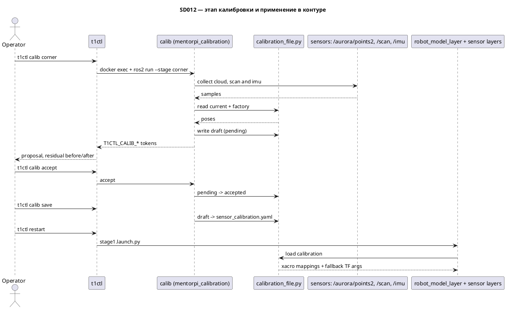

# SD012. Технический дизайн

## Системный дизайн

1. **D1.** Позы крепления сенсоров перестают быть константами в исходниках и становятся файлом калибровки конкретного робота.
   1. **D1.1.** Файл живёт на хосте Pi в `/home/pi/mentorpi_t1_ws/config/platform/t1/` и попадает в контейнер новым bind-mount `/home/pi/mentorpi_t1_ws/config` → `/home/ubuntu/mentorpi_t1_ws/config`, который добавляется в [`scripts/provision-pi.sh`](scripts/provision-pi.sh). Каталог на хосте уже создаётся в [`scripts/deploy-pi.sh`](scripts/deploy-pi.sh) и не перезаписывается rsync (тот трогает только `install/`), поэтому калибровка переживает и обновление кода, и пересоздание контейнера. Цена — один прогон `provision-pi.sh` пользователем.
   2. **D1.2.** Файл хранит только позы крепления относительно `base_link`: `lidar_link`, `imu_link`, `depth_cam_link` — по `xyz` в метрах и `rpy` в радианах, плюс происхождение каждой из шести величин (`computed` или `measured`). Заводские значения зеркалят текущие origin из [`src/mentorpi_description/urdf`](src/mentorpi_description/urdf) и лежат в коде модуля; отсутствие файла, неизвестная `version` или ошибка разбора означают работу на заводских значениях и признак `unused` для оператора.
   3. **D1.3.** Черновик процедуры — отдельный файл рядом. Этап пишет в него предложение со статусом `pending`, `accept` переводит его в принятые значения черновика, `reject` удаляет, `save` переносит черновик в основной файл и очищает его. Живой TF во время процедуры не подменяется: результат виден после `t1ctl restart`.
2. **D2.** Контур берёт позы из файла в обоих существующих путях публикации TF, чтобы калибровка не зависела от того, поднялась ли модель платформы.
   1. **D2.1.** [`src/mentorpi_description/urdf/mentorpi_t1.urdf.xacro`](src/mentorpi_description/urdf/mentorpi_t1.urdf.xacro) получает `xacro:arg` для лидара и IMU по образцу уже существующих `depth_cam_*`, а [`robot_model_layer.launch.py`](src/mentorpi_bringup/launch/robot_model_layer.launch.py) вызывает `xacro.process_file(path, mappings=...)` со значениями из файла калибровки вместо нынешнего вызова без `mappings`.
   2. **D2.2.** Константы `_TEMP_LIDAR_TF`, `_TEMP_DEPTH_TF`, `_TEMP_IMU_TF` в слоях сенсоров заменяются на композицию из того же файла: смещение `base_footprint → base_link` (0.127 из `car_tank.urdf.xacro`) плюс поза крепления плюс optical-подворот. Проверка готовности модели `_robot_model_tf_available()` использует те же `mappings`.
   3. **D2.3.** Optical-подвороты остаются соглашением драйверов и калибровкой не трогаются: `lidar_frame_joint` с yaw π и `depth_cam_optical_joint` с rpy (−π/2, 0, −π/2) продолжают жить в xacro. Разворот лидара на 180°, если он окажется ошибкой соглашения, выражается через yaw крепления, а не через правку optical-джойнта.
3. **D3.** Алгоритмы живут в новом пакете оверлея `mentorpi_calibration` (`ament_python`), а не в `t1ctl`: в контейнере уже есть `numpy` и `scipy`, пакет собирается colcon и тестируется отдельно от хоста.
   1. **D3.1.** Модуль `calibration_file.py` — единственное место чтения и записи файла и черновика, знания о заводских значениях и о композиции fallback-трансформаций. Его импортируют и launch-слои, и этапы калибровки.
   2. **D3.2.** Этап `corner` — единственный этап камеры, метод двух ортогональных плоскостей (адаптация Choi et al., T-RO 2016: depth-камера даёт плоскости напрямую, лидару остаются линии). За одну постановку робота перед прямым углом этап набирает `/aurora/points2`, `/scan` и `/imu`. Из облака последовательным RANSAC выделяются две плоскости стен с проверкой ортогональности нормалей; нормализованное векторное произведение нормалей задаёт вертикаль сцены, из которой берутся `roll` и `pitch` крепления камеры (пол для наклона не нужен). Высота — одномерная оценка по полосе пола: точки ищутся вдоль известной вертикали ниже камеры, доминирования пола в облаке не требуется; если полосы нет (камера наклонена вверх), `z` в предложение не входит, а этап печатает, что высота не наблюдаема и вводится командой `camera`. `x`, `y`, `yaw` камеры — сведением следов стен в плоскости скана: из `/scan` выделяются отрезки прямых, сопоставляются со стенами облака, поправка SE(2) считается закрытой формой при опорной позе лидара. Если yaw-поправка близка к кратному 90°, этап сообщает `cause: axis swap`, а не выдаёт её как тонкую подгонку. По усреднённому вектору ускорения из `/imu` в этом же этапе считаются `roll` и `pitch` крепления IMU. Невязка сведения — RMS расстояния точек скана до плоскостей стен камеры до и после, в метрах; невязка IMU — угол в градусах, как раньше. Отказы явные: одна стена, неортогональные стены, мало точек стен в облаке или скане, неуверенное сведение; отсутствие полосы пола отказом не является.
   3. **D3.3.** Этап `floor` удаляется из кодовой базы целиком: `stages/floor.py`, `stages/floor_plane.py`, `stages/floor_residuals.py` и их тесты уходят из пакета, команда `floor` исчезает из CLI пакета, из поверхности `t1ctl calib` и из help. Причина — QA: RANSAC доминирующей плоскости цепляется за стену (пол — лишь ~4.5% разреженного облака), высота получается недостоверной. Переиспользуемые куски — RANSAC плоскости, solver наклона по вектору «вверх», `stages/imu_mount.py` — переезжают в модули этапа `corner`, а не копируются.
   4. **D3.4.** Этап `drive`: истинное перемещение робота восстанавливается скан-матчингом по `/scan`, колёсная одометрия не используется вовсе. Опора — нонголономность гусеничной платформы: на сегментах чистого поступательного движения направление перемещения совпадает с осью x базы, что даёт yaw крепления лидара; на сегментах чистого вращения смещение лидара относительно центра вращения даёт его `x` и `y`. По тем же сегментам вращения сверяются ось и знак угловой скорости IMU. Инструмент только просит оператора выполнить движение и сообщает, набрано ли достаточно данных.
   5. **D3.5.** Ручные величины: `lidar --height --pitch --roll` для не наблюдаемых из данных двумерного лидара `z`, `roll`, `pitch` крепления и `camera --height` для высоты камеры, когда полоса пола не попадает в кадр. Числа принимаются из аргументов команды, помечаются как `measured` и проходят тот же путь предложения и принятия, что и вычисленные; остальные величины сенсора не трогаются.
   6. **D3.6.** Команды `show`, `accept`, `reject`, `save`, `abort` работают над черновиком и файлом и не требуют данных сенсоров; `show` дополнительно считает текущую невязку согласования камеры и лидара, если оба сенсора живы.
4. **D4.** `t1ctl` остаётся тонким: он не считает калибровку, а запускает in-container утилиту через тот же `docker exec`, что и `ros_probe.py`/`ros_mode.py`, разбирает контрактный stdout и рисует вывод по утверждённым макетам [`docs/SD/SD012/design`](design).
   1. **D4.1.** `t1ctl calib` без аргументов показывает по каждому сенсору действующие значения, происхождение (`factory`, `file`, `unused`) и невязку.
   2. **D4.2.** `t1ctl calib corner|drive|lidar|camera|accept|reject|save|abort` проксирует этапы и работу с черновиком. Поверхность фиксируется этим витком: `floor` удалён вместе с этапом, добавлена команда `camera`; дальнейшие этапы изменений на хосте не требуют.
   3. **D4.3.** В `t1ctl status` появляется ключ `calibration` со значениями `factory | file | unused`; `reason` режима он не занимает, подробности живут в `t1ctl calib`.
5. **D5.** Методика ручного замера высоты и наклона лидара и высоты камеры оформляется отдельным документом репозитория со схемой точек замера: от какой грани, до какой точки, в каких единицах. В выводе CLI её нет.
6. **D6.** Границы. Нода калибровки не публикует ничего на шасси и не подписывается на `/vehicle/cmd_vel`; движение выполняет оператор пультом. Не трогаются: одиночный контейнер `MentorPi` и его автозапуск, вендорские драйверы, коэффициенты одометрии в `hiwonder_controller/config/calibrate_params.yaml` (это отдельный SD), intrinsics камеры.

### As-built (стенд `pi@192.168.2.2`, контейнер `mentorpi-t1`)

| Параметр | Значение |
|----------|----------|
| `numpy` | `1.21.5` |
| `scipy` | `1.8.0` |
| `cv2` | `4.9.0` |
| `laser_geometry` | есть (`liblaser_geometry.so`) |
| `sensor_msgs_py` | отсутствует (`PointCloud2` разбираем numpy вручную) |
| bind-mounts контейнера | `/dev`, `/etc/machine-id`, `/var/lib/dbus`, `/run/user/1000/pulse`, `/tmp/.X11-unix`, `/home/pi/docker_ros2/tmp` |
| `config/` в контейнере | `common/.keep`, `platform/t1/.keep` — из образа, не bind-mount |
| камера | Deptrum Aurora 930, структурный свет, depth 640×400, FOV 74°×51°, дальность 0.15/0.3–3 м |
| `/aurora/points2` (27.08.2026) | ~8.9 Гц, 256000 слотов (640×400), ненулевых ~28.9 тыс. (11.3%), `is_dense=true`, дыры — нули, publisher RELIABLE |
| полоса пола (горизонтальный монтаж) | ~1300 точек/кадр (4.5% живых), 0.42–1.21 м по z; отражения гаснут при угле падения ≲8° |
| стены на уровне камеры | ~8400 точек/кадр (29% живых), 0.24–2.36 м |
| `/scan` (LD19, 27.08.2026) | ~9.9 Гц, 448–449 лучей на 360°, реальных возвратов ~197, «нет эха» = 26.0 (> range_max 25) |
| замер лидара (27.08.2026) | высота 0.180 м (пол → середина оптического кольца); плоскость скана параллельна полу → pitch 0°, roll 0°. В CLI: `--height 0.18 --pitch 0 --roll 0`. Заводской `lidar xyz` z = 0.168 м |
| замер камеры (27.08.2026) | высота 0.145 м (пол → середина корпуса / окна глубины). В CLI: `--height 0.145`. Заводской `camera xyz` z = 0.177 м |



## Программные интерфейсы

### Storage

1. **I1.** Файлы калибровки в `/home/ubuntu/mentorpi_t1_ws/config/platform/t1/` (в контейнере), путь переопределяется переменной окружения `T1_CALIBRATION_DIR`.
   1. **I1.1.** `sensor_calibration.yaml`:

```yaml
version: 1
sensors:
  lidar:   {parent: base_link, xyz: [0.0900035, 0.0, 0.0405196], rpy: [0.0, 0.0, 0.0],
            source: {x: computed, y: computed, z: measured, roll: measured, pitch: measured, yaw: computed}}
  imu:     {parent: base_link, xyz: [0.0048416, 0.011168, -0.0057398], rpy: [3.1415927, 0.0, -1.5707963],
            source: {roll: computed, pitch: computed, yaw: factory, x: factory, y: factory, z: factory}}
  depth_cam: {parent: base_link, xyz: [0.10, 0.0, 0.05], rpy: [0.0, 0.0, 0.0],
            source: {x: computed, y: computed, z: computed, roll: computed, pitch: computed, yaw: computed}}
```

   2. **I1.2.** `sensor_calibration.draft.yaml` — та же схема плюс блок `pending` с полями `stage`, `sensor`, `values`, `residual_before`, `residual_after`, `cause`.

### Python API пакета `mentorpi_calibration`

2. **I2.** Модуль `mentorpi_calibration.calibration_file`.
   1. **I2.1.** `load(dir=None) -> Calibration` и `save(calib, dir=None)`, `load_draft`, `write_draft`, `promote_draft`, `drop_pending`. `Calibration` содержит позы, источник каждой величины и признак `unused` с причиной.
   2. **I2.2.** `xacro_mappings(calib) -> dict[str, str]` — плоский словарь `lidar_x … depth_cam_yaw` для `xacro.process_file(..., mappings=...)`.
   3. **I2.3.** `fallback_tf_args(calib, sensor) -> list[str]` — восемь аргументов `static_transform_publisher` (`x y z yaw pitch roll parent child`) для `base_footprint → lidar_frame | depth_camera_link | imu_link`, с учётом `BASE_LINK_OFFSET_Z = 0.127` и optical-подворотов.

### CLI внутри контейнера

3. **I3.** `ros2 run mentorpi_calibration calib <command>`.
   1. **I3.1.** Команды: `show`, `corner`, `drive`, `lidar --height <м> --pitch <град> --roll <град>`, `camera --height <м>`, `accept`, `reject`, `save`, `abort`. Общий флаг `--timeout <с>` на набор данных. Команды `floor` нет — удалена витком 2.
   2. **I3.2.** stdout — построчный контракт по образцу `ros_probe.py`: `T1CTL_CALIB_OK=0|1`, `stage: <имя>`, `sensor: <имя>`, `field: <имя> <было> <стало> <источник>`, `residual_before: <значение>`, `residual_after: <значение>`, `cause: axis swap`, `source: factory|file|unused`, `reason: <текст>`, `detail: <текст>`. Exit code 0 при успехе, 1 при отказе этапа. Ненаблюдаемая высота камеры — успех со строкой `detail:`, указывающей ввести её через `calib camera --height`; `z` в предложение не входит.

### ROS

4. **I4.** `xacro:arg` в [`mentorpi_t1.urdf.xacro`](src/mentorpi_description/urdf/mentorpi_t1.urdf.xacro): `lidar_x/y/z/roll/pitch/yaw` и `imu_x/y/z/roll/pitch/yaw` рядом с существующими `depth_cam_*`; `lidar.urdf.xacro` и `imu.urdf.xacro` берут origin из них.
5. **I6.** Входы ноды калибровки: `/aurora/points2` (`PointCloud2`, sensor_data QoS), `/scan` (`LaserScan`, sensor_data), `/imu` (`Imu`, sensor_data). Публикаций нет ни на один топик, подписки на `/vehicle/cmd_vel` и `/hiwonder_controller/cmd_vel` не появляется.

### Host CLI

6. **I5.** `t1ctl`.
   1. **I5.1.** `t1ctl calib` — показ состояния калибровки.
   2. **I5.2.** `t1ctl calib corner|drive|lidar|camera|accept|reject|save|abort`, у `lidar` — опции `--height`, `--pitch`, `--roll`, у `camera` — `--height`.
   3. **I5.3.** Ключ `calibration` в `t1ctl status` и секция `CALIB` в `t1ctl --help`.

## Изменения в приложениях

### `mentorpi_calibration` (новый пакет)
**Пункты:** D3.1, D3.2, D3.3, D3.4, D3.5, D3.6, I1.1, I1.2, I2.1, I2.2, I2.3, I3.1, I3.2, I6

Пакета сейчас нет; он появляется как единственное место, где живут и знание о формате калибровки, и алгоритмы её вычисления. Это же место импортируют launch-слои, поэтому знание о позах не расползается по трём launch-файлам и по хосту. Тип сборки — `ament_python` по образцу `hiwonder_controller`, чтобы использовать `numpy`/`scipy` из образа без новых зависимостей.

1. Добавить `calibration_file.py` с заводскими значениями, чтением и записью основного файла и черновика, композицией fallback-трансформаций и словарём xacro-маппингов (сделано в T1/T4, виток 2 не меняет).
2. `cli.py` (console script `calib`): команда `floor` удаляется, добавляются `corner` по D3.2 и `camera --height`; контрактный stdout I3.2 не меняется.
3. Удалить `stages/floor.py`, `stages/floor_plane.py`, `stages/floor_residuals.py` и тесты floor; переиспользуемые куски (RANSAC плоскости, solver наклона по вектору «вверх») перенести в модули этапа `corner`; `stages/imu_mount.py` остаётся как есть.
4. Добавить `stages/corner.py` с модулями выделения плоскостей облака и линий скана и `stages/drive.py` с алгоритмами и расчётом невязки.
5. Не публиковать ROS-топики и не поднимать постоянную ноду в `stage1`: утилита запускается по требованию и завершается.

### `mentorpi_description`
**Пункты:** D2.1, D2.3, I4

Пакет уже параметризован для depth-камеры (`depth_cam_*`), но позы лидара и IMU зашиты в origin джойнтов. Изменение доводит параметризацию до всех трёх сенсоров, оставляя optical-подвороты неизменяемыми.

1. Добавить `xacro:arg` для лидара и IMU и подставить их в `lidar_joint` и `imu_joint`.
2. Сохранить значения по умолчанию равными текущим числам, чтобы без файла калибровки модель не изменилась.
3. Не трогать `lidar_frame_joint` и `depth_cam_optical_joint`.

### `mentorpi_bringup`
**Пункты:** D2.1, D2.2, I2.2, I2.3

Слои [`robot_model_layer.launch.py`](src/mentorpi_bringup/launch/robot_model_layer.launch.py), [`lidar_layer.launch.py`](src/mentorpi_bringup/launch/lidar_layer.launch.py), [`camera_layer.launch.py`](src/mentorpi_bringup/launch/camera_layer.launch.py) и [`imu_layer.launch.py`](src/mentorpi_bringup/launch/imu_layer.launch.py) сегодня содержат три независимые копии правды о позах. Они переводятся на общий загрузчик, оставаясь при этом устойчивыми к его отсутствию: ошибка чтения файла даёт заводские значения и запись в лог, но не роняет `stage1`.

1. Передавать `mappings` из файла калибровки в `xacro.process_file` в `robot_model_layer` и в проверке `_robot_model_tf_available()` каждого сенсорного слоя.
2. Заменить константы `_TEMP_*_TF` на вызов `fallback_tf_args()`.
3. Добавить `exec_depend` на `mentorpi_calibration` и включить пакет в сборку.
4. Не менять состав нод `stage1` и не добавлять постоянную ноду калибровки в контур.

### `host/t1ctl`
**Пункты:** D4.1, D4.2, D4.3, I5.1, I5.2, I5.3

[`main.cpp`](host/t1ctl/src/main.cpp), [`units.cpp`](host/t1ctl/src/units.cpp) и [`ui.cpp`](host/t1ctl/src/ui.cpp) уже содержат весь нужный каркас: подкоманды с вложенными командами (`mode`, `viewer`), запуск через `docker exec` и kv-вывод с шириной ключа 18. Новая подкоманда встраивается в этот каркас без ROS-зависимости на хосте и без embedded-питона: вызывается уже установленный в оверлее `calib`.

1. Добавить `calib.hpp`/`calib.cpp` с запуском in-container утилиты и разбором контракта `T1CTL_CALIB_*` (сделано в T3/T4).
2. Подкоманда `calib`: витком 2 из вложенных команд и help удаляется `floor`, добавляется `camera --height`; вывод по макетам, ошибки в stderr с `error: calib <stage> failed`.
3. Добавить ключ `calibration` в `t1ctl status` и секцию `CALIB` в help; `reason` режима не занимать (сделано в T3).
4. Не отдавать команд на шасси и не делать fallback-публикацию при отказе утилиты.

### `scripts/provision-pi.sh`
**Пункты:** D1.1

Скрипт создаёт контейнер с набором bind-mount, унаследованным от `MentorPi`. Чтобы калибровка пережила пересоздание контейнера, к этому набору добавляется каталог конфигурации.

1. Добавить `-v /home/pi/mentorpi_t1_ws/config:/home/ubuntu/mentorpi_t1_ws/config` в создание контейнера и создать каталог на хосте, если его нет.
2. Не менять остальные mount и не трогать контейнер `MentorPi`.

### `docs`
**Пункты:** D5

Методика замера — операторский документ, а не часть вывода CLI, и должна читаться отдельно от кода.

1. Добавить документ с описанием и схемой точек замера высоты и наклона лидара и высоты камеры.

## ToDo
Порядок: сначала формат и применение калибровки, чтобы файл стал живым, затем read-side CLI, затем этапы от самого простого и наблюдаемого к требующему движения.

- [x] T1. Создать пакет `mentorpi_calibration` и контракт файла калибровки
  - **Реализует:** D1.1, D1.2, D3.1, I1.1, I2.1
  - **Файлы:** `src/mentorpi_calibration/` (`package.xml`, `setup.py`, `mentorpi_calibration/calibration_file.py`, `test/`), [`scripts/provision-pi.sh`](scripts/provision-pi.sh), [`scripts/build-arm64.sh`](scripts/build-arm64.sh)
  - **Что нужно сделать:** Завести пакет `ament_python` и в нём модуль `calibration_file.py`, который знает заводские позы крепления (зеркало origin из `car_tank.urdf.xacro`, `lidar.urdf.xacro`, `imu.urdf.xacro`, `depth_camera.urdf.xacro`), умеет читать и писать `sensor_calibration.yaml` по схеме I1.1 и отдавать структуру с позой и происхождением каждой из шести величин. Отсутствие файла, неизвестная `version`, битый YAML и выход значения за разумные пределы должны давать не исключение, а заводские значения плюс признак `unused` с текстом причины. Каталог берётся из `T1_CALIBRATION_DIR`, по умолчанию `/home/ubuntu/mentorpi_t1_ws/config/platform/t1`.

    В этой же задаче в `provision-pi.sh` добавляется bind-mount каталога конфигурации, а пакет включается в сборку оверлея — сейчас `build-arm64.sh` собирает `--packages-up-to mentorpi_bringup mentorpi_platform`, поэтому пакет должен либо попасть в этот список, либо стать зависимостью `mentorpi_bringup`. Алгоритмы этапов, черновик и CLI сюда не входят: задача закрывает только формат, загрузчик и место хранения.
  - **Критерии приёмки:**
    1. AC1. При отсутствии файла загрузчик отдаёт заводские позы, совпадающие с origin в xacro до седьмого знака, и признак `unused` с причиной `no file`.
    2. AC2. Записанный и прочитанный обратно файл даёт те же значения и то же происхождение каждой величины.
    3. AC3. Битый YAML и неизвестная `version` не приводят к исключению: возвращаются заводские значения и причина.
    4. AC4. Пакет собирается colcon вместе с остальным оверлеем, новых apt- или pip-зависимостей не появляется.
  - **Проверка:** unit-тесты пакета на загрузку, запись, отсутствие файла и битый файл; `colcon build --base-paths src`; просмотр диффа `provision-pi.sh` на предмет единственного нового `-v`.

- [x] T2. Применить калибровку к позам сенсоров в контуре
  - **Реализует:** D2.1, D2.2, D2.3, I2.2, I2.3, I4
  - **Файлы:** [`src/mentorpi_description/urdf/mentorpi_t1.urdf.xacro`](src/mentorpi_description/urdf/mentorpi_t1.urdf.xacro), [`src/mentorpi_description/urdf/lidar.urdf.xacro`](src/mentorpi_description/urdf/lidar.urdf.xacro), [`src/mentorpi_description/urdf/imu.urdf.xacro`](src/mentorpi_description/urdf/imu.urdf.xacro), [`src/mentorpi_bringup/launch/robot_model_layer.launch.py`](src/mentorpi_bringup/launch/robot_model_layer.launch.py), [`src/mentorpi_bringup/launch/lidar_layer.launch.py`](src/mentorpi_bringup/launch/lidar_layer.launch.py), [`src/mentorpi_bringup/launch/camera_layer.launch.py`](src/mentorpi_bringup/launch/camera_layer.launch.py), [`src/mentorpi_bringup/launch/imu_layer.launch.py`](src/mentorpi_bringup/launch/imu_layer.launch.py), `src/mentorpi_calibration/mentorpi_calibration/calibration_file.py`
  - **Что нужно сделать:** Дописать в `calibration_file.py` две функции применения — `xacro_mappings()` и `fallback_tf_args()` — и перевести на них оба пути публикации TF. В `mentorpi_description` появляются `xacro:arg` для лидара и IMU с текущими числами в качестве значений по умолчанию, а `robot_model_layer` начинает передавать `mappings`; в трёх сенсорных слоях константы `_TEMP_*_TF` заменяются вызовом `fallback_tf_args()`, а `_robot_model_tf_available()` проверяет модель с теми же `mappings`. Композиция fallback учитывает смещение `base_footprint → base_link` 0.127 и optical-подвороты, которые остаются в xacro и не калибруются.

    Существующая деградация слоёв должна сохраниться: ошибка чтения калибровки или обработки xacro пишет в лог `degraded` и не роняет `stage1`, а сенсор остаётся с заводской позой, а не без TF вовсе. Порядок публикации не меняется: при живой модели fallback по-прежнему подавляется, чтобы не появилось двух родителей у одного кадра.
  - **Критерии приёмки:**
    1. AC1. Без файла калибровки TF-дерево численно совпадает с текущим: `base_footprint → lidar_frame`, `→ depth_camera_link`, `→ imu_link` дают те же значения, что и сегодня.
    2. AC2. С файлом калибровки, отличающимся от заводского, изменённая поза видна в TF при живой модели платформы и при `enable_robot_model:=false` одинаково.
    3. AC3. Битый файл калибровки оставляет контур живым: слои пишут `degraded`, сенсоры остаются на заводских позах, дублирующих publisher одного кадра не появляется.
    4. AC4. Optical-подвороты `lidar_frame_joint` и `depth_cam_optical_joint` не изменились.
  - **Проверка:** unit-тесты на `xacro_mappings` и `fallback_tf_args`; локальный запуск `stage1.launch.py` в контейнере с подменённым `T1_CALIBRATION_DIR` и `ros2 run tf2_ros tf2_echo` по трём парам кадров; повтор с `enable_robot_model:=false` и с намеренно битым файлом.

- [x] T3. Показать состояние калибровки в `t1ctl`
  - **Реализует:** D4.1, D4.3, I5.1, I5.3
  - **Файлы:** [`host/t1ctl/src/main.cpp`](host/t1ctl/src/main.cpp), `host/t1ctl/src/calib.hpp`, `host/t1ctl/src/calib.cpp`, [`host/t1ctl/src/ui.cpp`](host/t1ctl/src/ui.cpp), [`host/t1ctl/src/ui.hpp`](host/t1ctl/src/ui.hpp), [`host/t1ctl/src/units.cpp`](host/t1ctl/src/units.cpp), [`host/t1ctl/src/ros_probe.py`](host/t1ctl/src/ros_probe.py), [`host/t1ctl/tests/test_status.cpp`](host/t1ctl/tests/test_status.cpp), [`host/t1ctl/CMakeLists.txt`](host/t1ctl/CMakeLists.txt)
  - **Что нужно сделать:** Добавить read-side: подкоманду `t1ctl calib` без аргументов, которая через `docker exec` вызывает `calib show` в контейнере, разбирает контракт `T1CTL_CALIB_*` и печатает по каждому сенсору значения, происхождение и невязку по макетам `docs/SD/SD012/design`. Одновременно в `t1ctl status` появляется ключ `calibration` со значением `factory`, `file` или `unused`; он не занимает `reason` режима, а подробности и причину неприменения оператор смотрит в `t1ctl calib`.

    Задача сознательно не добавляет write-path: этапы, черновик и сохранение идут следующей задачей, чтобы оператор сначала увидел, что вообще происходит с калибровкой. Отказ утилиты или остановленный контейнер должны давать честную картину — `error:` в stderr и отсутствие выдуманных значений, по образцу того, как `t1ctl status` не подставляет `follow` без `/control/status`.
  - **Критерии приёмки:**
    1. AC1. `t1ctl calib` без файла калибровки печатает по трём сенсорам заводские значения и `source factory`.
    2. AC2. `t1ctl status` печатает ключ `calibration` с одним из трёх значений и не меняет семантику остальных ключей.
    3. AC3. При остановленном контейнере `t1ctl calib` завершается с кодом 1, печатает `error:` и не показывает значения как достоверные.
    4. AC4. `t1ctl --help` содержит секцию `CALIB` и словарь значений `calibration` согласно макету.
  - **Проверка:** host unit-тесты парсинга контракта и веток ошибок с `MockRunner`; сверка stdout с кадрами `Вывод — калибровка завод.html`, `Вывод — статус норма.html`, `Вывод — help.html`; запуск на стенде при поднятом и остановленном `mentorpi-t1.service`.

- [x] T4. Механика черновика и контрактная поверхность CLI
  - **Реализует:** D1.3, D3.6, D4.2, I1.2, I3.1, I3.2, I5.2
  - **Файлы:** `src/mentorpi_calibration/mentorpi_calibration/cli.py`, `src/mentorpi_calibration/mentorpi_calibration/calibration_file.py`, [`host/t1ctl/src/main.cpp`](host/t1ctl/src/main.cpp), `host/t1ctl/src/calib.cpp`, [`host/t1ctl/src/ui.cpp`](host/t1ctl/src/ui.cpp), [`host/t1ctl/tests/test_status.cpp`](host/t1ctl/tests/test_status.cpp)
  - **Что нужно сделать:** (сужено витком 2 по факту QA) Собрать сквозной write-path процедуры: `cli.py` с контрактным выводом I3.2, черновик `sensor_calibration.draft.yaml` с блоком `pending`, команды `accept`, `reject`, `save`, `abort` и регистрация подкоманды `calib` в `t1ctl`. Механика pending → accept → save с атомарной записью, частичными позами по осям и отказами `no draft` / `no pending` / `no changes` — то, что из этой задачи переживает переработку и обслуживает все этапы.

    Реализованный в этой же задаче алгоритм этапа `floor` признан по QA негодным (высота камеры недостоверна на разреженном облаке) и удаляется задачей T5 вместе с файлами и тестами; поверхность подкоманд обновляется там же. `save` переносит только принятые значения и очищает черновик; живой TF во время процедуры не подменяется, результат виден после `t1ctl restart`.
  - **Критерии приёмки:**
    1. AC1. `t1ctl calib accept` переносит предложение в черновик, `t1ctl calib reject` его удаляет, и в обоих случаях основной файл не меняется.
    2. AC2. `t1ctl calib save` записывает основной файл, а после `t1ctl restart` значения видны в `t1ctl calib` как `source file` и в TF.
    3. AC3. При остановленном контуре или молчащем сенсоре этап завершается с кодом 1, печатает `T1CTL_CALIB_OK=0` с причиной и не меняет ни черновик, ни файл.
    4. AC4. Ни на один топик утилита не публикует; `/vehicle/cmd_vel` и `/hiwonder_controller/cmd_vel` в её коде не упоминаются.
  - **Проверка:** unit-тесты черновика (`test_draft_calibration_file.py`; тесты pending переезжают на этап `corner` в T5); прогон на стенде по кадрам `Вывод — калибровка сохранение.html`, `Вывод — калибровка отказ контур.html`; `ros2 topic info` по списку публикаций во время работы утилиты.

- [x] T5. Реализовать этап `corner` по ортогональным плоскостям и удалить этап `floor`
  - **Реализует:** D3.2, D3.3, D4.2, I3.1, I5.2, I6
  - **Файлы:** `src/mentorpi_calibration/mentorpi_calibration/stages/corner.py`, `src/mentorpi_calibration/mentorpi_calibration/stages/` (модули плоскостей облака и линий скана; удаление `floor.py`, `floor_plane.py`, `floor_residuals.py`), `src/mentorpi_calibration/mentorpi_calibration/cli.py`, `src/mentorpi_calibration/test/`, [`host/t1ctl/src/main.cpp`](host/t1ctl/src/main.cpp), `host/t1ctl/src/calib.cpp`, [`host/t1ctl/src/ui.cpp`](host/t1ctl/src/ui.cpp), [`host/t1ctl/tests/test_status.cpp`](host/t1ctl/tests/test_status.cpp)
  - **Что нужно сделать:** Реализовать D3.2 целиком. Этап набирает `/aurora/points2`, `/scan` и `/imu` за одну постановку робота перед прямым углом. Из облака последовательным RANSAC выделяются две плоскости стен с проверкой ортогональности нормалей; их векторное произведение задаёт вертикаль, из которой берутся `roll` и `pitch` камеры. Высота — одномерная оценка по полосе пола вдоль известной вертикали, без требования доминирования пола; при отсутствии полосы `z` в предложение не входит, печатается `detail:` с указанием на `calib camera`. Из скана выделяются отрезки прямых, сопоставляются со стенами облака, и закрытой формой считается поправка `x`, `y`, `yaw` камеры при опорной позе лидара; yaw, близкий к кратному 90°, печатается как `cause: axis swap`. Наклон IMU считается переиспользуемым `imu_mount.py`. Невязка сведения — RMS расстояния точек скана до плоскостей стен камеры до и после; невязка IMU — угол в градусах. Численные пороги (минимум точек стены, допуск ортогональности, допуск axis swap) фиксируются константами с пометкой «не SLA», по образцу прежних.

    Вторая половина задачи — вычистить `floor`: файлы `stages/floor.py`, `stages/floor_plane.py`, `stages/floor_residuals.py` и тесты floor удаляются, переиспользуемые куски (RANSAC плоскости, solver наклона) переезжают в модули `corner`, команда `floor` исчезает из `cli.py`, из поверхности `t1ctl calib` и из help; команда `camera` появляется в обеих поверхностях (реализация её логики — T6, до того допустима заглушка `not enough data`). Отказы явные: одна стена, неортогональные стены, мало точек стен в облаке или скане, неуверенное сведение — `T1CTL_CALIB_OK=0` с причиной, черновик и файл не тронуты.
  - **Критерии приёмки:**
    1. AC1. `t1ctl calib corner` перед прямым углом печатает `roll`, `pitch` камеры по вертикали из стен, `z` по полосе пола (если она видна), `x`, `y`, `yaw` по сведению со сканом, `roll`, `pitch` IMU и невязку до и после; невязка после меньше невязки до.
    2. AC2. При полосе пола вне кадра этап выдаёт остальные величины, явно печатает, что высота камеры не наблюдаема и ожидает `calib camera --height`, и не кладёт `z` в pending.
    3. AC3. На стенде с текущим расхождением этап печатает `cause axis swap` и поправку, кратную прямому углу.
    4. AC4. Одна плоская стена или стены не под прямым углом дают отказ с причиной; черновик и файл не меняются.
    5. AC5. Команды `floor` больше нет ни в пакете, ни в `t1ctl calib`, ни в help; файлы `floor*.py` и их тесты удалены из кодовой базы.
    6. AC6. После `accept` и `save` и перезапуска контура облако точек стены ложится на луч скана во вьювере.
    7. AC7. Ни на один топик утилита не публикует.
  - **Проверка:** unit-тесты на синтетике: угол с известной позой камеры (восстановление всех шести величин), сцена без полосы пола (пять величин без `z`), одна стена и неортогональные стены (отказ), yaw 90°/180° (`axis swap`); прогон на стенде по кадрам `Вывод — калибровка угол оси.html` и `Вывод — калибровка отказ сцена.html`; визуальная сверка во вьювере после `t1ctl restart`; `ros2 topic info` по списку публикаций.

- [x] T6. Добавить ручной ввод для лидара и камеры и методику замера
  - **Реализует:** D3.5, D5
  - **Файлы:** `src/mentorpi_calibration/mentorpi_calibration/stages/manual.py`, `src/mentorpi_calibration/mentorpi_calibration/cli.py`, `docs/SD/SD012/measure.md`, `docs/SD/SD012/design/` (схема замера)
  - **Что нужно сделать:** Дать оператору способ внести то, что робот наблюдать не может. Команда `calib lidar --height --pitch --roll` принимает величины в метрах и градусах, команда `calib camera --height` — высоту камеры в метрах, когда полоса пола не попадает в кадр наклонённой вверх камеры. Обе переводят значения во внутреннее представление, показывают разницу с действующими и кладут предложение в черновик тем же путём, что и вычисленные этапы, помечая источник как `measured`; остальные величины сенсора не трогаются. Значения без единиц, вне разумных пределов или в неполном наборе должны отклоняться с внятной причиной.

    Вторая половина задачи — документ методики: от какой грани корпуса и до какой точки лидара мерить высоту, как определить наклон, от пола до какой точки корпуса камеры мерить её высоту, в каких единицах записывать, со схемами точек замера. Документ операторский, в вывод CLI он не попадает, но именно он делает ручной ввод воспроизводимым.
  - **Критерии приёмки:**
    1. AC1. `t1ctl calib lidar --height 0.168 --pitch 0 --roll 0` печатает разницу с действующими значениями и предложение с источником `measured`.
    2. AC2. `t1ctl calib camera --height 0.18` печатает разницу и предложение `measured` только для высоты камеры; остальные величины камеры не меняются.
    3. AC3. После `accept` и `save` в `t1ctl calib` введённые величины показаны как `measured`, а вычисленные сохраняют свой источник.
    4. AC4. Неполный набор опций или значение вне разумных пределов дают отказ с причиной и не меняют черновик.
    5. AC5. Документ методики содержит схемы замера лидара и высоты камеры и позволяет повторить замер без чтения кода.
  - **Проверка:** unit-тесты разбора и валидации аргументов обеих команд; прогон по кадру `Вывод — калибровка лидар.html` и `Вывод — калибровка файл.html`; чтение документа методики и контрольный замер на стенде.

- [x] T7. Реализовать этап `drive`
  - **Реализует:** D3.4
  - **Файлы:** `src/mentorpi_calibration/mentorpi_calibration/stages/drive.py`, `src/mentorpi_calibration/mentorpi_calibration/cli.py`, `src/mentorpi_calibration/test/`
  - **Что нужно сделать:** Закрыть привязку лидара к базе. Этап пишет поток `/scan` и `/imu`, пока оператор катает робота пультом, и скан-матчингом восстанавливает истинную траекторию — колёсная одометрия не используется вообще, поскольку гусеницы неравномерны. Из траектории выделяются сегменты чистого поступательного движения и чистого вращения. На поступательных сегментах направление перемещения в кадре лидара равно оси x базы, потому что гусеничная платформа не ездит боком, — отсюда yaw крепления лидара. На сегментах вращения смещение лидара относительно центра вращения даёт его `x` и `y`. По тем же сегментам сверяются ось и знак угловой скорости IMU; тонкий разворот IMU вокруг вертикали из вращения не восстанавливается и в результат не попадает.

    Инструмент только просит выполнить движение и сообщает, набрано ли достаточно данных; сам он на шасси ничего не отдаёт. Недостаточный проезд, отсутствие сегментов нужного типа, меняющаяся обстановка или несошедшийся скан-матчинг — отказ с указанием, чего не хватило, без изменения черновика.
  - **Критерии приёмки:**
    1. AC1. `t1ctl calib drive` печатает инструкцию оператору, показывает прогресс набора и по завершении выдаёт поправку yaw, `x`, `y` крепления лидара с невязкой до и после.
    2. AC2. Ось и знак вращения IMU проверены и показаны как результат сверки, а не как вычисленный угол.
    3. AC3. Слишком короткий проезд или отсутствие сегмента вращения дают отказ с причиной; черновик и файл не меняются.
    4. AC4. Во время этапа утилита не публикует ни одной команды на шасси, робот двигается только пультом.
  - **Проверка:** unit-тесты сегментации и оценки на синтетической траектории с известным разворотом лидара; прогон на стенде по кадру `Вывод — калибровка езда набор.html` с движением от пульта пользователя; `ros2 topic info /hiwonder_controller/cmd_vel` во время этапа.

- [x] T8. Свести интеграцию, границы и версии компонентов
  - **Реализует:** D6
  - **Файлы:** [`host/t1ctl/CMakeLists.txt`](host/t1ctl/CMakeLists.txt), `src/mentorpi_calibration/package.xml`, [`src/mentorpi_bringup/package.xml`](src/mentorpi_bringup/package.xml), [`src/mentorpi_description/package.xml`](src/mentorpi_description/package.xml), [`README.md`](README.md), [`docs/SD/SD001/tech.md`](../SD001/tech.md)
  - **Что нужно сделать:** Довести изменение до состояния, в котором его можно отдать в QA: поднять версии затронутых компонентов (`t1ctl` до `1.5.0`, `mentorpi_bringup` до `0.1.5`, `mentorpi_description` до `0.1.2`, `mentorpi_calibration` до `0.2.0` — удаление `floor` не считается сломом совместимости, поскольку поверхность `calib` не прошла QA и не была зарелизена), описать в `README.md` порядок калибровки (`corner` → `drive` → `lidar`/`camera` → `save`) и необходимость однократного `provision-pi.sh` ради нового bind-mount, отметить F24 в каталоге `SD001`. Здесь же проверяется соблюдение границ: в оверлее не появилось второго publisher на шасси, коэффициенты одометрии `hiwonder_controller` не тронуты, вендорский контейнер и его автозапуск не изменены.

    Задача не включает сборку и деплой на Pi — их выполняет пользователь. Она также не расширяет поведение контура: постоянной ноды калибровки в `stage1` не появляется, состав слоёв не меняется.
  - **Критерии приёмки:**
    1. AC1. Версии компонентов подняты согласно правилам репозитория и соответствуют новой функциональности.
    2. AC2. `README.md` описывает порядок калибровки и однократный `provision-pi.sh`; F24 отмечена в каталоге `SD001`.
    3. AC3. В диффе нет изменений `calibrate_params.yaml`, нет новых публикаций на `/hiwonder_controller/cmd_vel` и нет изменений в обращении с контейнером `MentorPi`.
    4. AC4. Состав нод `stage1.launch.py` не изменился, постоянной ноды калибровки в контуре нет.
  - **Проверка:** просмотр версий в `package.xml` и `CMakeLists.txt`; полный дифф ветки на предмет запрещённых изменений; `ros2 node list` на стенде после `t1ctl restart`.

## Покрытие

| Пункт | Задачи |
|-------|--------|
| D1.1 | T1 |
| D1.2 | T1 |
| D1.3 | T4 |
| D2.1 | T2 |
| D2.2 | T2 |
| D2.3 | T2 |
| D3.1 | T1 |
| D3.2 | T5 |
| D3.3 | T5 |
| D3.4 | T7 |
| D3.5 | T6 |
| D3.6 | T4 |
| D4.1 | T3 |
| D4.2 | T4, T5 |
| D4.3 | T3 |
| D5 | T6 |
| D6 | T8 |
| I1.1 | T1 |
| I1.2 | T4 |
| I2.1 | T1 |
| I2.2 | T2 |
| I2.3 | T2 |
| I3.1 | T4, T5, T6 |
| I3.2 | T4 |
| I4 | T2 |
| I5.1 | T3 |
| I5.2 | T4, T5, T6 |
| I5.3 | T3 |
| I6 | T5, T7 |

Итог: пунктов 28, задач 8. Непокрытых пунктов: нет.

## Финальный QA (пользователь, T1–T8)

Предусловие: собрать оверлей и `t1ctl` (`./scripts/build-arm64.sh`), выложить на Pi (`./scripts/deploy-pi.sh`) и один раз прогнать `./scripts/provision-pi.sh` ради нового bind-mount каталога конфигурации. Сборку и деплой выполняет пользователь; движение робота на этапе `drive` — тоже только пользователь.

### T1 — Пакет и контракт файла калибровки
1. Убедиться, что без файла `t1ctl calib` показывает заводские значения, а `docker inspect mentorpi-t1` содержит новый mount каталога конфигурации.
2. Положить в каталог битый YAML и убедиться, что контур поднимается на заводских значениях.

### T2 — Применение калибровки в контуре
1. Сравнить `tf2_echo base_footprint lidar_frame` до и после появления файла с изменённой позой.
2. Повторить при `enable_robot_model:=false` и убедиться, что результат тот же.

### T3 — Показ состояния калибровки
1. Сверить `t1ctl calib`, `t1ctl status` и `t1ctl --help` с кадрами `docs/SD/SD012/design`.
2. Остановить `mentorpi-t1.service` и проверить, что `t1ctl calib` даёт ошибку без выдуманных значений.

### T4 — Черновик и контракт CLI
1. Прогнать цепочку `corner` → `accept` → `save` → `t1ctl restart` и убедиться, что значения стали `source file`; проверить, что `reject` снимает pending, а `abort` удаляет черновик, не трогая основной файл.
2. Повторить запуск этапа при остановленном контуре и убедиться, что напечатана причина и файл не изменился.

### T5 — Этап `corner` и удаление `floor`
1. Поставить робота перед прямым углом комнаты, прогнать `t1ctl calib corner`: полная поза камеры (или пять величин с указанием ввести высоту вручную, если пол не в кадре), `cause axis swap` при текущем расхождении, невязка после меньше невязки до.
2. Повторить перед одной плоской стеной — отказ с причиной; убедиться, что `t1ctl calib floor` больше не существует и в help не упоминается.

### T6 — Ручной ввод и методика
1. Измерить по документу методики высоту лидара и высоту камеры, внести их командами `t1ctl calib lidar` и `t1ctl calib camera`.
2. Проверить, что после сохранения обе величины помечены `measured`, а вычисленные источник не потеряли.

### T7 — Этап `drive`
1. Прогнать `t1ctl calib drive`, выполнив проезд и разворот пультом, и проверить поправку разворота лидара.
2. Повторить с заведомо коротким проездом и убедиться в отказе с причиной.

### T8 — Интеграция и границы
1. Проверить версии компонентов и раздел калибровки в `README.md`.
2. Проверить `ros2 node list` после `t1ctl restart`: постоянной ноды калибровки в контуре нет.
