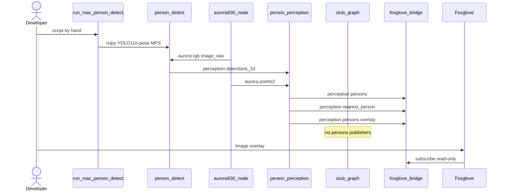

# SD013. Технический дизайн

Дизайн UI: skipped. Рамки — Image-топик в панели Foxglove ([docs/SD/SD005/ops.md](../SD005/ops.md)). Каталог: F08. Трекинг F09 и локализация не входят.

T1 правит [solution.md](solution.md): на Mac уходит только RGB; глубина/облако остаются на роботе для range.

Отдельный процесс NN, трекер не переносим. Локализацию не трогаем. Стек вендора и CPU-ONNX на Pi не используем.

Модель: официальные веса **Ultralytics YOLO11n-pose** (`yolo11n-pose.pt`) — единственный класс COCO Pose это человек; в пайплайн идут только bbox (keypoints отбрасываем, F09 нет). CrowdHuman-форки и Roboflow Inference не берём. Инференс нативно на macOS (PyTorch MPS), не Docker: в Linux-контейнере на Mac нет Metal.

Облако на Mac не нужно. `/aurora/points2` остаётся на роботе: organized 640×400, as-built SD012, нет `/aurora/rgb/camera_info`.

## Системный дизайн

1. **D1.** Два процесса: NN на Mac, геометрия и контракт F08 на роботе.
   1. **D1.1.** На Mac нативная нода `person_detect` (Python, rclpy Humble через RoboStack/Pixi, не Docker): подписка на `/aurora/rgb/image_raw`, YOLO11n-pose (MPS), публикация 2D-рамок. `t1ctl` на Mac не ставим. Запуск — скрипт руками.
   2. **D1.2.** В overlay C++17-нода `person_perception` пакета `mentorpi_perception`: рамки + `/aurora/points2` + TF → `/perception/persons` и `/perception/nearest_person`. Нейросеть на Pi не запускается.
   3. **D1.3.** Веса `yolo11n-pose.pt` на Mac (скачивание Ultralytics при первом запуске или файл рядом со скриптом). Класс не-человек не публикуем. Порог `confidence_threshold` в конфиге Mac (default 0.25) — не SLA.
2. **D2.** Геометрия на роботе. Рамка в пикселях RGB; range не монокулярный.
   1. **D2.1.** Пиксель — низ центра рамки. `/aurora/points2` organized 640×400, кадр `depth_camera_link`. RGB→depth по нормализованному uv (нет `/aurora/rgb/camera_info`). Точка → TF `base_footprint`. `x`,`y` в горизонтальной плоскости базы; `range = hypot(x,y)`.
   2. **D2.2.** Нет валидной глубины / TF / облака — рамка не попадает в persons (на overlay может остаться).
   3. **D2.3.** `nearest` — min `range`; пустой список → `valid: false`.
   4. **D2.4.** `track_id` — индекс кадра, не стабилен (F09).
3. **D3.** Нет рамок с Mac дольше `detections_timeout_ms` (default 1000), нет RGB, нет points2: нода жива, пустой `PersonArray` и `NearestPerson{valid:false}` с `rate_hz` (default 10). Вымышленных людей нет. Отдельный статус t1ctl «Mac offline» не делаем (BA: отказ = нет человека).
4. **D4.** `stub_graph` не публикует `/perception/persons` и `/perception/nearest_person`. Оставляет нули `/pnc/desired_twist` и restriction.
5. **D5.** Overlay Foxglove: `sensor_msgs/Image` `/perception/persons/overlay` (bgr8, stamp/frame как RGB). Рамки с Mac даже без валидной глубины; нет RGB — топик overlay молчит. [docs/SD/SD005/ops.md](../SD005/ops.md) + hint `t1ctl viewer`. Bridge whitelist не сужаем. Viewer read-only.
6. **D7.** Сеть: тот же `ROS_DOMAIN_ID` (стенд обычно `1` из `.hiwonderrc`). Контейнер `mentorpi-t1` уже `--network host`. RGB raw по LAN. Подписка Mac на Image — QoS как у сенсора (`sensor_data` / best effort), иначе DDS не сойдётся. Ethernet стенда `192.168.88.0/24`.
7. **D9.** [stage1.launch.py](../../src/mentorpi_bringup/launch/stage1.launch.py) поднимает `person_perception` вместе с camera_layer. Mac в launch Pi не входит. Версии patch (новая функциональность): `mentorpi_perception` 0.1.0→0.1.1, `mentorpi_bringup` 0.1.5→0.1.6, `mentorpi_stubs` 0.1.0→0.1.1, `t1ctl` 1.5.0→1.5.1 (LAN DDS: `ROS_LOCALHOST_ONLY=0` после `.hiwonderrc` в probe/viewer/calib; hint overlay — T4, 1.5.2). `build-arm64.sh`: `--packages-up-to` тянет пакет через depend bringup; apt в контейнере сборки — `ros-humble-vision-msgs`, `ros-humble-cv-bridge`, `ros-humble-tf2-ros`, `libopencv-dev` (distro, не `/usr/local` 4.10 Deptrum).
8. **D8.** Не меняется: вендорский YOLO, `bringup.launch.py`, Twist на шасси, F09, локализация, поля [PersonHypothesis.msg](../../src/mentorpi_msgs/msg/PersonHypothesis.msg), драйвер Aurora, лидар как класс «человек», Hailo, OpenCV DNN на Pi, передача depth/points2 на Mac.

### As-built (стенд, уже снято в SD008/SD012)

| Параметр | Значение |
|----------|----------|
| RGB | `/aurora/rgb/image_raw`; optical `rgb_camera_link` |
| Cloud | `/aurora/points2` ~8.9 Гц, 640×400 organized, `depth_camera_link` |
| `/aurora/rgb/camera_info` | нет |
| `/aurora/depth/camera_info` | нет |
| `ROS_DOMAIN_ID` | обычно `1` (`.hiwonderrc`) |
| Foxglove bridge | WebSocket read-only; обратный канал гипотез через bridge нельзя |

## Программные интерфейсы

### YAML робота (`share/mentorpi_perception/config/person_perception.yaml`)

1. **I1.** Параметры ноды `person_perception`.
   1. **I1.1.** `detections_topic` default `/perception/detections_2d`, `points_topic` `/aurora/points2`, `rgb_topic` `/aurora/rgb/image_raw`, `base_frame` `base_footprint`, `depth_frame` `depth_camera_link`
   2. **I1.2.** `rate_hz` default 10.0, `detections_timeout_ms` default 1000, `points_timeout_ms` default 1000

### ROS 2, выход восприятия (робот)

1. **I2.** `/perception/persons` — `mentorpi_msgs/PersonArray`, QoS KeepLast(1) reliable.
2. **I3.** `/perception/nearest_person` — `mentorpi_msgs/NearestPerson`; `valid=false` если список пуст.
3. **I4.** `/perception/persons/overlay` — `sensor_msgs/Image` bgr8.

### ROS 2, Mac → робот

1. **I5.** `/perception/detections_2d` — `vision_msgs/Detection2DArray`. `header.stamp` как у RGB. У каждой детекции: `bbox.center.position.x/y` (Humble `vision_msgs/Pose2D`) и `size_x/size_y` в пикселях RGB; `results[0].hypothesis.class_id` строка `person`; `score` — уверенность модели. QoS KeepLast(1) reliable (единственный паблишер — Mac).

### ROS 2, вход робота

1. **I7.** `/aurora/rgb/image_raw`, `/aurora/points2`, `/perception/detections_2d`, TF `depth_camera_link` → `base_footprint`.

### Mac CLI

1. **I6.** Скрипт [scripts/run-mac-person-detect.sh](../../scripts/run-mac-person-detect.sh): `ROS_DOMAIN_ID` (default 1), `image_topic` `/aurora/rgb/image_raw`, путь/имя весов `yolo11n-pose.pt`, `confidence_threshold` 0.25. Не публикует PersonArray.

## Изменения в приложениях

### `host/mac_person_detect` (новый, не overlay)

**Пункты:** D1.1, D1.3, D7, I5, I6

Нативный процесс на macOS: Pixi + канал RoboStack Humble (`rclpy`, `sensor_msgs`, `vision_msgs`, `cv_bridge`) и Ultralytics/PyTorch с MPS. Не входит в `colcon --base-paths src` и не собирается `build-arm64.sh`.

1. Нода `person_detect`: Image → YOLO11n-pose → Detection2DArray
2. Скрипт запуска руками; README/ops: domain 1, Ethernet к Pi
3. Не PersonArray, не overlay, не Twist, не Docker с NN

### `mentorpi_perception` (новый пакет overlay)

**Пункты:** D1.2, D2.1, D2.2, D2.3, D2.4, D3, D5, I1, I2, I3, I4, I7

Слой между рамками Mac и контрактом F08. Геометрия в отдельной библиотеке (тест без стенда). Линковка Distro OpenCV / cv_bridge, не `/usr/local` 4.10.

1. Нода `person_perception` как в D1.2–D3, D5
2. YAML I1
3. Нет Mac / нет глубины — D3, launch не падает
4. Не Twist, не лидар для класса человек, не ONNX на Pi

### `mentorpi_stubs` (`stub_graph`)

**Пункты:** D4

1. Убрать publishers persons/nearest
2. Оставить нули Twist и restriction

### `mentorpi_bringup`

**Пункты:** D9

1. `person_perception` в `stage1.launch.py`, `exec_depend` пакета
2. Не include Mac-launch

### `scripts/build-arm64.sh`

**Пункты:** D9

1. apt: vision-msgs, cv-bridge, tf2-ros, libopencv-dev в контейнере `ros:humble`
2. Пакет подтягивается через `--packages-up-to mentorpi_bringup`

### `t1ctl` + [docs/SD/SD005/ops.md](../SD005/ops.md)

**Пункты:** D5

1. Cheat-sheet `persons overlay` → `/perception/persons/overlay`
2. Шаг в ops: Image-панель overlay; Mac-скрипт как предусловие рамок

## ToDo

Порядок: сначала контракт и заглушка (чтобы не было двух паблишеров persons), затем Mac и геометрия независимо, overlay и bringup поверх живых топиков, тесты геометрии без стенда.

- [x] T1. Контракт overlay: stub без persons, пакет и YAML
  - **Реализует:** D4, D8, I1, I1.1, I1.2
  - **Файлы:** [src/mentorpi_stubs/src/stub_graph.cpp](../../src/mentorpi_stubs/src/stub_graph.cpp), [src/mentorpi_perception/](../../src/mentorpi_perception/), [docs/SD/SD013/solution.md](solution.md)
  - **Что нужно сделать:** Убрать у `stub_graph` публикацию `/perception/persons` и `/perception/nearest_person`, оставить Twist-нули и restriction. Завести пакет `mentorpi_perception` 0.1.0 с YAML I1 (топики и таймауты, без запуска NN). В `solution.md` заменить формулировку «RGB и глубина на Mac» на «RGB на Mac, points2 на роботе для range». Поля PersonHypothesis не менять. Вендорский YOLO, bringup.launch.py и cmd_vel не трогать.
  - **Критерии приёмки:**
    1. AC1. После запуска `stub_graph` топики persons/nearest не имеют этого паблишера; `/pnc/desired_twist` нули и restriction как раньше
    2. AC2. YAML I1 лежит в share пакета, нода ещё может не считать геометрию
    3. AC3. `solution.md` больше не требует передавать глубину на Mac
  - **Проверка:** `ros2 topic info` на persons/nearest; diff stub_graph; чтение YAML и solution.md

- [x] T2. Нативный `person_detect` на Mac
  - **Реализует:** D1.1, D1.3, D7, I5, I6
  - **Файлы:** `host/mac_person_detect/`, [scripts/run-mac-person-detect.sh](../../scripts/run-mac-person-detect.sh)
  - **Что нужно сделать:** Pixi/RoboStack Humble на macOS ARM: нода подписывается на `/aurora/rgb/image_raw` с sensor_data QoS, гоняет YOLO11n-pose на MPS, публикует I5. Скрипт руками задаёт domain (default 1) и порог 0.25. Не Docker. Не публиковать PersonArray. Keypoints модели не уходят в топик. Веса официальные Ultralytics, не CrowdHuman-форк.
  - **Критерии приёмки:**
    1. AC1. При живом RGB и том же domain на LAN есть `/perception/detections_2d` с рамками `person`
    2. AC2. Нет человека в кадре — массив detections пустой, не PersonArray
    3. AC3. Процесс — нативный darwin, не linux/arm64 Docker; `t1ctl` не устанавливается на Mac
  - **Проверка:** скрипт на Mac, `ros2 topic echo /perception/detections_2d` с Mac или из `mentorpi-t1`; `ps`/Activity Monitor — процесс macOS

- [x] T3. Геометрия persons/nearest на роботе
  - **Реализует:** D1.2, D2.1, D2.2, D2.3, D2.4, D3, I2, I3, I7
  - **Файлы:** `src/mentorpi_perception/src/`, `include/mentorpi_perception/`
  - **Что нужно сделать:** Нода `person_perception` читает I5, сэмплит organized `/aurora/points2` в низе рамки через нормализованный uv, TF в `base_footprint`, range = hypot(x,y). Без глубины/TF рамка в persons не входит. nearest — min range. track_id — индекс кадра. Тишина Mac дольше `detections_timeout_ms` — пустой PersonArray и valid=false на `rate_hz`, без вымышленных людей. NN и overlay в этой задаче не обязательны.
  - **Критерии приёмки:**
    1. AC1. Есть рамка и валидная точка облака — persons непустой, nearest.valid true, range в плоскости базы
    2. AC2. Рамка есть, облако дыра/нет TF — persons пустой, nearest.valid false
    3. AC3. Нет detections дольше timeout — пустой persons на rate_hz, нода жива
  - **Проверка:** стенд или rosbag RGB+points2+detections; echo persons/nearest; останов Mac-скрипта

- [x] T4. Overlay Image для Foxglove
  - **Реализует:** D5, I4
  - **Файлы:** `src/mentorpi_perception/`, [docs/SD/SD005/ops.md](../SD005/ops.md), [host/t1ctl/src/ui.cpp](../../host/t1ctl/src/ui.cpp)
  - **Что нужно сделать:** Публиковать `/perception/persons/overlay` bgr8: RGB + рамки из текущего Detection2DArray (и без валидной глубины). Нет RGB — overlay не публиковать. Добавить hint `persons overlay` в `t1ctl viewer status` и строку в ops SD005. Whitelist bridge не сужать. t1ctl 1.5.2.
  - **Критерии приёмки:**
    1. AC1. В Foxglove на overlay видны рамки при живом Mac и RGB
    2. AC2. Mac молчит, RGB жив — overlay без рамок или overlay отсутствует по правилу «нет RGB»; persons пустой (T3)
    3. AC3. Viewer по-прежнему не шлёт команды на шасси
  - **Проверка:** `t1ctl viewer status`, Foxglove Image на overlay; client publish по-прежнему запрещён

- [x] T5. Launch, сборка overlay, версии
  - **Реализует:** D9
  - **Файлы:** [src/mentorpi_bringup/launch/stage1.launch.py](../../src/mentorpi_bringup/launch/stage1.launch.py), [scripts/build-arm64.sh](../../scripts/build-arm64.sh), package.xml
  - **Что нужно сделать:** Включить `person_perception` в stage1 после camera_layer. bringup 0.1.6, depend на `mentorpi_perception`. В `build-arm64.sh` поставить vision-msgs, cv-bridge, tf2-ros, libopencv-dev в `ros:humble`, не линковать OpenCV 4.10 Deptrum. Mac-пакет в colcon `src` не класть. Сборку и деплой на Pi в задаче не запускать.
  - **Критерии приёмки:**
    1. AC1. stage1 стартует `person_perception`; Mac в launch нет
    2. AC2. `build-arm64.sh` собирает `mentorpi_perception` через bringup (проверку делает пользователь)
    3. AC3. Нет HailoRT, нет вендорского YOLO launch, нет параллельного `bringup.launch.py`
  - **Проверка:** чтение launch/CMake/build-arm64.sh; пользователь гоняет `./scripts/build-arm64.sh`

- [x] T6. Тесты геометрии без стенда
  - **Реализует:** D2.1, D2.2 (проверка алгоритма; продуктовая нода — T3)
  - **Файлы:** `src/mentorpi_perception/test/`
  - **Что нужно сделать:** Gtest на сэмпл organized cloud: валидная точка в низе рамки даёт ожидаемые x,y,range; нули/NaN → отказ точки. Без запуска Mac и без Pi.
  - **Критерии приёмки:**
    1. AC1. Синтетическое облако с одной живой точкой в целевом uv проходит
    2. AC2. Дыра (нули) в том же uv — точка отбрасывается
    3. AC3. Тест не ходит в сеть и не требует MPS
  - **Проверка:** `colcon test --packages-select mentorpi_perception` в том же arm64-сборщике, что overlay (пользователь)

## Покрытие

| Пункт | Задачи |
|-------|--------|
| D1.1 | T2 |
| D1.2 | T3 |
| D1.3 | T2 |
| D2.1 | T3, T6 |
| D2.2 | T3, T6 |
| D2.3 | T3 |
| D2.4 | T3 |
| D3 | T3 |
| D4 | T1 |
| D5 | T4 |
| D7 | T2 |
| D8 | T1 |
| D9 | T5 |
| I1 | T1 |
| I1.1 | T1 |
| I1.2 | T1 |
| I2 | T3 |
| I3 | T3 |
| I4 | T4 |
| I5 | T2 |
| I6 | T2 |
| I7 | T3 |

Итог: пунктов 22, задач 6. Непокрытых пунктов: нет. D2.1/D2.2 закрываются целиком в T3 (продукт) и дублируются тестом T6 (тот же алгоритм, не «половина пункта»).

## Финальный QA (пользователь, T1–T6)

Предусловие: пользователь собирает overlay `./scripts/build-arm64.sh` и деплоит сам; на Mac — Pixi/скрипт; Pi и Mac в LAN `192.168.88.0/24`, `ROS_DOMAIN_ID=1`. Агент сборку и деплой не запускает.

### T1 — контракт
1. stub без persons
2. YAML на месте
3. solution.md про RGB-only на Mac

### T2 — Mac
1. echo detections_2d
2. пустой кадр
3. процесс darwin

### T3 — геометрия
1. человек в кадре → nearest
2. нет глубины → valid false
3. стоп скрипта Mac → пустой persons

### T4 — overlay
1. рамки в Foxglove
2. Mac off
3. viewer read-only

### T5 — launch
1. нода в stage1
2. build-arm64
3. нет vendor YOLO

### T6 — gtest
1. colcon test mentorpi_perception (AC1)
2. colcon test mentorpi_perception (AC2)
3. colcon test mentorpi_perception (AC3)
