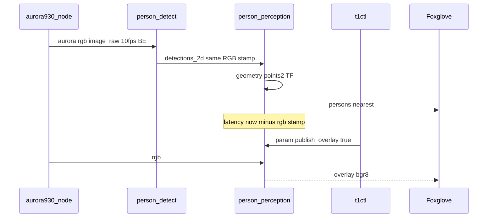

# SD014. Технический дизайн

Дизайн UI: skipped. Каталог: F08, продолжение [SD013](../SD013/tech.md). Overlay — существующая Image-панель Foxglove ([ops.md](../SD005/ops.md)), отдельных экранов t1ctl нет.

Метрика BA: задержка = `person_perception->now() − header.stamp` RGB-кадра в момент публикации `/perception/persons`. Экспозиция камеры не входит. Stamp RGB задаёт драйвер на Pi; Mac копирует его в `detections_2d.header`; NTP Pi↔Mac для метрики не нужен.

Overlay в debug остаётся **bgr8**. Драйверный CompressedImage на T1 нет; своя JPEG-нода **не делается** (T7/T8 отклонены).

## Системный дизайн

1. **D1.** Бюджет 100 мс на горячем пути гипотез, без нового сжатия RGB.
   1. **D1.1.** В `PersonArray` появляется `std_msgs/Header`. `header.stamp` и `header.frame_id` — копия `detections_2d.header` (это stamp/frame входного RGB). Поля `PersonHypothesis` не меняются.
   2. **D1.2.** `persons` и `nearest` публикуются сразу в `on_detections` (геометрия как сейчас: organized `/aurora/points2`, низ рамки, TF `base_footprint`). Стена `rate_hz` (default 10) больше не стоит на свежих рамках: она только шлёт пустой список, если Mac молчит дольше `detections_timeout_ms`.
   3. **D1.3.** Mac подписан на `/aurora/rgb/image_raw`. Своей JPEG-ноды нет.
2. **D2.** Overlay — только отладочный режим.
   1. **D2.1.** ROS-параметр `publish_overlay` (bool), default `false` в declare и в [person_perception.yaml](../../src/mentorpi_perception/config/person_perception.yaml). После reboot / `t1ctl restart` снова боевой режим (false). Runtime `set_parameters` действует до рестарта ноды (`add_on_set_parameters_callback`).
   2. **D2.2.** `false`: не `cv_bridge`, не publish overlay; RGB-подписка только для `width`/`height`. `true`: overlay `/perception/persons/overlay` **bgr8**, stamp/frame как RGB, рамки из свежих detections даже без глубины — как SD013.
3. **D3.** Очередь RGB на Mac (KeepLast(1) + busy-drop) — **отклонена**. Замер CPU 29.08.2026: дёрганье кадров и ~1 ядро `aurora930_node` есть без Mac; KeepLast на подписчике TX raw не останавливает. `person_detect.py` не меняем.
4. **D4.** `t1ctl debug on|off` и `t1ctl debug` (status) выставляют / читают `/person_perception.publish_overlay` через `docker exec` + embedded Python, тот же префикс env что у `mode` ([units.cpp](../../host/t1ctl/src/units.cpp)). Не файл на диске.
5. **D5.** В Foxglove в бою смотрят продовые топики: `/perception/persons`, `/perception/nearest_person`, `/perception/detections_2d`, сырой RGB. Overlay не в прод-раскладке; hint в `t1ctl viewer status` и [ops.md](../SD005/ops.md) — только после `t1ctl debug on`. Whitelist `foxglove_bridge` не сужаем. Viewer read-only.
6. **D6.** Разгрузка `aurora930_node` launch-аргументами overlay, бинарник Deptrum не патчим.
   1. **D6.1.** `ir_enable:=false`: IR-кадр не нужен; `/aurora/ir/image_raw` и `ir/camera_info` не публикуются. `ir_fps` всё равно **10** (vendor: `rgb_fps` ≤ `ir_fps`, иначе rgb не применяется; допустимые ir_fps 5/10/12/15).
   2. **D6.2.** `rgb_fps:=10`.
   3. **D6.3.** Overlay задаёт `qos_overrides` BEST_EFFORT KeepLast(1) на rgb/depth Image и points2. Vendor `aurora930_launch.py` extra yaml не принимает — overlay поднимает тот же executable своей `Node`. As-built после T6: writer RGB всё ещё **RELIABLE** (`ros2 topic info`); выигрыш CPU — от IR off и 10 fps, не от смены reliability.
7. **D7.** Compressed цвет — **отклонён**. На стенде нет `/aurora/rgb/image_raw/compressed`. Свою JPEG-ноду не добавляем: после T6 нагрузка драйвера уже ниже, пользователь T7/T8 не нужны.

Не меняется: F09, следование, Twist / `cmd_vel`, вендорский YOLO, `bringup.launch.py`, бинарник Aurora, points2 как сенсор глубины, инференс на Mac, поля `PersonHypothesis`, контракт nearest (`valid` + hypothesis).

### As-built (стенд T1 / код SD013)

| Параметр | Значение |
|----------|----------|
| RGB | `/aurora/rgb/image_raw`, uncompressed; compressed не as-built |
| Overlay | каждый RGB → `cv_bridge` BGR8 → `/perception/persons/overlay`, флага нет |
| Persons | wall-timer `rate_hz` 10 Гц; `PersonArray` без header |
| Mac | факт кода: `qos_profile_sensor_data` + синхронный `predict` в `_on_image`. Что rclpy реально копит 5 кадров и что это причина >100 мс — **не as-built**, гипотеза |
| t1ctl | ROS param нигде не используется; образец runtime — `t1ctl mode` + `ros_mode.py` |
| Версии | `mentorpi_msgs` 0.1.1, `mentorpi_perception` 0.1.1, `t1ctl` 1.5.2 |

### As-built (стенд T1, Aurora: overlay-defaults vs T6)

Оба окна: `t1ctl debug off`. **До T6** (29.08.2026 ~17:00): `ir_enable` не передавался (IR on), `rgb_fps` 15, `ir_fps` 12. **После T6** (тот же день ~17:50): `ir_enable` false, `rgb_fps`/`ir_fps` 10. Mac `person_detect` в срезе «после» **включён** (как столбец B до T6). Foxglove Desktop в срезе «до» не был клиентом RGB; после T6 жив `foxglove_bridge` ~17% CPU — сравнение docker **в пользу** «до» (лишний процесс в «после»).

| Параметр | До T6 (defaults overlay) | После T6 |
|----------|--------------------------|----------|
| `ir_enable` | true (vendor default) | **false** |
| `/aurora/ir/image_raw` | в графе | **нет топика** |
| `rgb_fps` / факт hz RGB | 15 | 10 / **~10.05 Гц** |
| `ir_fps` | 12 | 10 |
| RGB writer QoS | RELIABLE | RELIABLE (`qos_overrides` не сменили) |
| RGB 640×400 bgr8 | 768000 байт | то же |
| compressed | нет | нет |
| RGB subscriptions | A: perception; B: +Mac | 2: Mac + perception |
| `aurora930_node` (живой PID) | ~100–104% | **~63%** |
| `person_perception` | ~13–14% | ~10% |
| `docker stats` mentorpi-t1 | A Mac off 117–134%; B Mac on **163%** | Mac on **115–122%** |
| eth0 TX за 10 с, Mac on | ~19.4 МБ/с | ~16.0 МБ/с |

Вывод: T6 снижает CPU драйвера примерно на **⅓ ядра** (100% → 63%) и контейнер при живом Mac с ~163% до ~120%, за счёт IR off и 10 fps. Reliability writer не изменилась. T3/T7/T8 CPU не чинят и не делаются.

## Программные интерфейсы

### ROS 2 messages

1. **I1.** [PersonArray.msg](../../src/mentorpi_msgs/msg/PersonArray.msg): первая строка `std_msgs/Header header`, затем `PersonHypothesis[] persons`. `header.stamp` = stamp RGB-кадра пайплайна. В [CMakeLists.txt](../../src/mentorpi_msgs/CMakeLists.txt) / package.xml — depend `std_msgs`. Версия пакета **major** 0.1.1 → 1.0.0 (ломается typehash).
2. **I2.** `/perception/persons` — тот же топик и QoS KeepLast(1) reliable; payload с header. Пустой список при таймауте: header.stamp = `now()` ноды (это не кадр пайплайна).
3. **I3.** `/perception/nearest_person` — `NearestPerson` без header, семантика SD013.

### ROS 2 parameters (робот)

4. **I4.** `publish_overlay` bool, default false. Имя ноды `person_perception` (без namespace в [stage1.launch.py](../../src/mentorpi_bringup/launch/stage1.launch.py)).
5. **I5.** `/perception/persons/overlay` — `sensor_msgs/Image` bgr8 при `publish_overlay=true`; при false топик молчит (publisher может остаться).

### t1ctl и Mac

6. **I6.** CLI: `t1ctl debug on`, `t1ctl debug off`, `t1ctl debug` (status). Machine-readable: `T1CTL_DEBUG_OK=1|0`, `overlay: on|off`. Help в [ui.cpp](../../host/t1ctl/src/ui.cpp). t1ctl **patch** 1.5.2 → 1.5.3.
7. **I7.** Mac `person_detect`: **отклонено** вместе с D3/T3. Топик и Detection2DArray без изменений SD013 (`qos_profile_sensor_data`).
8. **I8.** Overlay launch Aurora: `ir_enable` false, `ir_fps` 10, `rgb_fps` 10, `qos_overrides` BEST_EFFORT KeepLast(1) на `/aurora/rgb/image_raw`, `/aurora/depth/image_raw`, `/aurora/points2`. Версия `mentorpi_bringup` **patch** 0.1.6 → 0.1.7.
9. **I9.** Compressed для удалённых подписчиков — **отклонено** (T7/T8). Основной цвет остаётся `/aurora/rgb/image_raw`.

`mentorpi_perception` patch 0.1.1 → 0.1.2.

## Изменения в приложениях

### `mentorpi_msgs`

**Пункты:** D1.1, I1

Пакет контракта F08. Сейчас `PersonArray` — голый массив, поэтому BA-метрику «stamp публикации persons» нельзя ни записать, ни проверить.

1. Добавить Header в `PersonArray.msg`, depend `std_msgs`, версия 1.0.0
2. Не менять `PersonHypothesis`, `NearestPerson`, сервисы режима

### `mentorpi_perception` (`person_perception`)

**Пункты:** D1.2, D1.3, D2.1, D2.2, I2, I3, I4, I5

Нода сводит рамки Mac и range на роботе. Сейчас каждый RGB копируется в bgr8 ради overlay, а гипотезы ждут таймер до 100 мс — это съедает бюджет BA на Pi ещё до сети.

1. Собрать и опубликовать persons/nearest в `on_detections`; таймер — только пустой список по таймауту
2. Выставить `header` из detections; WARN_THROTTLE если `now − stamp > 100ms` (сообщение всё равно публикуем)
3. Параметр `publish_overlay`, default false; overlay/cv_bridge только при true
4. Не JPEG, не смена топика RGB, не NN на Pi, не Twist

### `host/mac_person_detect`

**Пункты:** D3, I7 (отклонены)

Нода на Mac не меняется в этом SD. D3/T3 отклонены: очередь YOLO не лечит CPU драйвера.

1. Не KeepLast(1), не busy-drop, не смена модели/порога
2. Вход остаётся `/aurora/rgb/image_raw` (T7/T8 отклонены)
3. Не PersonArray, не overlay

### `mentorpi_bringup` (`camera_layer`)

**Пункты:** D6.1, D6.2, D6.3, I8

Слой F05 сейчас передаёт vendor launch с `rgb_fps` 15, `ir_fps` 12 и без `ir_enable` (IR включён). Publisher RGB as-built RELIABLE. Vendor `aurora930_launch.py` не принимает `qos_overrides`.

1. Поднять тот же `aurora930_node` из overlay `Node` с `ir_enable` false, `rgb_fps` 10, `ir_fps` 10
2. `qos_overrides` BEST_EFFORT KeepLast(1) на rgb/depth Image и points2
3. Не JPEG, не патч бинарника, не выключать RGB/depth/points2
4. Версия `mentorpi_bringup` 0.1.7

### `host/t1ctl`

**Пункты:** D4, I6

Хостовый CLI. Образец runtime-сервиса — `mode` + embed Python, не `ros2 param` из shell.

1. Подкоманда `debug on|off` и status; embed helper как `ros_mode.py`
2. Help, тесты CLI, версия 1.5.3
3. Не калибровка-файл, не persistence overlay на reboot

### `docs/SD/SD005/ops.md` и hint viewer

**Пункты:** D5

Операторский viewer. Сейчас overlay рекламируется как штатная Image-панель.

1. Прод: persons, nearest, detections_2d, raw RGB; overlay — только debug
2. Строка `t1ctl viewer status` про overlay с оговоркой debug
3. Whitelist bridge не сужать; viewer read-only

## ToDo

Порядок: stamp и overlay в коде; T3/T7/T8 отклонены; разгрузка Aurora — T6.

- [x] T1. Header PersonArray и публикация гипотез по detections
  - **Реализует:** D1.1, D1.2, I1, I2, I3
  - **Файлы:** `src/mentorpi_msgs/msg/PersonArray.msg`, `src/mentorpi_msgs/package.xml`, `src/mentorpi_msgs/CMakeLists.txt`, `src/mentorpi_perception/src/person_perception.cpp`
  - **Что нужно сделать:** В контракт F08 добавить Header у `PersonArray`: stamp и frame_id копируются из `detections_2d.header`, то есть из stamp входного RGB. Версия `mentorpi_msgs` 1.0.0, depend `std_msgs`. Нода `person_perception` больше не ждёт `rate_hz`, чтобы отдать гипотезы: в `on_detections` сразу считается range по кэшу points2/TF как сейчас и публикуются `/perception/persons` и `/perception/nearest_person`. Таймер 10 Гц остаётся только чтобы слать пустой список и `nearest.valid=false`, если рамок с Mac нет дольше `detections_timeout_ms`. Пустой список по таймауту несёт `header.stamp = now()`. Если `now − header.stamp > 100ms` на непустом списке — WARN_THROTTLE, публикация не отменяется. Поля hypothesis и msg nearest не менять. JPEG и overlay в этой задаче не трогать.
  - **Критерии приёмки:**
    1. AC1. При свежем Detection2DArray persons выходит без ожидания следующего тика `rate_hz`; `header.stamp` равен stamp этого Detection2DArray
    2. AC2. Mac молчит дольше timeout — пустой PersonArray и `valid=false` с частотой `rate_hz`, без вымышленных людей
    3. AC3. `PersonHypothesis` и `NearestPerson` без новых полей; overlay-поведение этой задачей не меняется
  - **Проверка:** после сборки на стенде `ros2 topic echo /perception/persons --once` синхронно с detections; сравнить stamp; остановить Mac-скрипт и убедиться в пустых persons на ~10 Гц

- [x] T2. Overlay только при `publish_overlay`
  - **Реализует:** D2.1, D2.2, I4, I5
  - **Файлы:** `src/mentorpi_perception/src/person_perception.cpp`, `src/mentorpi_perception/config/person_perception.yaml`, `src/mentorpi_perception/package.xml`
  - **Что нужно сделать:** Ввести bool `publish_overlay` default false в YAML и declare. Пока false — в `on_rgb` только размеры кадра, без `toCvCopy` и без publish overlay: в бою нет второго полного bgr8 и нет CPU на конвертацию. Параметр меняется на живой ноде. При true — прежний overlay bgr8 (рамки даже без глубины; нет RGB — молчит). Не сжимать overlay в JPEG. Версия `mentorpi_perception` 0.1.2.
  - **Критерии приёмки:**
    1. AC1. После старта demo `ros2 topic hz /perception/persons/overlay` не показывает поток (топик молчит)
    2. AC2. `ros2 param set /person_perception publish_overlay true` — overlay bgr8 с рамками при живом RGB и detections
    3. AC3. После `t1ctl restart` снова false, без JPEG-топика overlay
  - **Проверка:** param get/set в контейнере; Foxglove Image на overlay только после set true; restart и повторно hz

- [x] T3. Очередь RGB на Mac KeepLast(1) и busy-drop — **отклонена**
  - **Реализует:** D3, I7
  - **Файлы:** нет
  - **Что нужно сделать:** Не реализовывать. Замер 29.08.2026: без Mac `aurora930_node` уже ~1 ядро и кадры дёргаются; KeepLast на Mac не снижает TX и не разгружает драйвер. Вход Mac и модель не трогать.
  - **Критерии приёмки:**
    1. AC1. `person_detect.py` без KeepLast(1) и без busy-drop
    2. AC2. В ToDo нет открытой реализации очереди Mac
    3. AC3. D6/T6 закрывают разгрузку драйвера, не T3
  - **Проверка:** diff `host/mac_person_detect/person_detect.py` без QoS KeepLast(1); задача не в открытом бэклоге

- [x] T4. `t1ctl debug` к параметру overlay
  - **Реализует:** D4, I6
  - **Файлы:** `host/t1ctl/src/main.cpp`, `host/t1ctl/src/ui.cpp`, `host/t1ctl/src/ui.hpp`, новый embed Python по образцу `ros_mode.py`, `host/t1ctl/CMakeLists.txt` (версия 1.5.3), `host/t1ctl/tests/test_status.cpp`
  - **Что нужно сделать:** Команды `t1ctl debug on|off` и `t1ctl debug` (status) через docker exec в `mentorpi-t1` и rclpy `set_parameters`/`get_parameters` на `/person_perception.publish_overlay`. Stdout `T1CTL_DEBUG_OK` и `overlay: on|off`. Help как у остальных подкоманд. Не писать флаг в YAML и не переживать reboot. Юнит-тесты help/парсинга без стенда.
  - **Критерии приёмки:**
    1. AC1. `t1ctl debug on` → overlay публикуется; `t1ctl debug off` → снова молчит
    2. AC2. `t1ctl debug` печатает текущее on/off; нода не найдена — OK=0 и ненулевой exit
    3. AC3. После reboot overlay снова off; `t1ctl -V` = 1.5.3
  - **Проверка:** команды на Pi; тесты `t1ctl_test` на машине разработки; reboot или restart ноды для AC3

- [x] T5. Ops Foxglove: прод-топики vs overlay debug
  - **Реализует:** D5
  - **Файлы:** `docs/SD/SD005/ops.md`, `host/t1ctl/src/viewer.hpp` / вывод viewer status (hint overlay)
  - **Что нужно сделать:** В ops и cheat-sheet viewer описать бой: смотреть `/perception/persons`, `/perception/nearest_person`, `/perception/detections_2d` и сырой RGB. Overlay — только после `t1ctl debug on`, формат bgr8 без смены панели. Whitelist bridge не сужать, viewer read-only. Версию t1ctl если hint ещё не в 1.5.3 — не поднимать отдельно (уже T4).
  - **Критерии приёмки:**
    1. AC1. В ops есть явное разделение прод-топиков и overlay debug
    2. AC2. `t1ctl viewer status` не выдаёт overlay как обязательный штатный поток без оговорки debug
    3. AC3. `foxglove_bridge.yaml` без нового whitelist
  - **Проверка:** прочитать ops и вывод `t1ctl viewer status`; diff yaml bridge пустой по whitelist

- [x] T6. Разгрузить Aurora: IR off, 10 fps, BEST_EFFORT
  - **Реализует:** D6.1, D6.2, D6.3, I8
  - **Файлы:** `src/mentorpi_bringup/launch/camera_layer.launch.py`, `src/mentorpi_bringup/package.xml`, `docs/SD/SD005/ops.md`
  - **Что нужно сделать:** Overlay поднимает `aurora930_node` (тот же пакет/executable), не патча бинарник. `ir_enable` false — IR-поток не нужен контуру F08. `rgb_fps` 10; `ir_fps` тоже 10, иначе vendor игнорирует rgb_fps. Publisher RGB, depth Image и points2 — BEST_EFFORT KeepLast(1) через `qos_overrides`. JPEG-ноды и compressed в этой задаче нет. Версия `mentorpi_bringup` 0.1.7. В ops: IR штатно выключен, RGB ~10 Гц.
  - **Критерии приёмки:**
    1. AC1. После `t1ctl restart` нет публикатора `/aurora/ir/image_raw` (топика нет или Subscription/Publisher count 0)
    2. AC2. `ros2 topic hz /aurora/rgb/image_raw` около 10 Гц (не 15); `/aurora/points2` жив
    3. AC3. `/aurora/rgb/image_raw` жив ~10 Гц; своей compress-ноды нет. Writer as-built остаётся RELIABLE (`qos_overrides` не сменили reliability)
  - **Проверка:** пользователь сам сборка+деплой; в контейнере с `.hiwonderrc` и `ROS_LOCALHOST_ONLY=0`: param/hz/topic info; ops про IR

- [x] T7. Драйверный compressed вместо raw — **отклонена**
  - **Реализует:** D7, I9
  - **Файлы:** нет
  - **Что нужно сделать:** Не реализовывать. После T6 на стенде нет `/aurora/rgb/image_raw/compressed`. Пользователь: T7/T8 не нужны — CPU драйвера уже ниже (as-built: aurora ~63% vs ~100% на defaults).
  - **Критерии приёмки:**
    1. AC1. `person_detect` остаётся на `/aurora/rgb/image_raw`
    2. AC2. Своей JPEG-ноды в overlay нет
    3. AC3. В ToDo нет открытой T7
  - **Проверка:** `ros2 topic list` без compressed; diff без новой compress-ноды

- [x] T8. Своя JPEG-нода — **отклонена**
  - **Реализует:** D7, I9
  - **Файлы:** нет
  - **Что нужно сделать:** Не реализовывать. Следует из отклонения T7 и замера CPU после T6.
  - **Критерии приёмки:**
    1. AC1. Нет overlay JPEG-ноды
    2. AC2. IR остаётся выключенным (T6)
    3. AC3. Mac не переведён на вымышленный compressed-топик
  - **Проверка:** `ros2 node list` / `topic list`

## Покрытие

| Пункт | Задачи |
|-------|--------|
| D1.1 | T1 |
| D1.2 | T1 |
| D1.3 | T6 (raw остаётся входом Mac) |
| D2.1 | T2 |
| D2.2 | T2 |
| D3 | T3 (отклонена) |
| D4 | T4 |
| D5 | T5 |
| D6.1 | T6 |
| D6.2 | T6 |
| D6.3 | T6 |
| D7 | T7, T8 (отклонены) |
| I1 | T1 |
| I2 | T1 |
| I3 | T1 |
| I4 | T2 |
| I5 | T2 |
| I6 | T4 |
| I7 | T3 (отклонена) |
| I8 | T6 |
| I9 | T7, T8 (отклонены) |

Итог: пунктов 19, задач 8 (T3/T7/T8 отклонены без кода). Непокрытых пунктов: нет.

## Финальный QA (пользователь, T1–T6)

Предусловие: пользователь сам `./scripts/build-arm64.sh` и `./scripts/deploy-pi.sh`. Агент сборку и деплой не запускает. Движение шасси не публиковать.

### T1 — stamp и event-driven
1. Echo persons vs detections: одинаковый stamp, persons не ждут 100 мс таймера
2. Mac off → пустые persons ~10 Гц

### T2 — overlay default off
1. hz overlay после старта — нет потока
2. param true → bgr8 рамки; restart → снова off

### T3 / T7 / T8 — отклонены
1. Нет KeepLast на Mac, нет JPEG-ноды, Mac на raw

### T4 — t1ctl debug
1. on/off/status на живой ноде
2. reboot → off

### T5 — ops
1. Foxglove на прод-топиках без overlay; overlay только после debug on

### T6 — Aurora
1. Нет IR; RGB ~10 Гц; points2 жив
2. `aurora930_node` заметно ниже ~100% defaults; writer может остаться RELIABLE

Критерий BA 100 мс: на непустом `/perception/persons` сравнить `header.stamp` с часами ноды. Если WARN_THROTTLE >100 мс после T6 — результат стенда, модель YOLO и JPEG в этом SD не меняем.
