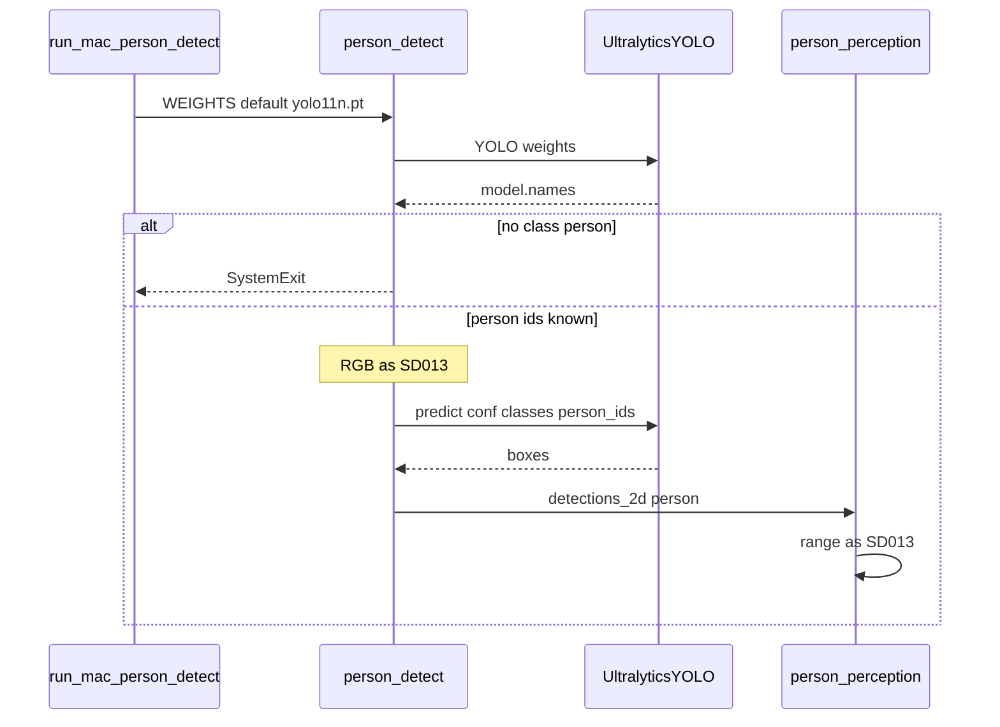

# SD015. Технический дизайн

Дизайн UI: skipped. Каталог: F08 (закрыт SD013+SD014). Исследование: [solution.md](solution.md). Default весов — рекомендация исследования (`yolo11n.pt`), не YOLO26: пользователь не выбирал семейство; YOLO26 остаётся A/B через `WEIGHTS`.

## Системный дизайн

1. **D1.** Default инференса на Mac — официальный Ultralytics **detect** nano `yolo11n.pt` (COCO, класс `person` = 0), не `yolo11n-pose.pt`. Конструктор по-прежнему `ultralytics.YOLO`, устройство `mps`, выход `/perception/detections_2d`. Keypoints нет: задача — bbox человека.
   1. **D1.1.** Константа `DEFAULT_WEIGHTS` и fallback скрипта [run-mac-person-detect.sh](../../scripts/run-mac-person-detect.sh): локальный файл `host/mac_person_detect/yolo11n.pt` если есть, иначе имя `yolo11n.pt` (скачивание Ultralytics). Лежащий рядом `yolo11n-pose.pt` **не** выбирается автоматически.
   2. **D1.2.** Контроль pose и прочие официальные detect (`yolo26n.pt`, `yolo11s.pt`) — только явным `WEIGHTS` / `--weights`. Порог `confidence_threshold` default 0.25 не меняем (не SLA).
2. **D2.** Класс человека — по **имени** `person` в `model.names`, не по `cls_id == 0`.
   1. **D2.1.** Нет ни одного класса с именем `person` — процесс не входит в `spin`: `SystemExit` с текстом про веса и `names`. Нода не публикует рамки.
   2. **D2.2.** В `predict()` передаётся `classes=` список id этих классов (для COCO detect это `[0]`). Fallback `_is_person`: только имя `person`, ветка `cls_id == 0` удаляется (иначе head-модель с классом 0 прошла бы в геометрию низа рамки).
3. **D3.** Пакет `ultralytics` в [pixi.toml](../../host/mac_person_detect/pixi.toml) — нижняя граница поднимается до **самой свежей версии, которая решается** на каналах pixi вместе с `pytorch`/`torchvision` и `osx-arm64`. Default весов остаётся `yolo11n.pt`. Если решённый пакет открывает `yolo26n.pt` — это документированный A/B, не default. Цифру версии здесь не выдумываем: фиксируется при T3 по факту `pixi`.
4. **D4.** Не меняется: топики и QoS SD013/SD014, `person_perception` и геометрия range, overlay/`t1ctl debug`, RGB raw, инференс только на Mac, F09, Twist / `cmd_vel`, Hailo, Roboflow Inference, вендорский YOLO, `bringup.launch.py`. [docs/SD/SD013/tech.md](../SD013/tech.md) как as-built закрытого SD не переписываем.

## Программные интерфейсы

### Mac CLI / env (скрипт)

1. **I1.** [run-mac-person-detect.sh](../../scripts/run-mac-person-detect.sh): при пустом `WEIGHTS` — D1.1 (`yolo11n.pt`). `IMAGE_TOPIC`, `CONFIDENCE_THRESHOLD`, `ROS_DOMAIN_ID` без изменений. Pose: `WEIGHTS=yolo11n-pose.pt`.
2. **I2.** [person_detect.py](../../host/mac_person_detect/person_detect.py) `--weights` default `yolo11n.pt`.

### Контракт класса person

3. **I3.** После `YOLO(weights)` и до подписки на RGB: вычислить id с `names[id] == "person"`. Пусто — не стартовать (D2.1). В стартовом `info`-логе: путь весов, список person id, краткий `names`.
4. **I4.** `model.predict(..., conf=..., device=mps, classes=<person ids>, verbose=False, save=False)`. Сообщение `Detection2DArray` как SD013 I5: `class_id` строка `person`, bbox в пикселях RGB, stamp кадра.

### Pixi

5. **I5.** [pixi.toml](../../host/mac_person_detect/pixi.toml). Overlay-пакеты Pi не версионируем.
   1. **I5.1.** Ограничение `ultralytics` по D3.
   2. **I5.2.** Версия workspace **patch** 0.1.0 → 0.1.1 (новая функциональность по AGENTS.md); `description` про detect, не pose.

## Изменения в приложениях

### `host/mac_person_detect` (`person_detect.py`)

**Пункты:** D1, D1.2, D2, D2.1, D2.2, I2, I3, I4

Единственное место инференса F08. Сейчас default — pose, а «человек» ещё и `cls_id == 0`, что небезопасно для чужих весов. Меняется задача сети (detect) и правило класса; ROS-слой тот же.

1. `DEFAULT_WEIGHTS = "yolo11n.pt"`; тексты help/ошибки/логов без привязки только к pose
2. Резолв person-id по имени; отказ без класса; `classes=` в `predict`; `_is_person` только по имени
3. Чистая функция резолва (имена → ids) вызывается из ноды; unittest без стенда и без обязательного MPS
4. Не PersonArray, не overlay, не смена QoS/топика, не `RTDETR`/`YOLOE`

### `scripts/run-mac-person-detect.sh`

**Пункты:** D1.1, I1

Скрипт задаёт default весов до pixi. Сейчас молча берёт локальный `yolo11n-pose.pt` — после смены константы в Python пользователь со старым файлом остался бы на pose.

1. Fallback на локальный `yolo11n.pt` / имя `yolo11n.pt`
2. Не выбирать `yolo11n-pose.pt` без явного `WEIGHTS`

### `host/mac_person_detect/pixi.toml`

**Пункты:** D3, I5.1, I5.2

Окружение Mac: каналы те же (RoboStack Humble + conda-forge). Нужен пакет Ultralytics, который открывает актуальные официальные `.pt`.

1. Нижняя граница `ultralytics` — максимальная, с которой `pixi` решается вместе с pytorch/torchvision на osx-arm64
2. description и version 0.1.1
3. Не менять каналы, python 3.11, ROS-пакеты Humble

### `host/mac_person_detect/README.md` (+ строка в [ops.md](../SD005/ops.md))

**Пункты:** D1.2, D3, I1

Операторский default должен совпадать с кодом. В ops сейчас только «Mac person_detect (SD013)» без имени весов.

1. README: default `yolo11n.pt`, detect не pose; A/B `WEIGHTS=yolo11n-pose.pt` и при поддержке пакета `yolo26n.pt`; отказ без класса `person`
2. В таблице «что нужно заранее» SD005 — default detect `yolo11n.pt`, ссылка на README Mac
3. Не переписывать [docs/SD/SD013/tech.md](../SD013/tech.md)

## ToDo

Порядок: сначала default весов и скрипт (чтобы стенд не подхватывал старый pose-файл), затем контракт класса (отказ и `classes=`), затем пакет ultralytics, затем документация и версия.

- [x] T1. Default веса YOLO11n detect
  - **Реализует:** D1, D1.1, D1.2, I1, I2
  - **Файлы:** [person_detect.py](../../host/mac_person_detect/person_detect.py), [run-mac-person-detect.sh](../../scripts/run-mac-person-detect.sh)
  - **Что нужно сделать:** Штатный инференс F08 на Mac переводится на официальный detect nano: `DEFAULT_WEIGHTS` и argparse `--weights` становятся `yolo11n.pt`. Скрипт при незаданном `WEIGHTS` берёт `host/mac_person_detect/yolo11n.pt`, если файл есть на диске, иначе строку `yolo11n.pt` для скачивания Ultralytics. Локальный `yolo11n-pose.pt` больше не является автоматическим выбором: контроль pose только через явный `WEIGHTS` / `--weights`. Порог уверенности 0.25, топик RGB и QoS не меняются. Тексты, завязанные только на «YOLO11n-pose» в этом файле и скрипте (docstring, `SystemExit` про MPS, сообщение об ошибке `predict`, description argparse, комментарий про NMS), формулируются как detect на MPS с fallback NMS, без смены поведения fallback.

    Задача не вводит `classes=` и не отказывает по `names` — это T2. Не трогает pixi и README (T3–T4). Не трогает робот, `person_perception`, overlay.
  - **Критерии приёмки:**
    1. AC1. Без `WEIGHTS` в окружении скрипт печатает `weights=` с `yolo11n.pt` (путь к локальному файлу или имя); не печатает `yolo11n-pose.pt` как default
    2. AC2. Если в каталоге пакета лежит только `yolo11n-pose.pt`, без `WEIGHTS` всё равно default `yolo11n.pt`, а не этот файл
    3. AC3. `WEIGHTS=yolo11n-pose.pt ./scripts/run-mac-person-detect.sh` по-прежнему передаёт pose в `--weights`; `CONFIDENCE_THRESHOLD` и `IMAGE_TOPIC` не изменились
  - **Проверка:** `WEIGHTS=` сбросить; из корня репозитория запустить скрипт до строки `person_detect ... weights=`; положить фиктивный/реальный `yolo11n-pose.pt` в `host/mac_person_detect/` и повторить AC2; AC3 — явный `WEIGHTS`

- [x] T2. Класс person по имени, отказ, `classes=` в predict
  - **Реализует:** D2, D2.1, D2.2, I3, I4
  - **Файлы:** [person_detect.py](../../host/mac_person_detect/person_detect.py), новый unittest рядом (stdlib `unittest`, без pytest)
  - **Что нужно сделать:** После `YOLO(weights)` нода строит список id, у которых `names` равно `person`. Список пуст — `SystemExit` до `spin` и до подписки на RGB, в stderr/логе видны веса и фактические `names`. Список непуст — тот же список уходит в `predict(..., classes=...)`. Публикация в `Detection2DArray` по-прежнему только гипотезы `person` (имя класса в msg не меняется). Функция `_is_person` больше не считает человеком произвольный класс 0: нет имени `person` — рамка не публикуется. Резолв имён выносится в чистую функцию (словарь names → список id), чтобы unittest не требовал камеры и мог бежать без живого MPS: случаи COCO `{0: person, 1: bicycle}` → `[0]`; `{0: head, 1: person}` → `[1]`; только `head` / `pedestrian` → пустой список.

    Зависит от T1 (default уже detect). Не меняет default весов повторно. Не ставит ultralytics (T3). Не ходит в сеть и не требует Pi.
  - **Критерии приёмки:**
    1. AC1. Unittest: names с `person` на id 0 и на id 1 дают ожидаемые списки; без `person` — пустой список
    2. AC2. На Mac с весами без класса `person` процесс завершается ненулевым кодом до `first RGB`, топика detections нет
    3. AC3. С `yolo11n.pt` (или default после T1) в логе старта есть person id; в `/perception/detections_2d` нет `class_id` кроме `person`; пустой кадр — пустой массив, не PersonArray
  - **Проверка:** `pixi run -- python -m unittest` из `host/mac_person_detect` (AC1); AC2 — `--weights` на чекпоинт без person либо мок, если на стенде нет такого файла (достаточно unittest + чтение `SystemExit` в коде); AC3 — как README SD013 echo detections при живом RGB

- [x] T3. Ultralytics: свежая совместимая версия
  - **Реализует:** D3, I5.1
  - **Файлы:** [pixi.toml](../../host/mac_person_detect/pixi.toml)
  - **Что нужно сделать:** На каналах, уже указанных в `pixi.toml`, поднять нижнюю границу `ultralytics` до максимальной версии, с которой `pixi` успешно решает окружение вместе с текущими `pytorch`, `torchvision`, `python 3.11` и `osx-arm64`. Номер в toml пишется по факту резолва, не из таблиц COCO. Default весов T1 не менять на `yolo26n.pt`. После установки проверить, что `YOLO("yolo11n.pt")` создаётся в этом окружении. Если тот же пакет создаёт `YOLO("yolo26n.pt")` без ошибки загрузки архитектуры — это пишется в README в T4 как A/B; если нет — в T4 явно: YOLO26 на этих каналах недоступен, default всё равно yolo11n. Каналы RoboStack, набор ROS-пакетов и `PYTORCH_ENABLE_MPS_FALLBACK` не менять.

    Сборку overlay и деплой на Pi не запускать. Не добавлять pip поверх pixi, если conda-forge уже даёт совместимый пакет. Версия workspace 0.1.1 — T4, не эта задача.
  - **Критерии приёмки:**
    1. AC1. В `pixi.toml` нижняя граница `ultralytics` выше прежней `>=8.3.0` либо равна фактически установленной свежей (если 8.3.0 уже резолвится в текущий latest — зафиксировать точный минимум по установленной мажор/минор, не оставлять размытый 8.3.0 без проверки)
    2. AC2. `pixi install` / `pixi run` в пакете проходит; импорт `ultralytics` и `YOLO("yolo11n.pt")` не падают
    3. AC3. Каналы pixi и зависимости ROS Humble в toml не заменены; python остаётся 3.11
  - **Проверка:** diff `pixi.toml`; на Mac разработчика `cd host/mac_person_detect && pixi install` и однострочник с `YOLO`; `pixi list ultralytics`

- [x] T4. Документация, ops, версия пакета
  - **Реализует:** I5.2
  - **Файлы:** [pixi.toml](../../host/mac_person_detect/pixi.toml), [README.md](../../host/mac_person_detect/README.md), [ops.md](../SD005/ops.md)
  - **Что нужно сделать:** Workspace pixi version 0.1.1, description — detect YOLO11n, не pose. README: default `yolo11n.pt`; как вернуть pose через `WEIGHTS`; отказ без класса `person`; A/B `yolo26n.pt` только если T3 это подтвердил, иначе честная оговорка. В [ops.md](../SD005/ops.md) в строке про Mac person_detect указать default detect `yolo11n.pt` и ссылку на README Mac, без смены процедуры Foxglove. Исторический [docs/SD/SD013/tech.md](../SD013/tech.md) не редактировать.

    Зависит от T1–T3 (имена default и факт YOLO26). Код `predict` в этой задаче не трогать. Поведение D1.2 и D3 уже в коде T1/T3; здесь только операторский текст.
  - **Критерии приёмки:**
    1. AC1. `pixi.toml` version `0.1.1`; description без «YOLO11n-pose» как единственной модели
    2. AC2. README: default `yolo11n.pt`, пример `WEIGHTS=yolo11n-pose.pt`, описан отказ без `person`; YOLO26 — по факту T3
    3. AC3. ops SD005 упоминает default `yolo11n.pt`; `docs/SD/SD013/tech.md` без diff
  - **Проверка:** grep по репозиторию на `yolo11n-pose` в `host/mac_person_detect` и скрипте (остаётся только как пример A/B); `git diff -- docs/SD/SD013/tech.md` пустой

## Покрытие

| Пункт | Задачи |
|-------|--------|
| D1.1 | T1 |
| D1.2 | T1 |
| D2.1 | T2 |
| D2.2 | T2 |
| D3 | T3 |
| I1 | T1 |
| I2 | T1 |
| I3 | T2 |
| I4 | T2 |
| I5.1 | T3 |
| I5.2 | T4 |

Итог: пунктов 11, задач 4. Непокрытых пунктов: нет. D1/D2 закрываются подпунктами. D4 — явное ограничение scope, в таблицу не входит.

## Финальный QA (пользователь, T1–T4)

Предусловие: агент не запускает сборку overlay и деплой. Прогон Mac — Pixi в `host/mac_person_detect`, Pi как в README SD013 (demo, camera active, `ROS_DOMAIN_ID=1`). Движение шасси не публиковать. Сравнение стабильности рамки — визуально overlay / echo; цифр SLA нет.

### T1 — default detect
1. Скрипт без `WEIGHTS` → в логе `yolo11n.pt`
2. Наличие старого `yolo11n-pose.pt` на диске не меняет default
3. Явный `WEIGHTS=yolo11n-pose.pt` включает pose

### T2 — класс person
1. unittest резолва имён
2. Веса без `person` — процесс не живёт на RGB
3. Живой RGB: только `person` в detections; пустой кадр — пустой массив

### T3 — ultralytics
1. `pixi list ultralytics` и успешный `YOLO("yolo11n.pt")`
2. Каналы/ROS в toml на месте

### T4 — docs
1. version 0.1.1, README и ops про `yolo11n.pt`
2. SD013 tech.md не изменён
