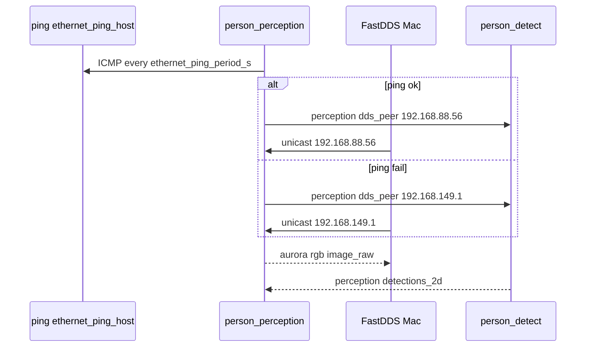

# SD016. Технический дизайн

Дизайн UI: skipped. Каталог: F08. Канал perception Mac↔Pi; инференс и контракт `/perception/*` как SD013–SD015. BA: [solution.md](solution.md).

## Системный дизайн

1. **D1.** На Mac FastDDS для perception всегда знает оба unicast-адреса робота: Ethernet `192.168.88.56` и точка доступа `192.168.149.1`. Participant создаётся один раз при `activate-dds.sh`. Кабель можно выдернуть на живом `person_detect` без рестарта ноды и без повторной загрузки YOLO.
   1. **D1.1.** В `initialPeersList` — multicast и localhost как сейчас, плюс два locator Pi (домен 1: порты `7660`). `interfaceWhiteList` не используем (segfault). `PI_DDS_PEER` не заменяет дефолт: если задан и это не один из двух адресов — добавляется третьим locator.
   2. **D1.2.** Пока Ethernet до Mac жив, целевой адрес — `192.168.88.56` (первый unicast в списке). Когда ping с Pi не проходит — целевой `192.168.149.1`. Оба locator в XML, чтобы при обрыве кабеля discovery не требовал нового participant.
2. **D2.** Признак «Ethernet подключён» считается **на роботе**, ICMP ping, не carrier и не ping с Mac.
   1. **D2.1.** Нода `person_perception` раз в `ethernet_ping_period_s` (default `2`) шлёт ICMP echo (эквивалент `ping -c 1 -W 1`) на `ethernet_ping_host` (default `192.168.88.57`). Успех (ECHOREPLY за 1 с) сразу считает Ethernet живым. На Wi‑Fi переключаемся только после `ethernet_ping_fail_threshold` (default `3`) неудач **подряд**: один потерянный echo (нагрузка YOLO на Mac, ARP) не должен публиковать AP, пока кабель ещё воткнут. В образе `mentorpi-t1` нет `iputils-ping` / `/bin/ping` — сокет `SOCK_DGRAM`/`IPPROTO_ICMP`, не fork `ping(8)`. Ping в отдельном потоке: не блокирует таймер геометрии `rate_hz`.
   2. **D2.2.** Жив Ethernet → публикуется `192.168.88.56`, иначе `192.168.149.1`. Адреса — параметры `ethernet_ip` / `wifi_ap_ip`.
3. **D3.** Только perception: не меняются дефолты `PI_HOST` в deploy/SSH, `t1ctl viewer`, Foxglove URL. На Pi нет FastDDS XML и нет привязки DDS к одному NIC.
4. **D4.** Не меняется: топики и QoS RGB / `detections_2d` / persons / nearest, NN на Mac, Twist, F09, `ROS_LOCALHOST_ONLY=0`, [docs/SD/SD013/tech.md](../SD013/tech.md).

## Программные интерфейсы

### FastDDS на Mac

1. **I1.** [activate-dds.sh](../../host/mac_person_detect/activate-dds.sh) пишет в `fastdds-lan.xml` unicast `192.168.88.56` и `192.168.149.1` (порт `7400 + 250 * domain + 10`). Лог старта: оба peer. `echo-mac-detections.sh` и pixi activation без отдельных правок — тот же скрипт.

### YAML робота

2. **I2.** [person_perception.yaml](../../src/mentorpi_perception/config/person_perception.yaml): `ethernet_ping_host` default `192.168.88.57`, `ethernet_ping_period_s` default `2.0`, `ethernet_ping_fail_threshold` default `3`, `ethernet_ip` `192.168.88.56`, `wifi_ap_ip` `192.168.149.1`.

### ROS 2, робот → Mac

3. **I3.** `/perception/dds_peer` — `std_msgs/String`, payload IPv4 выбранного адреса Pi. QoS: reliable, KeepLast(1), durability `transient_local` (поздний Mac получает последнее значение).

### Mac нода

4. **I4.** [person_detect.py](../../host/mac_person_detect/person_detect.py) подписывается на `/perception/dds_peer` тем же QoS. Смена payload — `info`-лог с новым адресом. Participant FastDDS не пересоздаётся.

### Версии

5. **I5.** Patch (новая функциональность): `mentorpi_perception` `0.1.3` → `0.1.4`; pixi workspace `mac-person-detect` `0.1.1` → `0.1.2`. `t1ctl` и `mentorpi_bringup` не версионируем.

## Изменения в приложениях

### `host/mac_person_detect/activate-dds.sh`

**Пункты:** D1, D1.1, I1

Сейчас один unicast `PI_DDS_PEER` default `192.168.88.56` — на точке доступа discovery до Pi не сходится, RGB нет. Здесь появляется второй locator AP; multicast и localhost не трогаем (два процесса на Mac).

1. В XML — оба адреса Pi; `PI_DDS_PEER` только как дополнительный locator
2. Лог обоих peer
3. Не `interfaceWhiteList`, не CycloneDDS

### `src/mentorpi_perception` (`person_perception`)

**Пункты:** D2.1, D2.2, I2, I3, I5

Нода уже в launch с камерой. Probe канала — её ответственность, отдельной ноды нет. Геометрия и таймер persons не ждут ICMP.

1. Параметры I2, поток ping, публикация I3
2. Зависимость `std_msgs`; version `0.1.4`
3. Не range, не overlay, не смена топиков детекции
4. На AP — только после `ethernet_ping_fail_threshold` неудач подряд; на Ethernet — с первого ECHOREPLY

### `host/mac_person_detect/person_detect.py`

**Пункты:** D1.2, I4

Нода уже крутит YOLO и DDS. Нужно видеть выбранный адрес Pi и оставаться в `spin` при смене кабеля.

1. Подписка `/perception/dds_peer`, лог при смене
2. Не пересоздавать rclpy/participant, не менять YOLO/топики RGB

### `host/mac_person_detect/README.md` и [ops.md](../SD005/ops.md)

**Пункты:** D3, I1, I5

Операторский текст сейчас запрещает Wi‑Fi для NN.

1. Штатно: кабель → Ethernet, иначе точка робота; failover на лету; ping-цель и override YAML
2. Явно: SSH/deploy/`t1ctl`/Foxglove этим SD не переключаются
3. pixi version `0.1.2`; SD013 `tech.md` не редактировать

## ToDo

Порядок: сначала оба peer на Mac (без этого на AP нет ни RGB, ни топика выбора), затем ping на Pi, затем подписка Mac, затем документация и версия pixi.

- [x] T1. Оба unicast FastDDS на Mac
  - **Реализует:** D1, D1.1, I1
  - **Файлы:** `host/mac_person_detect/activate-dds.sh`
  - **Что нужно сделать:** Генерация `fastdds-lan.xml` всегда включает unicast-локаторы `192.168.88.56` и `192.168.149.1` на порту `7400 + 250 * ROS_DOMAIN_ID + 10` (для domain 1 это `7660`). Список multicast `239.255.0.1` и 32 localhost-пира не меняется: иначе `person_detect` и `echo` на одном Mac перестанут видеть друг друга. Переменная `PI_DDS_PEER` больше не подменяет единственный peer: если её значение не совпадает ни с одним из двух адресов робота, этот IP добавляется третьим locator. В stderr — оба штатных адреса и domain. Скрипты `run-mac-person-detect.sh` и `echo-mac-detections.sh` не дублируют XML: они по-прежнему только `source activate-dds.sh`.

    Задача не вводит ping и не трогает Python YOLO. `interfaceWhiteList` не добавлять.
  - **Критерии приёмки:**
    1. AC1. После `source activate-dds.sh` в логе есть `192.168.88.56` и `192.168.149.1` с портом `7660` при `ROS_DOMAIN_ID=1`; в `fastdds-lan.xml` оба `<address>`
    2. AC2. `PI_DDS_PEER=10.0.0.5` даёт третий locator `10.0.0.5`; оба штатных адреса остаются
    3. AC3. Блок multicast и localhost-пиров в XML на месте; нет `interfaceWhiteList`
  - **Проверка:** `ROS_DOMAIN_ID=1 source host/mac_person_detect/activate-dds.sh` и чтение `fastdds-lan.xml`; повторить с `PI_DDS_PEER`; grep `interfaceWhiteList`

- [x] T2. ICMP на Pi и `/perception/dds_peer`
  - **Реализует:** D2.1, D2.2, I2, I3, I5 (perception)
  - **Файлы:** `src/mentorpi_perception/src/person_perception.cpp`, `config/person_perception.yaml`, `package.xml`, `CMakeLists.txt`
  - **Что нужно сделать:** В `person_perception.yaml` появляются `ethernet_ping_host` (`192.168.88.57`), `ethernet_ping_period_s` (`2.0`), `ethernet_ip` (`192.168.88.56`), `wifi_ap_ip` (`192.168.149.1`). Нода читает их как параметры. Отдельный `std::thread` раз в период шлёт ICMP echo на `ethernet_ping_host` (timeout 1 с, как `-W 1`) и по ECHOREPLY считает Ethernet живым. В overlay-образе нет `/bin/ping` — не fork `ping(8)`, а `SOCK_DGRAM`/`IPPROTO_ICMP`. Публикатор `/perception/dds_peer` (`std_msgs/String`) с QoS reliable KeepLast(1) transient_local: при живом Ethernet строка `ethernet_ip`, иначе `wifi_ap_ip`. Публиковать при смене значения и периодически (чтобы late-join без события тоже имел latched смысл вместе с transient_local). Поток ping не вызывает geometry/`on_timer`. В `package.xml` / CMake — `std_msgs`. Версия пакета `0.1.3`.

    Зависит от T1 только для стендового приёма на Mac; компиляция overlay самодостаточна. Не менять расчёт range и overlay.
  - **Критерии приёмки:**
    1. AC1. При отвечающем `ethernet_ping_host` на `/perception/dds_peer` стабильно `192.168.88.56`
    2. AC2. Если ping не проходит (хост неверн/кабель выдернут) — payload `192.168.149.1`; `rate_hz` persons не проседает из‑за ожидания ping
    3. AC3. Топики persons / nearest / detections_2d и параметры геометрии без регрессии; version `0.1.3`
  - **Проверка:** после деплоя оператором — `ros2 topic echo /perception/dds_peer` на Pi в контейнере при воткнутом Ethernet к Mac `192.168.88.57`; отключить кабель или временно сменить `ethernet_ping_host` на несуществующий адрес; `t1ctl status` / overlay как раньше. Агент сборку и деплой не запускает

- [x] T3. Подписка Mac на выбранный адрес
  - **Реализует:** D1.2, I4
  - **Файлы:** `host/mac_person_detect/person_detect.py`
  - **Что нужно сделать:** После создания ноды — подписка на `/perception/dds_peer` с QoS как I3. Первое сообщение и каждая смена `data` пишутся в `info` (выбранный IPv4). `rclpy.init`, participant и YOLO не пересоздаются: обрыв Ethernet во время инференса не должен требовать Ctrl+C. Предупреждение «no RGB yet» не менять по смыслу.

    Зависит от T1 (чтобы на AP был DDS) и от T2 (топик). Не трогает веса и `predict`.
  - **Критерии приёмки:**
    1. AC1. На живом контуре в логе `person_detect` есть выбранный адрес с `/perception/dds_peer`
    2. AC2. Выдёргивание Ethernet при работающем инференсе: процесс не падает, YOLO не перезагружается; после выбора Wi‑Fi кадры снова идут (или продолжают идти), в логе смена на `192.168.149.1`
    3. AC3. Публикация `detections_2d` и подписка RGB без смены топиков/QoS
  - **Проверка:** `./scripts/run-mac-person-detect.sh`; echo detections; физически выдернуть кабель, Mac на точке робота; смотреть лог peer и `first RGB` / рамки

- [x] T4. Документация и версия pixi
  - **Реализует:** D3, I5 (pixi)
  - **Файлы:** `host/mac_person_detect/pixi.toml`, `host/mac_person_detect/README.md`, `docs/SD/SD005/ops.md`
  - **Что нужно сделать:** Workspace pixi `0.1.2`. README: убрать запрет Wi‑Fi для NN; штатный канал — Ethernet если ping с Pi до `ethernet_ping_host` успешен, иначе точка `192.168.149.1`; оба FastDDS peer; failover без рестарта ноды; как сменить `ethernet_ping_host`, если Mac не `192.168.88.57`. Отдельным абзацем: deploy/`t1ctl`/Foxglove/SSH этим SD не выбирают адрес. В ops SD005 — одна фраза про dual peer perception, без смены URL viewer. `docs/SD/SD013/tech.md` не трогать.

    Код DDS и ping в этой задаче не менять.
  - **Критерии приёмки:**
    1. AC1. `pixi.toml` version `0.1.2`
    2. AC2. README без «не полагаться на Wi‑Fi» как запрета NN; есть процедура AP и ping-цели
    3. AC3. `scripts/deploy-pi.sh` default `PI_HOST` по-прежнему Ethernet; `docs/SD/SD013/tech.md` без diff
  - **Проверка:** grep README; `git diff -- scripts/deploy-pi.sh host/t1ctl docs/SD/SD013/tech.md`

- [x] T5. Гистерезис ping: не уходить на AP после одного fail
  - **Реализует:** D2.1, D2.2, I2, I5 (perception `0.1.4`)
  - **Файлы:** `src/mentorpi_perception/src/person_perception.cpp`, `config/person_perception.yaml`, `package.xml`
  - **Что нужно сделать:** Один ICMP timeout больше не публикует `wifi_ap_ip`. Параметр `ethernet_ping_fail_threshold` (default `3`): на AP только после стольких неудач подряд. Первый ECHOREPLY сразу возвращает `ethernet_ip`. Пока счётчик меньше порога — в логе `warn` `ethernet ping fail k/N, hold <ethernet_ip>`, `/perception/dds_peer` остаётся Ethernet. Стартовое состояние — Ethernet (кабель предпочтительнее вспышки AP). Версия пакета `0.1.4`. Не менять сокет ICMP, топики RGB/detections, Mac FastDDS XML и `person_detect.py`.

    QA: на живом Ethernet топик иногда становился `192.168.149.1`, Mac не в Wi‑Fi — кадров нет.
  - **Критерии приёмки:**
    1. AC1. Кабель воткнут, Mac `192.168.88.57`: одиночный fail в логе Pi (`fail 1/3`) не меняет `/perception/dds_peer` с `192.168.88.56`; в логе Mac нет смены на `192.168.149.1`
    2. AC2. Три неудачи подряд (кабель выдернут или `ethernet_ping_host` неверен) — payload `192.168.149.1`; первый успешный ping снова `192.168.88.56`
    3. AC3. `person_perception` version `0.1.4`; persons / RGB / detections без регрессии
  - **Проверка:** после деплоя overlay оператором — `ros2 topic echo /perception/dds_peer` и лог ноды при кабеле; выдернуть кабель и подождать ≥3 периода; воткнуть обратно. Агент сборку и деплой не запускает

## Покрытие

| Пункт | Задачи |
|-------|--------|
| D1.1 | T1 |
| D1.2 | T3 |
| D2.1 | T2, T5 |
| D2.2 | T2, T5 |
| D3 | T4 |
| I1 | T1 |
| I2 | T2, T5 |
| I3 | T2 |
| I4 | T3 |
| I5 | T2, T4, T5 |

Итог: пунктов 10 (подпункты D1/D2 + D3 + I1–I5), задач 5. Непокрытых: нет. D1/D2 закрываются подпунктами. D4 — ограничение scope, в таблицу не входит.

## Финальный QA (пользователь, T1–T5)

Предусловие: агент не собирает overlay и не деплоит. На Pi — demo/camera active. Движение шасси не публиковать. Нужны кабель Ethernet к Mac с адресом ping-цели и точка доступа робота.

### T1 — FastDDS XML
1. Лог и XML с обоими IP
2. Третий peer через `PI_DDS_PEER`

### T2 — ping и топик
1. Кабель + Mac `192.168.88.57` → `192.168.88.56` на `/perception/dds_peer`
2. Нет ping → `192.168.149.1`; persons живы
3. Версия `0.1.4`, геометрия без регрессии
4. Одиночный ping fail не переключает топик на AP

### T3 — Mac на лету
1. Лог выбранного адреса
2. Выдернуть кабель на живом YOLO — без рестарта, переход на AP
3. Топики RGB/detections те же

### T4 — docs
1. pixi `0.1.2`, README про AP
2. deploy/`t1ctl` без смены дефолта
3. SD013 tech.md без diff
4. Проверка на git diff --check

### T5 — гистерезис ping
1. Кабель: одиночный `fail 1/3` в логе Pi, топик остаётся `192.168.88.56`
2. Выдернуть кабель: после 3 неудач — `192.168.149.1`; воткнуть — сразу снова Ethernet
3. Версия `0.1.4`
