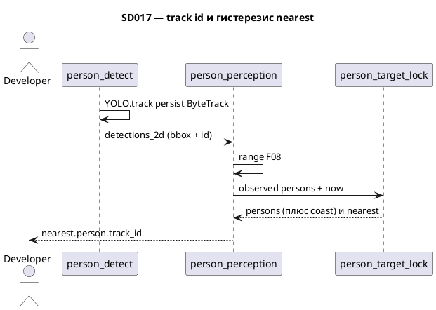

# SD017. Технический дизайн

Дизайн UI: skipped (утверждено). Каталог: F09. BA: [solution.md](solution.md). As-is F08: [person_perception.cpp](../../src/mentorpi_perception/src/person_perception.cpp) ставит `track_id` = индекс кадра; nearest = min `range` каждый кадр; Mac [person_detect.py](../../host/mac_person_detect/person_detect.py) — `predict()`, поле `Detection2D.id` пустое.

## Системный дизайн

1. **D1.** Стабильный идентификатор человека появляется на Mac: `person_detect` вызывает Ultralytics `model.track(..., persist=True, tracker=bytetrack.yaml)` вместо `predict()`. ReID и BoT-SORT не используем (BA: не хозяин). Внутренний Kalman ByteTrack только для ассоциации рамок; траектории и будущие позы не публикуем.
   1. **D1.1.** В `Detection2D.id` (string) пишется целое ByteTrack id. Рамка без `box.id` (unconfirmed) в `/perception/detections_2d` не входит.
   2. **D1.2.** Состояние трекера живёт на том же объекте `YOLO` между кадрами (`persist=True`). `track_buffer` в yaml ByteTrack = 30 кадров: при типичных ~10 Гц Aurora это больше 2 с, чтобы id не сменился раньше, чем сработает потеря цели на Pi.
2. **D2.** Геометрия F08 на роботе не меняется (низ рамки, `points2`, TF, `range = hypot(x,y)`). `PersonHypothesis.track_id` больше не индекс: это `int32` из `Detection2D.id`. Детекция без разборчивого id в `persons` не попадает (F09 требует обновлённый Mac).
3. **D3.** Смена nearest и удержание — модуль `person_target_lock` в `mentorpi_perception` (не в ноде-простыне). Часы — `steady_clock`, как у `detections_timeout` / `points_timeout`, не stamp RGB.
   1. **D3.1.** Нет locked цели: сразу lock на min `range` среди текущего списка; 2 с на первое появление не ждать.
   2. **D3.2.** Locked id есть в текущем списке: цель не менять, пока другой id не станет ближе не меньше чем на `switch_margin_m` (default 0.30 м) **и** тот же challenger непрерывно присутствует с этим запасом не меньше `challenger_dwell_s` (default 2 с). Смена challenger / пропажа / запас < 30 см — таймер dwell сбрасывается. Среди нескольких, кто проходит запас, challenger = min `range`.
   3. **D3.3.** Locked id нет в списке меньше `target_lost_s` (default 2 с): nearest `valid=true` с **последней измеренной** гипотезой (тот же `track_id`, x/y/range/confidence); на других людей не переключаться. Экстраполяции позы нет.
   4. **D3.4.** Locked id нет не меньше `target_lost_s`: если в списке кто-то есть — lock на min `range` (без дополнительного dwell 30 см); иначе nearest `valid=false`. Новый заход после очистки может получить новый ByteTrack id.
   5. **D3.5.** Если locked гипотеза побережна (D3.3) и её нет среди наблюдений, её **добавляют** в публикуемый `PersonArray`, чтобы список и nearest не расходились.
4. **D4.** Тишина Mac / stale RGB/points (`detections_timeout_ms` 1000, `points_timeout_ms` 1000) больше не обнуляет nearest, пока действует D3.3. После `target_lost_s` — пустой список и `valid=false`, как сейчас. Вымышленных людей по-прежнему нет: coast только последняя измеренная цель.
5. **D5.** Не меняется: схема `PersonHypothesis` / топики `/perception/persons` и `/perception/nearest_person` (отдельный топик id не вводим: смена цели = смена `nearest.person.track_id`); overlay и `t1ctl`; Twist; DDS/канал SD016; веса YOLO11n detect; бюджет WARN 100 мс SD014; лидар как класс «человек»; предсказание траекторий как продукт; идентификация хозяина.

## Программные интерфейсы

### ROS 2, Mac → робот

1. **I1.** `/perception/detections_2d` — как SD013 I5, плюс `Detection2D.id` = десятичная запись ByteTrack id (например `"7"`). QoS без изменений.

### ROS 2, выход восприятия (робот)

2. **I2.** `/perception/persons` — `mentorpi_msgs/PersonArray`: у каждой гипотезы `track_id` = id с Mac; при D3.3 в массиве есть побережная locked-гипотеза.
3. **I3.** `/perception/nearest_person` — `mentorpi_msgs/NearestPerson`: `valid` и `person` после D3; смена цели видна по смене `person.track_id`. Нового топика нет.

### YAML робота

4. **I4.** [person_perception.yaml](../../src/mentorpi_perception/config/person_perception.yaml): `switch_margin_m` default `0.30`, `target_lost_s` default `2.0`, `challenger_dwell_s` default `2.0`. Это исходные значения параметров, не SLA качества детекции.

### Mac tracker

5. **I5.** Файл [host/mac_person_detect/bytetrack.yaml](../../host/mac_person_detect/bytetrack.yaml) (копия дефолта Ultralytics с `track_buffer: 30`). Путь по умолчанию рядом с нодой; CLI не обязан расти, если путь зашит относительно пакета/скрипта.

### Версии

6. **I6.** Minor (новая функциональность): `mentorpi_perception` `0.1.4` → `0.2.0`; pixi `mac-person-detect` `0.1.2` → `0.2.0`. `mentorpi_msgs` не версионируем (поля те же). `t1ctl` / `mentorpi_bringup` не версионируем.

## Изменения в приложениях

### `host/mac_person_detect` (`person_detect.py`)

**Пункты:** D1, D1.1, D1.2, I1, I5

Сейчас горячий путь — per-frame `predict()` без id; F09 переносит аналог `tracker` сюда, потому что ассоциация рамок уже есть в Ultralytics, а range-гистерезис на Mac считать нельзя.

1. Заменить `predict` на `track` с `persist=True` и ByteTrack yaml; в `Detection2D.id` писать id
2. Не публиковать рамки без id; не PersonArray, не overlay, не ReID
3. Не менять топик, QoS, фильтр `person`, веса, DDS peer

### `src/mentorpi_perception` (`person_target_lock`)

**Пункты:** D3, D3.1, D3.2, D3.3, D3.4, D3.5

Логика смены цели должна тестироваться без ROS, как [person_geometry.hpp](../../src/mentorpi_perception/include/mentorpi_perception/person_geometry.hpp): отдельный header (и при необходимости `.cpp` только если не header-only).

1. Состояние lock / last hyp / last_seen / challenger_id / dwell_start
2. Правила D3.1–D3.5; конфиг I4
3. Не геометрия облака, не TF, не ICMP DDS

### `src/mentorpi_perception` (`person_perception`)

**Пункты:** D2, D4, I2, I3, I4, I6

Нода остаётся владельцем геометрии и публикации. После сборки `persons` по F08 вызывается lock; `publish_timeout_empty` / пустой список из-за stale cloud больше не обходят D3.3.

1. Разбор `Detection2D.id`; параметры I4; публикация I2/I3
2. Версия `0.2.0`
3. Не менять overlay-политику, ping DDS, схему msg, прямой min-range без lock

### Документация оператора и каталог

**Пункты:** I1, I3, I6

1. README Mac и [docs/SD/SD005/ops.md](../SD005/ops.md): echo `track_id` у nearest; F09 нужен обновлённый `person_detect`
2. В [docs/SD/SD001/tech.md](../SD001/tech.md) у F09 — ссылка на SD017 `solution.md` / `tech.md` (чекбокс F09 — после QA, не в этой задаче как «закрыто»)

## ToDo

Порядок: сначала id с Mac, затем чистая логика lock с тестом, затем проводка в ноду и таймауты, затем версии и ops.

- [x] T1. ByteTrack на Mac и `Detection2D.id`
  - **Реализует:** D1, D1.1, D1.2, I1, I5
  - **Файлы:** [host/mac_person_detect/person_detect.py](../../host/mac_person_detect/person_detect.py), [host/mac_person_detect/bytetrack.yaml](../../host/mac_person_detect/bytetrack.yaml), [host/mac_person_detect/README.md](../../host/mac_person_detect/README.md), [host/mac_person_detect/echo_detections.py](../../host/mac_person_detect/echo_detections.py)
  - **Что нужно сделать:** В `person_detect` инференс людей идёт через `YOLO.track` с `persist=True` и локальным `bytetrack.yaml` (`track_buffer: 30`), не через `predict`. Для каждой подтверждённой рамки `person` в `Detection2D.id` пишется строка целого id; рамки без id в массив не попадают. Топик, header RGB, bbox, `class_id`/`score`, QoS и фильтр классов не меняются. BoT-SORT и ReID не подключаем.

    Задача заканчивается на Mac: робот ещё может игнорировать пустой id. README в этой задаче — только факт `track` и поле `id`; ops стенда и версия pixi — T4. Ошибка `track` — лог и публикация пустого `Detection2DArray`, без вымышленных id.
  - **Критерии приёмки:**
    1. AC1. При человеке в кадре в echo `/perception/detections_2d` у детекции непустой `id` (целое в строке), одинаковый на соседних кадрах, пока человек не вышел надолго
    2. AC2. Пустой кадр — `detections: []`, без замороженных id
    3. AC3. Топик, тип сообщения и набор полей bbox/score/`person` как до изменения; `predict()` в горячем пути нет
  - **Проверка:** `scripts/run-mac-person-detect.sh` + echo detections (или `echo_detections.py`): человек в кадре / вышел; в коде нет вызова `predict` на кадр

- [x] T2. Модуль lock nearest и unit-тесты
  - **Реализует:** D3, D3.1, D3.2, D3.3, D3.4, D3.5
  - **Файлы:** [person_target_lock.hpp](../../src/mentorpi_perception/include/mentorpi_perception/person_target_lock.hpp), [test_person_target_lock.cpp](../../src/mentorpi_perception/test/test_person_target_lock.cpp), [CMakeLists.txt](../../src/mentorpi_perception/CMakeLists.txt)
  - **Что нужно сделать:** Вынести правила BA в функцию обновления без rclcpp: вход — `now` (секунды monotonic) и список наблюдений (`track_id`, x, y, range, confidence); выход — список к публикации (наблюдения плюс coast D3.5) и nearest. Конфиг: `switch_margin_m=0.30`, `target_lost_s=2.0`, `challenger_dwell_s=2.0`. Первое появление — min range. Challenger: `range <= locked.range - switch_margin_m` непрерывно `challenger_dwell_s`. Пропуск locked < `target_lost_s` — nearest из last hyp, другие игнорируются. Пропуск ≥ `target_lost_s` — min range среди текущих или пусто. Позу не экстраполировать.

    Тест — тот же стиль, что [test_person_geometry.cpp](../../src/mentorpi_perception/test/test_person_geometry.cpp): `add_test`, без ROS. Ноду и YAML в этой задаче не трогать.
  - **Критерии приёмки:**
    1. AC1. Два человека, запас < 0.30 м или dwell < 2 с — nearest `track_id` не меняется
    2. AC2. Challenger на ≥ 0.30 м ближе 2 с подряд — nearest переключается на его id
    3. AC3. Locked нет 1.9 с, в списке другой — nearest всё ещё старый id и last range; на 2.0 с — id другого или пусто, если список пуст
    4. AC4. Coast добавляет locked в выходной список, если его не было во входе
  - **Проверка:** `ctest -R test_person_target_lock` (или бинарь теста) на машине разработки, без Pi

- [x] T3. Проводка lock в `person_perception` и таймауты
  - **Реализует:** D2, D4, I2, I3, I4
  - **Файлы:** [person_perception.cpp](../../src/mentorpi_perception/src/person_perception.cpp), [person_perception.yaml](../../src/mentorpi_perception/config/person_perception.yaml)
  - **Что нужно сделать:** После геометрии F08 заполнять `track_id` из `Detection2D.id` (не индекс цикла). Наблюдения без id отбрасывать. Передавать список в T2 с `steady_clock`. Публиковать I2/I3. Параметры I4 объявить и читать из YAML. `publish_timeout_empty` и ветки «нет RGB / stale points / пустые детекции» не обнуляют nearest, пока D3.3 ещё держит цель; после `target_lost_s` — пусто как сейчас. Overlay, ping `/perception/dds_peer` и WARN 100 мс не менять.

    Задача зависит от T2 (и на стенде от T1). Индекс кадра в `track_id` больше не используется.
  - **Критерии приёмки:**
    1. AC1. YAML содержит три параметра I4 с указанными default
    2. AC2. При живом Mac id в `/perception/persons` совпадает с `Detection2D.id` той же рамки (после geometry)
    3. AC3. Краткий пропуск рамок / stale points короче `target_lost_s` оставляет `nearest.valid=true` с тем же `track_id`; после `target_lost_s` без людей — `valid=false`
    4. AC4. Overlay-флаг, DDS ping и топики RGB/detections не изменились по смыслу SD013–SD016
  - **Проверка:** после деплоя (пользователь): echo persons/nearest на Pi; выйти из кадра < 2 с и > 2 с; `ros2 param get` на три ключа

- [x] T4. Версии, ops, ссылка каталога F09
  - **Реализует:** I6
  - **Файлы:** [package.xml](../../src/mentorpi_perception/package.xml), [pixi.toml](../../host/mac_person_detect/pixi.toml), [docs/SD/SD005/ops.md](../SD005/ops.md), [docs/SD/SD001/tech.md](../SD001/tech.md), README Mac если не закрыто в T1
  - **Что нужно сделать:** Поднять версии I6. В ops: как увидеть смену цели (`track_id` в `/perception/nearest_person`), что нужен Mac с ByteTrack, что пороги 0.30 м / 2 с — параметры. В каталоге F09 добавить ссылки на SD017 solution/tech, чекбокс F09 не ставить выполненным в этой задаче.

    Не трогать `mentorpi_msgs` version, `t1ctl`, bringup version, если launch не менялся.
  - **Критерии приёмки:**
    1. AC1. `mentorpi_perception` 0.2.0, pixi workspace 0.2.0
    2. AC2. ops описывает echo `track_id` и параметры гистерезиса
    3. AC3. У F09 в SD001 есть ссылки на SD017; чекбокс F09 ещё открыт
  - **Проверка:** `grep` version в package.xml и pixi.toml; открыть ops и блок F09 в SD001

## Покрытие

| Пункт | Задачи |
|-------|--------|
| D1.1 | T1 |
| D1.2 | T1 |
| D2 | T3 |
| D3.1 | T2 |
| D3.2 | T2 |
| D3.3 | T2 |
| D3.4 | T2 |
| D3.5 | T2 |
| D4 | T3 |
| D5 | — (scope, не задача) |
| I1 | T1 |
| I2 | T3 |
| I3 | T3 |
| I4 | T3 |
| I5 | T1 |
| I6 | T4 |

Итог: пунктов 16 (подпункты D1/D3, плюс D2, D4, D5, I1–I6), задач 4. Непокрытых пунктов: нет (D5 — явное ограничение scope).

## Финальный QA (пользователь, T1–T4)

Предусловие: overlay на Pi с `person_perception` 0.2.0, на Mac обновлённый `person_detect` (ByteTrack), инференс запущен, камера жива. Движение шасси не включать.

### T1 — ByteTrack на Mac
1. Echo `/perception/detections_2d`: id стабилен, пока человек в кадре
2. Выйти из кадра — пустой массив
3. Убедиться, что это не `PersonArray`

### T2 — lock
1. `ctest -R test_person_target_lock` на машине разработки

### T3 — nearest на роботе
1. Два человека: цель не прыгает, пока второй не ближе ≥ 30 см две секунды; `track_id` nearest меняется только тогда
2. Один человек, скрыться < 2 с — nearest тот же id; > 2 с — `valid=false`
3. Второй остаётся в кадре, первый пропал 2 с — переход на второго

### T4 — документы
1. Сверить версии и ops
