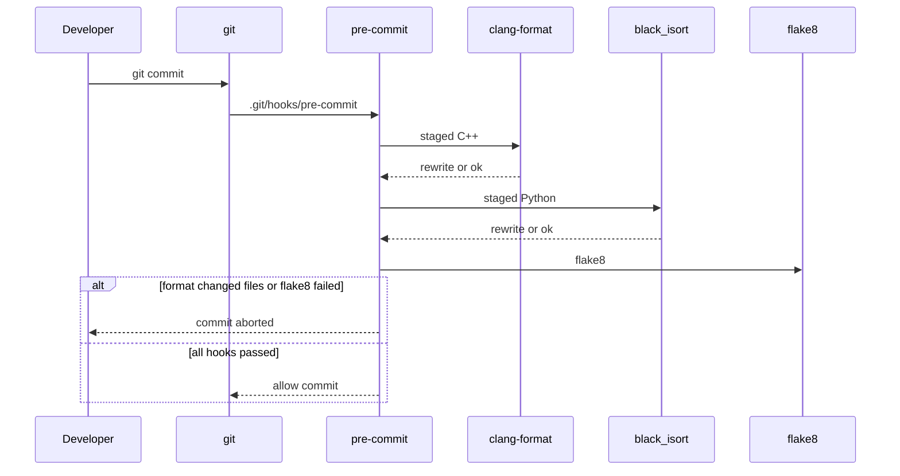

# SD018. Технический дизайн

Дизайн UI: skipped. Исследование: [solution.md](solution.md).

## Системный дизайн

1. **D1.** Единственный автоматический шлюз стиля — локальный Git-хук **pre-commit**. Он ставится командой `pre-commit install` в корне репозитория, срабатывает на `git commit`, при падении хука коммит не создаётся. GitHub Actions и прочий CI в этом SD не появляются. Массовый прогон вручную: `pre-commit run --all-files`.
2. **D2.** C++ (`.cpp` / `.hpp` / `.h` / `.cc` / `.cxx` в `src/` и `host/`) форматирует **clang-format** из хука `pre-commit/mirrors-clang-format`.
   1. **D2.1.** В корне репозитория файл [`.clang-format`](../../../.clang-format): `BasedOnStyle: Google`, `ColumnLimit: 100` (выбор оператора). Остальные ключи — дефолты Google (отступ 2, K&R-скобки). Отдельного `.clang-tidy` нет.
   2. **D2.2.** Хук читает этот файл, правит стейджед C++ in-place. Если хук переписал файлы — коммит прерывается, нужно `git add` и повтор. `rev` хука пинить явно (ориентир `v21.1.8`, чтобы бинарь хука совпадал у всех и не зависел от clang на Pi/Mac).
   3. **D2.3.** Существующий C++ в этом SD один раз прогоняется хуком на всех файлах, чтобы последующие коммиты не смешивали стиль с рефакторингом. Сейчас ROS-ноды ближе к скобке функции на новой строке, `host/t1ctl` уже ближе к Google/K&R — после D2.1 стиль в `src/` станет как в `t1ctl`.
3. **D3.** Python (все `.py`, включая launch, `setup.py`, тесты, `host/t1ctl/src/*.py`, `host/mac_person_detect`) проверяется тем же набором и теми же `rev`/аргументами, что Python-хуки в эталоне kanban-analyzer (`.pre-commit-config.yaml`: black, isort, flake8).
   1. **D3.1.** black `25.9.0` `--line-length=120`; isort `5.13.2` `--profile black --line-length=120`.
   2. **D3.2.** flake8 `7.3.0` `--max-line-length=120`. Это проверка, не автофикс: падение блокирует коммит. `noqa` только там, где правило ломает осознанный порядок (например E402 в [host/mac_person_detect/person_detect.py](../../../host/mac_person_detect/person_detect.py) из‑за `PYTORCH_ENABLE_MPS_FALLBACK` до импорта `torch`). Конфликт black/flake8 `E203`/`W503` — только если проявится на уже отформатированном коде, тогда `--extend-ignore` в аргументах flake8, не подмена black.
   3. **D3.3.** Существующий Python в этом SD один раз прогоняется black+isort и доводится до зелёного flake8 (правка кода или точечный noqa). Launch-файлы ROS уйдут на двойные кавычки black — это ожидаемо.
4. **D4.** Из хука **исключены** неотслеживаемые и чужие деревья: `docs/vendor-docs/`, `build/`, `build-arm64/`, `build-test/`, `install/`, `log/`, `.pixi/`, `host/t1ctl/build-host/`. Вендорский стек на образе Pi не форматируется. Пакеты overlay в `src/` (включая `hiwonder_controller`, `ros_robot_controller`) входят в scope.
5. Не входит в SD (ограничение scope, без отдельного ID): yamllint и vulture из kanban-analyzer (это не проверки Python-кода / мёртвый код ROS launch потребует отдельной политики); clang-tidy; uncrustify/ament_clang_format; CI; ненулевой Twist / `cmd_vel`; сборка и деплой на Pi; bump версий ROS-пакетов (меняется только процесс разработки).



## Программные интерфейсы

### Конфиг хука (корень репозитория)

1. **I1.** [`.pre-commit-config.yaml`](../../../.pre-commit-config.yaml) — единственный список хуков. Состав и пины:
   - `https://github.com/pre-commit/mirrors-clang-format`, `rev: v21.1.8`, `id: clang-format`, `types_or: [c++, c]`
   - `https://github.com/psf/black`, `rev: 25.9.0`, `args: ["--line-length=120"]`
   - `https://github.com/PyCQA/isort`, `rev: 5.13.2`, `args: ["--profile", "black", "--line-length=120"]`
   - `https://github.com/PyCQA/flake8`, `rev: 7.3.0`, `args: ["--max-line-length=120", "--extend-ignore=E203", "--per-file-ignores=host/mac_person_detect/person_detect.py:E402"]` (E203 — конфликт со срезами black, D3.2; E402 — env MPS до импорта torch)
   - корневой `exclude` по D4
   - yamllint/vulture **нет**

2. **I2.** [`.clang-format`](../../../.clang-format) — YAML clang-format, не аргумент `--style=` у хука:

```
BasedOnStyle: Google
ColumnLimit: 100
```

### Команды разработчика

3. **I3.** После `pip install pre-commit` (или `brew install pre-commit`) в корне:
   - `pre-commit install` — ставит хук в `.git/hooks/pre-commit`
   - `pre-commit run --all-files` — полный прогон (массовый reformat и проверка)
   - `pre-commit run --all-files` после правок — тот же вход, что у агента; black/flake8/isort/clang-format напрямую не вызывать
   - отдельного `requirements-dev.txt` можно не заводить: в README достаточно команды установки `pre-commit`

4. **I4.** Документация команд I3: раздел в [README.md](../../../README.md) и блок в [AGENTS.md](../../../AGENTS.md) по образцу kanban-analyzer («всегда `pre-commit run --all-files`, не подменять встроенными линтерами»). Поведение робота, топики и `t1ctl` не описываются заново.

## Изменения в приложениях

### `.pre-commit-config.yaml` и `.clang-format`

**Пункты:** D1, D2.1, D2.2, D3.1, D3.2, D4, I1, I2

Сейчас в корне нет ни хуков, ни стиля C++. Появляются два конфига, которые pre-commit и clang-format читают сами; логика нод не меняется.

1. Добавить файлы с содержимым I1 и I2
2. Не добавлять CI workflow, yamllint, vulture, clang-tidy
3. Не класть `[project]` в корневой `pyproject.toml` (colcon/`src` не должен видеть корневой Python-пакет); длина строки Python живёт в аргументах хуков, как в kanban-analyzer

### C++: `src/*` и `host/t1ctl`

**Пункты:** D2.3

Около 35 файлов `.cpp`/`.hpp`. Стиль разъехался между ROS-нодами и CLI. После хука все файлы соответствуют I2; семантика, имена топиков, нулевой Twist не трогаются.

1. Прогнать clang-format через `pre-commit run clang-format --all-files` (или эквивалент хука)
2. Не менять CMake, `package.xml`, версии пакетов, тесты по смыслу — только whitespace/скобки/переносы
3. Не форматировать файлы вне D4-исключений и не C++

### Python: `src/**/*.py`, `host/t1ctl/src/*.py`, `host/mac_person_detect/*.py`

**Пункты:** D3.3

Около 64 файлов: launch, калибровка, вендорский overlay Python, Mac detect. black/isort перепишут кавычки и импорты; flake8 может потребовать правок, не только формат.

1. `pre-commit run black --all-files` и `isort`, затем flake8 до нулевого выхода
2. E402 в `person_detect.py` — `noqa` или сохранение порядка с явным игнором, env до `torch` не ломать
3. Не менять топики, QoS, веса YOLO, pixi-зависимости, поведение launch
4. Не добавлять ruff/mypy вместо black/flake8

### `README.md` и `AGENTS.md`

**Пункты:** I3, I4

Единственное место, где разработчик и агент узнают про шлюз. Сейчас стандартов кода в репо нет.

1. Короткий раздел: установка `pre-commit`, `pre-commit install`, `pre-commit run --all-files`
2. В AGENTS.md: хуки из I1, запрет подменять другими линтерами
3. Не раздувать README операторским сценарием робота

## ToDo

Порядок: сначала конфиги хука, затем массовый C++, затем Python (flake8 может править логику-мелочи), затем документация команд.

- [x] T1. Добавить `.clang-format` и `.pre-commit-config.yaml`
  - **Реализует:** D1, D2.1, D2.2, D3.1, D3.2, D4, I1, I2
  - **Файлы:** `.clang-format`, `.pre-commit-config.yaml`
  - **Что нужно сделать:** В корне репозитория создать `.clang-format` с `BasedOnStyle: Google` и `ColumnLimit: 100` без прочих ключей. Создать `.pre-commit-config.yaml` с четырьмя хуками и пинами из I1, корневым `exclude` по D4, без yamllint/vulture/CI. Хук clang-format должен видеть типы `c++` и `c`, чтобы покрыть `.cpp`/`.hpp` в `src/` и `host/t1ctl`. Python-хуки копируют аргументы kanban-analyzer один в один (длина строки 120, isort profile black). Корневой Python-пакет и `pyproject.toml` с `[project]` не заводить.
  - **Критерии приёмки:**
    1. AC1. Файлы I1 и I2 есть в корне, YAML валиден, `rev` и `args` совпадают с I1
    2. AC2. В конфиге нет yamllint, vulture и `.github/workflows`
    3. AC3. `exclude` отсекает `docs/vendor-docs/` и каталоги сборки из D4
  - **Проверка:** `cat .clang-format .pre-commit-config.yaml`; убедиться в отсутствии workflow CI (`ls .github 2>/dev/null || true`)

- [x] T2. Переформатировать весь существующий C++
  - **Реализует:** D2.3
  - **Файлы:** `src/**/*.{cpp,hpp}`, `host/t1ctl/**/*.{cpp,hpp}` (и тесты)
  - **Что нужно сделать:** После T1 установить pre-commit в окружение разработчика и прогнать хук clang-format на всех файлах. Результат — только изменения форматирования Google/100, без правок логики, CMake и версий. Если хук не тронул какой-то `.cpp`/`.hpp` из scope — расширить `types_or`/`files`, а не звать системный `clang-format`.
  - **Критерии приёмки:**
    1. AC1. `pre-commit run clang-format --all-files` завершается с кодом 0 без повторной переписи
    2. AC2. Diff C++ не содержит переименований символов, смены строк с топиками/`cmd_vel` и правок CMakeLists
    3. AC3. Файлы в `docs/vendor-docs/` и `build*/` хук не меняет
  - **Проверка:** `pre-commit run clang-format --all-files`; `git diff --stat -- '*.cpp' '*.hpp'`

- [x] T3. Переформатировать и довести до flake8 весь существующий Python
  - **Реализует:** D3.3
  - **Файлы:** все `.py` в `src/`, `host/t1ctl/src/`, `host/mac_person_detect/`
  - **Что нужно сделать:** Прогнать black и isort на всех Python-файлах с аргументами D3.1. Затем flake8 D3.2 до нулевого выхода: либо правка кода, либо точечный noqa. Порядок импортов в `person_detect.py` (env MPS до `torch`) сохранить. Поведение launch, калибровки, Mac detect и probe для t1ctl не менять. Если отформатированный black код падает на E203/W503 — добавить `--extend-ignore` только этих кодов в хук flake8.
  - **Критерии приёмки:**
    1. AC1. `pre-commit run black --all-files`, `pre-commit run isort --all-files`, `pre-commit run flake8 --all-files` — код 0
    2. AC2. `person_detect.py` по-прежнему выставляет `PYTORCH_ENABLE_MPS_FALLBACK` до импорта `torch`
    3. AC3. Нет смены топиков, имён launch-аргументов, весов YOLO и зависимостей `pixi.toml`
  - **Проверка:** команды из AC1; `rg -n "PYTORCH_ENABLE_MPS_FALLBACK" host/mac_person_detect/person_detect.py`

- [x] T4. Описать установку и прогон в README и AGENTS.md
  - **Реализует:** I3, I4
  - **Файлы:** [README.md](../../../README.md), [AGENTS.md](../../../AGENTS.md)
  - **Что нужно сделать:** Добавить короткий раздел для разработчика: установить пакет `pre-commit`, в корне `pre-commit install`, перед коммитом и для полной проверки `pre-commit run --all-files`. В AGENTS.md зафиксировать состав хуков I1 и правило не подменять их ruff/встроенным линтером агента. Операторский сценарий робота, SSH и деплой не переписывать. Версии ROS-пакетов не поднимать.
  - **Критерии приёмки:**
    1. AC1. В README есть команды I3 целиком (install + run --all-files)
    2. AC2. В AGENTS.md указаны black/isort/flake8 120 и clang-format Google 100
    3. AC3. Нет нового CI и нет требования собирать overlay для этих проверок
  - **Проверка:** прочитать добавленные абзацы; `pre-commit run --all-files` как финальный зелёный прогон после T1–T3

## Покрытие

| Пункт | Задачи |
|-------|--------|
| D1 | T1 |
| D2.1 | T1 |
| D2.2 | T1 |
| D2.3 | T2 |
| D3.1 | T1 |
| D3.2 | T1 |
| D3.3 | T3 |
| D4 | T1 |
| I1 | T1 |
| I2 | T1 |
| I3 | T4 |
| I4 | T4 |

Итог: пунктов 12, задач 4. Непокрытых пунктов: нет.
