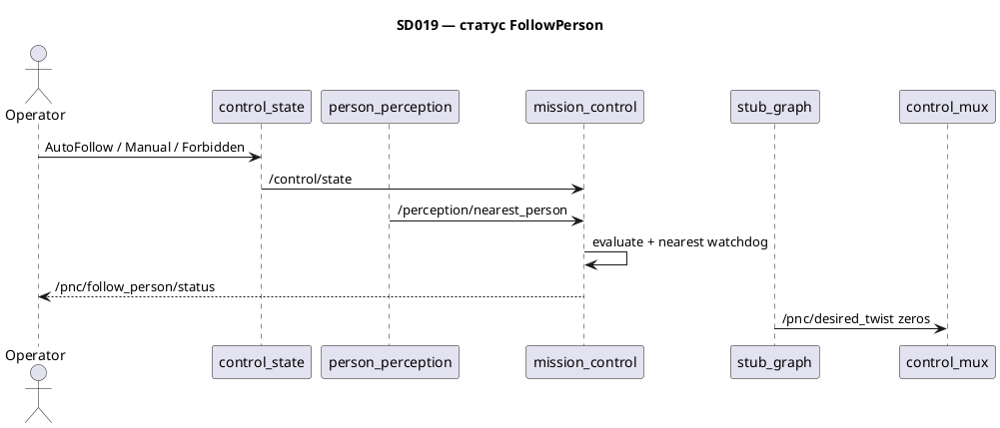

# SD019. Технический дизайн

Дизайн UI: skipped (утверждено). Каталог: F10. BA: [solution.md](solution.md).

## Системный дизайн

1. **D1.** Новый пакет [`src/mission_control`](../../src/mission_control) (имя как у аналога `mission_control_node`, без префикса `mentorpi_`) с executable и нодой `mission_control`. Это поведение FollowPerson: по `/control/state` и `/perception/nearest_person` решает «вестись / стоять / не активно» и публикует только статус. Команду цели и Twist нода не публикует: F11 сам читает nearest и режим. Маршрута, FollowMission, глобального планировщика нет.
2. **D2.** Решение статуса — чистая функция без ROS (как [`control_mode.hpp`](../../src/mentorpi_control/include/mentorpi_control/control_mode.hpp)).
   1. **D2.1.** Нет принятого `/control/state` или режим не `AUTO_FOLLOW` → `INACTIVE`. `AUTO_FOLLOW` и цель свежая с `valid=true` → `FOLLOWING`. `AUTO_FOLLOW` и нет цели (`valid=false` или цель не свежая) → `HOLD`. Смены `track_id` отдельно не обрабатываем: F09 уже сменил nearest, статус остаётся `FOLLOWING`.
   2. **D2.2.** Watchdog: тишина `/perception/nearest_person` дольше `nearest_timeout_ms` (default `1000`, исходное значение параметра, не SLA) → цель не свежая. Часы — `steady_clock`. Сообщения ещё не было — тоже не свежая. Режим нода не меняет.
3. **D3.** Нода не пишет `/control/state`, не вызывает `/control/set_mode`, не публикует `/pnc/desired_twist` и `/control/motion_restriction`. Hold и отсутствие человека не переводят в `FORBIDDEN` и не ставят `stop_request`.
4. **D4.** До F11 [`stub_graph`](../../src/mentorpi_stubs/src/stub_graph.cpp) по-прежнему публикует нули на `/pnc/desired_twist`. В AutoFollow шасси не едет от FollowPerson. F11 обязан повторить ту же тройку правил (режим + `valid` + свежесть nearest), не читая статус как команду.
5. **D5.** [`stage1.launch.py`](../../src/mentorpi_bringup/launch/stage1.launch.py) поднимает `mission_control` рядом с `control_state` и `person_perception`. `t1ctl` и Foxglove не меняем.

## Программные интерфейсы

### ROS 2 messages / topics / params

1. **I1.** [`src/mentorpi_msgs/msg/FollowPersonStatus.msg`](../../src/mentorpi_msgs/msg/FollowPersonStatus.msg): `uint8 INACTIVE=0`, `HOLD=1`, `FOLLOWING=2`, поле `uint8 state`. Копии `PersonHypothesis` нет.
2. **I2.** `/pnc/follow_person/status` — `mentorpi_msgs/FollowPersonStatus`, publisher `mission_control`. QoS: KeepLast(1), reliable, transient_local. Публикация с таймера `rate_hz` (default `10.0`).
3. **I3.** Подписки: `/control/state` (`ControlState`, QoS как у publisher — KeepLast(1) reliable transient_local); `/perception/nearest_person` (`NearestPerson`, KeepLast(1) reliable).
4. **I4.** Параметры ноды: `nearest_timeout_ms` default `1000` (> 0); `rate_hz` default `10.0` (> 0).
5. **I5.** `mentorpi_msgs` `1.0.0` → `1.1.0` (новый msg).
6. **I6.** Пакет `mission_control` `0.1.0`. `mentorpi_bringup` `0.1.7` → `0.2.0`, `exec_depend` на `mission_control`. `t1ctl` не версионируем.

## Изменения в приложениях

### `mentorpi_msgs`

**Пункты:** I1, I5

Пакет уже держит контракт Stage 1 (`ControlState`, `NearestPerson`). Статус поведения — ещё один msg того же контракта, чтобы F11 и отладка не парсили строки.

1. Добавить `FollowPersonStatus.msg` и включить его в `rosidl_generate_interfaces`.
2. Поднять версию `1.1.0`.
3. Не менять `ControlState`, `NearestPerson`, `PersonHypothesis`.

### `mission_control` (новый пакет)

**Пункты:** D1, D2.1, D2.2, D3, I2, I3, I4, I6

Аналог урезанного `mission_control_node`: без маршрута и без команды на motion. Нода только считает и публикует статус. Логика — header-only, CTest без rclcpp.

1. Пакет `src/mission_control`: ament_cmake, C++17, depend `rclcpp` + `mentorpi_msgs`.
2. `include/mission_control/follow_behavior.hpp`: `evaluate_follow_behavior(have_control_state, control_state, nearest_valid, nearest_fresh) → uint8`. Константы `kFollowInactive/Hold/Following` = 0/1/2.
3. Нода `mission_control`: подписки I3, watchdog D2.2, publish I2. До первого `/control/state` — `INACTIVE`.
4. Не публиковать Twist, restriction, nearest; не вызывать `SetControlMode`.

### `mentorpi_bringup`

**Пункты:** D5, I6

Launch этапа 1 уже поднимает режим и perception; F10 в комментарии есть, ноды нет.

1. Node `mission_control` в `stage1.launch.py` (параметры I4).
2. `exec_depend` на `mission_control`, версия `0.2.0`.
3. Строка в [README.md](../../README.md) про пакет и `/pnc/follow_person/status`.
4. Не трогать `stub_graph`, mux, `t1ctl`. Сборку и деплой не запускать: `--packages-up-to mentorpi_bringup` подтянет пакет через depend.

### `mentorpi_stubs` (`stub_graph`)

**Пункты:** D4

Заглушка desired Twist до F11.

1. Не менять: нули на `/pnc/desired_twist`, `stop_request=false` на restriction.

## ToDo

Порядок: сначала msg, затем чистая функция с тестом, затем нода, затем launch.

- [x] T1. Сообщение FollowPersonStatus
  - **Реализует:** I1, I5, F10
  - **Файлы:** [`src/mentorpi_msgs/msg/FollowPersonStatus.msg`](../../src/mentorpi_msgs/msg/FollowPersonStatus.msg), [`src/mentorpi_msgs/CMakeLists.txt`](../../src/mentorpi_msgs/CMakeLists.txt), [`src/mentorpi_msgs/package.xml`](../../src/mentorpi_msgs/package.xml)
  - **Что нужно сделать:** Добавить msg статуса поведения FollowPerson: константы `INACTIVE=0`, `HOLD=1`, `FOLLOWING=2` и единственное поле `uint8 state`. Это наблюдаемость из BA (следование, стоянка без цели, не активно вне AutoFollow) без дубля цели — цель остаётся на `/perception/nearest_person`. Зарегистрировать файл в `rosidl_generate_interfaces` рядом с существующими msg. Поднять `mentorpi_msgs` с `1.0.0` на `1.1.0` (minor: новый контракт). `ControlState`, `NearestPerson` и `PersonHypothesis` не менять: F10 их только читает.
  - **Критерии приёмки:**
    1. AC1. В пакете есть `FollowPersonStatus.msg` с тремя константами 0/1/2 и полем `state`.
    2. AC2. `package.xml` версии `1.1.0`, msg в `CMakeLists.txt`.
    3. AC3. Схемы `ControlState` и `NearestPerson` без правок.
  - **Проверка:** `cat` msg и `package.xml`; `git diff` на `ControlState.msg` / `NearestPerson.msg` пустой.

- [x] T2. Функция решения статуса
  - **Реализует:** D2.1
  - **Файлы:** [`src/mission_control/include/mission_control/follow_behavior.hpp`](../../src/mission_control/include/mission_control/follow_behavior.hpp), [`src/mission_control/test/test_follow_behavior.cpp`](../../src/mission_control/test/test_follow_behavior.cpp), [`src/mission_control/CMakeLists.txt`](../../src/mission_control/CMakeLists.txt), [`src/mission_control/package.xml`](../../src/mission_control/package.xml)
  - **Что нужно сделать:** Завести пакет `mission_control` 0.1.0 и header-only `evaluate_follow_behavior`: нет режима или не `AUTO_FOLLOW` (в том числе `MANUAL` и `FORBIDDEN`) → `INACTIVE`; `AUTO_FOLLOW` + `nearest_valid` + `nearest_fresh` → `FOLLOWING`; иначе в `AUTO_FOLLOW` → `HOLD`. Значения 0/1/2 совпадают с I1. Гистерезиса смены цели и работы с `track_id` в функции нет: смена ближайшего — дело F09, для статуса это тот же `FOLLOWING`. CTest по образцу [`test_control_mode.cpp`](../../src/mentorpi_control/test/test_control_mode.cpp), без rclcpp. Ноду и watchdog в этой задаче не писать.
  - **Критерии приёмки:**
    1. AC1. AutoFollow + valid + fresh → `FOLLOWING`; смена условного track не меняет правило.
    2. AC2. AutoFollow + `valid=false` или `fresh=false` → `HOLD`; Manual/Forbidden/нет state → `INACTIVE` даже при valid цели.
    3. AC3. Тест без ROS; `add_test` в CMake.
  - **Проверка:** чтение header; `colcon test --packages-select mission_control` (пользователь в arm64-сборщике). Агент сборку не запускает.

- [x] T3. Нода mission_control
  - **Реализует:** D1, D2.2, D3, I2, I3, I4, F10
  - **Файлы:** [`src/mission_control/src/mission_control.cpp`](../../src/mission_control/src/mission_control.cpp), [`src/mission_control/CMakeLists.txt`](../../src/mission_control/CMakeLists.txt)
  - **Что нужно сделать:** Нода `mission_control` подписывается на `/control/state` (transient_local) и `/perception/nearest_person` (KeepLast 1 reliable). По таймеру `rate_hz` считает свежесть nearest через `steady_clock` и `nearest_timeout_ms`, вызывает `evaluate_follow_behavior`, публикует `/pnc/follow_person/status` (transient_local). Default параметров — I4, оба > 0 иначе исключение на старте. До первого state — `INACTIVE`. Тишина nearest дольше таймаута в AutoFollow даёт `HOLD`, не `FORBIDDEN`. `static_assert` констант header = констант msg. Не создавать publisher Twist, restriction, nearest; не создавать client `SetControlMode`.
  - **Критерии приёмки:**
    1. AC1. AutoFollow и `nearest.valid=true` в пределах таймаута → статус `FOLLOWING` на `/pnc/follow_person/status`.
    2. AC2. Тишина nearest > `nearest_timeout_ms` в AutoFollow → `HOLD`; Manual/Forbidden при живой цели → `INACTIVE`; `/control/state` не меняется от ноды.
    3. AC3. В исходнике ноды нет publish в `/pnc/desired_twist`, `/control/state`, `/control/motion_restriction` и вызова `SetControlMode`.
  - **Проверка:** после деплоя (пользователь): `ros2 topic echo /pnc/follow_person/status`; смена режима `t1ctl mode`; останов `person_perception` на таймаут. Агент сам робота не двигает и деплой не запускает.

- [x] T4. Bringup и README
  - **Реализует:** D4, D5, I6, F10
  - **Файлы:** [`src/mentorpi_bringup/launch/stage1.launch.py`](../../src/mentorpi_bringup/launch/stage1.launch.py), [`src/mentorpi_bringup/package.xml`](../../src/mentorpi_bringup/package.xml), [`README.md`](../../README.md)
  - **Что нужно сделать:** Добавить Node `mission_control` пакета `mission_control` в stage1 с `nearest_timeout_ms: 1000` и `rate_hz: 10.0`. `exec_depend` на `mission_control`, версия bringup `0.2.0`. В README — пакет и топик статуса. `stub_graph` не трогать: нули на `/pnc/desired_twist` до F11. `t1ctl` не менять. Сборку `./scripts/build-arm64.sh` и деплой не запускать.
  - **Критерии приёмки:**
    1. AC1. В `stage1.launch.py` есть нода `mission_control`; `package.xml` 0.2.0 и `exec_depend` `mission_control`.
    2. AC2. README описывает пакет и `/pnc/follow_person/status`.
    3. AC3. `stub_graph.cpp` без правок; в launch нет второго publisher `/pnc/desired_twist`.
  - **Проверка:** `rg mission_control src/mentorpi_bringup README.md`; `git diff src/mentorpi_stubs`; пользователь — `./scripts/build-arm64.sh` (агент не запускает).

## Покрытие

| Пункт | Задачи |
|-------|--------|
| D1 | T3 |
| D2.1 | T2 |
| D2.2 | T3 |
| D3 | T3 |
| D4 | T4 |
| D5 | T4 |
| I1 | T1 |
| I2 | T3 |
| I3 | T3 |
| I4 | T3 |
| I5 | T1 |
| I6 | T4 |
| F10 | T1, T2, T3, T4 |

Итог: пунктов 12 (D1–D5, D2.1–D2.2, I1–I6) + F10, задач 4. Непокрытых пунктов: нет.

## Финальный QA (пользователь, T1–T4)

Собрать overlay `./scripts/build-arm64.sh`, задеплоить на Pi. Агент сборку и деплой не запускает. Движение шасси не проверяем: desired Twist до F11 — нули.

### T1 — FollowPersonStatus
1. Msg и константы 0/1/2 (AC1)
2. Версия 1.1.0 и запись в CMake (AC2)
3. Diff ControlState/NearestPerson пустой (AC3)

### T2 — функция
1. colcon test: FOLLOWING (AC1)
2. colcon test: HOLD и INACTIVE (AC2)
3. Тест без ROS в CMake (AC3)

### T3 — нода
1. echo статуса при AutoFollow + человек (AC1)
2. Hold по тишине nearest; INACTIVE в Manual/Forbidden; режим не сбрасывается (AC2)
3. В коде нет Twist / set_mode (AC3)

### T4 — bringup
1. Нода в launch, depend, версия (AC1)
2. README (AC2)
3. stub_graph без правок (AC3)
