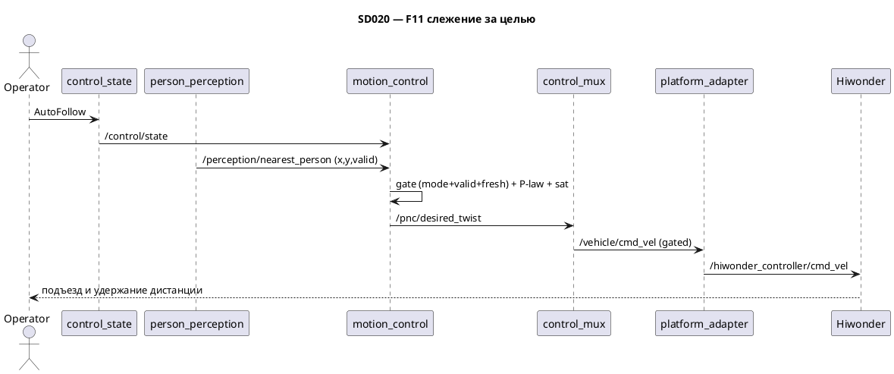

# SD020. Технический дизайн

Дизайн UI: skipped (утверждено). Каталог: F11. BA: [solution.md](solution.md). Замеры железа: [measure.md](measure.md).

## Системный дизайн

1. **D1.** Новый пакет [`src/motion_control`](../../src/motion_control) с executable и нодой `motion_control` (имя как у аналога `motion_control` из SD001, без префикса `mentorpi_`). Нода подписывается на `/control/state` и `/perception/nearest_person`, публикует `/pnc/desired_twist`. Заменяет собой заглушку desired Twist. Не пишет на шасси напрямую, не вызывает планировщик, не строит объезд.
2. **D2.** Закон управления — чистая функция без ROS (header-only, как [`follow_behavior.hpp`](../../src/mission_control/include/mission_control/follow_behavior.hpp) / [`control_mode.hpp`](../../src/mentorpi_control/include/mentorpi_control/control_mode.hpp)). Вход: поза цели `x, y` в базе робота (ось `x` вперёд, `y` влево) и параметры; выход: `linear_x, angular_z`. Обозначения: `range = hypot(x, y)`, `bearing = atan2(y, x)`.
   1. **D2.1.** Дистанция (линейная): `dist_err = range − standoff`. Если `dist_err ≤ dist_deadband` → `linear_x = 0` (мёртвая зона удержания и запрет заднего хода: при `range < standoff` ошибка отрицательна, тоже 0). Иначе `linear_x = clamp(kp_lin · dist_err, 0, max_linear)`. Задний ход не используется.
   2. **D2.2.** Курс (угловая): доворот **только в движении** — если `linear_x ≤ 0` → `angular_z = 0` (стоя на дистанции робот не крутится на месте). Иначе при `|bearing| < ang_deadband` → `0`, иначе `angular_z = clamp(kp_ang · bearing, −ω_lim, +ω_lim)`.
   3. **D2.3.** Динамический лимит угловой (защита от насыщения трака): `ω_lim = clamp((max_linear − linear_x) / track_half_sum, 0, max_angular)`, где `track_half_sum = (wheelbase + track_width)/2 = 0.1407` (из `tank_kinematics.py`). При линейной у потолка угловой запас → 0, поэтому вдали робот едет почти прямо, а подравнивается на подъезде, когда линейная падает.
3. **D3.** Гейт режима и цели (повтор правил F10 / SD019 **D4**): закон применяется только если принят `/control/state` = `AUTO_FOLLOW` **и** `nearest.valid=true` **и** цель свежая. Иначе нода публикует нулевой Twist. `/pnc/follow_person/status` от F10 нода **не читает** как команду — независимо повторяет ту же тройку правил. `HOLD`/отсутствие цели не переводят в `FORBIDDEN` и не ставят `stop_request` (это F13).
4. **D4.** Watchdog свежести `nearest`: тишина `/perception/nearest_person` дольше `nearest_timeout_ms` (default `1000`) по `steady_clock` → цель не свежая → нули (как в [`mission_control.cpp`](../../src/mission_control/src/mission_control.cpp)). Сообщения ещё не было — тоже не свежая.
5. **D5.** [`stub_graph`](../../src/mentorpi_stubs/src/stub_graph.cpp) **снимает** publisher `/pnc/desired_twist` (иначе два публикатора на топике — тот самый конфликт, что дал рывки в Замере 1). Публикацию `/control/motion_restriction` (`stop_request=false`) заглушка **сохраняет**: F12/F13 ещё нет.
6. **D6.** [`stage1.launch.py`](../../src/mentorpi_bringup/launch/stage1.launch.py) поднимает `motion_control` рядом с `mission_control`. Одометрия в контуре F11 не используется — `odom_publisher` не трогаем. `t1ctl`/Foxglove не меняем.

### As-built (стенд pi@192.168.2.2, Замер 1)

| Параметр | Значение |
|----------|----------|
| путевая `max_linear` | `0.37` м/с (1.0 м / 2.67 с) |
| `max_angular` | `2.0` рад/с |
| `track_half_sum` | `0.1407` м |
| увод по курсу | 20–30°/м, `/odom_raw` слеп (`angular.z≡0`) |

## Программные интерфейсы

### ROS 2 — нода `motion_control`

1. **I1.** Подписки: `/control/state` (`mentorpi_msgs/ControlState`, QoS KeepLast(1) reliable transient_local — как publisher `control_state`); `/perception/nearest_person` (`mentorpi_msgs/NearestPerson`, KeepLast(1) reliable). Поля цели — `person.x`, `person.y` (база робота), `valid`.
2. **I2.** Публикация: `/pnc/desired_twist` (`geometry_msgs/msg/Twist`, KeepLast(1) reliable) с таймера `rate_hz`. Контракт топика неизменен: `control_mux` уже подписан на него как источник follow.
3. **I3.** Параметры ноды (все `> 0`, иначе исключение на старте; коэффициенты — стартовые, тюнинг в Замере 3):
   - `standoff` = `0.5` (м), `max_linear` = `0.37` (м/с), `max_angular` = `2.0` (рад/с)
   - `kp_lin` = `0.8` (1/с), `kp_ang` = `1.5` (1/с)
   - `dist_deadband` = `0.05` (м), `ang_deadband` = `0.05` (рад)
   - `track_half_sum` = `0.1407` (м)
   - `nearest_timeout_ms` = `1000`, `rate_hz` = `20.0`
4. **I4.** Пакет `motion_control` `0.1.0`. `mentorpi_msgs` **не меняется** (новых msg нет). `mentorpi_bringup` `0.2.0` → `0.3.0`, `exec_depend` на `motion_control`. `t1ctl` не версионируем.

### C++ — чистая функция закона управления

5. **I5.** [`include/motion_control/follow_control.hpp`](../../src/motion_control/include/motion_control/follow_control.hpp): структура `FollowControlParams { standoff, max_linear, max_angular, kp_lin, kp_ang, dist_deadband, ang_deadband, track_half_sum }`, структура `Twist2d { double linear_x, angular_z }`, функция `compute_follow_twist(double x, double y, const FollowControlParams&) → Twist2d` по правилам D2.1–D2.3.

## Изменения в приложениях

### `motion_control` (новый пакет)

**Пункты:** D1, D2.1, D2.2, D2.3, D3, D4, I1, I2, I3, I5

Аналог урезанного `motion_control` из SD001: PID/ограничения → desired Twist, кинематика гусениц, без траектории полосы и объезда. Структура — зеркало `mission_control`: header-only закон + CTest без rclcpp, тонкая нода. Одометрию не подписывает (замер: odom слеп к уводу) — референция только перцепшн.

1. Пакет `src/motion_control`: ament_cmake, C++17, depend `rclcpp` + `mentorpi_msgs`; CMake по образцу `mission_control` (typesupport target).
2. `follow_control.hpp`: чистая функция `compute_follow_twist` (D2.1–D2.3) + структуры параметров и Twist2d.
3. Нода `motion_control.cpp`: подписки I1, watchdog D4, гейт D3, публикация I2 с таймера. До первого `/control/state` — нули. Гейт мимо — нули. `static_assert` констант режимов с `mentorpi_msgs/ControlState`.
4. Не публиковать restriction/status/nearest; не вызывать `SetControlMode`; не читать `/pnc/follow_person/status` как команду; не подписывать `/odom_raw`.

### `mentorpi_stubs` (`stub_graph`)

**Пункты:** D5

Заглушка контура. С приходом F11 источник `/pnc/desired_twist` — настоящий, поэтому заглушка должна освободить топик (два публикатора дают рывки).

1. Убрать publisher `/pnc/desired_twist` и его публикацию в таймере.
2. Оставить publisher `/control/motion_restriction` (`stop_request=false`) — F12/F13 ещё нет. Параметр `rate_hz` остаётся для restriction.

### `mentorpi_bringup`

**Пункты:** D6, I4

Launch этапа 1 уже поднимает perception, режим и F10; добавляем узел движения.

1. Node `motion_control` в `stage1.launch.py` с параметрами I3, рядом с `mission_control`, в списке `LaunchDescription`.
2. `exec_depend` на `motion_control`, версия bringup `0.3.0`.
3. Строка в [README.md](../../README.md) про пакет и `/pnc/desired_twist` как реальный источник (заглушка снята).
4. Не трогать `control_mux`, `platform_adapter`, `odom_publisher`, `t1ctl`. Сборку/деплой не запускать.

## ToDo

Порядок: сначала чистая функция с тестом (ядро закона), затем нода, затем снятие заглушки, затем bringup — чтобы на каждом шаге было что проверить, а конфликт публикаторов закрывался вместе с включением ноды.

- [x] T1. Пакет motion_control и функция закона управления
  - **Реализует:** D2.1, D2.2, D2.3, I5
  - **Файлы:** [`src/motion_control/include/motion_control/follow_control.hpp`](../../src/motion_control/include/motion_control/follow_control.hpp), [`src/motion_control/test/test_follow_control.cpp`](../../src/motion_control/test/test_follow_control.cpp), [`src/motion_control/CMakeLists.txt`](../../src/motion_control/CMakeLists.txt), [`src/motion_control/package.xml`](../../src/motion_control/package.xml)
  - **Что нужно сделать:** Завести пакет `motion_control` `0.1.0` (ament_cmake, C++17, depend `rclcpp`+`mentorpi_msgs`) по зеркалу `mission_control` и header-only `compute_follow_twist(x, y, params)`. Внутри: `range = hypot(x,y)`, `bearing = atan2(y,x)`; линейная по D2.1 (`clamp(kp_lin·(range−standoff), 0, max_linear)`, мёртвая зона `dist_deadband`, без заднего хода); угловая по D2.2 (только при `linear_x>0`, мёртвая зона `ang_deadband`) с динамическим лимитом D2.3 (`ω_lim = clamp((max_linear−linear_x)/track_half_sum, 0, max_angular)`). Параметры приходят структурой `FollowControlParams`, значения по умолчанию не зашиты в функцию (их держит нода, I3). CTest по образцу [`test_follow_behavior.cpp`](../../src/mission_control/test/test_follow_behavior.cpp), без rclcpp. Ноду в этой задаче не писать.
  - **Критерии приёмки:**
    1. AC1. Цель дальше `standoff+dist_deadband` прямо по курсу → `linear_x>0` и `≤ max_linear`, `angular_z≈0`.
    2. AC2. Цель ближе `standoff` → `linear_x=0` (без заднего хода); при `linear_x=0` угловая `=0` даже при большом `bearing`; цель сбоку в движении → знак `angular_z` совпадает со знаком `bearing`.
    3. AC3. При линейной близко к `max_linear` внешний трак не превышает `max_linear`: `linear_x + track_half_sum·|angular_z| ≤ max_linear + ε`.
    4. AC4. Тест без ROS, `add_test` в CMake.
  - **Проверка:** чтение header; `colcon test --packages-select motion_control` (пользователь в arm64-сборщике). Агент сборку не запускает.

- [x] T2. Нода motion_control
  - **Реализует:** D1, D3, D4, I1, I2, I3, F11
  - **Файлы:** [`src/motion_control/src/motion_control.cpp`](../../src/motion_control/src/motion_control.cpp), [`src/motion_control/CMakeLists.txt`](../../src/motion_control/CMakeLists.txt)
  - **Что нужно сделать:** Нода `motion_control` подписывается на `/control/state` (transient_local) и `/perception/nearest_person` (KeepLast 1 reliable), по таймеру `rate_hz` считает свежесть nearest через `steady_clock` и `nearest_timeout_ms`, применяет гейт D3 (принят `AUTO_FOLLOW` + `valid` + свежесть) и при прохождении вызывает `compute_follow_twist(person.x, person.y, params)`, иначе публикует нулевой Twist на `/pnc/desired_twist` (KeepLast 1 reliable). Параметры — I3, все `>0` иначе исключение на старте; `static_assert` совпадения констант header режимов с `mentorpi_msgs/ControlState`. До первого `/control/state` и при потере цели — нули; режим нода не меняет, `stop_request` не ставит, `/pnc/follow_person/status` и `/odom_raw` не подписывает.
  - **Критерии приёмки:**
    1. AC1. `AUTO_FOLLOW` + свежая `nearest.valid=true` с целью впереди дальше standoff → на `/pnc/desired_twist` ненулевая `linear.x` в сторону цели.
    2. AC2. Тишина `nearest` > `nearest_timeout_ms`, либо `valid=false`, либо режим `Manual`/`Forbidden` → нули на `/pnc/desired_twist`; `/control/state` от ноды не меняется.
    3. AC3. В исходнике ноды нет publish в `/control/state`, `/control/motion_restriction`, `/pnc/follow_person/status`, нет вызова `SetControlMode` и нет подписки на `/odom_raw`.
  - **Проверка:** после деплоя (пользователь): `ros2 topic echo /pnc/desired_twist`; смена режима `t1ctl mode`; останов `person_perception` на таймаут. Агент робота не двигает и деплой не запускает.

- [x] T3. Снять заглушку desired_twist из stub_graph
  - **Реализует:** D5
  - **Файлы:** [`src/mentorpi_stubs/src/stub_graph.cpp`](../../src/mentorpi_stubs/src/stub_graph.cpp)
  - **Что нужно сделать:** Убрать из `stub_graph` publisher `/pnc/desired_twist` и его публикацию нулей в таймере, оставив публикацию `/control/motion_restriction` (`stop_request=false`, `reason` пустой) с тем же `rate_hz`. Это закрывает конфликт двух публикаторов на `/pnc/desired_twist` (в Замере 1 параллельный источник давал рывки). Мотивация в комментарии: источник desired Twist теперь `motion_control` (F11), restriction остаётся заглушкой до F12/F13. Логику restriction не менять.
  - **Критерии приёмки:**
    1. AC1. `stub_graph` больше не создаёт publisher и не публикует в `/pnc/desired_twist`.
    2. AC2. `stub_graph` по-прежнему публикует `/control/motion_restriction` с `stop_request=false`.
    3. AC3. `ros2 topic info /pnc/desired_twist` после запуска показывает ровно одного publisher (`motion_control`).
  - **Проверка:** чтение `stub_graph.cpp`; после деплоя `ros2 topic info /pnc/desired_twist` (Publisher count: 1) и `ros2 topic echo /control/motion_restriction`.

- [x] T4. Bringup и README
  - **Реализует:** D6, I4, F11
  - **Файлы:** [`src/mentorpi_bringup/launch/stage1.launch.py`](../../src/mentorpi_bringup/launch/stage1.launch.py), [`src/mentorpi_bringup/package.xml`](../../src/mentorpi_bringup/package.xml), [`README.md`](../../README.md)
  - **Что нужно сделать:** Добавить Node `motion_control` пакета `motion_control` в `stage1.launch.py` с параметрами I3 (рядом с `mission_control`, добавить в список `LaunchDescription`). `exec_depend` на `motion_control`, версия bringup `0.3.0`. В README — пакет и что `/pnc/desired_twist` теперь реальный источник (заглушка снята). `control_mux`, `platform_adapter`, `odom_publisher`, `t1ctl` не трогать. Сборку `./scripts/build-arm64.sh` и деплой не запускать.
  - **Критерии приёмки:**
    1. AC1. В `stage1.launch.py` есть нода `motion_control` с параметрами I3 и она в `LaunchDescription`; `package.xml` `0.3.0` и `exec_depend` `motion_control`.
    2. AC2. README описывает пакет и реальный источник `/pnc/desired_twist`.
    3. AC3. В launch нет второго publisher `/pnc/desired_twist` (T3 снял stub); `odom_publisher`/`control_mux` без правок.
  - **Проверка:** `rg motion_control src/mentorpi_bringup README.md`; `git diff src/mentorpi_control` пустой; пользователь — `./scripts/build-arm64.sh` (агент не запускает).

## Покрытие

| Пункт | Задачи |
|-------|--------|
| D1 | T2 |
| D2.1 | T1 |
| D2.2 | T1 |
| D2.3 | T1 |
| D3 | T2 |
| D4 | T2 |
| D5 | T3 |
| D6 | T4 |
| I1 | T2 |
| I2 | T2 |
| I3 | T2 |
| I4 | T4 |
| I5 | T1 |

Итог: пунктов 13 (D1, D2.1–D2.3, D3–D6, I1–I5) + F11, задач 4. Непокрытых пунктов: нет.

## Финальный QA (пользователь, T1–T4)

Собрать overlay `./scripts/build-arm64.sh`, задеплоить на Pi. Агент сборку и деплой не запускает. Тесты движения — в свободном пространстве (охраны столкновений F12/F13 нет). Точная настройка коэффициентов и `standoff` — Замер 3 из `measure.md`.

### T1 — функция
1. `colcon test`: подъезд/удержание/без-заднего-хода (AC1, AC2)
2. `colcon test`: внешний трак не насыщается (AC3); тест без ROS в CMake (AC4)

### T2 — нода
1. echo `/pnc/desired_twist`: ненулевая при AutoFollow + цель впереди (AC1)
2. Нули по тишине nearest / valid=false / Manual / Forbidden; режим не сбрасывается (AC2)
3. В коде нет restriction/set_mode/status/odom (AC3)

### T3 — заглушка
1. `ros2 topic info /pnc/desired_twist` → Publisher count: 1 (AC1, AC3)
2. `/control/motion_restriction` живёт (AC2)

### T4 — bringup
1. Нода в launch с параметрами, depend, версия 0.3.0 (AC1)
2. README (AC2); `odom_publisher`/`control_mux` без правок (AC3)
