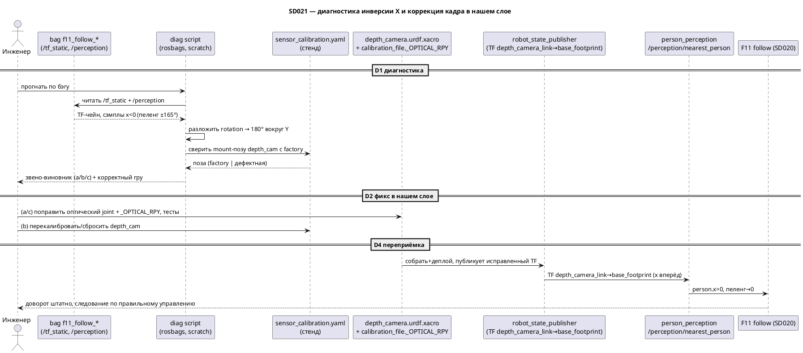

# SD021. Технический дизайн — инверсия оси X цели перцепшна (кадр камеры)

## Системный дизайн

1. **D1.** Диагностика-первый подход: причина не предполагается, а снимается с
   бэга `f11_follow_20260904_182253`. `person_perception` применяет к сэмплу
   облака только TF, поэтому источник знака X полностью виден в статическом
   TF-чейне `base_footprint ← … ← depth_camera_link`. Диагностика раскладывает
   этот поворот и атрибутирует 180°-разворот вокруг Y одному из трёх звеньев.
   1. **D1.1.** Инструмент анализа: офлайн-скрипт (pure-python чтение rosbag2
      библиотекой `rosbags`, без ROS на маке). Из бэга берутся `/tf_static`
      (+`/tf`) — собрать чейн `depth_camera_link → base_footprint` и разложить
      его rotation в rpy; и сэмплы `/perception/nearest_person` — подтвердить
      наблюдаемые `x<0`, пеленг ≈±165° (сверка с сырыми числами `solution.md`).
      Опорный foot-`z` цели в базе печатается как знак-тель. Скрипт живёт в
      scratch, в рантайм робота не входит; результат фиксируется в `tech.md`.
   2. **D1.2.** Атрибуция к трём кандидатам и признак каждого: **(a)** оптический
      joint `depth_cam_optical_joint` в URDF не соответствует реальной конвенции
      облака `aurora930` (действующий статический TF `depth_cam_link →
      depth_camera_link` ≠ факторный `rpy(−π/2,0,−π/2)`, а mount-поза из calib
      факторная); **(b)** в `sensor_calibration.yaml` на стенде сохранена
      дефектная mount-поза `depth_cam` (напр. `pitch≈π` из неудачной корнер-
      калибровки SD012) — сверить позу из файла стенда с factory; **(c)**
      конвенция осей самого облака драйвера. Разворот на 180° кратен прямому углу
      — по признакам (a)/(b) разделяется однозначно; при неоднозначности или
      если нарушен ещё и знак `y` (не чистый разворот вокруг Y) — стоп и уточнение
      (негативный сценарий №1 BA).

### As-built (стенд `pi@192.168.2.2`)

Снято 2026-09-05 офлайн-скриптом `scratch/diag_sd021_tf.py` (`rosbags`, без ROS)
по бэгу `scratch/bags/f11_follow_20260904_182253` (копия
`mentorpi-t1:/home/ubuntu/mentorpi_t1_ws/bags/f11_follow_20260904_182253`, 101.18 с)
и файлу калибровки стенда `scratch/calib/sensor_calibration.yaml` (хост Pi
`/home/pi/mentorpi_t1_ws/config/platform/t1/sensor_calibration.yaml`). Повторный
ssh на `192.168.2.2` / `192.168.149.1` в этот день не ответил — числа ниже со
стянутых копий. В бэге **нет** `/tf` и `/tf_static` (контур F11 их не писал);
чейн восстановлен как runtime: yaml-mount ∘ factory optical joint — та же
композиция, что `robot_state_publisher` / `fallback_tf_args`.

| Величина | Factory | Стенд (файл) |
|----------|---------|----------------|
| `depth_cam` xyz (`base_link`) | `(0.10, 0.0, 0.05)` | `(0.00546, −0.00559, 0.01800)` |
| `depth_cam` rpy рад | `(0, 0, 0)` | `(0.00731, −0.36926, 3.14159)` = `(0.42°, −21.16°, 180.00°)` |
| `depth_cam` source | — | `x/y` computed, `z` measured, `roll/pitch/yaw` computed (corner) |
| высота от пола | 0.177 м | **0.145 м** (= `z_mount+0.127`, замер SD012) |
| optical `depth_cam_link→depth_camera_link` | `rpy(−π/2, 0, −π/2)` | то же (в yaml нет; URDF / `_OPTICAL_RPY` не менялись) |

Статический TF `depth_camera_link → base_footprint` (перевод точки из облака в базу):

| | Factory (mount identity ∘ optical) | Стенд (yaml ∘ optical) |
|--|------------------------------------|-------------------------|
| xyz | `(0.10, 0.0, 0.177)` | `(0.00546, −0.00559, 0.145)` |
| rpy рад | `(−π/2, 0, −π/2)` | `(−1.20153, 0.00682, 1.57344)` = `(−68.84°, 0.39°, 90.15°)` |

Оптический базис в `base_footprint` (норма: перед `+x`, вправо `−y`, вверх `+z`):

| Ось optical | Factory | Стенд |
|-------------|---------|--------|
| `+z` (перед камеры) | `(+1, 0, 0)` | `(−0.933, 0, +0.361)` → перед → `−x` |
| `+x` (вправо) | `(0, −1, 0)` | `(−0.003, +1.000, −0.007)` → вправо → `+y` (инверсия Y) |
| `−y` (вверх) | `(0, 0, +1)` | `(+0.361, +0.007, +0.933)` → вверх → `+z` (переворота верх/низ нет) |

Дополнительный поворот mount относительно factory: ось `(−0.18, 0.00, −0.98)`, угол 179.92°.
Геодезическое расстояние до `Rz(π)` = **21.16°** (ровно остаточный pitch −21.16°);
до `Ry(π)` = **179.59°** (это *не* гипотеза D1). Контрфактический yaw→0 при том же
pitch даёт перед → `+x` (`+0.933, 0, +0.361`).

`/perception/nearest_person`: 1002 сообщений, **606 valid, все `x<0`**, `y>0`: 484 /
`y<0`: 122, среднее `|atan2(y,x)|` = **160.2°**. `NearestPerson` поля `z` не несёт —
тель верх/низ только из TF (столбец `−y_opt` выше). Сверка с `solution.md`:

| t_s | x | y | range | пеленг | note |
|-----|---|---|-------|--------|------|
| 3.6 | −1.924 | +0.554 | 2.003 | +163.9° | first valid ≡ `solution.md` −1.92 / +0.55 / 164° |
| 8.3 | −0.889 | +0.222 | 0.916 | +166.0° | `solution.md` −0.89 / +0.22 / 166° |
| 32.3 | −0.408 | −0.143 | 0.432 | −160.7° | `solution.md` −0.41 / −0.14 / −161° |
| 45.4 | −2.013 | +0.585 | 2.097 | +163.8° | mid valid |
| 100.9 | −1.845 | +0.679 | 1.966 | +159.8° | last valid |

**Диагноз.** Виновник **(b)**: в `sensor_calibration.yaml` стенда у `depth_cam`
сохранена дефектная mount-поза `yaw=π` (`source.yaw=computed`, этап `corner`) при
factory `(0,0,0)`. Оптический joint **(a)** совпадает с факторным
`rpy(−π/2,0,−π/2)` — править URDF/`_OPTICAL_RPY` не за что. Конвенция облака
**(c)** исключена: уже этот TF отображает optical `+z` в `−x`; второй переворот
в облаке вернул бы `x>0`, а его нет ни в одном valid-сэмпле. Гипотеза D1
«180° вокруг Y» **не подтверждена**: это `Rz(π)` плюс pitch ≈ −21°, поэтому в TF
инвертирован и знак **Y** (вправо камеры → `+y` базы), а `z` (верх) не перевёрнут.
Это стоп T1 / негативный сценарий №1 BA: фикс X-only (D2.1) не начинать. Ветка
T2, если оператор подтвердит, — **D2.2** (сброс/перекалибровка `depth_cam` на Pi),
не правка optical joint.

### T2 applied (D2.2, 2026-09-05)

Оператор открыл T2 после диагноза T1. Ветка **D2.1 не применялась** (optical
joint факторный). На хосте Pi `192.168.149.1` в
`/home/pi/mentorpi_t1_ws/config/platform/t1/sensor_calibration.yaml` у
`depth_cam` сброшены `roll/pitch/yaw` к factory `(0, 0, 0)`; `xyz` и высота
от пола **0.145 м** (`z_mount=0.018`, `source.z=measured`) сохранены; лидар и
IMU без изменений. Исходный файл:
`sensor_calibration.yaml.sd021_t1.bak` (тот же `yaw=π`, что в T1). Overlay,
URDF, `_OPTICAL_RPY`, `person_perception` и F11 не менялись.

Юнит-проверка перевода optical → `base_footprint` по исправленному yaml
(тот же состав, что `robot_state_publisher` / `fallback_tf_args`):

| Ось optical | После D2.2 |
|-------------|------------|
| `+z` (перед) | `(+1, 0, 0)` → `x>0` |
| `−x` (влево) | `(0, +1, 0)` → `y>0` |
| `−y` (вверх) | `(0, 0, +1)` → `z>0` |

Живой TF стека перечитает файл после `t1ctl restart` (оператор, T3). Старый
бэг F11 по-прежнему с `x<0` — это запись до фикса, не регрессия.

### T3 as-built (стенд, 2026-09-05)

После `t1ctl restart` записан бэг
`mentorpi-t1:/home/ubuntu/mentorpi_t1_ws/bags/f11_follow_20260905_080816`
(105.4 с, те же топики контура, что исходный F11). Overlay/URDF/`person_perception`
не пересобирались — на стеке только сброшенный yaml T2.

`/perception/nearest_person`: 637 сообщений, **192 valid, все `x>0`**, ни одного
`x<0`. `y>0`: 15 / `y<0`: 177. Среднее `|atan2(y,x)|` = **19.2°** (было 160.2°).
`range` min/max 0.36 / 2.36 м. Режим всё время `AUTO_FOLLOW`. Закон F11 совпадает
с позой: `sign(ω) = sign(y)` при движении; шасси знак `ω` не зеркалит.

| | До T2 (бэг `…182253`) | После T2 (бэг `…080816`) |
|--|------------------------|---------------------------|
| `person.x` спереди | все valid `x<0` | все valid `x>0` |
| пеленг по курсу | ≈ ±165° | ≈ 19° (впереди → ~0, не 165°) |
| `person.y` слева от камеры | не проверялось живьём | **`y<0`** (echo 2026-09-05: −0.3…−1.4) |

**Ось X — закрыта.** Сброс `depth_cam.yaw=π → 0` убрал рапорт «цель позади».
Человек спереди даёт `x>0`, робот едет вперёд. Инверсия Y в коде
(`xy_range_in_base`) не вносилась (откат по решению оператора). Калибровку
после T2 больше не меняли.

**Ось Y — не закрыта в SD021.** Factory-композиция mount `(0,0,0)` ∘ optical
`rpy(−π/2,0,−π/2)` предсказывает «лево облака → `y>0`», живой перцепшн даёт
обратное: человек в **левой** половине кадра → `person.y<0` → F11 крутит
**вправо** (закон верен, вход с неверным знаком). Поворот в URDF не умеет
перевернуть только Y, не тронув X или верх/низ; возвращать `yaw=π` нельзя —
снова сломает X. Знак Y в `person_perception` инвертировать запрещено
(оператор). Остаток — конвенция облака / optical (кандидат D1.2 **(c)** по
поперечной оси; T1 отсёк (c) только для форварда: `+z→−x`). Рекуррентность
записи `yaw=π` в `corner` — [SD022](../SD022/solution.md), не этот SD.

Наезд на ноги после стопа к SD021 не относится: при `range<0.55` F11 держит
нули (19 сэмплов в бэге); затем цель пропадает и возвращается с `range≈1.8 м`
— перцепшн отдал дальнюю точку, робот снова едет.

2. **D2.** Коррекция кадра строго в нашем слое; место фикса определяется D1:
   1. **D2.1.** Источник — оптический joint / конвенция облака **(a)/(c)**:
      исправить `rpy` у `depth_cam_optical_joint` в `depth_camera.urdf.xacro` и
      **синхронно** константу `_OPTICAL_RPY["depth_cam"]` в `calibration_file.py`
      (одно значение живёт в двух местах: URDF-путь через `robot_state_publisher`
      и статический fallback `fallback_tf_args`/`operator_display`) так, чтобы
      точка перед камерой давала `x>0, y-влево, z-верх` в `base_footprint`.
      Обновить пристёгнутые к старому значению тесты (`_FACTORY_FALLBACK["depth_cam"]`
      и `test_fallback_depth_keeps_optical_when_mount_identity` в
      `test_calibration_file.py`) и подтвердить, что корнер-стейдж калибровки
      (`stages/transforms.py::camera_optical_from_base_link`, тесты
      `test_corner_evaluate.py`/`test_tilt.py`) остаётся согласован.
   2. **D2.2.** Источник — дефектная сохранённая поза на стенде **(b)**:
      перекалибровать/сбросить `depth_cam` в `sensor_calibration.yaml` на Pi
      (`t1ctl calib camera` заново либо сброс к factory) — кода не меняем. Ветка
      выбирается результатом D1; в обеих ветках инвариант приёмки один.
3. **D3.** Что не трогаем (явный scope-гард): нода `person_perception.cpp` (точку
   не сочиняет, TF доверяет, логика выбора ближайшего корректна и свою QA
   прошла), закон следования F11/SD020, вендорский `aurora930_node`. Постоянный
   автотест-инвариант «перед→x>0» не вводим (решение BA).
4. **D4.** Приёмка кадра на стенде: после фикса перезаписать тот же позитивный
   сценарий F11 (человек прямо перед роботом, `AutoFollow`), подтвердить на новом
   бэге пеленг цели по курсу `atan2(y,x)→0`, `x>0` спереди, знак `y`
   (лево/право) сохранён, знак `z` (верх) корректен, доворот F11 включается
   штатно для цели сбоку. Методика — в `measure.md`.

## Программные интерфейсы

### ROS / TF-контракт кадра
1. **I1.** TF `base_footprint ← depth_camera_link`. Инвариант REP-103: точка
   **перед** камерой → `x>0`; **слева** → `y>0`; **вверх** → `z>0`. Это тот же
   контракт `I1` из [SD020/tech.md](../SD020/tech.md) («`x` вперёд, `y` влево»),
   нарушенный на входе F11. Потребитель контракта — `transform_to_base` в
   `person_perception.cpp` (не меняется).
   1. **I1.1.** Оптический joint `depth_cam_link → depth_camera_link`, `rpy`
      (сейчас `−π/2, 0, −π/2`) — единственная статическая величина, которую
      правит фикс по ветке D2.1; mount-поза (`x/y/z/roll/pitch/yaw`) остаётся из
      калибровки. Значение продублировано в `depth_camera.urdf.xacro` (joint
      `depth_cam_optical_joint`) и в `calibration_file._OPTICAL_RPY["depth_cam"]`
      — правятся оба синхронно.

### Данные диагностики (не рантайм-API)
2. **I2.** Выход диаг-скрипта: по каждому сэмплу — `(x,y,z)` в `base_footprint` из
   `/perception/nearest_person`, пеленг `atan2(y,x)`, знаки `x`/`z`; и разложенный
   в rpy статический TF `depth_camera_link→base_footprint` со сверкой против
   факторного. Формат — печать / markdown-таблица в `tech.md` (`### As-built`).

## Изменения в приложениях

### `docs/SD/SD021/` + scratch diag-скрипт
**Пункты:** D1.1, D1.2, I2

Диагностика — новый одноразовый инструмент вне рантайма робота: читает бэг
библиотекой `rosbags` (pure-python, ROS на маке не нужен). Роль — доказательно
локализовать звено инверсии до любого изменения кода.

1. Скрипт в scratch: извлечь `/tf_static`(+`/tf`), собрать и разложить чейн
   `depth_camera_link→base_footprint`; распечатать сэмплы `/perception/nearest_person`
   с пеленгом и знаками `x`/`z`.
2. Результат (звено-виновник, действующий и корректный `rpy`, сырые числа) занести
   в `tech.md` как `### As-built (стенд pi@192.168.2.2)` + абзац диагноза.
3. Не трогаем: рантайм-ноды; скрипт в `src/` не коммитим.

### `src/mentorpi_description/urdf/depth_camera.urdf.xacro`
**Пункты:** D2.1, I1, I1.1

URDF-источник оптического joint платформы (F07). Архитектурно меняется одна
статическая величина — `rpy` у `depth_cam_optical_joint` — чтобы кадр
`depth_camera_link` соответствовал фактической конвенции облака `aurora930`.

1. Поправить `rpy` `depth_cam_optical_joint` на снятое в T1 корректное значение
   (устраняет 180°-разворот вокруг Y).
2. Не трогаем: mount-joint `depth_cam_joint` (его поза приходит из калибровки),
   оптический комментарий про `rgb_camera_link` от драйвера.

### `src/mentorpi_calibration/mentorpi_calibration/calibration_file.py`
**Пункты:** D2.1, I1.1

Держит вторую копию оптического `rpy` (`_OPTICAL_RPY["depth_cam"]`), используемую
статическим fallback-TF (`fallback_tf_args`) и read-side (`operator_display`).
Должна остаться идентичной URDF, иначе fallback-путь и `robot_state_publisher`-путь
разойдутся.

1. Синхронно с URDF поправить `_OPTICAL_RPY["depth_cam"]`.
2. Обновить пристёгнутые тесты `test_calibration_file.py`:
   `_FACTORY_FALLBACK["depth_cam"]` и `test_fallback_depth_keeps_optical_when_mount_identity`.
3. Проверить согласованность корнер-стейджа (`stages/transforms.py`,
   `test_corner_evaluate.py`, `test_tilt.py`) — при расхождении поправить там же.
4. Не трогаем: mount-позы, оффсет `base_link`, логику загрузки/валидации файла.

### `sensor_calibration.yaml` на стенде (Pi) — ветка D2.2
**Пункты:** D2.2

Экземплярная калибровка робота. Затрагивается только если T1 указал на дефектную
сохранённую позу `depth_cam` (а не на код).

1. Перекалибровать `depth_cam` (`t1ctl calib camera`) либо сбросить к factory;
   кода не меняем.

### `src/mentorpi_perception/src/person_perception.cpp`
**Пункты:** D3

Потребитель TF. Приведён явно как «не трогаем»: инверсия не отсюда, логика выбора
ближайшего корректна и QA прошла.

1. Изменений нет.

## ToDo
Порядок: сначала диагноз (без него фикс вслепую запрещён), затем точечная
коррекция в нашем слое, затем стендовая переприёмка F11.

- [x] T1. Диагностировать источник инверсии X по бэгу
  - **Реализует:** D1.1, D1.2, I2
  - **Файлы:** scratch diag-скрипт (`rosbags`), `docs/SD/SD021/tech.md` (`### As-built` + диагноз)
  - **Что нужно сделать:** Стянуть бэг `/home/ubuntu/mentorpi_t1_ws/bags/f11_follow_20260904_182253` из docker-контейнера стенда и
    прочитать его офлайн-скриптом на `rosbags` (ROS на маке не требуется). Из
    `/tf_static` (и `/tf`) собрать статический чейн `depth_camera_link →
    base_footprint`, разложить его rotation в `rpy` и явно показать, что перед-
    камеры (оптический `+z`) маппится в `−x` базы, то есть присутствует разворот
    на 180° вокруг оси Y. Параллельно распечатать сэмплы `/perception/nearest_person`
    и подтвердить наблюдаемое (`x<0`, пеленг ≈±165°, сверка с сырыми числами
    `solution.md`), включая знак опорного `z` как тель переворота верх/низ.
    Затем атрибутировать разворот одному из трёх звеньев D1.2: сверить действующий
    статический TF `depth_cam_link→depth_camera_link` с факторным `rpy(−π/2,0,−π/2)`
    и mount-позу `depth_cam` из `sensor_calibration.yaml` стенда с factory —
    (a) плохой оптический joint/конвенция облака против (b) дефектной сохранённой
    позы. Вывод (звено, действующий и корректный `rpy`, ключевые числа) занести в
    `tech.md` как `### As-built` и абзац диагноза. Если разворот не сводится ни к
    одному звену или нарушен ещё и знак `y` — остановиться и вынести на уточнение,
    фикс не начинать.
  - **Критерии приёмки:**
    1. AC1. В `tech.md` показан разложенный статический TF `depth_camera_link→base_footprint`; оптический `+z` (перед) → `−x` базы назван явно. Гипотеза «180° вокруг Y» подтверждена либо отвергнута с фактической осью (As-built: `Rz(π)` + pitch −21°, не `Ry(π)`).
    2. AC2. Сэмплы из бэга подтверждают `x<0` и пеленг ≈±165° для цели, которая по видео перед роботом; знак опорного `z` зафиксирован.
    3. AC3. Однозначно назван виновник (a/b/c) со сверкой действующих значений против факторных; при неоднозначности задача завершается стопом-на-уточнение, а не догадкой.
  - **Проверка:** прогнать diag-скрипт на стянутом бэге; прочитать `### As-built`
    и диагноз в `tech.md`; сверить числа с `solution.md`.

- [x] T2. Исправить кадр камеры в нашем слое
  - **Реализует:** D2.1, D2.2, D3, I1, I1.1
  - **Файлы:** `src/mentorpi_description/urdf/depth_camera.urdf.xacro`,
    `src/mentorpi_calibration/mentorpi_calibration/calibration_file.py`,
    `src/mentorpi_calibration/test/test_calibration_file.py` (при ветке D2.1);
    либо `sensor_calibration.yaml` на Pi (при ветке D2.2)
  - **Что нужно сделать:** По выводу T1 применить точечную коррекцию строго в
    нашем слое, вендорский `aurora930_node` не трогаем. Ветка D2.1 (плохой
    оптический joint/конвенция облака): поправить `rpy` `depth_cam_optical_joint`
    в `depth_camera.urdf.xacro` на корректное значение из T1 и **синхронно** ту же
    величину `_OPTICAL_RPY["depth_cam"]` в `calibration_file.py` (одно значение в
    двух путях — `robot_state_publisher` и статический fallback); обновить
    пристёгнутые тесты `_FACTORY_FALLBACK["depth_cam"]` и
    `test_fallback_depth_keeps_optical_when_mount_identity`, и проверить, что
    корнер-стейдж калибровки (`stages/transforms.py`, `test_corner_evaluate.py`,
    `test_tilt.py`) остаётся зелёным и согласованным. Ветка D2.2 (дефектная
    сохранённая поза на стенде): перекалибровать/сбросить `depth_cam` в
    `sensor_calibration.yaml` без правки кода. В обеих ветках инвариант один: точка
    перед камерой → `x>0, y-влево, z-верх`; знак `y` сломать нельзя. Ноду
    `person_perception.cpp` и закон F11 не трогаем (D3).
  - **Критерии приёмки:**
    1. AC1. После фикса перевод точки перед камерой в `base_footprint` даёт `x>0`, `y` левой цели `>0`, `z` верхней точки `>0` (проверяется тем же diag-скриптом на новом TF или юнит-проверкой перевода).
    2. AC2. Ветка D2.1: `_OPTICAL_RPY["depth_cam"]` в `calibration_file.py` совпадает с `rpy` `depth_cam_optical_joint` в URDF; `colcon test` mentorpi_calibration зелёный (обновлённые `_FACTORY_FALLBACK`/fallback-тест + корнер-стейдж).
    3. AC3. `person_perception.cpp`, закон F11/SD020 и вендорский драйвер без изменений; постоянного автотеста «перед→x>0» не добавлено.
  - **Проверка:** `git diff` (только наш слой); `colcon test --packages-select
    mentorpi_calibration`; повторный прогон diag-скрипта против исправленного TF
    показывает `x>0`, пеленг→0.

- [x] T3. Переписать позитивный бэг F11 на стенде и подтвердить кадр
  - **Реализует:** D4
  - **Файлы:** `docs/SD/SD021/measure.md` (стендовая методика), `docs/SD/SD021/STATUS.md`
  - **Что нужно сделать:** Собрать overlay (`./scripts/build-arm64.sh`) и
    задеплоить на Pi при ветке D2.1, либо применить калибровку при D2.2 (сборку и
    деплой запускает пользователь, не агент). Прописать в `measure.md` методику
    переписи того же позитивного сценария F11: человек прямо перед роботом,
    `AutoFollow`, запись всех топиков контура (как исходный
    `f11_follow_20260904_182253`). На новом бэге подтвердить: пеленг цели по курсу
    `atan2(person.y, person.x)→0`, `x>0` спереди, знак `y` (лево/право) сохранён,
    знак `z` корректен; доворот F11 включается штатно для цели **сбоку** (не
    только строго по курсу). Приёмка — на F11 как представителе `/perception/*`.
  - **Критерии приёмки:**
    1. AC1. На перезаписанном бэге для человека перед роботом `person.x>0` и пеленг `atan2(y,x)≈0` (а не ±165°).
    2. AC2. Знак `y` (лево/право) на бэге совпадает с реальным положением человека; для цели сбоку доворот F11 ненулевой в верную сторону.
    3. AC3. Следование ведёт робота к человеку по управлению (доворот от истинного пеленга), а не по «счастливой геометрии» строго по оси.
  - **Проверка:** методика и результаты в `measure.md`; прогон diag-скрипта на
    новом бэге; наблюдение следования на стенде оператором.

## Покрытие

| Пункт | Задачи |
|-------|--------|
| D1.1 | T1 |
| D1.2 | T1 |
| D2.1 | T2 |
| D2.2 | T2 |
| D3 | T2 |
| D4 | T3 |
| I1 | T2 |
| I1.1 | T2 |
| I2 | T1 |

Итог: пунктов 9 (D1.1, D1.2, D2.1, D2.2, D3, D4, I1, I1.1, I2), задач 3.
Непокрытых пунктов: нет.

## Финальный QA (пользователь, T1–T3)

Предусловие: при ветке D2.1 — собрать overlay `./scripts/build-arm64.sh` и
задеплоить на Pi; при D2.2 — применить калибровку на Pi. Агент сборку/деплой/запись
бэга не запускает. Стенд `pi@192.168.2.2`, охраны столкновений (F12/F13) ещё нет —
тесты движения в свободном пространстве, оператор с `t1ctl mode forbid` наготове.

### T1 — диагностика
1. Прогон diag-скрипта: разложенный TF `depth_camera_link→base_footprint`; перед камеры → `−x` (AC1). Гипотеза «180° вокруг Y» не подтвердилась: это ≈180° вокруг Z (`yaw=π`).
2. Сэмплы бэга: `x<0`, пеленг ±165°, знак `z` из TF = `+` (AC2); виновник **(b)** `depth_cam.yaw=π` (AC3). Ветка D2.2 подтверждена запросом T2.

### T2 — фикс кадра (ветка D2.2)
1. Перевод точки перед камерой → `x>0, y-влево, z-верх` (AC1): юнит-проверка по yaml после сброса `rpy→(0,0,0)`; живой TF — после `t1ctl restart`.
2. AC2 (D2.1: URDF ≡ `_OPTICAL_RPY`, `colcon test`) — не применим: optical joint не трогали.
3. `git diff` по `src/`: `person_perception`/F11/драйвер не тронуты, нового автотеста нет (AC3).

### T3 — переприёмка F11
1. Бэг `f11_follow_20260905_080816`: все 192 valid `x>0`, среднее `|пеленг|` 19.2° (AC1). Ось X закрыта.
2. AC2 не пройден: слева от камеры `person.y<0`, доворот вправо. Знак Y в коде и yaml после T2 не трогали. Остаток в `### T3 as-built`, не чинится в SD021.
3. Спереди следование по `x>0` (не «счастливая» езда при `x<0`). Сбоку управление зеркалит из‑за Y. Наезд на ноги — скачок `range` перцепшна, не закон F11.
