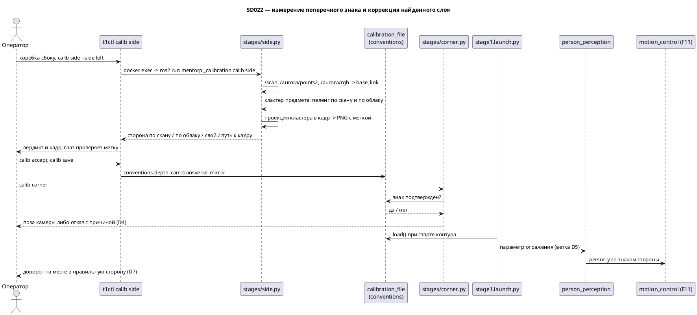

# SD022. Технический дизайн — ось Y цели перцепшна (зеркало лево/право)

## Системный дизайн

1. **D1.** Диагностика-первый, как в [SD021](../SD021/tech.md): слой не предполагается, а
   измеряется. Эталон стороны — лидар; поперечный знак снимается сверкой одного предмета в
   трёх потоках (`/scan`, `/aurora/points2`, `/aurora/rgb/image_raw`) на одной сцене. Правка
   вносится только в названный слой; слепое инвертирование знака `y` запрещено (решение
   оператора, унаследовано из SD021).
   1. **D1.1.** **Зеркало не наблюдаемо из угловой сцены — доказательство.** Конфигурация
      «две ортогональные вертикальные стены» инвариантна относительно отражения в
      биссекторной плоскости через вершину угла, а пол (горизонтальная плоскость) инвариантен
      к любому отражению в вертикальной плоскости. Значит для зеркального облака существует
      **собственное** (det = +1) движение, дающее точно нулевую невязку, и гипотезы «зеркало»
      и «поворот» неразличимы по невязке в принципе. Численно на фикстуре `build_corner_scene`
      ([test_corner_evaluate.py](../../src/mentorpi_calibration/test/test_corner_evaluate.py),
      стены `x=1.35`, `y=0.85`): при истинном `yaw=+0.12` зеркальное облако идеально
      объясняется значением `yaw=−0.12` — ошибка ровно `2·yaw`; при роботе, поставленном ровно
      к углу (`yaw≈0`), зеркало не видно вообще. Код это подтверждает: перебор в
      `match_camera_yaw_xy`
      ([scan_lines.py](../../src/mentorpi_calibration/mentorpi_calibration/stages/scan_lines.py))
      — это `LIDAR_YAW_EXTRAS × permutations × знаки неориентированных нормалей`, то есть
      только повороты и знаковая неоднозначность плоскостей; кандидаты сортируются по невязке,
      члена по хиральности нет. `extract_orthogonal_walls` берёт `up = cross(n1, n2)` и
      разворачивает его под `up_prior`
      ([planes.py](../../src/mentorpi_calibration/mentorpi_calibration/stages/planes.py)),
      поглощая отражение молча. Единственное упоминание детерминанта в пакете — Kabsch-поправка
      в `scan_match.py`, которая отражение **подавляет**. Вывод: детектором служит
      асимметричная сцена (одиночный предмет сбоку), а гипотезу отражения в солвер не
      добавляем. Гейт `corner`, который здесь предлагался, на фазе реализации снят — см. D4.
   2. **D1.2.** Два кандидата на слой и признак каждого: **(a)** геометрия облака — сторона
      предмета по облаку не совпадает со стороной по скану; **(b)** сопоставление кадра с
      облаком — сторона по облаку совпадает со сканом, но спроецированная в кадр метка ложится
      на противоположную сторону картинки. Кандидаты взаимоисключающие и различаются одним
      прогоном. Если ни один признак не сработал, либо расхождение не сводится к перестановке
      лево/право — стоп и уточнение (негативный сценарий №1 BA).

### As-built (стенд `pi@192.168.2.2`)

Протокол: [measure.md](measure.md). Прогон 2026-09-05, `t1ctl` 1.6.0, overlay `mentorpi_calibration` 0.3.4.
Реквизит: светлая лохматая подушка слева в прямом угле (`--side left`). Действующая
калибровка не менялась (`md5 47bec435dd5e1fc73a4c489554c513ba` до и после, `t1ctl calib reject`).

| | сторона | пеленг |
|--|---------|--------|
| оператор | left | — |
| `/scan` | left | 15.7° |
| `/aurora/points2` | left | 17.9° |

`layer: pixel_mapping`. `field: camera_transverse_mirror 0 0 computed` (признак облака не
предлагается). Кадр с меткой: [side_frame.png](side_frame.png).

**Диагноз T6.** Скан и облако согласны с оператором (лево) — слой (a) `cloud_geometry` снят.
Жёлтый крест на кадре лежит на вертикали угла комнаты (около середины кадра), а подушка —
в левой трети. По правилу D1.2(b) половина кадра с меткой не совпала с `--side left` →
сопоставление колонки облака с колонкой RGB. Оговорка тогда же: пеленги ~16° едва выше
порога 8°, метка могла быть углом, а не подушкой.

**Что пробовали (T7, тот же день).** Знак `y` в результате нигде не инвертировали.
`conventions.transverse_mirror` не включали. Ветку (a) (отражение optical X до TF) не
трогали.

1. **T7(b), флип колонки** в `rgb_to_cloud_index`: `col' = W−1−col`. Тот же закон — в этапе
   `side` (D2.3). `mentorpi_perception` 0.3.0.
2. Первый echo `/perception/nearest_person` (человек слева → `y < 0`) шёл ещё на
   **0.2.0** — фикс не был в `install/`. Не считается отказом T7.
3. После выкладки 0.3.0, процесс `person_perception` от 15:36 UTC. Человек слева,
   YOLO `bbox.u ≈ 191…196` (левая половина 640×400), `person.x ≈ 2.0`, **`person.y ≈ −0.69…−0.88`**.
   Два отсчёта `y > 0` при `x ≈ 3.42` — дальняя поверхность, не человек. По курсу и справа
   `y` тоже отрицательный. Ось X из SD021 цела (`x > 0`).
4. **Откат флипа** (тождественный `u → col`). `mentorpi_perception` 0.3.1,
   `mentorpi_calibration` 0.3.6. Повтор: `u ≈ 151…200`, **`y ≈ −0.53…−1.10`** при `x ≈ 2.0…2.2`.
   Рамка почти на весь кадр (`size ≈ 280×390`), нога рамки у нижнего края (дыры Aurora).
5. Живой TF `depth_camera_link → base_footprint` (поза с yaml: `xyz 0.171 0.010 0.145`,
   `rpy 1°/−21°/−1.9°`): optical `x = −0.4` (влево) → `base y = +0.35`. Калибровка в дереве
   есть, поперечный знак TF верный. Перцепшн на Pi уже отдаёт `x,y` в `base_footprint`;
   `motion_control` второй TF не делает. Mac `person_detect` 3D не считает — только пиксели
   RGB без flip; `frame_id: rgb_camera_link` у детекции — не мировая СК.
6. Срез `/aurora/points2` (width=256000, height=1, `point_step=32`). Индексация **row-major
   640×400, как в `parse_organized_xyz`**: среднее optical X по восьми «колонкам» почти
   плоское (все ≈ −0.1) — лево/право по индексу колонки не читается. По **порядку байт в
   буфере** (восемь последовательных кусков): mean X идёт **−0.34 → −0.17 → +0.16**, дальше
   пусто. Похоже на column-major (или 400×640), а не на сетку RGB.
7. **T7, раскладка column-major** (`mentorpi_perception` 0.3.2, `mentorpi_calibration` 0.3.7).
   Flattened `/aurora/points2` читается как `linear = col * 400 + row`. Юнит-тест воспроизводит
   стендовый случай: нога рамки, `u=194`, row-major попадает в decoy справа (`y<0`); после
   фикса левый пиксель даёт `y>0`, спереди `x>0`. Знак `y` не инвертируется, ветка (a) не
   тронута. Стендовый echo `/perception/nearest_person` — QA T7.
8. **Срез сырого буфера, прогон 2026-09-05 вечер** (человек сидит слева, непрерывная детекция,
   лидар обесточен — робот на павербанке, поэтому сверка со сканом в этот прогон не входит).
   На стенде `mentorpi_perception` 0.3.1 / `mentorpi_calibration` 0.3.6. Снят один кадр
   `/aurora/points2` вместе с рамкой и кадром RGB (скрипт-зонд, только подписки, публикаций нет).
   Числа кадра: `width 256000`, `height 1`, `point_step 32`, поля `x/y/z` (0/4/8) и **`rgb` (16)**;
   RGB `640×400 bgr8`; `camera_info` `fx 417.41`, `fy 418.38`, `cx 337.48`, `cy 183.76`.

   | Проверка | Число |
   |----------|-------|
   | валидных точек | **135 558** из 256 000, индексы **0…135 557 подряд**, дальше буфер пустой |
   | `corr(lin // 640, y/z)` | **+0.997** — вертикаль монотонна по индексу |
   | `corr(lin % 640, x/z)` | **+0.004** — внутри «строки» 640 горизонталь не читается |
   | `corr(lin // 400, x/z)` (column-major) | +0.240 — тоже не сетка |
   | `x/z` вдоль буфера | пила с **переменным** периодом 320…360, не 640 |
   | цвет точки vs кадр RGB по индексу (row-major / column-major) | +0.03 / −0.04 — не совпадает |
   | цвет точки vs кадр RGB **по проекции** `u = fx·x/z + cx` | **+0.99** (B +0.98, G +0.99, R +0.99) |

   Вывод среза: `/aurora/points2` — **не организованное облако**. Это уплотнённый список
   валидных точек, отсортированный по вертикальному углу; невалидные точки из буфера
   **выброшены**, поэтому длина «строки» плавает и постоянного соответствия «пиксель → индекс»
   не существует ни в каком порядке обхода. `height=1, width=256000` — честное описание:
   облако неорганизованное, а 256 000 — просто ёмкость буфера.

   Зато облако **зарегистрировано в кадре RGB**: проекция точек штатными интринсиками
   воспроизводит картинку с корреляцией 0.99, все 135 558 точек попадают в границы кадра
   (`u 21…624`, `v 0…367`).

9. **Симптом воспроизведён по числам того же кадра.** Рамка `u≈105`, `v≈160`, `207×192`
   (человек слева, `u` левее центра 337). Действующий код берёт пиксель ноги и идёт вверх по
   «колонке» row-major; первый валидный слот — `linear = 135 145` (`row 211`, `col 105`). Эта
   точка на самом деле проецируется в пиксель **`u=372, v=366`** — правый низ кадра, вне рамки —
   и даёт оптический `X = +0.038` → `person.y < 0`. Ошибка не в знаке и не в порядке обхода:
   код читает **чужую точку**.

   Если же отобрать точки по проекции внутрь рамки — их **29 557**, и оптический `X` отрицателен
   (влево) во **всех** полосах дальности: `0.3–0.5 м` → `−0.178`, `0.5–0.8` → `−0.312`,
   `0.8–1.2` → `−0.571`, `1.2–2.1` → `−0.716`. То есть по правильному отбору сторона совпадает
   с рамкой и с постановкой, и `person.y` вышел бы `> 0`.

10. **T7 по D6, прогон 2026-09-05 вечер** (`mentorpi_perception` / `mentorpi_calibration`
    **0.4.0**, `t1ctl` 1.6.0, режим `forbidden`, робот неподвижен). Индексная выборка снята,
    точка берётся ближним кластером по проекции. Человек **слева**, непрерывная детекция,
    два прогона подряд по 40 и 30 с:

    | | значение |
    |--|----------|
    | валидных отсчётов | 294 и 285 |
    | `bbox.u` | 174…211 (левее середины 320) |
    | `person.x` | +0.43…+0.44 |
    | `person.y` | **+0.117…+0.120** |
    | `range` | 0.45 м |
    | совпадений «сторона рамки = знак `y`» | **285/285** |

    Зеркало снято: рамка слева → `y > 0`, `x > 0`. Пеленг по цели 15° влево, по центру рамки
    18° влево — расхождение объясняется тем, что кластер берётся по ближней грани, а не по
    центру рамки.

11. **Поза «справа», тот же прогон.** Робота развернули, человек сидит справа примерно в
    0.7 м. 30 с, **292** валидных отсчёта: `bbox.u` 508…520 (правее середины 320),
    `person.x` +0.554…+0.558, **`person.y` −0.156…−0.158**, `range` 0.576…0.580.
    Совпадений «сторона рамки = знак `y`» — **292/292**. Вместе с п. 10 обе поперечные стороны
    закрыты: ось Y больше не зеркальна, ось X из SD021 цела (`x > 0` в обеих позах).

    **Что именно берёт ближний кластер** (срез того же кадра, рамка `u[378…639] v[79…397]`,
    55 795 точек внутри): плита `[0.241…0.591]` м, 18 238 точек, медиана `z = 0.386` м в
    оптике, что даёт `base x ≈ 0.55`, `range ≈ 0.58`. Отрисовка выбранных точек поверх кадра
    показывает **торс и предплечье человека** — не мебель и не край стола. Разница с
    «сижу в 0.7 м» — это расстояние до ближней поверхности тела против расстояния до посадки;
    для F11 первое и нужно. Пеленг по цели меньше пеленга центра рамки (15.7° против 22.8°) по
    той же причине: кластер берётся по ближней грани, а центр рамки — по всему силуэту.

12. **Поза «по курсу», тот же прогон.** 30 с, **245** валидных отсчётов: `bbox.u` 380…399,
    `person.x` +0.511…+0.531, **`person.y` −0.055…−0.072**, `range` 0.51…0.53. Совпадений —
    **245/245**. Человек встал не строго на ось: пеленг по цели **7.3°** вправо, пеленг центра
    рамки **7.2°** вправо — сходятся с точностью 0.1°. Это заодно проверка самой проекции:
    вблизи оси, где ближняя грань и центр силуэта почти совпадают, оба пеленга обязаны сойтись,
    и они сходятся. `x > 0`, `|y| < 0.08` — ось X цела, поперечного смещения нет.

    Итог по трём позам: **822 совпадения из 822**, ни одного расхождения знака.

    Оговорки прогона. (1) Стенд на павербанке: `/aurora/points2` идёт вспышками, средняя
    частота **0.6 Гц** при паузах 1.3–2.0 с (RGB и `camera_info` при этом ровные ~10 Гц).
    Из-за этого одно облако обслуживает несколько кадров детекций, и `person.x/y` в выборке
    почти константа при гуляющем `u`. На знак стороны это не влияет, на плавность F11 —
    повлияет. (2) Лидар обесточен (`lidar degraded`), поэтому сверка со сканом и этап
    `calib side` в этот прогон не входили. (3) AC4 к этому прогону не относится: он
    написан под ветку (a), а T6 назвал ветку (b) — параметра ноды и чтения калибровки в
    launch эта правка не заводит.

13. **Переприёмка контура T9, 2026-09-06.** Стенд на штатной батарее: лидар `active`
    (`/scan` 10 Гц), камера `active`, глубина 2.15 Гц. На стенде `mentorpi_perception` и
    `mentorpi_calibration` 0.4.0, `motion_control` 0.2.0 (временный закон T8,
    `kSd022MinBreakawayAngular = 0.16`), `t1ctl` 1.6.0. Оператор разрешил движение и прогнал
    `AutoFollow` в трёх позах. **Вердикт оператора: контур работает, доворот в правильную
    сторону, робот не едет.** Исходный симптом SD022 — человек слева, робот доворачивает
    вправо — снят.

    Оговорка по доказательствам: бэг прогона **не писался**. AC1–AC2 закрыты наблюдением
    оператора на стенде, AC3 в части приложенного бэга снят его же решением при закрытии SD.
    Инструментальные доказательства слоя и знака — пп. 8–12 выше (822 совпадения из 822 по
    трём позам) и `measure.md`; они от бэга не зависят.

**К чему пришли.** Слой (a) по T6 снят. Обе попытки T7 — флип колонки (`W−1−col`, 0.3.0) и
`column_major` (0.3.2) — бьют мимо, потому что обе исходят из ложной посылки D6: что у
`/aurora/points2` вообще есть раскладка «пиксель → индекс». Её нет, облако неорганизованное.
Единственное корректное соответствие кадра и облака — **проекция точки интринсиками
`/aurora/rgb/camera_info`**; оно измерено на стенде (корреляция цвета 0.99) и на том же кадре
снимает симптом. Знак `y` по-прежнему не трогаем: причина — выбор точки, не конвенция осей.
Проекция подтверждена на стенде и в коде (пп. 10–12): слева `y > 0`, справа `y < 0`, по курсу
`|y| < 0.08`, во всех трёх позах `x > 0` — **822 совпадения из 822**. Зеркало SD022 закрыто на
слое сопоставления, знак `y` не инвертировался, ветка (a) не тронута. T7 закрыт; T8 начинать
после код-ревью и QA T7.

2. **D2.** Новый этап калибровки `side` — единственный в системе измеритель поперечного знака.
   1. **D2.1.** Сбор: подписки `/scan`, `/aurora/points2`, `/aurora/rgb/image_raw` за одно окно
      (`--timeout`, дефолт как у `corner`). Гейт наличия по образцу
      `CornerCollector.topics_available`
      ([corner.py](../../src/mentorpi_calibration/mentorpi_calibration/stages/corner.py)) с
      новыми деталями отказа `no /scan` / `no camera depth` / `no camera rgb`. Публикаций нет —
      запрет проверяется существующим `test_no_publishers_in_stage_sources`.
   2. **D2.2.** Поиск предмета: скан и облако переводятся в `base_link` действующими позами
      (`lidar_base_link_from_frame`, `camera_base_link_from_optical` из
      [transforms.py](../../src/mentorpi_calibration/mentorpi_calibration/stages/transforms.py)),
      берётся фронтальный сектор и рабочая дальность, точки кластеризуются по угловым разрывам,
      выбирается ближайший компактный кластер; протяжённые кластеры (стены) отсекаются по
      угловой ширине. Выход — пеленг предмета по скану и по облаку.
   3. **D2.3.** Проекция облака на кадр: точки кластера облака переводятся в пиксель кадра
      **тем же отображением, что и перцепшн** — проекцией интринсиками `/aurora/rgb/camera_info`
      (D6.2), а не индексом в буфер; при отсутствии `camera_info` кадр с меткой не пишется и
      признак `pixel_mapping` не выносится (вердикт по неполным данным — D2.4). На кадр
      рисуется метка, кадр пишется PNG рядом с файлом калибровки. PNG собирается стандартной
      библиотекой (`zlib` + `struct`): пакет `mentorpi_calibration` зависит только от `rclpy` и
      `sensor_msgs`, OpenCV в него не вводим.
   4. **D2.4.** Вердикт и слой. Оператор называет истинную сторону (`--side left|right`),
      инструмент сравнивает её со сканом, скан — с облаком, облако — с кадром по признакам
      D1.2. Скан ≠ оператор → под подозрением сам лидар, стоп с деталью. Предмет не найден в
      потоке → отказ с названием потока; вердикт по неполным данным не выдаётся.
3. **D3.** Признак конвенции в файле калибровки. Отражение не поза, поэтому оно живёт **не** в
   `sensors`, а в новой секции верхнего уровня `conventions` — иначе пришлось бы ломать
   `SensorPose`, `FIELD_NAMES`, `_in_range`, `_merge_partial_pose` и `operator_display`.
   Отсутствие секции = `false` с источником `factory`; `version: 1` не меняется, старые файлы
   читаются как раньше и не становятся `unused`. Этап `side` предлагает значение через
   `write_draft`, оператор переносит его обычными `accept` + `save` (единственный путь записи —
   `promote_draft`).
4. **D4.** ~~Гейт `corner`~~ — **снят на фазе реализации (решение оператора, 2026-09-05).**
   Исходно: пока поперечный знак не подтверждён, `corner` не предлагает позу `depth_cam`.
   Основание было D1.1 — на **зеркальном** облаке `corner` выдаёт правдоподобную позу с нулевой
   невязкой и молча портит калибровку.
   Почему снимаем: D1.1 как геометрический факт остаётся верным, но посылка «облако может быть
   зеркальным» замером снята. T6 сверил сторону предмета по скану и по облаку — они совпали,
   ветка (a) `cloud_geometry` закрыта; T7 нашёл причину в сопоставлении пикселя с точкой
   (D6.1–D6.3) и починил её. `conventions.transverse_mirror` после этого никем и никогда не
   выставляется в `true`. Гейт блокировал бы калибровку камеры до прогона `calib side` с
   реквизитом и лидаром — ради опасности, которую измерили и не нашли. Секция `conventions`
   (D3) и этап `side` (D2) остаются: первая как безвредное поле, второй как диагностический
   инструмент на случай, если зеркало вернётся со сменой камеры или прошивки. `corner` работает
   как до SD022.
5. **D5.** Ветка (a) — зеркало в геометрии облака. Признак из `conventions` читается в
   [stage1.launch.py](../../src/mentorpi_bringup/launch/stage1.launch.py) защитно, по образцу
   `_camera_calibration` в
   [camera_layer.launch.py](../../src/mentorpi_bringup/launch/camera_layer.launch.py), и
   передаётся ноде `person_perception` параметром; нода перед переводом в базу отражает
   поперечную ось точки облака в оптическом кадре. TF, URDF и `_OPTICAL_RPY` не трогаются.
6. **D6.** Ветка (b) — зеркало в сопоставлении пикселя с точкой. Признак `conventions` в этой
   ветке остаётся `false`. Ветка выбирается результатом D2.4; вслепую не берётся ни одна.
   1. **D6.1.** **Раскладки нет — доказано замером** (`### As-built` п. 8). Первая редакция D6
      предполагала, что `/aurora/points2` — организованная сетка `640×400`, сплющенная в
      `height=1, width=256000`, и что чинить надо порядок обхода (`rgb_to_cloud_index`,
      row-major ↔ column-major). Посылка ложная: облако **неорганизованное** — это уплотнённый
      список валидных точек (на стенде 135 558 подряд из 256 000, дальше буфер пуст),
      отсортированный по вертикальному углу, с **выброшенными** невалидными точками. Длина
      «строки» из-за этого плавает (320…360), и постоянного соответствия «пиксель → индекс» не
      существует ни в каком порядке обхода: `corr(lin % 640, x/z) = +0.004` (row-major),
      `corr(lin // 400, x/z) = +0.240` (column-major). Обе попытки T7 по первой редакции
      (флип колонки 0.3.0 и `column_major` 0.3.2) поэтому промахивались мимо цели.
   2. **D6.2.** **Соответствие даёт проекция, а не индекс.** Облако зарегистрировано в кадре
      RGB: проекция точки штатными интринсиками `/aurora/rgb/camera_info`
      (`u = fx·x/z + cx`, `v = fy·y/z + cy`) воспроизводит картинку с корреляцией **0.99** по
      цвету точки, все точки кадра попадают в границы изображения. Это единственное измеренное
      соответствие, и на стендовом кадре оно снимает симптом: точек проекцией внутрь рамки —
      29 557, оптический `X` отрицателен (влево) во всех полосах дальности.
   3. **D6.3.** **Как берём дальность.** Индексная выборка одного пикселя заменяется отбором по
      проекции: точки, попавшие в рамку, группируются по дальности, берётся **ближний**
      кластер — человек ближе фона, стена в рамке не интересует (решение оператора). Кластер
      обязан иметь минимальную опору, иначе одиночная точка-выброс станет целью; итоговая точка
      — медиана кластера, робастная к дырам Aurora по краям силуэта. Отбор идёт по проекции
      целиком: `rgb_to_cloud_index`, `organized_point_offset`, `column_major` и допущение
      `640×400` уходят из
      [person_geometry.hpp](../../src/mentorpi_perception/include/mentorpi_perception/person_geometry.hpp)
      совсем. Знак `y` по-прежнему не инвертируется: чинится выбор точки, не конвенция осей.
   4. **D6.4.** **Нет интринсик — нет цели.** Пока `camera_info` не пришёл, нода не догадывается
      о фокусе по FOV, а ведёт себя как при устаревшем облаке: `persons` пустой, throttled-warn.
      Молчаливый фолбэк на прежнюю индексную выборку запрещён — именно он маскировал бы возврат
      симптома.
7. **D7.** Временное поведение F11 на период проверки: в законе `compute_follow_twist` линейная
   команда принудительно нулевая, а доворот считается независимо от линейного канала (сейчас
   `angular_z` живёт только при `linear_x > 0`), с мёртвой зоной `ang_deadband`, насыщением
   `max_angular` и минимальной страгивающей угловой — на гусеницах малая команда не сдвинет
   траки. Патч без нового параметра конфига, помечен как временный, снимается в SD024.
8. **D8.** Что не трогаем: `person_target_lock` и логику выбора ближайшего, `mission_control`,
   `control_mux`, URDF и `_OPTICAL_RPY`, калибровку лидара и IMU, ось X из SD021 (`depth_cam.rpy`
   на стенде остаётся `(0,0,0)`, высота 0.145 м, возврат `yaw = π` запрещён), F12/F13, экран
   оператора и Foxglove. Гипотезу отражения в `match_camera_yaw_xy` не добавляем (D1.1).



## Программные интерфейсы

### CLI контейнера — `mentorpi_calibration`

1. **I1.** Новая команда `calib side --side left|right [--timeout <с>]`. Имя добавляется в
   `_KNOWN_COMMANDS` и в `_build_parser`, иначе `main` вернёт `unknown command`. Успех печатает
   существующие токены плюс новые `observed:`, `layer:`, `frame:`:
   ```
   T1CTL_CALIB_OK=1
   stage: side
   observed: operator left
   observed: scan left 24.6
   observed: cloud right -25.1
   layer: cloud_geometry
   frame: /home/ubuntu/mentorpi_t1_ws/config/platform/t1/side_frame.png
   field: camera_transverse_mirror 0 1 computed
   ```
   Значения `layer:` — `cloud_geometry` | `pixel_mapping` | `none` | `lidar_suspect`. Отказ —
   существующий контракт `_print_stage_failure`: `T1CTL_CALIB_OK=0`, `stage: side`, `detail: …`
   (`no /scan`, `no camera depth`, `no camera rgb`, `object not found in scan`,
   `object not found in cloud`, `lidar side disagrees with operator`). Коды выхода: `0` успех,
   `1` любой отказ.
2. **I2.** Этап `side` участвует в черновике наравне с прочими: регистрируется в
   `_STAGE_ORDER`, `_STAGE_FIELD_PATTERNS`, `_STAGE_SOURCES` с источником `computed`, пишет
   через `write_draft(stage="side", …)` и переносится `accept_pending` / `promote_draft`.

### Хостовый CLI — `t1ctl`

3. **I3.** Подкоманда `t1ctl calib side --side left|right [--timeout <с>]` в дереве CLI11
   ([main.cpp](../../host/t1ctl/src/main.cpp)), диспетчер через `run_calib_stage`. Новые токены
   `observed:`, `layer:`, `frame:` добавляются в `parse_result_line`
   ([calib.cpp](../../host/t1ctl/src/calib.cpp)) и в структуру `calib::Result`
   ([calib.hpp](../../host/t1ctl/src/calib.hpp)); печать — новый `ui::print_calib_side`. Строка
   в `ui::print_help` ([ui.cpp](../../host/t1ctl/src/ui.cpp)).
4. **I4.** После успешного этапа `t1ctl` копирует кадр из контейнера
   (`docker cp mentorpi-t1:<frame> <host-path>`) и печатает путь на хосте Pi.

### Файл калибровки

5. **I5.** Схема `sensor_calibration.yaml` дополняется секцией верхнего уровня; `version`
   остаётся `1`, отсутствие секции эквивалентно значению по умолчанию:
   ```yaml
   conventions:
     depth_cam:
       transverse_mirror: false
       source: factory        # factory | computed
   ```
   Публичные функции
   [calibration_file.py](../../src/mentorpi_calibration/mentorpi_calibration/calibration_file.py):
   `transverse_mirror(calib) -> bool`, `transverse_mirror_source(calib) -> str`. Черновик несёт
   то же поле в `pending.values` под сенсором `depth_cam`.

### ROS — нода `person_perception`

6. **I6.** Новый параметр `depth_cam_transverse_mirror` (`bool`, дефолт `false`); значение
   подставляет `stage1.launch.py` из файла калибровки. Топики (`/perception/detections_2d`,
   `/aurora/points2`, `/aurora/rgb/image_raw`, `/perception/persons`,
   `/perception/nearest_person`), кадры `base_footprint` / `depth_camera_link` и контракт
   `NearestPerson` не меняются.

### C++ — чистые функции

7. **I7.** [person_geometry.hpp](../../src/mentorpi_perception/include/mentorpi_perception/person_geometry.hpp):
   отражение поперечной оси точки облака в оптическом кадре (ветка D5) либо отбор точек по
   проекции (ветка D6) — конкретная правка выбирается диагнозом T6. По D6.3 индексный API
   (`rgb_to_cloud_index`, `organized_point_offset`, `read_organized_xyz`,
   `sample_bbox_foot_xyz`, `sample_bbox_lowest_valid_xyz`, `OrganizedCloudView`, `CloudIndex`)
   заменяется на:

   ```
   struct CameraIntrinsics { double fx, fy, cx, cy; int width, height; };
   struct CloudXyzView { const uint8_t* data; size_t data_bytes;
                         size_t point_count; int point_step;
                         int offset_x, offset_y, offset_z; };
   struct BboxPx { double u_min, u_max, v_min, v_max; };

   bool intrinsics_valid(const CameraIntrinsics&);   // fx == 0 => CameraInfo не пришёл
   bool project_point(const CameraIntrinsics&, const Xyz&, double* u_px, double* v_px);
   bool bbox_from_detection(double cx, double cy, double sx, double sy, BboxPx* out);
   bool nearest_cluster_in_bbox(const CloudXyzView&, const CameraIntrinsics&, const BboxPx&,
                                float slab_m, int min_points, Xyz* out);
   ```

   `nearest_cluster_in_bbox` проецирует каждую валидную точку облака, оставляет попавшие в
   рамку, находит минимальную дальность с опорой не меньше `min_points`, берёт плиту
   `[z_near, z_near + slab_m]` и возвращает **медиану** плиты по каждой оси. Пустой отбор и
   отбор без опоры — `false` (цель не публикуется), а не «ближайшая точка любой ценой».
   Именованные константы слоя: `kClusterSlabM` и `kClusterMinPoints` — не параметры конфига,
   правятся только вместе с этим слоем.
8. **I8.** [follow_control.hpp](../../src/motion_control/include/motion_control/follow_control.hpp):
   `compute_follow_twist` временно возвращает `linear_x = 0` всегда; `angular_z` считается от
   пеленга независимо от линейного канала, с мёртвой зоной `ang_deadband`, насыщением
   `max_angular` и минимальной страгивающей угловой (именованная константа с пометкой SD022,
   значение берётся из замера T8, не выдумывается). `FollowControlParams` не меняется.
9. **I9.** Версии: `mentorpi_calibration` `0.2.0 → 0.4.0`, `mentorpi_perception` `0.2.0 → 0.4.0`
   (minor: T7 меняет вход ноды и контракт коллектора этапа `side`),
   `motion_control` `0.1.0 → 0.2.0`, `mentorpi_bringup` `0.3.0 → 0.4.0`, `t1ctl` `1.5.3 → 1.6.0`
   (тест в `tests/test_status.cpp` пристёгнут к строке версии).
10. **I10.** [person_perception.cpp](../../src/mentorpi_perception/src/person_perception.cpp):
    новая подписка на `camera_info_topic` (параметр, дефолт `/aurora/rgb/camera_info`, QoS как у
    прочих сенсорных входов). Интринсики берутся из `k` (`fx=k[0]`, `fy=k[4]`, `cx=k[2]`,
    `cy=k[5]`), дисторсия не применяется — `d` у Aurora порядка `1e-2` и на знак стороны не
    влияет. Кадр `camera_info` совпадает с кадром рамки (`rgb_camera_link`), облако приходит в
    своём кадре и переводится в базу существующим `transform_to_base` — TF-запрос не меняется.
    Пока интринсик нет — D6.4: `persons` пустой и throttled-warn. То же соответствие нужно
    этапу `side` (D2.3), поэтому `SideCollector` подписывается на `camera_info` наравне со
    `/scan`, облаком и кадром.

## Изменения в приложениях

### `src/mentorpi_calibration/mentorpi_calibration/calibration_file.py`
**Пункты:** D3, I5

Модуль — единственный владелец схемы файла калибровки и всех путей записи. Архитектурно
добавляется второе измерение калибровки: помимо поз сенсоров появляется признак конвенции,
который позой быть не может — `rotation_matrix_from_rpy` по построению даёт `det = +1`. Признак
сознательно кладётся рядом с `sensors`, а не внутрь `SensorPose`, чтобы не ломать модель позы,
её диапазонную валидацию и операторское отображение.

1. Разбор и запись секции `conventions` с обратной совместимостью: нет секции → `false` /
   `factory`, файл остаётся валидным, `unused` не выставляется.
2. `transverse_mirror` / `transverse_mirror_source`; проброс поля через `write_draft`,
   `accept_pending`, `promote_draft`.
3. Не трогаем: `FACTORY_POSES`, `_OPTICAL_RPY`, `rotation_matrix_from_rpy`, `_in_range`,
   `xacro_mappings`, `fallback_tf_args`, номер версии схемы.

### `src/mentorpi_calibration/mentorpi_calibration/stages/side.py` (новый)
**Пункты:** D2.1, D2.2, D2.3, D2.4

Новый этап рядом с `corner` и `drive`. Роль — единственный в системе измеритель поперечного
знака: он берёт асимметричную сцену, которой угловому этапу принципиально не хватает (D1.1).
Структура повторяет `corner`: протокол коллектора отделён от вычисления, чтобы тесты шли без
ROS на машине разработки.

1. `SideCollector` (протокол + ROS-реализация) и `collect_side_samples` с гейтом трёх потоков.
2. `evaluate_side_samples`: кластеризация в `base_link`, пеленги по скану и по облаку, проекция
   кластера в кадр, запись PNG, вердикт и слой.
3. `commit_side_pending` — предложение признака в черновик.
4. Не трогаем: публикаций не заводим, команд на шасси не отдаём.

### `src/mentorpi_calibration/mentorpi_calibration/stages/corner.py`
**Пункты:** D4

Этап считает шесть величин камеры и по D1.1 не способен заметить отражение — на зеркальном
входе он выдаёт правдоподобную позу с нулевой невязкой. Поэтому он перестаёт быть автономным:
предложение позы камеры становится зависимым от подтверждённого поперечного знака.

1. Перед предложением позы `depth_cam` проверять источник признака; при `factory` или при
   неисправленном зеркале — отказ с названной причиной, черновик не пишется.
2. Позы `lidar` и `imu` считаются и предлагаются как раньше.
3. Не трогаем: `up_prior`, `match_camera_yaw_xy`, снап к прямому углу.

### `src/mentorpi_calibration/mentorpi_calibration/cli.py`
**Пункты:** I1, I2

Точка входа контейнера и владелец stdout-контракта. Добавляется команда этапа по образцу
`cmd_corner`, с теми же помощниками печати и кодами выхода.

1. `cmd_side`, регистрация имени в `_KNOWN_COMMANDS` и парсера в `_build_parser`, печать новых
   токенов.
2. Регистрация этапа в `_STAGE_ORDER` / `_STAGE_FIELD_PATTERNS` / `_STAGE_SOURCES`.

### `host/t1ctl`
**Пункты:** I3, I4, I9

Хостовая обёртка: дерево CLI11, сборка скрипта для `docker exec`, разбор stdout-контракта и
печать. Расширяется ровно на один этап, механика остальных не меняется.

1. Подкоманда и диспетчер, новые токены в `parse_result_line` и `calib::Result`, принтер
   `ui::print_calib_side`, строка help, копирование кадра из контейнера, версия `1.6.0`.

### `src/mentorpi_perception`
**Пункты:** D5, D6, I6, I7

Потребитель облака и TF. Архитектурно меняется источник истины о поперечной оси: до сих пор
нода молча доверяла и конвенции осей облака, и допущению о раскладке плоского буфера. Правится
ровно один из двух слоёв — тот, что назвала диагностика.

1. Ветка D5: параметр отражения, отражение поперечной оси точки в оптическом кадре до перевода
   в базу.
2. Ветка D6: исправление отображения пикселя в индекс облака и/или раскладки `640×400`.
3. Не трогаем: `person_target_lock`, выбор ближайшего, контракт `NearestPerson`, TF-запрос,
   overlay.

### `src/mentorpi_bringup/launch/stage1.launch.py`
**Пункты:** D5, I6

Поднимает `person_perception` с параметрами из `person_perception.yaml`. Появляется второй
источник параметров — файл калибровки, читаемый защитно: ошибка чтения не должна ронять запуск
контура.

1. Чтение признака и подстановка параметра ноде, по образцу `_camera_calibration` в
   `camera_layer.launch.py`.

### `src/motion_control`
**Пункты:** D7, I8

Держит закон следования чистой функцией без ROS. Изменение временное и сознательно ломающее
текущее поведение: линейный канал глушится, угловой отвязывается от него, чтобы сторона
доворота стала наблюдаемой отдельно от канала дальности.

1. Патч `compute_follow_twist` с пометкой SD022 и минимальной страгивающей угловой.
2. Обновить `test/test_follow_control.cpp` под новый закон.
3. Не трогаем: гейт режима и свежести цели в `motion_control.cpp`, публикацию нулей вне гейта.

## ToDo
Порядок: сначала место хранения знака и инструмент измерения, затем диагноз на стенде, затем
фикс названного слоя, и только потом стендовая проверка новым поведением. Диагностика-первый:
без диагноза фикс не начинаем.

- [x] T1. Ввести признак конвенции в файл калибровки
  - **Реализует:** D3, I5
  - **Файлы:** `src/mentorpi_calibration/mentorpi_calibration/calibration_file.py`,
    `src/mentorpi_calibration/test/test_calibration_file.py`,
    `src/mentorpi_calibration/test/test_draft_calibration_file.py`,
    `src/mentorpi_calibration/package.xml`
  - **Что нужно сделать:** Добавить в схему `sensor_calibration.yaml` секцию верхнего уровня
    `conventions` с полем `depth_cam.transverse_mirror` (bool) и его источником
    (`factory` | `computed`) по форме I5. Секция кладётся рядом с `sensors`, а не внутрь
    `SensorPose`, потому что отражение позой не является: `rotation_matrix_from_rpy` по
    построению даёт `det = +1`, и ни одна тройка `rpy` зеркало выразить не может. Разбор
    должен быть обратно совместимым: файл без секции читается как `false` / `factory`, остаётся
    валидным и **не** становится `unused` — иначе стенд после обновления кода потеряет уже
    снятую калибровку. Номер версии схемы не поднимаем.
    Дальше признак нужно провести по тем же путям, что и поля позы: `write_draft` кладёт его в
    `pending.values` под сенсором `depth_cam`, `accept_pending` переносит в принятые значения с
    источником `computed`, `promote_draft` пишет в основной файл. Наружу выставляются
    `transverse_mirror(calib)` и `transverse_mirror_source(calib)` — ими пользуются этапы `side`
    и `corner` и launch. Диапазонную валидацию поз, `FACTORY_POSES`, `_OPTICAL_RPY`,
    `xacro_mappings` и `fallback_tf_args` не трогаем: признак на TF не влияет.
  - **Критерии приёмки:**
    1. AC1. Файл калибровки без секции `conventions` читается, даёт `transverse_mirror = false`
       с источником `factory`, и `calib.unused` остаётся `false`.
    2. AC2. Цикл `write_draft` → `accept_pending` → `promote_draft` сохраняет признак в основной
       файл с источником `computed`, и повторное чтение возвращает сохранённое значение.
    3. AC3. Существующие тесты поз, черновика и `fallback_tf_args` проходят без изменений —
       поведение позовой части не поменялось.
  - **Проверка:** `colcon test --base-paths src --packages-select mentorpi_calibration`;
    прочитать записанный тестами yaml и убедиться, что секция появилась, а `version` остался `1`.

- [x] T2. Реализовать этап `side`: сбор трёх потоков и вердикт
  - **Реализует:** D2.1, D2.2, D2.4
  - **Файлы:** `src/mentorpi_calibration/mentorpi_calibration/stages/side.py` (новый),
    `src/mentorpi_calibration/test/test_side_collect.py` (новый),
    `src/mentorpi_calibration/test/test_side_evaluate.py` (новый)
  - **Что нужно сделать:** Сделать новый этап по структуре `corner`: протокол `SideCollector`
    с `topics_available()` / `run()` / `close()`, ROS-реализация в том же модуле и
    `collect_side_samples`, которая сначала проверяет наличие `/scan`, `/aurora/points2` и
    `/aurora/rgb/image_raw` и при отсутствии любого немедленно возвращает отказ с деталями
    `no /scan`, `no camera depth`, `no camera rgb`, не выжидая таймаут. Разделение коллектора и
    вычисления обязательно: на машине разработки `rclpy` нет, тесты должны идти на фейке, как
    `test_corner_collect.py`.
    `evaluate_side_samples` переводит скан и облако в `base_link` действующими позами из файла
    калибровки (`lidar_base_link_from_frame`, `camera_base_link_from_optical` из
    `transforms.py`), берёт фронтальный сектор и рабочую дальность, кластеризует точки по
    угловым разрывам и выбирает ближайший компактный кластер; протяжённые кластеры (стены)
    отсекаются по угловой ширине. Дальше сравниваются три стороны по признакам D1.2: сторона от
    оператора (`--side`), сторона по скану и сторона по облаку. Расхождение оператора со сканом
    даёт `lidar_suspect` и стоп — под подозрением эталон; расхождение скана с облаком даёт
    `cloud_geometry`; совпадение всех — `none`, и тогда вердикт по кадру даёт T3. Предмет, не
    найденный в потоке, — отказ с названием потока, вердикт по неполным данным не выдаётся.
    Публикаций в модуле не заводим: это проверяет существующий `test_no_publishers_in_stage_sources`.
  - **Критерии приёмки:**
    1. AC1. Отсутствие любого из трёх потоков даёт немедленный отказ (заметно быстрее таймаута)
       с деталью, называющей именно этот поток.
    2. AC2. На синтетической сцене с предметом слева зеркальное облако даёт `layer:
       cloud_geometry`, а незеркальное — совпадение сторон и `layer: none`.
    3. AC3. Сцена без компактного кластера (только стены) даёт отказ `object not found in …` и
       не выдаёт ни стороны, ни слоя.
    4. AC4. Сторона по скану, противоречащая `--side`, даёт `lidar_suspect` и не предлагает
       правку камеры.
  - **Проверка:** `colcon test --base-paths src --packages-select mentorpi_calibration`;
    отдельно прогнать новые тесты и убедиться, что `rclpy` в них не импортируется.

- [x] T3. Спроецировать кластер облака в кадр и записать PNG
  - **Реализует:** D2.3
  - **Файлы:** `src/mentorpi_calibration/mentorpi_calibration/stages/side.py`,
    `src/mentorpi_calibration/test/test_side_frame.py` (новый)
  - **Что нужно сделать:** По найденному в T2 кластеру облака посчитать, в какой колонке кадра
    предмет должен быть **по мнению перцепшна**, и нарисовать там метку на снятом RGB-кадре.
    Считать нужно тем же отображением, что и продуктовый код: `rgb_to_cloud_index` переводит
    нормированные `u/v` в индекс организованного облака, значит обратное преобразование даёт
    колонку кадра из колонки облака; раскладка плоского буфера `640×400` берётся так же, как в
    `person_perception.cpp`. Смысл шага в том, что этот слой нельзя проверить геометрией — его
    проверяет глаз оператора: метка на коробке означает, что сопоставление верное, метка с
    противоположной стороны — что зеркало живёт именно здесь.
    Кадр пишется PNG рядом с файлом калибровки, путь печатается токеном `frame:`. PNG собирается
    стандартной библиотекой (`zlib` + `struct`): пакет зависит только от `rclpy` и `sensor_msgs`,
    и вводить в него OpenCV ради одной картинки нельзя. Если по кадру метка легла на
    противоположную сторону, а скан с облаком сошлись, вердиктом становится `pixel_mapping`.
  - **Критерии приёмки:**
    1. AC1. Колонка кадра считается тем же отображением, что у перцепшна: на подобранных
       значениях прямое и обратное преобразование согласованы.
    2. AC2. Записанный файл — валидный PNG, открывается штатным просмотрщиком, метка видна.
    3. AC3. Путь к кадру печатается токеном `frame:`; OpenCV в зависимостях пакета не появился.
  - **Проверка:** `colcon test --base-paths src --packages-select mentorpi_calibration`; открыть
    записанный тестом PNG глазами; `grep` по `package.xml` — зависимостей не прибавилось.

- [x] T4. Добавить команду `calib side` в CLI контейнера
  - **Реализует:** I1, I2
  - **Файлы:** `src/mentorpi_calibration/mentorpi_calibration/cli.py`,
    `src/mentorpi_calibration/test/test_cli_show.py`
  - **Что нужно сделать:** Добавить команду `side --side left|right [--timeout <с>]` по образцу
    `cmd_corner`: имя обязательно регистрируется и в `_KNOWN_COMMANDS`, и в `_build_parser` —
    иначе `main` вернёт `unknown command`. Успешный путь печатает контракт I1: `T1CTL_CALIB_OK=1`,
    `stage: side`, три строки `observed:` (оператор, скан, облако), `layer:`, `frame:` и строку
    `field:` с предложенным признаком. Отказ идёт через существующий `_print_stage_failure`,
    чтобы форма ошибок осталась единой для всех этапов; коды выхода прежние — `0` и `1`.
    Этап регистрируется в `_STAGE_ORDER`, `_STAGE_FIELD_PATTERNS` и `_STAGE_SOURCES` с источником
    `computed`, чтобы `calib show` показывал его в строке `draft:` наравне с остальными и чтобы
    `accept` / `save` работали без спецкода. Тесты пишутся как в `test_cli_show.py`: временный
    каталог калибровки через переменную окружения, подмена функции сбора моком, проверка пары
    «код возврата, текст stdout» — ROS для этого не нужен.
  - **Критерии приёмки:**
    1. AC1. `calib side --side left` на замоканном этапе печатает контракт I1 и возвращает `0`.
    2. AC2. Отказ этапа и битые аргументы дают `T1CTL_CALIB_OK=0`, `stage: side`, строки
       `detail:` и код `1`.
    3. AC3. После успешного этапа `calib show` показывает `side` в строке `draft:`, а
       `calib accept` переносит признак.
    4. AC4. Существующие команды (`show`, `corner`, `drive`, `lidar`, `camera`, `accept`,
       `reject`, `save`, `abort`) печатают то же, что и раньше.
  - **Проверка:** `colcon test --base-paths src --packages-select mentorpi_calibration`.

- [x] T5. Добавить `t1ctl calib side` на хосте
  - **Реализует:** I3, I4, I9 (часть про `t1ctl`)
  - **Файлы:** `host/t1ctl/src/main.cpp`, `host/t1ctl/src/calib.cpp`, `host/t1ctl/src/calib.hpp`,
    `host/t1ctl/src/ui.cpp`, `host/t1ctl/src/ui.hpp`, `host/t1ctl/CMakeLists.txt`,
    `host/t1ctl/tests/test_status.cpp`, `README.md`
  - **Что нужно сделать:** Завести подкоманду в дереве CLI11 рядом с `corner`/`drive` и
    диспетчеризовать её через `run_calib_stage`, чтобы прогресс и ошибки печатались той же
    механикой. Аргументы собираются в вектор и уходят в контейнер существующим путём
    (`docker exec … ros2 run mentorpi_calibration calib side …`) — новый способ запуска не
    изобретаем. Новые токены `observed:`, `layer:` и `frame:` добавляются в `parse_result_line`
    и в `calib::Result`, печать — отдельный `ui::print_calib_side`, чтобы вывод остальных
    этапов не менялся. Строка команды добавляется в `ui::print_help` и в раздел про калибровку в
    `README.md`.
    После успешного этапа кадр нужно достать из контейнера: `docker cp` в предсказуемый путь на
    хосте Pi и печать этого пути — иначе оператору некуда смотреть. Версия `t1ctl` поднимается
    до `1.6.0` (новая функциональность), тест на строку версии обновляется. Хостовые тесты
    пишутся по образцу существующих: `MockRunner` с готовым блобом stdout, отдельно проверка
    собранного скрипта, разбора и печати.
  - **Критерии приёмки:**
    1. AC1. `t1ctl calib side --side left` собирает ожидаемый `docker exec`-скрипт с командой
       `calib side --side left`.
    2. AC2. Блоб stdout из I1 разбирается: стороны, слой и путь к кадру видны в выводе.
    3. AC3. Кадр копируется на хост, путь печатается; при отсутствии кадра в контейнере команда
       не падает, а сообщает об этом.
    4. AC4. `t1ctl --version` печатает `1.6.0`; вывод и разбор остальных этапов не изменились.
  - **Проверка:** собрать и прогнать тесты `t1ctl` (`make build`, затем тесты из
    `host/t1ctl`); прочитать `t1ctl --help` и убедиться, что строка на месте.

- [x] T6. Назвать слой на стенде (диагноз)
  - **Реализует:** D1, D1.1, D1.2
  - **Файлы:** `docs/SD/SD022/tech.md` (`### As-built`), `docs/SD/SD022/measure.md` (новый)
  - **Что нужно сделать:** Написать операторский `measure.md` с реквизитом и постановкой:
    матовая светлая коробка 0.3–0.5 м высотой (выше плоскости скана 0.180 м), пеленг 20–25°,
    дистанция 1.0–1.5 м, чистый сектор ±40°, ничего постороннего ближе 0.5 м от коробки; при
    желании две разные коробки слева и справа, чтобы сцена была асимметричной и зеркало было
    видно в одном кадре. Границы берутся из железа: FOV камеры 74°×51°, глубина 0.3–3 м
    (наблюдалось 0.36–2.36 м), плоскость скана лидара 0.180 м.
    Затем оператор прогоняет `t1ctl calib side` на стенде и смотрит кадр. Результат — пеленги по
    скану и по облаку, вердикт по слою и снимок кадра с меткой — заносится в `tech.md` разделом
    `### As-built` с абзацем диагноза, как это сделано в SD021. Если вердикт `none`, а метка на
    кадре легла верно (то есть зеркала нет нигде, хотя симптом на F11 держится), либо
    расхождение не сводится к перестановке лево/право, задача завершается стопом-на-уточнение:
    фикс вслепую не начинаем. Калибровку в этой задаче не сохраняем — только измеряем.
  - **Критерии приёмки:**
    1. AC1. В `tech.md` есть `### As-built` с пеленгами по скану и по облаку, вердиктом по слою
       и ссылкой на снятый кадр.
    2. AC2. Назван ровно один слой из D1.2 либо задача явно закрыта стопом-на-уточнение с
       описанием, чем наблюдение не объясняется.
    3. AC3. Действующая калибровка и код на стенде за время диагноза не менялись.
  - **Проверка:** прочитать `### As-built` в `tech.md` и `measure.md`; сверить, что
    `sensor_calibration.yaml` на стенде не изменился.

- [x] T7. Починить названный слой
  - **Реализует:** D5, D6, D6.1–D6.4, I6, I7, I10
  - **Файлы:** ветка (a) — `src/mentorpi_perception/src/person_perception.cpp`,
    `src/mentorpi_perception/include/mentorpi_perception/person_geometry.hpp`,
    `src/mentorpi_bringup/launch/stage1.launch.py`; ветка (b) —
    `src/mentorpi_perception/include/mentorpi_perception/person_geometry.hpp`,
    `src/mentorpi_perception/src/person_perception.cpp`,
    `src/mentorpi_calibration/mentorpi_calibration/stages/side.py`; в обеих —
    `src/mentorpi_perception/test/test_person_geometry.cpp`,
    `src/mentorpi_calibration/test/test_side_frame.py`, `package.xml` обоих пакетов
  - **Что нужно сделать:** Внести правку ровно в тот слой, который назвал T6, — вторую ветку не
    трогать. В ветке (a) нода получает параметр `depth_cam_transverse_mirror` (дефолт `false`),
    значение подставляет `stage1.launch.py`, читая файл калибровки защитно, по образцу
    `_camera_calibration` в `camera_layer.launch.py`: ошибка чтения не должна ронять запуск
    контура. Отражение применяется к поперечной оси точки облака в оптическом кадре **до**
    перевода в базу — так исправляется конвенция источника, а не подкручивается результат.
    В ветке (b) — по D6.1–D6.4: индексный API в header-only геометрии заменяется на отбор точек
    **по проекции** интринсиками из новой подписки `camera_info` (I10), дальность берётся
    ближним кластером с опорой (`nearest_cluster_in_bbox`), а `rgb_to_cloud_index`,
    `organized_point_offset`, `OrganizedCloudView` и допущение `640×400` удаляются вместе с
    `parse_organized_xyz`. Признак `conventions` и параметр ветки (a) при этом не используются.
    Тем же законом правится обратное отображение в этапе `side` (D2.3), иначе повторный
    `calib side` будет смотреть на кадр глазами старого перцепшна.
    В обеих ветках правка живёт в header-only геометрии, чтобы её можно было накрыть юнит-тестом
    без ROS: тест воспроизводит стендовый кадр (`### As-built` пп. 8–9) на синтетических данных
    — неорганизованный уплотнённый буфер, рамка слева, «чужая» точка справа в том слоте, куда
    целился индексный код, — и показывает, что после фикса точка слева даёт `y > 0`, а точка
    спереди сохраняет `x > 0`. Слепое инвертирование знака `y` в результате запрещено —
    правится причина. `person_target_lock`, выбор ближайшего, контракт `NearestPerson` и
    TF-запрос не трогаем.
  - **Критерии приёмки:**
    1. AC1. Юнит-тест воспроизводит зеркало на неорганизованном буфере и показывает, что фикс
       его снимает; сетка `640×400` в тесте не предполагается.
    2. AC2. Точка слева от робота даёт `y > 0`, справа — `y < 0`; точка спереди сохраняет
       `x > 0` (ось X из SD021 не сломана).
    3. AC3. Ветка, которую T6 не назвал, в диффе не тронута; знак `y` нигде не инвертируется
       напрямую; индексного соответствия «пиксель → слот буфера» в коде не осталось.
    4. AC4. При нечитаемом файле калибровки контур поднимается, параметр берёт значение по
       умолчанию (только для ветки (a)).
    5. AC5. Без `camera_info` нода не публикует цель и пишет throttled-warn; молчаливого
       фолбэка на индексную выборку нет (D6.4).
    *AC4 не применяется: он написан под ветку (a), а T6 назвал ветку (b).*
    6. AC6. На стенде при человеке слева `bbox.u < 320` и `person.y > 0`, справа —
       `bbox.u > 320` и `person.y < 0`, по курсу `x > 0`; сверка снята echo и записана
       в `### As-built`.
  - **Проверка:** `colcon test --base-paths src --packages-select mentorpi_perception
    mentorpi_calibration`; прочитать дифф и убедиться, что вторая ветка не затронута; на стенде
    после `make build` / `make deploy` / `t1ctl restart` — echo `/perception/detections_2d` и
    `/perception/nearest_person` в трёх позах.

- [x] T8. Внести временный патч закона F11
  - **Реализует:** D7, I8
  - **Файлы:** `src/motion_control/include/motion_control/follow_control.hpp`,
    `src/motion_control/test/test_follow_control.cpp`, `src/motion_control/package.xml`,
    `docs/SD/SD022/measure.md`
  - **Что нужно сделать:** Временно изменить закон так, чтобы сторона доворота стала наблюдаемой
    отдельно от канала дальности: `linear_x` всегда ноль, а `angular_z` считается от пеленга
    независимо от линейного канала — сейчас угловая живёт только при `linear_x > 0`, поэтому
    проверить направление доворота, не гоняя робота на человека, невозможно. Мёртвая зона
    остаётся `ang_deadband`, насыщение — `max_angular`. Патч вносится без нового параметра
    конфига и помечается в коде как временный, SD022, со ссылкой на снятие в SD024.
    На гусеницах малая угловая команда не сдвинет траки, поэтому вне мёртвой зоны величина
    поднимается до минимальной страгивающей. Значение не выдумываем: оператор снимает свип на
    стенде и записывает его в `measure.md`, оттуда число попадает в именованную константу
    `kSd022MinBreakawayAngular`. Насыщение `max_angular` при этом остаётся сильнее подъёма:
    если оператор ограничил угловую ниже страгивающей, платформа просто не поворачивает —
    выдавать команду выше его лимита не наше дело. Гейт режима и
    свежести цели в `motion_control.cpp` не трогаем — нули вне гейта публикуются как раньше.
    Существующие тесты закона пристёгнуты к старому поведению и обновляются вместе с ним.
  - **Критерии приёмки:**
    1. AC1. При любой дальности цели `linear_x == 0`.
    2. AC2. Вне мёртвой зоны `sign(angular_z) == sign(y)` и `|angular_z|` не меньше минимальной
       страгивающей.
    3. AC3. Внутри мёртвой зоны команда нулевая; `|angular_z| <= max_angular` на любом пеленге,
       включая `±π`.
    4. AC4. В `measure.md` записана снятая на стенде минимальная страгивающая угловая, и
       константа в коде равна ей.
  - **Проверка:** `colcon test --base-paths src --packages-select motion_control`; прочитать
    `measure.md` и сверить с константой.

- [x] T9. Провести переприёмку контура на стенде
  - **Реализует:** D1.1 (запись отказа от гейта)
  - **Файлы:** `docs/SD/SD022/tech.md`
  - **Что нужно сделать:** Гейт `corner` в эту задачу больше не входит — он снят на фазе
    реализации по решению оператора, основание записано в D4; кода в `corner.py` задача не
    трогает. Остаётся стендовая переприёмка: после сборки, выкладки и `t1ctl restart` оператор
    разрешает движение и проверяет `AutoFollow` в трёх позах — человек слева, справа и по
    курсу, — а прогон пишется в бэг как доказательство. Проверяется именно поведение контура:
    всё, что закрыто в T1–T8, снято по топикам, но не по тому, как робот себя ведёт. Исходный
    симптом SD022 — человек слева, робот доворачивает вправо — должен быть снят. Робота в
    движение приводит только оператор; рядом `t1ctl mode forbid`. Результат заносится в
    `tech.md` рядом с `### As-built`.
  - **Критерии приёмки:**
    1. AC1. Человек слева — робот доворачивается влево и встаёт лицом; справа — вправо;
       по курсу — стоит.
    2. AC2. Робот никуда не едет: `linear_x` в бэге равен нулю на всём прогоне (временный
       закон T8).
    3. AC3. В `tech.md` зафиксирован результат переприёмки. *Бэг не писался — снято решением
       оператора при закрытии SD (2026-09-06); инструментальные доказательства — `### As-built`
       пп. 8–12.*
    4. AC4. Существующие тесты `corner` проходят без изменений — задача его не трогала.
  - **Проверка:** `colcon test --base-paths src --packages-select mentorpi_calibration
    motion_control`; на стенде прогон `AutoFollow` с `ros2 bag record` набора топиков контура
    F11.

## Покрытие

| Пункт | Задачи |
|-------|--------|
| D1 | T6 |
| D1.1 | T6, T9 |
| D1.2 | T6 |
| D2.1 | T2 |
| D2.2 | T2 |
| D2.3 | T3, T7 |
| D2.4 | T2 |
| D3 | T1 |
| D4 | T9 (гейт снят, записано основание) |
| D5 | T7 |
| D6 | T7 |
| D6.1 | T7 |
| D6.2 | T7 |
| D6.3 | T7 |
| D6.4 | T7 |
| D7 | T8 |
| D8 | — |
| I1 | T4 |
| I2 | T4 |
| I3 | T5 |
| I4 | T5 |
| I5 | T1 |
| I6 | T7 |
| I7 | T7 |
| I8 | T8 |
| I9 | T1, T5, T7, T8 |
| I10 | T7 |

Итог: пунктов 27, задач 9. Непокрытых пунктов нет; D8 — явное ограничение scope, задачи не
требует.

## Финальный QA (пользователь, T1–T9)

Предусловие: `make build`, затем `make deploy` и `t1ctl restart`. Стенд `pi@192.168.88.56`,
свободное пространство, охраны столкновений (F12/F13) ещё нет — робот не тормозит перед
предметами, рядом дежурит оператор с `t1ctl mode forbid`. Робота в движение приводит только
оператор. Реквизит проверки стороны — по `measure.md`.

### T1 — признак в файле калибровки
1. Прогнать тесты пакета калибровки.
2. Убедиться, что старый `sensor_calibration.yaml` со стенда читается и не помечается неиспользуемым.

### T2–T4 — этап `side` в контейнере
1. Прогнать тесты пакета калибровки.
2. На стенде: `t1ctl calib side` без поднятого контура — отказ с названием молчащего сенсора.
3. На стенде с контуром и коробкой: три строки сторон, слой, путь к кадру.

### T5 — `t1ctl calib side`
1. `t1ctl --help` — строка команды на месте; `t1ctl --version` = `1.6.0`.
2. `t1ctl calib side --side left` — вывод разобран, кадр скопирован на хост.

### T6 — диагноз
1. Поставить коробку по `measure.md`, прогнать проверку, открыть кадр.
2. Прочитать `### As-built` в `tech.md`: назван один слой либо стоп-на-уточнение.

### T7 — фикс слоя
1. Прогнать тесты перцепшна.
2. На стенде: человек слева даёт `person.y > 0` (`ros2 topic echo /perception/nearest_person`),
   спереди сохраняется `person.x > 0`.

### T8 — временный закон F11
1. Прогнать тесты `motion_control`.
2. На стенде снять минимальную страгивающую угловую и сверить с константой.

### T9 — гейт и переприёмка
1. `t1ctl calib corner` при неподтверждённом знаке — отказ с причиной, черновик пуст.
2. Подтвердить знак, повторить `t1ctl calib corner` — поза предлагается.
3. `AutoFollow`: человек слева — доворот влево, справа — вправо, по курсу — стоит; робот не
   едет. Записать бэг.
