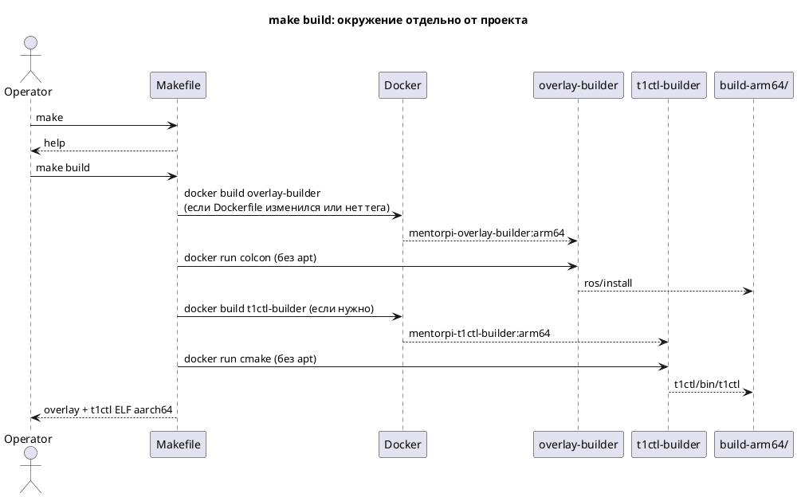

# SD023. Технический дизайн

## Системный дизайн

1. **D1.** На машине разработки два локальных builder-образа linux/arm64. Apt ставится только при сборке образа, не при каждой сборке кода. Рантайм-образ Pi `mentorpi-t1` (`docker/mentorpi-t1/Dockerfile`) не используется для кросс-сборки и не меняется.
   1. **D1.1.** `docker/overlay-builder/Dockerfile`: `FROM ros:humble`, пакеты как в прежнем `scripts/build-arm64.sh` (`python3-colcon-common-extensions`, `ros-humble-vision-msgs`, `ros-humble-cv-bridge`, `ros-humble-tf2-ros`, `ros-humble-tf2-geometry-msgs`, `libopencv-dev`). Distro OpenCV, не Deptrum `/usr/local` 4.10.
   2. **D1.2.** `docker/t1ctl-builder/Dockerfile`: `FROM debian:12`, `g++ cmake git make ca-certificates`.
   3. **D1.3.** Теги: `mentorpi-overlay-builder:arm64` и `mentorpi-t1ctl-builder:arm64`. Контекст `docker build` — только каталог Dockerfile, исходники репозитория не копируются в образ.
2. **D2.** Корневой `Makefile` — единственная точка входа. Совместим с `/usr/bin/make` на macOS (GNU Make 3.81): без `.ONESHELL`, без `!=`. `.DEFAULT_GOAL := help`. Сборка проекта — `docker run --rm --platform linux/arm64` с bind-mount репозитория; внутри нет `apt-get`. Инкремент colcon/cmake — в `build-arm64/`. Образ пересобирается, если изменился Dockerfile или локального тега нет.
3. **D3.** `make deploy` копирует overlay и `t1ctl` на Pi, unit/sudoers. Если контейнер `mentorpi-t1` есть: останавливает launch (`systemctl stop` → `t1-stop`), удаляет `install/` в контейнере и копирует новый, `docker restart mentorpi-t1`, затем `t1ctl restart`, чтобы ноды загрузили новый overlay. Не пересобирает image `mentorpi-t1`, не `docker rm MentorPi`. Нет артефактов I3 — ошибка «сначала `make build`». Нет контейнера — overlay остаётся в staging, restart не вызывается.
4. **D4.** `make provision` сохраняет поведение прежнего `scripts/provision-pi.sh`: при отсутствии staging вызывает deploy; на Pi собирает image `mentorpi-t1` из `docker/mentorpi-t1`; `FORCE_REBUILD=1` как раньше. Не удаляет контейнер `MentorPi`.
5. **D5.** `make mac-detect` и `make echo-detections` сохраняют поведение прежних `scripts/run-mac-person-detect.sh` и `scripts/echo-mac-detections.sh` (Darwin arm64, pixi, те же env).
6. **D6.** Операторские `scripts/build-arm64.sh`, `scripts/deploy-pi.sh`, `scripts/provision-pi.sh`, `scripts/run-mac-person-detect.sh`, `scripts/echo-mac-detections.sh` удалены. Длинные SSH/heredoc живут в `mk/*.sh` и вызываются только из рецептов Make. Сборка overlay/t1ctl — рецепты Makefile. Скрипты внутри пакетов (`src/mentorpi_bringup/scripts/t1-stop` и т.п.) не трогаем.
7. **D7.** Живые инструкции оператора переписаны на `make …`: README, AGENTS, ops SD002/SD005/SD010, `host/mac_person_detect/README.md`. Закрытые `docs/SD/*/tech.md` не переписываем. Версии пакетов робота и `t1ctl` не поднимаем. Агент не запускает сборку и деплой.

## Программные интерфейсы

### Make (точка входа оператора)

1. **I1.** Цели корня репозитория. Без аргументов — только help, сборки нет.
   1. **I1.1.** `help` — список целей.
   2. **I1.2.** `env`, `env-overlay`, `env-t1ctl` — сборка builder-образов.
   3. **I1.3.** `build` — overlay + t1ctl; `overlay` и `t1ctl` по отдельности.
   4. **I1.4.** `deploy`, `provision`; `provision` при пустом staging делает deploy.
   5. **I1.5.** `mac-detect`, `echo-detections`. Extra python args: `make mac-detect ARGS='...'`.
   6. **I1.6.** `clean` — `build-arm64/` (не docker images). `env-clean` — builder-теги.

### Docker images (локальные теги Mac)

2. **I2.** `mentorpi-overlay-builder:arm64`, `mentorpi-t1ctl-builder:arm64`. Не путать с Pi-тегом `mentorpi-t1`.

### Артефакты (контракт для deploy)

3. **I3.** `build-arm64/ros/install/setup.bash`, `build-arm64/t1ctl/bin/t1ctl` (ELF aarch64, не Mach-O). `--packages-up-to mentorpi_bringup mentorpi_platform mentorpi_calibration`.

### Переменные окружения

4. **I4.** `PI_HOST=pi@192.168.88.56`, `PI_PASSWORD`, `PI_STAGING`, `CONTAINER`, `FORCE_REBUILD`; для Mac-детекта `WEIGHTS`, `IMAGE_TOPIC`, `CONFIDENCE_THRESHOLD`, `ROS_DOMAIN_ID`. Пример: `PI_HOST=... make deploy`.

## Изменения в приложениях

### Builder Dockerfiles
**Пункты:** D1.1, D1.2, D1.3, I2

Зависимости больше не ставятся в одноразовом `docker run --rm`. Их запекаем в два тонких образа; исходники по-прежнему только mount.

1. Добавлены `docker/overlay-builder/Dockerfile` и `docker/t1ctl-builder/Dockerfile`.
2. `src/` в образ не копируется.
3. `docker/mentorpi-t1/Dockerfile` не меняется.

### Makefile и mk/
**Пункты:** D2, D3, D4, D5, D6, I1, I3, I4

Операторский CLI — Make; длинный SSH остаётся bash в `mk/`.

1. Корневой Makefile: help по умолчанию, phony-цели I1, пререквизиты образов, `docker run` без apt, проверка `file` для t1ctl.
2. `mk/deploy.sh`, `mk/provision.sh`, `mk/mac-detect.sh`, `mk/echo-detections.sh`.
3. Не публиковать Twist, не `docker rm MentorPi`, не собирать overlay на Pi.

### Операторские scripts/ и живые docs
**Пункты:** D6, D7

1. Удалены пять корневых `scripts/*.sh`.
2. Обновлены README, AGENTS, ops SD002/SD005/SD010, README mac_person_detect.
3. Скрипты в `src/` и закрытые tech.md не трогаем.

## ToDo

Порядок: сначала образы, затем Makefile ежедневной сборки, затем Pi/Mac операции, в конце удаление старых точек входа.

- [x] T1. Builder-образы overlay и t1ctl
  - **Реализует:** D1.1, D1.2, D1.3, I2
  - **Файлы:** `docker/overlay-builder/Dockerfile`, `docker/t1ctl-builder/Dockerfile`
  - **Что нужно сделать:** Вынести apt-списки из одноразового `docker run` в два Dockerfile. Overlay-builder — Humble + colcon и vision/tf/OpenCV distro. t1ctl-builder — Debian 12 и toolchain cmake. Контекст сборки — только каталог Dockerfile. Образ `docker/mentorpi-t1` и вендорский OpenCV 4.10 не использовать. Агент `docker build` не запускает.
  - **Критерии приёмки:**
    1. AC1. В overlay-builder есть те же пакеты, что ставил `scripts/build-arm64.sh` для ROS, без `apt-get` на этапе colcon.
    2. AC2. В t1ctl-builder есть g++/cmake/make/git, без apt на этапе cmake.
    3. AC3. `docker/mentorpi-t1/Dockerfile` без diff этой задачи.
  - **Проверка:** diff Dockerfiles против списка пакетов в прежнем `build-arm64.sh`; пользователь при желании `docker build --platform linux/arm64`.

- [x] T2. Makefile: help, env, overlay, t1ctl, build
  - **Реализует:** D2, I1.1, I1.2, I1.3, I1.6, I3
  - **Файлы:** `Makefile`
  - **Что нужно сделать:** Help — цель по умолчанию. `make build` собирает overlay и t1ctl через builder-образы, `make overlay` / `make t1ctl` — порознь. Перед `docker run` обеспечить образ (пересбор при новом Dockerfile или отсутствии тега). В контейнере только source ROS + colcon / cmake install в `build-arm64/`. Сохранить `--packages-up-to` и проверку ELF aarch64. `make clean` чистит `build-arm64/`, `make env-clean` — builder-теги. Совместимость с GNU Make 3.81.
  - **Критерии приёмки:**
    1. AC1. `make` печатает help и не стартует docker/colcon.
    2. AC2. Повторный `make build` при неизменных Dockerfile не делает `apt-get` внутри `docker run`.
    3. AC3. `make overlay` и `make t1ctl` работают независимо; `make build` делает оба.
    4. AC4. Артефакты I3 на месте; t1ctl — ELF aarch64, не Mach-O.
  - **Проверка:** пользователь `make`, затем `make build` дважды; `file build-arm64/t1ctl/bin/t1ctl`. Агент сборку не запускает.

- [x] T3. `make deploy`
  - **Реализует:** D3, I1.4, I3, I4
  - **Файлы:** `Makefile`, `mk/deploy.sh`
  - **Что нужно сделать:** Выложить overlay и `t1ctl` на Pi. Если контейнер `mentorpi-t1` есть: остановить launch (`t1-stop`), заменить `install/` в контейнере, `docker restart`, `t1ctl restart`, чтобы ROS взял новый overlay. Сообщения об отсутствии артефактов указывают на `make build`. Не `docker rm MentorPi`, image `mentorpi-t1` не пересобирать.
  - **Критерии приёмки:**
    1. AC1. `make deploy` при отсутствии I3 завершается ошибкой со ссылкой на `make build`.
    2. AC2. Overlay и `t1ctl` попадают на те же пути на Pi; при живом контейнере после deploy launch читает новый overlay (`docker restart` + `t1ctl restart`).
    3. AC3. Контейнер `MentorPi` не удаляется.
  - **Проверка:** чтение рецепта; пользователь на стенде `make overlay && make deploy` (или `make build && make deploy`). Агент деплой не запускает.

- [x] T4. `make provision`
  - **Реализует:** D4, I1.4, I4
  - **Файлы:** `Makefile`, `mk/provision.sh`
  - **Что нужно сделать:** Перенести `scripts/provision-pi.sh`, включая вызов deploy при пустом staging, remote `docker build` FROM образа `MentorPi`, `FORCE_REBUILD`, bind config, enable нашего юнита / disable `start_node`. Не `docker rm MentorPi`. Dockerfile Pi остаётся в `docker/mentorpi-t1/`.
  - **Критерии приёмки:**
    1. AC1. Нет overlay на Pi → provision делает deploy, затем как раньше.
    2. AC2. `FORCE_REBUILD=1 make provision` пересобирает image `mentorpi-t1` на Pi.
    3. AC3. Контейнер `MentorPi` не удаляется.
  - **Проверка:** чтение; пользователь provision на стенде. Агент не запускает.

- [x] T5. `make mac-detect` и `make echo-detections`
  - **Реализует:** D5, I1.5, I4
  - **Файлы:** `Makefile`, `mk/mac-detect.sh`, `mk/echo-detections.sh`
  - **Что нужно сделать:** Перенести два Mac-скрипта без смены env и pixi-команд. По-прежнему только Darwin arm64, не Docker linux/arm64.
  - **Критерии приёмки:**
    1. AC1. `make mac-detect` запускает тот же `person_detect.py` с теми же дефолтами/WEIGHTS.
    2. AC2. `make echo-detections` — тот же echo с FastDDS env.
    3. AC3. На не-Darwin `mac-detect` отказывается так же, как старый скрипт.
  - **Проверка:** diff с прежними скриптами; пользователь на Mac.

- [x] T6. Удалить операторские scripts/ и обновить живые docs
  - **Реализует:** D6, D7
  - **Файлы:** `scripts/build-arm64.sh`, `scripts/deploy-pi.sh`, `scripts/provision-pi.sh`, `scripts/run-mac-person-detect.sh`, `scripts/echo-mac-detections.sh`, `README.md`, `AGENTS.md`, `docs/SD/SD002/ops.md`, `docs/SD/SD010/ops.md`, `docs/SD/SD005/ops.md`, `host/mac_person_detect/README.md`
  - **Что нужно сделать:** Удалить пять корневых скриптов. В README/AGENTS/ops цепочка первого раза: `make build` → `make deploy` → `make provision`; обновления кода: `make build` и `make deploy`. В AGENTS явно: агент не запускает эти цели. Скрипты в `src/` и закрытые tech.md не трогать.
  - **Критерии приёмки:**
    1. AC1. В корне нет `scripts/build-arm64.sh` и остальных четырёх; `make help` — канон.
    2. AC2. README и AGENTS учат `make`, не `./scripts/build-arm64.sh`.
    3. AC3. `src/**/scripts/` без diff; закрытые `docs/SD/*/tech.md` без обязательного переписывания.
  - **Проверка:** `git ls-files scripts/`; grep живых docs на `scripts/build-arm64.sh`.

## Покрытие

| Пункт | Задачи |
|-------|--------|
| D1.1 | T1 |
| D1.2 | T1 |
| D1.3 | T1 |
| D2 | T2 |
| D3 | T3 |
| D4 | T4 |
| D5 | T5 |
| D6 | T6 |
| D7 | T6 |
| I1.1 | T2 |
| I1.2 | T2 |
| I1.3 | T2 |
| I1.4 | T3, T4 |
| I1.5 | T5 |
| I1.6 | T2 |
| I2 | T1 |
| I3 | T2, T3 |
| I4 | T3, T4, T5 |

Итог: пунктов 18, задач 6. Непокрытых пунктов: нет.

## Финальный QA (пользователь, T1–T6)

Предусловие: Docker с `linux/arm64` на машине разработки; для deploy/provision — сеть до Pi и `sshpass`. Агент сборку и деплой не запускает. Робот сам не едет.

### T1 — Builder-образы
1. Сравнить пакеты в `docker/overlay-builder/Dockerfile` с прежним apt-списком ROS (AC1).
2. Сравнить `docker/t1ctl-builder/Dockerfile` с прежним debian-списком (AC2).
3. `git diff docker/mentorpi-t1/Dockerfile` пустой (AC3).

### T2 — Makefile сборки
1. `make` — только help, без docker (AC1).
2. `make build` дважды; во втором `docker run` нет `apt-get` (AC2, AC3).
3. `file build-arm64/t1ctl/bin/t1ctl` — ELF aarch64 (AC4).

### T3 — deploy
1. Без `build-arm64/` — ошибка со ссылкой на `make build` (AC1).
2. После `make overlay` (или `make build`) — `make deploy`: контейнер перезапущен, `t1ctl status` показывает demo, ноды с новым overlay (AC2).
3. `docker ps -a` — контейнер `MentorPi` на месте (AC3).

### T4 — provision
1. При пустом staging на Pi — вызывает deploy (AC1).
2. `FORCE_REBUILD=1 make provision` (AC2, AC3).

### T5 — Mac-детект
1. `make mac-detect` / `make echo-detections` на Darwin arm64 (AC1, AC2).
2. На не-Darwin `mac-detect` отказывается (AC3).

### T6 — docs и удаление scripts
1. Нет пяти корневых `scripts/*.sh`; `make help` (AC1).
2. README и AGENTS — `make build` / `make deploy` / `make provision` (AC2).
3. `src/**/scripts/` без лишнего diff (AC3).
