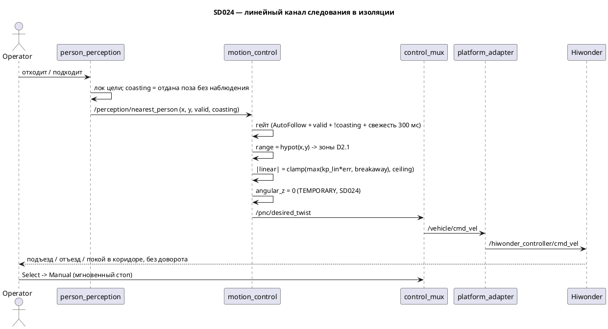

# SD024. Технический дизайн — линейный канал следования: подъезд и отъезд по дистанции

Дизайн UI: skipped (решение оператора). Каталог: F11. BA: [solution.md](solution.md).
Протокол замера: [measure.md](measure.md) (заполняется на T5).

Развилки, закрытые оператором на фазе SA: коридор задаётся `standoff` с раздельными near/far
дедбендами; линейному каналу нужна страгивающая команда (замер на стенде); потолок скорости —
отдельный параметр `max_linear_follow`; окно свежести цели понижается до ~300 мс; возраст позы
ограничивается `points_timeout_ms` 700 мс; коуст лока получает **явный признак в контракте**
`NearestPerson`, и канал следования по коусту не едет.

Отдельно: инвариант «нет человека — не едем», на который опирается негативный сценарий №2 BA, в
коде **не выполнялся** — лок коустит последнюю позу и держит `valid = true` ещё `target_lost_s`
(2 с). В [SD022](../SD022/tech.md) это было безопасно (робот не ехал), в SD024 — нет. Признак
коуста закрывает разрыв, поэтому BA править не нужно: сценарий №2 начинает выполняться
по-настоящему. Цена — правка msg и кода перцепшна, это осознанное расширение объёма по решению
оператора.

## Системный дизайн

1. **D1.** Патч SD022 (`D7`) снимается и заменяется **зеркальным** временным выключателем.
   `compute_follow_twist` снова считает линейный канал; константа `kSd022MinBreakawayAngular`
   удаляется из [`follow_control.hpp`](../../src/motion_control/include/motion_control/follow_control.hpp)
   вместе с патчем. Вместо неё в законе появляется `angular_z ≡ 0` с пометкой `TEMPORARY, SD024`.
   Угловые параметры (`kp_ang`, `ang_deadband`, `max_angular`, `track_half_sum`) остаются в
   `FollowControlParams` нетронутыми — так контракт ноды не ломается и ревёрт в следующем эпике
   сводится к возврату углового закона SD020 `D2.2`/`D2.3`. Гейт режима и свежести в
   [`motion_control.cpp`](../../src/motion_control/src/motion_control.cpp)
   ([SD020](../SD020/tech.md) `D3`/`D4`) не трогаем.

2. **D2.** Закон дистанции — та же чистая функция без ROS. Вход `x, y` в базе робота,
   `range = hypot(x, y)`.
   1. **D2.1. Зоны.** Границы — параметры, не числа в коде:

      | Условие | `linear_x` |
      |---------|-----------|
      | `range < stop_range` | `0` — жёсткий стоп, отъезд здесь **не применяется** (негативный сценарий №1 BA) |
      | `stop_range ≤ range < standoff − dist_deadband_near` | отъезд, `< 0` |
      | `standoff − dist_deadband_near ≤ range ≤ standoff + dist_deadband_far` | `0` — покой в коридоре |
      | `range > standoff + dist_deadband_far` | подъезд, `> 0` |

      `stop_range` не имеет смысла ниже нижней границы глубины Aurora (0.3 м): ближе камера
      человека не измеряет, `nearest.valid` гаснет и робот встаёт и так. Это ограничение стенда,
      а не SLA.
   2. **D2.2. Величина и знак.** `err = range − standoff`, `raw = kp_lin · err`. Вне коридора
      `mag = min(max(|raw|, min_breakaway_linear), ceiling)`, где
      `ceiling = min(max_linear_follow, max_linear)`, и `linear_x = copysign(mag, err)`. Потолок
      побеждает страгивание — ровно как `max_angular` побеждал breakaway в SD022: если потолок
      ниже страгивающей команды, выдаётся потолок, а придумывать команду выше операторского
      лимита не наше дело.
   3. **D2.3. Сторона не обрабатывается.** Ось `y` входит в линейный канал только через `range`
      (позитивный сценарий 5 BA: человек смещается вбок на той же дистанции — робот стоит). Цель
      позади даёт положительный `range`, отдельного правила для задней полусферы нет: поворота в
      этом SD нет вообще.
   4. **D2.4. Инварианты закона** (проверяются тестом): `|linear_x| ≤ ceiling` при любом входе;
      `angular_z ≡ 0` при любом пеленге; в коридоре и ниже стоп-порога — ровно ноль;
      `range = 0` попадает под стоп-порог.

3. **D3.** Параметры и валидация на старте ноды. Новые параметры: `dist_deadband_near`,
   `stop_range`, `min_breakaway_linear`, `max_linear_follow`; существующий `dist_deadband`
   переименовывается в `dist_deadband_far` (симметрия с ближним дедбендом; единственный, кто его
   задаёт, — `stage1.launch.py`). Все проходят существующий `require_positive` (`> 0`, иначе
   исключение на старте). Дополнительно нода проверяет два соотношения и падает на старте, если
   они нарушены — детерминированный отказ вместо тихо вывернутой зоны:
   `stop_range < standoff − dist_deadband_near` и `max_linear_follow ≤ max_linear`.

4. **D4.** Свежесть цели: `nearest_timeout_ms` 1000 → **300** (launch). Он ограничивает **приход
   сообщения**, а не возраст позы: `person_perception` публикует `/perception/nearest_person` на
   каждое сообщение детекций с Mac (YOLO по RGB ~10 Гц) и по таймеру 10 Гц, когда детекций нет
   ([`person_perception.cpp`](../../src/mentorpi_perception/src/person_perception.cpp), `on_timer`).
   То есть 300 мс — это «детекция пропала больше чем на два кадра → стоп», и на движение при живой
   детекции окно не влияет.

5. **D5.** Возраст позы ограничивается в перцепшне. Геометрия считается по **последнему** облаку,
   поэтому при глубине 2.15 Гц (период 465 мс, хвост стенда из SD022) поза в свежем сообщении
   может быть до 465 мс старой, а нынешний `points_timeout_ms = 1000` допускает и двухкадровую.
   Ставим **700 мс** — выше наблюдаемого периода с запасом, но вдвое жёстче секунды. Меняется
   только значение в [`person_perception.yaml`](../../src/mentorpi_perception/config/person_perception.yaml);
   код перцепшна, контракт msg и диагностика слоёв восприятия в объём не входят.

6. **D6.** Признак коуста в контракте цели. Сейчас при пропаже цели `update_person_target_lock`
   держит `nearest.valid = true` ещё `target_lost_s = 2.0 с`, отдавая последнюю измеренную позу
   ([`person_target_lock.hpp`](../../src/mentorpi_perception/include/mentorpi_perception/person_target_lock.hpp),
   ветка D3.3), а отличить коуст от измерения потребитель не может — в `NearestPerson` нет ни
   флага, ни stamp. Для линейного канала это до двух секунд движения по позе-призраку, поэтому
   коуст становится **наблюдаемым**:
   1. **D6.1.** `PersonTargetLockUpdateResult.nearest` (структура `NearestPersonResult`) получает
      поле `coasting`. Оно `true` ровно в одной ветке — D3.3, где лок отдаёт `state.locked` без
      наблюдения; во всех остальных ветках (первый захват, локнутый виден, перезахват после потери)
      — `false`. Логика самого лока, `target_lost_s`, гистерезис переключения и список `persons` не
      меняются: лок по-прежнему нужен F10 и переживает короткие перекрытия.
   2. **D6.2.** `mentorpi_msgs/NearestPerson` получает поле `bool coasting`, перцепшн копирует его
      из результата лока. Поле добавляется, существующие не трогаются и не переупорядочиваются.
   3. **D6.3.** Гейт `motion_control` расширяется до `AUTO_FOLLOW && valid && !coasting &&
      свежесть`. Робот встаёт на первом же отсчёте без наблюдения цели — то есть в пределах одного
      кадра детекции, а не через 2 с. Это и есть «нет человека — не едем» из негативного сценария
      №2 BA; править BA не требуется.
   4. **D6.4.** `mission_control` (F10) поле не читает и не меняется: у статуса следования своя
      логика, ужесточать её в этом SD не в объёме.

7. **D7.** Что не меняется: контракт `/pnc/desired_twist`; `control_mux`, `platform_adapter`,
   `stub_graph`, `odom_publisher`, `t1ctl`, пульт; гейт режима и `stop_request`; `target_lost_s` и
   алгоритм лока. Мгновенный стоп с пульта — существующий механизм: `Select` шлёт
   `/control/mode_toggle`, режим уходит `AUTO_FOLLOW → MANUAL`, и `gate_mux` отдаёт нулевой стик
   вместо канала следования; плюс `t1ctl mode forbid`. Ничего нового для стопа не пишем.

### As-built (стенд `pi@192.168.2.2`, унаследовано)

| Величина | Значение | Откуда |
|----------|----------|--------|
| путевая `max_linear` | `0.37` м/с | SD020, Замер 1 |
| `max_angular` | `2.0` рад/с | SD020 |
| `track_half_sum` | `0.1407` м | SD020 |
| пультовая анти-мёртвая зона по линейной | `linear_min = 0.10` | SD004, `stage1.launch.py` |
| страгивающая угловая | `0.16` рад/с | SD022, [measure.md](../SD022/measure.md) |
| глубина `/aurora/points2` на стенде | **2.15 Гц** вместо штатных 10 | SD022, штатная батарея |
| рабочий диапазон глубины | 0.3–3 м | SD012 |
| `min_breakaway_linear` | `0.10` м/с | SD024 T5: стартовое I3, свип IMU не проводился |
| `dist_deadband_near` | `0.12` м | SD024 T5: стартовое I3, следование уже работает |
| `dist_deadband_far` | `0.05` м | SD024 T5: стартовое I3, следование уже работает |
| `stop_range` | `0.30` м | SD024 T5: стартовое I3, граница глубины Aurora |
| `max_linear_follow` | `0.20` м/с | SD024 T5, [measure.md](measure.md): оператор, «чуть быстрее» (было 0.15) |

Четыре инструментальных прогона T5 (стик+IMU) **не проводились** — решение оператора 2026-09-06.



## Программные интерфейсы

### C++ — чистая функция закона управления

1. **I1.** `compute_follow_twist(double x, double y, const FollowControlParams&) → Twist2d` —
   сигнатура не меняется, меняется тело (D2). Константа `kSd022MinBreakawayAngular` из заголовка
   **удаляется**.
2. **I2.** `FollowControlParams` — четыре новых поля и одно переименование:

   ```cpp
   struct FollowControlParams {
     double standoff;             // м, целевая дистанция
     double max_linear;           // м/с, путевой потолок платформы
     double max_linear_follow;    // м/с, НОВОЕ: пониженный потолок канала следования
     double max_angular;          // рад/с, не используется, пока угловой выключен
     double kp_lin;               // 1/с
     double kp_ang;               // 1/с, не используется, пока угловой выключен
     double dist_deadband_far;    // м, БЫЛО dist_deadband: полукоридор в сторону подъезда
     double dist_deadband_near;   // м, НОВОЕ: полукоридор в сторону отъезда
     double stop_range;           // м, НОВОЕ: жёсткий стоп-порог
     double min_breakaway_linear; // м/с, НОВОЕ: страгивающая линейная команда
     double ang_deadband;         // рад, не используется, пока угловой выключен
     double track_half_sum;       // м, не используется, пока угловой выключен
   };
   ```

### ROS 2 — нода `motion_control`

3. **I3.** Параметры ноды (все `> 0`; плюс соотношения D3). Стартовые значения — не SLA, уточняются
   замером T5:

   | Параметр | Было | Стало | Комментарий |
   |----------|------|-------|-------------|
   | `standoff` | `0.5` | `0.5` | без изменений |
   | `max_linear` | `0.37` | `0.37` | путевой потолок платформы, не трогаем |
   | `max_linear_follow` | — | `0.15` | новый, временно пониженный потолок SD024 |
   | `kp_lin` | `0.8` | `0.8` | без изменений |
   | `dist_deadband` → `dist_deadband_far` | `0.05` | `0.05` | переименование |
   | `dist_deadband_near` | — | `0.12` | новый |
   | `stop_range` | — | `0.30` | новый, не ниже границы глубины |
   | `min_breakaway_linear` | — | `0.10` | новый, старт от пультового `linear_min` |
   | `nearest_timeout_ms` | `1000` | `300` | D4 |
   | `max_angular`, `kp_ang`, `ang_deadband`, `track_half_sum`, `rate_hz` | — | без изменений | угловой канал выключен, параметры остаются |

4. **I4.** `person_perception.yaml`: `points_timeout_ms` `1000` → `700` (D5). Остальные ключи файла
   не трогаем.

### ROS 2 — контракт цели

5. **I5.** [`mentorpi_msgs/msg/NearestPerson.msg`](../../src/mentorpi_msgs/msg/NearestPerson.msg) —
   новое поле, существующие без изменений:

   ```
   bool valid
   bool coasting            # НОВОЕ: поза отдана локом без наблюдения (D6.1)
   PersonHypothesis person
   ```

6. **I6.** `NearestPersonResult` в
   [`person_target_lock.hpp`](../../src/mentorpi_perception/include/mentorpi_perception/person_target_lock.hpp)
   — новое поле `bool coasting{false}`; `update_person_target_lock` ставит его `true` только в
   ветке D3.3. Сигнатура функции, `PersonTargetLockConfig` и `PersonTargetLockState` не меняются.

7. **I7.** Версии: `motion_control` `0.2.0` → **`0.3.0`** (новый закон, новые параметры, новый гейт),
   `mentorpi_bringup` `0.3.0` → **`0.4.0`** (изменился набор параметров ноды), `mentorpi_msgs`
   `1.1.0` → **`1.2.0`** (новое поле в msg), `mentorpi_perception` `0.4.0` → **`0.5.0`** (новое
   поведение лока и новый допуск возраста облака).

## Изменения в приложениях

### `mentorpi_msgs`

**Пункты:** D6.2, I5, I7

Пакет держит контракты между слоями. Сейчас `NearestPerson` сообщает только «цель есть/нет», из-за
чего потребитель не отличает измеренную позу от коустящей. Добавляем один булев признак — это
единственное изменение контракта в SD.

1. `bool coasting` в `NearestPerson.msg` (I5), версия `1.2.0`.
2. Остальные msg и порядок существующих полей не трогаем; новых сообщений и сервисов не заводим.

### `mentorpi_perception`

**Пункты:** D5, D6.1, D6.2, I4, I6, I7

Перцепшн уже отдаёт `x, y` в базе робота и гасит `valid` по устаревшему облаку; правки касаются
только честности отдаваемой позы. Первая — лок перестаёт молча выдавать коуст за измерение: в
результате появляется признак, который нода копирует в msg. Вторая — сужается допуск на возраст
облака: при 2.15 Гц глубины секунда слишком щедра для канала, который теперь двигает робота.
Геометрия, проекция кластера и выбор ближайшего не меняются.

1. `person_target_lock.hpp`: поле `coasting` в `NearestPersonResult`, установка `true` в ветке D3.3
   и явный `false` в остальных ветках.
2. `person_perception.cpp`: копирование `lock_result.nearest.coasting` в поле msg в
   `apply_lock_and_publish`.
3. `test_person_target_lock.cpp`: кейсы на признак — коуст, возврат цели, перезахват.
4. `person_perception.yaml`: `points_timeout_ms` `700` с комментарием про 2.15 Гц.
5. Версия `0.5.0`. Не трогаем: `target_lost_s`, `switch_margin_m`, `challenger_dwell_s`, логику
   гистерезиса, `nearest_cluster_in_bbox`, публикацию `/perception/persons`.

### `motion_control`

**Пункты:** D1, D2.1, D2.2, D2.3, D2.4, D3, D6.3, I1, I2, I3, I7

Пакет держит закон следования: header-only чистая функция плюс тонкая нода с гейтом и таймером.
Сейчас функция обрезана патчем SD022 до одного углового канала. Архитектура не меняется — меняется
тело закона (линейный канал возвращается, угловой временно глушится) и набор параметров: у
дистанции появляются раздельные границы коридора, стоп-порог, страгивание и собственный потолок.
Нода получает на них валидацию, включая два соотношения между параметрами.

1. `follow_control.hpp`: четыре новых поля в `FollowControlParams`, `dist_deadband` →
   `dist_deadband_far`, удаление `kSd022MinBreakawayAngular`, новое тело `compute_follow_twist` по
   D2.1–D2.4 с комментарием `TEMPORARY, SD024` у `angular_z = 0`.
2. `test_follow_control.cpp` переписывается под новый закон: зоны, знак, страгивание, потолок,
   инварианты, `angular_z ≡ 0`.
3. `motion_control.cpp`: объявление и чтение новых параметров через существующий
   `require_positive`, две проверки соотношений с исключением на старте, лог стартовой строки с
   новыми числами, гейт расширяется признаком `!coasting` (D6.3).
4. Не трогаем: QoS, имена топиков, `static_assert` режимов, отсутствие подписки на `/odom_raw` и
   публикаций в `/control/*`; остальные условия гейта — как в SD020.

### `mentorpi_bringup`

**Пункты:** D4, I3, I7

Launch этапа 1 — единственное место, где заданы параметры `motion_control`. Здесь задаются новые
границы коридора и пониженный потолок, и здесь же ужимается окно свежести цели.

1. Блок `motion_control` в [`stage1.launch.py`](../../src/mentorpi_bringup/launch/stage1.launch.py):
   новые параметры по I3, `dist_deadband` → `dist_deadband_far`, `nearest_timeout_ms` `300`.
2. Комментарий у `max_linear_follow` и `nearest_timeout_ms`: значения временные, SD024, снимаются
   в следующем эпике вместе с выключателем углового.
3. Версия `0.4.0`. Ноды `pad_teleop`, `control_state`, `control_mux`, `platform_adapter`,
   `mission_control` в launch не трогаем.

### Документы

**Пункты:** D6.4, D7

Операторский протокол замера, без которого числа коридора и страгивания взять неоткуда, плюс
фиксация двух фактов: патч SD022 снят, а инвариант «нет человека — не едем» был не выполнен и
закрывается признаком коуста. `solution.md` править не требуется — с D6.3 негативный сценарий №2
выполняется как написан.

1. Новый [measure.md](measure.md) — постановка замера на стенде (страгивание, коридор, стоп-порог,
   потолок), по образцу [SD022/measure.md](../SD022/measure.md).
2. `README.md`: строка про линейный канал, временно выключенный поворот и признак `coasting` в
   контракте цели.
3. `STATUS.md`: `sa: approved`, `phase: implementation`, заметки про снятый патч SD022, про
   найденный разрыв с коустом и решение оператора закрыть его признаком в msg.

## ToDo

Порядок: сначала ядро закона с тестами (проверяется без стенда), затем контракт цели с признаком
коуста (от него зависит гейт ноды), затем нода и launch, затем замер на стенде и подстановка снятых
чисел, в конце документы. Робота в движение приводит только оператор; сборку и деплой агент не
запускает.

- [x] T1. Линейный закон в `follow_control.hpp` и его тесты
  - **Реализует:** D1, D2.1, D2.2, D2.3, D2.4, I1, I2
  - **Файлы:** [`src/motion_control/include/motion_control/follow_control.hpp`](../../src/motion_control/include/motion_control/follow_control.hpp), [`src/motion_control/test/test_follow_control.cpp`](../../src/motion_control/test/test_follow_control.cpp)
  - **Что нужно сделать:** Снять патч SD022 из `compute_follow_twist`: удалить константу
    `kSd022MinBreakawayAngular`, вернуть расчёт линейного канала и заглушить угловой — `angular_z`
    всегда ноль с комментарием `TEMPORARY, SD024`, снимается в следующем эпике вместе с этим
    патчем. Линейный канал считается по D2.1–D2.2: `range = hypot(x, y)`, зоны стоп-порога,
    отъезда, коридора покоя и подъезда; величина `min(max(|kp_lin·(range − standoff)|,
    min_breakaway_linear), min(max_linear_follow, max_linear))` со знаком ошибки дистанции. В
    `FollowControlParams` добавить `max_linear_follow`, `dist_deadband_near`, `stop_range`,
    `min_breakaway_linear` и переименовать `dist_deadband` в `dist_deadband_far`; угловые поля
    оставить на месте нетронутыми, чтобы ревёрт в следующем эпике сводился к возврату закона SD020.
    Функция остаётся header-only и без ROS, значения по умолчанию в неё не зашиваются — их держит
    нода (I3).

    Тест переписывается под новый закон целиком: старые кейсы «linear_x всегда 0» уходят вместе с
    патчем. Фикстура параметров повторяет I3. Ноду и launch в этой задаче не трогать.
  - **Критерии приёмки:**
    1. AC1. Цель дальше `standoff + dist_deadband_far` → `linear_x > 0`; цель в зоне
       `[stop_range, standoff − dist_deadband_near)` → `linear_x < 0`; цель внутри коридора →
       `linear_x = 0`.
    2. AC2. `range < stop_range` (включая `range = 0`) → `linear_x = 0`: отъезд ниже стоп-порога
       не применяется.
    3. AC3. Вне коридора `|linear_x| ≥ min_breakaway_linear`, и при любом входе
       `|linear_x| ≤ min(max_linear_follow, max_linear)`; при `max_linear_follow` ниже
       страгивающей команда равна потолку, а не страгивающей.
    4. AC4. `angular_z = 0` при любом пеленге, включая `±π` и цель сбоку на дистанции коридора.
    5. AC5. В заголовке нет `kSd022MinBreakawayAngular`; тест не подключает rclcpp и зарегистрирован
       через `add_test`.
  - **Проверка:** чтение заголовка; `colcon test --packages-select motion_control --base-paths src`
    (запускает пользователь в arm64-сборщике), вывод `test_follow_control: ok`.

- [x] T2. Признак коуста в контракте цели и допуск возраста облака
  - **Реализует:** D5, D6.1, D6.2, I4, I5, I6
  - **Файлы:** [`src/mentorpi_msgs/msg/NearestPerson.msg`](../../src/mentorpi_msgs/msg/NearestPerson.msg), `src/mentorpi_msgs/package.xml`, [`src/mentorpi_perception/include/mentorpi_perception/person_target_lock.hpp`](../../src/mentorpi_perception/include/mentorpi_perception/person_target_lock.hpp), [`src/mentorpi_perception/src/person_perception.cpp`](../../src/mentorpi_perception/src/person_perception.cpp), [`src/mentorpi_perception/test/test_person_target_lock.cpp`](../../src/mentorpi_perception/test/test_person_target_lock.cpp), [`src/mentorpi_perception/config/person_perception.yaml`](../../src/mentorpi_perception/config/person_perception.yaml), `src/mentorpi_perception/package.xml`
  - **Что нужно сделать:** Сделать коуст лока наблюдаемым для потребителя. В `NearestPersonResult`
    добавить `bool coasting{false}`; в `update_person_target_lock` поставить его `true` ровно в
    ветке D3.3 (локнутая цель не найдена среди наблюдений, но `absent_s < target_lost_s` — отдаётся
    `state.locked`) и явно `false` во всех остальных ветках, включая первый захват и перезахват
    после потери. Логику лока, `target_lost_s`, гистерезис переключения и содержимое
    `result.persons` (вместе с `append_coast_if_needed`) не менять — лок по-прежнему переживает
    короткие перекрытия ради F10. В `NearestPerson.msg` добавить `bool coasting` после `valid`, в
    `apply_lock_and_publish` копировать признак из результата лока в сообщение. Тесты лока
    дополнить кейсами: измеренная цель → `coasting = false`; цель пропала, коуст активен →
    `coasting = true` при `valid = true`; цель вернулась → снова `false`; коуст исчерпан и цели нет
    → `valid = false`.

    Второй, независимый кусок той же задачи — допуск на возраст облака: `points_timeout_ms` в
    `person_perception.yaml` с `1000` на `700` с комментарием (наблюдаемые 2.15 Гц глубины, период
    465 мс; секунда допускает позу двухкадровой давности, а по ней теперь едет робот). Оба куска
    трогают один пакет и обе части — про честность отдаваемой позы, поэтому идут вместе. Версии:
    `mentorpi_msgs` `1.2.0`, `mentorpi_perception` `0.5.0`. Геометрию, проекцию кластера, выбор
    ближайшего и `mission_control` не трогаем.
  - **Критерии приёмки:**
    1. AC1. `ros2 interface show mentorpi_msgs/msg/NearestPerson` содержит `bool coasting`;
       существующие поля и их порядок сохранены.
    2. AC2. Тест лока: пока цель наблюдается — `coasting = false`; в коусте — `valid = true` и
       `coasting = true`; после возврата цели — снова `false`.
    3. AC3. По исчерпании `target_lost_s` без наблюдений `valid = false` (поведение лока не
       изменилось), `target_lost_s` в yaml остался `2.0`.
    4. AC4. `points_timeout_ms: 700` с комментарием; прочие ключи yaml не изменились.
    5. AC5. `git diff` не показывает правок в геометрии перцепшна (`person_geometry`), в
       `mission_control` и в других msg.
  - **Проверка:** `colcon test --packages-select mentorpi_perception --base-paths src` (запускает
    пользователь); после деплоя `ros2 topic echo /perception/nearest_person` — при уходе человека из
    кадра видно `valid: true, coasting: true`, затем `valid: false`.

- [x] T3. Параметры, валидация и гейт коуста в ноде `motion_control`
  - **Реализует:** D3, D6.3
  - **Файлы:** [`src/motion_control/src/motion_control.cpp`](../../src/motion_control/src/motion_control.cpp), `src/motion_control/package.xml`
  - **Что нужно сделать:** Объявить и прочитать новые параметры (`max_linear_follow`,
    `dist_deadband_near`, `stop_range`, `min_breakaway_linear`) через существующий
    `require_positive`, переименовать чтение `dist_deadband` в `dist_deadband_far`. Добавить две
    проверки соотношений сразу после чтения: `stop_range < standoff − dist_deadband_near` и
    `max_linear_follow ≤ max_linear`; нарушение — `std::invalid_argument` с внятным текстом, как у
    остальных проверок ноды. В стартовый лог добавить `stop_range`, `max_linear_follow` и
    `nearest_timeout_ms`, чтобы на стенде было видно, с какими границами поднялась нода.

    Второе изменение — гейт: к условиям SD020 (`AUTO_FOLLOW` + `valid` + свежесть) добавляется
    `!coasting` из нового поля msg (T2). Признак запоминается в `on_nearest` рядом с
    `nearest_valid_`; на коусте нода публикует нулевой Twist, режим не меняет и `stop_request` не
    ставит — как и в любом другом случае непрохождения гейта. QoS, имена топиков, таймер и
    `static_assert` режимов не трогаются. Версия пакета `0.3.0`.
  - **Критерии приёмки:**
    1. AC1. Нода стартует со значениями I3 и печатает в лог `standoff`, `stop_range`,
       `max_linear_follow`, `nearest_timeout_ms`.
    2. AC2. Любой из новых параметров `≤ 0` → нода падает на старте с сообщением об этом параметре.
    3. AC3. `stop_range ≥ standoff − dist_deadband_near` либо `max_linear_follow > max_linear` →
       нода падает на старте с сообщением про соотношение, а не поднимается с вывернутой зоной.
    4. AC4. `nearest.coasting = true` при `valid = true` и свежем сообщении → на
       `/pnc/desired_twist` нули.
    5. AC5. В ноде не появилось публикаций в `/control/*`, подписки на `/odom_raw` и вызова
       `SetControlMode`; остальные условия гейта прежние.
  - **Проверка:** чтение `motion_control.cpp`; после деплоя `ros2 param list /motion_control` и
    стартовый лог юнита; запуск с заведомо плохим параметром через `ros2 run ... --ros-args -p`;
    уход человека из кадра при `AutoFollow` — `echo /pnc/desired_twist` даёт нули одновременно с
    `coasting: true`.

- [x] T4. Launch: границы коридора, пониженный потолок, окно свежести
  - **Реализует:** D4, I3, I7
  - **Файлы:** [`src/mentorpi_bringup/launch/stage1.launch.py`](../../src/mentorpi_bringup/launch/stage1.launch.py), `src/mentorpi_bringup/package.xml`
  - **Что нужно сделать:** В блоке параметров `motion_control` заменить `dist_deadband` на
    `dist_deadband_far` и добавить `dist_deadband_near`, `stop_range`, `min_breakaway_linear`,
    `max_linear_follow` со стартовыми значениями I3; `nearest_timeout_ms` понизить с `1000` до
    `300`. Рядом с `max_linear_follow` и `nearest_timeout_ms` — комментарий, что это временные
    значения SD024 и что путевой `max_linear = 0.37` остаётся физическим потолком платформы.
    В комментарии к `nearest_timeout_ms` зафиксировать, что окно меряет приход сообщения (детекции
    с Mac ~10 Гц), а не возраст позы, — иначе следующий читатель решит, что оно ограничивает
    устаревание облака.

    Числа здесь стартовые: после T5 они заменяются снятыми на стенде. Другие ноды launch не
    трогаем, версия bringup `0.4.0`.
  - **Критерии приёмки:**
    1. AC1. В `stage1.launch.py` у `motion_control` присутствуют все параметры I3 с указанными
       значениями, `dist_deadband` больше не упоминается.
    2. AC2. `nearest_timeout_ms` равен `300` и снабжён комментарием про смысл окна.
    3. AC3. `package.xml` bringup — `0.4.0`; блоки `pad_teleop`, `control_state`, `control_mux`,
       `platform_adapter`, `mission_control` не изменились.
  - **Проверка:** `grep -n "motion_control" -A 20 src/mentorpi_bringup/launch/stage1.launch.py`;
    `git diff src/mentorpi_control` пустой; после деплоя `ros2 param get /motion_control stop_range`.

- [x] T5. Замер на стенде: страгивание, коридор, стоп-порог, потолок
  - **Реализует:** D2.1 (числа границ), D3 (числа параметров)
  - **Файлы:** [measure.md](measure.md), [`src/mentorpi_bringup/launch/stage1.launch.py`](../../src/mentorpi_bringup/launch/stage1.launch.py)
  - **Что нужно сделать:** Написать операторский протокол замера по образцу
    [SD022/measure.md](../SD022/measure.md): безопасность (охран F12/F13 нет, свободный сектор,
    оператор у пульта, `t1ctl mode forbid` под рукой, робота двигает только оператор),
    унаследованные границы железа таблицей, и четыре прогона — (1) свип страгивающей линейной: с
    какой команды траки едут, а не гудят; (2) коридор: при каких `dist_deadband_near` /
    `dist_deadband_far` робот не «дышит» на границе при глубине 2.15 Гц; (3) стоп-порог: с какой
    дальности перцепшн ещё отдаёт валидную цель и где ставить `stop_range`; (4) потолок: какой
    `max_linear_follow` оператор считает безопасным на площадке. Для каждого прогона — что снимать
    (`ros2 topic echo /perception/nearest_person`, `/pnc/desired_twist`, `/vehicle/cmd_vel`, вердикт
    оператора) и куда записывать результат.

    После прогона оператора снятые числа переносятся из `measure.md` в `stage1.launch.py` (I3), а в
    `### As-built` этого документа добавляется строка про происхождение каждого числа. Агент замер
    не проводит и робота не двигает: он готовит документ и вносит числа по итогам.
  - **Критерии приёмки:**
    1. AC1. `measure.md` описывает четыре прогона, для каждого — постановка, что снимать, куда
       записать; ни одного числа «из головы» в документе нет.
    2. AC2. В `measure.md` есть раздел безопасности со ссылкой на отсутствие F12/F13 и на
       мгновенный стоп с пульта.
    3. AC3. После прогона значения `min_breakaway_linear`, `dist_deadband_near`,
       `dist_deadband_far`, `stop_range`, `max_linear_follow` в launch совпадают со снятыми в
       `measure.md`, и в `### As-built` появилось их происхождение.
  - **Проверка:** чтение `measure.md`; прогон на стенде выполняет оператор; сверка чисел
    `measure.md` ↔ `stage1.launch.py`.

- [x] T6. Документы: README и STATUS
  - **Реализует:** D6.4, D7
  - **Файлы:** [`README.md`](../../README.md), [STATUS.md](STATUS.md)
  - **Что нужно сделать:** В `README.md` описать поведение после SD024: в AutoFollow робот держит
    дистанцию (подъезд, отъезд, покой в коридоре), поворот временно выключен, патч SD022 снят, а в
    контракте `/perception/nearest_person` появился признак `coasting`, по которому канал следования
    не едет. Остальные разделы README не переписывать.

    В `STATUS.md` — `sa: approved`, `phase: implementation` и заметки: инвариант «нет человека — не
    едем» в коде не выполнялся (лок коустил позу до `target_lost_s = 2 с` при `valid = true`,
    `person_target_lock.hpp`), решение оператора — закрыть разрыв признаком в msg, а не правкой BA;
    патч SD022 (`D7`, `kSd022MinBreakawayAngular`) снят и заменён временным выключателем углового
    канала, оба выключателя снимаются в следующем эпике. `solution.md` править не требуется:
    негативный сценарий №2 выполняется как написан.
  - **Критерии приёмки:**
    1. AC1. README описывает дистанцию без поворота и признак `coasting`, не противореча остальным
       разделам про F11.
    2. AC2. `STATUS.md` содержит `sa: approved`, `phase: implementation` и обе заметки (коуст,
       снятие патча SD022).
    3. AC3. `docs/SD/SD024/solution.md` не изменён (`git diff` по файлу пустой).
  - **Проверка:** чтение README и STATUS; `git diff docs/SD/SD024/solution.md` — пусто.

## Покрытие

| Пункт | Задачи |
|-------|--------|
| D1 | T1 |
| D2.1 | T1, T5 |
| D2.2 | T1 |
| D2.3 | T1 |
| D2.4 | T1 |
| D3 | T3, T5 |
| D4 | T4 |
| D5 | T2 |
| D6.1 | T2 |
| D6.2 | T2 |
| D6.3 | T3 |
| D6.4 | T6 |
| D7 | T6 |
| I1 | T1 |
| I2 | T1 |
| I3 | T4 |
| I4 | T2 |
| I5 | T2 |
| I6 | T2 |
| I7 | T2, T3, T4 |

Итог: пунктов 20 (D1, D2.1–D2.4, D3–D5, D6.1–D6.4, D7, I1–I7), задач 6. Непокрытых пунктов: нет.

## Финальный QA (пользователь, T1–T6)

Собрать overlay (`make build`) и задеплоить (`make deploy`) — агент сборку и деплой не запускает.
Прогоны только на подготовленной площадке со свободным сектором: охран столкновений F12/F13 нет,
робот видит только человека-цель. Робота в движение приводит исключительно оператор, пульт в руках,
мгновенный стоп — `Select` (переход в Manual) или `t1ctl mode forbid`.

### T1 — закон
1. `colcon test --packages-select motion_control --base-paths src` → `test_follow_control: ok`
   (AC1–AC5)
2. Чтение заголовка: `kSd022MinBreakawayAngular` отсутствует, у `angular_z = 0` стоит пометка
   `TEMPORARY, SD024` (AC4, AC5)

### T2 — признак коуста и допуск возраста облака
1. `colcon test --packages-select mentorpi_perception --base-paths src` → тесты лока зелёные
   (AC2, AC3)
2. `ros2 interface show mentorpi_msgs/msg/NearestPerson` → есть `coasting` (AC1)
3. Человек уходит из кадра: `echo /perception/nearest_person` показывает `valid: true,
   coasting: true`, затем `valid: false` (AC2, AC3)
4. `ros2 param get /person_perception points_timeout_ms` → `700`; `target_lost_s` остался `2.0`
   (AC4); `git diff` без правок геометрии и `mission_control` (AC5)

### T3 — нода
1. Стартовый лог юнита содержит новые числа (AC1)
2. Запуск с `-p stop_range:=-1` и с `-p max_linear_follow:=0.9` → падение на старте с внятным
   текстом (AC2, AC3)
3. При `coasting: true` на `/pnc/desired_twist` нули (AC4)
4. `grep` по `motion_control.cpp`: нет `/control/`, `/odom_raw`, `SetControlMode` (AC5)

### T4 — launch
1. `ros2 param get /motion_control` по каждому новому параметру — значения I3 (AC1)
2. `ros2 param get /motion_control nearest_timeout_ms` → `300` (AC2)
3. `git diff src/mentorpi_control` пустой, версия bringup `0.4.0` (AC3)

### T5 — замер
1. Четыре прогона по `measure.md`, вердикт оператора и снятые числа записаны (AC1, AC2)
2. Числа в launch совпадают с `measure.md`, `### As-built` заполнен (AC3)

### T6 — сценарии контура на стенде
1. Оператор отходит дальше коридора → робот едет вперёд, **не поворачивая**; дойдя до коридора,
   встаёт (позитивный сценарий 1–2 BA)
2. Оператор подходит ближе коридора → робот отъезжает назад и встаёт, вернувшись в коридор
   (сценарий 3)
3. Оператор внутри коридора → робот стоит, `/pnc/desired_twist` нулевой (сценарий 4)
4. Оператор смещается вбок на той же дистанции → робот не едет и не доворачивается (сценарий 5)
5. Оператор подходит ближе `stop_range` → линейная обнуляется, отъезда нет (негативный №1)
6. Оператор уходит из кадра → робот останавливается на первом же коустящем отсчёте, не дожидаясь
   `target_lost_s`; движение по устаревшей позе не возобновляется (негативный №2 BA)
7. `Select` в любой момент → мгновенный стоп (D7)
