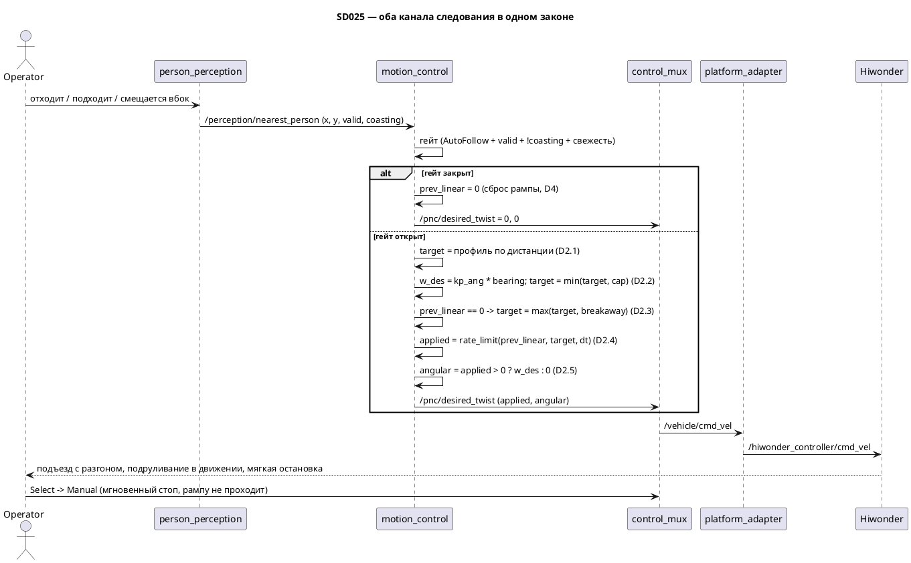

# SD025. Технический дизайн — сведение каналов следования и закрытие F11

Дизайн UI: skipped (решение оператора). Каталог: F11. BA: [solution.md](solution.md).
Протокол замера: [measure.md](measure.md) (заполняется на T5).

Развилки, закрытые оператором на фазе SA: задний ход и его параметры (`stop_range`,
`dist_deadband_near`) **удаляются**; доворота на месте нет; профиль скорости остаётся P-законом и
настраивается `kp_lin`; бюджет угловой считается от `max_linear_follow`, а не от `max_linear`;
страгивающая линейная команда применяется **только при трогании с места**.

Отдельно: буква трёх ФТ выполняется не полностью, и это свойство выбранных вариантов, а не
недоделка. На границе коридора P-закон даёт не ноль, а `kp_lin · dist_deadband`; трогание всегда
идёт с `min_breakaway_linear`; `stop_request` рампу не сбрасывает. Все три разобраны в D3 и D6.5 —
править `solution.md` не требуется, ФТ сформулированы верно.

## Системный дизайн

1. **D1.** Временный выключатель SD024 снимается. Из
   [`follow_control.hpp`](../../src/motion_control/include/motion_control/follow_control.hpp)
   уходит `angular_z ≡ 0` с пометкой `TEMPORARY, SD024`, и оба канала считаются в одном законе.
   Зеркальный патч SD022 (`linear_x = 0`, `kSd022MinBreakawayAngular`) был снят ещё в
   [SD024](../SD024/tech.md) `D1`, возвращать нечего. После этого в законе следования не остаётся
   ни одного принудительного нуля канала — это и есть закрытие функциональности F11.

2. **D2.** Закон следования — по-прежнему одна чистая функция без ROS. Вход — поза цели `x, y` в
   базе робота и **последняя выданная линейная команда** `prev_linear`; `range = hypot(x, y)`,
   `bearing = atan2(y, x)`, `err = range − standoff`. Порядок вычисления существенен: каждый
   следующий шаг опирается на результат предыдущего.
   1. **D2.1. Профиль скорости от дистанции.** `ceiling = min(max_linear_follow, max_linear)`.

      | Условие | `target` |
      |---------|----------|
      | `err > dist_deadband` | `clamp(kp_lin · err, 0, ceiling)` — подъезд, тем быстрее, чем дальше человек |
      | `err ≤ dist_deadband` | `0` — коридор удержания и вся ближняя зона |

      Заднего хода нет: ближе дистанции удержания робот стоит и ждёт (ФТ BA «не пятится»,
      восстановленное из [SD020](../SD020/solution.md)). Отдельный жёсткий стоп-порог не нужен —
      ближняя зона уже даёт ноль, а ниже 0.3 м глубина Aurora человека не измеряет и `valid`
      гаснет сама. Профиль — насыщенный P-закон: «дальше → ближе к потолку» получается из
      насыщения, дальность выхода на потолок задаётся косвенно, через `kp_lin` и потолок.
   2. **D2.2. Приоритет доворота.** `ω_des = clamp(kp_ang · bearing, ±max_angular)` при
      `|bearing| ≥ ang_deadband`, иначе `0`. Затем
      `linear_cap = clamp(ceiling − |ω_des| · track_half_sum, 0, ceiling)` и
      `target = min(target, linear_cap)`. Это перевёрнутый бюджет SD020 `D2.3`: там скорость
      забирала своё, а довороту доставался остаток; здесь наоборот.

      Порядок перевёрнут намеренно. При бюджете `(ceiling − applied)/track_half_sum` робот,
      вышедший на потолок следования, получает нулевой бюджет и **перестаёт доворачивать**. В
      SD020 это не проявлялось, потому что бюджет считался от `max_linear` 0.37, а линейная до
      него не доходила. С бюджетом от `max_linear_follow` (решение оператора) прежний порядок дал
      бы «на разгоне не доворачивается» — ровно ту дыру, которую SD025 закрывает.

      Тупика «доворот съел всю скорость» в пределах кадра нет: FOV камеры 74°
      ([SD012](../SD012/tech.md)) даёт `|bearing| ≤ 0.65` рад, при `kp_ang = 1.5` это
      `ω_des ≤ 0.97` рад/с и расход бюджета `≤ 0.14` м/с — меньше любого рабочего потолка
      следования. Цель вне кадра не детектируется, и `bearing` таких значений не принимает.
   3. **D2.3. Страгивание только с места.** Если `target > 0` **и** `prev_linear == 0`, то
      `target = min(max(target, min_breakaway_linear), ceiling)`, **и тот же пол накладывается на
      результат рампы**: иначе `apply_rate_limit` срезает первый шаг до `accel_linear · dt`
      (0.015 м/с при стартовых числах), команда несколько тиков идёт ниже порога страгивания, и
      робот стоит и жужжит. Замер бэга `f11_sd025_20260906_164725` показал этот эффект на 13 %
      тиков окна движения. Рампа формирует всё, что **выше** страгивающей. Предикат «стоял» — это ровно
      `prev_linear == 0`, никакого отдельного флага движения не заводится: рампа D2.4 садится на
      цель точно, поэтому нулём команда становится только тогда, когда целью был ноль.

      Разогнавшись, робот свободно гасит скорость ниже страгивающей до нуля — в этом и смысл
      решения оператора. Альтернатива «пол команды всегда вне коридора» давала бы у границы
      коридора ступеньку `0.10 → 0` и колебания между профилем и полом.
   4. **D2.4. Ограничение темпа.** `applied = apply_rate_limit(prev_linear, target, dt,
      accel_linear, decel_linear)`: шаг вверх ограничен `accel_linear · dt`, шаг вниз —
      `decel_linear · dt`, и если невязка меньше шага, команда садится на цель **ровно**. Точная
      посадка обязательна: без неё `prev_linear` никогда не станет нулём и предикат D2.3 не
      сработает.

      `dt` берётся номинальным, `1 / rate_hz`, а не замеряется по часам. Пропущенный или
      задержанный тик тогда лишь замедляет рампу — безопасная сторона; замер реального интервала
      добавил бы в закон зависимость от загрузки Pi без выигрыша в поведении.
   5. **D2.5. Угловая только в движении.** `angular_z = ω_des` при `applied > 0`, иначе `0`, и
      дополнительно режется остатком потолка по **применённой** линейной:
      `omega_lim = clamp((ceiling − applied)/track_half_sum, 0, max_angular)`. Этот кламп нужен
      только на переходе: пока рампа догоняет свежепониженный `linear_cap`, `applied` какое-то
      время выше него, и без клампа инвариант D2.6 нарушался бы. В установившемся режиме
      `applied = linear_cap`, поэтому `omega_lim = |ω_des|` и доворот не теряется.
      Доворота на месте нет (ФТ BA, восстановлено из SD020): в коридоре `target = 0`, рампа
      приводит `applied` к нулю, и угловая гаснет вместе с линейной. Временное поведение SD022
      (доворот на месте + страгивающая угловая 0.16) не возвращается.
   6. **D2.6. Инварианты закона**, проверяемые тестом: `applied ≥ 0` при любом входе (заднего
      хода нет); `applied + |angular_z| · track_half_sum ≤ ceiling` — скорость быстрой гусеницы не
      выходит за потолок следования; `|angular_z| ≤ max_angular`; `applied = 0 → angular_z = 0`;
      в коридоре и ближе — ровно ноль по обоим каналам; `range = 0` попадает в ближнюю зону.

3. **D3.** Известные свойства закона — не дефекты, а цена выбранных вариантов. Записаны здесь,
   чтобы оператор не принял их на стенде за баг и чтобы T5 знал, что подбирает.
   1. **D3.1. Ступенька на границе коридора.** P-закон на границе даёт не ноль, а
      `kp_lin · dist_deadband` — при нынешних `0.8 × 0.05` это `0.04` м/с. Подъём `kp_lin` ради
      разгона издалека эту ступеньку **увеличивает** (при `kp_lin = 1.5` — `0.075` м/с).
      Сглаживает её рампа торможения D2.4. Явный профиль с посадкой в ноль ровно на границе
      оператором отклонён в пользу P-закона.
   2. **D3.2. Старт всегда с `min_breakaway_linear`.** Даже когда ехать несколько сантиметров,
      трогание идёт с страгивающей команды (D2.3) — это физический минимум гусениц, ниже которого
      траки не идут ([SD022](../SD022/measure.md)), а не решение закона.
   3. **D3.3. Возможный недоезд до коридора.** При малой невязке `kp_lin · err` может оказаться
      ниже физического порога страгивания: робот, уже находясь в движении, замедлится до команды,
      которую траки не тянут, и встанет чуть дальше коридора. Смещение оценивается как
      `порог/kp_lin` и лечится подбором `kp_lin` на T5, а не логикой закона.

4. **D4.** Состояние и его сброс в ноде. `prev_linear` — единственное состояние закона, и живёт
   оно в [`motion_control.cpp`](../../src/motion_control/src/motion_control.cpp), а не в законе.
   При **закрытом гейте** (`!AutoFollow`, `!valid`, `coasting`, устаревшее сообщение) нода
   публикует нули и **сбрасывает `prev_linear` в ноль**, минуя рампу. Отсюда сразу два ФТ BA:
   ограничение темпа не задерживает остановку, и возврат в следование начинается с нулевой
   скорости, а не с той, на которой робота застали. Сам гейт (`D6.3` SD024, `D3`/`D4` SD020) не
   меняется.

5. **D5.** Параметры и валидация. Удаляются `stop_range` и `dist_deadband_near` вместе с зоной
   отъезда, и вместе с ними — проверка соотношения `stop_range < standoff − dist_deadband_near`.
   `dist_deadband_far` переименовывается обратно в `dist_deadband`: парного «near» больше нет, и
   суффикс без пары читается как ошибка. Добавляются `accel_linear` и `decel_linear` (м/с²), оба
   через существующий `require_positive`. Проверка `max_linear_follow ≤ max_linear` остаётся —
   потолок следования не может быть выше путевого потолка платформы.

6. **D6.** Что не меняется.
   1. **D6.1.** Контракт `/pnc/desired_twist`, `/perception/nearest_person` и
      `mentorpi_msgs/NearestPerson`. Признак `coasting` и `points_timeout_ms = 700` работают с
      SD024 и не трогаются.
   2. **D6.2.** `control_mux`, `platform_adapter`, `stub_graph`, `odom_publisher`, `t1ctl`, пульт,
      `mission_control`. Мгновенный стоп с пульта — существующий механизм: `Select` шлёт
      `/control/mode_toggle`, режим уходит `AUTO_FOLLOW → MANUAL`, `gate_mux` отдаёт нулевой стик.
      Рампа этот путь не проходит: mux зануляет ниже по потоку.
   3. **D6.3.** Рампа на угловую **не ставится**. Глубина `/aurora/points2` на стенде идёт
      2.15 Гц (хвост SD022), пеленг и так обновляется редко; добавлять к нему запаздывание фильтра
      — ухудшать доворот. Угловая остаётся мгновенной, как в SD020.
   4. **D6.4.** F12/F13 вне объёма: препятствий робот не видит и перед ними не тормозит.
      Диагностика и калибровка слоёв восприятия — тоже вне объёма.
   5. **D6.5. Явный хвост:** `stop_request` рампу не сбрасывает. При запрете движения режим
      остаётся `AUTO_FOLLOW`, гейт `motion_control` открыт, нода продолжает вести рампу и
      публиковать ненулевой `/pnc/desired_twist`, который `gate_mux` зануляет; при снятии запрета
      скорость возобновится скачком с прежней величины. Сегодня не выстрелит — `stop_request`
      всегда `false`, его источник заглушка `stub_graph`. Когда появится реальный источник (F13),
      в `motion_control` нужно будет добавить подписку на `/control/motion_restriction` и сброс
      `prev_linear` по нему. В объём SD025 это не входит.

### As-built (стенд `pi@192.168.2.2`, унаследовано)

| Величина | Значение | Откуда |
|----------|----------|--------|
| путевая `max_linear` | `0.37` м/с | SD020, Замер 1 |
| `max_angular` | `2.0` рад/с | SD020 |
| `track_half_sum` | `0.1407` м | SD020 |
| `kp_ang` | `1.5` 1/с | SD020 |
| `ang_deadband` | `0.05` рад | SD020 |
| `min_breakaway_linear` | `0.10` м/с | SD024, стартовое значение от пультового `linear_min` |
| `dist_deadband` (было `_far`) | `0.05` м | SD024 |
| `standoff` | `0.5` м | SD020 |
| `max_linear_follow` на входе в SD025 | `0.20` м/с | SD024, [measure.md](../SD024/measure.md) |
| `kp_lin` на входе в SD025 | `0.8` 1/с | SD020 |
| FOV камеры | 74°×51°, глубина 0.3–3 м | SD012 |
| глубина `/aurora/points2` на стенде | **2.15 Гц** вместо штатных 10 | SD022, штатная батарея |
| страгивающая угловая (справочно, не используется) | `0.16` рад/с | SD022, [measure.md](../SD022/measure.md) |

`accel_linear` и `decel_linear` на входе не существуют — стартовые значения ставит T4.

Снято на T5 (стенд, 2026-09-06, [measure.md](measure.md)):

| Величина | Значение | Откуда |
|----------|----------|--------|
| `max_linear_follow` | `0.25` м/с | SD025 T5, заход 1: половина командного envelope `0.5`; принято в заходе 2 |
| `kp_lin` | `0.8` 1/с | SD025 T5: не подбирался, поведение принято на стартовом значении |
| `accel_linear` | `0.30` м/с² | SD025 T5: не подбирался, поведение принято на стартовом значении |
| `decel_linear` | `0.60` м/с² | SD025 T5: не подбирался, поведение принято на стартовом значении |



## Программные интерфейсы

### C++ — чистые функции закона управления

1. **I1.** `compute_follow_twist` — сигнатура **меняется**: закону нужна последняя выданная
   линейная команда (D2.3, D2.4).

   ```cpp
   // Было (SD024):
   Twist2d compute_follow_twist(double x, double y, const FollowControlParams& params);
   // Стало (SD025):
   Twist2d compute_follow_twist(double x, double y, double prev_linear, double dt,
                                const FollowControlParams& params);
   ```

   Функция остаётся без состояния и без ROS: `prev_linear` и `dt` передаёт нода. Возвращаемый
   `Twist2d{linear_x, angular_z}` не меняется, `linear_x` — уже применённая (после рампы) команда.

2. **I2.** `apply_rate_limit` — новая чистая функция в том же заголовке (отдельной библиотеки в
   `motion_control` нет, вся математика живёт в `follow_control.hpp`):

   ```cpp
   // Ограничение темпа: вверх не быстрее accel, вниз не быстрее decel;
   // если невязка меньше шага — садится на target ровно. dt <= 0 не двигает команду.
   double apply_rate_limit(double prev, double target, double dt, double accel, double decel);
   ```

3. **I3.** `FollowControlParams` — два поля удаляются, одно переименовывается, два добавляются:

   ```cpp
   struct FollowControlParams {
     double standoff;             // м, целевая дистанция
     double max_linear;           // м/с, путевой потолок платформы
     double max_linear_follow;    // м/с, потолок канала следования
     double max_angular;          // рад/с, снова используется (D2.2)
     double kp_lin;               // 1/с, задаёт крутизну профиля (D2.1)
     double kp_ang;               // 1/с, снова используется (D2.2)
     double dist_deadband;        // м, БЫЛО dist_deadband_far: полукоридор удержания
     double min_breakaway_linear; // м/с, страгивающая команда, только с места (D2.3)
     double accel_linear;         // м/с², НОВОЕ: предел темпа разгона (D2.4)
     double decel_linear;         // м/с², НОВОЕ: предел темпа штатного торможения (D2.4)
     double ang_deadband;         // рад, снова используется (D2.2)
     double track_half_sum;       // м, снова используется (D2.2)
   };
   ```

   Удалены: `dist_deadband_near`, `stop_range` (D5). Комментарии «unused while yaw is disabled»
   снимаются со всех угловых полей — угловой канал снова работает.

### ROS 2 — нода `motion_control`

4. **I4.** Параметры ноды (все `> 0`; плюс соотношение D5). Стартовые значения — не SLA,
   уточняются замером T5:

   | Параметр | Было | Стало | Комментарий |
   |----------|------|-------|-------------|
   | `standoff` | `0.5` | `0.5` | без изменений |
   | `max_linear` | `0.37` | `0.37` | путевой потолок платформы, не трогаем |
   | `max_linear_follow` | `0.20` | `0.20` | пометка «temporary SD024» снимается; число подбирает T5 |
   | `kp_lin` | `0.8` | `0.8` | стартовое; крутизна профиля, подбирает T5 |
   | `dist_deadband_far` → `dist_deadband` | `0.05` | `0.05` | переименование (D5) |
   | `dist_deadband_near` | `0.12` | **удалён** | зоны отъезда больше нет |
   | `stop_range` | `0.30` | **удалён** | ближняя зона и так даёт ноль |
   | `min_breakaway_linear` | `0.10` | `0.10` | смысл сужен: только при трогании с места |
   | `accel_linear` | — | `0.30` | новый, стартовое: разгон до 0.20 м/с примерно за 0.7 с |
   | `decel_linear` | — | `0.60` | новый, стартовое: тормозит вдвое резче, чем разгоняется |
   | `max_angular`, `kp_ang`, `ang_deadband`, `track_half_sum` | — | без изменений | угловой канал снова работает |
   | `nearest_timeout_ms` | `300` | `300` | пометка «temporary SD024» снимается: окно верное и для едущего робота |
   | `rate_hz` | `20.0` | `20.0` | задаёт `dt = 1/rate_hz` для рампы (D2.4) |

   Стартовые `accel_linear` / `decel_linear` — не замер, а разумная точка старта для стенда;
   основание и итоговые числа пишет T5 в [measure.md](measure.md).

5. **I5.** Топики не меняются: `motion_control` читает `/control/state` и
   `/perception/nearest_person`, публикует `/pnc/desired_twist` (`geometry_msgs/Twist`). QoS,
   имена и типы прежние (D6.1).

6. **I6.** Версии: `motion_control` `0.3.0` → **`0.4.0`** (новый закон, новая сигнатура, новые и
   удалённые параметры), `mentorpi_bringup` `0.4.0` → **`0.5.0`** (изменился набор параметров
   ноды). `mentorpi_msgs` `1.2.0` и `mentorpi_perception` `0.5.0` **не меняются**.

## Изменения в приложениях

### `motion_control`
**Пункты:** D1, D2.1, D2.2, D2.3, D2.4, D2.5, D2.6, D3.1, D3.2, D3.3, D4, D5, I1, I2, I3, I4, I6

Пакет считает желаемую команду следования и на шасси напрямую не пишет. Сегодня в нём лежит закон
SD024: коридор с двумя границами, задний ход, жёсткий стоп-порог и принудительный ноль угловой.
Архитектурно меняется одно: закон перестаёт быть функцией только от позы и становится функцией от
позы **и предыдущей команды** — появляется состояние, и оно сознательно вынесено в ноду, а
заголовок остаётся чистым и тестируемым. Второе изменение — порядок каналов: доворот считается
первым и резервирует себе долю потолка, линейная забирает остаток.

1. `follow_control.hpp`: закон переписывается по D2.1–D2.5, добавляется `apply_rate_limit` (I2),
   `FollowControlParams` приводится к I3, пометка `TEMPORARY, SD024` уходит.
2. `motion_control.cpp`: поле `prev_linear_`, передача его и `dt = 1/rate_hz` в закон, сброс
   `prev_linear_` при закрытом гейте (D4), объявление `accel_linear` / `decel_linear`, удаление
   `stop_range` / `dist_deadband_near` и проверки их соотношения, переименование
   `dist_deadband_far`.
3. `test/test_follow_control.cpp`: фикстура приводится к I3, тесты зон и отъезда заменяются на
   тесты D2.6 и рампы.
4. Не трогаем: гейт режима и свежести (`AUTO_FOLLOW && valid && !coasting && свежесть`), чтение
   `coasting`, имена и QoS топиков, `rate_hz` как источник периода таймера.

### `mentorpi_bringup`
**Пункты:** D5, I4, I6

Пакет держит единственное место, где параметрам ноды задаются числа — `stage1.launch.py`. Меняется
только блок `motion_control`: набор ключей приводится к I4, а временные пометки SD024 снимаются,
потому что временного в этих значениях больше ничего нет.

1. Удалить `stop_range` и `dist_deadband_near`, переименовать `dist_deadband_far`.
2. Добавить `accel_linear` и `decel_linear` со стартовыми значениями I4.
3. Снять комментарии `temporary SD024` с `max_linear_follow` и `nearest_timeout_ms`.
4. Не трогаем: остальные ноды в файле, порядок запуска, параметры пульта (`linear_min`,
   `angular_min` из SD004) и `person_perception.yaml`.

### Документы
**Пункты:** D6.5

README описывает контур для оператора и сейчас утверждает, что поворот временно выключен, а робот
отъезжает назад, — после SD025 оба утверждения ложны. Каталог фич в `docs/SD/SD001/tech.md`
перечисляет требования F11 и должен получить SD025 и отметку о закрытии.

1. `README.md`, строки 5, 14, 32: убрать «поворот временно выключен (`angular_z = 0`)» и «отъезд»,
   описать сведённый закон с разгоном.
2. `docs/SD/SD001/tech.md`, F11 (строка 199): добавить `SD025/solution.md`, отметить закрытие
   функциональности.
3. `docs/SD/SD025/STATUS.md`: фазы и заметки прогона, включая хвост D6.5 для будущего F13.

## ToDo
Порядок: сначала чистая математика (T1, T2) — её видно тестом без стенда и без сборки образа;
затем нода и launch (T3, T4), после которых контур собирается и деплоится; затем стендовый замер
(T5), который меняет только числа; документы (T6) последними, чтобы описывать факт.

- [x] T1. Переписать закон следования: профиль, приоритет доворота, страгивание с места
  - **Реализует:** D1, D2.1, D2.2, D2.3, D2.5, D2.6, D3.1, D3.2, D3.3, I1, I3
  - **Файлы:** `src/motion_control/include/motion_control/follow_control.hpp`,
    `src/motion_control/test/test_follow_control.cpp`
  - **Что нужно сделать:** Заменить закон SD024 на сведённый закон SD025. Из
    `FollowControlParams` уходят `dist_deadband_near` и `stop_range`, `dist_deadband_far`
    становится `dist_deadband`, появляются `accel_linear` и `decel_linear` (структура — по I3,
    их использует T2). В теле функции: посчитать `range`, `bearing`, `err`; получить `target` по
    профилю D2.1 (заднего хода нет — при `err ≤ dist_deadband` цель ноль); посчитать `ω_des` и
    урезать `target` бюджетом доворота D2.2; при `prev_linear == 0` поднять `target` до
    `min_breakaway_linear` и снова обрезать потолком D2.3; выдать угловую только при ненулевой
    применённой линейной D2.5. Сигнатура получает `prev_linear` и `dt` (I1); вызов рампы между
    D2.3 и D2.5 — из T2, до её появления допустимо `applied = target`, но задача не считается
    закрытой, пока T2 не встроена. Пометка `TEMPORARY, SD024` и комментарии «unused while yaw is
    disabled» снимаются.

    Тесты переписываются под новую фикстуру: старые проверки зоны отъезда и `stop_range` уходят,
    вместо них — инварианты D2.6 и поведение страгивания. Числа в фикстуре — из I4, они не
    зашиваются в закон. Что осознанно не делаем в этой задаче: не трогаем ноду, launch и гейт
    (это T3 и T4) и не ставим рампу на угловую (D6.3).
  - **Критерии приёмки:**
    1. AC1. При `range` дальше коридора команда положительна и растёт с дистанцией, при `range`
       внутри коридора и ближе — ровно ноль по обоим каналам.
    2. AC2. При любом входе `linear_x ≥ 0` — заднего хода закон не выдаёт ни при какой дистанции.
    3. AC3. При ненулевом пеленге и движении угловая ненулевая **в том числе когда линейная
       упёрлась в потолок следования**; при нулевой линейной угловая ноль.
    4. AC4. Выполняется `linear_x + |angular_z| · track_half_sum ≤ min(max_linear_follow,
       max_linear)` и `|angular_z| ≤ max_angular` на выборке дистанций и пеленгов.
    5. AC5. При `prev_linear == 0` и цели дальше коридора команда не ниже `min_breakaway_linear`;
       при `prev_linear > 0` команда может быть ниже неё.
    6. AC6. В заголовке нет `kSd022MinBreakawayAngular`, `stop_range`, `dist_deadband_near` и
       пометки `TEMPORARY`.
  - **Проверка:** `colcon build --base-paths src --packages-select motion_control` и
    `colcon test --base-paths src --packages-select motion_control`, затем
    `colcon test-result --verbose`; ожидается `test_follow_control: ok`. AC6 — `grep` по заголовку.

- [x] T2. Добавить ограничение темпа линейной команды
  - **Реализует:** D2.4, I2
  - **Файлы:** `src/motion_control/include/motion_control/follow_control.hpp`,
    `src/motion_control/test/test_follow_control.cpp`
  - **Что нужно сделать:** Добавить чистую `apply_rate_limit(prev, target, dt, accel, decel)` в
    тот же заголовок и встроить её вызов в закон между D2.3 и D2.5, так чтобы угловая считалась
    уже по применённой линейной. Шаг вверх ограничен `accel · dt`, шаг вниз — `decel · dt`;
    если `|target − prev|` меньше шага, функция возвращает `target` **точно**, без остатка —
    от этого зависит предикат страгивания D2.3. Неположительный `dt` не двигает команду: функция
    возвращает `prev`.

    Отдельные параметры на разгон и торможение нужны потому, что тормозить робот должен резче,
    чем разгоняться: замедление гасит перелёт коридора, а разгон отвечает за плавность старта.
    Что осознанно не делаем: рампу на угловую не ставим (D6.3), реальный интервал между тиками не
    замеряем (D2.4) — `dt` придёт номинальным из ноды в T3.
  - **Критерии приёмки:**
    1. AC1. Из нуля к цели выше нуля команда растёт не быстрее `accel · dt` за тик и достигает
       цели за ожидаемое число тиков.
    2. AC2. От ненулевой команды к нулю она падает не быстрее `decel · dt` за тик и приходит в
       ровный ноль, а не в остаток.
    3. AC3. При `dt ≤ 0` команда не меняется.
    4. AC4. Инварианты T1 (AC2, AC4) продолжают выполняться после встраивания рампы.
  - **Проверка:** те же команды `colcon build` / `colcon test` по пакету `motion_control`; в
    тестах — прогон последовательности тиков, а не одиночный вызов.

- [x] T3. Перевести ноду на новый закон и сбрасывать рампу по гейту
  - **Реализует:** D4, D5
  - **Файлы:** `src/motion_control/src/motion_control.cpp`
  - **Что нужно сделать:** Завести в ноде поле `prev_linear_`, передавать его и `dt = 1/rate_hz`
    в `compute_follow_twist`, а результат запоминать обратно. В ветке закрытого гейта
    (`!AutoFollow`, `!valid`, `coasting`, устаревшее сообщение) публиковать нули и **сбрасывать
    `prev_linear_` в ноль, минуя рампу** — иначе ограничение темпа задержит остановку, а возврат
    в следование начнётся с прежней скорости. Сам гейт не трогаем: условие
    `AUTO_FOLLOW && valid && !coasting && свежесть` остаётся как в SD024.

    Параметры: объявить `accel_linear` и `decel_linear` через существующий `require_positive`,
    удалить `stop_range` и `dist_deadband_near` вместе с проверкой
    `stop_range < standoff − dist_deadband_near`, переименовать `dist_deadband_far`. Проверку
    `max_linear_follow ≤ max_linear` оставить. Стартовая строка лога должна печатать значения,
    по которым оператор на стенде отличит новый закон от старого — добавить в неё `kp_lin`,
    `accel_linear` и `decel_linear` вместо ушедшего `stop_range`.
  - **Критерии приёмки:**
    1. AC1. Нода стартует со значениями launch и печатает в лог `kp_lin`, `accel_linear`,
       `decel_linear` и `max_linear_follow`.
    2. AC2. При `accel_linear = 0` или `decel_linear = 0` нода падает на старте с внятным
       сообщением, а не запускается с вывернутой рампой.
    3. AC3. При `max_linear_follow > max_linear` нода по-прежнему падает на старте.
    4. AC4. Задание параметра `stop_range` или `dist_deadband_near` ноду не конфигурирует и на
       поведение не влияет — таких параметров у ноды больше нет.
    5. AC5. На живом контуре при пропаже цели `/pnc/desired_twist` становится нулевым в пределах
       одного тика, без плавного спада.
  - **Проверка:** сборка пакета; запуск ноды с подменёнными параметрами через
    `ros2 run motion_control motion_control --ros-args -p ...` для AC2–AC4; AC5 — на стенде
    `ros2 topic echo /pnc/desired_twist` при закрытии человека рукой.

- [x] T4. Обновить launch и версии пакетов
  - **Реализует:** I4, I6
  - **Файлы:** `src/mentorpi_bringup/launch/stage1.launch.py`,
    `src/motion_control/package.xml`, `src/mentorpi_bringup/package.xml`
  - **Что нужно сделать:** Привести блок `motion_control` в `stage1.launch.py` к таблице I4:
    удалить `stop_range` и `dist_deadband_near`, переименовать `dist_deadband_far` в
    `dist_deadband`, добавить `accel_linear = 0.30` и `decel_linear = 0.60` как стартовые
    значения. Снять комментарии `temporary SD024` с `max_linear_follow` и `nearest_timeout_ms`:
    временного в них больше нет, `nearest_timeout_ms = 300` — рабочее окно прихода сообщения и
    для едущего робота. Остальные ноды файла и параметры пульта не трогать.

    Версии поднять по I6: `motion_control` до `0.4.0`, `mentorpi_bringup` до `0.5.0`.
    `mentorpi_msgs` и `mentorpi_perception` остаются как есть — их контракты SD025 не меняет.
  - **Критерии приёмки:**
    1. AC1. Контур поднимается штатно, `motion_control` в логе стартует без исключений.
    2. AC2. `ros2 param list /motion_control` показывает `accel_linear` и `decel_linear` и не
       показывает `stop_range` и `dist_deadband_near`.
    3. AC3. Версии в `package.xml` — `0.4.0` и `0.5.0`; версии `mentorpi_msgs` и
       `mentorpi_perception` не изменились.
  - **Проверка:** сборка образа и деплой на стенд, запуск контура, `ros2 param list` и
    `ros2 param get`; `grep '<version>' src/*/package.xml` для AC3.

- [x] T5. Снять на стенде потолок, крутизну профиля и темпы разгона/торможения
  - **Реализует:** D3.1, D3.3 (подбором), I4 (итоговые значения)
  - **Файлы:** `docs/SD/SD025/measure.md`, `src/mentorpi_bringup/launch/stage1.launch.py`
  - **Что нужно сделать:** Подобрать на стенде четыре числа, которых нет в BA и которые нельзя
    выдумывать: `max_linear_follow` (оператор отметил, что 0.20 медленно), `kp_lin` (крутизна
    профиля и, через неё, дальность выхода на потолок и величина ступеньки D3.1), `accel_linear`
    и `decel_linear`. Каждое значение записать в `measure.md` вместе с тем, как оно получено, и
    перенести в launch. Отдельно проверить D3.3: где именно робот встаёт относительно коридора и
    не нужно ли поднять `kp_lin`, чтобы недоезд ушёл.

    Метод — как в SD022 и SD024: прогон на подготовленной площадке, вердикт оператора и снятые
    топики; инструментальный свип по IMU не обязателен, и если оператор его отменяет, это
    записывается в `measure.md` явно, а не подразумевается. Робота в движение приводит только
    оператор, рядом мгновенный стоп с пульта.
  - **Критерии приёмки:**
    1. AC1. В `measure.md` записаны итоговые `max_linear_follow`, `kp_lin`, `accel_linear`,
       `decel_linear` и способ получения каждого.
    2. AC2. Те же значения стоят в `stage1.launch.py`.
    3. AC3. Ступенька на границе коридора (D3.1) и фактическое место остановки (D3.3) описаны
       словами оператора — видно, приемлемы они или нет.
    4. AC4. Соотношение `max_linear_follow ≤ max_linear` не нарушено, нода стартует.
  - **Проверка:** стенд, `ros2 topic echo /pnc/desired_twist` во время прогонов; сверка чисел
    `measure.md` и launch глазами.

- [x] T6. Обновить README, каталог фич и STATUS
  - **Реализует:** D6.5
  - **Файлы:** `README.md`, `docs/SD/SD001/tech.md`, `docs/SD/SD025/STATUS.md`
  - **Что нужно сделать:** В README поправить три места (строки 5, 14, 32), где написано, что
    поворот временно выключен и что робот отъезжает назад: после SD025 робот едет и подруливает
    одновременно, назад не пятится, скорость зависит от дистанции и меняется плавно. В каталоге
    фич `docs/SD/SD001/tech.md` добавить `SD025/solution.md` в требования F11 и отметить, что
    функциональность фичи закрыта.

    В `STATUS.md` записать факт прогона и обязательно — хвост D6.5: `stop_request` рампу не
    сбрасывает, и когда появится F13, в `motion_control` понадобится подписка на
    `/control/motion_restriction` со сбросом `prev_linear`. Этот хвост нигде больше не
    зафиксирован, и без записи он потеряется. Галочку «фича принята» в каталоге ставит оператор
    после QA, а не эта задача.
  - **Критерии приёмки:**
    1. AC1. В README нет утверждений «поворот временно выключен» и «отъезжает».
    2. AC2. В `docs/SD/SD001/tech.md` у F11 перечислен SD025.
    3. AC3. В `STATUS.md` записан хвост про `stop_request` и F13.
    4. AC4. `pre-commit run --all-files` зелёный.
  - **Проверка:** `grep` по README на «временно выключен» и «отъезд»; чтение секции F11;
    `pre-commit run --all-files`.

## Покрытие

| Пункт | Задачи |
|-------|--------|
| D1 | T1 |
| D2.1 | T1 |
| D2.2 | T1 |
| D2.3 | T1 |
| D2.4 | T2 |
| D2.5 | T1 |
| D2.6 | T1 |
| D3.1 | T1, T5 |
| D3.2 | T1 |
| D3.3 | T1, T5 |
| D4 | T3 |
| D5 | T3 |
| D6.1 | — (ограничение scope: контракты не меняются) |
| D6.2 | — (ограничение scope: соседние ноды не трогаем) |
| D6.3 | — (ограничение scope: рампы на угловую нет) |
| D6.4 | — (ограничение scope: F12/F13 вне объёма) |
| D6.5 | T6 |
| I1 | T1 |
| I2 | T2 |
| I3 | T1 |
| I4 | T4, T5 |
| I5 | — (ограничение scope: топики не меняются) |
| I6 | T4 |

Итог: пунктов 23, задач 6. Непокрытых пунктов нет: D6.1–D6.4 и I5 — явные ограничения scope
(«что не меняется»), задач под них по канону не заводится.

## Финальный QA (пользователь, T1–T6)

Предусловие: собрать образ и задеплоить контур на стенд `pi@192.168.88.56`; подготовленная площадка
со свободным сектором; пульт в руках, режим `AutoFollow`; робота в движение приводит только
оператор. Ограничение стенда: глубина `/aurora/points2` идёт 2.15 Гц вместо штатных 10 — дистанция
и пеленг обновляются реже, чем считается команда.

### T1 — закон
1. `colcon test --base-paths src --packages-select motion_control`, затем
   `colcon test-result --verbose` — `test_follow_control: ok` (AC1–AC5).
2. `grep -n 'kSd022MinBreakawayAngular\|stop_range\|dist_deadband_near\|TEMPORARY' \
   src/motion_control/include/motion_control/follow_control.hpp` — пусто (AC6).

### T2 — рампа
1. Те же команды теста; в выводе видны прогоны последовательности тиков на разгон и торможение
   (AC1, AC2).
2. Тест с `dt = 0` и `dt < 0` проходит (AC3); инвариантные тесты T1 по-прежнему зелёные (AC4).

### T3 — нода
1. `ros2 run motion_control motion_control --ros-args -p accel_linear:=0.0` — падение на старте
   (AC2); то же с `max_linear_follow:=0.5` (AC3).
2. Штатный запуск: в логе видны `kp_lin`, `accel_linear`, `decel_linear`, `max_linear_follow`
   (AC1).
3. `ros2 param list /motion_control` — `stop_range` и `dist_deadband_near` отсутствуют (AC4).
4. `ros2 topic echo /pnc/desired_twist`, закрыть человека от камеры на ходу — нули приходят
   сразу, без спада (AC5).

### T4 — launch и версии
1. Контур поднимается, `motion_control` без исключений (AC1).
2. `ros2 param list /motion_control` показывает `accel_linear` и `decel_linear` (AC2).
3. `grep '<version>' src/*/package.xml` (AC3).

### T5 — замер
1. Прогоны подъезда с разных дистанций, подбор четырёх чисел; записать в `measure.md` (AC1).
2. Сверить `measure.md` и launch (AC2); описать ступеньку и место остановки (AC3); нода стартует
   на итоговых значениях (AC4).

### T6 — документы
1. `grep -n 'временно выключен\|отъезд' README.md` — пусто (AC1).
2. Секция F11 в `docs/SD/SD001/tech.md` содержит SD025 (AC2); `STATUS.md` содержит хвост про
   `stop_request` (AC3).
3. `pre-commit run --all-files` (AC4).

### Сценарии контура (после T4, повторить после T5)
1. Отойти далеко: робот трогается плавно, разгоняется тем сильнее, чем дальше, по дороге
   доворачивает и мягко встаёт в коридоре, не проскакивая его.
2. Отойти чуть за коридор: подъезд короткий, без броска.
3. Идти по дуге дальше коридора: робот подруливает непрерывно, человек остаётся по курсу.
4. Сместиться вбок на дистанции удержания: робот неподвижен, на месте не доворачивается.
5. Подойти ближе коридора: робот стоит, назад не едет.
6. Пропасть из кадра на разгоне: мгновенный ноль, движение по устаревшей позе не продолжается.
7. `Select` → `Manual` на ходу: шасси получает нули сразу; возврат в `AutoFollow` начинается с
   нулевой скорости.
