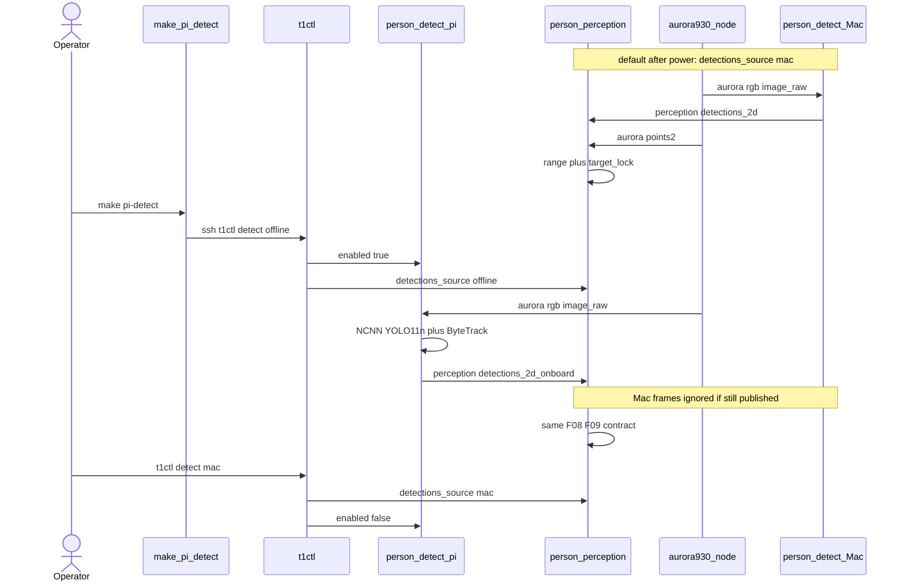

# SD026. Технический дизайн

Дизайн UI: skipped (пользователь: СА без дизайна). Каталог: F08/F09. BA: [solution.md](solution.md). As-is: инференс только на Mac ([person_detect.py](../../host/mac_person_detect/person_detect.py) → `/perception/detections_2d`); на Pi [person_perception](../../src/mentorpi_perception/src/person_perception.cpp) считает range и `person_target_lock`. OpenCV DNN YOLOv8n на CPU Pi отклонён (SD013). ИИ-ускоритель (Hailo/Coral) не покупаем. HOG/кластеры глубины в этот SD не входят: BA требует следование неотличимое от YOLO11n на Mac.

## Системный дизайн

1. **D1.** Два взаимоисключающих источника рамок на роботе. После питания и после `t1ctl restart` источник — Mac, как сейчас. Offline — только по команде оператора, до следующего перезапуска overlay.
   1. **D1.1.** Нода `person_detect_pi` пакета `mentorpi_person_detect` крутится **в контейнере `mentorpi-t1`**, не на хосте Pi (`t1ctl` без ROS) и не на Mac. В [stage1.launch.py](../../src/mentorpi_bringup/launch/stage1.launch.py) нода всегда запущена с `enabled=false`: инференса нет, RGB не обрабатывается, топик рамок молчит. Включение — runtime-параметр без рестарта launch. Имя ноды не `person_detect`: на том же `ROS_DOMAIN_ID` Mac уже занимает это имя.
   2. **D1.2.** Движок: те же официальные веса семейства **YOLO11n detect**, что Mac (SD015), в формате **NCNN на CPU** с `num_threads=2` (остальные ядра — Aurora и контур). Не OpenCV DNN (отклонённый заход SD013), не Ultralytics/PyTorch на Pi, не вендорский YOLO, не Hailo. Статическая линковка ncnn в бинарник ноды, чтобы хватало `make deploy` без пересборки overlay-образа. **Vulkan/Mesa в этот SD не входят.** На Pi 5 драйвер Mesa **v3dv** для VideoCore VII (V3D 7.1) существует и Khronos-conformant, но это графический Vulkan: у NCNN на v3dv нет нормального INT8/FP16 GEMM, в публичных бенчмарках (Q-engineering, Pi 4/5) Vulkan-путь часто в разы *медленнее* CPU. GPU-инференс (v3dv / LiteRT WebGPU) — отдельный SD, если CPU NCNN снова забьёт плату.
   3. **D1.3.** Сопровождение рамок — ByteTrack с теми же порогами, что [bytetrack.yaml](../../host/mac_person_detect/bytetrack.yaml) (`track_buffer: 30`, `track_high_thresh`/`new_track_thresh` 0.25). В `Detection2D.id` — десятичная запись id; рамка без id не публикуется. Класс только `person`, `confidence_threshold` default 0.25 (не SLA). `header.stamp` как у RGB. Кадры RGB не копятся: QoS sensor_data KeepLast(1), обрабатывается последний.
2. **D2.** `person_perception` выбирает источник рамок параметром, геометрия F08 и `person_target_lock` F09 не меняются.
   1. **D2.1.** Два топика: Mac `/perception/detections_2d` (без изменения контракта SD013/SD017); onboard `/perception/detections_2d_onboard` (тот же `Detection2DArray`). Параметр `detections_source`: `mac` | `offline`. В каждый момент в геометрию идёт **только** выбранный топик; второй игнорируется, даже если Mac ещё шлёт рамки.
   2. **D2.2.** Default в YAML и после рестарта ноды — `mac`. Смена источника — `set_parameters` в рантайме, YAML на диск не пишем (как `publish_overlay` / `t1ctl debug`).
   3. **D2.3.** Нет рамок на выбранном источнике дольше `detections_timeout_ms` — пустой persons/nearest по действующим правилам SD017 (coast / потеря цели). Вымышленных людей нет. Отдельный статус «детектор упал» не вводим (BA: как без Mac).
3. **D3.** CLI на хосте Pi: `t1ctl detect` (status), `t1ctl detect offline`, `t1ctl detect mac`. Паттерн как [ros_debug.py](../../host/t1ctl/src/ros_debug.py): `docker exec` в `mentorpi-t1`, `ROS_LOCALHOST_ONLY=0`. `offline`: сначала `person_detect_pi.enabled=true`, затем `person_perception.detections_source=offline`. `mac`: сначала `detections_source=mac`, затем `enabled=false`. Контейнер/нода недоступны — ошибка, режим не «тихо становится mac».
4. **D4.** `make pi-detect` с машины разработки по SSH вызывает ту же команду, что оператор на Pi: `t1ctl detect offline`. `make pi-detect ARGS=mac` → `t1ctl detect mac`. Хост/пароль как [deploy.sh](../../mk/deploy.sh) (`PI_HOST` / `PI_PASSWORD`). Скрипт не запускает инференс на Mac и не ставит t1ctl.
5. **D5.** Не меняется: `person_geometry` / range по `/aurora/points2`; пороги lock 0.30 м / 2 с; топики `/perception/persons` и `/perception/nearest_person`; Mac `person_detect.py` и `make mac-detect`; `ROS_LOCALHOST_ONLY=0` и DDS SD016 (RGB на LAN может продолжать уходить, контур от Mac не зависит); Twist / motion_control / mission_control; вендорский `bringup.launch.py`; лидар как класс «человек»; overlay `t1ctl debug`; бюджет WARN 100 мс SD014 (не смягчаем и не задаём новый SLA FPS); [Dockerfile](../../docker/mentorpi-t1/Dockerfile) overlay-образа (Mesa/Vulkan в runtime-образ не ставим).
6. **D6.** [stage1.launch.py](../../src/mentorpi_bringup/launch/stage1.launch.py) поднимает `person_detect_pi` сразу после `person_perception` (оба после `camera_layer`). Mac-нода, HailoRT, вендорский YOLO в launch по-прежнему не входят.
7. **D7.** Версии minor (новая функциональность): новый пакет `mentorpi_person_detect` `0.1.0`; `mentorpi_perception` `0.5.1` → `0.6.0`; `mentorpi_bringup` `0.5.0` → `0.6.0`; `t1ctl` `1.6.1` → `1.7.0`. `mentorpi_msgs` не версионируем.

## Программные интерфейсы

### YAML / параметры ROS

1. **I1.** [person_perception.yaml](../../src/mentorpi_perception/config/person_perception.yaml): `detections_source` default `mac`; `detections_topic` default `/perception/detections_2d`; `onboard_detections_topic` default `/perception/detections_2d_onboard`. Прочие ключи (timeouts, lock, overlay, DDS ping) без изменения.
2. **I2.** YAML ноды `person_detect_pi` (share `mentorpi_person_detect`): `enabled` default `false`; `image_topic` `/aurora/rgb/image_raw`; `detections_topic` `/perception/detections_2d_onboard`; `weights` — путь к NCNN-модели в share пакета; `confidence_threshold` `0.25`; `num_threads` `2`; `infer_period_ms` `500` (as-built QA: между инференсами перепубликация последней рамки с stamp текущего RGB). Параметра Vulkan нет. Launch задаёт `OMP_NUM_THREADS` / `NCNN_NUM_THREADS` = 2.

### ROS 2 топики

3. **I3.** `/perception/detections_2d_onboard` — `vision_msgs/Detection2DArray`, QoS KeepLast(1) reliable. Контракт как Mac SD017 I1: `class_id=person`, `Detection2D.id` десятичная строка ByteTrack, bbox center Humble `position.x/y`, stamp RGB. Паблишер только `person_detect_pi`.
4. **I4.** `/perception/detections_2d`, `/perception/persons`, `/perception/nearest_person` — без смены типа/имени; меняется только какой вход `person_perception` читает.

### t1ctl и Make

5. **I5.** `t1ctl detect` печатает `source: mac|offline`. `t1ctl detect offline` / `t1ctl detect mac` меняют I1/I2 через services `/{node}/set_parameters`. Helper в контейнере (как `ros_debug.py`): stdout `T1CTL_DETECT_OK=0|1`, `source: mac|offline`, `detail: …`.
6. **I6.** Цель Makefile `pi-detect` → [pi-detect.sh](../../mk/pi-detect.sh): SSH `t1ctl detect offline`. Extra: `make pi-detect ARGS=mac` → `t1ctl detect mac`. Не Darwin-only (в отличие от `mac-detect`).

### Версии

7. **I7.** Как D7: `mentorpi_person_detect` 0.1.0; `mentorpi_perception` 0.6.0; `mentorpi_bringup` 0.6.0; `t1ctl` 1.7.0.

## Изменения в приложениях

### `docker/overlay-builder`

**Пункты:** D1.2, D7

Сейчас builder — `ros:humble` + distro OpenCV, без ncnn. ncnn линкуем статически на этапе overlay-builder, чтобы runtime-образ MentorPi не трогать.

1. В [Dockerfile](../../docker/overlay-builder/Dockerfile): сборка ncnn **без** Vulkan (`NCNN_VULKAN=OFF`) в префикс, доступный colcon.
2. [Dockerfile](../../docker/mentorpi-t1/Dockerfile) overlay-образа не меняем: Mesa/`mesa-vulkan-drivers` не ставим.
3. Не OpenCV 4.10 Deptrum, не apt во время `make build` / colcon.

### `src/mentorpi_person_detect` (новый пакет overlay)

**Пункты:** D1.1, D1.2, D1.3, I2, I3, I7

Отдельный пакет, чтобы ncnn не тащить в gtest геометрии `mentorpi_perception`. Нода читает RGB Aurora, пишет только 2D-рамки; range и nearest не считает.

1. Исполняемый `person_detect_pi`: NCNN YOLO11n, ByteTrack, контракт I3; `enabled=false` пропускает инференс.
2. Веса NCNN в share (экспорт из официального `yolo11n.pt`, тот же класс `person`); в рантайме с Pi не скачиваем.
3. CTest ByteTrack на синтетических рамках без камеры.
4. Не PersonArray, не Twist, не публикация в `/perception/detections_2d`.

### `src/mentorpi_perception` (`person_perception`)

**Пункты:** D2.1, D2.2, D2.3, I1, I4

Сейчас одна подписка на `detections_topic`. Нужен переключатель источника в том же callback-пути, что `on_detections`, без дублирования геометрии.

1. Параметр `detections_source` + вторая подписка на `onboard_detections_topic`; в `publish_from_detections` попадает только выбранный источник.
2. Runtime callback как у `publish_overlay`.
3. Не трогать `person_geometry.hpp`, `person_target_lock.hpp`, overlay, ICMP DDS.

### `src/mentorpi_bringup` (`stage1.launch.py`)

**Пункты:** D6, I7

1. Node `person_detect_pi` с YAML из share; `exec_depend` на `mentorpi_person_detect`.
2. Не включать Mac-ноду, Hailo, vendor YOLO, `bringup.launch.py`.

### `host/t1ctl`

**Пункты:** D3, I5, I7

1. Subcommand `detect` по образцу `debug`: [main.cpp](../../host/t1ctl/src/main.cpp), [units.cpp](../../host/t1ctl/src/units.cpp), новый `ros_detect.py`, тесты в [test_status.cpp](../../host/t1ctl/tests/test_status.cpp).
2. Порядок set_parameters как D3. UI-строки без HTML-макетов (design skipped).
3. Не менять `mode` / `debug` / calib.

### Makefile / `mk/pi-detect.sh`

**Пункты:** D4, I6

1. Новый скрипт SSH + цель `pi-detect` в help рядом с `mac-detect`.
2. Не собирать overlay и не вызывать `mac-detect`.

## ToDo

Порядок: сначала toolchain и нода-источник рамок, затем переключатель восприятия, launch, CLI/Make, документация каталога.

- [x] T1. NCNN в overlay-builder и веса YOLO11n
  - **Реализует:** D1.2, I7 (часть пакета detect)
  - **Файлы:** [Dockerfile](../../docker/overlay-builder/Dockerfile), `src/mentorpi_person_detect/` (скелет пакета + share весов)
  - **Что нужно сделать:** Собрать ncnn со статическими библиотеками **без Vulkan** в образе overlay-builder так, чтобы последующий colcon линковал ноду без `apt-get` на каждый `make build`. Runtime-образ MentorPi не трогаем: GPU/Mesa не нужны. В share нового пакета положить NCNN-модель, экспортированную из официального `yolo11n.pt` (класс `person`, тот же conf default 0.25, что на Mac). Скачивания весов на Pi и линковки Deptrum OpenCV 4.10 нет. Версия пакета `mentorpi_person_detect` 0.1.0.
  - **Критерии приёмки:**
    1. AC1. В overlay-builder есть префикс ncnn, colcon видит заголовки/библиотеку без сети на этапе сборки пакета.
    2. AC2. В share пакета лежат файлы модели NCNN; нода может открыть их по пути I2.
    3. AC3. `make build` по-прежнему не вызывает `apt-get` внутри `docker run` colcon (apt только в overlay-builder Dockerfile). [Dockerfile](../../docker/mentorpi-t1/Dockerfile) overlay-образа без Mesa/Vulkan.
  - **Проверка:** пользователь `make env` при смене Dockerfile, затем `make build`; в логе colcon нет скачивания весов; в install share есть модель.

- [x] T2. Нода `person_detect_pi`: YOLO11n NCNN + ByteTrack
  - **Реализует:** D1.1, D1.3, I2, I3
  - **Файлы:** `src/mentorpi_person_detect/src/person_detect_pi.cpp`, ByteTrack module, YAML, CTest
  - **Что нужно сделать:** C++17-нода в overlay подписывается на `/aurora/rgb/image_raw` (sensor_data) и при `enabled=true` публикует I3. Инференс только CPU NCNN, `num_threads=2`, без Vulkan. ByteTrack с порогами Mac yaml, в `Detection2D.id` только подтверждённые треки. При `enabled=false` callback RGB не гоняет сеть и не публикует рамки (топик может существовать, но молчит). Ошибка инференса — пустой `Detection2DArray` с stamp кадра, не падение ноды и не вымышленные люди. Не писать PersonArray/nearest/Twist и не публиковать в `/perception/detections_2d`.
  - **Критерии приёмки:**
    1. AC1. `enabled=true`, в RGB есть человек → на `/perception/detections_2d_onboard` рамки `person` с непустым `id`, stamp как у RGB.
    2. AC2. `enabled=false` при живом RGB → на onboard-топике нет новых рамок; CPU не занят инференсом.
    3. AC3. CTest ByteTrack на синтетике проходит без камеры; рамка без id в публикации не появляется.
  - **Проверка:** AC3 — `colcon test --packages-select mentorpi_person_detect` в arm64-сборщике (пользователь). AC1–AC2 — стенд после T4/T5: `ros2 topic echo /perception/detections_2d_onboard`.

- [x] T3. Переключатель источника в `person_perception`
  - **Реализует:** D2.1, D2.2, D2.3, I1, I4
  - **Файлы:** [person_perception.cpp](../../src/mentorpi_perception/src/person_perception.cpp), [person_perception.yaml](../../src/mentorpi_perception/config/person_perception.yaml), [package.xml](../../src/mentorpi_perception/package.xml)
  - **Что нужно сделать:** Добавить `detections_source` и подписку на onboard-топик. `on_detections` с Mac и с Pi вызывают одну геометрию только если источник совпадает с параметром: при `offline` сообщения `/perception/detections_2d` отбрасываются, при `mac` — onboard. Смена параметра в рантайме без рестарта, YAML на диск не пишем. Timeout и lock без изменения смысла: «нет детекции» считается по выбранному источнику. Описание пакета больше не утверждает «no NN on the robot». Версия 0.6.0. Тесты geometry/lock не ломать.
  - **Критерии приёмки:**
    1. AC1. `detections_source=mac`, Mac шлёт рамки, onboard тоже шлёт другие id → nearest/persons соответствуют только Mac.
    2. AC2. `detections_source=offline`, Mac шлёт рамки, onboard молчит → persons пустой / nearest invalid по правилам timeout/lock, без вымышленных людей из Mac.
    3. AC3. `colcon test --packages-select mentorpi_perception` (geometry + target_lock) зелёный.
  - **Проверка:** AC3 в сборщике; AC1–AC2 на стенде с одновременным `make mac-detect` и включённым Pi-детектором (после T5).

- [x] T4. Launch `person_detect_pi` в stage1
  - **Реализует:** D6, I7 (bringup)
  - **Файлы:** [stage1.launch.py](../../src/mentorpi_bringup/launch/stage1.launch.py), [package.xml](../../src/mentorpi_bringup/package.xml)
  - **Что нужно сделать:** После `person_perception` добавить Node `person_detect_pi` с YAML I2 из share. `exec_depend` на `mentorpi_person_detect`. Комментарий launch обновить: Mac по-прежнему не в launch, но onboard-нода есть и по умолчанию выключена. bringup 0.6.0. Не Include vendor YOLO / Hailo / `bringup.launch.py`.
  - **Критерии приёмки:**
    1. AC1. После `t1ctl restart` в `ros2 node list` есть `/person_detect_pi` и `/person_perception`.
    2. AC2. До любой команды detect `detections_source` mac, `enabled` false (как YAML).
    3. AC3. В launch нет Mac `person_detect`, HailoRT, vendor YOLO.
  - **Проверка:** пользователь `make build` / `make deploy` / `t1ctl restart`; `ros2 param get`.

- [x] T5. `t1ctl detect` mac|offline
  - **Реализует:** D3, I5, I7 (t1ctl)
  - **Файлы:** [main.cpp](../../host/t1ctl/src/main.cpp), [units.cpp](../../host/t1ctl/src/units.cpp), новый `ros_detect.py`, [test_status.cpp](../../host/t1ctl/tests/test_status.cpp), CMakeLists t1ctl 1.7.0
  - **Что нужно сделать:** Команда `t1ctl detect` читает оба параметра и печатает `source: mac|offline`. `offline`/`mac` выставляют параметры в порядке D3. Недоступна нода или контейнер — ненулевой exit и `detail`, без частичного переключения «только enabled». Юнит-тесты с ProcessRunner, как у debug. Не менять debug/mode/calib.
  - **Критерии приёмки:**
    1. AC1. `t1ctl detect offline` → status `offline`; инференс на Pi идёт, Mac-рамки игнорируются.
    2. AC2. `t1ctl detect mac` без `t1ctl restart` → снова Mac-источник; `enabled=false`.
    3. AC3. Контейнер down / нет ноды → ошибка, не нулевой exit; тесты t1ctl на debug/mode зелёные.
  - **Проверка:** тесты t1ctl в linux/arm64 builder; на стенде AC1–AC2 с человеком в кадре.

- [x] T6. `make pi-detect`
  - **Реализует:** D4, I6
  - **Файлы:** [Makefile](../../Makefile), новый [pi-detect.sh](../../mk/pi-detect.sh)
  - **Что нужно сделать:** Цель `pi-detect` в `.DEFAULT_GOAL` help. Скрипт по SSH (те же `PI_HOST`/`PI_PASSWORD`/sshpass, что deploy) выполняет `t1ctl detect offline`. `ARGS=mac` — `t1ctl detect mac`. Не требовать Darwin/pixi. Не деплоить overlay.
  - **Критерии приёмки:**
    1. AC1. `make pi-detect` с живым SSH включает offline (тот же эффект, что `t1ctl detect offline` на Pi).
    2. AC2. `make pi-detect ARGS=mac` возвращает mac.
    3. AC3. Цель видна в `make` help; `mac-detect` не сломан.
  - **Проверка:** с машины разработки `make pi-detect` / `ARGS=mac`; `make` без цели показывает строку.

- [x] T7. Каталог F08 и ops
  - **Реализует:** D5 (фиксация границ в docs), I4 (ops)
  - **Файлы:** [tech.md](../SD001/tech.md), [STATUS.md](../SD001/STATUS.md), [ops.md](../SD005/ops.md), README при необходимости
  - **Что нужно сделать:** В каталоге F08 указать второй контур: default Mac, offline через `t1ctl detect` / `make pi-detect`, контракт persons/nearest тот же. В ops: как включить offline, что `t1ctl restart` сбрасывает на Mac, что overlay debug по-прежнему от выбранного источника. Не описывать вымышленный FPS/SLA. Не менять код контура.
  - **Критерии приёмки:**
    1. AC1. В SD001 F08 есть отсылка к SD026 и командам включения.
    2. AC2. ops содержит сброс offline после restart и «отказ = нет человека».
    3. AC3. Нет требования купить ускоритель и нет инструкции запускать vendor YOLO.
  - **Проверка:** чтение трёх файлов; стенд не обязателен.

## Покрытие

| Пункт | Задачи |
|-------|--------|
| D1.1 | T2 |
| D1.2 | T1 |
| D1.3 | T2 |
| D2.1 | T3 |
| D2.2 | T3 |
| D2.3 | T3 |
| D3 | T5 |
| D4 | T6 |
| D5 | T7 |
| D6 | T4 |
| D7 | T1, T4, T5 |
| I1 | T3 |
| I2 | T2 |
| I3 | T2 |
| I4 | T3, T7 |
| I5 | T5 |
| I6 | T6 |
| I7 | T1, T4, T5 |

Итог: пунктов 18, задач 7. Непокрытых пунктов: нет.

## Финальный QA (пользователь, T1–T7)

Предусловие: пользователь сам делает `make env` (смена overlay-builder), `make build`, `make deploy`. `make provision` из‑за этого SD не требуется. Агент сборку и деплой не запускает. Движение робота не публикуем.

### T1 — toolchain
1. Модель в share, ncnn линкуется.
2. colcon без скачивания весов.
3. `make build` без apt в docker run.

### T2 — нода
1. Человек в кадре, enabled true → onboard рамки с id.
2. enabled false → нет инференса.
3. CTest ByteTrack.

### T3 — источник
1. mac при двух паблишерах → только Mac.
2. offline при живом Mac → Mac игнорируется.
3. gtest perception.

### T4 — launch
1. Обе ноды после restart.
2. Default mac/disabled.
3. Нет vendor YOLO в launch.

### T5 — t1ctl
1. detect offline → следование без Mac неотличимо по правилам F08/F09.
2. detect mac без restart → снова Mac.
3. Отказ при мёртвом контейнере.

### T6 — make
1. `make pi-detect` = offline.
2. `ARGS=mac` = mac.
3. help.

### T7 — docs
1. Каталог F08.
2. ops restart/reset.
3. Нет Hailo/vendor как обхода.
