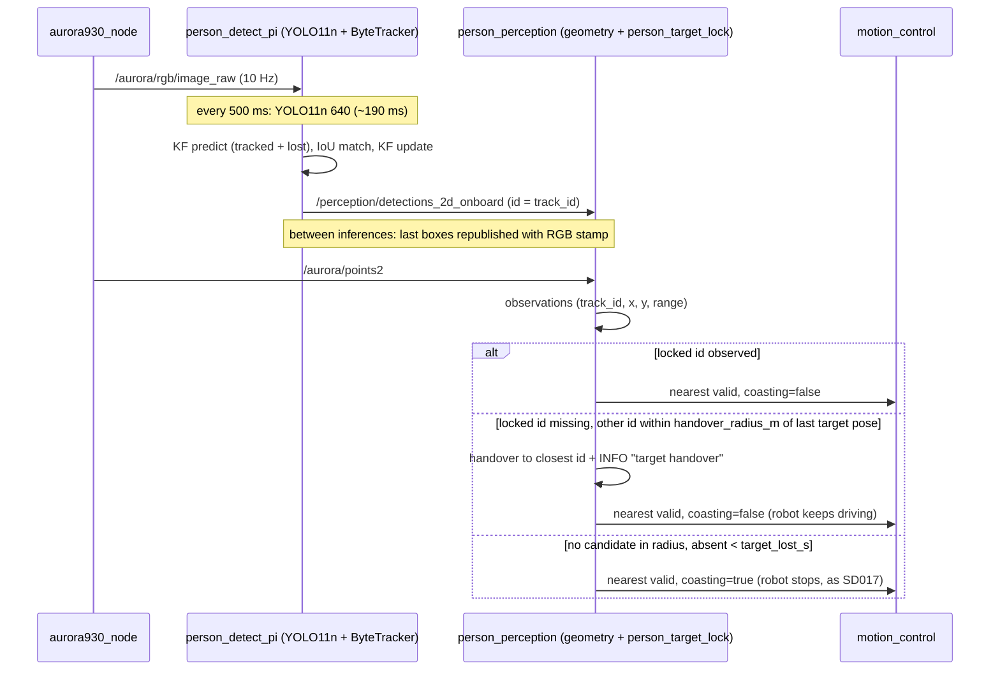

# SD028. Технический дизайн

BA: [solution.md](solution.md). Дизайн UI: skipped (оператор: «UX пропускаем»). Каталог: F08/F09. As-is по бэгу `f11_run1_20260910_170005`: в offline робот стоит треть времени следования — 27 из 29 остановок дают `coasting` после смены track ID у одного и того же человека. Onboard ByteTrack обновляется ~2 Гц (YOLO11n 640 ~190 мс раз в 500 мс), фильтр в порте без скорости, сопоставление `1 − IoU·score` рвётся на score 0.4–0.6, заново найденный трек остаётся устаревшей копией в списке потерянных. Захват SD017 держит пропавший ID до 2 с, `motion_control` всё это время стоит. Модель 640 и частота инференса не меняются (решение оператора в СА). Разнесение инференса и колбэка RGB исключено BA.

## Системный дизайн

1. **D1.** Onboard-сопровождение в `person_detect_pi` доводится до поведения ByteTrack Ultralytics при ~2 Гц обновлений. Модель `yolo11n.ncnn` 640 и `infer_period_ms=500` не меняются.
   1. **D1.1.** Фильтр Калмана постоянной скорости — порт `KalmanFilterXYAH` Ultralytics вместо нынешнего без скорости. Состояние `[cx, cy, a, h, vcx, vcy, va, vh]`, шаг — одно обновление трекера (`dt = 1`, как у Ultralytics). Шумы масштабируются по высоте рамки: `σp = 1/20`, `σv = 1/160`. Инициализация: std `[2σp·h, 2σp·h, 1e-2, 2σp·h, 10σv·h, 10σv·h, 1e-5, 10σv·h]`. Предсказание: `Q = diag([σp·h, σp·h, 1e-2, σp·h, σv·h, σv·h, 1e-5, σv·h]²)`. Обновление: `R = diag([σp·h, σp·h, 1e-1, σp·h]²)`, полный коэффициент `K = P·Hᵀ·S⁻¹`. Предсказание выполняется для tracked и lost; у lost перед ним обнуляется `vh`. Публикуемая рамка берётся из состояния фильтра после обновления, как у Ultralytics.
   2. **D1.2.** Трек, найденный заново, удаляется из списка потерянных, как `sub_stracks` в Ultralytics. Сейчас в порте копия остаётся в lost и при следующей потере того же ID первой попадает в пул сопоставления со старой рамкой — отсюда повторные разрывы ID.
   3. **D1.3.** Сопоставление по чистому IoU (`fuse_score=false`). Пороги стадий — как в Mac `bytetrack.yaml`: `match_thresh` 0.8 (IoU ≥ 0.2), low-стадия 0.5, неподтверждённые 0.7, `track_high_thresh`/`new_track_thresh` 0.25, `track_low_thresh` 0.1. Новый трек по-прежнему публикуется со второго попадания. На рамках `follow_pause` модель трекера даёт 1 ID вместо 2–3 при `fuse_score=true`.
   4. **D1.4.** Потерянный трек живёт `track_buffer_s = 3.0` с по stamp кадра, а не 30 обновлений (сейчас ≈15 с). 3 с — эквивалент Mac: 30 кадров при ~10 Гц RGB. На рамках `follow_pause` (разрывы между непустыми кадрами до 1.8 с) буфер 2 с уже рвёт ID. Просроченный lost удаляется **до** сопоставления, чтобы не найтись заново после срока. Отрицательный шаг stamp считается нулевым. В трекер нода передаёт секунды `header.stamp` кадра инференса.
   5. **D1.5.** Пороги трекера — параметры ноды в YAML, читаются на старте; некорректные значения — отказ старта. Mac `bytetrack.yaml` и `person_detect.py` не меняются.
2. **D2.** Передача цели по месту в `person_target_lock`. Работает при обоих значениях `detections_source`, потому что захват общий.
   1. **D2.1.** Если ID цели нет в наблюдениях, отсутствие меньше `target_lost_s`, а другой ID лежит в пределах `handover_radius_m` (по умолчанию 0.7 м) от последней наблюдённой позиции цели `(x, y)` в `base_footprint`, цель сразу переходит на ближайший к этой позиции ID. Nearest при этом `valid`, не `coasting`, challenger сброшен. Между кандидатами выбор по близости к последней позиции цели, а не по range. `handover_radius_m = 0` выключает передачу.
   2. **D2.2.** Нет кандидата в радиусе — поведение SD017 без изменений: удержание до `target_lost_s`, затем перезахват ближайшего или пустой nearest. Смена по challenger (30 см / 2 с) и первый захват не меняются.
   3. **D2.3.** Результат обновления захвата несёт событие смены цели: первый захват, передача по месту, смена по challenger, перезахват после потери, потеря. В событии — прежний ID; у передачи ещё расстояние и время отсутствия.
   4. **D2.4.** `person_perception` пишет каждое событие отдельной строкой INFO со своим текстом (I5); передача отличима от обычной смены цели. `handover_radius_m` — параметр YAML, читается на старте, отрицательный — отказ старта.
3. **D3.** Не меняется (ограничение scope, задач нет): модель 640 и `infer_period_ms`; инференс в колбэке RGB (разнесение исключено BA); `motion_control` (гейт `!coasting`, закон F11, окна SD027); `mission_control`; геометрия F08; топики `/perception/*` и `mentorpi_msgs`; Mac-детектор; `t1ctl`, `mk/*`, `stage1.launch.py`, `mentorpi_bringup`.
4. **D4.** Версии и каталог.
   1. **D4.1.** `mentorpi_person_detect` 0.1.5 → 0.2.0 (новые параметры и поведение трекера).
   2. **D4.2.** `mentorpi_perception` 0.6.1 → 0.7.0 (передача цели). Каталог SD001: у F08 и F09 в «Требованиях» появляется ссылка на SD028.



## Программные интерфейсы

### Функции модуля C++

1. **I1.** `ByteTracker` — [byte_track.hpp](../../src/mentorpi_person_detect/include/mentorpi_person_detect/byte_track.hpp)
   1. **I1.1.** `struct ByteTrackConfig { float track_high_thresh{0.25f}; float track_low_thresh{0.1f}; float new_track_thresh{0.25f}; float match_thresh{0.8f}; bool fuse_score{false}; double track_buffer_s{3.0}; };` — поле `int track_buffer` снимается.
   2. **I1.2.** `std::vector<TrackedBox> update(const std::vector<DetectionBox>& detections, double stamp_s);` — `stamp_s` = секунды `header.stamp` кадра инференса. `reset()` без изменений.
2. **I2.** Захват — [person_target_lock.hpp](../../src/mentorpi_perception/include/mentorpi_perception/person_target_lock.hpp)
   1. **I2.1.** `PersonTargetLockConfig::handover_radius_m{0.7f}`.
   2. **I2.2.** `enum class PersonTargetLockEvent { kNone, kFirstLock, kHandover, kChallengerSwitch, kLostRelock, kLost };`. В `PersonTargetLockUpdateResult` добавляются `PersonTargetLockEvent event{kNone}`, `std::int32_t previous_track_id{-1}`, `float handover_distance_m{0.0f}`, `double absent_s{0.0}`. Сигнатура `update_person_target_lock(...)` не меняется.

### YAML / параметры ROS

3. **I3.** [person_detect_pi.yaml](../../src/mentorpi_person_detect/config/person_detect_pi.yaml): новые ключи `track_high_thresh: 0.25`, `track_low_thresh: 0.1`, `new_track_thresh: 0.25`, `match_thresh: 0.8`, `fuse_score: false`, `track_buffer_s: 3.0`. Проверки на старте: пороги в `[0, 1]`, `track_low_thresh ≤ track_high_thresh`, `match_thresh > 0`, `track_buffer_s > 0`. Остальные ключи (`infer_period_ms: 500`, `weights`, `num_threads`) без изменений.
4. **I4.** [person_perception.yaml](../../src/mentorpi_perception/config/person_perception.yaml): `handover_radius_m: 0.7` (`≥ 0`, `0.0` — передача выключена; не SLA). В Humble `declare_parameter<double>` не принимает целое `0` — в YAML и в `-p` писать `0.0`.

### Логи

5. **I5.** Строки INFO `person_perception` на события захвата (формат фиксирован, чтобы искать `grep`):
   - `target lock id=9 range=1.37 m`
   - `target handover id=9 -> id=14 dist=0.42 m absent=0.30 s`
   - `target switch id=9 -> id=14 reason=challenger`
   - `target switch id=9 -> id=14 reason=lost_relock absent=2.00 s`
   - `target lost id=9 absent=2.00 s`

   Стартовые строки `person_detect_pi` и `person_perception` дополняются новыми параметрами. Топики и сообщения ROS не меняются.

## Изменения в приложениях

### `mentorpi_person_detect/byte_track`
**Пункты:** D1.1, D1.2, D1.3, D1.4, I1

Порт ByteTrack, который связывает рамки YOLO между инференсами в track ID. Сейчас он отходит от Ultralytics в трёх местах, критичных при ~2 Гц обновлений: предсказание без скорости с постоянными шумами, копирование треков в пул без обратной записи (устаревшая копия в lost), счёт времени жизни в обновлениях. Архитектура модуля (двухстадийное сопоставление, неподтверждённые треки, жадное назначение) остаётся; меняются фильтр, обслуживание списков и единица времени.

1. Вместо `KalmanFilterXYAH` без скорости — порт Ultralytics (D1.1): 8×8 ковариация в `double`, `S⁻¹` 4×4 через Холецкого. `predict()` для всего пула, у lost `vh = 0`. `update()` с полным коэффициентом, выходная рамка — из `mean`.
2. В начале `update()` — удалить lost с `stamp_s − last_update_s > track_buffer_s`; в конце — `lost = lost − (tracked ∪ refind по id) + потерянные в этом кадре`.
3. `fuse_score` по умолчанию `false`, пороги из конфига без хардкода в сопоставлении (0.5 / 0.7 low и unconfirmed остаются константами Ultralytics).
4. Не трогаем: подтверждение нового трека вторым попаданием, активацию на первом кадре после `reset()`, жадное назначение, класс только `person`.

### `mentorpi_person_detect/person_detect_pi`
**Пункты:** D1.4 (вызов), D1.5, I1.2 (вызов), I3, D4.1

Нода гоняет YOLO11n NCNN раз в `infer_period_ms` и между инференсами перепубликует последние рамки. Меняется только конфигурация трекера и то, что в него передаётся stamp кадра.

1. Объявить параметры I3, проверить диапазоны, собрать `ByteTrackConfig`, добавить в стартовый лог (T2).
2. `tracker_->update(detections, rclcpp::Time(msg->header.stamp).seconds())` — вместе со сменой сигнатуры (T1).
3. `package.xml` 0.2.0; YAML с комментариями: источник значений и «не SLA».
4. Не трогаем: модель, `infer_period_ms`, перепубликацию, `enabled`/`reset()`, QoS, топики.

### `mentorpi_perception/person_target_lock`
**Пункты:** D2.1, D2.2, D2.3, I2

Header-only логика захвата SD017: гистерезис challenger, удержание пропавшей цели, перезахват. Добавляется ветка передачи по месту — между «цель видна» и «удержание» — и событие в результате. Остальные ветки не меняются.

1. В ветке «`locked_now == nullptr` и `absent_s < target_lost_s`»: при `handover_radius_m > 0` найти наблюдение с другим ID и минимальным `hypot(x − locked.x, y − locked.y)`. Если расстояние ≤ радиуса — `lock_to_observation`, результат `valid` без `coasting`, событие `kHandover`. Иначе — прежнее удержание с дописыванием цели в `persons`.
2. Проставить события: `kFirstLock`; `kChallengerSwitch` (ID сменился в ветке «цель видна»); `kLostRelock` / `kLost` в ветке `absent_s ≥ target_lost_s`.
3. Не трогаем: пороги 30 см / 2 с, D3.5 (`persons` согласован с nearest при удержании), отсутствие ROS в модуле.

### `mentorpi_perception/person_perception`
**Пункты:** D2.4, I4, I5, D4.2

Нода восприятия считает наблюдения по глубине и публикует результат захвата. Добавляются параметр радиуса и логирование событий захвата; геометрия и выбор источника не меняются.

1. `declare_parameter<double>("handover_radius_m", 0.7)`, `< 0` → `invalid_argument`; значение в `lock_config_` и стартовый лог.
2. В `apply_lock_and_publish` — строка I5 по `lock_result.event`, без троттлинга (события редкие).
3. YAML I4, `package.xml` 0.7.0.
4. Не трогаем: окна SD027, `detections_source`, overlay, DDS ping, геометрию.

### `docs/SD/SD001/tech.md`
**Пункты:** D4.2

Каталог фич: в «Требованиях» F08 и F09 добавить ссылку на [SD028/solution.md](../SD028/solution.md).

## ToDo

Порядок: сначала трекер (без него передача по месту маскирует разрывы ID), затем параметры ноды детекции, затем логика захвата и её подключение в ноде восприятия.

- [x] T1. Порт фильтра Калмана и списков треков Ultralytics в `ByteTracker`
  - **Реализует:** D1.1, D1.2, D1.3, D1.4, I1
  - **Файлы:** `src/mentorpi_person_detect/include/mentorpi_person_detect/byte_track.hpp`, `src/mentorpi_person_detect/src/byte_track.cpp`, `src/mentorpi_person_detect/test/test_byte_track.cpp`, `src/mentorpi_person_detect/src/person_detect_pi.cpp` (только вызов `update()`)
  - **Что нужно сделать:** Заменить в порте ByteTrack фильтр без скорости на `KalmanFilterXYAH` Ultralytics с формулами и шумами из D1.1: предсказание для tracked и lost (у lost обнулить `vh`), полный коэффициент обновления, выходная рамка из состояния фильтра. В конце `update()` удалять из lost треки, найденные заново в этом кадре. Время жизни lost перевести на секунды: `update()` получает `stamp_s`, в начале обновления трек удаляется при `stamp_s − last_update_s > track_buffer_s`, отрицательный шаг stamp считается нулём. В `ByteTrackConfig` поле `track_buffer` заменить на `track_buffer_s{3.0}`, `fuse_score` по умолчанию `false`, остальные пороги — как в Mac `bytetrack.yaml`. В ноде `person_detect_pi` вызов трекера передаёт секунды `header.stamp` кадра инференса — иначе пакет не соберётся.

    Двухстадийное сопоставление, подтверждение нового трека вторым попаданием и активация на первом кадре после `reset()` остаются как есть. В тест прошить фикстуру из бэга `follow_pause_20260910_154522`: 60 кадров инференса за 36.9 с — stamp и рамки из `/perception/detections_2d_onboard` (ширина рамки 98↔47–53 px, score 0.36–0.74, пустые кадры, разрывы между непустыми кадрами до 1.8 с); извлекается `scratch/sd028/a5.py`. Добавить синтетику на скорость, на время жизни и на повторную потерю. Параметры ноды и YAML — в T2.
  - **Критерии приёмки:**
    1. AC1. Фикстура `follow_pause`: все опубликованные рамки несут один и тот же `track_id`.
    2. AC2. Рамка 100×200 px разгоняется с 10 до 90 px за обновление (шаг 10 px) и дальше идёт по 90 px — один ID на всём пути. При 90 px IoU соседних сырых рамок 0.05, то есть без предсказания скорости ID бы порвался.
    3. AC3. Трек, пропавший на 2.9 с по stamp, возвращается с тем же ID; пропавший на 3.1 с — с новым, независимо от числа обновлений между ними.
    4. AC4. Потеря → возврат → смещение рамки → повторная потеря → возврат на новом месте: ID тот же (устаревшей копии в lost нет).
    5. AC5. Прежние проверки живы: новый трек не публикуется до второго попадания, без детекций выход пуст, рамка неподвижного трека совпадает с детекцией в пределах 1 px.
  - **Проверка:** `colcon build --base-paths src --packages-select mentorpi_person_detect`, `colcon test --base-paths src --packages-select mentorpi_person_detect`, `colcon test-result --verbose` в overlay-builder: `test_byte_track` и `test_yolo11n_decode` зелёные.

- [x] T2. Параметры трекера в ноде `person_detect_pi`
  - **Реализует:** D1.5, I3, D4.1
  - **Файлы:** `src/mentorpi_person_detect/src/person_detect_pi.cpp`, `src/mentorpi_person_detect/config/person_detect_pi.yaml`, `src/mentorpi_person_detect/package.xml`
  - **Что нужно сделать:** Нода объявляет шесть параметров трекера из I3 с дефолтами, как в `ByteTrackConfig`, проверяет диапазоны на старте (`invalid_argument`, как у остальных параметров) и собирает из них конфиг трекера. Стартовая строка лога дополняется значениями трекера. В YAML ключи I3 с комментарием: чем Pi отличается от Mac (`fuse_score: false` — score 0.4–0.6 на частичном силуэте рвал сопоставление; `track_buffer_s: 3.0` — эквивалент Mac 30 кадров при ~10 Гц) и что это не SLA. Версия пакета 0.2.0.

    Модель, `infer_period_ms: 500`, перепубликация между инференсами, поведение `enabled` и топики не меняются. Mac `bytetrack.yaml` не трогаем.
  - **Критерии приёмки:**
    1. AC1. После деплоя и `t1ctl restart`: `ros2 param get /person_detect_pi fuse_score` → `False`, `track_buffer_s` → `3.0`; в стартовом логе ноды видны все шесть значений.
    2. AC2. Запуск с `track_low_thresh:=0.5 track_high_thresh:=0.25` или `track_buffer_s:=0.0` — нода не стартует, в логе причина (`track_low_thresh must be <= track_high_thresh` / `track_buffer_s must be > 0`). Не `:=0`: Humble отвергнет integer до проверки диапазона.
    3. AC3. `t1ctl detect offline` — на `/perception/detections_2d_onboard` рамки с `id`; `t1ctl detect mac` — топик молчит, как в SD026.
  - **Проверка:** пользователь `make build` / `make deploy` / `t1ctl restart`; `ros2 param get`, `docker logs mentorpi-t1` (или journal `mentorpi-t1.service`); AC2 — ручной `ros2 run mentorpi_person_detect person_detect_pi --ros-args -p ...` в контейнере при остановленной штатной ноде; AC3 — `ros2 topic echo`.

- [x] T3. Передача цели по месту в `person_target_lock`
  - **Реализует:** D2.1, D2.2, D2.3, I2
  - **Файлы:** `src/mentorpi_perception/include/mentorpi_perception/person_target_lock.hpp`, `src/mentorpi_perception/test/test_person_target_lock.cpp`
  - **Что нужно сделать:** Добавить в конфиг захвата `handover_radius_m` (0.7) и в ветку «цели нет, отсутствие меньше `target_lost_s`» — передачу по месту из D2.1. Среди наблюдений с другим ID берётся ближайшее к последней наблюдённой позиции цели по `(x, y)`. Если оно в радиусе — захват переходит на него сразу: `valid`, не `coasting`, challenger сброшен, в `persons` пропавшая цель не дописывается. При радиусе 0 или без кандидата — прежнее удержание SD017. В результат добавить событие I2.2 и заполнять его во всех ветках: первый захват, передача, смена по challenger, перезахват после потери, потеря; `previous_track_id`, `handover_distance_m`, `absent_s` — где применимо.

    Тесты SD017, где «другой человек» стоит ближе 0.7 м к цели (AC3 coast/relock, AC4 coast appends, return-from-coast), сохраняют смысл: другого человека переносят за радиус, ожидания те же. Новые тесты — на передачу, границу радиуса, выбор между кандидатами, выключатель и события. ROS в модуль не тянем.
  - **Критерии приёмки:**
    1. AC1. Цель id 1 в `(1.0, 0.0)`; следующий кадр без id 1, с id 2 в 0.5 м — nearest `valid`, не `coasting`, id 2, событие `kHandover`, `previous_track_id` 1, `handover_distance_m` 0.5.
    2. AC2. Кандидат в 0.8 м — удержание id 1 с `coasting`, как SD017; через `target_lost_s` — событие `kLostRelock` на ближайшего по range.
    3. AC3. Два кандидата в радиусе — выбирается ближайший к последней позиции цели, даже если у другого range меньше.
    4. AC4. `handover_radius_m = 0` — поведение и события совпадают с SD017 при кандидате в 0.1 м.
    5. AC5. Все прежние тесты SD017 зелёные; смена по challenger даёт `kChallengerSwitch`, первый захват — `kFirstLock`, пустой кадр после `target_lost_s` — `kLost`.
  - **Проверка:** `colcon test --base-paths src --packages-select mentorpi_perception`, `colcon test-result --verbose`: `test_person_target_lock` и `test_person_geometry` зелёные.

- [x] T4. Параметр радиуса и логи событий захвата в `person_perception`, каталог
  - **Реализует:** D2.4, I4, I5, D4.2
  - **Файлы:** `src/mentorpi_perception/src/person_perception.cpp`, `src/mentorpi_perception/config/person_perception.yaml`, `src/mentorpi_perception/package.xml`, `docs/SD/SD001/tech.md`
  - **Что нужно сделать:** Нода объявляет `handover_radius_m` (дефолт 0.7, отрицательный — отказ старта), кладёт его в конфиг захвата и в стартовый лог. В `apply_lock_and_publish` по событию результата пишется одна строка INFO в формате I5, без троттлинга, чтобы по логу между попытками было видно, где цель передана по месту, а где сменилась по правилам SD017. В YAML — ключ I4 с комментарием «SD028; 0.0 — выключено; не SLA». Версия пакета 0.7.0. В каталоге SD001 у F08 и F09 в «Требованиях» добавить ссылку на `SD028/solution.md`.

    Передача действует и при `detections_source=mac`: захват общий, отдельного выключателя по источнику нет (BA). Окна SD027, геометрия, overlay и выбор источника не трогаем.
  - **Критерии приёмки:**
    1. AC1. После деплоя `ros2 param get /person_perception handover_radius_m` → `0.7`; в стартовом логе значение есть.
    2. AC2. В offline при смене ID у человека в кадре в логе есть `target handover id=A -> id=B dist=… absent=…`, а `/perception/nearest_person` в этот момент `valid: true`, `coasting: false`.
    3. AC3. Человек ушёл из кадра — через ~2 с `target lost id=…`, робот стоит, как до SD028.
    4. AC4. `handover_radius_m:=-0.1` при ручном запуске — нода не стартует; `detections_source=mac` — следование работает, строки захвата пишутся тем же форматом.
    5. AC5. В `docs/SD/SD001/tech.md` у F08 и F09 есть ссылка на SD028.
  - **Проверка:** пользователь `make build` / `make deploy` / `t1ctl restart`; `ros2 param get`; `docker logs -f mentorpi-t1 | grep target` во время прогона; `ros2 topic echo /perception/nearest_person`; AC5 — `grep SD028 docs/SD/SD001/tech.md`.

## Покрытие

| Пункт | Задачи |
|-------|--------|
| D1.1 | T1 |
| D1.2 | T1 |
| D1.3 | T1 |
| D1.4 | T1 |
| D1.5 | T2 |
| D2.1 | T3 |
| D2.2 | T3 |
| D2.3 | T3 |
| D2.4 | T4 |
| D4.1 | T2 |
| D4.2 | T4 |
| I1.1 | T1 |
| I1.2 | T1 |
| I2.1 | T3 |
| I2.2 | T3 |
| I3 | T2 |
| I4 | T4 |
| I5 | T4 |

Итог: пунктов 18, задач 4. Непокрытых пунктов нет. D3 — ограничение scope, задач не требует.

## Финальный QA (оператор, T1–T4)

Предусловие: `make build`, `make deploy`, `t1ctl restart`, затем `t1ctl detect offline`, робот в AutoFollow. Приёмка качественная (BA); бэг — для разбора, если что-то не так. Команда записи (с сырыми рамками, которых не было в `f11_run1`):

```bash
ros2 bag record -o f11_sd028_$(date +%Y%m%d_%H%M%S) \
  /perception/detections_2d_onboard /perception/persons /perception/nearest_person \
  /pnc/desired_twist /control/state /pnc/follow_person/status /odom_raw
```

Разбор на машине разработки: `python3 scratch/sd028/a4.py <bag>.db3 1.0` (причины нулевой команды, эпизоды `coasting`), `python3 scratch/sd028/a7.py <bag>.db3 1.0` (остановки в минуту).

### T1 — трекер
1. `colcon test` по `mentorpi_person_detect` зелёный (AC1–AC5).

### T2 — параметры детекции
1. `ros2 param get /person_detect_pi fuse_score` и `track_buffer_s`; стартовый лог (AC1).
2. Ручной запуск с `track_buffer_s:=0.0` — отказ (AC2).
3. `t1ctl detect offline` / `mac` — рамки есть / молчат (AC3).

### T3 — захват
1. `colcon test` по `mentorpi_perception` зелёный (AC1–AC5).

### T4 — передача цели на стенде
1. `ros2 param get /person_perception handover_radius_m` (AC1).
2. Стоять перед роботом на 1.5–3 м: робот подъезжает и встаёт на дистанции следования без промежуточных остановок. Отходить назад и в сторону: едет и доворачивает без остановок. При смене ID в логе `target handover`, остановки нет (AC2).
3. Уйти из кадра: `target lost` через ~2 с, робот стоит. Вернуться — снова едет (AC3).
4. `t1ctl detect mac` + `make mac-detect` — следование как до SD028 (AC4).
5. `grep SD028 docs/SD/SD001/tech.md` (AC5).
