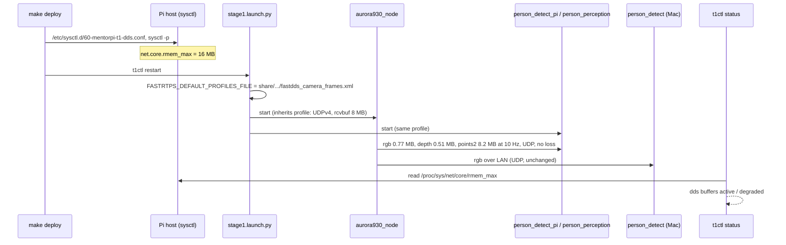

# SD029. Технический дизайн

BA: [solution.md](solution.md). Дизайн UI: skipped (изменение транспорта и одна строка `t1ctl status`). Каталог: F05, F08. СА без Plan-гейта — оператор делегировал решения («всё сам», 2026-09-11).

As-is (замеры 2026-09-11, [SD028 STATUS](../SD028/STATUS.md), зонды `scratch/sd029/`). Все ноды stage1 — отдельные процессы Fast DDS по умолчанию: SHM + UDPv4, буфер приёма UDP = `net.core.rmem_default` = `rmem_max` = 212992 байт. Кадры драйвера Aurora: RGB 0.77 МБ, глубина 0.51 МБ, облако 8.19 МБ (256000 × 32 байта), все best effort для подписчиков. Кадр режется на фрагменты по ~64 КБ; буфер 208 КБ переполняется, и best-effort-подписчик теряет весь кадр. Локальные подписчики получают RGB/глубину 5–7 Гц, облако 0.2–1 Гц, и SHM, и UDP одинаково. Mac по сети (буфер `udp.recvspace` 768 КБ) получает 10 Гц.

Сравнение транспортов в offline, при работающей NCNN, по два прогона:
- **UDPv4 с буфером 8 МБ:** облако 8.2 → 10.1 Гц, глубина и RGB 10.0 Гц; драйвер 84–92 % ядра, подписчик 36–42 %.
- **SHM с сегментом 32 МБ + UDPv4 8 МБ:** 10.0–10.1 Гц по всем трём; драйвер ~85 %, подписчик 46–47 %.

Выбран UDPv4 8 МБ: частота та же, подписчику дешевле, нет сегментов общей памяти по 32 МБ на процесс и их хвостов в `/dev/shm`.

## Системный дизайн

1. **D1.** Все ноды stage1 получают кадры через профиль Fast DDS «только UDPv4, буфер приёма 8 МБ». Встроенные транспорты (SHM + UDP по умолчанию) в профиле выключены.
   1. **D1.1.** Профиль — XML в share `mentorpi_bringup` (`config/fastdds_camera_frames.xml`, I1). Он профиль по умолчанию (`is_default_profile="true"`), поэтому применяется к каждому участнику без правок кода нод. Буфер задаётся в двух местах: `receiveBufferSize` транспорта и `listenSocketBufferSize` участника (оба 8388608). Обнаружение — по UDP, как сейчас (multicast + unicast-пиры Mac из SD016 не трогаем).
   2. **D1.2.** `stage1.launch.py` выставляет `FASTRTPS_DEFAULT_PROFILES_FILE` на путь профиля в share. Делает это до первой ноды, рядом с `MACHINE_TYPE` и `DEPTH_CAMERA_TYPE`. Профиль наследуют все процессы launch, включая вендорный драйвер из `camera_layer` и `foxglove_bridge`. Файла нет — launch не падает: переменная ставится только если файл существует, иначе в лог пишется `[stage1] fastdds profile missing`.
   3. **D1.3.** Процессы вне launch профиль не получают и остаются на транспортах по умолчанию. Это хелперы `t1ctl`, `ros2` CLI оператора, запись бэга, Mac. С нодами стека они совместимы по UDP, мелкие топики и параметры ходят как раньше. Чтобы бэг писал крупные топики без потерь, оператор экспортирует тот же профиль — рецепт в «Финальном QA».
2. **D2.** Потолок буфера сокета на хосте Pi — `net.core.rmem_max = 16777216`. Ядро обрезает запрос `SO_RCVBUF` по этому потолку, так что без него профиль D1 молча получит 208 КБ. `rmem_default` не меняется: большой буфер получают только те, кто его просит.
   1. **D2.1.** Файл `host/sysctl.d/60-mentorpi-t1-dds.conf` (I3).
   2. **D2.2.** `mk/deploy.sh` на каждом деплое ставит файл в `/etc/sysctl.d/` (`install -m 0644 -o root -g root`) и применяет `sysctl -p <файл>`. Это делается до перезапуска контейнера — по образцу unit и `sudoers.d`. После перезагрузки значение восстанавливает systemd-sysctl.
3. **D3.** `t1ctl status` показывает строку `dds buffers` (I4).
   - `active`, если `/proc/sys/net/core/rmem_max` ≥ 8388608 (буфер из профиля D1).
   - Иначе `degraded`, с фактическим значением в байтах и подсказкой `make deploy`.
   - Файл не прочитался — `unknown`.

   `t1ctl` работает на хосте Pi и читает файл напрямую, без `docker exec`. Строка не влияет на код выхода `status`, как и остальные `degraded`. В `t1ctl status --help` появляется строка о ней.
4. **D4.** Не меняется (ограничение scope, задач нет): вендорный драйвер Aurora, его параметры и QoS (RELIABLE); облако и его размер; код `person_perception`, `person_detect_pi`, `motion_control`; окна SD027; Mac-скрипты и `fastdds-lan.xml`; `mentorpi_msgs`; `mk/provision.sh`.
5. **D5.** Версии. `mentorpi_bringup` 0.6.2 → 0.7.0 (minor — новый транспортный профиль), `t1ctl` 1.7.1 → 1.8.0 (minor — новая строка статуса).
6. **D6.** Приёмка на стенде после `make build` / `make deploy`, робот в `forbidden`. Проверяются:
   - `rmem_max` на хосте и переменная профиля в окружении драйвера и нод;
   - зонд с профилем даёт ~10 Гц облака, глубины и RGB в Mac и в offline;
   - onboard-детектор публикует ~10 Гц;
   - Mac-режим живой;
   - `t1ctl status`;
   - неходовые AC SD028 (T2, T4).

   Ходовая приёмка следования — оператор. Каталог SD001: у F05 и F08 появляется ссылка на SD029.



## Программные интерфейсы

### Конфигурация Fast DDS

1. **I1.** `src/mentorpi_bringup/config/fastdds_camera_frames.xml` — профиль по образцу проверенного `scratch/sd029/udp_big.xml`:
   1. **I1.1.** `<transport_descriptor>` `transport_id=udp_camera_frames`, `type=UDPv4`, `receiveBufferSize=8388608`.
   2. **I1.2.** `<participant profile_name="mentorpi_t1_camera_frames" is_default_profile="true">`: `<rtps><listenSocketBufferSize>8388608</listenSocketBufferSize><userTransports><transport_id>udp_camera_frames</transport_id></userTransports><useBuiltinTransports>false</useBuiltinTransports></rtps>`. Комментарий в XML — SD029, откуда 8 МБ (кадр облака 8.19 МБ), не SLA.

### Окружение launch

2. **I2.** `FASTRTPS_DEFAULT_PROFILES_FILE` = `<share mentorpi_bringup>/config/fastdds_camera_frames.xml`. Ставится в `stage1.launch.py` через `SetEnvironmentVariable`, до нод. Остальные переменные (`ROS_LOCALHOST_ONLY=0`, `ROS_DOMAIN_ID`, `RMW_IMPLEMENTATION=rmw_fastrtps_cpp`) не меняются.

### Хост Pi

3. **I3.** `host/sysctl.d/60-mentorpi-t1-dds.conf`: комментарий (SD029, зачем) и строка `net.core.rmem_max = 16777216`.
4. **I4.** Строка `t1ctl status`: ключ `dds buffers`, значения `active` | `degraded (rmem_max 212992 < 8388608, run make deploy)` | `unknown`. Порог — константа 8388608 в коде `t1ctl` рядом с чтением файла, со ссылкой на I1. Help-строки: `active` — «camera frames get the 8 MB socket buffer (SD029)», `degraded` — «rmem_max below 8 MB: camera frames drop on the Pi».

## Изменения в приложениях

### `mentorpi_bringup`
**Пункты:** D1.1, D1.2, D1.3, D5 (bringup), I1, I2

Пакет запускает весь stage1 и уже задаёт окружение для нод. Добавляется транспортный профиль Fast DDS и переменная, которая включает его для всего дерева launch. Код нод не меняется: профиль по умолчанию подхватывает каждый участник сам.

1. Новый `config/fastdds_camera_frames.xml` (I1). Каталог `config` уже ставится в share.
2. `stage1.launch.py`: вычислить путь в share, при наличии файла добавить `SetEnvironmentVariable("FASTRTPS_DEFAULT_PROFILES_FILE", path)` рядом с `MACHINE_TYPE` / `DEPTH_CAMERA_TYPE`, при отсутствии — `LogInfo` с `[stage1] fastdds profile missing`. Комментарий — SD029, одна строка.
3. `package.xml` 0.7.0.
4. Не трогаем: параметры нод и драйвера, `camera_layer.launch.py`, порядок нод.

### Хост Pi: `host/sysctl.d`, `mk/deploy.sh`
**Пункты:** D2.1, D2.2, I3

Деплой уже ставит на хост unit systemd и `sudoers.d`. Так же будет ставиться файл `sysctl.d`, иначе ядро обрежет буфер из профиля.

1. Новый `host/sysctl.d/60-mentorpi-t1-dds.conf` (I3).
2. `mk/deploy.sh`: блок по образцу sudoers — rsync во staging, `sudo install -m 0644 -o root -g root … /etc/sysctl.d/60-mentorpi-t1-dds.conf`, `sudo sysctl -p /etc/sysctl.d/60-mentorpi-t1-dds.conf`. Всё до остановки и перезапуска контейнера. Эхо `==> sysctl rmem_max …` с итоговым значением.
3. Не трогаем: `mk/provision.sh`, остальную логику деплоя.

### `host/t1ctl`
**Пункты:** D3, D5 (t1ctl), I4

CLI оператора на хосте собирает `status` из юнитов systemd и ROS-зонда в контейнере. Добавляется строка, которую `t1ctl` считает сам, из `/proc`, без ROS. Отсутствие настройки SD029 видно сразу.

1. `units`: чтение `rmem_max` из файла (путь параметром — для теста) в `Status` (`have_dds_buffers`, значение).
2. `ui`: строка `dds buffers` по I4 рядом с `camera`/`calibration`; help-строки.
3. Тест в `tests/test_status.cpp`: ≥ 8388608 → `active`, 212992 → `degraded` со значением, нет файла → `unknown`.
4. `CMakeLists.txt` 1.8.0.
5. Не трогаем: коды выхода, остальные строки, `detect`/`mode`/`calib`.

### `docs/SD/SD001/tech.md`
**Пункты:** D6

У F05 и F08 в «Требованиях» добавить ссылку на [SD029/solution.md](../SD029/solution.md).

## ToDo

Порядок: сначала профиль в launch (основное изменение), затем хостовый потолок, без которого профиль молча урезается, затем видимость в `t1ctl`, затем сборка, деплой и проверка на стенде.

- [x] T1. Транспортный профиль Fast DDS для stage1
  - **Реализует:** D1.1, D1.2, D1.3, I1, I2, D5 (bringup)
  - **Файлы:** `src/mentorpi_bringup/config/fastdds_camera_frames.xml`, `src/mentorpi_bringup/launch/stage1.launch.py`, `src/mentorpi_bringup/package.xml`
  - **Что нужно сделать:** Добавить в `mentorpi_bringup` XML-профиль Fast DDS по I1: только UDPv4, `receiveBufferSize` и `listenSocketBufferSize` по 8388608, встроенные транспорты выключены, профиль по умолчанию. За образец взять проверенный `scratch/sd029/udp_big.xml`, имена — из I1. В `stage1.launch.py` вычислить путь к файлу в share пакета. Если файл есть — `SetEnvironmentVariable("FASTRTPS_DEFAULT_PROFILES_FILE", …)` в списке действий до первой ноды, рядом с `MACHINE_TYPE` / `DEPTH_CAMERA_TYPE`. Если нет — `LogInfo` с текстом `[stage1] fastdds profile missing`, launch продолжает работу. Версия пакета 0.7.0.

    Параметры нод, `camera_layer.launch.py`, порядок нод и Mac-скрипты не трогаем. Процессы вне launch профиль не получают (D1.3) — это осознанно, в launch их не тянем.
  - **Критерии приёмки:**
    1. AC1. После `make build` файл есть в `build-arm64/ros/install/mentorpi_bringup/share/mentorpi_bringup/config/fastdds_camera_frames.xml`, XML валиден.
    2. AC2. На стенде после деплоя в `/proc/<pid>/environ` у `aurora930_node`, `person_perception`, `person_detect_pi` есть `FASTRTPS_DEFAULT_PROFILES_FILE` с путём в share.
    3. AC3. Launch без файла профиля не падает, в логе `[stage1] fastdds profile missing`: `python3 -m py_compile`, ветка видна в коде.
  - **Проверка:** AC1 — `make build`, `xmllint --noout`; AC2 — `tr '\0' '\n' < /proc/<pid>/environ | grep FASTRTPS` на хосте Pi; AC3 — чтение кода и `py_compile`.

- [x] T2. Потолок буфера сокета на хосте Pi через деплой
  - **Реализует:** D2.1, D2.2, I3
  - **Файлы:** `host/sysctl.d/60-mentorpi-t1-dds.conf`, `mk/deploy.sh`
  - **Что нужно сделать:** Добавить файл `host/sysctl.d/60-mentorpi-t1-dds.conf`: `net.core.rmem_max = 16777216` и комментарий, зачем (SD029: иначе ядро обрезает 8 МБ из профиля до 208 КБ). В `mk/deploy.sh` по образцу блока `sudoers.d` скопировать файл во staging, установить в `/etc/sysctl.d/` с правами 0644 root:root и применить `sysctl -p` к этому файлу. Всё — до остановки сервиса и перезапуска контейнера. Итоговое значение напечатать строкой `==> sysctl net.core.rmem_max=<value>`. Файла в репо нет — блок пропускается, как у unit.

    `rmem_default` не меняем, `mk/provision.sh` не трогаем: деплой идёт после provision и приносит файл сам.
  - **Критерии приёмки:**
    1. AC1. `make deploy` печатает `==> sysctl net.core.rmem_max=16777216`; на хосте Pi `sysctl -n net.core.rmem_max` → `16777216`, файл `/etc/sysctl.d/60-mentorpi-t1-dds.conf` root:root 0644.
    2. AC2. `net.core.rmem_default` не изменился (212992).
    3. AC3. Остальной вывод деплоя и порядок шагов (overlay, t1ctl, unit, sudoers, restart) без изменений.
  - **Проверка:** `make deploy`, затем `ssh pi@… 'sysctl net.core.rmem_max net.core.rmem_default; ls -l /etc/sysctl.d/60-mentorpi-t1-dds.conf'`.

- [x] T3. Строка `dds buffers` в `t1ctl status`
  - **Реализует:** D3, I4, D5 (t1ctl)
  - **Файлы:** `host/t1ctl/src/units.hpp`, `host/t1ctl/src/units.cpp`, `host/t1ctl/src/ui.cpp`, `host/t1ctl/src/main.cpp` (если там сбор `Status`), `host/t1ctl/tests/test_status.cpp`, `host/t1ctl/CMakeLists.txt`
  - **Что нужно сделать:** `t1ctl` на хосте читает `/proc/sys/net/core/rmem_max`; путь передаётся параметром, чтобы тест мог подменить файл. Результат кладётся в `Status`. `status` печатает строку `dds buffers` по I4: `active` при значении ≥ 8388608, иначе `degraded (rmem_max <N> < 8388608, run make deploy)`, при ошибке чтения — `unknown`. Строка стоит рядом с `camera`/`calibration`, в том же стиле и с той же раскраской. В help статуса — строки для `active` и `degraded`. Порог — именованная константа с комментарием о профиле SD029. Версия `t1ctl` 1.8.0.

    Коды выхода и остальные строки не меняем, в `docker exec` не ходим. Тест добавляется в существующий `t1ctl_test`, без новых целей.
  - **Критерии приёмки:**
    1. AC1. `t1ctl_test` зелёный, с новыми проверками: 16777216 → `active`, 212992 → `degraded` со значением 212992, нет файла → `unknown`.
    2. AC2. На стенде после деплоя `t1ctl status` показывает `dds buffers active`, `t1ctl --version` → `1.8.0`.
    3. AC3. Временно `sudo sysctl -w net.core.rmem_max=212992` — `t1ctl status` показывает `degraded (rmem_max 212992 < 8388608, run make deploy)`, код выхода как раньше; после `sudo sysctl -p /etc/sysctl.d/60-mentorpi-t1-dds.conf` снова `active`.
  - **Проверка:** AC1 — локально `cmake -S host/t1ctl -B host/t1ctl/build-host && cmake --build host/t1ctl/build-host && ctest --test-dir host/t1ctl/build-host`, или в сборщике; AC2–AC3 — на стенде.

- [x] T4. Сборка, деплой и приёмка на стенде
  - **Реализует:** D6
  - **Файлы:** `docs/SD/SD001/tech.md`, `docs/SD/SD029/STATUS.md`
  - **Что нужно сделать:** `make build` и `make deploy`, затем на стенде при роботе в `forbidden` снять всё, что проверяется без движения. Это `rmem_max` и переменная профиля в процессах; частоты облака, глубины и RGB зондом `scratch/sd029/depth_probe.py`, запущенным с тем же профилем, в `mac` и в `offline`. Сюда же — частота `/perception/detections_2d_onboard` в offline, живой Mac-режим (`make mac-detect` на Mac, рамки ~10 Гц в `/perception/detections_2d`) и `t1ctl status`. Там же прогнать неходовые AC SD028: T2 AC1–AC3 и T4 AC1, AC4. Результаты — в STATUS SD029, ссылки на SD029 — у F05 и F08 в каталоге SD001.

    Ходовые проверки (следование, повороты) делает оператор. Стенд вернуть в штатное состояние: `source: mac`, `forbidden`.
  - **Критерии приёмки:**
    1. AC1. Зонд с профилем в offline при работающей NCNN: облако, глубина, RGB ≥ 9 Гц, разрывы < 0.5 с; в mac — так же.
    2. AC2. `/perception/detections_2d_onboard` в offline ~10 Гц (было 7.1).
    3. AC3. Mac-режим: рамки Mac доходят до робота ~10 Гц, `person_perception` принимает их (`source: mac`).
    4. AC4. Неходовые AC SD028 выполнены или расхождение записано в STATUS.
    5. AC5. В SD001 у F05 и F08 есть ссылка на SD029.
  - **Проверка:** команды из «Финального QA».

## Покрытие

| Пункт | Задачи |
|-------|--------|
| D1.1 | T1 |
| D1.2 | T1 |
| D1.3 | T1 |
| D2.1 | T2 |
| D2.2 | T2 |
| D3 | T3 |
| D5 | T1, T3 |
| D6 | T4 |
| I1.1 | T1 |
| I1.2 | T1 |
| I2 | T1 |
| I3 | T2 |
| I4 | T3 |

Итог: пунктов 13, задач 4. Непокрытых нет. D4 — ограничение scope. D5 разделён по компонентам: bringup — T1, t1ctl — T3.

## Финальный QA (T1–T4)

Предусловие: `make build`, `make deploy`, робот в `t1ctl mode forbid`. Питание стенда от блока — просадка ожидаема.

1. Хост: `sysctl net.core.rmem_max net.core.rmem_default` → 16777216 / 212992; `t1ctl status | grep dds` → `active`; `t1ctl --version` → 1.8.0.
2. Профиль в процессах: `for p in $(pgrep -x aurora930_node) $(pgrep -f lib/mentorpi_perception/person_perception); do tr '\0' '\n' < /proc/$p/environ | grep FASTRTPS; done`.
3. Частоты — зонд с тем же профилем:

   ```bash
   docker exec -u ubuntu mentorpi-t1 bash -c '
     source /home/ubuntu/ros2_ws/.hiwonderrc; export ROS_LOCALHOST_ONLY=0;
     source /home/ubuntu/mentorpi_t1_ws/install/setup.bash;
     export FASTRTPS_DEFAULT_PROFILES_FILE=/home/ubuntu/mentorpi_t1_ws/install/mentorpi_bringup/share/mentorpi_bringup/config/fastdds_camera_frames.xml;
     python3 /tmp/depth_probe.py 15 check'
   ```

   В `mac` и после `t1ctl detect offline`.
4. Запись бэга с крупными топиками — тот же `export FASTRTPS_DEFAULT_PROFILES_FILE=…` перед `ros2 bag record` (D1.3).
5. Ходовая проверка (оператор): offline — стоять перед роботом, отходить, уходить в сторону: без рывков, без перекрута.
