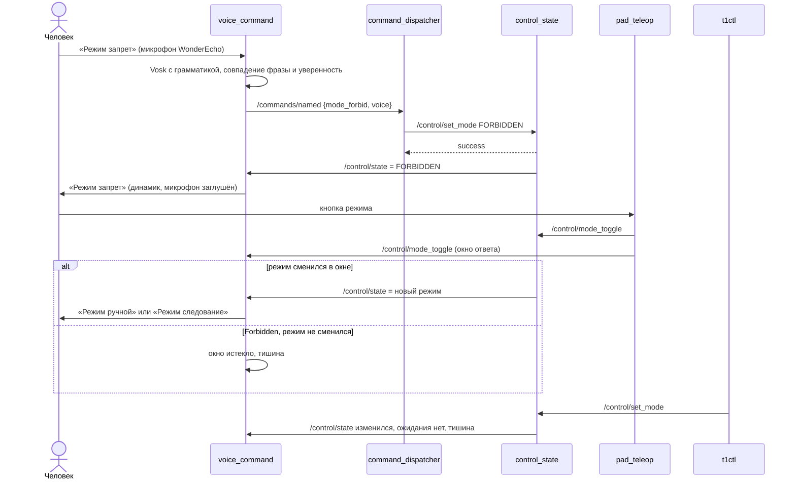

# SD031. Технический дизайн

BA: [solution.md](solution.md). Дизайн UI: skipped (экранов нет, решение оператора). Каталог: F21.

Как сейчас. Режим меняют кнопкой пульта (`pad_teleop` → `/control/mode_toggle` → `control_state`, только `Manual` ↔ `AutoFollow`, из `Forbidden` кнопка не выводит) и `t1ctl mode` (сервис `/control/set_mode`, принимает любой допустимый режим из любого состояния, `control_mode.hpp`). Голос в overlay: `command_dispatcher` + `voice_command` (SD031). WonderEcho Pro на стенде T7 (2026-09-13) подключён как USB PnP Audio (`0c76:161f`, ALSA-карта `Device`); см. As-built. Детекция offline занимает ядра Pi 5 на 63–69 % (SD030). После первого SD031 provision ноды perception падали без `libvision_msgs`; в runtime-образ добавлен `ros-humble-vision-msgs`.

Решения оператора по СА (2026-09-13): распознавание Vosk small-ru; libvosk и модель в образе сборщика, как ncnn; ответ синтезируется на Pi; контракт команды это отдельный топик и отдельная новая нода, не `mission_control`.

## Системный дизайн

1. **D1.** Контракт «именованная команда запускает поведение»: топик `/commands/named` и новая нода `command_dispatcher` в пакете `mentorpi_commands` 0.1.0. Сообщение `NamedCommand` в `mentorpi_msgs` 1.3.0.
   1. **D1.1.** Таблица «имя → поведение» живёт в коде ноды: `mode_forbid` → `Forbidden`, `mode_follow` → `AutoFollow`, `mode_manual` → `Manual`. Поведение у всех трёх одно: вызов `/control/set_mode` с целевым режимом. Неизвестное имя: WARN, сообщение отбрасывается.
   2. **D1.2.** Вызов асинхронный. Сервис не готов или ответа нет за `set_mode_timeout_ms`: WARN, команда пропадает без очереди и без повтора (запоздавшая смена режима опаснее потерянной). QoS топика volatile: нода, поднятая позже, старую команду не получает.
   3. **D1.3.** Нода не знает, кто прислал команду: `source` идёт только в лог. Правила режимов остаются в `control_state`; раз `SetControlMode` принимает любой режим из любого состояния, голос выводит из `Forbidden` и «действует последняя команда» без нового кода.
2. **D2.** Голосовая нода `voice_command` в пакете `mentorpi_voice` 0.1.1 владеет микрофоном и динамиком.
   1. **D2.1.** Распознавание. ALSA-захват `capture_device` (16 кГц, S16_LE, через `plughw`) в отдельном потоке кормит распознаватель Vosk, созданный с грамматикой из `phrases` плюс `[unk]` и выдачей слов с уверенностью. Финальный результат нормализуется и сравнивается с фразами целиком; совпадение и уверенность каждого слова не ниже `min_confidence` дают публикацию `NamedCommand{name: commands[i], source: "voice"}`. Остальное пишется в лог как проигнорированное, с троттлингом.
   2. **D2.2.** Ответ. На старте нода синтезирует каждую фразу из `phrases` командой `tts_command` (RHVoice, голос `tts_voice`) в WAV в `tts_cache_dir` и держит PCM в памяти. Проигрывание идёт отдельным потоком в `playback_device`. Отдельного списка ответов нет: текст ответа берётся из `phrases`, поэтому фраза команды и ответ совпадают по построению.
   3. **D2.3.** Когда отвечать. После своей голосовой команды нода ждёт на `/control/state` режим `states[i]` до `announce_timeout_ms` (если режим уже включён, отвечает сразу) и произносит его фразу; не дождалась: WARN, молчит. После `/control/mode_toggle` открывается окно `pad_announce_window_ms`: смена режима внутри окна озвучивается фразой нового режима, нет смены (кнопка в `Forbidden`) — тишина. Смена режима без своей команды и без кнопки (`t1ctl`, первое сообщение после старта) не озвучивается. Новая фраза заменяет ещё не начатую.
   4. **D2.4.** Эхо. Пока играет ответ и ещё `mute_tail_ms`, поток захвата читает устройство, но выбрасывает кадры и сбрасывает распознаватель, чтобы робот не принял свой ответ за команду.
   5. **D2.5.** Отказы.
      1. **D2.5.1.** Нет устройства захвата: WARN с троттлингом, переоткрытие раз в `retry_ms`. Модель не загрузилась: ERROR, распознавание выключено, нода жива. Ошибка конфига (разная длина `phrases`/`commands`/`states`, режим не 0–2 или повторён) роняет ноду на старте.
      2. **D2.5.2.** Синтез не удался или нет устройства вывода: ERROR/WARN, ответа нет, распознавание и публикация команд работают.
      3. **D2.5.3.** Нода не вызывает `/control/set_mode`, не публикует Twist и не трогает шасси.
3. **D3.** Зависимости.
   1. **D3.1.** Образ `mentorpi-overlay-builder:arm64` получает `vosk-linux-aarch64-0.3.45.zip` (`libvosk.so`, `vosk_api.h`) в `/opt/vosk` и `vosk-model-small-ru-0.22` (45 МБ, Apache 2.0) в `/opt/vosk-models`, суммы sha256 закреплены; apt `libasound2-dev`, `nlohmann-json3-dev`. Колкон ставит `libvosk.so` в `lib/` пакета (RUNPATH `$ORIGIN/..`) и модель в `share/mentorpi_voice/models`, сеть на `make overlay` не нужна. v0.3.45 выбрана потому, что у v0.3.50 на GitHub нет бинарей.
   2. **D3.2.** Runtime-образ `mentorpi-t1` получает apt `libasound2`, `rhvoice`, `rhvoice-russian` (jammy multiverse, 1.2.3, arm64) и `ros-humble-vision-msgs` (SD013: overlay-ноды perception; stock-образ её не содержит). `mk/provision.sh` пересобирает образ, если нет голосового стека или `libvision_msgs`, по образцу проверок камеры и IMU.
4. **D4.** Launch: `stage1.launch.py` поднимает `command_dispatcher` всегда и `voice_command` по аргументу `enable_voice` (по умолчанию `true`), рядом с `mission_control`. `mentorpi_bringup` 0.8.0.
5. **D5.** Не меняется (ограничение scope): `control_state` и правила режимов, `pad_teleop` (кнопка из `Forbidden` не выводит), `control_mux` (нули при запросе остановки в любом режиме, поэтому голос их не снимает), `mission_control`, `platform_adapter`, `t1ctl`, systemd-юнит, `mk/deploy.sh`, Makefile. Смена режима через `t1ctl` не озвучивается.
6. **D6.** Приёмка на стенде: As-built (ALSA-карта WonderEcho, свободна ли она от звукового сервера хоста), сборка, provision, деплой; неходовые проверки делает агент при роботе в `forbidden` и шлёт только `mode_forbid`; голосовые проверки, калибровку `min_confidence` и `mute_tail_ms` делает оператор. Загрузка ядер с голосом записывается рядом с замером SD030. У F21 в каталоге SD001 появляется ссылка на SD031.

### As-built (стенд T7, `pi@192.168.88.56`, контейнер `mentorpi-t1`)

Снято 2026-09-13 после подключения WonderEcho, `make overlay` и `make deploy`. `alsa-utils` уже в runtime-образе (проверка `arecord`/`aplay` в контейнере без `apt-get`).

| Параметр | Значение |
|----------|----------|
| SSH | Ethernet `192.168.88.56` (Wi-Fi `192.168.149.1` не проверялся) |
| WonderEcho USB | подключён: хост `lsusb` → `0c76:161f JMTek, LLC. USB PnP Audio Device` (Bus 003); в контейнере `lsusb` нет, карта видна через `/proc/asound/cards` |
| ALSA-карты (`/proc/asound/cards`) | `vc4hdmi0`, `vc4hdmi1` (HDMI Pi 5), `Device` (USB PnP Audio Device, card 2) |
| `arecord -l` | `card 2: Device [USB PnP Audio Device], device 0` |
| `aplay -l` | `card 0/1: vc4hdmi*`, `card 2: Device`, device 0 playback |
| `plughw:CARD=Device,DEV=0` capture | `arecord -f S16_LE -r 16000 -c 1 -d 1` → OK (32044 B); `-c 2` → OK (64044 B) |
| `plughw:CARD=Device,DEV=0` playback | `aplay` 1 с тишины 16 кГц моно → OK |
| Pulse/PipeWire на хосте | PipeWire + WirePlumber; sink/source `alsa_*usb-0c76_USB_PnP_Audio_Device*` (SUSPENDED); `fuser /dev/snd/controlC2` → wireplumber; `plughw` открывается несмотря на Pulse |
| bind-mount Pulse | `/run/user/1000/pulse` → контейнер (как SD012) |
| `voice_command.yaml` `capture_device` / `playback_device` | `plughw:CARD=Device,DEV=0` |
| `capture_channels` | `1` (моно 16 кГц открывается; стерео тоже OK) |
| RHVoice в образе | `command -v RHVoice-test` → `/usr/bin/RHVoice-test`; `ldconfig -p \| grep libasound.so.2` — есть |
| TTS-кеш при старте | `/tmp/mentorpi_voice/0.wav`, `1.wav`, `2.wav` (три фразы, 24 кГц RHVoice) |
| Захват после yaml | без постоянного `capture open failed` (см. журнал после рестарта) |



## Программные интерфейсы

### ROS: сообщения и топики

1. **I1.** `mentorpi_msgs/msg/NamedCommand.msg` (новое):
   ```
   # SD031: именованная команда; поведение выбирает command_dispatcher.
   string name    # mode_forbid | mode_follow | mode_manual
   string source  # кто прислал: voice, test, ...
   ```
2. **I2.** Топик `/commands/named` (`NamedCommand`), QoS reliable, KeepLast(10), volatile. Подписчик: `command_dispatcher`. Издатели: `voice_command` (`source: voice`), ручная проверка `ros2 topic pub --once`.
3. **I3.** Имена команд: `mode_forbid` → `ControlState.FORBIDDEN` (0), `mode_follow` → `AUTO_FOLLOW` (2), `mode_manual` → `MANUAL` (1). Сравнение строгое, с учётом регистра.
4. **I4.** Используются без изменений:
   1. **I4.1.** `/control/set_mode` (`SetControlMode`), клиент в `command_dispatcher`.
   2. **I4.2.** `/control/state` (`ControlState`, reliable, transient_local) и `/control/mode_toggle` (`std_msgs/Empty`, reliable, KeepLast 1), подписки в `voice_command`.

### Параметры

5. **I5.** `command_dispatcher`: `set_mode_timeout_ms: 1000`.
6. **I6.** [voice_command.yaml](../../../src/mentorpi_voice/config/voice_command.yaml). Числа ниже стартовые значения для калибровки в T7, не SLA.
   1. **I6.1.** Распознавание: `capture_device: "plughw:CARD=Device,DEV=0"` (As-built T7, USB PnP Audio `0c76:161f`), `sample_rate: 16000`, `capture_channels: 1`, `model_dir: ""` (пусто → `share/mentorpi_voice/models/vosk-model-small-ru-0.22`), `phrases: ["режим запрет", "режим следование", "режим ручной"]`, `commands: ["mode_forbid", "mode_follow", "mode_manual"]`, `states: [0, 2, 1]`, `min_confidence: 0.6`, `retry_ms: 1000`.
   2. **I6.2.** Ответ: `playback_device: "plughw:CARD=Device,DEV=0"` (As-built T7), `tts_command: "RHVoice-test"`, `tts_voice: "anna"`, `tts_cache_dir: "/tmp/mentorpi_voice"`, `announce_timeout_ms: 1000`, `pad_announce_window_ms: 1000`, `mute_tail_ms: 300`.

### Функции модулей C++

7. **I7.** `mentorpi_commands/command_table.hpp`: `std::optional<uint8_t> control_mode_for_command(std::string_view name);` по таблице I3, иначе `std::nullopt`.
8. **I8.** `mentorpi_voice/phrase_match.hpp`:
   - `std::string normalize_phrase(std::string_view text);` нижний регистр кириллицы и латиницы в UTF-8, `ё` → `е`, обрезка и схлопывание пробелов;
   - `std::optional<size_t> match_phrase(std::string_view text, const std::vector<std::string>& phrases);` точное совпадение нормализованных строк; `[unk]` в тексте и неполная фраза не совпадают;
   - `bool words_confident(const std::vector<double>& word_conf, double min_conf);` пустой список → `false`.
9. **I9.** `mentorpi_voice/announce_policy.hpp`, время передаётся аргументом (`std::chrono::steady_clock::time_point`):
   - `class AnnouncePolicy { void on_voice_command(uint8_t expected_state, time_point now); void on_pad_toggle(time_point now); std::optional<uint8_t> on_state(uint8_t state, time_point now); std::optional<uint8_t> expire(time_point now); }` — `on_state` отдаёт режим, который надо озвучить; `expire` отдаёт режим голосовой команды, не дождавшейся подтверждения (для WARN);
   - `class MuteWindow { void on_playback(time_point start, time_point end); bool muted(time_point now) const; }` с хвостом `mute_tail_ms`.
10. **I10.** `mentorpi_voice/wav_pcm.hpp`: `std::optional<PcmClip> read_wav_pcm16(const std::string& path);` (`sample_rate`, `channels`, `samples`); не RIFF/WAVE, не PCM16 или битый заголовок → `std::nullopt`.

### Логи

11. **I11.** Строки логов.
    1. **I11.1.** `command_dispatcher`: `command_dispatcher started (set_mode_timeout_ms=%ld)`; `command name=%s source=%s -> set_mode target=%u`; `command name=%s source=%s done success=%d active_state=%u`; WARN `command rejected name=%s source=%s reason=%s` (`unknown command` | `set_mode unavailable` | `set_mode timeout`).
    2. **I11.2.** `voice_command`, распознавание: стартовая строка со всеми параметрами I6.1; `heard "%s" conf_min=%.2f -> %s`; `ignored "%s" conf_min=%.2f reason=%s` (троттлинг 2 с); WARN `capture open failed device=%s: %s` (троттлинг); ERROR `model load failed dir=%s`.
    3. **I11.3.** `voice_command`, ответ: стартовая строка с параметрами I6.2; `tts ready "%s" -> %s (%u Hz)`; ERROR `tts failed "%s": %s`; `announce "%s" trigger=voice|pad`; WARN `announce skipped: state %u not reached in %ld ms`; WARN `playback failed device=%s: %s`.

### Сборка

12. **I12.** Окружение сборки и образа.
    1. **I12.1.** `docker/overlay-builder/Dockerfile`: `ARG VOSK_VERSION=0.3.45`, `ARG VOSK_SHA256`, `ARG VOSK_MODEL=vosk-model-small-ru-0.22`, `ARG VOSK_MODEL_SHA256`; `ENV VOSK_ROOT=/opt/vosk`, `ENV VOSK_MODEL_DIR=/opt/vosk-models/vosk-model-small-ru-0.22`.
    2. **I12.2.** `mentorpi_voice/CMakeLists.txt`: Vosk из `$ENV{VOSK_ROOT}` (иначе `FATAL_ERROR`), `install(FILES libvosk.so DESTINATION lib)`, `INSTALL_RPATH "$ORIGIN/.."` у `voice_command`, модель из `$ENV{VOSK_MODEL_DIR}` в `share/mentorpi_voice/models`.
    3. **I12.3.** `docker/mentorpi-t1/Dockerfile`: apt `libasound2 rhvoice rhvoice-russian` и `ros-humble-vision-msgs`; `mk/provision.sh`: `image_has_voice_stack` (`RHVoice-test` и `libasound.so.2`) и `image_has_vision_msgs` (`libvision_msgs__rosidl_typesupport_cpp.so`).

## Изменения в приложениях

### `mentorpi_msgs`
**Пункты:** D1 (сообщение), I1

Пакет контрактов overlay. Добавляется одно сообщение для именованной команды; существующие типы не трогаются.

1. `msg/NamedCommand.msg` по I1, строка в `rosidl_generate_interfaces`.
2. `package.xml` 1.3.0.
3. Не трогаем `SetControlMode.srv`, `ControlState.msg`, `ControlStatus.msg`.

### `docker/overlay-builder`
**Пункты:** D3.1, I12.1

Образ сборщика держит всё, что нельзя поставить во время colcon. По образцу ncnn (SD026) в него добавляются libvosk, модель и заголовки ALSA и JSON.

1. apt `libasound2-dev`, `nlohmann-json3-dev`, `unzip`, `curl`, `ca-certificates`.
2. Скачивание двух архивов с проверкой sha256 и распаковка в `/opt`; `ENV` из I12.1; комментарий SD031.
3. Не трогаем ncnn и остальные пакеты.

### `mentorpi_commands` (новый)
**Пункты:** D1.1, D1.2, D1.3, I2, I3, I4.1, I5, I7, I11.1

Новая нода между источниками команд и поведением. Источник знает только имя команды, нода знает, что это имя делает. Сейчас единственное поведение это смена режима через уже существующий сервис `control_state`.

1. `include/mentorpi_commands/command_table.hpp` (I7) и тест `test_command_table` в стиле `mission_control` (`add_test`, без gtest).
2. `src/command_dispatcher.cpp`: подписка I2, асинхронный клиент I4.1 с таймаутом I5, логи I11.1.
3. `package.xml` 0.1.0, CMake по образцу `mission_control` (typesupport `mentorpi_msgs`).
4. Нельзя: публиковать Twist, хранить режим у себя, повторять или откладывать команды.

### `mentorpi_voice` (новый)
**Пункты:** D2.1, D2.2, D2.3, D2.4, D2.5.1, D2.5.2, D2.5.3, I4.2, I6, I8, I9, I10, I11.2, I11.3, I12.2

Нода-владелец звука: слушает микрофон, превращает фразу в имя команды и озвучивает режим. Чистая логика (сопоставление, политика ответа, WAV) вынесена в header-only модули с тестами, нода связывает их с ALSA, Vosk, RHVoice и ROS.

1. Header-only I8, I9, I10 и тесты `test_phrase_match`, `test_announce_policy`, `test_wav_pcm`.
2. `src/voice_command.cpp`: параметры I6 с проверкой на старте, поток захвата и распознавания, публикация I2, синтез и поток проигрывания, подписки I4.2, логи I11.2 и I11.3.
3. `config/voice_command.yaml` (I6), CMake по I12.2, тест `test_vosk_phrases` на WAV-фикстурах в `test/data`.
4. Нельзя: вызывать `/control/set_mode`, публиковать Twist, озвучивать смену режима без своей команды или кнопки пульта.

### `docker/mentorpi-t1` и `mk/provision.sh`
**Пункты:** D3.2, I12.3

Runtime-образ на Pi собирается `FROM` образа `MentorPi`. Туда добавляется синтезатор и ALSA; provision учится замечать образ без них.

1. apt `libasound2 rhvoice rhvoice-russian` в том же `RUN`, где `foxglove-bridge`; если в источниках образа нет `multiverse`, он включается в том же шаге.
2. `image_has_voice_stack` в `provision.sh`, причина пересборки в выводе.
3. Не трогаем Deptrum, OpenCV, `pyserial`, `docker rm MentorPi` не появляется.

### `mentorpi_bringup`
**Пункты:** D4

Launch этапа 1. Добавляются две ноды SD031.

1. `command_dispatcher` (параметры I5) и `voice_command` (YAML из share, `IfCondition(enable_voice)`), `DeclareLaunchArgument("enable_voice", default_value="true")`, строки F21 в docstring и списке фич.
2. `package.xml` 0.8.0, `exec_depend` на `mentorpi_commands` и `mentorpi_voice`.
3. Не трогаем остальные ноды, их параметры и порядок.

## ToDo

Порядок: сначала контракт (от него зависит голос), затем зависимости сборки, затем чистая логика голоса, распознавание, ответ, образ и launch, в конце стенд.

- [x] T1. Контракт именованной команды и `command_dispatcher`
  - **Реализует:** D1.1, D1.2, D1.3, I1, I2, I3, I4.1, I5, I7, I11.1, F21
  - **Файлы:** `src/mentorpi_msgs/msg/NamedCommand.msg`, `src/mentorpi_msgs/CMakeLists.txt`, `src/mentorpi_msgs/package.xml`, `src/mentorpi_commands/CMakeLists.txt`, `src/mentorpi_commands/package.xml`, `src/mentorpi_commands/include/mentorpi_commands/command_table.hpp`, `src/mentorpi_commands/src/command_dispatcher.cpp`, `src/mentorpi_commands/test/test_command_table.cpp`
  - **Что нужно сделать:** В `mentorpi_msgs` появляется `NamedCommand` (I1), версия 1.3.0. Новый пакет `mentorpi_commands` 0.1.0 собирается по образцу `mission_control`: ament_cmake, C++17, typesupport `mentorpi_msgs`, тесты через `add_test` без gtest. В нём header-only `control_mode_for_command` по таблице I3 и нода `command_dispatcher`, подписанная на `/commands/named` с QoS I2. На каждое сообщение нода ищет имя в таблице: неизвестное даёт WARN и отбрасывается, известное уходит асинхронным вызовом `/control/set_mode`, если `service_is_ready()`. Сервис не готов или ответа нет за `set_mode_timeout_ms`: WARN, команда пропадает без очереди и повтора. Логи строго по I11.1.

    Нода не публикует Twist, не хранит режим и не смотрит на `source` дальше лога. Правила режимов остаются в `control_state`, поэтому выход из `Forbidden` голосом и «последняя команда побеждает» получаются без нового кода. В launch нода попадает в T6.
  - **Критерии приёмки:**
    1. AC1. `test_command_table`: `mode_forbid` → 0, `mode_follow` → 2, `mode_manual` → 1; пустая строка, `MODE_FORBID` и `mode_stop` → пусто.
    2. AC2. `ros2 interface show mentorpi_msgs/msg/NamedCommand` в сборщике показывает `name` и `source`; новый код собирается без предупреждений `-Wall -Wextra -Wpedantic`.
    3. AC3. `control_state` и `command_dispatcher`, запущенные вручную в сборщике: `ros2 topic pub --once /commands/named mentorpi_msgs/msg/NamedCommand "{name: mode_forbid, source: test}"` переводит `/control/state` в 0, в логе `done success=1 active_state=0`.
    4. AC4. `{name: mode_stop}` не меняет `/control/state`, в логе `command rejected name=mode_stop source=test reason=unknown command`.
    5. AC5. Без `control_state` команда даёт `reason=set_mode unavailable`, нода жива; `control_state`, запущенный после этого, остаётся в `AutoFollow` (старая команда не доходит).
  - **Проверка:** в `mentorpi-overlay-builder:arm64`: `colcon build --base-paths src --packages-up-to mentorpi_commands` и `colcon test --packages-select mentorpi_commands`; `ros2 run mentorpi_control control_state` и `ros2 run mentorpi_commands command_dispatcher` в одном контейнере, `ros2 topic echo /control/state`, `ros2 topic pub --once`.

- [x] T2. Vosk и модель в образе сборщика
  - **Реализует:** D3.1, I12.1
  - **Файлы:** `docker/overlay-builder/Dockerfile`
  - **Что нужно сделать:** В образ `mentorpi-overlay-builder:arm64` добавляются apt `libasound2-dev`, `nlohmann-json3-dev`, `unzip`, `curl`, `ca-certificates` и два архива: `https://github.com/alphacep/vosk-api/releases/download/v0.3.45/vosk-linux-aarch64-0.3.45.zip` распаковывается в `/opt/vosk` (плоско: `libvosk.so`, `vosk_api.h`), `https://alphacephei.com/vosk/models/vosk-model-small-ru-0.22.zip` в `/opt/vosk-models/vosk-model-small-ru-0.22`. Версии и sha256 задаются `ARG` (I12.1), `sha256sum -c` роняет сборку образа при несовпадении; суммы считаются один раз при первой сборке и вписываются в Dockerfile. `ENV VOSK_ROOT` и `VOSK_MODEL_DIR`, комментарий SD031 рядом с блоком ncnn.

    Сеть нужна только при `make env-overlay`; `make overlay` ничего не скачивает (как SD026). v0.3.45 взята потому, что это последний релиз vosk-api с бинарями под aarch64. Makefile не меняется: штамп образа уже зависит от Dockerfile.
  - **Критерии приёмки:**
    1. AC1. `make env-overlay` собирает образ; в нём есть `/opt/vosk/libvosk.so`, `/opt/vosk/vosk_api.h`, `/opt/vosk-models/vosk-model-small-ru-0.22/am` и `.../graph`.
    2. AC2. `file /opt/vosk/libvosk.so` → ELF 64-bit ARM aarch64; `ldd /opt/vosk/libvosk.so` без `not found`.
    3. AC3. Испорченная сумма в `ARG` роняет `docker build` на шаге проверки.
    4. AC4. `make overlay` для текущего `src/` собирается как до изменения (ncnn на месте).
  - **Проверка:** `make env-overlay`; `docker run --rm --platform linux/arm64 mentorpi-overlay-builder:arm64 bash -c 'ls /opt/vosk /opt/vosk-models/*; file /opt/vosk/libvosk.so; ldd /opt/vosk/libvosk.so'`; сборка с `--build-arg VOSK_SHA256=0`; `make overlay`.

- [x] T3. Чистая логика голоса: фразы, политика ответа, WAV
  - **Реализует:** I8, I9, I10
  - **Файлы:** `src/mentorpi_voice/CMakeLists.txt`, `src/mentorpi_voice/package.xml`, `src/mentorpi_voice/include/mentorpi_voice/phrase_match.hpp`, `src/mentorpi_voice/include/mentorpi_voice/announce_policy.hpp`, `src/mentorpi_voice/include/mentorpi_voice/wav_pcm.hpp`, `src/mentorpi_voice/test/test_phrase_match.cpp`, `src/mentorpi_voice/test/test_announce_policy.cpp`, `src/mentorpi_voice/test/test_wav_pcm.cpp`
  - **Что нужно сделать:** Создаётся пакет `mentorpi_voice` 0.1.0, пока без ноды: три header-only модуля без ROS, ALSA и Vosk и тесты к ним в стиле `mission_control`. `phrase_match.hpp` (I8) нормализует текст и сравнивает его с фразами целиком, `words_confident` проверяет уверенность каждого слова. `announce_policy.hpp` (I9) решает, какой режим озвучить: ждёт режим своей голосовой команды до `announce_timeout_ms` (сразу, если уже включён), после кнопки пульта озвучивает только смену режима в окне `pad_announce_window_ms`, остальные смены молчат, более новое ожидание заменяет старое; `MuteWindow` отвечает, заглушён ли микрофон. `wav_pcm.hpp` (I10) читает PCM16 WAV из файла, который потом пишет RHVoice. Таймауты передаются в конструкторы, время аргументом, тесты не спят.

    Нода, которая использует модули, появляется в T4 и T5. Нормализация нужна для фраз из YAML: Vosk сам отдаёт нижний регистр.
  - **Критерии приёмки:**
    1. AC1. `match_phrase` находит `"режим запрет"`, `"  Режим   ЗАПРЕТ "` и `"режим следование"` в списке I6.1; `"режим"`, `"запрет"`, `"режим [unk]"`, `"режим запрет потом"` не совпадают.
    2. AC2. `words_confident({0.9, 0.7}, 0.6)` → `true`, `({0.9, 0.5}, 0.6)` → `false`, `({}, 0.6)` → `false`.
    3. AC3. Текущий режим 2, `on_voice_command(0)`, через 200 мс `on_state(0)` → 0; без `on_state(0)` `expire` после таймаута отдаёт 0, повторный `on_state(0)` уже ничего не отдаёт.
    4. AC4. Команда на уже включённый режим озвучивается на первом `on_state` с этим режимом.
    5. AC5. `on_pad_toggle`, затем смена 2 → 1 внутри окна → 1; кнопка без смены режима → ничего; смена режима без кнопки и команды → ничего; первое `on_state` после создания → ничего.
    6. AC6. `MuteWindow`: `muted` истинно от начала проигрывания до `end + mute_tail_ms`, после ложно.
    7. AC7. `read_wav_pcm16` читает сгенерированные в тесте файлы 16 кГц и 24 кГц моно; файл не RIFF, не PCM16 или обрезанный → `std::nullopt`.
  - **Проверка:** `colcon test --base-paths src --packages-select mentorpi_voice` в сборщике, `colcon test-result --verbose`.

- [x] T4. Распознавание команд в `voice_command`
  - **Реализует:** D2.1, D2.5.1, D2.5.3, I6.1, I11.2, I12.2
  - **Файлы:** `src/mentorpi_voice/CMakeLists.txt`, `src/mentorpi_voice/package.xml`, `src/mentorpi_voice/src/voice_command.cpp`, `src/mentorpi_voice/config/voice_command.yaml`, `src/mentorpi_voice/test/test_vosk_phrases.cpp`, `src/mentorpi_voice/test/data/*.wav`
  - **Что нужно сделать:** Нода `voice_command` читает параметры I6.1 и проверяет их на старте: `phrases`, `commands`, `states` одной длины, каждый режим 0–2 ровно один раз, иначе исключение, как в остальных нодах. Отдельный поток открывает ALSA-захват `capture_device` (`snd_pcm_readi`, 16 кГц, S16_LE, `capture_channels`, при двух каналах берётся среднее) и кормит распознаватель Vosk: `vosk_recognizer_new_grm` с JSON-грамматикой из `phrases` плюс `"[unk]"` и `vosk_recognizer_set_words(1)`. Финальный результат разбирается `nlohmann::json`: текст и `conf` слов идут в `match_phrase` и `words_confident` из T3; совпадение публикуется в `/commands/named` как `NamedCommand{commands[i], "voice"}` с QoS I2, остальное пишется строкой `ignored` с троттлингом. Модель берётся из `model_dir`, пусто означает share пакета. CMake по I12.2: Vosk из `VOSK_ROOT` (нет → `FATAL_ERROR`), `libvosk.so` в `lib/`, RUNPATH `$ORIGIN/..`, модель в `share`, `libasound` через `pkg_check_modules(ALSA alsa)`.

    Отказы по D2.5.1: нет устройства — WARN с троттлингом и переоткрытие раз в `retry_ms`; модель не загрузилась — ERROR, распознавание выключено, нода жива. Нода не вызывает `/control/set_mode` и не публикует Twist. Тест `test_vosk_phrases` (при `BUILD_TESTING`) прогоняет распознаватель с той же грамматикой по фикстурам 16 кГц моно: три фразы I6.1 и посторонняя «включи свет свет», сгенерированные `say -v Milena` на Mac и сконвертированные `afconvert`; нет голоса Milena в системе — фикстуры записывает оператор. Ответ в динамик и заглушка микрофона сюда не входят (T5).
  - **Критерии приёмки:**
    1. AC1. `test_vosk_phrases`: фикстуры трёх фраз дают `mode_forbid`, `mode_follow`, `mode_manual`; посторонняя фраза команды не даёт.
    2. AC2. При старте ноды в логе нет предупреждений Vosk о словах вне словаря модели; стартовая строка содержит все параметры I6.1.
    3. AC3. После `make overlay` есть `install/mentorpi_voice/lib/libvosk.so` и `install/mentorpi_voice/share/mentorpi_voice/models/vosk-model-small-ru-0.22`; `readelf -d` у `voice_command` показывает RUNPATH `$ORIGIN/..`.
    4. AC4. `-p capture_device:=hw:99,0`: нода жива, WARN `capture open failed` повторяется с троттлингом.
    5. AC5. `-p states:=[0,0,1]` или массивы разной длины роняют ноду на старте с сообщением, какой параметр неверен.
  - **Проверка:** в сборщике `colcon build --packages-up-to mentorpi_voice`, `colcon test --packages-select mentorpi_voice`; `ros2 run mentorpi_voice voice_command --ros-args --params-file .../voice_command.yaml -p capture_device:=hw:99,0`; `readelf -d install/mentorpi_voice/lib/mentorpi_voice/voice_command`. Живой микрофон проверяется в T7.

- [x] T5. Ответ в динамик и заглушка микрофона
  - **Реализует:** D2.2, D2.3, D2.4, D2.5.2, I4.2, I6.2, I11.3
  - **Файлы:** `src/mentorpi_voice/src/voice_command.cpp`, `src/mentorpi_voice/config/voice_command.yaml`
  - **Что нужно сделать:** На старте нода создаёт `tts_cache_dir` и для каждой фразы из `phrases` запускает `tts_command` как `RHVoice-test -p <tts_voice> -o <tts_cache_dir>/<i>.wav` с текстом фразы на stdin (флаги RHVoice 1.2.3: `-i` по умолчанию stdin, `-R` по умолчанию 24000 Гц, 16 бит); файл читается `read_wav_pcm16` из T3 и держится в памяти. Нода подписывается на `/control/state` и `/control/mode_toggle` с QoS I4.2 и ведёт `AnnouncePolicy`: после каждой своей публикации команды `on_voice_command(states[i])`, на кнопку `on_pad_toggle`, на состояние `on_state`, по таймеру `expire` с WARN. Режим, отданный политикой, превращается в фразу этого режима и встаёт в очередь проигрывания длиной 1 (новая фраза заменяет не начатую); поток проигрывания пишет PCM в `playback_device` через `plughw`. `MuteWindow` из T3 получает начало и конец проигрывания, и пока `muted`, поток захвата из T4 читает устройство, выбрасывает кадры и один раз вызывает `vosk_recognizer_reset`.

    Отказы по D2.5.2: синтез не удался (нет команды, ненулевой код, битый WAV) или не открылся вывод — ERROR/WARN, ответа нет, распознавание и публикация команд работают. Смена режима через `t1ctl` не озвучивается, других способов различать источники смены режима нода не вводит.
  - **Критерии приёмки:**
    1. AC1. После старта на стенде в `tts_cache_dir` три WAV, в логе три строки `tts ready`.
    2. AC2. Голосом «Режим запрет» при `AutoFollow`: `/control/state` → 0, затем в логе `announce "режим запрет" trigger=voice`, из динамика звучит фраза.
    3. AC3. Кнопка пульта в `AutoFollow` даёт `announce "режим ручной" trigger=pad`; кнопка в `Forbidden` строки `announce` не даёт; `t1ctl mode allow` меняет режим без `announce`.
    4. AC4. Во время ответа и `mute_tail_ms` после в логе нет `heard` и `ignored` от собственной фразы робота.
    5. AC5. `-p tts_command:=/nonexistent`: ERROR `tts failed` на старте, нода жива, голосовая команда по-прежнему публикуется в `/commands/named`.
  - **Проверка:** на стенде в T7: журнал `mentorpi-t1.service`, `ls` кеша в контейнере, `ros2 topic echo /control/state`, ручной перезапуск ноды с изменённым `tts_command`. Логика ожидания и заглушки покрыта тестами T3.

- [x] T6. Runtime-образ, provision и launch
  - **Реализует:** D3.2, D4, I12.3
  - **Файлы:** `docker/mentorpi-t1/Dockerfile`, `mk/provision.sh`, `src/mentorpi_bringup/launch/stage1.launch.py`, `src/mentorpi_bringup/package.xml`
  - **Что нужно сделать:** В runtime-образ `mentorpi-t1` в существующий `apt-get install` добавляются `libasound2`, `rhvoice`, `rhvoice-russian` с комментарием SD031; если в источниках apt образа нет компонента `multiverse`, тот же `RUN` его добавляет для `ports.ubuntu.com`. В `provision.sh` появляется `image_has_voice_stack` по образцу `image_has_imu_filter`: нет `RHVoice-test` или `libasound.so.2` — образ пересобирается с сообщением о причине. В `stage1.launch.py` добавляются `command_dispatcher` с параметром I5 и `voice_command` с YAML из share `mentorpi_voice` и `IfCondition(enable_voice)`, аргумент `enable_voice` по умолчанию `true`, строки F21 в docstring и в списке фич. `mentorpi_bringup` 0.8.0 с `exec_depend` на оба новых пакета.

    Makefile, `mk/deploy.sh`, systemd-юнит и `t1ctl` не меняются: `make overlay` собирает всё до `mentorpi_bringup`, модель и `libvosk.so` едут в `install/` обычным деплоем.
  - **Критерии приёмки:**
    1. AC1. `make build` зелёный; в сборщике `ros2 launch mentorpi_bringup stage1.launch.py --show-args` показывает `enable_voice` (default `true`).
    2. AC2. `pre-commit run --all-files` зелёный.
    3. AC3. `make provision` на стенде с образом без голосового стека печатает причину и пересобирает образ; после этого в контейнере `command -v RHVoice-test` и `ldconfig -p | grep libasound.so.2` дают результат.
    4. AC4. `enable_voice:=false` поднимает контур без `voice_command`, `command_dispatcher` работает.
  - **Проверка:** `make build`, `pre-commit run --all-files`, `--show-args` в сборщике; AC3 и AC4 на стенде в T7.

- [x] T7. Стенд: As-built и приёмка
  - **Реализует:** D5, D6
  - **Файлы:** `docs/SD/SD031/tech.md`, `docs/SD/SD031/STATUS.md`, `src/mentorpi_voice/config/voice_command.yaml`, `docs/SD/SD001/tech.md`
  - **Что нужно сделать:** Стенд включён, робот в `forbidden`. Снять As-built в контейнере `mentorpi-t1`: `arecord -l` и `aplay -l` (имя карты WonderEcho), открывается ли `plughw:CARD=<имя>` на захват и вывод при работающем звуковом сервере хоста, какие каналы и частоты принимает устройство. Вписать устройство в `voice_command.yaml` и в секцию As-built этого документа, затем `make build`, `make provision`, `make deploy` (агент только с разрешения оператора в этом SD). Неходовая приёмка агентом: стартовые строки `command_dispatcher` и `voice_command`, три WAV в кеше, `mode_forbid` через `ros2 topic pub`, загрузка ядер и частота рамок детекции offline с голосом против замера SD030, регрессия `enable_voice:=false`. Результаты в STATUS, ссылка на SD031 у F21 в каталоге SD001.

    Голосовую приёмку ведёт оператор: три фразы, повтор текущего режима, кнопка пульта в `Manual`, `AutoFollow` и `Forbidden`, `t1ctl mode`, посторонний разговор, отключённый микрофон. По его прогону калибруются `min_confidence` и `mute_tail_ms`. Агент не шлёт `mode_follow` и `mode_manual` и не произносит фразы: движение на стенде делает только оператор (AGENTS.md).
  - **Критерии приёмки:**
    1. AC1. As-built записан в `tech.md`, в `voice_command.yaml` реальные `capture_device` и `playback_device`.
    2. AC2. Голосом «Режим запрет», «Режим ручной», «Режим следование» режим меняется (`t1ctl status`), робот отвечает той же фразой; повтор текущего режима даёт ответ без смены режима.
    3. AC3. Кнопка пульта между `Manual` и `AutoFollow` озвучивает новый режим; в `Forbidden` кнопка режим не меняет и ответа нет; `t1ctl mode forbid|allow|manual` меняет режим молча.
    4. AC4. Разговор рядом с роботом за прогон оператора не меняет режим (строки `ignored`), свой ответ робот командой не считает.
    5. AC5. Отключённый WonderEcho: контур, пульт и `t1ctl` работают, `voice_command` жива и пишет WARN; после подключения распознавание возвращается без перезапуска.
    6. AC6. С голосом детекция offline держит ~10 Гц рамок; загрузка ядер записана в STATUS рядом с 63–69 % из SD030.
    7. AC7. Не сломалось: `test_control_mode` и `test_control_mux` зелёные, `pad_teleop` и `control_mux` в диффе SD031 не менялись.
  - **Проверка:** SSH на стенд, `docker exec mentorpi-t1 arecord -l`, журнал юнита, `t1ctl status`, `scratch/sd029/cpu_probe.sh`, `ros2 topic hz /perception/detections_2d_onboard`, прогон оператора по AC2–AC5, `git diff --stat` для AC7.

## Покрытие

| Пункт | Задачи |
|-------|--------|
| D1.1 | T1 |
| D1.2 | T1 |
| D1.3 | T1 |
| D2.1 | T4 |
| D2.2 | T5 |
| D2.3 | T5 |
| D2.4 | T5 |
| D2.5.1 | T4 |
| D2.5.2 | T5 |
| D2.5.3 | T4 |
| D3.1 | T2 |
| D3.2 | T6 |
| D4 | T6 |
| D5 | T7 |
| D6 | T7 |
| I1 | T1 |
| I2 | T1 |
| I3 | T1 |
| I4.1 | T1 |
| I4.2 | T5 |
| I5 | T1 |
| I6.1 | T4 |
| I6.2 | T5 |
| I7 | T1 |
| I8 | T3 |
| I9 | T3 |
| I10 | T3 |
| I11.1 | T1 |
| I11.2 | T4 |
| I11.3 | T5 |
| I12.1 | T2 |
| I12.2 | T4 |
| I12.3 | T6 |

Итог: пунктов 33, задач 7. Непокрытых пунктов: нет.

## Финальный QA (агент и оператор, T1–T7)

Предусловие: `make env-overlay`, `make build`; для T5–T7 стенд включён, `make provision` и `make deploy` выполнены, робот в `forbidden`, питание и WonderEcho подключены.

### T1–T4 (локально, сборщик)
1. `colcon test --packages-select mentorpi_commands mentorpi_voice` зелёный (AC T1.1, T3.1–T3.7, T4.1).
2. Ручной запуск `control_state` и `command_dispatcher`, `mode_forbid` и `mode_stop` через `ros2 topic pub` (AC T1.3–T1.5).
3. Образ сборщика: файлы Vosk, `ldd`, проверка суммы (AC T2.1–T2.3).
4. `voice_command` с несуществующим устройством и с битым конфигом (AC T4.4, T4.5).

### T5–T7 (стенд)
1. Журнал старта: `tts ready` ×3, стартовые строки обеих нод (AC T5.1, T4.2).
2. Оператор: три фразы, повтор, кнопка в трёх режимах, `t1ctl mode`, разговор рядом, отключённый WonderEcho (AC T5.2–T5.4, T7.2–T7.5).
3. Агент: `tts_command:=/nonexistent`, `enable_voice:=false`, частота рамок и загрузка ядер (AC T5.5, T6.4, T7.6).
