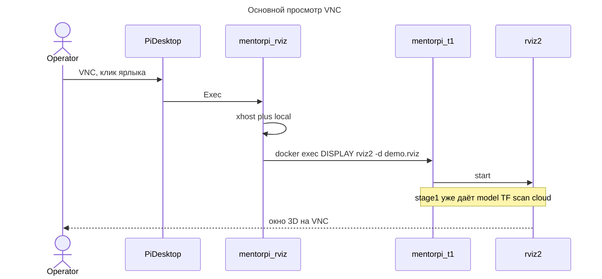
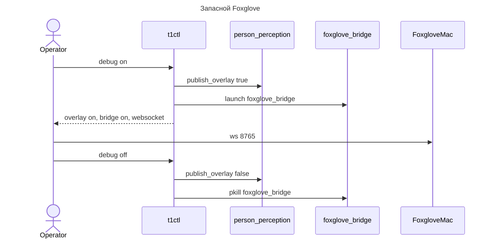

# SD032. Технический дизайн

BA: [solution.md](solution.md). Дизайн UI: skipped (ярлык рабочего стола и готовый rviz, решение оператора).

Как сейчас. Сокет `/tmp/.X11-unix` уже bind-ится в `mentorpi-t1` из `MentorPi` (`mk/provision.sh`), но `DISPLAY` в контейнер не передаётся — `rviz2` падает на Qt/xcb. Мост Foxglove стартует со стеком (`viewer_bridge:=true` в `stage1.launch.py`). `t1ctl debug` включает только overlay `/perception/persons/overlay` (SD014). `t1ctl viewer` отдельно поднимает `foxglove_bridge`.

Решения оператора по СА (2026-09-13): `debug on` включает overlay и мост, `debug off` гасит оба; после restart/reboot снова выключено; ярлык на столе хоста `pi`, клик делает `docker exec` в `mentorpi-t1`; `t1ctl viewer` удаляется; ярлык на столе всегда, в stock клик не открывает сцену. Уточнение к плану: 3D-сцена rviz должна открываться и при `debug off` — debug не владеет визуализацией, только запасным Foxglove и overlay. Диаграмма VNC не включает debug: это отдельный путь.

## Системный дизайн

1. **D1.** Графика хоста доступна процессам в `mentorpi-t1`, ROS-контур при этом графику не запускает.
   1. **D1.1.** При `docker create` контейнер получает `DISPLAY=:0` и `QT_X11_NO_MITSHM=1`. Bind `/tmp/.X11-unix` остаётся. Если контейнер уже есть без этих env — provision пересоздаёт его (как при stale image), `MentorPi` не трогает.
   2. **D1.2.** `mentorpi-t1.service` и `stage1.launch.py` не стартуют rviz2 и другие GUI. Нет дисплея — GUI не открывается, ноды motion path живут.
2. **D2.** Основной просмотр — 3D-сцена rviz с ярлыка на столе VNC. В этом пути нет `t1ctl` и нет Foxglove: стол `pi` → лаунчер → `docker exec` → `rviz2`.
   1. **D2.1.** В `mentorpi_bringup` ставится `rviz/demo.rviz`: Fixed Frame `odom`, RobotModel `/robot_description`, TF, LaserScan `/scan`, PointCloud2 `/aurora/points2`. Панелей Image/IMU нет. Публикации Twist / `/hiwonder_controller/cmd_vel` в конфиге нет. В runtime-образ — `ros-humble-rviz2` (как foxglove_bridge: не полагаться на RW-слой `MentorPi`). Топики сцены публикует `stage1` вместе с demo.
   2. **D2.2.** На столе пользователя `pi` ярлык вызывает `/usr/local/bin/mentorpi-rviz`: `xhost +local:`, затем `docker exec -d` в `mentorpi-t1` от `ubuntu` с тем же source, что у юнита, `LIBGL_ALWAYS_SOFTWARE=1`, `rviz2 -d` на `demo.rviz`. Лаунчер не вызывает `t1ctl`.
   3. **D2.3.** Ярлык ставится при provision/deploy и остаётся в stock. Если `mentorpi-t1` не running — скрипт выходит с кодом 1, окно не открывает, stock не останавливает.
   4. **D2.4.** Предусловия ярлыка — контейнер demo running и DISPLAY. Состояние overlay/моста не читается и не меняется.
3. **D3.** Foxglove — запасной путь за `t1ctl debug`.
   1. **D3.1.** В `stage1.launch.py` аргумент `viewer_bridge` по умолчанию `"false"`. После питания и `t1ctl restart` моста нет.
   2. **D3.2.** `t1ctl debug on` включает overlay (как SD014, YAML не пишет) и стартует `foxglove_bridge` тем же `ros2 launch mentorpi_bringup foxglove_bridge.launch.py`, что сейчас в `host/t1ctl/src/viewer.cpp`. `debug off` гасит overlay и делает `pkill -x foxglove_bridge` — не `rviz2` и не ноды сцены. `debug` без аргумента печатает оба состояния. Overlay и мост применяются независимо: отказ одного не откатывает другое; ненулевой exit, если не удалось запрошенное действие хотя бы по одному. Контейнер не running — как сейчас, ошибка, мост не трогаем.
   3. **D3.3.** Подкоманда `t1ctl viewer` снимается из CLI. Функции `viewer::query/start/stop` остаются внутренними и вызываются из debug.
   4. **D3.4.** Пока debug выключен, help и `t1ctl status` не рекламируют Foxglove как основной просмотр. При включённом мосте `t1ctl debug` печатает `ws://<host>:8765` (хост как сейчас в `viewer::detect_host`).
4. **D4.** Не меняется (ограничение scope): контейнер `MentorPi` и `start_node.service`, VNC-сервер вендора, `platform_adapter` и любые ненулевые Twist, автозапуск rviz2, overlay по-прежнему не пишется в YAML.

## Программные интерфейсы

### Docker / host

1. **I1.** `docker create` для `mentorpi-t1`: `--env DISPLAY=:0 --env QT_X11_NO_MITSHM=1`, прежние `-v` включая `/tmp/.X11-unix`. Юнит `ExecStart` без новых GUI-команд.
2. **I2.** Хостовый лаунчер `/usr/local/bin/mentorpi-rviz` и файл `~pi/Desktop/mentorpi-rviz.desktop` (`Type=Application`, `Name=MentorPi rviz`, `Exec=/usr/local/bin/mentorpi-rviz`, `Terminal=false`). Коды: 0 — `docker exec -d` отработал; 1 — контейнер не running или нет `DISPLAY` на хосте. Не вызывает `systemctl` и не публикует в ROS.
3. **I3.** Конфиг `share/mentorpi_bringup/rviz/demo.rviz` (Visualization Manager Humble): `Global Options/Fixed Frame` = `odom`; дисплеи RobotModel (`Description Topic` `/robot_description`), TF, LaserScan (`Topic` `/scan`), PointCloud2 (`Topic` `/aurora/points2`).

### Host CLI `t1ctl`

4. **I4.** `t1ctl debug [on|off]` (без аргумента — status). Расширенный stdout при успехе разбора:
   1. **I4.1.** Как сейчас: `T1CTL_DEBUG_OK=0|1`, `overlay: on|off`.
   2. **I4.2.** Добавить `bridge: on|off`. Если `bridge: on` — строка `websocket: ws://<host>:8765` (порт `viewer::kBridgePort`).
5. **I5.** Launch-аргумент `viewer_bridge` в `stage1.launch.py`: `default_value="false"`. Явный `viewer_bridge:=true` остаётся для отладки launch, операторский путь — только `t1ctl debug on`.
6. **I6.** CLI `t1ctl viewer` и подкоманды `status|start|stop` отсутствуют (`t1ctl viewer` — неизвестная команда). Help: `debug` — overlay и Foxglove bridge; строк `viewer status|start|stop` нет.

## Изменения в приложениях

### `mk/provision.sh`
**Пункты:** D1.1, D1.2, I1

Скрипт уже копирует bind-ы `MentorPi` и создаёт `mentorpi-t1` с `tail -f /dev/null`. Нужно задать env дисплея при create и пересоздавать контейнер, если env нет — иначе оператор после одного только `deploy` так и останется без дисплея. GUI в юнит не добавлять.

1. В `create_cmd` добавить `--env DISPLAY=:0 --env QT_X11_NO_MITSHM=1`.
2. Перед «already exists, skip create»: если в `Config.Env` нет `DISPLAY=:0` — stop/rm и создать заново, `MentorPi` не удалять.
3. Юнит и `ExecStart` не менять. Не ставить `xhost` из systemd (сессия VNC ещё может не существовать).

### `docker/mentorpi-t1/Dockerfile` и проверка образа
**Пункты:** D2.1

Runtime-образ ставит то, чего нет в base (foxglove_bridge, vision_msgs). rviz2 нужен в demo гарантированно, не из RW-слоя stock.

1. Apt `ros-humble-rviz2` в том же `apt-get install`.
2. В provision — `image_has_rviz2` (`command -v rviz2` в образе) и rebuild, если нет.

### `mentorpi_bringup`
**Пункты:** D2.1, D3.1, I3, I5

Пакет уже несёт launch и yaml моста. Сюда же конфиг rviz и смена умолчания моста, чтобы после restart мост не вставал сам.

1. Файл `src/mentorpi_bringup/rviz/demo.rviz` по I3; в CMake `install(DIRECTORY launch config rviz ...)`.
2. `viewer_bridge` default `"false"`.
3. Версия пакета `0.8.0` → `0.9.0`. `foxglove_bridge.launch.py` не переписывать.

### `host/desktop` + `mk/deploy.sh`
**Пункты:** D2.2, D2.3, D2.4, I2

Оператор смотрит стол хоста `pi`, не ubuntu в контейнере. Лаунчер — единственное место `xhost` и `docker exec` для rviz.

1. Скрипт `host/desktop/mentorpi-rviz`: `DISPLAY=${DISPLAY:-:0}`, `xhost +local:`, проверка `docker inspect -f '{{.State.Running}}' mentorpi-t1`, иначе exit 1; `docker exec -d -e DISPLAY -e QT_X11_NO_MITSHM=1 -e LIBGL_ALWAYS_SOFTWARE=1 -u ubuntu -w /home/ubuntu mentorpi-t1 bash -lc` с тем же source, что `ExecStart` юнита, затем `rviz2 -d` на `demo.rviz` из `ros2 pkg prefix mentorpi_bringup`.
2. `host/desktop/mentorpi-rviz.desktop` по I2.
3. `deploy.sh` и provision ставят скрипт в `/usr/local/bin/mentorpi-rviz` (0755) и desktop в `/home/pi/Desktop/` (владелец `pi`). Не вызывать `t1ctl start/stock`.

### `host/t1ctl`
**Пункты:** D3.2, D3.3, D3.4, I4, I6

`debug` уже ходит в контейнер через `ros_debug.py`. Lifecycle моста уже написан в `viewer.cpp` — его нужно вызвать из debug и снять отдельный CLI, иначе два входа на один мост.

1. `run_debug`: после overlay (или при его ошибке всё равно) `viewer::start` на `on`, `viewer::stop` на `off`, на status — `viewer::query`. Заполнить I4.2. `T1CTL_DEBUG_OK=1` только если overlay-хелпер успешен **и** (для on/off) start/stop моста успешен; status — если прочитаны оба.
2. Удалить subcommand `viewer` из `host/t1ctl/src/main.cpp`. Help и `print_debug` по I4/I6; блок `FOXGLOVE DESKTOP` не печатать из `t1ctl status`.
3. Тесты в `host/t1ctl/tests/test_status.cpp`: нет CLI viewer; debug on/off мокает start/stop моста; help без `viewer start`. Версия `t1ctl` `1.8.0` → `1.9.0`.
4. Не менять `ros_debug.py` (контракт overlay). Не публиковать Twist. `debug off` делает `pkill -x foxglove_bridge`, не `rviz2`.

### Документы оператора
**Пункты:** D3.4

README и SD005/ops сейчас учат `t1ctl viewer` и автостарт моста — это прямо противоречит BA.

1. `README.md`: основной просмотр — VNC и ярлык rviz; Foxglove — `t1ctl debug on`, не вместе со стеком.
2. `docs/SD/SD005/ops.md`: lifecycle моста через `t1ctl debug on|off`, не `t1ctl viewer`.

## ToDo

Порядок: сначала дисплей и rviz в образе, затем ярлык (без DISPLAY бесполезен), затем debug/CLI, в конце тексты, которые ссылаются на новые команды.

- [x] T1. Проброс DISPLAY в demo-контейнер
  - **Реализует:** D1.1, D1.2, I1
  - **Файлы:** `mk/provision.sh`
  - **Что нужно сделать:** При создании `mentorpi-t1` передать в контейнер `DISPLAY=:0` и `QT_X11_NO_MITSHM=1`, bind `/tmp/.X11-unix` оставить как есть. Если контейнер уже существует и в `Config.Env` нет `DISPLAY=:0`, stop/rm и создать заново — иначе оператор после одного `deploy` останется без дисплея. Юнит `mentorpi-t1.service` не менять: `stage1.launch.py` без rviz2, без `xhost` из systemd. `MentorPi` не удалять и не править. Цель D1.2 здесь — зафиксировать, что контур не зависит от наличия X: create/start контейнера не вызывает графические бинари.
  - **Критерии приёмки:**
    1. AC1. После provision у `mentorpi-t1` в `docker inspect` есть `DISPLAY=:0` и bind `/tmp/.X11-unix`.
    2. AC2. Повторный provision, если `DISPLAY` уже задан, не делает лишний rm; если `DISPLAY` нет — пересоздаёт только `mentorpi-t1`.
    3. AC3. `MentorPi` на месте, `ExecStart` юнита без `rviz2`/`xhost`.
  - **Проверка:** `docker inspect mentorpi-t1 --format '{{range .Config.Env}}{{println .}}{{end}}'` и `{{json .HostConfig.Binds}}`; diff юнита; `docker inspect MentorPi` — контейнер существует.

- [x] T2. rviz2 в образе и конфиг 3D-сцены, мост со стека снят
  - **Реализует:** D2.1, D3.1, I3, I5
  - **Файлы:** `docker/mentorpi-t1/Dockerfile`, `mk/provision.sh`, `src/mentorpi_bringup/rviz/demo.rviz`, `src/mentorpi_bringup/CMakeLists.txt`, `src/mentorpi_bringup/package.xml`, `src/mentorpi_bringup/launch/stage1.launch.py`
  - **Что нужно сделать:** В runtime-образ добавить `ros-humble-rviz2` и проверку `image_has_rviz2` по образцу `image_has_vision_msgs`, чтобы demo не зависел от RW-слоя stock. В `mentorpi_bringup` 0.9.0 поставить `rviz/demo.rviz` по I3 (odom, `/robot_description`, TF, `/scan`, `/aurora/points2`, без Twist). Default `viewer_bridge` сменить на `"false"`, чтобы после `t1ctl start`/`restart` `foxglove_bridge` не поднимался. Launch-файл моста не трогать — его вызывает debug в T4.
  - **Критерии приёмки:**
    1. AC1. В образе `command -v rviz2` успешен; `demo.rviz` в share пакета содержит Fixed Frame `odom` и топики `/robot_description`, `/scan`, `/aurora/points2`.
    2. AC2. В `stage1.launch.py` `viewer_bridge` default `"false"`; в конфиге rviz нет `cmd_vel` и `/hiwonder_controller/cmd_vel`.
    3. AC3. `foxglove_bridge.launch.py` и пакет `foxglove_bridge` в образе на месте; версия `mentorpi_bringup` 0.9.0.
  - **Проверка:** grep `demo.rviz` и `default_value="false"`; `package.xml` version; provision rebuild по отсутствию rviz2 (логика `image_has_*` в скрипте).

- [x] T3. Ярлык на столе хоста
  - **Реализует:** D2.2, D2.3, D2.4, I2
  - **Файлы:** `host/desktop/mentorpi-rviz`, `host/desktop/mentorpi-rviz.desktop`, `mk/deploy.sh`, `mk/provision.sh`
  - **Что нужно сделать:** Поставить на стол `pi` ярлык, который не ходит в ROS с хоста, а делает `docker exec` в demo. Перед exec — `xhost +local:` в сессии с `DISPLAY` (VNC). Source внутри контейнера скопировать с `ExecStart` юнита, чтобы rviz видел те же DDS-топики, что и стек. `LIBGL_ALWAYS_SOFTWARE=1` — чтобы окно открывалось на VNC без GPU. Лаунчер не вызывает `t1ctl`. Если контейнер не running (stock или demo down) — код 1, без `docker start`/`t1ctl start`. Ставить скрипт и `.desktop` и из deploy, и из provision, владелец `pi`.
  - **Критерии приёмки:**
    1. AC1. Файлы `/usr/local/bin/mentorpi-rviz` и `/home/pi/Desktop/mentorpi-rviz.desktop` после deploy; Exec указывает на лаунчер.
    2. AC2. При остановленном `mentorpi-t1` лаунчер возвращает 1 и не стартует stock/demo.
    3. AC3. Лаунчер не вызывает `systemctl` и `t1ctl` и не публикует Twist; при running demo команда содержит `docker exec` и `rviz2 -d` с `demo.rviz`.
  - **Проверка:** `bash -n` скрипта; `grep` на `t1ctl`/`cmd_vel` — пусто; на стенде по VNC клик ярлыка открывает 3D-сцену.

- [x] T4. Debug включает overlay и мост; CLI viewer снят
  - **Реализует:** D3.2, D3.3, D3.4, I4.1, I4.2, I6
  - **Файлы:** `host/t1ctl/src/main.cpp`, `host/t1ctl/src/units.hpp`, `host/t1ctl/src/units.cpp`, `host/t1ctl/src/ui.cpp`, `host/t1ctl/src/ui.hpp`, `host/t1ctl/src/viewer.cpp`, `host/t1ctl/CMakeLists.txt`, `host/t1ctl/tests/test_status.cpp`
  - **Что нужно сделать:** Собрать запасной Foxglove в существующий `t1ctl debug`, не плодя вторую команду. `on`/`off` по-прежнему меняют `publish_overlay` через `ros_debug.py` без YAML; плюс `viewer::start`/`stop`. Status читает overlay и `viewer::query`. Печать по I4; help без viewer. Версия `t1ctl` 1.9.0. Тесты: мост стартует/гаснет из debug; `t1ctl viewer` больше не парсится; help без `viewer start`. Внутренний `viewer.cpp` не удалять. Пока debug off, `t1ctl status` не печатает блок FOXGLOVE DESKTOP. `debug off` не должен быть выключателем 3D-сцены: stop моста — только `pkill -x foxglove_bridge`.
  - **Критерии приёмки:**
    1. AC1. Юнит-тесты: debug on вызывает start моста, debug off — stop; stdout содержит `overlay:` и `bridge:`; при bridge on есть `websocket:`.
    2. AC2. `t1ctl viewer` — ошибка CLI; в help нет `viewer start|stop|status`.
    3. AC3. `ros_debug.py` без правок; `print_status` без «FOXGLOVE DESKTOP»; версия 1.9.0; `debug off` останавливает только `foxglove_bridge`, не `rviz2`.
  - **Проверка:** тесты `host/t1ctl` как в Makefile/`pre-commit`; `t1ctl --help`.

- [x] T5. Документы: rviz основной, Foxglove за debug
  - **Реализует:** D3.4
  - **Файлы:** `README.md`, `docs/SD/SD005/ops.md`
  - **Что нужно сделать:** Убрать из операторских текстов автостарт моста и команду `t1ctl viewer`. Основной сценарий — VNC и ярлык MentorPi rviz при обычном demo (`debug off`, мост не нужен). Запасной — `t1ctl debug on`, URL `:8765` как в SD005. Не переписывать контракт топиков SD005–SD017, только lifecycle и точка входа.
  - **Критерии приёмки:**
    1. AC1. README: ярлык VNC как основной просмотр при обычном demo (`debug off`); мост не «поднимается вместе со стеком».
    2. AC2. В README и SD005/ops нет инструкции `t1ctl viewer`; есть `t1ctl debug on|off` для моста.
    3. AC3. Топики `/scan`, `/aurora/points2`, `/robot_description` в ops не переименованы.
  - **Проверка:** grep `t1ctl viewer` в README и `docs/SD/SD005/ops.md` — пусто; grep `debug on`.

## Покрытие

| Пункт | Задачи |
|-------|--------|
| D1.1 | T1 |
| D1.2 | T1 |
| D2.1 | T2 |
| D2.2 | T3 |
| D2.3 | T3 |
| D2.4 | T3 |
| D3.1 | T2 |
| D3.2 | T4 |
| D3.3 | T4 |
| D3.4 | T4, T5 |
| I1 | T1 |
| I2 | T3 |
| I3 | T2 |
| I4.1 | T4 |
| I4.2 | T4 |
| I5 | T2 |
| I6 | T4 |

Итог: пунктов 17 (без D4), задач 5. Непокрытых пунктов: нет. D4 — ограничение scope. D3.4 закрывают T4 (CLI) и T5 (документы) целиком с разных сторон одного требования «не предлагать Foxglove по умолчанию».

## Финальный QA (оператор, T1–T5)

Предусловие: `make build`, `make deploy`, при смене образа/env — `make provision`. Движение робота не проверять ненулевым Twist. Запуск окна rviz — оператор.

### T1 — DISPLAY
1. `docker inspect` — `DISPLAY=:0`, X11 bind (AC1, AC3).
2. Повторный provision без лишнего rm; контейнер без DISPLAY — recreate только demo (AC2).

### T2 — rviz и default моста
1. В контейнере `command -v rviz2`; `ros2 pkg prefix mentorpi_bringup` + `demo.rviz` (AC1).
2. После `t1ctl restart`: `pgrep -x foxglove_bridge` пусто (AC2 вместе с T4).

### T3 — ярлык
1. По VNC клик «MentorPi rviz» при живом demo — окно с моделью/TF/scan/cloud (AC1, AC3).
2. `t1ctl stock`, клик — нет сцены demo, stock жив (AC2).
3. SSH без DISPLAY: `rviz2` в контейнере не открывает окно, `t1ctl status` жив (негатив BA).

### T4 — debug
1. `t1ctl debug on` — overlay on, порт 8765 слушает, есть websocket (AC1).
2. `t1ctl restart` — мост снова down, overlay off (эфемерность).
3. `t1ctl viewer` — неизвестная команда (AC2).
4. После `debug off`: `pgrep foxglove_bridge` пусто; если rviz был открыт с ярлыка — процесс `rviz2` жив (AC3).

### T5 — документы
1. По grep в README и SD005/ops нет `t1ctl viewer` (AC2).
