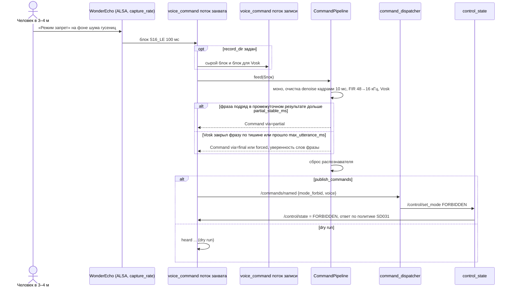

# SD033. Технический дизайн

BA: [solution.md](solution.md). Дизайн UI: skipped (экраны не меняются). Каталог: F21, продолжение SD031.

Как сейчас. `voice_command` (`mentorpi_voice` 0.1.1, SD031) открывает захват ALSA на 16 кГц моно через `plughw` и кормит Vosk 0.3.45 с грамматикой из трёх фраз и `[unk]`. Команда берётся только из финального результата, фраза должна совпасть целиком, уверенность всех слов не ниже `min_confidence`. `conf/model.conf` модели `vosk-model-small-ru-0.22` закрывает фразу только по тишине после речи (`endpoint.rule2–4`: 0,5 / 1 / 2 с); если шум распознаётся не как тишина, фраза закрывается только по длине, в Kaldi по умолчанию через 20 с. Записи с хода нет. WAV-фикстур `test_vosk_phrases` нет ни в git, ни на диске. Ядра Pi 5 с голосом заняты на 64,7–67,1 % (SD031 T7).

Решения оператора по СА (2026-09-15): сначала запись звука на ходу, по ней выбор метода; менять можно и распознаватель (промежуточный результат, закрытие фразы по длине); нейросеть и классическая очистка сравниваются на записях без робота; один профиль всегда; усиление микрофона параметром ноды, значение по записям; ответ в Bluetooth-колонку остаётся вне репозитория; WAV в git не кладём; сборка и тесты за агентом, выкладка и стенд за оператором.

«Сборщик» ниже: `docker run --rm --platform linux/arm64 -v "$PWD:/workspace" -w /workspace [-e MENTORPI_VOICE_TEST_DATA_DIR=/workspace/scratch/sd033/fixtures] mentorpi-overlay-builder:arm64 bash -lc 'source /opt/ros/humble/setup.bash && colcon --log-base build-arm64/ros/log <build|test> --base-paths src --build-base build-arm64/ros/build --install-base build-arm64/ros/install --packages-up-to mentorpi_voice'`, после `test` ещё `colcon test-result --verbose --test-result-base build-arm64/ros/build`.

## Системный дизайн

1. **D1.** Конвейер звука в потоке захвата `voice_command`: захват → моно → очистка → понижение частоты до 16 кГц → Vosk → решение о команде.
   1. **D1.1.** Захват идёт на `capture_rate` (стартовое 48000, частота RNNoise) через `plughw`, каналы усредняются в моно. Понижение частоты до `sample_rate` (16000, частота Vosk) делает свой FIR нижних частот с прореживанием в `capture_rate / sample_rate` раз (63 отвода, окно Хэмминга, срез около 7,2 кГц при 48→16), а не преобразователь `plughw`. `capture_rate`, не кратная `sample_rate`, роняет ноду на старте; `capture_rate == sample_rate` даёт коэффициент 1 и поведение SD031.
   2. **D1.2.** Конвейер от моно до событий команды собран в один класс `CommandPipeline` без ROS и ALSA. Его используют нода и офлайн-бенч, поэтому бенч на записях считает то же, что робот. Время внутри конвейера аудиальное (по числу поданных отсчётов), а не настенное: бенч идёт быстрее реального времени, а тесты не спят. Распознаватель подаётся через интерфейс `AsrEngine`, чтобы логику проверять тестами без модели.
   3. **D1.3.** Заглушка микрофона на время ответа остаётся как в SD031 (D2.4 SD031): кадры читаются и выбрасываются; в начале заглушки конвейер сбрасывается целиком (распознаватель, ожидание промежуточной фразы, состояние очистки и фильтра).
2. **D2.** Очистка звука, параметр `denoise`: `none` | `rnnoise` | `speexdsp`. Обе очистки работают на `capture_rate` кадрами по 10 мс до понижения частоты.
   1. **D2.1.** RNNoise 0.2 (xiph, коммит `372f7b4` «Fix compilation errors.» через день после тега `v0.2`: сам `v0.2` не собирается под aarch64; модель скачивает `autogen.sh` при сборке образа) и SpeexDSP 1.2.1 (git-тег `SpeexDSP-1.2.1`) собираются статически в образе `mentorpi-overlay-builder:arm64` в `/opt/rnnoise` и `/opt/speexdsp`, по образцу ncnn (SD026). В runtime-образ `mentorpi-t1` ничего не добавляется, `mk/provision.sh` не меняется. Сеть нужна только на `make env-overlay`.
   2. **D2.2.** `rnnoise`: `rnnoise_process_frame` на кадрах 480 отсчётов 48 кГц (float в масштабе int16), рекуррентная нейросеть с моделью внутри библиотеки. `speexdsp`: `speex_preprocess_run` с включённым шумоподавлением и `speex_noise_suppress_db`, без АРУ и VAD. GTCRN не берём: ей нужна конвертация ONNX в ncnn, RNNoise готова как библиотека на C. WebRTC Audio Processing не берём: в jammy только разделяемая 0.3.1, это правка runtime-образа и provision.
   3. **D2.3.** Отказ очистки: неизвестное значение `denoise`, `rnnoise` при `capture_rate` ≠ 48000 или ошибка создания состояния дают очистку `none` и текст ошибки. Нода пишет ERROR и работает дальше без очистки: распознавание живо, как в SD031 (BA, негативный №3).
   4. **D2.4.** Значение `denoise` по умолчанию и параметры решения о команде (D3) выбирает бенч (D7) на записях протокола D4.3. Критерии по порядку: больше попаданий в сессиях на ходу (`s2_drive`, `s3_drive_noise`); в сессии стоя (`s1_still`) попаданий не меньше, чем у варианта SD031 (`denoise: none`, `partial_trigger: false`); при равенстве меньше лишних команд в `s4_drive_talk`; дальше дешевле по `ms_per_s` на Pi. Порогов доли распознанных команд и загрузки нет (BA). Профиль один для стоящего и едущего робота.
3. **D3.** Решение о команде.
   1. **D3.1.** Промежуточный результат. После каждого блока конвейер читает `vosk_recognizer_partial_result`. Если фраза из `phrases` стоит в нём подряд (вокруг могут быть `[unk]` и другие слова грамматики) и та же фраза держится `partial_stable_ms` аудиального времени, это команда `via=partial`. Уверенность не проверяется: Vosk не даёт её для промежуточного результата, а пропуск хуже ложной (BA). Выключается `partial_trigger: false`.
   2. **D3.2.** Финальный результат (`vosk_recognizer_result` по тишине) ищет фразу так же, подряд в словах. `min_confidence` проверяется только у слов найденной фразы; `[unk]` вокруг не учитывается. Команда `via=final`.
   3. **D3.3.** После любой принятой команды распознаватель и ожидание промежуточной фразы сбрасываются (`vosk_recognizer_reset`), поэтому одна фраза не даёт второй команды из финального результата.
   4. **D3.4.** Предел длины фразы: если с последнего сброса или финала прошло `max_utterance_ms` аудиального времени, конвейер вызывает `vosk_recognizer_final_result`, разбирает его по D3.2 как `via=forced` и сбрасывает распознаватель. `0` выключает предел. Сделано в коде, а не правкой `conf/model.conf`: значение живёт в YAML, модель остаётся как в образе.
4. **D4.** Запись звука для диагностики и бенча.
   1. **D4.1.** `record_dir` (пусто: выключено). Нода пишет куски по `record_segment_s`: `<YYYYmmdd-HHMMSS>_raw.wav` (захват как есть: `capture_rate`, все каналы, в том числе во время заглушки) и `<YYYYmmdd-HHMMSS>_asr.wav` (16 кГц моно, то, что ушло в Vosk). Пишет отдельный поток с очередью, захват не ждёт диска. Всего за запуск ноды не больше `record_max_mb`; предел, ошибка файла или отставание очереди больше 2 с дают WARN `record stopped`, запись выключается до перезапуска, распознавание работает. На стенде каталог `/home/ubuntu/shared/voice_rec` в контейнере виден на хосте как `/home/pi/docker/tmp/voice_rec` (привязка `MentorPi`).
   2. **D4.2.** `publish_commands` (по умолчанию `true`). `false`: распознанная команда пишется в лог с пометкой `(dry run)`, в `/commands/named` не уходит, ожидания ответа нет. Нужно для записи, чтобы режим не менялся посреди езды.
   3. **D4.3.** Протокол записи (оператор). Параметры в установленном `voice_command.yaml` в контейнере (как обход колонки SD031): `record_dir`, `publish_commands: false`, `record_segment_s: 300`; `t1ctl restart`. Робот в Manual, пульт у оператора. Говорящий в 3–4 м произносит команды по кругу «режим запрет», «режим следование», «режим ручной», каждую по нескольку раз, между командами около 3 с; фактическая последовательность каждой сессии записывается в `labels.tsv` (15 команд на сессию оператор счёл лишним, 2026-09-15). Сессии: `s1_still` (робот стоит, тихо), `s2_drive` (едет пультом прямо и с поворотами), `s3_drive_noise` (едет, рядом разговор или музыка), `s4_drive_talk` (едет, рядом разговор, команд нет). Диагностические сессии после первого бенча T4 (2026-09-16, решение оператора), все с `capture_channels: 2` и одним кругом команд: `s5_drive_2ch` (едет, 3–4 м, обычный голос: различаются ли два канала WonderEcho), `s6_drive_1m` (едет, около 1 м, обычный голос), `s7_drive_loud` (едет, 3–4 м, громко): граница распознавания по расстоянию и громкости. Файлы каждой сессии оператор кладёт на хост разработки в `scratch/sd033/rec/<сессия>/`. `scratch/sd033/rec/labels.tsv` пишет агент по протоколу.
5. **D5.** Усиление микрофона. `capture_gain_percent` ≥ 0: при каждом открытии захвата нода ставит громкость захвата элемента `capture_mixer_control` на карте `mixer_device` в процентах диапазона и пишет прочитанное значение. На каждой строке статистики (D6) значение сверяется; расхождение (например, WirePlumber вернул своё) даёт WARN и повторную установку. `-1` (стартовое): микшер не трогаем, как сейчас. Значение по записям D4.3 и `audio stats` выбирается в T4.
6. **D6.** Наблюдаемость.
   1. **D6.1.** Раз в `stats_log_ms` строка `audio stats` об уровне сырого захвата: пик и RMS в dBFS, доля отсечённых отсчётов. По ней видно, упирается ли микрофон в максимум на ходу.
   2. **D6.2.** Та же строка получает время обработки на секунду звука отдельно для очистки и для Vosk и текущее усиление; строки `heard` и `ignored` получают `via=partial|final|forced`.
7. **D7.** Офлайн-бенч `voice_bench` в пакете `mentorpi_voice`, без ROS и ALSA. Читает `_raw.wav` из `labels.tsv`, прогоняет `CommandPipeline` блоками по `capture_rate / 10` (как нода) для каждой комбинации параметров из списков, сравнивает найденные команды с ожидаемой последовательностью (наибольшая общая подпоследовательность) и печатает попадания, пропуски, лишние и `ms_per_s`. Агент гоняет бенч в сборщике на хосте разработки (под эмуляцией долго, но счёт команд тот же); время на Pi для двух финалистов снимает оператор.
8. **D8.** Фикстуры и результаты вне git.
   1. **D8.1.** `test_vosk_phrases` берёт каталог из переменной окружения `MENTORPI_VOICE_TEST_DATA_DIR` при запуске. Нет переменной или файлов: печатает `skipped: no fixtures` и выходит с кодом 77, CTest считает тест пропущенным. Тест гоняет `CommandPipeline` (`denoise: none`) по `mode_forbid.wav`, `mode_follow.wav`, `mode_manual.wav`, `other.wav` на 48 кГц моно. Фикстуры агент вырезает из `s1_still` (три фразы) и `s4_drive_talk` (кусок без команд) по времени из `voice_bench --events` в `scratch/sd033/fixtures/`.
   2. **D8.2.** Записи, `labels.tsv` и фикстуры живут в `scratch/sd033/` на хосте разработки (`scratch/` в `.gitignore`). В git попадают только числа: таблица бенча и выбранные значения в As-built этого документа.
9. **D9.** Не меняется (ограничение scope): контракт `/commands/named` и `command_dispatcher`, `control_state` и правила режимов, `pad_teleop`, `control_mux` (нули при запросе остановки, голос их не снимает), `mission_control`, `platform_adapter`, `t1ctl`, systemd-юнит, `stage1.launch.py` (параметры голоса только в YAML), runtime-образ `mentorpi-t1`, `mk/provision.sh`, `mk/deploy.sh`, Makefile. Синтез ответа, `AnnouncePolicy`, `MuteWindow` и правило «смена через `t1ctl` не озвучивается» как в SD031. Обход Bluetooth-колонки вне репозитория.
10. **D10.** Приёмка. Агент: сборка, `colcon test`, бенч в сборщике, As-built. Оператор: `make deploy`, записи протокола D4.3, бенч на Pi, голосовая приёмка на ходу и стоя, загрузка ядер и частота рамок детекции рядом с замером SD031, возврат обхода колонки после каждой выкладки. Агент не произносит команды и не шлёт `mode_follow` и `mode_manual`: движение на стенде делает только оператор (AGENTS.md).

### As-built (стенд `pi@192.168.88.56`, контейнер `mentorpi-t1`, T1, 2026-09-15)

Снято скриптом оператора после выкладки `mentorpi_voice` 0.2.0: `/proc/asound/Device/stream0` и `amixer -c Device sget Mic` на хосте.

| Параметр | Значение |
|----------|----------|
| WonderEcho USB | `USB PnP Audio Device at usb-xhci-hcd.1-2.2, full speed`, ALSA-карта `Device` |
| Захват | S16_LE, 2 канала (FL FR), только 48000 Гц (ASYNC); `capture_rate: 48000` совпадает с устройством, `capture_channels: 1` сводит в моно через `plughw` |
| Вывод | S16_LE, 2 канала, только 48000 Гц (ADAPTIVE) |
| Усиление `Mic` | захват 412 из 496 (83 %, 25,75 дБ), включён; воспроизведение 8 из 496, выключено |
| `arecord` в контейнере | нет (`command not found`) |
| Обход Bluetooth-колонки SD031 в контейнере | нет: в `~/.asoundrc` нет `pcm.bt`, нет `libasound2-plugins` |

### As-built (бенч T4, 2026-09-16, записи в `scratch/sd033/rec/` вне git)

`voice_bench` в сборщике: шесть команд в сессии стоя, по три в каждой сессии на ходу. Порогов BA не задаёт, числа приведены как есть.

| Сессия | `none` | `rnnoise` | `speexdsp` |
|--------|--------|-----------|------------|
| `s1_still` (стоит, 3–4 м) | 6 из 6 | 6 из 6 | 6 из 6 |
| `s2_drive` (едет, 3–4 м, обычный голос) | 0 из 3 | 0 из 3 | 0 из 3 |
| `s3_drive_noise` (едет, 3–4 м, шум рядом) | 0 из 3 | 0 из 3 | 0 из 3 |
| `s5_drive_2ch` (едет, 3–4 м, два канала) | 0 из 3 | 0 из 3 | 0 из 3 |
| `s6_drive_1m` (едет, около 1 м) | 0 из 3 | 1 из 3 | 2 из 3 |
| `s7_drive_loud` (едет, 3–4 м, громко) | 2 из 3 | 1 из 3 | 2 из 3 |
| `s4_drive_talk` (едет, команд нет) | лишних 0 | лишних 0 | лишних 0 |

Перебор `partial_stable_ms` (100, 200), `min_confidence` (0.30, 0.60) и `speex_noise_suppress_db` (−20, −30, −40) результат не менял.

Выбрано по критериям D2.4: `denoise: "speexdsp"` (единственная очистка, которая добавляет команды на границе слышимости и не мешает стоя; `rnnoise` пережимает речь), `partial_trigger: true` (команда приходит на 0,7–1,0 с раньше финального результата, лишних не даёт), `partial_stable_ms: 200`, `max_utterance_ms: 5000`, `min_confidence: 0.6`, `speex_noise_suppress_db: -30`, `capture_gain_percent: -1` (отсечения нет ни в одной записи, усиление `Mic` 412 из 496 оставляем). `ms_per_s` на Pi (`--jobs 1`, контур поднят, 2026-09-16): `none` 64,5, `speexdsp` 69,5 мс процессорного времени на секунду звука, то есть около 7 % одного ядра; очистка добавляет примерно 5 мс/с. В ноде на стенде `denoise_ms_per_s` 5,9–7,7, `asr_ms_per_s` 38,7–72,5.

## Программные интерфейсы

### ROS

1. **I1.** Без изменений: `/commands/named` (`NamedCommand{name, source: voice}`, reliable, KeepLast 10, volatile), подписки `/control/state` и `/control/mode_toggle` (SD031 I1–I4). Новых топиков, сервисов и сообщений нет. При `publish_commands: false` нода в `/commands/named` не публикует.

### Параметры `voice_command.yaml`

Числа ниже стартовые, итог по бенчу записывается в T4, это не SLA.

2. **I2.** Захват, запись, статистика: `capture_rate: 48000`; `sample_rate: 16000` (теперь частота распознавателя); `record_dir: ""`; `record_segment_s: 300`; `record_max_mb: 500`; `publish_commands: true`; `stats_log_ms: 10000`. Некратная `capture_rate`, неположительные `record_segment_s`, `record_max_mb`, `stats_log_ms` роняют ноду на старте с именем параметра.
3. **I3.** Очистка и решение о команде: `denoise: "none"` (заменяется итогом T4); `speex_noise_suppress_db: -30`; `partial_trigger: true`; `partial_stable_ms: 200`; `max_utterance_ms: 5000` (`0` выключает); `min_confidence: 0.6` (теперь только слова найденной фразы). Неизвестный `denoise` ноду не роняет (D2.3); отрицательные `partial_stable_ms`, `max_utterance_ms` и `speex_noise_suppress_db` > 0 роняют.
4. **I4.** Усиление: `mixer_device: "hw:CARD=Device"`; `capture_mixer_control: "Mic"`; `capture_gain_percent: -1` (`-1` не трогать, иначе 0–100, вне диапазона роняет ноду).

### Функции модулей C++ (header-only, без ROS)

5. **I5.** `mentorpi_voice/phrase_match.hpp`:
   - `std::vector<std::string> split_words(std::string_view text);` слова после `normalize_phrase`;
   - `struct PhraseHit { size_t phrase; size_t first_word; size_t word_count; };`
   - `std::optional<PhraseHit> find_phrase(const std::vector<std::string>& words, const std::vector<std::string>& phrases);` самое раннее по положению вхождение фразы словами подряд; разрыв внутри фразы не совпадает;
   - `match_phrase` удаляется, `normalize_phrase` и `words_confident` остаются.
6. **I6.** `mentorpi_voice/utterance.hpp`:
   - `VoskUtterance` получает `std::vector<std::string> words` из `result[].word`;
   - `std::string parse_vosk_partial(std::string_view json_text);` поле `partial`, битый JSON → пусто;
   - `CommandDecision decide_command(const VoskUtterance&, const std::vector<std::string>& phrases, const std::vector<std::string>& commands, double min_conf);` через `find_phrase`, уверенность слов фразы; `ignore_reason`: `empty` | `no match` | `low confidence`;
   - `class PartialTrigger { explicit PartialTrigger(std::chrono::milliseconds stable); std::optional<size_t> on_partial(std::string_view partial_json_text, const std::vector<std::string>& phrases, std::chrono::milliseconds audio_time); void reset(); };` отдаёт индекс фразы один раз, когда то же попадание держится `stable`; другая фраза или пустой результат перезапускают ожидание.
7. **I7.** `mentorpi_voice/audio_dsp.hpp`:
   - `void mix_to_mono(const int16_t* interleaved, size_t frames, unsigned channels, std::vector<int16_t>& out);`
   - `class Decimator { explicit Decimator(unsigned factor); void process(const int16_t* in, size_t n, std::vector<int16_t>& out); void reset(); };` состояние между вызовами сохраняется, `factor == 1` копирует;
   - `struct LevelStats { double peak_dbfs; double rms_dbfs; double clipped_share; size_t samples; };` и `class LevelMeter { void add(const int16_t* data, size_t n); LevelStats take(); };` тишина даёт −120 dBFS, отсечённый отсчёт это 32767 или −32768.
8. **I8.** `mentorpi_voice/denoiser.hpp`:
   - `class Denoiser { public: virtual ~Denoiser() = default; virtual void process(int16_t* frame) = 0; virtual void reset() = 0; virtual const char* name() const = 0; };` кадр `rate / 100` отсчётов, обработка на месте;
   - `struct DenoiseOptions { double speex_noise_suppress_db{-30.0}; };`
   - `std::unique_ptr<Denoiser> make_denoiser(std::string_view kind, unsigned rate, const DenoiseOptions& opt, std::string& error);` всегда отдаёт объект: при отказе `none` и непустой `error`.
9. **I9.** `mentorpi_voice/command_pipeline.hpp`:
   - `class AsrEngine { public: virtual ~AsrEngine() = default; virtual int accept(const int16_t* data, int n) = 0; virtual std::string partial() = 0; virtual std::string result() = 0; virtual std::string final_result() = 0; virtual void reset() = 0; };` и `class VoskEngine : public AsrEngine` (грамматика `grammar_json(phrases)`, `set_words(1)`);
   - `struct PipelineConfig { unsigned capture_rate; unsigned asr_rate; unsigned channels; std::string denoise; DenoiseOptions denoise_options; bool partial_trigger; std::chrono::milliseconds partial_stable; std::chrono::milliseconds max_utterance; std::vector<std::string> phrases; std::vector<std::string> commands; double min_confidence; };`
   - `struct PipelineEvent { bool command; std::optional<size_t> phrase; std::string text; double conf_min; const char* via; const char* reason; std::chrono::milliseconds audio_time; };`
   - `struct PipelineTiming { double denoise_ms; double asr_ms; double audio_s; };`
   - `class CommandPipeline { CommandPipeline(const PipelineConfig&, std::unique_ptr<AsrEngine>); const char* denoise_name() const; const std::string& denoise_error() const; void feed(const int16_t* interleaved, size_t frames, std::vector<PipelineEvent>& events); const std::vector<int16_t>& last_asr_block() const; void reset(); PipelineTiming take_timing(); };`
10. **I10.** `mentorpi_voice/wav_writer.hpp`: `class WavWriter { bool open(const std::string& path, uint32_t rate, uint16_t channels); bool write(const int16_t* samples, size_t count); size_t bytes() const; bool close(); };` заголовок RIFF дописывается размерами на `close` и в деструкторе; результат читает `read_wav_pcm16`.
11. **I11.** `mentorpi_voice/bench_score.hpp`:
    - `struct Score { size_t expected, detected, hits, missed, extra; };` `Score score_sequence(const std::vector<std::string>& expected, const std::vector<std::string>& detected);` попадания это длина наибольшей общей подпоследовательности;
    - `struct LabelRow { std::string file; std::vector<std::string> commands; };` `std::optional<std::vector<LabelRow>> parse_labels(std::istream& in, std::string& error);` строка `путь<TAB>команда команда …`, `#` комментарий, пустая последовательность допустима, строка без TAB → `nullopt` и номер строки в `error`.

### CLI

12. **I12.** `ros2 run mentorpi_voice voice_bench --dir <каталог> --labels <labels.tsv> [--model <каталог модели>] [--denoise none,rnnoise,speexdsp] [--partial-trigger 0,1] [--partial-stable-ms 200,400] [--max-utterance-ms 5000] [--min-confidence 0.6] [--speex-db -30] [--jobs 1] [--events]`. Списки через запятую перемножаются. `--jobs` гоняет варианты параллельно (под эмуляцией в сборщике); `ms_per_s` считается по процессорному времени потока, на Pi запускается с `--jobs 1`. В конец каждого файла подаётся 1 с тишины, чтобы последняя фраза успела закрыться. Диагностика: `--trace` печатает `TRACE file config audio_time_ms partial|result|final|reset text` по каждому ответу распознавателя, `--free` запускает распознаватель без грамматики (полный словарь модели), чтобы проверить, различима ли речь вообще. Вывод TSV: `file config expected detected hits missed extra ms_per_s`, строка `TOTAL <сессия> <config>` на каждую сессию (первый каталог пути) и `TOTAL all <config>`. `--events` печатает каждую команду `file audio_time_ms via command`. Модель по умолчанию из share пакета. Нет файла из `labels.tsv`, битые метки или аргументы: сообщение и код 2.

### Логи

13. **I13.** Строки `voice_command`.
    1. **I13.1.** Стартовая строка получает параметры I2; `heard "%s" conf_min=%.2f -> %s (dry run)` при `publish_commands: false`; `record open %s`; WARN `record stopped: %s` (`limit` | `queue overflow` | текст ошибки файла); `audio stats peak_dbfs=%.1f rms_dbfs=%.1f clipped=%.3f%%`.
    2. **I13.2.** Стартовая строка получает параметры I3 и I4; `denoise ready kind=%s rate=%u`; ERROR `denoise init failed kind=%s: %s, using none`; `heard` и `ignored` получают `via=%s`; `audio stats` дополняется `denoise_ms_per_s=%.1f asr_ms_per_s=%.1f gain=%ld%%`; `mixer gain set control=%s percent=%ld`; WARN `mixer gain drift control=%s now=%ld%% target=%ld%%, reapply`; WARN `mixer failed device=%s: %s` (троттлинг).

### Сборка

14. **I14.** Окружение сборки.
    1. **I14.1.** `docker/overlay-builder/Dockerfile`: apt `autoconf automake libtool pkg-config wget`; `ARG RNNOISE_GIT_COMMIT=372f7b4b76cde4ca1ec4605353dd17898a99de38`, `ENV RNNOISE_ROOT=/opt/rnnoise`; `ARG SPEEXDSP_GIT_TAG=SpeexDSP-1.2.1`, `ENV SPEEXDSP_ROOT=/opt/speexdsp`; обе `./autogen.sh && ./configure --enable-static --disable-shared --prefix=… && make install`, для SpeexDSP ещё `--disable-examples`; в конце `test -f` на `.a` и заголовки; комментарий SD033 рядом с блоком Vosk.
    2. **I14.2.** `mentorpi_voice/CMakeLists.txt`: `RNNOISE_ROOT` и `SPEEXDSP_ROOT` из окружения, нет каталога или `.a` → `FATAL_ERROR`; статическая линковка `librnnoise.a` и `libspeexdsp.a` (плюс `m`); тест `test_denoiser`.
    3. **I14.3.** `mentorpi_voice/CMakeLists.txt`: цель `voice_bench` (без ROS, ставится в `lib/mentorpi_voice`, RUNPATH `$ORIGIN/..` для `libvosk.so`), тест `test_bench_score`; `test_vosk_phrases` без компиляционного пути к данным, `SKIP_RETURN_CODE 77`.

## Изменения в приложениях

### `docker/overlay-builder`
**Пункты:** D2.1, I14.1

Образ сборщика держит всё, что нельзя поставить во время colcon: ncnn (SD026), Vosk и модель (SD031). Сюда же по той же схеме добавляются две статические библиотеки очистки звука, чтобы на Pi не менять runtime-образ.

1. apt инструментов autotools; сборка RNNoise по коммиту `372f7b4` с моделью от `autogen.sh` и SpeexDSP по тегу `SpeexDSP-1.2.1` в `/opt`, `ENV` из I14.1.
2. Проверка `test -f` в том же `RUN`.
3. Не трогаем ncnn, Vosk, модель и apt-пакеты ROS.

### `mentorpi_voice`: модули, бенч, тесты
**Пункты:** D1.2, D2.2, D2.3, D2.4, D3.1, D3.2, D3.3, D3.4, D7, D8.1, D8.2, I5, I6, I7, I8, I9, I10, I11, I12, I14.2, I14.3

Пакет из SD031, где чистая логика вынесена в header-only модули с тестами в стиле `mission_control` (`add_test`, без gtest). Архитектурно добавляется слой конвейера: всё от моно до события команды уходит из `voice_command.cpp` в `CommandPipeline`, а распознаватель прячется за `AsrEngine`. Это даёт второго потребителя, офлайн-бенч, который считает ровно то же, что нода, и тесты логики без модели.

1. `audio_dsp.hpp` (I7), `wav_writer.hpp` (I10) и тесты `test_audio_dsp`, `test_wav_writer`.
2. `denoiser.hpp` (I8) с RNNoise и SpeexDSP, тест `test_denoiser`, CMake I14.2.
3. `phrase_match.hpp` (I5), `utterance.hpp` (I6), `command_pipeline.hpp` (I9); тесты `test_phrase_match` переписан, новые `test_utterance`, `test_command_pipeline` на подставном `AsrEngine`.
4. `bench_score.hpp` (I11), `src/voice_bench.cpp` (I12), тест `test_bench_score`; `test_vosk_phrases` на `CommandPipeline` с данными из окружения, CMake I14.3.
5. Нельзя: класть WAV в `test/data` и в git; тянуть ROS и ALSA в модули и бенч.

### `voice_command`
**Пункты:** D1.1, D1.3, D4.1, D4.2, D4.3, D5, D6.1, D6.2, I2, I3, I4, I13.1, I13.2

Нода-владелец звука из SD031. Роль не меняется: слушает микрофон, публикует команду, озвучивает режим. Меняется источник звука для распознавателя: захват на 48 кГц, свой фильтр понижения частоты, затем конвейер с очисткой. Добавляются запись, dry run, статистика и управление усилением.

1. T1: `capture_rate`, моно и `Decimator` в потоке захвата, запись отдельным потоком, `publish_commands`, `audio stats` уровня, параметры I2, логи I13.1, `package.xml` 0.2.0.
2. T5: поток захвата кормит `CommandPipeline`, события превращаются в публикацию и логи; сброс конвейера на заглушке; микшер ALSA (`snd_mixer_selem_*`); параметры I3 и I4 со значениями из As-built T4; логи I13.2.
3. Не трогаем синтез и проигрывание ответа, `AnnouncePolicy`, `MuteWindow`, QoS и имена топиков. Нельзя: вызывать `/control/set_mode`, публиковать Twist, озвучивать смену режима без своей команды или кнопки.

## ToDo

Порядок: запись нужна раньше всего, чтобы оператор снимал звук, пока агент собирает библиотеки и логику; бенч выбирает значения до того, как нода получает очистку; стенд в конце.

- [x] T1. Запись звука, захват 48 кГц и dry run в `voice_command`
  - **Реализует:** D1.1, D4.1, D4.2, D4.3, D6.1, I2, I7, I10, I13.1
  - **Файлы:** `src/mentorpi_voice/include/mentorpi_voice/audio_dsp.hpp`, `src/mentorpi_voice/include/mentorpi_voice/wav_writer.hpp`, `src/mentorpi_voice/test/test_audio_dsp.cpp`, `src/mentorpi_voice/test/test_wav_writer.cpp`, `src/mentorpi_voice/src/voice_command.cpp`, `src/mentorpi_voice/config/voice_command.yaml`, `src/mentorpi_voice/CMakeLists.txt`, `src/mentorpi_voice/package.xml`, `docs/SD/SD033/tech.md`
  - **Что нужно сделать:** В `mentorpi_voice` появляются `audio_dsp.hpp` (I7) и `wav_writer.hpp` (I10) с тестами. Нода открывает захват на `capture_rate` (период `capture_rate / 10`), усредняет каналы через `mix_to_mono` вместо своего цикла, прореживает `Decimator` до `sample_rate` и кормит Vosk как раньше: только финальный результат, логика решения SD031. Параметры I2 проверяются на старте. При непустом `record_dir` отдельный поток с очередью пишет куски `_raw.wav` (блок захвата как есть, и во время заглушки) и `_asr.wav` (блок после прореживания) по `record_segment_s`, считает байты и останавливает запись по D4.1. `publish_commands: false` заменяет публикацию и `on_voice_command` строкой `(dry run)`. `LevelMeter` на сыром моно даёт строку `audio stats` раз в `stats_log_ms`. `mentorpi_voice` 0.2.0.

    Очистки и промежуточного результата здесь нет (T2, T3, T5). После выкладки оператор снимает сессии D4.3 и копирует их в `scratch/sd033/rec/`, агент пишет `labels.tsv`; оператор снимает `/proc/asound/Device/stream0` (`arecord` в контейнере нет), агент заносит частоты и каналы захвата WonderEcho в As-built. Если `audio stats` на ходу показывает отсечение, оператор может менять усиление вручную `amixer` и перезаписать сессию; удачное значение записывается в STATUS для T5.
  - **Критерии приёмки:**
    1. AC1. `test_audio_dsp`: синус 1 кГц на 48 кГц после `Decimator(3)` сохраняет амплитуду в пределах ±1 дБ, синус 12 кГц ослаблен не меньше чем на 40 дБ; вход, поданный кусками 100 и 480 отсчётов, даёт тот же выход, что одним куском; `Decimator(1)` копирует; `mix_to_mono` усредняет стерео; `LevelMeter` на полной шкале меандра даёт пик 0 dBFS и долю отсечения 1, на нулях −120 dBFS.
    2. AC2. `test_wav_writer`: файлы 48 кГц моно и 16 кГц стерео после `close` читаются `read_wav_pcm16` с теми же отсчётами; `open` в несуществующем каталоге без прав отдаёт `false`.
    3. AC3. `capture_rate: 44100` роняет ноду на старте с именем параметра; `capture_rate: 16000` поднимает ноду без прореживания.
    4. AC4. Стенд: с `record_dir: /home/ubuntu/shared/voice_rec` на хосте в `/home/pi/docker/tmp/voice_rec` появляются `_raw.wav` 48 кГц и `_asr.wav` 16 кГц моно, в журнале `record open`; с `record_max_mb: 1` появляется WARN `record stopped: limit`, распознавание продолжает работать.
    5. AC5. Стенд, `publish_commands: false`: «Режим запрет» даёт `heard ... (dry run)`, `t1ctl status` режим не меняет, ответа нет. С `true` робот стоя меняет режим тремя командами и отвечает, как в SD031.
    6. AC6. Строка `audio stats` с пиком, RMS и долей отсечения выходит раз в `stats_log_ms`.
    7. AC7. Сессии `s1_still`, `s2_drive`, `s3_drive_noise`, `s4_drive_talk` лежат в `scratch/sd033/rec/`, есть `labels.tsv`; As-built содержит частоты и каналы захвата WonderEcho; в `git status` нет `.wav`.
  - **Проверка:** сборщик `build` и `test`; `ros2 run mentorpi_voice voice_command --ros-args --params-file .../voice_command.yaml -p capture_rate:=44100` в сборщике; оператор: `make build` (агент), `make deploy`, правка установленного YAML, `t1ctl restart`, `journalctl -u mentorpi-t1`, `ls -l /home/pi/docker/tmp/voice_rec`, `cat /proc/asound/Device/stream0` на хосте Pi; агент: `git status --porcelain`.

- [x] T2. RNNoise и SpeexDSP: образ сборщика и `Denoiser`
  - **Реализует:** D2.1, D2.2, D2.3, I8, I14.1, I14.2
  - **Файлы:** `docker/overlay-builder/Dockerfile`, `src/mentorpi_voice/include/mentorpi_voice/denoiser.hpp`, `src/mentorpi_voice/test/test_denoiser.cpp`, `src/mentorpi_voice/CMakeLists.txt`
  - **Что нужно сделать:** В образ `mentorpi-overlay-builder:arm64` добавляются инструменты autotools и две статические библиотеки по I14.1: RNNoise с коммита `372f7b4` (модель скачивает `autogen.sh`) и SpeexDSP с тега `SpeexDSP-1.2.1`. Сеть нужна только при `make env-overlay`, Makefile не меняется: штамп образа уже зависит от Dockerfile. В пакете появляется `denoiser.hpp` (I8): `none` ничего не делает, `rnnoise` переводит кадр 480 отсчётов в float, вызывает `rnnoise_process_frame` и возвращает с насыщением в int16, `speexdsp` вызывает `speex_preprocess_run` с `SPEEX_PREPROCESS_SET_DENOISE` и `SET_NOISE_SUPPRESS`, АРУ и VAD выключены. `make_denoiser` при неизвестном виде, `rnnoise` на частоте не 48000 или нулевом состоянии отдаёт `none` и текст ошибки. CMake линкует `.a` статически по I14.2.

    Нода очистку ещё не использует (T5), в runtime-образ ничего не добавляется. Суммы исходников не закрепляются, как у ncnn: версия задаётся git-тегом (SpeexDSP) или полным хешем коммита (RNNoise).
  - **Критерии приёмки:**
    1. AC1. После `make env-overlay` в образе есть `/opt/rnnoise/lib/librnnoise.a`, `/opt/rnnoise/include/rnnoise.h`, `/opt/speexdsp/lib/libspeexdsp.a`, `/opt/speexdsp/include/speex/speex_preprocess.h`.
    2. AC2. `test_denoiser`: `none` не меняет кадр; `rnnoise` и `speexdsp` на белом шуме −20 dBFS после первой секунды дают RMS выхода ниже RMS входа; на нулях и полной шкале выход без переполнения.
    3. AC3. `make_denoiser("rnnoise", 16000, …)` и `make_denoiser("bogus", 48000, …)` отдают `name() == "none"` и непустую ошибку; `make_denoiser("speexdsp", 48000, …)` ошибки не даёт.
    4. AC4. `make overlay` зелёный; `docker/mentorpi-t1/Dockerfile` и `mk/provision.sh` не в диффе.
  - **Проверка:** `make env-overlay`; `docker run --rm --platform linux/arm64 mentorpi-overlay-builder:arm64 ls /opt/rnnoise/lib /opt/rnnoise/include /opt/speexdsp/lib /opt/speexdsp/include/speex`; сборщик `build` и `test`; `make overlay`; `git diff --stat`.

- [x] T3. Решение о команде и `CommandPipeline`
  - **Реализует:** D1.2, D3.1, D3.2, D3.3, D3.4, I5, I6, I9
  - **Файлы:** `src/mentorpi_voice/include/mentorpi_voice/phrase_match.hpp`, `src/mentorpi_voice/include/mentorpi_voice/utterance.hpp`, `src/mentorpi_voice/include/mentorpi_voice/command_pipeline.hpp`, `src/mentorpi_voice/test/test_phrase_match.cpp`, `src/mentorpi_voice/test/test_utterance.cpp`, `src/mentorpi_voice/test/test_command_pipeline.cpp`, `src/mentorpi_voice/CMakeLists.txt`
  - **Что нужно сделать:** `phrase_match.hpp` получает `split_words` и `find_phrase` (I5), `match_phrase` удаляется. `utterance.hpp` (I6) ищет фразу словами подряд, проверяет уверенность только у слов фразы, разбирает промежуточный результат и держит `PartialTrigger`. `command_pipeline.hpp` (I9) собирает конвейер: `mix_to_mono`, очистка из `make_denoiser` кадрами `capture_rate / 100` (хвост меньше кадра ждёт следующего блока), `Decimator`, `AsrEngine::accept`, затем по порядку финальный результат при `accept == 1` (D3.2), промежуточный при `partial_trigger` (D3.1), принудительный финал по `max_utterance` (D3.4); после команды сброс (D3.3). Аудиальное время считается по поданным кадрам захвата. `VoskEngine` обёртывает `VoskRecognizer`, `PipelineTiming` меряет `steady_clock` вокруг очистки и распознавателя.

    Нода и бенч подключают конвейер в T4 и T5. `test_command_pipeline` работает на подставном `AsrEngine`, который по аудиальному времени отдаёт заданные JSON промежуточного и финального результата; модель Vosk тесту не нужна.
  - **Критерии приёмки:**
    1. AC1. `find_phrase` находит «режим запрет» в словах `[unk] режим запрет`, `режим запрет [unk] [unk]`; в `режим ручной режим запрет` отдаёт «режим ручной»; не находит `режим [unk] запрет`, `запрет режим`, `режим`.
    2. AC2. `decide_command` для слов `[unk] режим запрет` с `conf` {0.2, 0.9, 0.8} и `min_conf` 0.6 отдаёт `mode_forbid`; с {0.2, 0.9, 0.5} отдаёт `low confidence`; `[unk]` отдаёт `no match`.
    3. AC3. `PartialTrigger(200 ms)`: попадание в 0 и 150 мс ничего не отдаёт, в 200 мс отдаёт индекс один раз; смена фразы в 100 мс перезапускает ожидание; пустой промежуточный результат сбрасывает.
    4. AC4. Подставной движок держит промежуточный «режим запрет» 300 мс, затем отдаёт тот же финальный: конвейер даёт ровно одно событие `command` с `via=partial` и вызывает `reset`.
    5. AC5. Движок, который не закрывает фразу: при `max_utterance` 5000 мс `final_result` вызывается на 5000 мс аудиального времени с точностью до блока, при блоках 100 мс и 10 мс одинаково; при 0 не вызывается.
    6. AC6. `partial_trigger: false`: команда приходит только из финального результата, промежуточный не читается.
    7. AC7. Стерео 48 кГц с `denoise: none` даёт в `last_asr_block` `frames / 3` отсчётов, побитно равных `Decimator(3)` от `mix_to_mono`.
  - **Проверка:** сборщик `build` и `test`, `colcon test-result --verbose`.

- [x] T4. Бенч на записях, фикстуры и выбор значений
  - **Реализует:** D2.4, D7, D8.1, D8.2, I11, I12, I14.3
  - **Файлы:** `src/mentorpi_voice/include/mentorpi_voice/bench_score.hpp`, `src/mentorpi_voice/src/voice_bench.cpp`, `src/mentorpi_voice/test/test_bench_score.cpp`, `src/mentorpi_voice/test/test_vosk_phrases.cpp`, `src/mentorpi_voice/CMakeLists.txt`, `docs/SD/SD033/tech.md`, `docs/SD/SD033/STATUS.md`
  - **Что нужно сделать:** `bench_score.hpp` (I11) считает попадания по наибольшей общей подпоследовательности и разбирает `labels.tsv`. `voice_bench` (I12) читает `_raw.wav`, строит `PipelineConfig` на каждую комбинацию списков, кормит `CommandPipeline` с `VoskEngine` блоками `capture_rate / 10` и печатает таблицу и `TOTAL` по сессиям. `test_vosk_phrases` переписывается на `CommandPipeline` (`denoise: none`, стартовые I3) и данные из `MENTORPI_VOICE_TEST_DATA_DIR` с пропуском по коду 77. Агент прогоняет бенч в сборщике на `scratch/sd033/rec` по `--denoise none,rnnoise,speexdsp --partial-trigger 0,1`, затем по 2–3 значения `partial_stable_ms`, `max_utterance_ms`, `min_confidence` и `speex_noise_suppress_db` у лучших вариантов, и выбирает значения по критериям D2.4. Фикстуры вырезаются по `--events` скриптом в `scratch/` (не в репозитории) в `scratch/sd033/fixtures/`.

    Оператор запускает `voice_bench` на Pi для двух финалистов, агент заносит `ms_per_s` в As-built. Итог (таблица `TOTAL` по сессиям для всех вариантов, выбранные значения и почему) записывается в As-built `tech.md` и в STATUS; если `audio stats` из T1 показали отсечение, там же значение `capture_gain_percent`, иначе `-1`. Нода значения получает в T5.
  - **Критерии приёмки:**
    1. AC1. `test_bench_score`: ожидалось `F Fo M`, найдено `F M M` → попаданий 2, пропуск 1, лишняя 1; пустое ожидание и найдено `F` → лишняя 1; `parse_labels` пропускает комментарий, принимает пустую последовательность и на строке без TAB отдаёт ошибку с номером строки.
    2. AC2. Без `MENTORPI_VOICE_TEST_DATA_DIR` `test_vosk_phrases` помечен пропущенным, `colcon test` зелёный; с `scratch/sd033/fixtures` три фразы дают `mode_forbid`, `mode_follow`, `mode_manual`, `other.wav` команды не даёт.
    3. AC3. `voice_bench` в сборщике печатает строки `TOTAL` для шести вариантов по четырём сессиям; `labels.tsv` с несуществующим файлом даёт код 2 и имя файла.
    4. AC4. As-built содержит таблицу `TOTAL` по сессиям для всех прогнанных вариантов и выбранные `denoise`, `partial_trigger`, `partial_stable_ms`, `max_utterance_ms`, `min_confidence`, `speex_noise_suppress_db`, `capture_gain_percent` с объяснением по критериям D2.4.
    5. AC5. As-built содержит `ms_per_s` двух финалистов на Pi.
    6. AC6. `git status --porcelain` не содержит `.wav` и `labels.tsv`.
  - **Проверка:** сборщик `build` и `test` без переменной и с `-e MENTORPI_VOICE_TEST_DATA_DIR=/workspace/scratch/sd033/fixtures`; в сборщике `install/mentorpi_voice/lib/mentorpi_voice/voice_bench --dir scratch/sd033/rec --labels scratch/sd033/rec/labels.tsv --denoise none,rnnoise,speexdsp --partial-trigger 0,1` (в фоне, под эмуляцией долго); оператор: `labels.tsv` на Pi рядом с записями, `docker exec -u ubuntu mentorpi-t1 bash -lc 'source /home/ubuntu/mentorpi_t1_ws/install/setup.bash && ros2 run mentorpi_voice voice_bench --dir /home/ubuntu/shared/voice_rec --labels /home/ubuntu/shared/voice_rec/labels.tsv --denoise <финалисты>'`.

- [x] T5. Очистка, решение о команде и усиление в `voice_command`
  - **Реализует:** D1.3, D5, D6.2, I3, I4, I13.2
  - **Файлы:** `src/mentorpi_voice/src/voice_command.cpp`, `src/mentorpi_voice/config/voice_command.yaml`, `src/mentorpi_voice/CMakeLists.txt`
  - **Что нужно сделать:** Нода читает параметры I3 и I4 (стартовые значения в YAML заменяются выбранными в As-built T4) и создаёт `CommandPipeline` с `VoskEngine` вместо своего распознавателя. Поток захвата отдаёт блок в `feed`, пишет `last_asr_block` в `_asr.wav` и превращает события в публикацию `/commands/named`, `on_voice_command` или `(dry run)` и строки `heard`/`ignored` с `via`. Ошибка `denoise_error` даёт ERROR I13.2, иначе `denoise ready`. В начале заглушки ответа вызывается `pipeline.reset()` вместо `vosk_recognizer_reset`. Строка `audio stats` дополняется `take_timing()` и усилением. При `capture_gain_percent` ≥ 0 нода через `snd_mixer_open` на `mixer_device` ставит громкость захвата `capture_mixer_control` в процентах диапазона при каждом открытии захвата, сверяет её на каждой строке статистики и возвращает с WARN при расхождении; ошибки микшера дают WARN с троттлингом и распознавание не останавливают.

    Синтез, проигрывание, `AnnouncePolicy` и подписки не меняются. Launch не меняется: всё в YAML.
  - **Критерии приёмки:**
    1. AC1. `make build` зелёный; `ldd` у `voice_command` без `not found`, без `librnnoise` и `libspeexdsp` (статика); `colcon test` пакета зелёный с фикстурами.
    2. AC2. Стенд: стартовая строка содержит параметры I3 и I4, в журнале `denoise ready kind=<значение из As-built T4>`; `heard` и `ignored` содержат `via=`; `audio stats` содержит `denoise_ms_per_s`, `asr_ms_per_s` и `gain`.
    3. AC3. `denoise: bogus` в установленном YAML: ERROR `denoise init failed kind=bogus`, робот стоя меняет режим тремя командами.
    4. AC4. `capture_gain_percent: 50`: `amixer -c Device sget Mic` показывает 50 %; после ручного `amixer -c Device sset Mic 80%` в пределах `stats_log_ms` WARN `mixer gain drift` и снова 50 %; при `-1` ручное значение остаётся.
    5. AC5. Во время ответа и `mute_tail_ms` после нет `heard` и `ignored` от собственной фразы; следующая команда после ответа принимается.
  - **Проверка:** `make build`, сборщик `test` с фикстурами, `ldd build-arm64/ros/install/mentorpi_voice/lib/mentorpi_voice/voice_command`; оператор: `make deploy`, возврат обхода колонки, правка установленного YAML, `t1ctl restart`, журнал юнита, `docker exec mentorpi-t1 amixer -c Device sget Mic`.

- [x] T6. Стенд: приёмка на ходу
  - **Реализует:** D9, D10, I1
  - **Файлы:** `docs/SD/SD033/tech.md`, `docs/SD/SD033/STATUS.md`
  - **Что нужно сделать:** Оператор выкладывает сборку T5 с выбранными значениями, возвращает обход Bluetooth-колонки (`playback_device: "bt"`, `mute_tail_ms: 1000` в установленном YAML) и проходит сценарии BA: команды на ходу в 3–4 м от робота, в том числе от другого человека и на фоне разговора или музыки; «Режим запрет» на ходу; команды стоя; отказ очистки; пульт и `t1ctl`. Во время прогона оператор снимает загрузку ядер и частоту рамок детекции. Агент по журналу и ответам оператора заносит результаты в As-built и STATUS, проверяет дифф на границы D9 и отмечает задачи.

    Порогов доли распознанных команд, ложных срабатываний и загрузки нет (BA): числа записываются как есть. Агент команд не произносит и режимы движения не шлёт.
  - **Критерии приёмки:**
    1. AC1. На ходу в `AutoFollow` «Режим ручной» переводит робота в `Manual` с ответом; в `Manual` на фоне разговора или музыки другой человек говорит «Режим следование» → `AutoFollow` с ответом; на ходу «Режим запрет» → `Forbidden`, `t1ctl status` показывает `forbidden`, робот стоит.
    2. AC2. Стоя три команды меняют режим с ответом, повтор текущего режима даёт ответ без смены.
    3. AC3. Число принятых и пропущенных команд на ходу и число ложных за прогон записаны в STATUS; ложная смена режима возвращается голосом, пультом или `t1ctl`.
    4. AC4. `denoise: bogus`: стоя голос работает, контур, пульт и `t1ctl` работают.
    5. AC5. Кнопка пульта в `Forbidden` режим не меняет и ответа нет; `t1ctl mode allow` меняет режим без ответа; `/commands/named` и `/control/set_mode` в `ros2 topic info` и `ros2 service list` как в SD031.
    6. AC6. Загрузка ядер и частота `/perception/detections_2d` с голосом и очисткой записаны в STATUS рядом с 64,7–67,1 % SD031.
    7. AC7. `git diff --stat 5f9fb0a` содержит только `docker/overlay-builder/Dockerfile`, `src/mentorpi_voice/`, `docs/SD/SD033/`; из нового в дереве допустим ещё `docs/SD/SD035/STATUS.md` (заготовка по решению оператора 2026-09-16).
  - **Проверка:** оператор: `make deploy`, обход колонки, `t1ctl restart`, прогон сценариев, `t1ctl status`, журнал юнита, `ros2 topic hz /perception/detections_2d` и замер ядер в контейнере; агент: разбор журнала, `git diff --stat 5f9fb0a`.

## Покрытие

| Пункт | Задачи |
|-------|--------|
| D1.1 | T1 |
| D1.2 | T3 |
| D1.3 | T5 |
| D2.1 | T2 |
| D2.2 | T2 |
| D2.3 | T2 |
| D2.4 | T4 |
| D3.1 | T3 |
| D3.2 | T3 |
| D3.3 | T3 |
| D3.4 | T3 |
| D4.1 | T1 |
| D4.2 | T1 |
| D4.3 | T1 |
| D5 | T5 |
| D6.1 | T1 |
| D6.2 | T5 |
| D7 | T4 |
| D8.1 | T4 |
| D8.2 | T4 |
| D9 | T6 |
| D10 | T6 |
| I1 | T6 |
| I2 | T1 |
| I3 | T5 |
| I4 | T5 |
| I5 | T3 |
| I6 | T3 |
| I7 | T1 |
| I8 | T2 |
| I9 | T3 |
| I10 | T1 |
| I11 | T4 |
| I12 | T4 |
| I13.1 | T1 |
| I13.2 | T5 |
| I14.1 | T2 |
| I14.2 | T2 |
| I14.3 | T4 |

Итог: пунктов 39, задач 6. Непокрытых пунктов: нет.

## Финальный QA (агент и оператор, T1–T6)

Предусловие: `make env-overlay` и `make build` (агент); для стендовых шагов `make deploy` и возврат обхода колонки (оператор), записи в `scratch/sd033/rec/`, фикстуры в `scratch/sd033/fixtures/`.

### T1–T4 (хост разработки, сборщик)
1. `colcon test --packages-select mentorpi_voice` без переменной данных и с ней (T1 AC1–AC2, T2 AC2–AC3, T3 AC1–AC7, T4 AC1–AC2).
2. Файлы библиотек в образе и `make overlay` (T2 AC1, AC4); ошибка `capture_rate` (T1 AC3).
3. `voice_bench` по записям, As-built с таблицей и выбранными значениями (T4 AC3–AC4), `git status` без `.wav` (T1 AC7, T4 AC6).

### T1, T4–T6 (стенд, оператор)
1. Запись, предел, dry run, статистика, частоты захвата (T1 AC4–AC7).
2. Бенч на Pi для финалистов (T4 AC5).
3. Старт с очисткой, отказ очистки, усиление, заглушка (T5 AC2–AC5).
4. Сценарии на ходу и стоя, пульт и `t1ctl`, загрузка и частота рамок, дифф (T6 AC1–AC7).
