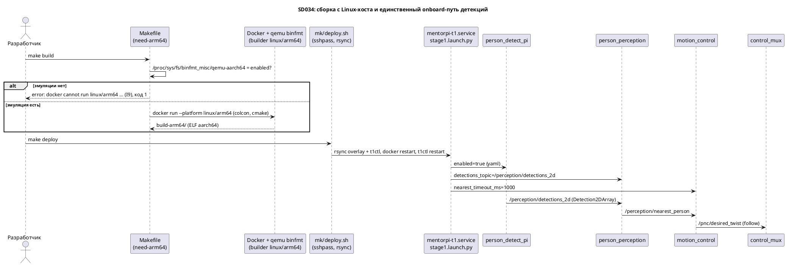

# SD034. Технический дизайн

## Системный дизайн
1. **D1.** Хост разработки — Linux x86_64 (Ubuntu 22.04, Docker Engine 24 + buildx). Сборка остаётся кросс-сборкой в Docker под `linux/arm64`, на x86_64 её обеспечивает qemu через binfmt. Цель деплоя (Pi 5) не меняется.
   1. **D1.1.** Зависимости хоста ставятся двумя командами: `sudo apt install -y sshpass file qemu-user-static binfmt-support cmake python3-pip` и `python3 -m pip install --user pre-commit`. `file` нужен проверке архитектуры `t1ctl` в `make t1ctl` и `mk/deploy.sh`, `cmake` — нативной сборке тестов `t1ctl`, `pre-commit` — проверкам по AGENTS.md. `pre-commit` ставится через pip, а не apt: пакет Ubuntu 22.04 (2.17) падает на манифесте хука clang-format v21 (`InvalidManifestError`, тег `textproto`; найдено на код-ревью). Регистрация binfmt из пакета переживает перезагрузку.
   2. **D1.2.** Makefile проверяет эмуляцию до Docker. Внутренняя цель `need-arm64`: на хосте с `uname -m` = `aarch64`/`arm64` ничего не делает, иначе требует файл `/proc/sys/fs/binfmt_misc/qemu-aarch64` с первой строкой `enabled` и при отказе печатает I9 с кодом 1. Цель — order-only пререквизит обоих stamp-файлов builder-образов и целей `overlay`, `t1ctl`. Хвост `t1ctl` проверяет наличие `file` и только ELF aarch64 (ветка Mach-O снимается).
   3. **D1.3.** `mk/deploy.sh` и `mk/provision.sh` без `PATH="/opt/homebrew/bin:/usr/local/bin:${PATH}"`. Отказ без `sshpass` (и без `file` в `deploy.sh`) называет apt-пакет. В `deploy.sh` снимается проверка Mach-O, проверка ELF aarch64 остаётся. Защита SSH от `DISPLAY` и ssh-agent остаётся (на Linux-десктопе они тоже есть), комментарии про «Cursor/macOS» переписываются.
2. **D2.** Mac-инструменты разработки удаляются: `host/mac_person_detect/`, `mk/mac-detect.sh`, `mk/pi-detect.sh`, `mk/echo-detections.sh`, цели `mac-detect`, `pi-detect`, `echo-detections` и их переменные в строке `Env:` (`WEIGHTS IMAGE_TOPIC CONFIDENCE_THRESHOLD ROS_DOMAIN_ID ARGS`). В `.gitignore` уходят `*.pt`, `.pixi/` и две строки `host/mac_person_detect`, в `.pre-commit-config.yaml` — исключение `\.pixi/` и `--per-file-ignores` для `person_detect.py`. В `docker/overlay-builder/Dockerfile` убирается строка комментария «Mac person_detect is not in src/» — до первого `make env` на этом хосте, потому что stamp образа зависит от Dockerfile.
3. **D3.** Onboard-детекция — единственный путь.
   1. **D3.1.** `person_detect_pi`: `enabled` по умолчанию `true` в коде и yaml, выход — `/perception/detections_2d`. Колбэк параметра `enabled` остаётся ручным выключателем для стенда: при `false` нода перестаёт публиковать.
   2. **D3.2.** `person_perception`: одна подписка на `detections_topic` (`/perception/detections_2d`) с одним обработчиком и один `points_timeout_ms` = 1000 (прежнее offline-значение, SD027). Снимаются `detections_source`, `onboard_detections_topic`, `points_timeout_offline_ms`, `on_mac_detections`/`on_onboard_detections` (сливаются в один обработчик), `clear_detections_state`, `apply_points_timeout` и весь `on_set_parameters`: его клиентами были только `t1ctl detect` и `t1ctl debug`.
   3. **D3.3.** `person_perception`: снимается механизм DDS-пира для Mac — `ping_once`, поток `ping_loop`/`sleep_interruptible`, параметры `ethernet_ping_host`, `ethernet_ping_period_s`, `ethernet_ping_fail_threshold`, `ethernet_ip`, `wifi_ap_ip`, издатель `/perception/dds_peer`.
   4. **D3.4.** `motion_control`: один `nearest_timeout_ms` = 1000 (прежнее offline-значение, SD027); снимаются `detections_source`, `nearest_timeout_offline_ms`, `apply_nearest_timeout`, `on_set_parameters`. `stage1.launch.py` передаёт ноде только `nearest_timeout_ms: 1000`.
4. **D4.** Мост Foxglove и оверлей рамок удаляются.
   1. **D4.1.** `person_perception`: снимаются `publish_overlay`, `emit_overlay`, `draw_person_boxes`, издатель `/perception/persons/overlay`; из пакета уходят `cv_bridge` и OpenCV (`CMakeLists.txt`, `package.xml`). Подписка на RGB остаётся: `have_rgb_` — гейт в `publish_from_detections`.
   2. **D4.2.** `mentorpi_bringup`: удаляются `launch/foxglove_bridge.launch.py`, `config/foxglove_bridge.yaml`, аргумент `viewer_bridge` и include в `stage1.launch.py`, `exec_depend foxglove_bridge` и «viewer bridge» в описании пакета.
   3. **D4.3.** `docker/mentorpi-t1/Dockerfile`: из apt убирается `ros-humble-foxglove-bridge`, из комментария — фраза о нём. Действует при следующей пересборке образа (`FORCE_REBUILD=1 make provision`); `provision.sh` наличие пакета не проверяет, поэтому текущий образ на стенде сам не пересобирается.
5. **D5.** `t1ctl` без подкоманд `detect` и `debug`: удаляются `viewer.{cpp,hpp}`, `ros_detect.py`, `ros_debug.py`, их embed-блоки в `CMakeLists.txt`, связанные типы и функции в `units`, печать в `ui`, тесты. Константы топиков из `viewer.hpp` дублируют `units.hpp` и другим командам не нужны. `status`, `start`, `restart`, `stock`, `mode`, `calib` не меняются.
6. **D6.** `ROS_LOCALHOST_ONLY=0` остаётся везде: юнит, `units.cpp`, `calib.cpp`, `host/desktop/mentorpi-rviz`. В `host/systemd/mentorpi-t1.service` переписывается только комментарий: причина — уже не «RGB на Mac», а сетевое поведение, под которым замерен профиль FastDDS из SD029. `ExecStart` не меняется.
7. **D7.** `README.md` и `AGENTS.md` описывают только путь «Linux-хост → Pi 5»: зависимости хоста (D1.1), цели `make` (I8), `t1ctl` 2.0.0, одну onboard-детекцию; просмотр и проверка калибровки — rviz по VNC.
8. **D8.** Версии. Для пакетов 0.x ломающее изменение — minor, как в SD026–SD030; `t1ctl` 1.x — major по AGENTS.md.
   1. **D8.1.** `t1ctl` 1.9.0 → 2.0.0.
   2. **D8.2.** `mentorpi_person_detect` 0.3.0 → 0.4.0, `mentorpi_perception` 0.8.0 → 0.9.0 (после код-ревью 0.9.1: read-only `points_timeout_ms`).
   3. **D8.3.** `motion_control` 0.4.1 → 0.5.0 (после код-ревью 0.5.1: read-only `nearest_timeout_ms`).
   4. **D8.4.** `mentorpi_bringup` 0.9.0 → 0.10.0.
9. **D9.** Не меняется: стенд (Pi 5, Debian 12, контейнеры `MentorPi` и `mentorpi-t1`, `ExecStart` юнита, sudoers), `t1ctl-builder` и содержимое `overlay-builder` кроме комментария, sysctl и профиль FastDDS из SD029, rviz по VNC и `demo.rviz`, `mission_control`, режимы движения, модель YOLO11n, параметры ByteTrack и `infer_period_ms`, документы чужих SD.



## Программные интерфейсы

### ROS: топики
1. **I1.** `/perception/detections_2d` (`vision_msgs/msg/Detection2DArray`, QoS reliable, KeepLast(1)): издатель `person_detect_pi` (было `/perception/detections_2d_onboard`), подписчик `person_perception`. Контракт сообщения прежний: `Detection2D.id` — десятичный id ByteTrack, `results[0].hypothesis.class_id` = `person`.
2. **I2.** Удаляются топики `/perception/detections_2d_onboard`, `/perception/dds_peer` (`std_msgs/msg/String`, transient_local) и `/perception/persons/overlay` (`sensor_msgs/msg/Image`, bgr8).

### ROS: параметры нод
3. **I3.** `person_perception`.
   1. **I3.1.** Остаются с новым значением: `detections_topic` = `/perception/detections_2d`, `points_timeout_ms` = `1000` (int > 0, read-only: читается только при старте, `ros2 param set` отклоняется).
   2. **I3.2.** Удаляются: `detections_source`, `onboard_detections_topic`, `points_timeout_offline_ms`, `publish_overlay`, `ethernet_ping_host`, `ethernet_ping_period_s`, `ethernet_ping_fail_threshold`, `ethernet_ip`, `wifi_ap_ip`.
4. **I4.** `motion_control`: `nearest_timeout_ms` = `1000` (int > 0, read-only: только при старте, `ros2 param set` отклоняется); удаляются `detections_source` и `nearest_timeout_offline_ms`.
5. **I5.** `person_detect_pi`: `enabled` = `true` (bool, меняется на лету), `detections_topic` = `/perception/detections_2d`.

### Launch
6. **I6.** `stage1.launch.py`: аргумента `viewer_bridge` нет; в `share/mentorpi_bringup/launch` нет `foxglove_bridge.launch.py`.

### CLI `t1ctl`
7. **I7.** `t1ctl` 2.0.0: команды `status`, `start`, `restart`, `stock`, `mode forbid|allow|manual`, `calib …`. Подкоманд `detect [offline|mac]` и `debug [on|off]` нет, в `--help` нет секций `DEBUG` и `DETECT`. Вызов удалённой подкоманды — ошибка разбора CLI11: `error: …` в stderr, код 1, ни одного `docker exec`.

### Make
8. **I8.** Цели в `make help`: `help`, `env`, `env-overlay`, `env-t1ctl`, `build`, `overlay`, `t1ctl`, `deploy`, `provision`, `clean`, `env-clean`. Строка окружения — `Env: PI_HOST PI_PASSWORD PI_STAGING CONTAINER FORCE_REBUILD HTTP_PROXY HTTPS_PROXY`; прокси-переменные передаются в `docker build` builder-образов (хост за прокси, добавлено при имплементации). Целей `mac-detect`, `pi-detect`, `echo-detections` нет.
9. **I9.** Отказ `need-arm64` (stderr, код 1):
   ```
   error: docker cannot run linux/arm64 (no qemu-aarch64 binfmt on this host)
   install: sudo apt install qemu-user-static binfmt-support
   ```

## Изменения в приложениях

### Хост разработки (`lunix0x-workstation`, Ubuntu 22.04)
**Пункты:** D1.1

На машине нет `sshpass`, `file`, `cmake`, `pre-commit`, и не зарегистрирован qemu для arm64: `docker run --platform linux/arm64` падает с `exec format error`. Это состояние хоста, а не код, но README должен воспроизводить его командами из D1.1, поэтому установка — часть SD.

1. `sudo apt install -y sshpass file qemu-user-static binfmt-support cmake python3-pip` (sudo без пароля на машине есть) и `python3 -m pip install --user pre-commit` (D1.1).
2. Проверка: `docker run --rm --platform linux/arm64 debian:12 uname -m` → `aarch64`.
3. Docker, группы пользователя и сеть хоста не трогаем.

### `Makefile`
**Пункты:** D1.2, D2, I8, I9

Единственная точка входа оператора. Сейчас шапка обещает совместимость с `/usr/bin/make` macOS, есть три Mac-цели, а отсутствие эмуляции всплывает глубоко в Docker как `exec format error`. После правки файл рассчитан на Linux-хост и отказывает до запуска Docker.

1. Шапка: GNU Make на Linux-хосте; упоминание macOS и Make 3.81 уходит.
2. Цель `need-arm64` по D1.2, order-only пререквизит `$(OVERLAY_STAMP)`, `$(T1CTL_STAMP)`, `overlay`, `t1ctl`.
3. Удалить `mac-detect`, `pi-detect`, `echo-detections` из `.PHONY`, help и рецептов; строка `Env:` по I8.
4. Хвост `t1ctl`: `command -v file` или отказ с `sudo apt install file`; Mach-O-проверку убрать, aarch64 оставить.
5. Не трогаем: платформу, имена образов, команды colcon и cmake, рецепты `deploy`, `provision`, `clean`, `env-clean`.

### `mk/deploy.sh`, `mk/provision.sh`
**Пункты:** D1.3

Скрипты копируют сборку на Pi через `sshpass` и `rsync`. Mac в них — только окружение запуска: Homebrew-путь, текст ошибки и комментарии. Логика на стороне Pi от хоста не зависит.

1. Убрать строку `PATH="/opt/homebrew/bin:/usr/local/bin:${PATH}"`.
2. Отказ без `sshpass`: `error: sshpass is required (install: sudo apt install sshpass)`; в `deploy.sh` так же для `file`.
3. `deploy.sh`: ветку Mach-O снять, проверку `aarch64` оставить.
4. Комментарии «Cursor/macOS often has DISPLAY + ssh-agent keys» переписать про десктопную сессию; опции SSH не меняются.
5. Не трогаем: копирование, sudo и docker-команды на Pi, дефолты `PI_HOST`, `PI_PASSWORD`, `PI_STAGING`, `CONTAINER`.

### Mac-хвосты репозитория: `host/mac_person_detect/`, `mk/mac-detect.sh`, `mk/pi-detect.sh`, `mk/echo-detections.sh`, `.gitignore`, `.pre-commit-config.yaml`, `docker/overlay-builder/Dockerfile`
**Пункты:** D2

Пакет Pixi с YOLO на MPS и три обёртки над ним и над `t1ctl detect` больше не нужны: детекция одна и на роботе, переключать нечего. Конфиги линтера и git знают о путях пакета и должны забыть их вместе с ним.

1. Удалить каталог `host/mac_person_detect/` и три скрипта в `mk/`.
2. `.gitignore`: убрать `*.pt`, `.pixi/`, `host/mac_person_detect/fastdds-lan.xml`, `!host/mac_person_detect/pixi.lock`.
3. `.pre-commit-config.yaml`: убрать `\.pixi/|` из `exclude` и аргумент `--per-file-ignores=host/mac_person_detect/person_detect.py:E402`.
4. `docker/overlay-builder/Dockerfile`: убрать строку «Mac person_detect is not in src/.»; apt, NCNN и Vosk не трогаем.

### `host/t1ctl`
**Пункты:** D5, D8.1, I7

CLI оператора на хосте Pi. Подкоманды `detect` и `debug` были клиентами параметров `detections_source`, `enabled`, `publish_overlay` и процесса `foxglove_bridge`. Без выбора источника и без моста у них нет предмета, и они уходят вместе со своими помощниками внутри контейнера.

1. `main.cpp`: убрать `cmd_debug`, `cmd_detect`, `run_debug`, `run_detect`.
2. `units.hpp`/`units.cpp`: убрать `DebugCommand`, `DebugChange`, `kPersonPerceptionNode`, `kPublishOverlayParam`, `parse_debug_result`, `run_debug`, `fill_bridge_state`, `DetectCommand`, `DetectChange`, `kPersonDetectPiNode`, `kDetectionsSourceParam`, `kDetectEnabledParam`, `parse_detect_result`, `detect_source`, `debug_*`/`detect_*`-хелперы скриптов, `fail_debug_change`, `fail_detect_change`, include `ros_debug_embed.hpp`, `ros_detect_embed.hpp`, `viewer.hpp`. Функции, оставшиеся без вызовов, удалить.
3. `ui.hpp`/`ui.cpp`: убрать `print_debug*`, `print_detect*`, `print_viewer_*`, `print_viewer_kv`, `print_viewer_connect_hint`, `demo_contour_text`, `bridge_text`, `websocket_url`, строки и секции `debug`/`detect` в `print_help`, include `viewer.hpp`.
4. Удалить `src/viewer.cpp`, `src/viewer.hpp`, `src/ros_detect.py`, `src/ros_debug.py`; в `CMakeLists.txt` — их embed-блоки и `src/viewer.cpp` из обеих целей, `VERSION 2.0.0`.
5. `tests/test_status.cpp`: удалить `test_viewer_*`, `test_print_viewer_status_no_hints`, тесты `debug` и `detect`, их вызовы в `main()`, фикстуры и поля mock-раннера, нужные только им, проверку `FOXGLOVE DESKTOP` в `test_print_status_version_kv`.
6. Не трогаем: `status`, `mode`, `calib`, строку `dds buffers`, `ROS_LOCALHOST_ONLY=0` в оставшихся скриптах.

### `mentorpi_person_detect`
**Пункты:** D3.1, D8.2, I1, I5

Нода onboard-инференса (YOLO11n NCNN + ByteTrack). Сейчас она выключена по умолчанию и пишет в топик с суффиксом `_onboard`, потому что рядом был mac-топик. Теперь она — единственный источник и работает сразу после старта.

1. `src/person_detect_pi.cpp`: дефолт `enabled` → `true` (и инициализатор `enabled_`), дефолт `detections_topic` → `/perception/detections_2d`.
2. `config/person_detect_pi.yaml`: `enabled: true`, `detections_topic: /perception/detections_2d`; комментарий ByteTrack без сравнения с Mac.
3. `test/test_byte_track.cpp`: имя топика в комментарии.
4. `package.xml`: 0.4.0.
5. Не трогаем: NCNN, ByteTrack, `infer_period_ms`, `num_threads`, колбэк `enabled`.

### `mentorpi_perception`
**Пункты:** D3.2, D3.3, D4.1, D8.2, I1, I2, I3.1, I3.2

Нода сопоставляет рамки с облаком точек и публикует `/perception/nearest_person`. Сейчас в ней три слоя, существовавших ради Mac: выбор между двумя входами и двумя тайм-аутами, ping-поток, который подсказывал Mac IP робота, и оверлей для Foxglove. Остаётся ядро: один вход, облако, TF, lock цели.

1. Один `detections_sub_` на `detections_topic` и один обработчик, который сразу вызывает `accept_detections`.
2. `points_timeout_ms` читается один раз (дефолт 1000) в `points_timeout_`; `points_timeout_mac_ms_`, `points_timeout_offline_ms_`, `detections_source_`, `apply_points_timeout`, `clear_detections_state`, `on_set_parameters`, `param_cb_` убрать.
3. Убрать `ping_once`, `ping_loop`, `sleep_interruptible`, `ping_thread_`, `running_`, деструктор с `join`, `dds_peer_pub_`, параметры ethernet/wifi и их лог.
4. Убрать `publish_overlay_`, `emit_overlay`, `draw_person_boxes`, `overlay_pub_`, `kOverlayTopic`; `on_rgb` только ставит `have_rgb_`. Убрать include `cv_bridge`, `opencv2`, `std_msgs/msg/string.hpp` и сетевые заголовки; в `CMakeLists.txt` — `find_package(cv_bridge)`, `find_package(OpenCV)` с проверкой `/usr/local`, `cv_bridge` из `ament_target_dependencies`, OpenCV из include и link; в `package.xml` — `cv_bridge`.
5. `config/person_perception.yaml`: ключи I3.2 и Mac-комментарии убрать, `detections_topic: /perception/detections_2d`, `points_timeout_ms: 1000` с комментарием SD027. `package.xml`: 0.9.0, описание без «from Mac».
6. Не трогаем: `person_geometry`, `person_target_lock`, эго-компенсацию, `detections_timeout_ms`, `rate_hz`, топики `/perception/persons` и `/perception/nearest_person`.

### `motion_control`
**Пункты:** D3.4, D8.3, I4

Нода закона слежения. Выбор тайм-аута свежести `nearest_person` по источнику был нужен, потому что Mac давал пачки через 300 мс, а onboard подвисает до 0.5–0.7 с (SD027). Источник один — тайм-аут один.

1. `declare_parameter<int64_t>("nearest_timeout_ms", 1000)` → `nearest_timeout_`; убрать `detections_source_`, `nearest_timeout_mac_ms_`, `nearest_timeout_offline_ms_`, `apply_nearest_timeout`, `on_set_parameters`, `param_cb_`.
2. Лог старта без `detections_source` и offline-тайм-аута.
3. `package.xml`: 0.5.0.
4. Не трогаем: `follow_control.hpp`, гейт режима, `coasting`, разгон и торможение.

### `mentorpi_bringup`
**Пункты:** D3.1, D3.4, D4.2, D8.4, I6

Launch-пакет стека. Он передаёт нодам параметры источника и по аргументу поднимал мост Foxglove; обе вещи уходят. Файлы из `launch/` и `config/` ставятся через `install(DIRECTORY …)`, поэтому удалённые файлы исчезают из сборки только после `make clean`.

1. `stage1.launch.py` (T3): комментарии F08 и над `person_detect_pi` — onboard включена по умолчанию, упоминаний Mac нет.
2. `stage1.launch.py` (T4): у `motion_control` убрать `detections_source` и `nearest_timeout_offline_ms`, `nearest_timeout_ms: 1000` с комментарием SD027.
3. `stage1.launch.py` (T5): убрать `viewer_bridge`, `foxglove_bridge_launch` и его место в `LaunchDescription`; удалить `launch/foxglove_bridge.launch.py`, `config/foxglove_bridge.yaml`; `package.xml`: без `exec_depend foxglove_bridge`, описание без «viewer bridge», 0.10.0.
4. Не трогаем: слои датчиков, `fastdds_camera_frames.xml`, `demo.rviz`, `t1-stop`, `t1-uart-halt`.

### `docker/mentorpi-t1/Dockerfile`
**Пункты:** D4.3

Образ стека на Pi, собирается `make provision` поверх вендорского. Пакет моста в нём стоял только ради `foxglove_bridge.launch.py`.

1. Убрать `ros-humble-foxglove-bridge` из `apt-get install` и фразу про `foxglove_bridge` в шапке.
2. Не трогаем: остальные пакеты, копирование Deptrum/OpenCV, pyserial, `provision.sh`.

### `host/systemd/mentorpi-t1.service`
**Пункты:** D6

Юнит запускает stage1 в контейнере. Команда остаётся прежней, неверным стало только объяснение `ROS_LOCALHOST_ONLY=0`.

1. Комментарий: `.hiwonderrc` ставит `ROS_LOCALHOST_ONLY=1`, overlay его сбрасывает; с SD034 значение сохранено, так как под ним замерен профиль FastDDS SD029.
2. Не трогаем: `ExecStart`, `ExecStartPre`, `ExecStop`, `Restart`, `Conflicts`.

### `README.md`, `AGENTS.md`
**Пункты:** D7

Документация оператора и инструкции агента. Сейчас в них Mac как машина разработки, Mac-детекция по умолчанию и Foxglove как запасной просмотр и как способ проверить калибровку.

1. README: состав репозитория, «Что робот умеет», пример статуса (`version 2.0.0`), команды `t1ctl`, таблица пакетов, «Слежение за человеком», «Просмотр с датчиков», калибровка (проверка в rviz по VNC), «Сборка и выкладка», «Локальная сборка», «Проверка кода».
2. AGENTS.md: строка про `E402` для `person_detect.py`, раздел «Сборка и стенд» (Linux-хост, зависимости, запрет ставить на Pi нативный `t1ctl` хоста).
3. Не трогаем: разделы про режимы, путь команды скорости, калибровочные команды и таблицу замеров, доступ к стенду, роль агента.

## ToDo
Порядок: сначала хост и сборка, без них нечем проверять остальное; затем `t1ctl`, который снимает клиентов удаляемых параметров; затем ноды; затем мост в bringup и образе; документация последней, когда итог известен.

- [x] T1. Перевести сборку и деплой на Linux-хост, удалить Mac-инструменты разработки
  - **Реализует:** D1.1, D1.2, D1.3, D2, I8, I9
  - **Файлы:** `Makefile`, `mk/deploy.sh`, `mk/provision.sh`, `mk/mac-detect.sh`, `mk/pi-detect.sh`, `mk/echo-detections.sh`, `host/mac_person_detect/`, `.gitignore`, `.pre-commit-config.yaml`, `docker/overlay-builder/Dockerfile`
  - **Что нужно сделать:** Поставить на хост зависимости из D1.1 (apt и pip) и убедиться, что Docker запускает arm64-контейнер. В `Makefile` переписать шапку под GNU Make на Linux, удалить цели `mac-detect`, `pi-detect`, `echo-detections` из `.PHONY`, help и рецептов, сократить строку `Env:` до I8. Добавить цель `need-arm64` по D1.2: на `aarch64`/`arm64` она пустая, иначе читает первую строку `/proc/sys/fs/binfmt_misc/qemu-aarch64` и при отсутствии файла или значении не `enabled` печатает I9 и выходит с кодом 1. Подключить её order-only пререквизитом к обоим stamp-файлам и к целям `overlay` и `t1ctl`; в хвосте `t1ctl` проверить наличие `file` и снять ветку Mach-O.

    В `mk/deploy.sh` и `mk/provision.sh` убрать Homebrew-`PATH`, переписать отказ без `sshpass` (и без `file` в `deploy.sh`) на apt-подсказку, в `deploy.sh` снять проверку Mach-O, комментарии «Cursor/macOS» переписать; SSH-опции и логику на Pi не трогать. Удалить `host/mac_person_detect/`, три скрипта `mk/` и их хвосты в `.gitignore` и `.pre-commit-config.yaml` (D2). Строку комментария в `docker/overlay-builder/Dockerfile` убрать до первого `make env` на этом хосте, иначе stamp потребует повторной сборки образа. `make deploy` и `make provision` не запускать.
  - **Критерии приёмки:**
    1. AC1. `docker run --rm --platform linux/arm64 debian:12 uname -m` печатает `aarch64`; `sshpass -V`, `file --version`, `cmake --version`, `pre-commit --version` отвечают без ошибки.
    2. AC2. `make` печатает ровно цели и строку `Env:` из I8; `make mac-detect`, `make pi-detect`, `make echo-detections` → `No rule to make target`.
    3. AC3. `make build` на хосте проходит: есть `build-arm64/ros/install/setup.bash`, `file build-arm64/t1ctl/bin/t1ctl` → `ELF 64-bit LSB … ARM aarch64`.
    4. AC4. При выключенной эмуляции (`echo 0 | sudo tee /proc/sys/fs/binfmt_misc/qemu-aarch64`) `make overlay` завершается с кодом 1 и текстом I9 без запуска `docker`; после `echo 1 | sudo tee …` сборка снова идёт.
    5. AC5. `grep -rniE "homebrew|mach-o|darwin|macos|pixi|mac_person_detect" Makefile mk .gitignore .pre-commit-config.yaml docker` пусто; в `mk/` только `deploy.sh` и `provision.sh`; каталога `host/mac_person_detect` нет.
    6. AC6. `bash -n mk/deploy.sh mk/provision.sh` без ошибок; `pre-commit run --all-files` проходит.
  - **Проверка:** команды AC1–AC6 на хосте разработки. Первый `make build` собирает builder-образы под эмуляцией (NCNN, Vosk) и идёт долго.

- [x] T2. Убрать из `t1ctl` подкоманды `detect` и `debug`
  - **Реализует:** D5, D8.1, I7
  - **Файлы:** `host/t1ctl/src/main.cpp`, `host/t1ctl/src/ui.hpp`, `host/t1ctl/src/ui.cpp`, `host/t1ctl/src/units.hpp`, `host/t1ctl/src/units.cpp`, `host/t1ctl/src/viewer.hpp`, `host/t1ctl/src/viewer.cpp`, `host/t1ctl/src/ros_detect.py`, `host/t1ctl/src/ros_debug.py`, `host/t1ctl/CMakeLists.txt`, `host/t1ctl/tests/test_status.cpp`
  - **Что нужно сделать:** Удалить подкоманды `detect` и `debug` целиком по разделу «`host/t1ctl`»: разбор и `run_*` в `main.cpp`, типы и функции в `units`, печать и секции help в `ui`, файлы `viewer.*`, `ros_detect.py`, `ros_debug.py`, их embed-блоки и `src/viewer.cpp` в `CMakeLists.txt`. Функции, которые после удаления останутся без вызовов, тоже удалить: сборка идёт с `-Wall -Wextra -Wpedantic`. Версию в `CMakeLists.txt` поднять до 2.0.0 (D8.1) — из неё берутся `t1ctl --version` и строка `version` в статусе.

    В `tests/test_status.cpp` удалить тесты viewer, debug и detect, их вызовы в `main()` и фикстуры, нужные только им; остальные тесты не менять. Команды `status`, `start`, `restart`, `stock`, `mode`, `calib` и их скрипты с `ROS_LOCALHOST_ONLY=0` (D6) не трогать. README правится в T6.
  - **Критерии приёмки:**
    1. AC1. `cmake -S host/t1ctl -B host/t1ctl/build-host && cmake --build host/t1ctl/build-host && ctest --test-dir host/t1ctl/build-host --output-on-failure` проходит, `t1ctl_test` печатает `ok`, компилятор не выдаёт предупреждений.
    2. AC2. `host/t1ctl/build-host/t1ctl --help | grep -wiE "debug|detect|foxglove|mac"` пусто; `--version` → `t1ctl 2.0.0`.
    3. AC3. `t1ctl detect mac`, `t1ctl detect offline`, `t1ctl debug on` завершаются с кодом 1 и `error:` в stderr, без обращения к Docker.
    4. AC4. `grep -rniE "viewer|ros_debug|ros_detect|DebugCommand|DetectCommand|foxglove|8765" host/t1ctl` пусто.
    5. AC5. `make t1ctl` даёт ELF aarch64; на стенде после `make deploy` (оператор) `t1ctl --version` → 2.0.0, а `t1ctl status`, `t1ctl mode forbid`, `t1ctl mode allow`, `t1ctl calib` работают как до SD034.
  - **Проверка:** AC1–AC4 на хосте (AC3: `./host/t1ctl/build-host/t1ctl detect mac; echo $?`); AC5 — `make t1ctl && file build-arm64/t1ctl/bin/t1ctl`, стенд проверяет оператор.

- [x] T3. Сделать onboard-детекцию единственным входом `person_perception`
  - **Реализует:** D3.1, D3.2, D3.3, D4.1, D8.2, I1, I2, I3.1, I3.2, I5
  - **Файлы:** `src/mentorpi_person_detect/src/person_detect_pi.cpp`, `src/mentorpi_person_detect/config/person_detect_pi.yaml`, `src/mentorpi_person_detect/test/test_byte_track.cpp`, `src/mentorpi_person_detect/package.xml`, `src/mentorpi_perception/src/person_perception.cpp`, `src/mentorpi_perception/config/person_perception.yaml`, `src/mentorpi_perception/CMakeLists.txt`, `src/mentorpi_perception/package.xml`, `src/mentorpi_bringup/launch/stage1.launch.py` (только комментарии F08 и `person_detect_pi`)
  - **Что нужно сделать:** В `person_detect_pi` включить детекцию по умолчанию и перевести выход на `/perception/detections_2d` (D3.1, I5); дефолты в коде и значения в yaml должны совпадать, колбэк `enabled` остаётся. В `person_perception` оставить один вход `detections_topic` с одним обработчиком без проверки источника и один `points_timeout_ms` = 1000 (D3.2, I3.1). Удалить механизм DDS-пира (D3.3), оверлей вместе с `publish_overlay` и зависимостями `cv_bridge`/OpenCV (D4.1), `on_set_parameters` целиком, а из yaml — ключи I3.2 и Mac-комментарии. Лог старта печатает только оставшиеся параметры.

    Подписку на RGB и гейт `have_rgb_`, геометрию, lock цели, эго-компенсацию и `mission_control` не трогать. В `stage1.launch.py` здесь меняются только комментарии про F08 и `person_detect_pi`; параметры `motion_control` — T4, мост и версия `mentorpi_bringup` — T5. Версии: `mentorpi_person_detect` 0.4.0, `mentorpi_perception` 0.9.0 (D8.2), описание `mentorpi_perception` в `package.xml` без «from Mac».
  - **Критерии приёмки:**
    1. AC1. В builder-образе `colcon build` до `mentorpi_perception` и `mentorpi_person_detect` и `colcon test` этих пакетов проходят, `colcon test-result` без ошибок.
    2. AC2. `grep -rnE "detections_source|detections_2d_onboard|dds_peer|ethernet_ping|ethernet_ip|wifi_ap_ip|publish_overlay|persons/overlay|_offline_ms|on_mac" src/mentorpi_perception src/mentorpi_person_detect` пусто; `grep -rnE "cv_bridge|OpenCV|opencv" src/mentorpi_perception` пусто.
    3. AC3. Стенд, робот в `forbidden`: после `make deploy` и `t1ctl restart`, без других команд, `ros2 param get /person_detect_pi enabled` → `True`; `ros2 topic info /perception/detections_2d` → `Publisher count: 1`, `Subscription count: 1`.
    4. AC4. Стенд: в `ros2 topic list` нет `/perception/detections_2d_onboard`, `/perception/dds_peer`, `/perception/persons/overlay`; `ros2 param get /person_perception points_timeout_ms` → `1000`; в `ros2 param list /person_perception` нет ключей I3.2.
    5. AC5. Стенд: человек в кадре → `ros2 topic echo --once /perception/nearest_person` показывает `valid: true`; человек ушёл из кадра → через несколько секунд `valid: false`.
    6. AC6. Стенд: `ros2 param set /person_detect_pi enabled false` при человеке в кадре → `ros2 topic hz /perception/detections_2d` молчит, через ~1 с `nearest_person` `valid: false`; `enabled true` возвращает `valid: true`; после `t1ctl restart` `enabled` снова `True`.
    7. AC7. `t1ctl status` на стенде: `camera active`, `dds buffers active`, как до задачи.
  - **Проверка:** AC1 на хосте: `docker run --rm --platform linux/arm64 -v "$PWD:/workspace" -w /workspace mentorpi-overlay-builder:arm64 bash -c 'source /opt/ros/humble/setup.bash && B=build-arm64/test && colcon --log-base $B/log build --base-paths src --packages-up-to mentorpi_perception mentorpi_person_detect --build-base $B/build --install-base $B/install && colcon --log-base $B/log test --base-paths src --packages-select mentorpi_perception mentorpi_person_detect --build-base $B/build --install-base $B/install && colcon test-result --test-result-base $B/build --verbose'`. AC2 — grep на хосте. AC3–AC7 — оператор, в оболочке контейнера из «Финального QA».

- [x] T4. Оставить в `motion_control` один тайм-аут свежести
  - **Реализует:** D3.4, D8.3, I4
  - **Файлы:** `src/motion_control/src/motion_control.cpp`, `src/motion_control/package.xml`, `src/mentorpi_bringup/launch/stage1.launch.py` (параметры `motion_control`)
  - **Что нужно сделать:** В `motion_control` оставить один тайм-аут `nearest_timeout_ms` с дефолтом 1000 — прежнее offline-значение: по SD027 onboard-инференс подвисает на 0.5–0.7 с. Убрать `detections_source`, `nearest_timeout_offline_ms`, `apply_nearest_timeout` и `on_set_parameters`, лог старта печатать без источника. В `stage1.launch.py` у `motion_control` убрать `detections_source` и `nearest_timeout_offline_ms`, а `nearest_timeout_ms` поставить 1000 с комментарием про SD027. Код и launch меняются в одной задаче: иначе нода получит из launch прежнее Mac-окно 300 мс.

    Закон слежения (`follow_control.hpp`), гейт режима и `coasting`, остальные параметры `motion_control` в launch не трогать. Версия `motion_control` 0.5.0 (D8.3); версия `mentorpi_bringup` поднимается в T5. Двигать робота — только оператор.
  - **Критерии приёмки:**
    1. AC1. В builder-образе `colcon test` пакета `motion_control` (`test_follow_control`) проходит.
    2. AC2. `grep -rnE "detections_source|nearest_timeout_offline_ms" src` пусто.
    3. AC3. Стенд: `ros2 param get /motion_control nearest_timeout_ms` → `1000`; в `ros2 param list /motion_control` нет `detections_source` и `nearest_timeout_offline_ms`; строка `motion_control started (…)` в журнале без `detections_source`.
    4. AC4. Стенд в `forbidden`: `ros2 topic echo /pnc/desired_twist` — нули при человеке в кадре.
    5. AC5. Ходовая проверка, делает оператор: в `follow` сразу после `t1ctl restart`, без других команд, робот подъезжает к человеку и останавливается около 0.5 м; когда человек уходит из кадра, робот останавливается.
  - **Проверка:** AC1 — команда из T3 с `--packages-up-to motion_control` и `--packages-select motion_control`; AC2 — grep на хосте; AC3–AC5 — оператор на стенде (журнал: `journalctl -u mentorpi-t1 | grep "motion_control started"`).

- [x] T5. Убрать мост Foxglove из bringup и образа, поправить комментарий юнита
  - **Реализует:** D4.2, D4.3, D6, D8.4, I6
  - **Файлы:** `src/mentorpi_bringup/launch/stage1.launch.py`, `src/mentorpi_bringup/launch/foxglove_bridge.launch.py`, `src/mentorpi_bringup/config/foxglove_bridge.yaml`, `src/mentorpi_bringup/package.xml`, `docker/mentorpi-t1/Dockerfile`, `host/systemd/mentorpi-t1.service`
  - **Что нужно сделать:** Удалить из `mentorpi_bringup` мост Foxglove: аргумент `viewer_bridge` и include `foxglove_bridge_launch` в `stage1.launch.py`, файлы `foxglove_bridge.launch.py` и `foxglove_bridge.yaml`, `exec_depend foxglove_bridge` и «viewer bridge» в описании `package.xml`. Версия `mentorpi_bringup` 0.10.0 (D8.4) покрывает и правки `stage1.launch.py` из T3 и T4. В `docker/mentorpi-t1/Dockerfile` убрать `ros-humble-foxglove-bridge` из apt и фразу о нём в комментарии (D4.3).

    В `host/systemd/mentorpi-t1.service` переписать комментарий про `ROS_LOCALHOST_ONLY=0` по D6, не меняя `ExecStart`. Образ на стенде этой задачей не пересобирается: `make provision` без `FORCE_REBUILD=1` оставит старый образ с пакетом, это не мешает — мост никто не запускает. colcon не удаляет из install-дерева файлы, убранные из исходников, поэтому перед проверкой нужен `make clean`.
  - **Критерии приёмки:**
    1. AC1. После `make clean && make build` в `build-arm64/ros/install/mentorpi_bringup/share/mentorpi_bringup/` нет `launch/foxglove_bridge.launch.py` и `config/foxglove_bridge.yaml`.
    2. AC2. `grep -rniE "foxglove|8765|viewer_bridge" src docker host Makefile mk` пусто.
    3. AC3. Стенд после `make deploy` и `t1ctl restart`: `t1ctl status` → `demo active`, `camera active`; в `ros2 node list` нет `/foxglove_bridge`; на хосте Pi `ss -ltn | grep :8765` пусто.
    4. AC4. `ros2 launch mentorpi_bringup foxglove_bridge.launch.py` в контейнере завершается ошибкой «file 'foxglove_bridge.launch.py' was not found».
    5. AC5. `git diff host/systemd/mentorpi-t1.service` меняет только строки комментариев; ярлык «MentorPi rviz» по VNC открывает модель, TF, `/scan` и `/aurora/points2`.
    6. AC6. Если оператор решит пересобрать образ: `FORCE_REBUILD=1 make provision` проходит, `docker run --rm --entrypoint bash mentorpi-t1 -lc 'source /opt/ros/humble/setup.bash; ros2 pkg prefix foxglove_bridge'` → `Package not found`, стек поднимается (`demo active`).
  - **Проверка:** AC1, AC2 и `git diff` из AC5 — на хосте; AC3, AC4, rviz из AC5 и AC6 — оператор на стенде.

- [x] T6. Переписать README.md и AGENTS.md под Linux-хост без Mac и Foxglove
  - **Реализует:** D7
  - **Файлы:** `README.md`, `AGENTS.md`
  - **Что нужно сделать:** В README убрать `host/mac_person_detect` из состава репозитория и таблицы пакетов, в «Что робот умеет» оставить детекцию на роботе, включённую сразу, и просмотр только через rviz по VNC. В списке команд `t1ctl` нет `detect` и `debug`, пример статуса — с `version 2.0.0`; «Слежение за человеком» описывает один источник (`person_detect_pi` → `/perception/detections_2d`) без таблицы источников и ссылки на Mac README, у `mentorpi_person_detect` в таблице пакетов — «включено по умолчанию». «Просмотр с датчиков» — только rviz, без «Запасного сценария». В калибровке визуальная проверка переносится с Foxglove на rviz по VNC (стена облака лежит на лучах `/scan`, кольцо скана плоское на высоте лидара относительно `base_footprint`), строки про оверлей Foxglove и его сетку удалить, в таблице симптомов «в Foxglove» заменить на «в rviz».

    «Сборка и выкладка»: хост — Linux x86_64 (Ubuntu 22.04) с Docker Engine, команды установки из D1.1, текст отказа I9 и что с ним делать, цели по I8 без `mac-detect`. «Локальная сборка»: `t1ctl` нативно в `host/t1ctl/build-host` с `ctest`; «Проверка кода»: `pre-commit` через pip вместо `brew`. В AGENTS.md убрать упоминание `E402` для `person_detect.py`, в «Сборка и стенд» описать Linux-хост и его зависимости, фразу «Не ставить на Pi бинарник `t1ctl` с Mac/хоста» заменить на запрет ставить `t1ctl`, собранный нативно на хосте разработки.
  - **Критерии приёмки:**
    1. AC1. `grep -niwE "mac|macos|homebrew|brew|pixi|foxglove|8765" README.md AGENTS.md` и `grep -nE "t1ctl (detect|debug)|mac-detect|pi-detect|echo-detections|detections_2d_onboard|mac_person_detect" README.md AGENTS.md` пусты.
    2. AC2. Список команд `t1ctl` в README совпадает с `t1ctl --help` из T2, список целей — с выводом `make` из T1.
    3. AC3. В «Сборка и выкладка» команды установки зависимостей хоста, совпадающие с D1.1, и описание отказа I9.
    4. AC4. Раздел калибровки отсылает к rviz по VNC; все относительные ссылки README ведут на существующие файлы.
    5. AC5. `pre-commit run --all-files` проходит.
  - **Проверка:** AC1 и AC5 — команды на хосте; AC2 — сравнить README с `host/t1ctl/build-host/t1ctl --help` и `make`; AC3–AC4 — чтение разделов и `grep -oE "\]\([^)#]+" README.md | cut -c3- | grep -v "^http" | xargs -I{} test -e {}`.

## Покрытие

| Пункт | Задачи |
|-------|--------|
| D1.1 | T1 |
| D1.2 | T1 |
| D1.3 | T1 |
| D2 | T1 |
| D3.1 | T3 |
| D3.2 | T3 |
| D3.3 | T3 |
| D3.4 | T4 |
| D4.1 | T3 |
| D4.2 | T5 |
| D4.3 | T5 |
| D5 | T2 |
| D6 | T5 |
| D7 | T6 |
| D8.1 | T2 |
| D8.2 | T3 |
| D8.3 | T4 |
| D8.4 | T5 |
| D9 | T1–T6 (AC «что не сломалось») |
| I1 | T3 |
| I2 | T3 |
| I3.1 | T3 |
| I3.2 | T3 |
| I4 | T4 |
| I5 | T3 |
| I6 | T5 |
| I7 | T2 |
| I8 | T1 |
| I9 | T1 |

Итог: пунктов 29 (D — 19, I — 10), задач 6. Непокрытых пунктов нет.

## Финальный QA (оператор, T1–T6)

Предусловие: на хосте разработки после всех задач `make clean && make build`, затем `make deploy`. Проверки ROS — в оболочке контейнера: `docker exec -it -u ubuntu mentorpi-t1 bash -lc 'source /home/ubuntu/ros2_ws/.hiwonderrc; export ROS_LOCALHOST_ONLY=0; source /home/ubuntu/mentorpi_t1_ws/install/setup.bash; exec bash'`. Робот в `t1ctl mode forbid`, кроме ходовой проверки T4 AC5.

### T1 — сборка и деплой с Linux-хоста
1. `make` — цели и `Env:` по I8 (AC2); `make mac-detect` → `No rule to make target`.
2. `make deploy` с этого хоста проходит до `==> done` и печатает версию `t1ctl` (AC3, D1.3).

### T2 — `t1ctl` без `detect` и `debug`
1. На Pi: `t1ctl --version` → 2.0.0; `t1ctl --help` без `debug`/`detect` (AC2, AC5).
2. `t1ctl detect mac; echo $?` → `error: …`, `1` (AC3).
3. `t1ctl status`, `t1ctl mode forbid`, `t1ctl mode allow`, `t1ctl calib` — как раньше (AC5).

### T3 — единственный вход детекций
1. После `t1ctl restart`: `ros2 param get /person_detect_pi enabled` → `True`; `ros2 topic info /perception/detections_2d` → 1 издатель, 1 подписчик (AC3).
2. `ros2 topic list | grep -E "detections_2d_onboard|dds_peer|persons/overlay"` пусто; `ros2 param get /person_perception points_timeout_ms` → `1000` (AC4).
3. Встать в кадр и уйти: `nearest_person` `valid: true` → `valid: false` (AC5).
4. `ros2 param set /person_detect_pi enabled false` → детекции молчат, `valid: false`; `true` → возвращаются (AC6).
5. `t1ctl status`: `camera active`, `dds buffers active` (AC7).

### T4 — один тайм-аут `motion_control`
1. `ros2 param get /motion_control nearest_timeout_ms` → `1000`; `ros2 param list /motion_control` без удалённых ключей (AC3).
2. В `forbidden` `/pnc/desired_twist` — нули (AC4).
3. Оператор: `t1ctl mode allow`, робот едет за человеком и останавливается около 0.5 м; человек ушёл — робот стоит (AC5).

### T5 — без моста Foxglove
1. `t1ctl status` → `demo active`, `camera active`; `ros2 node list` без `/foxglove_bridge`; `ss -ltn | grep :8765` на хосте Pi пусто (AC3).
2. `ros2 launch mentorpi_bringup foxglove_bridge.launch.py` → «was not found» (AC4).
3. Ярлык «MentorPi rviz» по VNC показывает модель, TF, скан и облако (AC5).
4. По желанию: `FORCE_REBUILD=1 make provision` и проверка `ros2 pkg prefix foxglove_bridge` → `Package not found` (AC6).

### T6 — документация
1. Пройти README «Сборка и выкладка» на этом хосте: команда зависимостей и цели совпадают с тем, что реально работает (AC2, AC3).
2. Раздел калибровки: проверка результата в rviz по VNC (AC4).
