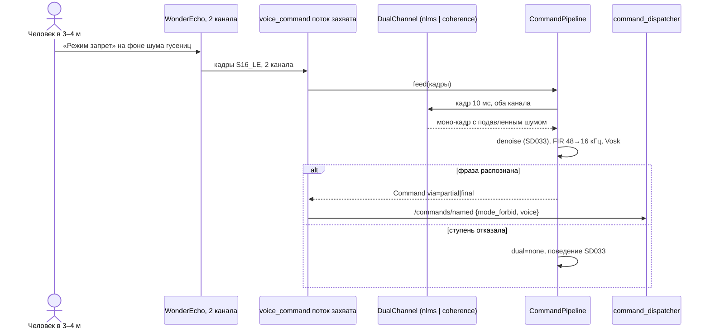

# SD035. Технический дизайн

BA: [solution.md](solution.md). Дизайн UI: skipped (экранов нет). Каталог: F21, продолжение SD031 и SD033.

Как сейчас. `CommandPipeline::feed` (SD033) сводит каналы `mix_to_mono`, кормит одноканальную очистку `Denoiser` кадрами 10 мс, прореживает FIR до 16 кГц и отдаёт Vosk; по умолчанию `denoise: speexdsp`, `partial_trigger: true`, `capture_channels: 1`. На записях SD033 стоя проходит 6 из 6 команд, на ходу с 3–4 м обычным голосом 0 из 6. Каналы WonderEcho разные: одинаковых отсчётов 0,1–0,2 %, разность L−R всего на 2–4 дБ ниже канала, лучшая взаимная корреляция 0,35 при сдвиге до 0,5 мс; отношение сигнал/шум в полосе речи от −7 до −1 дБ. Инструменты SD033 переиспользуются как есть: запись звука в ноде, офлайн-бенч `voice_bench`, разметка `labels.tsv`, фикстуры вне git, скрипт стенда `scratch/sd033/t1_stand.sh`.

Решения оператора по СА (2026-09-16): сравнить два метода на записях и выбрать по цифрам; снять новую серию записей; прогон приёмки 3–6 команд; добавленная задержка ответа 0,2–0,3 с приемлема.

«Сборщик» ниже: `docker run --rm --platform linux/arm64 -v "$PWD:/workspace" -w /workspace [-e MENTORPI_VOICE_TEST_DATA_DIR=/workspace/scratch/sd033/fixtures] mentorpi-overlay-builder:arm64 bash -lc 'source /opt/ros/humble/setup.bash && colcon --log-base build-arm64/ros/log <build|test> --base-paths src --build-base build-arm64/ros/build --install-base build-arm64/ros/install --packages-up-to mentorpi_voice'`.

## Системный дизайн

1. **D1.** Двухканальная ступень встаёт в `CommandPipeline` перед сведением в моно: кадр интерливед-звука на `capture_rate` → `DualChannel` → моно-кадр → одноканальная очистка `denoise` (SD033) → прореживание → Vosk.
   1. **D1.1.** Ступень работает кадрами 10 мс (`capture_rate / 100`), как и одноканальная очистка; хвост меньше кадра ждёт следующего блока (механизм `pending_` из SD033 не меняется).
   2. **D1.2.** При `capture_channels: 1` или `dual: "none"` ступень вырождается в полусумму каналов, то есть в нынешнее поведение SD033.
   3. **D1.3.** Отказ ступени (неизвестное имя метода, один канал на входе, ошибка инициализации) даёт `none` и текст ошибки. Нода пишет ERROR и работает дальше как SD033 (BA, негативный №2).
2. **D2.** Два метода, оба живут одновременно, выбор делает бенч.
   1. **D2.1.** `nlms`: адаптивный подавитель. Второй канал считается опорой шума, адаптивный FIR длиной `nlms_taps` (стартовое 256 отсчётов, около 5,3 мс при 48 кГц) с нормализованным шагом `nlms_mu` (стартовое 0.1) вычитает из первого канала коррелированную часть; выход — остаток. Адаптация идёт непрерывно, норма коэффициентов ограничена, деление защищено регуляризацией.
   2. **D2.2.** `coherence`: спектральная маска. Кадры `coherence_fft` (стартовое 512, около 10,7 мс при 48 кГц) с окном Ханна и перекрытием 50 %, свой радикс-2 FFT. По сглаженным во времени спектрам считается когерентность каждой полосы; полосы с низкой когерентностью давятся до `coherence_floor_db` (стартовое −18), высокие проходят. Выход — полусумма каналов под маской, сборка overlap-add. Задержка одного кадра, около 11 мс, что много меньше допуска оператора.
   3. **D2.3.** Выравнивание каналов по задержке и усилению не делаем: замеренный сдвиг не больше 0,5 мс и укладывается и в окно FFT, и в длину адаптивного фильтра.
   4. **D2.4.** Значение `dual` по умолчанию выбирает бенч (D5) по критериям в порядке: больше попаданий в сессиях на ходу; в сессии стоя не меньше, чем у `dual: none`; при равенстве меньше лишних команд в сессии без команд; дальше дешевле по `ms_per_s` на Pi. Числового порога нет (BA).
3. **D3.** Записи новой серии (оператор), все в два канала, скриптом стенда. Сессии: `d1_drive` (едет, говорящий в 3–4 м обычным голосом), `d2_drive_noise` (то же, рядом разговор или музыка), `d3_drive_talk` (едет, команд не говорят), `d4_still` (стоит, контроль). В сессиях с командами два круга «режим запрет», «режим следование», «режим ручной», то есть шесть команд: меньше делает вердикт случайным, больше оператор делать не хочет. Записи и разметка лежат в `scratch/sd035/rec/` вне git.
4. **D4.** Наблюдаемость: строка `audio stats` получает `dual_ms_per_s`; на старте пишется `dual ready kind=… rate=…` либо ERROR `dual init failed …, using none`.
5. **D5.** Бенч: `voice_bench` получает `--dual <список>`, который перемножается с уже имеющимися списками; имя конфигурации получает `;d=<kind>`. Сравнение идёт на записях D3 в сборщике, время на Pi снимает оператор.
6. **D6.** Не меняется (ограничение scope): контракт `/commands/named` и `command_dispatcher`, решение о команде и одноканальная очистка из SD033, политика ответа и заглушка микрофона, пульт, `t1ctl`, `stage1.launch.py`, runtime-образ `mentorpi-t1`, `mk/provision.sh`, образ сборщика (новых внешних библиотек нет, FFT свой).
7. **D7.** Приёмка: бенч на записях (агент), затем проезд оператора с вердиктом, 3–6 команд с 3–4 м обычным голосом, плюс загрузка ядер рядом с цифрами SD033 (голос около 7 % одного ядра).

### As-built (бенч T4, 2026-09-16, записи в `scratch/sd035/rec/` вне git)

`voice_bench` в сборщике, шесть команд в каждой сессии с командами, три минуты на прогон.

| Сессия | `d=none` | `d=nlms` | `d=coherence` | `speexdsp; d=none` | `speexdsp; d=coherence` |
|--------|----------|----------|---------------|--------------------|--------------------------|
| `d1_drive` (едет, 3–4 м) | 0 из 6 | 0 из 6 | 0 из 6 | 0 из 6 | 0 из 6 |
| `d2_drive_noise` (едет, шум рядом) | 0 из 6 | 0 из 6 | 0 из 6 | **3 из 6** | 0 из 6 |
| `d4_still` (стоит, контроль) | 6 из 6 | **0 из 6** | 6 из 6 | 6 из 6 | 6 из 6 |
| `d3_drive_talk` (без команд) | лишних 0 | лишних 0 | лишних 0 | лишних 0 | лишних 0 |
| Итого | 6 из 18 | 0 из 18 | 6 из 18 | **9 из 18** | 6 из 18 |

`ms_per_s` под эмуляцией: `d=none` 2725, `d=coherence` 2948 (+8 %), `d=nlms` 3018 (+11 %).

Вывод по критериям D2.4: ни один двухканальный метод не добавил команд на ходу. `coherence` не испортил ближний случай (стоя 6 из 6), но и не помог. `nlms` обнулил даже контрольную сессию стоя: микрофоны стоят близко, речь попадает в опорный канал и подавляется вместе с шумом, как и предполагалось в D2.1. Лучший результат по-прежнему у одноканальной цепочки SD033 (`speexdsp`, без ступени): 9 из 18, и все попадания в `d2_drive_noise` и `d4_still`. Значение `dual` по умолчанию поэтому не выбрано: решение вынесено оператору.

## Программные интерфейсы

### ROS

1. **I1.** Без изменений: `/commands/named`, `/control/state`, `/control/mode_toggle`, сервис `/control/set_mode`. Новых топиков и сообщений нет.

### Параметры `voice_command.yaml`

2. **I2.** `capture_channels: 2` (по умолчанию теперь два канала), `dual: "<итог T4>"`, `nlms_taps: 256`, `nlms_mu: 0.1`, `coherence_fft: 512`, `coherence_floor_db: -18`. Значения стартовые, итог записывает T4. Неизвестный `dual` ноду не роняет (D1.3); `nlms_taps` вне 16–2048, `nlms_mu` вне (0, 1], `coherence_fft` не степень двойки в 128–4096 и `coherence_floor_db` > 0 роняют ноду на старте.

### Функции модулей C++

3. **I3.** `mentorpi_voice/fft.hpp`: `void fft_forward(std::vector<std::complex<float>>& data);` и `void fft_inverse(std::vector<std::complex<float>>& data);` на месте, размер — степень двойки, иначе `std::invalid_argument`; `std::vector<float> hann_window(size_t n);`.
4. **I4.** `mentorpi_voice/dual_channel.hpp`:
   - `class DualChannel { virtual void process(const int16_t* interleaved, int16_t* mono_out) = 0; virtual void reset() = 0; virtual const char* name() const = 0; };` кадр `frame` отсчётов на канал;
   - `struct DualOptions { size_t nlms_taps{256}; double nlms_mu{0.1}; size_t coherence_fft{512}; double coherence_floor_db{-18.0}; };`
   - `std::unique_ptr<DualChannel> make_dual_channel(std::string_view kind, unsigned rate, size_t frame, unsigned channels, const DualOptions& opt, std::string& error);` всегда отдаёт объект: при отказе `none` (полусумма каналов) и непустой `error`.
5. **I5.** `mentorpi_voice/command_pipeline.hpp`: `PipelineConfig` получает `std::string dual` и `DualOptions dual_options`; `feed` прогоняет кадр через ступень до `mix_to_mono`; `PipelineTiming` получает `double dual_ms`; `reset()` сбрасывает ступень; появляются `const char* dual_name() const` и `const std::string& dual_error() const`.

### CLI

6. **I6.** `voice_bench --dual none,nlms,coherence` (перемножается с остальными списками), плюс `--nlms-taps`, `--nlms-mu`, `--coherence-fft`, `--coherence-floor-db`. Имя конфигурации получает `;d=<kind>`.

### Логи

7. **I7.** `voice_command`: стартовая строка `voice_command dual (dual=%s nlms_taps=%zu nlms_mu=%.2f coherence_fft=%zu coherence_floor_db=%.1f)`; `dual ready kind=%s rate=%ld frame=%zu`; ERROR `dual init failed kind=%s: %s, using none`; `audio stats` дополняется `dual_ms_per_s=%.1f`.

### Сборка

8. **I8.** Новых внешних зависимостей нет: FFT свой, образ сборщика и runtime-образ не меняются. `mentorpi_voice/CMakeLists.txt` получает тесты `test_fft` и `test_dual_channel`; `mentorpi_voice` 0.3.0.

## Изменения в приложениях

### `mentorpi_voice`: модули и бенч
**Пункты:** D1.1, D1.2, D1.3, D2.1, D2.2, D2.3, D5, I3, I4, I5, I6, I8

Пакет уже держит чистую логику в header-only модулях с тестами (SD033). Архитектурно добавляется одна ступень перед сведением в моно: до неё конвейер работал с моно-сигналом, теперь начало цепочки видит оба канала. Точка встраивания одна — начало `CommandPipeline::feed`, поэтому нода и бенч получают ступень одновременно и считают одно и то же.

1. `fft.hpp` (I3) и `dual_channel.hpp` (I4) с тестами `test_fft`, `test_dual_channel`.
2. `command_pipeline.hpp` (I5): ступень, замер времени, сброс, имя и ошибка метода.
3. `voice_bench` (I6): списки методов и их параметров, имя конфигурации.
4. Нельзя: тянуть в модули ROS и ALSA, менять решение о команде и одноканальную очистку.

### `voice_command`
**Пункты:** D4, I2, I7

Нода-владелец звука. Меняется только начало цепочки и наблюдаемость: параметры ступени, её создание вместе с конвейером, строки лога и `dual_ms_per_s` в статистике.

1. Параметры I2 с проверкой на старте, `capture_channels: 2` по умолчанию в YAML.
2. Логи I7, `dual_ms_per_s` в строке статистики.
3. Не трогаем: запись звука, микшер, политику ответа, заглушку, публикацию команд.

## ToDo

Порядок: сначала записи (оператор может снять их, пока идёт код: сборка на стенде уже умеет два канала), затем чистая логика, конвейер и бенч, выбор значений, нода, приёмка.

- [x] T1. Новая серия записей в два канала
  - **Реализует:** D3
  - **Файлы:** `scratch/sd035/rec/` (вне git), `docs/SD/SD035/STATUS.md`
  - **Что нужно сделать:** Оператор снимает четыре сессии скриптом стенда SD033 (`record <сессия>`), все с `capture_channels: 2`: `d1_drive` (робот едет пультом, говорящий в 3–4 м обычным голосом), `d2_drive_noise` (то же, рядом разговор или музыка), `d3_drive_talk` (едет, команд не говорят), `d4_still` (стоит, контроль). В сессиях с командами два круга «режим запрет», «режим следование», «режим ручной». Агент дополняет список сессий в скрипте, пишет `labels.tsv`, проверяет пары WAV (частота, каналы, пик, отсечение) и считает, насколько различаются каналы в новых записях.

    Записи и разметка остаются вне git, как в SD033. Выкладка новой сборки для этой задачи не нужна: запись двух каналов умеет сборка SD033, уже стоящая на стенде.
  - **Критерии приёмки:**
    1. AC1. В `scratch/sd035/rec/` лежат четыре сессии, в каждой пара `_raw.wav` (два канала, 48 кГц) и `_asr.wav`, отсечения нет.
    2. AC2. `labels.tsv` перечисляет файлы сессий; в `d1_drive`, `d2_drive_noise` и `d4_still` по шесть команд, в `d3_drive_talk` пусто.
    3. AC3. Для каждой новой записи посчитаны доля одинаковых отсчётов каналов и взаимная корреляция; числа записаны в STATUS рядом с замерами SD033.
    4. AC4. В `git status` нет ни WAV, ни разметки.
  - **Проверка:** `scratch/sd033/t1_stand.sh record d1_drive` и остальные три сессии (оператор); скрипт сам копирует файлы и печатает параметры WAV; агент считает корреляцию каналов и пишет `labels.tsv`.

- [x] T2. FFT и двухканальная ступень
  - **Реализует:** D2.1, D2.2, D2.3, I3, I4
  - **Файлы:** `src/mentorpi_voice/include/mentorpi_voice/fft.hpp`, `src/mentorpi_voice/include/mentorpi_voice/dual_channel.hpp`, `src/mentorpi_voice/test/test_fft.cpp`, `src/mentorpi_voice/test/test_dual_channel.cpp`, `src/mentorpi_voice/CMakeLists.txt`
  - **Что нужно сделать:** `fft.hpp` (I3) даёт радикс-2 преобразование на месте и окно Ханна; размер не степень двойки бросает исключение. `dual_channel.hpp` (I4) даёт интерфейс и три реализации: `none` (полусумма каналов), `nlms` (адаптивный FIR по опорному каналу, D2.1) и `coherence` (маска по когерентности с перекрытием 50 %, D2.2). Фабрика всегда возвращает объект: при неизвестном имени, одном канале или неверных параметрах отдаёт `none` и текст ошибки.

    Модули без ROS, ALSA и внешних библиотек, чтобы их можно было гонять тестами и в бенче. Проверка на синтетике: опорный канал строится как задержанная и отфильтрованная копия шума, речь эмулируется коррелированным между каналами сигналом.
  - **Критерии приёмки:**
    1. AC1. `test_fft`: прямое и обратное преобразование возвращают исходный сигнал с ошибкой не больше 1e-4; спектр синуса даёт пик в своей полосе; размер 300 бросает `std::invalid_argument`.
    2. AC2. `test_dual_channel`: `none` отдаёт полусумму каналов побитно.
    3. AC3. `nlms` на синтетике (шум в опорном канале, тот же шум с задержкой и фильтром в основном) подавляет шум не меньше чем на 10 дБ после первой секунды.
    4. AC4. `coherence` на синтетике (некоррелированный шум в каналах плюс одинаковый тон) оставляет тон в пределах 3 дБ и давит некоррелированную часть не меньше чем на 6 дБ.
    5. AC5. Оба метода на общем сигнале не дают переполнения: выход в пределах int16, на нулях выход около нуля.
    6. AC6. Фабрика: неизвестное имя, один канал, `nlms_taps: 4`, `coherence_fft: 300` дают `name() == "none"` и непустую ошибку.
  - **Проверка:** сборщик `build` и `test`, `colcon test-result --verbose`.

- [x] T3. Ступень в конвейере и в бенче
  - **Реализует:** D1.1, D1.2, D5, I5, I6
  - **Файлы:** `src/mentorpi_voice/include/mentorpi_voice/command_pipeline.hpp`, `src/mentorpi_voice/src/voice_bench.cpp`, `src/mentorpi_voice/test/test_command_pipeline.cpp`
  - **Что нужно сделать:** `CommandPipeline` получает поля `dual` и `dual_options` в конфиге, создаёт ступень рядом с очисткой и прогоняет через неё кадры до `mix_to_mono`; при одном канале или `dual: none` путь остаётся прежним. Время ступени копится в `PipelineTiming::dual_ms`, `reset()` сбрасывает её состояние, появляются `dual_name()` и `dual_error()`. `voice_bench` получает `--dual` и параметры методов, имя конфигурации дополняется `;d=<kind>`.

    Тесты конвейера дополняются: при `dual: none` и одном канале блок для распознавателя остаётся прежним (проверка из SD033 не должна измениться), при двух каналах и `dual: coherence` блок отличается от простой полусуммы, а `dual_ms` растёт.
  - **Критерии приёмки:**
    1. AC1. `test_command_pipeline`: старые проверки SD033 проходят без изменений (промежуточный результат, принудительный финал, отключённый промежуточный результат, совпадение блока с `Decimator`).
    2. AC2. При `channels: 2` и `dual: "coherence"` блок для распознавателя отличается от `Decimator(3)` по полусумме каналов, а `take_timing().dual_ms > 0`.
    3. AC3. При `channels: 1` и `dual: "nlms"` конвейер работает, `dual_name()` равен `none`, `dual_error()` непуст.
    4. AC4. `voice_bench --dual none,coherence --help`-совместимость: перебор даёт вдвое больше конфигураций, имена содержат `;d=`.
  - **Проверка:** сборщик `build` и `test`; `voice_bench --dir scratch/sd035/rec --labels … --dual none,coherence --jobs 1` на одной сессии.

- [x] T4. Бенч на новых записях и выбор значений
  - **Реализует:** D2.4, D7 (часть про бенч)
  - **Файлы:** `scratch/sd035/bench/` (вне git), `docs/SD/SD035/tech.md`, `docs/SD/SD035/STATUS.md`
  - **Что нужно сделать:** Агент гоняет `voice_bench` на записях T1: методы `none`, `nlms`, `coherence` в паре с одноканальной очисткой `none` и `speexdsp`, затем перебирает по два-три значения `nlms_taps`, `nlms_mu`, `coherence_fft` и `coherence_floor_db` у лучших вариантов. Выбор по критериям D2.4, итог (таблица по сессиям и выбранные значения) записывается в раздел As-built `tech.md`.

    Если ни один метод не поднимает попадания на ходу, это записывается честно и выносится на решение оператора, как в SD033: своими силами требование не додумывается.
  - **Критерии приёмки:**
    1. AC1. Таблица попаданий по четырём сессиям для всех прогнанных вариантов записана в As-built `tech.md`.
    2. AC2. Выбранные `dual`, `nlms_*` или `coherence_*` записаны в As-built с объяснением по критериям D2.4.
    3. AC3. Оператор снял `ms_per_s` на Pi для двух лучших вариантов, числа в As-built.
    4. AC4. В `git status` нет ни WAV, ни разметки, ни выгрузок бенча.
  - **Проверка:** `voice_bench` в сборщике (`--jobs` по числу ядер), затем `scratch/sd033/t1_stand.sh bench` на Pi с разметкой SD035 (оператор).

- [ ] T5. Ступень в ноде
  - **Реализует:** D1.3, D4, I2, I7, I8
  - **Файлы:** `src/mentorpi_voice/src/voice_command.cpp`, `src/mentorpi_voice/config/voice_command.yaml`, `src/mentorpi_voice/package.xml`
  - **Что нужно сделать:** Нода читает параметры I2 с проверкой на старте, передаёт их в конвейер, пишет строки I7 и добавляет `dual_ms_per_s` в статистику. В YAML идут значения из As-built T4 и `capture_channels: 2`. Отказ ступени даёт ERROR и работу как в SD033. `mentorpi_voice` 0.3.0.

    Остальное поведение ноды не трогаем: запись звука, микшер, политика ответа, заглушка микрофона и публикация команд остаются как в SD033.
  - **Критерии приёмки:**
    1. AC1. `make build` зелёный, `colcon test` пакета зелёный, `pre-commit` зелёный.
    2. AC2. На стенде в журнале `voice_command dual (...)` с параметрами I2 и `dual ready kind=<выбранный> rate=48000 frame=480`; `audio stats` содержит `dual_ms_per_s`.
    3. AC3. `dual: bogus` в установленном YAML даёт ERROR `dual init failed …, using none`, команды стоя проходят.
    4. AC4. `nlms_taps: 4` роняет ноду на старте с именем параметра.
  - **Проверка:** `make build`, сборщик `test`; оператор: `scratch/sd033/t1_stand.sh deploy`, затем `default` и правка `dual` в установленном YAML.

- [ ] T6. Стенд: приёмка на ходу
  - **Реализует:** D6, D7, I1
  - **Файлы:** `docs/SD/SD035/tech.md`, `docs/SD/SD035/STATUS.md`
  - **Что нужно сделать:** Оператор выкладывает сборку T5 и делает проезд: 3–6 команд с 3–4 м обычным голосом на ходу, отдельно попытка на фоне разговора или музыки, затем те же команды стоя. Во время прогона снимается загрузка ядер и частота рамок детекции. Агент по журналу и ответам оператора записывает результаты в As-built и STATUS, проверяет границы диффа и отмечает задачи.

    Порогов BA не задаёт: числа записываются как есть, вердикт «заметно лучше или нет» даёт оператор. Агент команд не произносит и режимы движения не шлёт.
  - **Критерии приёмки:**
    1. AC1. Проезд: сколько команд из сказанных прошло на ходу с 3–4 м обычным голосом, записано в STATUS; вердикт оператора «заметно лучше» или «нет» записан его словами.
    2. AC2. Стоя команды проходят, как в SD033 (проверка, что ступень не сломала ближний случай).
    3. AC3. Ложные срабатывания за прогон посчитаны и записаны.
    4. AC4. Загрузка ядер и частота `/perception/detections_2d` записаны рядом с цифрами SD033 (голос около 7 % одного ядра).
    5. AC5. Пульт и `t1ctl` работают как раньше: кнопка в `Forbidden` режим не меняет, `t1ctl mode allow` меняет без ответа.
    6. AC6. `git diff --stat` содержит только `src/mentorpi_voice/` и `docs/SD/SD035/`.
  - **Проверка:** оператор: выкладка, проезд, `t1ctl status`, журнал юнита, замер нагрузки; агент: разбор журнала и `git diff --stat`.

## Покрытие

| Пункт | Задачи |
|-------|--------|
| D1.1 | T3 |
| D1.2 | T3 |
| D1.3 | T5 |
| D2.1 | T2 |
| D2.2 | T2 |
| D2.3 | T2 |
| D2.4 | T4 |
| D3 | T1 |
| D4 | T5 |
| D5 | T3 |
| D6 | T6 |
| D7 | T4, T6 |
| I1 | T6 |
| I2 | T5 |
| I3 | T2 |
| I4 | T2 |
| I5 | T3 |
| I6 | T3 |
| I7 | T5 |
| I8 | T5 |

Итог: пунктов 20, задач 6. Непокрытых пунктов: нет.

## Финальный QA (агент и оператор, T1–T6)

Предусловие: записи T1 в `scratch/sd035/rec/`, сборка `make build`; для стендовых шагов выкладка T5 и робот на полигоне.

### T2–T4 (хост разработки, сборщик)
1. `colcon test --packages-select mentorpi_voice` зелёный, включая `test_fft` и `test_dual_channel` (AC T2.1–T2.6, T3.1–T3.3).
2. `voice_bench` по записям T1, таблица и выбранные значения в As-built (AC T3.4, T4.1, T4.2).
3. `git status` без WAV и разметки (AC T1.4, T4.4).

### T1, T4–T6 (стенд, оператор)
1. Четыре сессии записей в два канала (AC T1.1–T1.3).
2. `ms_per_s` на Pi для двух лучших вариантов (AC T4.3).
3. Старт с выбранной ступенью, отказ `dual: bogus`, неверный параметр (AC T5.2–T5.4).
4. Проезд с вердиктом, стоя, ложные, нагрузка, пульт и `t1ctl`, дифф (AC T6.1–T6.6).
