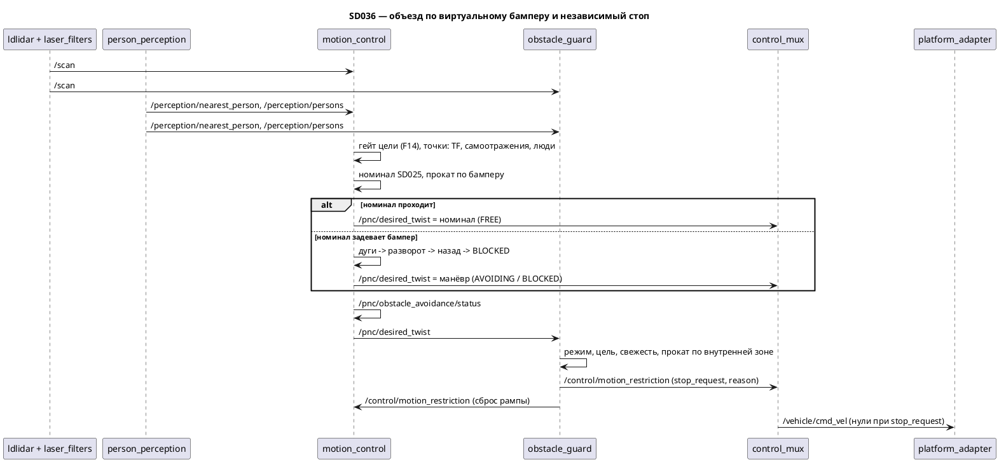

# SD036. Технический дизайн — объезд по виртуальному бамперу, охрана и инвариант цели

Дизайн UI: skipped (экранов нет). Каталог: F12, F13, F14. BA: [solution.md](solution.md).
Протокол замера: [measure.md](measure.md) (пишется на T7).

Зачем: робот следует за человеком, но предметов не видит и въезжает в них; стоп-гейт в `control_mux` есть, а источник `/control/motion_restriction` — заглушка `stub_graph` с вечным `false`. По BA робот должен обтекать предметы по виртуальному бамперу, пока цель видна; разворот на месте и отъезд назад разрешены только на время объезда, люди — не препятствия, без цели робот стоит, без лидара едет без охраны.

Развилки, закрытые оператором на фазе SA: алгоритм — **перебор манёвров** с оценкой, в которую входит отталкивание из референса `scratch/sd036`; объезд живёт в **`motion_control`**, независимый стоп — новая нода **`obstacle_guard`** вместо `stub_graph`; наблюдаемость — **только топик** статуса и `reason` в `/control/motion_restriction`, без `t1ctl` и без маркеров Foxglove; до стенда — **юнит-тесты и 2D-симуляция** замкнутого контура в `colcon test`.

## Системный дизайн

1. **D1.** Состав решения. F12 — точки препятствий из `/scan`, геометрия бампера и планировщик объезда внутри `motion_control`: он остаётся единственным владельцем `/pnc/desired_twist`, закон SD025 и гейт цели не переезжают. F13 — нода `obstacle_guard` в пакете `motion_control`: независимо от планировщика прокатывает желаемую команду по внутренней зоне стопа и публикует `/control/motion_restriction` вместо `stub_graph`. F14 — дважды: гейт `motion_control` (как сейчас) и стоп `no_target` в `obstacle_guard`, чтобы инвариант держался на входе `control_mux` даже при ошибке закона. Платформа гусеничная, кинематика — дифференциальная `(v, ω)` с полусуммой колеи `track_half_sum`.

2. **D2.** Точки препятствий — общий код обеих нод, чистые функции без ROS.
   1. **D2.1. Скан в базу.** Каждый луч `LaserScan` → точка в `lidar_frame` → точка в `base_footprint` через позу `Pose2d(x, y, yaw)` лидара в базе. Поза берётся из TF (`base_footprint ← scan.header.frame_id`, последнее доступное преобразование), ничего не зашито: в URDF у `lidar_frame` поворот `π` и вынос вперёд. Отбрасываются `NaN`, `inf`, `r < range_min`, `r > range_max` (LD19 пишет `26.0` за пределом — SD012).
   2. **D2.2. Самоотражения.** Точки внутри габарита, расширенного на `self_filter_pad`, отбрасываются: лидар может видеть собственный корпус. Цена: предмет, уже прижатый к корпусу ближе `self_filter_pad`, не виден; поэтому паддинг мал и меньше `margin_min`.
   3. **D2.3. Люди не препятствия.** Точки в радиусе `person_exclusion_radius` от любого человека из свежего `/perception/persons` (кадр `base_footprint`) отбрасываются, число отброшенных считается. Устаревший список людей ничего не исключает — но тогда устарела и цель, и гейт закрыт.

3. **D3.** Виртуальный бампер.
   1. **D3.1. Габарит.** Прямоугольник в `base_footprint`: `footprint_front`, `footprint_back`, `footprint_half_width`. Стартовые значения — огибающая мешей URDF (As-built), сверка рулеткой — T7. Центр разворота на месте принимается в начале `base_footprint`.
   2. **D3.2. Зазор и прокат.** Зазор — евклидово расстояние от точки до прямоугольника в позе робота, `0` внутри. Прокат команды `(v, ω)` — точное интегрирование дуги (при `ω = 0` — прямая, при `v = 0` — поворот на месте) с шагом `rollout_dt` на горизонте; минимальный зазор берётся по всем шагам, включая `t = 0` и конец. Шаг выбирается так, чтобы перемещение угла габарита за шаг было меньше `margin_min`.
   3. **D3.3. Запас по скорости.** `margin(|v|) = margin_min + (margin_max − margin_min) · clamp(|v| / margin_speed_ref, 0, 1)` — перенос `dynamic_inflation` из `local_planner/include/body.hpp`: быстрее едем — раньше реагируем. Для разворота на месте `|v| = 0`, запас `margin_min`.

4. **D4.** Планировщик объезда `plan_avoidance` — чистая функция с явной памятью, вызывается на каждом тике `motion_control` только при открытом гейте.
   1. **D4.1. Свободно (`FREE`).** Сначала считается номинал — `compute_follow_twist` SD025 без изменений. Если номинал нулевой (коридор удержания) — стоять всегда допустимо, выдаётся ноль. Если прокат номинала на `horizon_s` даёт зазор `≥ margin(|v|)` — выдаётся номинал побитно. Возврат из объезда в `FREE` — только при зазоре `≥ margin(|v|) + free_hysteresis`. Так без препятствий в бампере поведение SD025 сохраняется: без заднего хода и без доворота на месте.
   2. **D4.2. Лестница манёвров.** Номинал не проходит → перебор кандидатов по ступеням, первая непустая ступень выигрывает: (1) дуги вперёд — `arc_linear_samples` значений `v` от `min_breakaway_linear` до потолка следования × `arc_angular_samples` значений `ω` в `±max_angular_avoid`, с ограничением быстрой гусеницы `v + |ω| · track_half_sum ≤ ceiling`; (2) разворот на месте `(0, ±rotate_angular)`; (3) назад `(−reverse_linear, {−reverse_angular, 0, +reverse_angular})`; (4) иначе `BLOCKED`, ноль. Кандидат допустим, если зазор проката `≥ margin(|v|)`. **Правило выхода:** если робот уже ближе `margin` (текущий зазор `d0`), кандидат допустим и тогда, когда зазор по всему прокату не опускается ниже `d0 − 1 мм` и к концу растёт, а касания (`0`) нет — иначе робот, которого предмет застал вплотную, навсегда застрянет в `BLOCKED`.
   3. **D4.3. Оценка.** Среди допустимых кандидатов ступени выбирается минимум `J`, при равенстве — меньший `|ω|`. Цель считается неподвижной на горизонте; `p_end` — поза конца проката, `b_end` — пеленг цели из `p_end`, `d_min` — зазор проката.
      - `J_goal = w_goal · max(0, |t − p_end| − standoff)` — продвижение к дистанции удержания;
      - `J_head = w_heading · |b_end|`;
      - `J_fov = w_fov · max(0, |b_end| − (camera_half_fov − fov_margin))` — держать цель в кадре (FOV 74°, SD012);
      - `J_obs = 0.5 · kp_repulse · (1/max(d_min, 1 мм) − 1/influence_range)²` при `d_min < influence_range`, иначе `0` — отталкивание из референса (`local_planner/temp`, `0.5·KP·(1/d − 1/R)²`), оно и даёт обтекание «как вода»: из допустимых дуг выбирается та, что дальше от предметов;
      - `J_smooth = w_smooth · (|v − v_prev| / ceiling + |ω − ω_prev| / max_angular)`.
   4. **D4.4. Защёлки против дребезга.** `ROTATE` держит знак, выбранный на входе, пока не появится допустимая дуга. `REVERSE` держится не меньше `reverse_min_s` (по номинальному `dt`), если сам кандидат назад остаётся допустимым; иначе лестница пересчитывается сразу. Память: состояние, манёвр, знак разворота, время отъезда, прошлая команда, `prev_linear`.
   5. **D4.5. Формирование команды и инварианты.** `FREE` — номинал как есть. `ARC` — разгон через `apply_rate_limit` (`accel_linear`) со страгиванием `min_breakaway_linear` с места по правилу SD025 D2.3, а замедление до скорости кандидата — сразу, без `decel_linear` (решение оператора 2026-09-17 на T2: с рампой торможения на скорости следования дугам оставалось 0.22–0.25 м/с и доворот до ~0.2 рад/с, робот вставал на разворот вместо обтекания); кандидат оценивается уже после формирования, прокат проверяет ровно выходную команду; угловая сохраняет кривизну кандидата `ω = κ · v_out` и режется `min(max_angular, (ceiling − v_out) / track_half_sum)`; после отъезда назад рампа стартует с нуля. `ROTATE`, `REVERSE`, `BLOCKED` выдаются сразу, без рампы, `prev_linear = 0`. Инварианты (тест): `|ω| ≤ max_angular`; у дуг `v + |ω| · track_half_sum ≤ ceiling`; `v < 0` только в `REVERSE`; `v = 0 ∧ ω ≠ 0` только в `ROTATE`; в `BLOCKED` ровно ноль; `follow_control.hpp` не меняется.
   6. **D4.6. Известные свойства**, не дефекты. Разворот и отъезд могут увести цель из кадра — тогда гейт закрывается и робот встаёт (негативный сценарий BA №2); `J_fov` это лишь снижает. В тупике возможен цикл «назад — вперёд», пока цель видна: это и есть «стараться достичь». Люди детектируются примерно 2 Гц с задержкой, круг исключения отстаёт от движения — компенсирует радиус. Скан 10 Гц: за период робот проходит до 3.7 см, это покрывает запас. Мгновенный переход из дуги в разворот даёт короткий выбег, его покрывает `margin_min`.

      **Ограничение обзора камеры (находка T4, решение оператора 2026-09-18 — принять).** Если для объезда нужен уход курса больше полуугла камеры (0.645 рад) относительно направления на цель, цель выходит из кадра на дуге или развороте, гейт закрывается, и робот встаёт по негативному сценарию BA №2; неподвижный человек вне кадра робота больше не тронет. В симуляции так ведут себя стул r 0.2 м ровно на линии робот—человек в 1.2 м и предмет шириной 0.2–0.5 м в 0.1 м перед роботом (первая допустимая дуга после разворота примерно на 60°). Не помогли ни перебор 72 наборов параметров, ни фиксация стороны дуги, ни штраф поля зрения по всей траектории, ни запрет манёвров, уводящих цель из кадра. Стул, перекрывающий линию краем (смещение от 0.2 м), объезжается. Память цели на время объезда (по одометрии, в симуляции помогала при 5 с и больше) отложена до стека навигации F16–F19.

5. **D5.** Нода `motion_control`.
   1. **D5.1. Входы.** Новые подписки `/scan`, `/perception/persons`; TF-буфер для позы лидара. Скан старше `scan_timeout_ms` или без TF → `NO_SCAN`: выдаётся номинал SD025 без охраны (BA, решение оператора), TF-ошибка логируется с троттлингом. Гейт `valid ∧ ¬coasting ∧ fresh ∧ AutoFollow` не меняется; при закрытом гейте — нули и `INACTIVE`, память планировщика сбрасывается вместе с `prev_linear`.
   2. **D5.2. Статус.** На каждом тике публикуется `/pnc/obstacle_avoidance/status`: состояние, манёвр, текущий зазор, запас, число точек препятствий и исключённых точек.
   3. **D5.3. Параметры.** Все параметры ноды переезжают из инлайна `stage1.launch.py` в YAML пакета без изменения значений SD025; габарит и фильтры — в общий `footprint.yaml`, который читают обе ноды. `enable_avoidance: false` — выключатель на стенде: нода не подписывается на скан, выдаёт номинал, статус `DISABLED`. Валидация при старте: `margin_min ≤ margin_max ≤ influence_range`, `self_filter_pad < margin_min`, `rotate_angular · track_half_sum ≤ max_linear`, `min_breakaway_linear ≤ reverse_linear ≤ max_linear`, `0 < rollout_dt ≤ horizon_s`, `camera_half_fov > fov_margin ≥ 0`, число выборок `≥ 1` (угловых — нечётное).
   4. **D5.4. Стоп сбрасывает рампу.** Подписка на `/control/motion_restriction`: пока `stop_request = true`, `prev_linear` и память планировщика сбрасываются, как при закрытом гейте. Закрывает хвост SD025 D6.5: после снятия запрета скорость не возобновляется скачком.

6. **D6.** Нода `obstacle_guard` (F13, F14).
   1. **D6.1. Решение.** Чистая функция, порядок проверок существенен:

      | # | Условие | `stop_request` | `reason` |
      |---|---------|----------------|----------|
      | 1 | нет `/control/state` или режим не `AUTO_FOLLOW` | `false` | `""` |
      | 2 | цель непригодна: `!valid`, `coasting` или старше `nearest_timeout_ms` | `true` | `no_target` |
      | 3 | `/pnc/desired_twist` старше `command_timeout_ms` | `true` | `no_command` |
      | 4 | скан старше `scan_timeout_ms` или нет TF | `false` | `no_scan` |
      | 5 | прокат команды на `stop_horizon_s` даёт зазор `< stop_margin` и зазор при этом убывает | `true` | `obstacle` |
      | 6 | иначе | `false` | `""` |

      Нулевая команда в п.5 не прокатывается: стоять безопасно. Убывание — то же правило выхода, что D4.2, чтобы охрана не мешала отъезжать от предмета.
   2. **D6.2. Согласованность с планировщиком.** Внутренняя зона уже бампера: `stop_margin < margin_min`, `stop_horizon_s ≤ horizon_s`, те же точки (D2) и тот же габарит (`footprint.yaml`). Тогда любая команда, допустимая для планировщика, охрану не трогает, и `obstacle` срабатывает только на внезапное препятствие или ошибку планировщика. Связь записана в YAML-комментариях и проверяется тестом на стартовых значениях.
   3. **D6.3. Нода.** Таймер `rate_hz`, публикация на каждом тике, единственный издатель `/control/motion_restriction`. Удержание: `obstacle` снимается не раньше `hold_ms` после последнего срабатывания; остальные причины снимаются сразу, выход из `AUTO_FOLLOW` снимает всё сразу. Если нода умерла, `control_mux` держит последнее значение: `true` — робот стоит, `false` — едет без охраны, как при потере лидара.

7. **D7.** Заглушка уходит. `stub_graph` снимается со `stage1.launch.py` вместе с аргументом `rate_hz`; пакет `src/mentorpi_stubs` удаляется, `exec_depend` из `mentorpi_bringup` убирается, README правится. Второго издателя на `/control/motion_restriction` быть не должно.

8. **D8.** Проверка до стенда — 2D-симуляция замкнутого контура в `colcon test`, без ROS. Мир — окружности и отрезки. Лидар — лучевой трассировщик в `lidar_frame` с позой лидара из URDF, ~450 лучей, скан раз в два тика. Шасси — точная дуга без проскальзывания, 20 Гц. Восприятие — цель и люди видны, если `|пеленг| ≤ camera_half_fov` и дальность `≥ 0.3 м`; загораживание не моделируется (упрощение записано). В цикле `plan_avoidance` → `decide_guard` → `gate_mux`. Критерий безопасности — зазор габарита до геометрии мира `> 0` на каждом тике.

9. **D9.** Что не меняется: `control_mux` и `gate_mux`, `platform_adapter`, `control_state`, пульт и мгновенный стоп с него, поведение `Manual` и `Forbidden`; закон `follow_control.hpp`; контракт `/perception/*` и `mission_control`; `t1ctl` и Foxglove (решение оператора — только топик); глубинная камера в охране не участвует; документы SD001 и SD025 не правятся.

10. **D10.** Стенд и приёмка. Стартовые значения параметров (I4.2, I5) — не SLA: T4 может их поправить, чтобы сцены проходили, итог подбирается на стенде по [measure.md](measure.md) и фиксируется в YAML. Приёмка качественная, как в SD025: вердикт оператора по проездам из сценариев BA и бэги. Робота в движение приводит только оператор; сборку и деплой запускает оператор.

### As-built (репозиторий и закрытые SD, не замер стенда)

| Параметр | Значение |
|----------|----------|
| габарит по мешам URDF (`base_link`, `wheel_link`, оболочки) | `x ∈ [−0.166, 0.175]`, `y ∈ [−0.123, 0.123]` м |
| описанный радиус разворота | `≈ 0.214` м |
| `lidar_frame` в URDF | вынос `lidar_x = 0.090`, `rpy = (0, 0, π)` |
| `/scan` (SD006, SD012) | LD19, ~9.9 Гц, 448–449 лучей, нет отражения → `26.0` |
| FOV камеры (SD012) | 74° × 51°, `camera_half_fov = 0.645` рад |
| детекция людей (README) | ~2 Гц на Pi |
| `track_half_sum`, `min_breakaway_linear`, `max_linear_follow` | `0.1407`, `0.10`, `0.25` |



## Программные интерфейсы

### ROS 2 топики и сообщения
1. **I1.** Статус объезда.
   1. **I1.1.** Новое сообщение `mentorpi_msgs/msg/ObstacleAvoidanceStatus`:
      ```
      # SD036 I1: obstacle avoidance state of motion_control (F12).
      uint8 INACTIVE=0   # gate closed: not AutoFollow or target unusable
      uint8 FREE=1       # SD025 command passes the bumper
      uint8 AVOIDING=2   # maneuver instead of the SD025 command
      uint8 BLOCKED=3    # every maneuver hits the bumper, command is zero
      uint8 NO_SCAN=4    # no fresh scan or no TF: SD025 command without guard
      uint8 DISABLED=5   # enable_avoidance is false

      uint8 MANEUVER_NONE=0
      uint8 MANEUVER_ARC=1
      uint8 MANEUVER_ROTATE=2
      uint8 MANEUVER_REVERSE=3

      std_msgs/Header header
      uint8 state
      uint8 maneuver
      float32 min_clearance   # m, footprint to nearest obstacle point now; -1 without points
      float32 bumper_margin   # m, margin for the emitted |linear_x|
      uint16 obstacle_points  # after self filter and person exclusion
      uint16 excluded_points  # dropped by person exclusion
      ```
   2. **I1.2.** Топик `/pnc/obstacle_avoidance/status`, издатель `motion_control`, QoS reliable KeepLast(1), на каждом тике (`rate_hz`), `header.frame_id = base_footprint`.
2. **I2.** `/control/motion_restriction` (`mentorpi_msgs/MotionRestriction`, тип не меняется).
   1. **I2.1.** Издатель — `obstacle_guard` вместо `stub_graph`, QoS reliable KeepLast(1) как у заглушки, `rate_hz` 20.
   2. **I2.2.** Значения `reason`: `""` (`false`), `obstacle` (`true`), `no_target` (`true`), `no_command` (`true`), `no_scan` (`false`, охрана выключена). Константы — в `guard_decision.hpp`.
3. **I3.** Новые подписки. `motion_control`: `/scan` (`sensor_msgs/LaserScan`, SensorDataQoS), `/perception/persons` (`PersonArray`, reliable KeepLast(1)), `/control/motion_restriction` (reliable KeepLast(1)), TF `base_footprint ← lidar_frame`. `obstacle_guard`: те же плюс `/control/state` (reliable transient_local), `/perception/nearest_person`, `/pnc/desired_twist` (reliable KeepLast(1)). Зависимости пакета: `sensor_msgs`, `tf2`, `tf2_ros` (есть в сборщике).

### Параметры
4. **I4.** `motion_control`.
   1. **I4.1.** `src/motion_control/config/motion_control.yaml` (`/**: ros__parameters`): параметры SD025 переносятся из `stage1.launch.py` с теми же значениями — `standoff 0.5`, `max_linear 0.37`, `max_angular 2.0`, `kp_lin 0.8`, `kp_ang 1.5`, `dist_deadband 0.05`, `min_breakaway_linear 0.10`, `accel_linear 0.30`, `decel_linear 0.60`, `max_linear_follow 0.25`, `ang_deadband 0.05`, `track_half_sum 0.1407`, `nearest_timeout_ms 1000`, `rate_hz 20.0`.
   2. **I4.2.** Там же новые, стартовые значения: `enable_avoidance true`, `scan_timeout_ms 300`, `persons_timeout_ms 1000`, `margin_min 0.05`, `margin_max 0.20` (на T7 → 0.12), `margin_speed_ref 0.25`, `influence_range 0.40` (на T7 → 0.25), `horizon_s 1.5`, `rollout_dt 0.1`, `arc_linear_samples 4`, `arc_angular_samples 9`, `max_angular_avoid 1.0`, `rotate_angular 0.8` (быстрая гусеница 0.11 м/с — выше страгивания), `reverse_linear 0.10`, `reverse_angular 0.5`, `reverse_min_s 0.8`, `free_hysteresis 0.03`, `camera_half_fov 0.645`, `fov_margin 0.10`, `w_goal 1.0`, `w_heading 0.3`, `w_fov 5.0`, `kp_repulse 0.01`, `w_smooth 0.2`.
   3. **I4.3.** `src/motion_control/config/footprint.yaml` (`/**: ros__parameters`), общий для обеих нод: `footprint_front 0.175`, `footprint_back 0.166`, `footprint_half_width 0.123`, `self_filter_pad 0.02`, `person_exclusion_radius 0.25` (стартовое 0.35, уменьшено по стенду на T7, см. STATUS). Ноды объявляют только свои ключи; лишние ключи файла rclcpp игнорирует.
5. **I5.** `obstacle_guard`: `src/motion_control/config/obstacle_guard.yaml` + `footprint.yaml`. Стартовые: `rate_hz 20.0`, `nearest_timeout_ms 1000`, `persons_timeout_ms 1000`, `scan_timeout_ms 300`, `command_timeout_ms 300`, `stop_margin 0.02`, `stop_horizon_s 0.5`, `rollout_dt 0.05`, `hold_ms 300`. Валидация: всё `> 0`, `rollout_dt ≤ stop_horizon_s`.

### Функции C++ (`src/motion_control/include/motion_control/`, без ROS)
6. **I6.** `obstacle_points.hpp`:
   ```cpp
   struct Point2d { double x; double y; };
   struct Pose2d { double x; double y; double yaw; };
   struct Footprint { double front; double back; double half_width; };
   std::vector<Point2d> scan_to_base_points(const std::vector<float>& ranges, double angle_min,
                                            double angle_increment, double range_min,
                                            double range_max, const Pose2d& lidar_in_base);
   void drop_self_points(std::vector<Point2d>& points, const Footprint& fp, double pad);
   std::size_t exclude_person_points(std::vector<Point2d>& points,
                                     const std::vector<Point2d>& persons, double radius);
   ```
7. **I7.** `virtual_bumper.hpp`:
   ```cpp
   double footprint_clearance(const Footprint& fp, const Pose2d& robot, const Point2d& p);  // 0 inside
   double min_clearance(const Footprint& fp, const Pose2d& robot, const std::vector<Point2d>& pts);  // +inf if empty
   Pose2d integrate_twist(const Pose2d& start, double v, double w, double t);  // exact arc
   struct Rollout { double min_clearance; double start_clearance; bool non_decreasing; Pose2d end; };
   Rollout rollout_twist(const Footprint& fp, double v, double w, double horizon_s, double step_s,
                         const std::vector<Point2d>& pts);
   double bumper_margin(double speed_abs, double margin_min, double margin_max, double speed_ref);
   bool rollout_admissible(const Rollout& r, double margin);  // D4.2 incl. exit rule
   ```
8. **I8.** `avoidance_planner.hpp`:
   ```cpp
   enum class AvoidState : uint8_t { kFree = 1, kAvoiding = 2, kBlocked = 3 };  // wire = I1.1
   enum class Maneuver : uint8_t { kNone = 0, kArc = 1, kRotate = 2, kReverse = 3 };
   struct AvoidanceParams { Footprint footprint; double margin_min, margin_max, margin_speed_ref,
     influence_range, horizon_s, rollout_dt, max_angular_avoid, rotate_angular, reverse_linear,
     reverse_angular, reverse_min_s, free_hysteresis, camera_half_fov, fov_margin, w_goal,
     w_heading, w_fov, kp_repulse, w_smooth; int arc_linear_samples, arc_angular_samples; };
   struct AvoidanceMemory { AvoidState state; Maneuver maneuver; int rotate_sign;
     double reverse_elapsed_s; Twist2d prev_cmd; double prev_linear; };
   struct AvoidanceResult { Twist2d cmd; AvoidState state; Maneuver maneuver;
     double min_clearance; double bumper_margin; };
   AvoidanceResult plan_avoidance(double target_x, double target_y,
                                  const std::vector<Point2d>& points, double dt,
                                  const FollowControlParams& follow,
                                  const AvoidanceParams& avoid, AvoidanceMemory& memory);
   void reset_avoidance(AvoidanceMemory& memory);
   ```
9. **I9.** `guard_decision.hpp`:
   ```cpp
   inline constexpr const char* kReasonNone = "";          // and kReasonObstacle "obstacle",
   // kReasonNoTarget "no_target", kReasonNoCommand "no_command", kReasonNoScan "no_scan"
   struct GuardInputs { bool have_state; uint8_t state; bool target_usable; bool command_fresh;
     Twist2d command; bool scan_fresh; const std::vector<Point2d>* points; double now_s; };
   struct GuardParams { Footprint footprint; double stop_margin, stop_horizon_s, rollout_dt, hold_s; };
   struct GuardMemory { bool have_obstacle; double last_obstacle_s; };
   struct GuardDecision { bool stop_request; const char* reason; };
   GuardDecision decide_guard(const GuardInputs& in, const GuardParams& p, GuardMemory& m);
   ```

### Launch
10. **I10.** `src/mentorpi_bringup/launch/stage1.launch.py`.
    1. **I10.1.** `motion_control` получает `parameters=[footprint.yaml, motion_control.yaml]` из share пакета вместо инлайн-словаря.
    2. **I10.2.** Добавлен узел `obstacle_guard` (`parameters=[footprint.yaml, obstacle_guard.yaml]`); узел `stub_graph` и аргумент `rate_hz` удалены; докстринг и комментарий `F12/F13/F14` обновлены.

## Изменения в приложениях

### `mentorpi_msgs`
**Пункты:** I1.1

Пакет контракта контура. Добавляется одно сообщение статуса объезда; существующие типы, включая `MotionRestriction`, не меняются.

1. `msg/ObstacleAvoidanceStatus.msg` по I1.1, строка в `rosidl_generate_interfaces`.
2. Версия `1.3.0 → 1.4.0` (новая функциональность).
3. Не трогаем: `MotionRestriction.msg`, `NearestPerson.msg`, `PersonArray.msg`.

### `motion_control` — библиотека заголовков
**Пункты:** D2.1, D2.2, D2.3, D3.1, D3.2, D3.3, D4.1, D4.2, D4.3, D4.4, D4.5, D6.1, D6.2, I2.2, I6, I7, I8, I9

Сейчас в пакете один чистый заголовок — закон SD025. Рядом появляются четыре чистых заголовка без ROS: точки препятствий, геометрия бампера, планировщик и решение охраны. Их используют обе ноды и тесты; так планировщик и охрана считают зазор одним кодом, и D6.2 держится по построению.

1. `obstacle_points.hpp`, `virtual_bumper.hpp`, `avoidance_planner.hpp`, `guard_decision.hpp` по I6–I9.
2. `plan_avoidance` вызывает `compute_follow_twist` и `apply_rate_limit` из `follow_control.hpp`.
3. Не трогаем: `follow_control.hpp` и `test_follow_control.cpp` — закон SD025 побитно прежний.

### `motion_control` — нода `motion_control`
**Пункты:** D5.1, D5.2, D5.3, D5.4, I1.2, I3, I4.1, I4.2, I4.3

Нода остаётся единственным владельцем `/pnc/desired_twist`. Меняется источник команды при открытом гейте: вместо закона напрямую — планировщик, который сам решает, отдать ли номинал. Появляются входы скана и людей, TF, статус и реакция на стоп охраны.

1. Подписки и TF по I3, свежесть скана и `NO_SCAN` по D5.1.
2. Публикация статуса по I1.2.
3. Параметры из YAML по I4, валидация по D5.3, выключатель `enable_avoidance`.
4. Сброс рампы и памяти по `stop_request` (D5.4).
5. `CMakeLists.txt`, `package.xml`: зависимости `sensor_msgs`, `tf2`, `tf2_ros`; установка `config/`; версия `0.5.1 → 0.6.0`.
6. Не трогаем: гейт цели и его таймаут, топик и QoS `/pnc/desired_twist`.

### `motion_control` — нода `obstacle_guard`
**Пункты:** D1, D6.3, I2.1, I5

Новый исполняемый файл в том же пакете: независимый слой F13/F14 между планировщиком и `control_mux`. Он не считает объезд и не публикует скорость, только разрешает или запрещает движение.

1. `src/obstacle_guard.cpp`: подписки по I3, таймер, `decide_guard`, публикация I2.1, удержание D6.3, лог смены `stop_request` и `reason`.
2. `config/obstacle_guard.yaml` по I5, валидация параметров.
3. Не трогаем: `control_mux` — он уже зануляет команду по `stop_request` в любом режиме.

### `motion_control` — тесты
**Пункты:** D8

Тесты — исполняемые файлы с `add_test`, как `test_follow_control`, без gtest и без ROS.

1. `test_obstacle_points`, `test_virtual_bumper`, `test_avoidance_planner`, `test_guard_decision`.
2. `test/sim_world.hpp` (мир, трассировщик, шасси, модель восприятия) и `test_avoidance_sim` (сцены D8).

### `mentorpi_bringup`
**Пункты:** D7, D9, I10.1, I10.2

Launch поднимает весь граф. Узел заглушки заменяется узлом охраны, параметры `motion_control` берутся из YAML.

1. `stage1.launch.py` по I10.
2. `package.xml`: убрать `exec_depend mentorpi_stubs`; версия `0.10.0 → 0.11.0`.
3. Не трогаем: слои лидара, камеры, IMU, модели; `control_mux`, `platform_adapter`, пульт.

### `mentorpi_stubs`
**Пункты:** D7

Пакет содержал только `stub_graph` — заглушку `/control/motion_restriction`. Назначение исчерпано.

1. Каталог `src/mentorpi_stubs` удаляется.

### `README.md`
**Пункты:** D7

1. Таблица пакетов: строка `mentorpi_stubs` удаляется, описание `motion_control` — «закон слежения, объезд по бамперу, охрана `obstacle_guard`».
2. Таблица топиков: издатель `/control/motion_restriction` — `obstacle_guard`; добавить `/pnc/obstacle_avoidance/status`.

## ToDo
Порядок: сначала чистые функции и симуляция в сборщике без стенда, потом ноды и launch, стенд последним.

- [x] T1. Точки препятствий и геометрия бампера
  - **Реализует:** D2.1, D2.2, D2.3, D3.1, D3.2, D3.3, I6, I7
  - **Файлы:** `src/motion_control/include/motion_control/obstacle_points.hpp`, `src/motion_control/include/motion_control/virtual_bumper.hpp`, `src/motion_control/test/test_obstacle_points.cpp`, `src/motion_control/test/test_virtual_bumper.cpp`, `src/motion_control/CMakeLists.txt`
  - **Что нужно сделать:** Добавить два чистых заголовка без ROS по I6 и I7. `scan_to_base_points` переводит лучи `LaserScan` в точки `base_footprint` через позу лидара `Pose2d`, которую в ноде даст TF (в URDF у `lidar_frame` поворот `π`, поэтому в тестах поза `(0.09, 0, π)`), и отбрасывает `NaN`, `inf` и дальности вне `[range_min, range_max]`. `drop_self_points` режет точки внутри габарита плюс паддинг, `exclude_person_points` — точки в радиусе любого человека и возвращает их число. Геометрия бампера: зазор точки до прямоугольника в позе, прокат `(v, ω)` точной дугой с шагом (включая `t = 0` и конец, с признаком неубывания зазора для правила выхода D4.2), запас по скорости D3.3 и `rollout_admissible`.

    Числа габарита в код не зашиваются, в тестах они фикстура (As-built). Нода, YAML и планировщик — в других задачах.
  - **Критерии приёмки:**
    1. AC1. Луч `1.0 м` под углом `0` при позе `(0.09, 0, π)` даёт точку `(−0.91, 0)`; `NaN`, `inf`, `26.0` при `range_max = 12` и `r < range_min` отброшены.
    2. AC2. Точка внутри габарита с паддингом отброшена, точка на `pad + 1 мм` снаружи осталась; точка в радиусе человека отброшена и посчитана, пустой список людей не отбрасывает ничего.
    3. AC3. Зазор: точка в 0.1 м перед передней кромкой — `0.1`; точка внутри — `0`; точка по диагонали от угла — расстояние до угла.
    4. AC4. Прокат: `v = 0.2, ω = 0`, горизонт 1 с, точка в 0.3 м перед кромкой — минимум `0.1`; разворот на месте с точкой в 0.15 м сбоку от центра задевает углом (`0`); прокат назад с точкой спереди зазор не уменьшает.
    5. AC5. Правило выхода: робот в 0.03 м от точки при запасе 0.05 — отъезд от неё допустим, движение к ней нет.
    6. AC6. `bumper_margin(0) = margin_min`, `bumper_margin(≥ speed_ref) = margin_max`, функция монотонна.
    7. AC7. `test_follow_control` проходит без изменений.
  - **Проверка:** в сборщике `colcon build --packages-select motion_control`, `colcon test --packages-select motion_control`, `colcon test-result --verbose`; `pre-commit run --all-files`.
- [x] T2. Планировщик объезда
  - **Реализует:** D4.1, D4.2, D4.3, D4.4, D4.5, I8
  - **Файлы:** `src/motion_control/include/motion_control/avoidance_planner.hpp`, `src/motion_control/test/test_avoidance_planner.cpp`, `src/motion_control/CMakeLists.txt`
  - **Что нужно сделать:** Написать `plan_avoidance` по I8: номинал SD025, проверка бампером и выдача номинала как есть (D4.1); иначе лестница дуги → разворот → назад → `BLOCKED` с правилом выхода (D4.2), выбор кандидата по оценке D4.3 с отталкиванием из референса и штрафом за уход цели из кадра, защёлки знака разворота и минимального отъезда (D4.4), формирование команды с рампой только для дуг и мгновенными разворотом, отъездом и стопом (D4.5). Состояние живёт в `AvoidanceMemory`, функция чистая.

    `follow_control.hpp` не меняется: номинал берётся вызовом `compute_follow_twist`, рампа — `apply_rate_limit`. Задача зависит от T1.
  - **Критерии приёмки:**
    1. AC1. Без точек препятствий команда побитно равна `compute_follow_twist` на сетке поз цели (впереди, сбоку, в коридоре удержания, ближе), состояние `FREE`; при нулевом номинале рядом со стеной — ноль и `FREE`.
    2. AC2. Предмет прямо по курсу, сбоку свободно — `AVOIDING/ARC`, `v > 0`, `ω ≠ 0`, зазор проката выбранной дуги `≥ margin(v)`.
    3. AC3. Дуги невозможны, разворот возможен — `ROTATE`, `v = 0`, `|ω| = rotate_angular`; на следующих тиках знак сохраняется, пока не появится допустимая дуга.
    4. AC4. Вперёд и разворот невозможны, сзади свободно — `REVERSE`, `v = −reverse_linear`, манёвр держится не меньше `reverse_min_s`, если остаётся допустимым.
    5. AC5. Допустимых манёвров нет — `BLOCKED`, команда `(0, 0)`, `prev_linear = 0`.
    6. AC6. Из двух одинаково свободных объездов выбирается тот, что оставляет цель в `camera_half_fov − fov_margin`; из двух дуг — дальняя от предмета.
    7. AC7. Инварианты D4.5 держатся на 1000 случайных сценах: `|ω| ≤ max_angular`, у дуг `v + |ω| · track_half_sum ≤ ceiling`, `v < 0` только в `REVERSE`, поворот на месте только в `ROTATE`; возврат в `FREE` только с гистерезисом.
  - **Проверка:** как T1, тест `test_avoidance_planner`.
- [x] T3. Решение охраны
  - **Реализует:** D6.1, D6.2, I2.2, I9
  - **Файлы:** `src/motion_control/include/motion_control/guard_decision.hpp`, `src/motion_control/test/test_guard_decision.cpp`, `src/motion_control/CMakeLists.txt`
  - **Что нужно сделать:** Написать `decide_guard` по таблице D6.1 с константами `reason` I2.2: режим, пригодность цели, свежесть команды, свежесть скана, прокат команды по внутренней зоне с тем же правилом выхода, что у планировщика, и удержание `obstacle` на `hold_s`. Нулевая команда не прокатывается.

    Согласованность D6.2 проверяется тестом на стартовых значениях I4.2 и I5: команда, которую `plan_avoidance` выдал на сцене, охрану не включает. Нода — в T6. Задача зависит от T1 и T2.
  - **Критерии приёмки:**
    1. AC1. Нет состояния, `MANUAL`, `FORBIDDEN` — `false`, `""` при любых остальных входах.
    2. AC2. `AUTO_FOLLOW`, цель `!valid`, `coasting` или устарела — `true`, `no_target`.
    3. AC3. `AUTO_FOLLOW`, цель есть, команда устарела — `true`, `no_command`; команда свежая, скан устарел — `false`, `no_scan`.
    4. AC4. Команда за `stop_horizon_s` входит ближе `stop_margin` — `true`, `obstacle`; та же команда при свободном пути — `false`, `""`; отъезд от уже близкого предмета — `false`.
    5. AC5. После `obstacle` запрет держится `hold_s` и снимается после; переход в `MANUAL` снимает сразу.
    6. AC6. На сценах T2 (объезд, разворот, отъезд) команды планировщика со стартовыми параметрами дают `false`.
  - **Проверка:** как T1, тест `test_guard_decision`.
- [x] T4. 2D-симуляция замкнутого контура
  - **Реализует:** D8
  - **Файлы:** `src/motion_control/test/sim_world.hpp`, `src/motion_control/test/test_avoidance_sim.cpp`, `src/motion_control/CMakeLists.txt` (стартовые значения параметров — фикстура теста, в YAML они попадают на T5)
  - **Что нужно сделать:** Собрать симулятор D8 и прогнать через цепочку `plan_avoidance` → `decide_guard` → `gate_mux` сцены: стул на пути (перекрывает линию робот—человек краем); стул ровно на линии; дверной проём со смещением; предмет вплотную по курсу; тупик-коридор; робот, окружённый со всех сторон; стена вдоль пути; чужой человек на пути; цели нет, впереди предмет; цель уходит из кадра во время объезда; скан отключён. На каждом тике проверяется зазор габарита до геометрии мира и пишется трасса (состояние, манёвр, команда) для отладки при падении.

    Если сцены не проходят на стартовых значениях, значения правятся здесь и переносятся в YAML на T5; менять закон или лестницу ради сцены нельзя — это дыра в дизайне, повод остановиться. Логика `gate_mux` (стоп → ноль, иначе команда) повторяется в тесте тремя строками, пакет `mentorpi_control` не трогается. Задача зависит от T1–T3.
  - **Критерии приёмки:**
    1. AC1. Во всех сценах зазор габарита до мира `> 0` на каждом тике.
    2. AC2. Стул, перекрывающий линию краем, проём, стена вдоль пути: робот доезжает до дистанции удержания за отведённое время, `obstacle` охраны не срабатывает ни разу. Стул ровно на линии — ограничение D4.6: касаний и `obstacle` нет, цель выходит из кадра, с этого тика робот стоит.
    3. AC3. Предмет вплотную: в трассе есть `ROTATE`, затем `ARC`, касаний нет; нужный разворот шире полуугла камеры — ограничение D4.6, цель выходит из кадра и робот стоит. Тупик: в трассе есть `REVERSE`, касаний нет. (AC2 и AC3 уточнены по решению оператора 2026-09-18: доезд ровно через предмет на линии не требуется.)
    4. AC4. Окружён со всех сторон: `BLOCKED`, команда на шасси ноль, робот не сдвигается.
    5. AC5. Чужой человек на пути: его точки исключены (`excluded > 0`), объезда из-за него нет.
    6. AC6. Цели нет, впереди предмет — робот не сдвигается, охрана `no_target`; цель ушла из кадра во время объезда — команда ноль на том же тике.
    7. AC7. Скан отключён — команда равна номиналу SD025, охрана `no_scan`.
  - **Проверка:** как T1, тест `test_avoidance_sim`; при падении — трасса в выводе `colcon test-result --verbose`.
- [x] T5. Объезд в ноде `motion_control` и статус
  - **Реализует:** D5.1, D5.2, D5.3, I1.1, I1.2, I3, I4.1, I4.2, I4.3, I10.1
  - **Файлы:** `src/mentorpi_msgs/msg/ObstacleAvoidanceStatus.msg`, `src/mentorpi_msgs/CMakeLists.txt`, `src/mentorpi_msgs/package.xml`, `src/motion_control/src/motion_control.cpp`, `src/motion_control/config/motion_control.yaml`, `src/motion_control/config/footprint.yaml`, `src/motion_control/CMakeLists.txt`, `src/motion_control/package.xml`, `src/mentorpi_bringup/launch/stage1.launch.py`
  - **Что нужно сделать:** Добавить сообщение I1.1 и встроить планировщик в ноду: подписки на `/scan` и `/perception/persons`, TF-буфер для позы лидара, сборка точек D2 на каждом скане, вызов `plan_avoidance` при открытом гейте, `NO_SCAN` с номиналом при старом скане или без TF, сброс памяти при закрытом гейте, публикация статуса I1.2 на каждом тике. Параметры переезжают в `motion_control.yaml` и `footprint.yaml` (значения SD025 без изменений, новые — стартовые из I4.2 с поправками T4), валидация D5.3, выключатель `enable_avoidance` со статусом `DISABLED`; `stage1.launch.py` передаёт ноде оба YAML (I10.1). Версии: `mentorpi_msgs 1.4.0`, `motion_control 0.6.0`.

    Подписка на `/control/motion_restriction` и нода охраны — T6; пока в графе остаётся `stub_graph` с `false`. Проверки с человеком в кадре в `AutoFollow` двигают робота: их проводит оператор, робот на подставке с гусеницами в воздухе или в свободном секторе — решение оператора. Задача зависит от T1, T2 и T4.
  - **Критерии приёмки:**
    1. AC1. `make build` зелёный, `colcon test` пакета зелёный, `pre-commit` зелёный; `ros2 interface show mentorpi_msgs/msg/ObstacleAvoidanceStatus` печатает I1.1.
    2. AC2. Лог старта `motion_control` печатает прежние значения SD025 и новые параметры; неверный параметр (например, `margin_min > margin_max`) — нода не стартует с понятной ошибкой.
    3. AC3. `Manual` или `Forbidden`: `/pnc/obstacle_avoidance/status` — `INACTIVE`, `/pnc/desired_twist` — нули.
    4. AC4. `AutoFollow`, человек в кадре, перед роботом свободно: статус `FREE`, `excluded_points > 0` (точки самого человека исключены).
    5. AC5. `AutoFollow`, человек в кадре, коробка между роботом и человеком: статус `AVOIDING` или `BLOCKED`, `obstacle_points > 0`, `min_clearance` уменьшается при приближении коробки.
    6. AC6. `enable_lidar:=false` — статус `NO_SCAN`, команда как до SD036; `enable_avoidance: false` — статус `DISABLED`.
  - **Проверка:** сборщик: `make build`, `colcon test --packages-select motion_control mentorpi_msgs`, `pre-commit run --all-files`. Стенд (оператор, `make deploy`): `ros2 topic echo /pnc/obstacle_avoidance/status`, `ros2 topic echo /pnc/desired_twist`, `t1ctl mode manual|allow`, коробка перед роботом, перезапуск с `enable_lidar:=false`.
- [x] T6. Нода `obstacle_guard` вместо заглушки
  - **Реализует:** D1, D5.4, D6.3, D7, D9, I2.1, I5, I10.2
  - **Файлы:** `src/motion_control/src/obstacle_guard.cpp`, `src/motion_control/config/obstacle_guard.yaml`, `src/motion_control/src/motion_control.cpp`, `src/motion_control/CMakeLists.txt`, `src/mentorpi_bringup/launch/stage1.launch.py`, `src/mentorpi_bringup/package.xml`, `src/mentorpi_stubs/` (удаление), `README.md`
  - **Что нужно сделать:** Написать ноду `obstacle_guard`: подписки по I3, те же точки D2 и TF, свежесть цели, команды и скана, `decide_guard` на таймере `rate_hz`, публикация `/control/motion_restriction` с `reason` I2.2 и логом смены значения, параметры I5 плюс `footprint.yaml`. В `motion_control` добавить подписку на `/control/motion_restriction`: пока `stop_request = true`, `prev_linear` и память планировщика сбрасываются (D5.4, хвост SD025 D6.5). В `stage1.launch.py` добавить узел охраны, удалить `stub_graph` и аргумент `rate_hz` (I10.2); удалить пакет `mentorpi_stubs` и его `exec_depend`; обновить README; версия `mentorpi_bringup 0.11.0`.

    `control_mux`, `platform_adapter`, `control_state`, пульт и `t1ctl` не меняются (D9). Проверки с человеком в кадре двигают робота — их проводит оператор, как в T5. Задача зависит от T3 и T5.
  - **Критерии приёмки:**
    1. AC1. `ros2 node list`: `obstacle_guard` есть, `stub_graph` нет; `ros2 topic info -v /control/motion_restriction` — ровно один издатель `obstacle_guard`; `make build` зелёный без `mentorpi_stubs`.
    2. AC2. `Manual`: `stop_request: false`, `reason: ''`; пульт ведёт робота как до SD036.
    3. AC3. `AutoFollow` без человека в кадре: `true`, `no_target`, в логе `control_mux` — `mux stop_request true`; человек входит в кадр — `false`.
    4. AC4. `AutoFollow`, человек в кадре, `enable_lidar:=false`: `false`, `no_scan`.
    5. AC5. `AutoFollow`, человек в кадре, остановлен процесс `motion_control`: через `command_timeout_ms` — `true`, `no_command`.
    6. AC6. После снятия `stop_request` следование трогается со страгивающей скорости, а не с прежней (лог или `ros2 topic echo /pnc/desired_twist`).
    7. AC7. `git diff` не содержит изменений в `mentorpi_control`, `mentorpi_platform`, `host/t1ctl`, `follow_control.hpp`; `t1ctl status` печатает то же, что до SD036.
  - **Проверка:** сборщик: `make build`, `colcon test --packages-select motion_control`, `pre-commit run --all-files`. Стенд (оператор, `make deploy`): `ros2 node list`, `ros2 topic info -v /control/motion_restriction`, `ros2 topic echo /control/motion_restriction`, лог `control_mux`, `t1ctl mode manual|allow`, перезапуск с `enable_lidar:=false`, остановка процесса `motion_control`.
- [ ] T7. Замер на стенде, подбор бампера и приёмка
  - **Реализует:** D4.6, D10, F12, F13, F14
  - **Файлы:** `docs/SD/SD036/measure.md`, `src/motion_control/config/footprint.yaml`, `src/motion_control/config/motion_control.yaml`, `src/motion_control/config/obstacle_guard.yaml`
  - **Что нужно сделать:** Написать протокол `measure.md`: безопасность (движение только оператор, пульт в руке, `t1ctl mode forbid` наготове), сверка габарита рулеткой, сценарии BA (стул, проём, предмет вплотную, тупик с отъездом, окружение, чужой человек, нет человека и предмет, пропажа лидара) с ожидаемым статусом и `reason`, команда записи бэга (`/scan`, `/perception/persons`, `/perception/nearest_person`, `/pnc/desired_twist`, `/pnc/obstacle_avoidance/status`, `/control/motion_restriction`, `/vehicle/cmd_vel`, `/odom_raw`, `/tf`, `/tf_static`), место для вердикта и таблица параметров. Агент разбирает бэги и предлагает правки YAML; итоговые значения фиксируются в YAML и протоколе.

    Свойства D4.6 проверяются и записываются как наблюдения, а не чинятся на месте: если свойство мешает приёмке, это новый виток требований. Сборку, деплой и проезды делает оператор. Отметки F12–F14 в каталоге SD001 этот SD не ставит — только запись в `STATUS.md`. Задача зависит от T5 и T6.
  - **Критерии приёмки:**
    1. AC1. `measure.md` содержит разделы безопасности, габарита, сценариев с ожидаемым статусом и команду записи бэга.
    2. AC2. Габарит сверен; расхождение с As-built больше 1 см внесено в `footprint.yaml`.
    3. AC3. По каждому сценарию BA есть бэг и вердикт оператора; касаний предметов нет; `obstacle` в `/control/motion_restriction` встречается только при внезапно выставленном предмете.
    4. AC4. Наблюдения по D4.6 (уход цели из кадра, цикл в тупике) записаны с бэгами.
    5. AC5. Итоговые параметры записаны в YAML и в протокол; вердикт оператора «объезд принят» записан в `STATUS.md`.
  - **Проверка:** оператор: `make build`, `make deploy`, проезды по `measure.md`, `ros2 bag record` из протокола; агент: разбор бэгов, `pre-commit run --all-files` после правок YAML.

## Покрытие

| Пункт | Задачи |
|-------|--------|
| D1 | T6 |
| D2.1 | T1 |
| D2.2 | T1 |
| D2.3 | T1 |
| D3.1 | T1 |
| D3.2 | T1 |
| D3.3 | T1 |
| D4.1 | T2 |
| D4.2 | T2 |
| D4.3 | T2 |
| D4.4 | T2 |
| D4.5 | T2 |
| D4.6 | T7 |
| D5.1 | T5 |
| D5.2 | T5 |
| D5.3 | T5 |
| D5.4 | T6 |
| D6.1 | T3 |
| D6.2 | T3 |
| D6.3 | T6 |
| D7 | T6 |
| D8 | T4 |
| D9 | T6 |
| D10 | T7 |
| I1.1 | T5 |
| I1.2 | T5 |
| I2.1 | T6 |
| I2.2 | T3 |
| I3 | T5 |
| I4.1 | T5 |
| I4.2 | T5 |
| I4.3 | T5 |
| I5 | T6 |
| I6 | T1 |
| I7 | T1 |
| I8 | T2 |
| I9 | T3 |
| I10.1 | T5 |
| I10.2 | T6 |

Итог: пунктов 39, задач 7. Непокрытых пунктов: нет.

## Финальный QA (оператор, T1–T7)

T1–T4 проверяются в сборщике без стенда. Для T5–T7 оператор выполняет `make build` и `make deploy`; проверки с человеком в кадре в `AutoFollow` двигают робота, поэтому идут на подставке или в свободном секторе, с пультом в руке.

### T1 — Точки препятствий и геометрия бампера
1. `colcon test --packages-select motion_control`: `test_obstacle_points`, `test_virtual_bumper`, `test_follow_control` зелёные (AC1–AC7).

### T2 — Планировщик объезда
1. `test_avoidance_planner` зелёный (AC1–AC7).

### T3 — Решение охраны
1. `test_guard_decision` зелёный (AC1–AC6).

### T4 — 2D-симуляция замкнутого контура
1. `test_avoidance_sim` зелёный; при падении в выводе трасса сцены (AC1–AC7).

### T5 — Объезд в ноде `motion_control` и статус
1. `make build`, `ros2 interface show mentorpi_msgs/msg/ObstacleAvoidanceStatus` (AC1), лог старта (AC2).
2. `t1ctl mode manual`, `ros2 topic echo /pnc/obstacle_avoidance/status` — `INACTIVE` (AC3).
3. `t1ctl mode allow`, человек в кадре — `FREE`, `excluded_points > 0` (AC4); коробка между — `AVOIDING`/`BLOCKED` (AC5).
4. Перезапуск с `enable_lidar:=false` — `NO_SCAN` (AC6).

### T6 — Нода `obstacle_guard` вместо заглушки
1. `ros2 node list`, `ros2 topic info -v /control/motion_restriction` (AC1).
2. `t1ctl mode manual`, `ros2 topic echo /control/motion_restriction` (AC2); `allow` без человека и с человеком (AC3).
3. `enable_lidar:=false` (AC4); остановка процесса `motion_control` (AC5); трогание после снятия запрета (AC6).
4. `git diff --stat`, `t1ctl status` (AC7).

### T7 — Замер на стенде, подбор бампера и приёмка
1. Проезды и бэги по `measure.md`, вердикт в `STATUS.md` (AC1–AC5).
