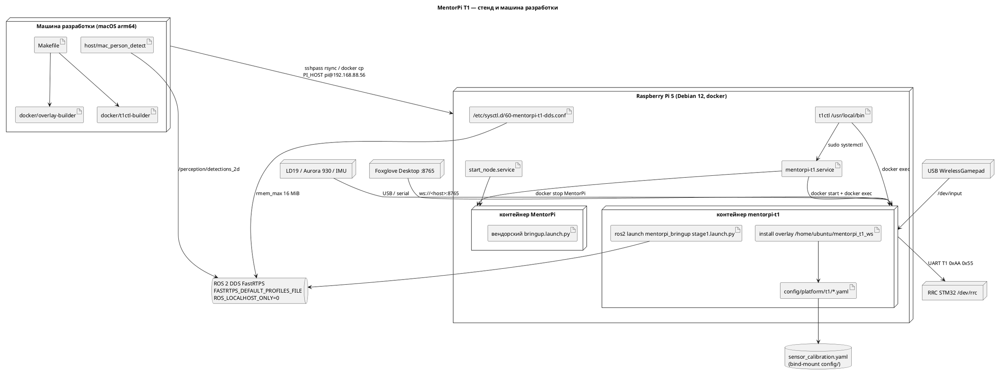
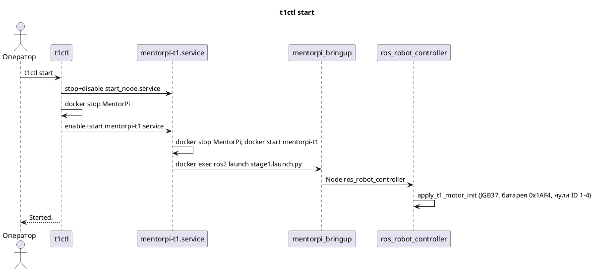
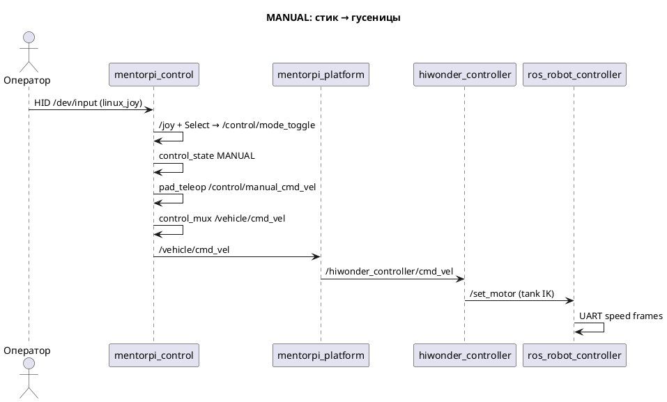
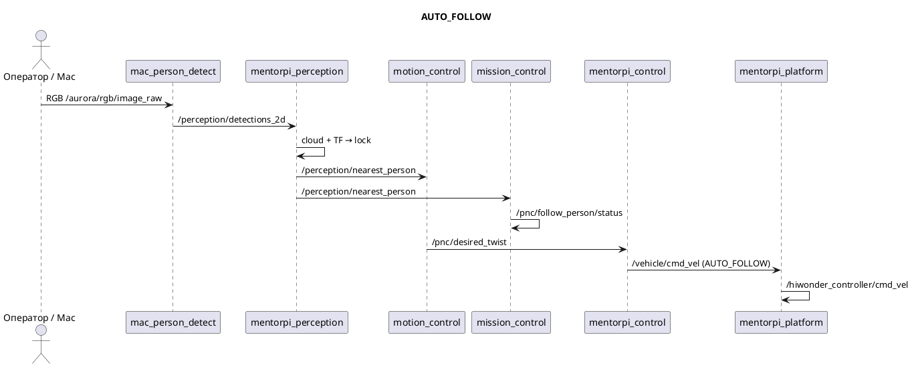
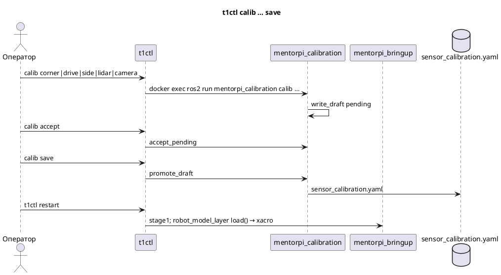
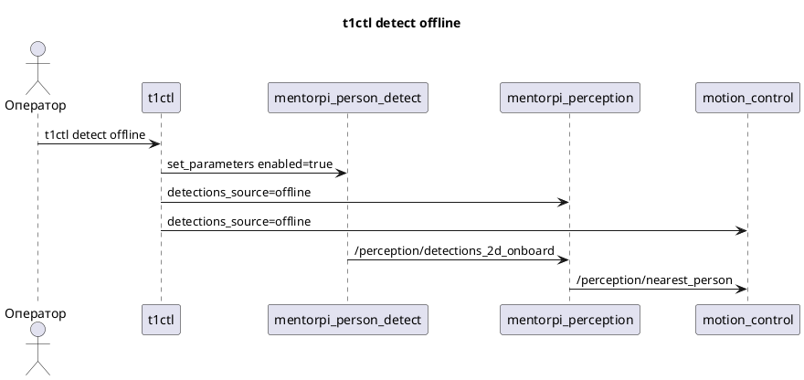

# Reverse-architecture: MentorPi T1

## Назначение
Overlay ROS 2 Humble для гусеничного Hiwonder MentorPi T1 на Raspberry Pi 5: после загрузки стенд гоняет этот контур вместо учебных приложений вендора. На хосте Debian работает CLI `t1ctl`; ноды живут в Docker-контейнере `mentorpi-t1` (образ поверх стокового `MentorPi`). Оператор вручную ведёт шасси с USB-пульта или включает следование за человеком; детекции человека по умолчанию приходят с Mac по DDS.

## Функционал
1. Контур на стенде
   1. Demo-режим (наш overlay)
      1. `t1ctl start` / `restart`: стоп `start_node.service` и контейнера `MentorPi`, старт `mentorpi-t1.service`
      2. Автозапуск после загрузки через `mentorpi-t1.service` (`Restart=no`)
      3. Останов юнита: `t1-stop` убивает launch/ноды и шлёт UART halt на `/dev/rrc`
   2. Stock-режим Hiwonder
      1. `t1ctl stock`: стоп нашего юнита и контейнера `mentorpi-t1`, старт `MentorPi` + `start_node.service`
   3. Статус `t1ctl` / `t1ctl status`
      1. Поля: `demo`, `stock`, `chassis`, `mode`/`reason`, `remote controller`, `lidar`, `camera`, `imu`, `odometry`, `platform model`, `calibration`, `dds buffers`, `version`
2. Режимы движения
   1. AUTO_FOLLOW (старт по умолчанию)
      1. `motion_control` пишет `/pnc/desired_twist`; mux пропускает это на `/vehicle/cmd_vel`
      2. Нет заднего хода и нет доворота на месте; стоп по гейту мгновенный
      3. При `coasting` у ближайшего человека закон не ведёт (нули)
   2. MANUAL
      1. Стик USB-пульта → `/control/manual_cmd_vel` → mux → шасси
      2. Нет свежего Joy за `cmd_freshness_ms` (100 мс) → нули; `remote controller` inactive через 1 с
   3. FORBIDDEN
      1. `t1ctl mode forbid` / сервис `/control/set_mode`; Select на пульте из FORBIDDEN не выводит
      2. Адаптер и mux отдают нули на шасси
   4. Переключение режима
      1. Select на `/joy` (кнопка 8) или `/ros_robot_controller/joy` (кнопка 10): MANUAL ↔ AUTO_FOLLOW
      2. `t1ctl mode allow` → AUTO_FOLLOW; `t1ctl mode manual` → MANUAL
3. Слежение за человеком
   1. Источник 2D-детекций
      1. `mac` (по умолчанию): `/perception/detections_2d` с Mac
      2. `offline`: `/perception/detections_2d_onboard` с ноды `person_detect_pi` (YOLO11n NCNN, по умолчанию `enabled=false`)
      3. Переключение: `t1ctl detect mac|offline` (параметры на `person_perception`, `person_detect_pi`, `motion_control`)
   2. Оценка положения
      1. Bbox + `/aurora/points2` + TF `depth_camera_link` → `base_footprint`
      2. Lock ближайшего: гистерезис, handover, coast до `target_lost_s`
   3. Статус миссии
      1. `/pnc/follow_person/status`: INACTIVE / HOLD / FOLLOWING (по режиму и `valid`+свежести nearest; флаг `coasting` не читается)
4. Датчики и модель платформы
   1. Лидар → `/scan` (LD19 / A1 / вендорский G4 по `LIDAR_TYPE` из `.hiwonderrc`)
   2. Depth-камера Aurora 930 (namespace `aurora`): RGB, depth, `/aurora/points2`
   3. IMU вендора → `/imu`; overlay `imu_odometry` → `/imu_odom` (ориентация, позиция 0)
   4. URDF `mentorpi_t1.urdf.xacro` через `robot_state_publisher`; позы креплений из файла калибровки
5. Калибровка креплений
   1. Этапы: `corner`, `drive`, `side`, ручной `lidar` / `camera`
   2. Черновик: `accept` / `reject` / `abort`
   3. `save` пишет YAML; живой TF меняется только после `t1ctl restart`
6. Наблюдение
   1. Foxglove WebSocket `:8765` (в `stage1` по умолчанию `viewer_bridge:=true`; отдельно `t1ctl viewer start|stop`)
   2. Мост read-only: клиент не публикует топики и не вызывает сервисы
   3. Overlay bbox: `t1ctl debug on` → `/perception/persons/overlay`
7. Сборка и выкладка с машины разработки
   1. `make overlay` / `make t1ctl` — linux/arm64 в `build-arm64/`
   2. `make deploy` — overlay + `t1ctl` на Pi, restart контейнера
   3. `make provision` — образ `mentorpi-t1` FROM стокового, контейнер, enable нашего юнита
   4. `make mac-detect` — YOLO на Mac (pixi, не Docker)

## Развёртывание

## Потоки
### Включить demo-контур

### Ручное движение с пульта

### Следование за человеком

### Калибровка крепления датчиков

### Источник детекций Mac / onboard

## Программные интерфейсы

### CLI `t1ctl` (хост Pi, C++17, без ROS-линковки)
1. Глобально
   1. без подкоманды → `status`; `-h/--help`; `-V/--version` (`t1ctl 1.8.0`)
2. Контур
   1. `start`, `restart`, `stock`
3. `viewer` `status|start|stop` — Foxglove `foxglove_bridge` в контейнере, TCP 8765
4. `mode` `forbid|allow|manual` — сервис `/control/set_mode` (цели 0/2/1); сам `/control/state` не публикует
5. `debug` `[on|off]` — параметр `publish_overlay` у `/person_perception`
6. `detect` `[offline|mac]` — `detections_source` + `person_detect_pi.enabled`
7. `calib`
   1. без аргументов / `status` → `ros2 run mentorpi_calibration calib show`
   2. `corner [--timeout]`, `drive [--timeout]`, `side --side left|right [--timeout]`
   3. `lidar --height --pitch --roll`, `camera --height`
   4. `accept`, `reject`, `save`, `abort`

### ROS 2 топики (overlay)
1. Управление
   1. `/control/state` `mentorpi_msgs/ControlState` (transient_local): 0 FORBIDDEN, 1 MANUAL, 2 AUTO_FOLLOW
   2. `/control/status` `ControlStatus`: `state`, `remote_controller`, `reason`
   3. `/control/mode_toggle` `std_msgs/Empty`
   4. `/control/remote_controller` `std_msgs/Bool`
   5. `/control/manual_cmd_vel` `geometry_msgs/Twist` — только `pad_teleop` в MANUAL
   6. `/control/motion_restriction` `MotionRestriction` — `stub_graph`: `stop_request=false`
   7. `/vehicle/cmd_vel` `Twist` — единственный publisher: `control_mux`
   8. `/vehicle/status` `ChassisStatus`: `command_timeout`, `forbidden`
   9. `/pnc/desired_twist` `Twist` — `motion_control`
   10. `/pnc/follow_person/status` `FollowPersonStatus`: INACTIVE=0, HOLD=1, FOLLOWING=2
2. Шасси вендора
   1. `/hiwonder_controller/cmd_vel` `Twist` — единственный overlay-publisher: `platform_adapter`
   2. `/ros_robot_controller/set_motor` — `odom_publisher`
   3. `/odom_raw` `nav_msgs/Odometry`
   4. `/ros_robot_controller/joy`, `~/imu_raw`, `~/battery`, …
3. Сенсоры
   1. `/scan` `sensor_msgs/LaserScan`
   2. `/aurora/rgb/image_raw`, `/aurora/depth/image_raw`, `/aurora/points2`, `*/camera_info`
   3. `/imu` `sensor_msgs/Imu`; `/imu_odom` `nav_msgs/Odometry`
   4. `/robot_description` `std_msgs/String`
4. Perception
   1. `/perception/detections_2d` `vision_msgs/Detection2DArray` (Mac)
   2. `/perception/detections_2d_onboard` (Pi YOLO)
   3. `/perception/persons` `PersonArray`
   4. `/perception/nearest_person` `NearestPerson`: `valid`, `coasting`, `PersonHypothesis {track_id,x,y,range,confidence}`
   5. `/perception/persons/overlay` `Image` (если `publish_overlay`)
   6. `/perception/dds_peer` `std_msgs/String` (transient_local): IP Ethernet `192.168.88.56` или Wi-Fi AP `192.168.149.1` по ICMP ping хоста `192.168.88.57`
5. Пульт
   1. `/joy` `sensor_msgs/Joy` — `linux_joy`

### ROS 2 сервисы
1. `/control/set_mode` `mentorpi_msgs/srv/SetControlMode`
   1. request: `uint8 target_state`
   2. response: `bool success`, `uint8 active_state`, `string reason`
2. `{node}/get_parameters`, `{node}/set_parameters` — `t1ctl debug/detect`
3. `hiwonder_controller/load_calibrate_param` `Trigger`
4. `/ros_robot_controller/init_finish` `Trigger`

### Параметры (ключевые runtime)
1. `person_perception.detections_source`: `"mac"` | `"offline"` (YAML default `mac`)
2. `person_perception.publish_overlay`: bool, default `false`
3. `person_detect_pi.enabled`: bool, default `false`
4. `motion_control.detections_source`: `"mac"` | `"offline"`; таймаут nearest 300 мс (mac) / 1000 мс (offline)
5. `linux_joy.device` пусто → `/dev/input/by-id/*` с подстрокой `WirelessGamepad`, иначе первый `/dev/input/js0`…`js15`

### Storage
1. `/home/ubuntu/mentorpi_t1_ws/config/platform/t1/sensor_calibration.yaml` (на хосте Pi тот же каталог bind-mount)
   1. Принятые позы креплений; читает `robot_model_layer` при старте
2. `sensor_calibration.draft.yaml` — черновик + `pending`
3. Переопределение каталога: env `T1_CALIBRATION_DIR`
4. `/tmp/t1ctl-side_frame.png` — кадр после `calib side` (`docker cp`)
5. `hiwonder_controller/config/calibrate_params.yaml` — `linear_correction_factor: 0.96`, `angular_correction_factor: 0.98`

### Make / Docker (машина разработки)
1. Образы: `mentorpi-overlay-builder:arm64` (`FROM ros:humble`), `mentorpi-t1ctl-builder:arm64` (`FROM debian:12`)
2. Runtime-образ на Pi: `mentorpi-t1` `FROM ${BASE_IMAGE}` стокового контейнера `MentorPi`
3. Цели: `env`, `build`, `overlay`, `t1ctl`, `deploy`, `provision`, `mac-detect`, `pi-detect`, `echo-detections`, `clean`
4. Env: `PI_HOST` (default `pi@192.168.88.56`), `PI_PASSWORD`, `PI_STAGING=/home/pi/mentorpi_t1_ws`, `CONTAINER=mentorpi-t1`, `FORCE_REBUILD`

### systemd / sysctl (хост Pi)
1. Юнит `mentorpi-t1.service`: `Conflicts=start_node.service`, `User=pi`, `Restart=no`
2. ExecStart: `docker exec -u ubuntu` → source `.hiwonderrc`, `ROS_LOCALHOST_ONLY=0`, `MACHINE_TYPE=MentorPi_Tank`, `DEPTH_CAMERA_TYPE=aurora`, `ros2 launch mentorpi_bringup stage1.launch.py`
3. ExecStop: `t1-stop`
4. `/etc/sudoers.d/t1ctl`: passwordless `systemctl` для двух юнитов, пользователь `pi`
5. `net.core.rmem_max = 16777216`

## Компоненты

| Компонент | Путь | Роль |
|-----------|------|------|
| `t1ctl` | `host/t1ctl` | Хостовый CLI статуса, контура, режима, calib, viewer, detect |
| `mentorpi-t1.service` | `host/systemd/mentorpi-t1.service` | Автозапуск overlay в Docker |
| `mentorpi_bringup` | `src/mentorpi_bringup` | `stage1.launch.py` и слои сенсоров/модели/Foxglove |
| `mentorpi_control` | `src/mentorpi_control` | Режим, пульт, mux `/vehicle/cmd_vel` |
| `mentorpi_platform` | `src/mentorpi_platform` | Адаптер на вендорский `cmd_vel` |
| `mentorpi_stubs` | `src/mentorpi_stubs` | Заглушка `/control/motion_restriction` |
| `mission_control` | `src/mission_control` | Статус FollowPerson, Twist не считает |
| `motion_control` | `src/motion_control` | Закон следования → `/pnc/desired_twist` |
| `mentorpi_perception` | `src/mentorpi_perception` | 2D + облако → persons / nearest |
| `mentorpi_person_detect` | `src/mentorpi_person_detect` | Onboard YOLO11n NCNN |
| `mentorpi_localization` | `src/mentorpi_localization` | `/imu` → `/imu_odom` |
| `mentorpi_description` | `src/mentorpi_description` | URDF/xacro и меши |
| `mentorpi_calibration` | `src/mentorpi_calibration` | Файл калибровки и CLI `calib` |
| `mentorpi_msgs` | `src/mentorpi_msgs` | Сообщения и `SetControlMode` |
| `ros_robot_controller` | `src/ros_robot_controller` | UART T1 / STM32 |
| `hiwonder_controller` | `src/hiwonder_controller` | Tank IK, одометрия, моторы |
| `mac_person_detect` | `host/mac_person_detect` | YOLO11n на Mac → DDS |
| Сборка и выкладка | `Makefile`, `mk/`, `docker/` | Cross-build arm64, deploy, provision |

### t1ctl
1. C++17, CLI11; версия `1.8.0`. ROS вызывает через `docker exec` и встроенные `ros_probe.py` / `ros_mode.py` / `ros_debug.py` / `ros_detect.py`.
2. Зависит от systemd, Docker, sudoers; SSH в коде нет.

### mentorpi-t1.service
1. Держит взаимное исключение со стоком: Pre stop `MentorPi`, start контейнера `mentorpi-t1`, затем launch.
2. Зависит от Docker и скриптов `t1-stop` / `t1-uart-halt` в `mentorpi_bringup`.

### mentorpi_bringup
1. Версия `0.7.0`. Собирает граф: control, stub, RRC, odom, adapter, perception, detect, mission, motion + include слоёв. Env `FASTRTPS_DEFAULT_PROFILES_FILE` → `config/fastdds_camera_frames.xml` (UDPv4 8 МиБ).
2. Вендорские пакеты камеры/лидара/IMU не в этом репозитории: `deptrum-ros-driver-aurora930`, `ldlidar_stl_ros2` / `sllidar_ros2` / `hiwonder_peripherals`, `laser_filters`, `foxglove_bridge`.

### mentorpi_control
1. Ноды `control_state` (владелец режима, default AUTO_FOLLOW), `linux_joy`, `pad_teleop`, `control_mux`. Версия `0.1.1`.
2. Mux: `stop_request` → нули; MANUAL → manual twist; AUTO_FOLLOW → follow twist; иначе нули.

### mentorpi_platform
1. Нода `platform_adapter`: `/vehicle/cmd_vel` + `/control/state` → `/hiwonder_controller/cmd_vel` и `/vehicle/status`. Timeout команды 100 мс или FORBIDDEN → нули. Версия `0.1.0`.
2. Не выбирает MANUAL vs FOLLOW.

### mentorpi_stubs
1. Нода `stub_graph` ~10 Гц: `stop_request: false`. Не публикует `/control/state`, `/vehicle/cmd_vel`, `/pnc/desired_twist`. Версия `0.2.0`.
2. Охраны столкновений в коде нет.

### mission_control
1. FOLLOWING если AUTO_FOLLOW и nearest `valid` и свежий; иначе при AUTO_FOLLOW — HOLD; иначе INACTIVE. Версия `0.1.0`.
2. `coasting` не учитывает.

### motion_control
1. П-закон по дистанции и пеленгу; `linear_x ≥ 0`; `angular_z = 0` при нулевой линейной. Launch: `standoff=0.5`, `max_linear=0.37`, `max_linear_follow=0.25`. Версия `0.4.1`.
2. Гейт: AUTO_FOLLOW ∧ valid ∧ ¬coasting ∧ fresh.

### mentorpi_perception
1. Маршрутизация детекций по `detections_source`; lock цели; ping Ethernet для `/perception/dds_peer`. Версия `0.7.0`.
2. Зависит от облака Aurora, TF, опционально RGB для overlay.

### mentorpi_person_detect
1. NCNN `models/yolo11n.ncnn.param` + ByteTrack; `infer_period_ms=500`; при `enabled=false` молчит. Версия `0.2.0`.
2. Не Hailo и не Mac-пайплайн.

### mentorpi_localization
1. Нода `imu_odometry`: ориентация IMU, повёрнутая в base; позиция всегда 0; твист угловой. Версия `0.1.0`.
2. TF не публикует.

### mentorpi_description
1. `urdf/mentorpi_t1.urdf.xacro`: `base_footprint` → `base_link` → lidar / imu / depth_cam; optical joints не калибруются. Версия `0.1.2`.
2. Аргументы xacro подставляет `mentorpi_calibration.xacro_mappings`.

### mentorpi_calibration
1. Console script `calib`; стадии в `stages/`. Версия `0.4.0`. Не нода `stage1`.
2. `t1ctl` только проксирует `ros2 run` в контейнере.

### mentorpi_msgs
1. Msg: `ControlState`, `ControlStatus`, `ChassisStatus`, `MotionRestriction`, `FollowPersonStatus`, `NearestPerson`, `PersonHypothesis`, `PersonArray`. Srv: `SetControlMode`. Версия `1.2.0`.

### ros_robot_controller
1. Python-нода UART: пакет `0xAA 0x55 <func> <len> payload crc8`. Старт: тип мотора JGB37 ×2, батарея `0x1AF4`, нули ID 1–4. Версия `0.0.0`.
2. Кадр скорости `+0.0` сам по себе STM32 не останавливает — нужен init (это же делает `t1-uart-halt`).

### hiwonder_controller
1. `odom_publisher`: tank IK (`wheelbase=0.1368`, `track_width=0.1446`, `wheel_diameter=0.075`), dead-reckoning `odom`→`base_footprint`, публикация `set_motor`. `MACHINE_TYPE=MentorPi_Tank`. Версия `0.0.0`.
2. `init_pose` в `stage1` не запускается.

### mac_person_detect
1. `person_detect.py` (pixi, RoboStack Humble, Ultralytics YOLO11n `.pt`, MPS): sub RGB, pub `/perception/detections_2d`; смотрит `/perception/dds_peer`.
2. `make mac-detect` / `mk/mac-detect.sh`; `ROS_DOMAIN_ID` default `1`.

### Сборка и выкладка
1. `colcon --base-paths src --packages-up-to mentorpi_bringup mentorpi_platform mentorpi_calibration`. Overlay не собирают на Pi.
2. `mk/deploy.sh` копирует install, `t1ctl`, unit, sudoers, sysctl; в существующий контейнер — `docker cp` + `t1ctl restart`. `docker rm MentorPi` не вызывается.

## Неясно из кода
- README утверждает, что в Manual `pad_teleop` пишет `/vehicle/cmd_vel`; в коде publisher этого топика — только `control_mux`, а `pad_teleop` пишет `/control/manual_cmd_vel`.
- README в блоке «Состав» описывает `stage1` без `control_mux` / perception / follow; фактический launch их поднимает. Раздел «Операторский CLI» не перечисляет `mode` / `detect` / `debug` / `viewer` — они есть в `main.cpp`. Пример статуса с `version 1.5.0` расходится с `t1ctl 1.8.0`.
- README указывает `scripts/` для сборки/деплоя; в репозитории это `Makefile` + `mk/`.
- `ROS_DOMAIN_ID`, `LIDAR_TYPE` и прочий vendor env задаются в `/home/ubuntu/ros2_ws/.hiwonderrc` внутри образа `MentorPi` — файла нет в этом git.
- Юнит `start_node.service` и содержимое стокового `bringup.launch.py` в репозитории отсутствуют.
- Ноды `deptrum-ros-driver-aurora930`, `ldlidar_stl_ros2` / `sllidar_ros2`, `hiwonder_peripherals` (IMU filter, lidar G4) живут в вендорском образе; исходников здесь нет.
- ICMP-цель `ethernet_ping_host: 192.168.88.57` в YAML — в коде это «хост для ping Ethernet», без фиксации, что это за машина.
- Значение `ROS_DOMAIN_ID` на живом стенде из этого репозитория не восстановить (скрипты Mac подставляют `1` по умолчанию).
- Совместный запуск двух источников Joy (`/joy` и `/ros_robot_controller/joy`) не запрещён: оба могут слать Select и стик в одну `pad_teleop`.
